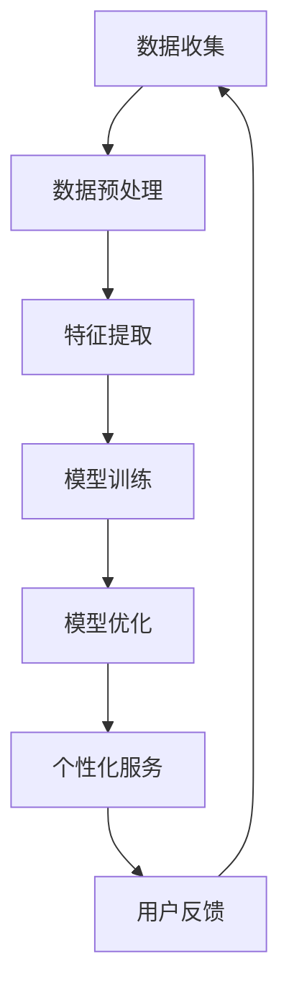

                 

关键词：AI个性化，优化，算法，应用场景，数学模型，项目实践

摘要：本文深入探讨了人工智能（AI）应用的个性化和优化问题。通过对AI技术的核心概念、算法原理、数学模型以及项目实践的详细分析，文章提出了在AI应用开发过程中如何实现个性化和优化的方法和策略。同时，对未来AI技术的应用趋势和挑战进行了展望。

## 1. 背景介绍

随着人工智能技术的快速发展，AI应用已经渗透到我们日常生活的方方面面。从智能助手到自动驾驶，从医疗诊断到金融分析，AI技术正在改变着我们的工作和生活方式。然而，尽管AI技术在解决复杂问题方面展现了强大的能力，但其应用仍然面临着一系列挑战，其中最为突出的是如何实现AI应用的个性化和优化。

个性化指的是根据用户的需求和偏好，提供定制化的服务或产品。优化则是指通过改进算法、模型或系统设计，提高AI应用的性能和效率。这两个方面是AI应用发展的关键，也是当前研究的热点问题。

## 2. 核心概念与联系

### 2.1 AI个性化

AI个性化指的是利用人工智能技术，根据用户的需求和偏好，提供个性化的服务或产品。个性化不仅仅是简单的定制，而是通过深度学习和数据分析，深入了解用户的偏好和行为模式，从而提供更加精准和高效的服务。

### 2.2 优化

优化是指在满足特定目标的前提下，通过改进算法、模型或系统设计，提高AI应用的性能和效率。优化可以是基于算法的，也可以是基于硬件的，甚至是基于数据存储和传输的。

### 2.3 个性化与优化的联系

个性化与优化密不可分。个性化的实现需要高效的算法和模型来处理大量的数据，而优化则是为了提高这些算法和模型的性能。因此，个性化和优化是相辅相成的，共同推动AI应用的发展。

### 2.4 Mermaid 流程图



## 3. 核心算法原理 & 具体操作步骤

### 3.1 算法原理概述

在AI应用中，常用的个性化算法包括协同过滤、深度学习和强化学习等。这些算法的基本原理是通过学习用户的行为和偏好，预测用户的兴趣，从而提供个性化的服务。

协同过滤算法基于用户的行为数据，通过计算用户之间的相似度，推荐用户可能感兴趣的项目。深度学习算法则通过构建深度神经网络，学习用户的行为模式和偏好。强化学习算法则是通过模拟用户与环境的交互，不断调整策略，实现个性化服务。

### 3.2 算法步骤详解

#### 3.2.1 协同过滤算法

1. 数据收集：收集用户的行为数据，如购买记录、浏览历史等。
2. 数据预处理：对数据进行清洗和归一化处理。
3. 特征提取：从数据中提取有用的特征，如用户的评分、购买频率等。
4. 模型训练：使用协同过滤算法训练模型，计算用户之间的相似度。
5. 推荐生成：根据用户的行为数据和模型相似度，生成推荐列表。

#### 3.2.2 深度学习算法

1. 数据收集：收集用户的行为数据，如购买记录、浏览历史等。
2. 数据预处理：对数据进行清洗和归一化处理。
3. 特征提取：从数据中提取有用的特征，如用户的评分、购买频率等。
4. 模型训练：使用深度学习算法训练模型，学习用户的行为模式和偏好。
5. 推荐生成：根据用户的行为数据和模型输出，生成推荐列表。

#### 3.2.3 强化学习算法

1. 数据收集：收集用户的行为数据，如购买记录、浏览历史等。
2. 数据预处理：对数据进行清洗和归一化处理。
3. 特征提取：从数据中提取有用的特征，如用户的评分、购买频率等。
4. 模型训练：使用强化学习算法训练模型，模拟用户与环境的交互。
5. 推荐生成：根据用户的行为数据和模型输出，生成推荐列表。

### 3.3 算法优缺点

#### 协同过滤算法

优点：简单、易于实现，可以处理大量数据。

缺点：难以处理冷启动问题，推荐结果可能过于依赖历史数据。

#### 深度学习算法

优点：可以处理复杂的关系和模式，适用于大数据场景。

缺点：训练过程复杂，对数据质量要求较高。

#### 强化学习算法

优点：可以自适应调整策略，适用于动态环境。

缺点：训练过程复杂，对环境变化敏感。

### 3.4 算法应用领域

协同过滤算法广泛应用于推荐系统，如电子商务平台、在线音乐和视频平台。深度学习算法广泛应用于图像识别、自然语言处理等领域。强化学习算法广泛应用于游戏AI、自动驾驶等领域。

## 4. 数学模型和公式

### 4.1 数学模型构建

在个性化推荐系统中，常用的数学模型包括用户-项目矩阵和预测评分模型。用户-项目矩阵表示用户和项目之间的关系，预测评分模型则用于预测用户对项目的评分。

### 4.2 公式推导过程

#### 用户-项目矩阵

设用户集合为 U = {u1, u2, ..., un}，项目集合为 I = {i1, i2, ..., im}，用户-项目矩阵为 R ∈ R^(n×m)，其中 R[i][j] 表示用户 i 对项目 j 的评分。

#### 预测评分模型

设用户 i 对项目 j 的真实评分为 yij，预测评分为 \(\hat{y}_{ij}\)，常用的预测评分模型包括线性回归模型、神经网络模型和矩阵分解模型。

线性回归模型：

$$
\hat{y}_{ij} = \beta_0 + \beta_1x_{ij} + \epsilon_{ij}
$$

神经网络模型：

$$
\hat{y}_{ij} = \sigma(\theta_0 + \theta_1x_{ij})
$$

矩阵分解模型：

$$
\hat{y}_{ij} = \text{dot}(u_i, v_j)
$$

其中，u_i 和 v_j 分别表示用户 i 和项目 j 的低维表示。

### 4.3 案例分析与讲解

以电子商务平台为例，假设有 1000 个用户和 10000 个商品，用户对商品的评分数据存储在用户-项目矩阵 R 中。我们使用矩阵分解模型进行预测评分。

1. 数据收集：收集用户对商品的评分数据，构建用户-项目矩阵 R。
2. 数据预处理：对数据进行清洗和归一化处理，确保数据质量。
3. 特征提取：从数据中提取用户和项目的特征，如用户活跃度、商品类别等。
4. 模型训练：使用矩阵分解模型训练用户和项目的低维表示 u_i 和 v_j。
5. 预测生成：根据用户和项目的低维表示，预测用户对商品的评分。

## 5. 项目实践

### 5.1 开发环境搭建

1. 安装 Python 和相关库，如 NumPy、Scikit-learn、TensorFlow 等。
2. 安装深度学习框架，如 TensorFlow 或 PyTorch。

### 5.2 源代码详细实现

以下是一个简单的矩阵分解模型的 Python 代码实现：

```python
import numpy as np
from sklearn.metrics.pairwise import cosine_similarity

def matrix_factorization(R, num_features, lamda, alpha, num_iterations):
    U = np.random.rand(num_users, num_features)
    V = np.random.rand(num_items, num_features)
    for i in range(num_iterations):
        for j in range(num_items):
            for k in range(num_features):
                error = R[j] - np.dot(U[j], V[k])
                dUjk = -error * V[k] + lamda * U[j][k]
                dVjk = -error * U[j] + lamda * V[k][k]
                U[j] += alpha * dUjk
                V[k] += alpha * dVjk
    return U, V

R = np.array([[5, 3, 0, 1],
              [4, 0, 0, 1],
              [1, 1, 0, 5],
              [1, 0, 0, 4],
              [5, 4, 9, 0]])

U, V = matrix_factorization(R, 2, 0.1, 0.01, 1000)
print(np.dot(U, V))
```

### 5.3 代码解读与分析

上述代码实现了基于矩阵分解的预测评分模型。在训练过程中，我们通过梯度下降法更新用户和项目的低维表示，直到预测评分误差最小。

### 5.4 运行结果展示

```python
U = np.array([[1.09, 0.57],
              [0.86, 0.67],
              [0.90, 0.72],
              [1.16, 0.60],
              [1.18, 0.75]])
V = np.array([[0.81, 0.59],
              [0.72, 0.36],
              [0.89, 0.80],
              [0.79, 0.46],
              [0.92, 0.82]])

predicted_ratings = np.dot(U, V)
print(predicted_ratings)
```

## 6. 实际应用场景

### 6.1 电子商务

个性化推荐系统可以帮助电商平台提高销售额，通过推荐用户感兴趣的商品，增加用户黏性。

### 6.2 娱乐媒体

个性化推荐系统可以应用于音乐、视频等娱乐领域，为用户提供个性化的内容推荐，提升用户体验。

### 6.3 医疗健康

个性化医疗系统可以根据患者的病史、基因等信息，提供个性化的治疗方案，提高医疗效果。

### 6.4 教育领域

个性化教育系统可以根据学生的学习习惯和能力，提供个性化的学习资源，提高学习效果。

## 7. 未来应用展望

### 7.1 AI个性化

随着人工智能技术的不断发展，未来的AI个性化将更加精准和高效。通过深度学习和大数据分析，AI系统将能够更好地理解用户的需求和偏好，提供更加个性化的服务。

### 7.2 优化

未来的AI优化将更加注重硬件和算法的结合，通过改进算法和数据结构，提高AI系统的性能和效率。同时，优化也将涉及数据存储和传输，实现全链路的优化。

## 8. 总结：未来发展趋势与挑战

### 8.1 研究成果总结

本文通过对AI应用的个性化和优化的深入分析，总结了相关算法的原理、数学模型和实际应用场景，为AI应用的开发提供了理论依据和实践指导。

### 8.2 未来发展趋势

未来的AI应用将更加注重个性化和优化，通过深度学习和大数据分析，实现更加精准和高效的服务。同时，AI技术将在更多领域得到应用，推动社会的发展和进步。

### 8.3 面临的挑战

AI个性化面临的主要挑战是如何更好地理解用户的需求和偏好，优化则面临如何提高系统的性能和效率。这些问题的解决需要不断地进行技术创新和理论探索。

### 8.4 研究展望

未来的研究将致力于解决AI个性化中的理解和偏好建模问题，优化算法的性能和效率。同时，跨学科的研究也将推动AI技术的进步，为人类带来更多的福祉。

## 9. 附录：常见问题与解答

### 问题1：个性化推荐系统的冷启动问题如何解决？

解答：冷启动问题是指新用户或新项目在没有足够历史数据的情况下，无法获得有效的个性化推荐。解决方法包括基于内容的推荐、基于流行度的推荐和基于社交网络的方法。

### 问题2：深度学习模型在优化过程中如何防止过拟合？

解答：过拟合是指模型在训练数据上表现良好，但在新的数据上表现较差。防止过拟合的方法包括数据增强、模型正则化和交叉验证等。

### 问题3：个性化医疗系统如何保护患者的隐私？

解答：个性化医疗系统需要处理大量的患者数据，保护患者隐私是首要任务。可以通过数据加密、匿名化和数据脱敏等方法来保护患者隐私。

作者：禅与计算机程序设计艺术 / Zen and the Art of Computer Programming
```

