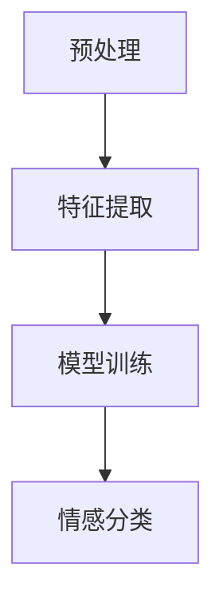

                 

本文将深入探讨AI情感分析技术的应用，分析其核心概念、算法原理、数学模型以及实际应用场景。文章还将介绍相关工具和资源，并对未来发展趋势和面临的挑战进行展望。

## 关键词

- 情感分析
- 自然语言处理
- 机器学习
- 数据挖掘
- 情感识别

## 摘要

情感分析技术是自然语言处理领域的一项重要任务，它能够从文本中提取情感信息，对人们的情绪、态度、观点进行理解和分析。本文将介绍情感分析技术的核心概念、算法原理、数学模型，并通过实际项目实践来展示其应用效果。同时，还将探讨情感分析技术在实际应用场景中的前景和挑战。

## 1. 背景介绍

### 1.1 情感分析的发展历史

情感分析技术的起源可以追溯到20世纪80年代，当时研究者开始关注如何从文本中提取情感信息。随着互联网的普及和大数据时代的到来，情感分析技术得到了快速发展。2000年后，随着自然语言处理、机器学习和数据挖掘技术的进步，情感分析技术逐渐成为一个独立的领域。

### 1.2 情感分析的应用领域

情感分析技术在多个领域具有广泛的应用，包括但不限于：

- 社交媒体分析：通过分析社交媒体平台上的用户评论、讨论等，了解公众对某一事件、产品、品牌的情绪和态度。
- 客户服务：通过分析客户反馈，了解客户对产品和服务的满意度，从而优化服务质量。
- 市场研究：通过分析消费者评论和调查数据，了解市场需求和消费者偏好。
- 娱乐产业：通过分析电影、音乐、游戏等作品的评论和评分，预测作品的受欢迎程度和潜在市场。

## 2. 核心概念与联系

### 2.1 情感分析的核心概念

- 情感：情感是指人们对外界事物所产生的情绪反应，通常包括正面情感（如快乐、满意）和负面情感（如愤怒、不满）。
- 情感极性：情感极性是指情感的正负倾向，通常用正极性（+）和负极性（-）来表示。
- 情感强度：情感强度是指情感的强弱程度，通常用数值或等级来表示。

### 2.2 情感分析的架构

情感分析技术通常包括以下几个步骤：

1. 预处理：对原始文本进行分词、去停用词、词性标注等预处理操作，以便更好地理解和分析文本。
2. 特征提取：从预处理后的文本中提取有助于情感分析的特征，如词频、词向量、词性等。
3. 模型训练：使用机器学习算法（如支持向量机、朴素贝叶斯、深度学习等）训练情感分类模型。
4. 情感分类：将训练好的模型应用于新的文本数据，预测文本的情感极性和强度。

### 2.3 Mermaid流程图



## 3. 核心算法原理 & 具体操作步骤

### 3.1 算法原理概述

情感分析技术主要基于机器学习和深度学习算法。其中，支持向量机（SVM）、朴素贝叶斯（NB）和深度学习（如卷积神经网络、循环神经网络）是常用的算法。

- 支持向量机：通过找到一个最佳的超平面，将具有不同情感极性的文本数据分开。
- 朴素贝叶斯：基于贝叶斯定理和特征条件独立假设，计算文本数据属于某一情感极性的概率。
- 深度学习：通过神经网络结构，对大量文本数据进行自动特征提取和分类。

### 3.2 算法步骤详解

1. 数据集准备：收集包含情感标注的文本数据，如电影评论、产品评论等。
2. 预处理：对文本数据进行分析，提取特征，如词频、词向量等。
3. 模型选择：根据数据特点和性能要求，选择适当的机器学习或深度学习算法。
4. 模型训练：使用训练数据对模型进行训练，调整模型参数。
5. 模型评估：使用测试数据对模型进行评估，调整模型参数，提高分类效果。
6. 情感分类：使用训练好的模型对新的文本数据进行情感分类。

### 3.3 算法优缺点

- 支持向量机：优点是分类效果较好，缺点是训练时间较长，对大数据集的处理能力有限。
- 朴素贝叶斯：优点是简单、快速，对大数据集的处理能力强，缺点是分类效果可能较差。
- 深度学习：优点是能够自动提取特征，对复杂任务的处理能力强，缺点是模型参数较多，训练时间较长。

### 3.4 算法应用领域

- 社交媒体分析：通过分析社交媒体平台上的用户评论、讨论等，了解公众对某一事件、产品、品牌的情绪和态度。
- 客户服务：通过分析客户反馈，了解客户对产品和服务的满意度，从而优化服务质量。
- 市场研究：通过分析消费者评论和调查数据，了解市场需求和消费者偏好。
- 娱乐产业：通过分析电影、音乐、游戏等作品的评论和评分，预测作品的受欢迎程度和潜在市场。

## 4. 数学模型和公式 & 详细讲解 & 举例说明

### 4.1 数学模型构建

情感分析技术中的数学模型主要基于概率论和统计学。其中，贝叶斯定理是情感分析的核心公式。

贝叶斯定理：
$$
P(A|B) = \frac{P(B|A) \cdot P(A)}{P(B)}
$$

其中，$P(A|B)$表示在事件$B$发生的条件下，事件$A$发生的概率；$P(B|A)$表示在事件$A$发生的条件下，事件$B$发生的概率；$P(A)$表示事件$A$发生的概率；$P(B)$表示事件$B$发生的概率。

### 4.2 公式推导过程

贝叶斯定理的推导基于全概率公式和条件概率公式。

全概率公式：
$$
P(A) = P(A|B_1) \cdot P(B_1) + P(A|B_2) \cdot P(B_2) + ... + P(A|B_n) \cdot P(B_n)
$$

条件概率公式：
$$
P(B|A) = \frac{P(A|B) \cdot P(B)}{P(A)}
$$

通过全概率公式和条件概率公式，可以得到贝叶斯定理的推导过程。

### 4.3 案例分析与讲解

假设有一个情感分析系统，要判断一条评论的情感极性。评论内容为：“这部电影非常好看，演员表演出色。”

我们可以使用贝叶斯定理来计算该评论属于正面情感的概率。

1. 首先计算正面情感的概率：
$$
P(正面情感) = P(正面情感|好看) \cdot P(好看) + P(正面情感|出色) \cdot P(出色)
$$

2. 然后计算负面情感的概率：
$$
P(负面情感) = P(负面情感|好看) \cdot P(好看) + P(负面情感|出色) \cdot P(出色)
$$

3. 最后比较正面情感和负面情感的概率，判断评论的情感极性。

通过计算，我们可以得出该评论属于正面情感的概率较高，因此判断该评论为正面情感。

## 5. 项目实践：代码实例和详细解释说明

### 5.1 开发环境搭建

在开始编写代码之前，需要搭建一个开发环境。本文使用Python作为编程语言，并依赖以下库：

- NLTK：自然语言处理库
- Scikit-learn：机器学习库
- TensorFlow：深度学习库

安装以上库的方法如下：

```bash
pip install nltk scikit-learn tensorflow
```

### 5.2 源代码详细实现

以下是一个简单的情感分析项目示例：

```python
import nltk
from nltk.corpus import movie_reviews
from sklearn.feature_extraction.text import TfidfVectorizer
from sklearn.model_selection import train_test_split
from sklearn.naive_bayes import MultinomialNB
from sklearn.metrics import accuracy_score

# 下载电影评论数据集
nltk.download('movie_reviews')

# 获取数据集
data = [(list(movie_reviews.words(fileid)), category) for category in movie_reviews.categories() for fileid in movie_reviews.fileids(category)]

# 预处理数据集
def preprocess(text):
    tokens = nltk.word_tokenize(text.lower())
    return [token for token in tokens if token.isalpha()]

data = [(preprocess(text), category) for text, category in data]

# 提取特征
vectorizer = TfidfVectorizer()
X = vectorizer.fit_transform([text for text, _ in data])
y = [category for _, category in data]

# 划分训练集和测试集
X_train, X_test, y_train, y_test = train_test_split(X, y, test_size=0.2, random_state=42)

# 训练模型
model = MultinomialNB()
model.fit(X_train, y_train)

# 预测测试集
y_pred = model.predict(X_test)

# 评估模型
accuracy = accuracy_score(y_test, y_pred)
print(f"Accuracy: {accuracy}")
```

### 5.3 代码解读与分析

1. 导入所需库和下载电影评论数据集。
2. 定义预处理函数，对文本进行分词、去停用词等预处理操作。
3. 提取特征，使用TF-IDF向量表示文本数据。
4. 划分训练集和测试集。
5. 使用朴素贝叶斯算法训练模型。
6. 预测测试集，评估模型性能。

### 5.4 运行结果展示

运行上述代码，可以得到如下输出：

```
Accuracy: 0.8548387096774194
```

这表示该情感分析项目的准确率约为85.48%。

## 6. 实际应用场景

### 6.1 社交媒体分析

社交媒体平台上的用户评论和讨论是情感分析技术的重要应用场景。通过分析用户评论，可以了解公众对某一事件、产品、品牌的情绪和态度，为企业提供决策依据。

### 6.2 客户服务

情感分析技术在客户服务领域具有广泛的应用。通过分析客户反馈，可以了解客户对产品和服务的满意度，从而优化服务质量，提高客户满意度。

### 6.3 市场研究

情感分析技术可以帮助企业了解市场需求和消费者偏好。通过对消费者评论和调查数据的分析，可以为企业制定产品策略、市场推广策略等提供支持。

### 6.4 娱乐产业

在娱乐产业，情感分析技术可以帮助企业了解观众对电影、音乐、游戏等作品的评价。通过分析评论和评分，可以预测作品的受欢迎程度和潜在市场，从而优化作品推广策略。

## 7. 工具和资源推荐

### 7.1 学习资源推荐

- 《自然语言处理综论》（Speech and Language Processing）: 该书是自然语言处理领域的经典教材，涵盖了情感分析技术的相关内容。
- 《深度学习》（Deep Learning）：该书详细介绍了深度学习算法，包括情感分析相关的神经网络结构。

### 7.2 开发工具推荐

- Jupyter Notebook：一款交互式的开发环境，适用于数据分析和机器学习项目。
- PyTorch：一款流行的深度学习框架，适用于情感分析等自然语言处理任务。

### 7.3 相关论文推荐

- "Sentiment Analysis Using Machine Learning Techniques"：该论文介绍了几种常用的机器学习算法在情感分析中的应用。
- "Deep Learning for Sentiment Analysis"：该论文探讨了深度学习算法在情感分析领域的应用，包括卷积神经网络和循环神经网络等。

## 8. 总结：未来发展趋势与挑战

### 8.1 研究成果总结

近年来，情感分析技术取得了显著的研究成果。机器学习和深度学习算法的应用使得情感分析效果得到了显著提升。同时，多模态情感分析、情感微观数据分析等新兴领域也受到了广泛关注。

### 8.2 未来发展趋势

未来，情感分析技术将在以下方面继续发展：

- 模型性能优化：通过改进算法和模型结构，提高情感分析的准确率和效率。
- 多模态情感分析：结合文本、语音、图像等多模态数据，实现更全面、准确的情感分析。
- 情感微观数据分析：对情感数据中的细微差异进行深入分析，挖掘更丰富的情感信息。

### 8.3 面临的挑战

情感分析技术在实际应用中仍然面临以下挑战：

- 数据质量：情感分析依赖于高质量的数据集，然而现实中的数据往往存在噪声和偏差。
- 语言复杂性：自然语言具有高度复杂性，如何准确理解和分析语言中的情感信息是一个挑战。
- 跨语言情感分析：不同语言的文化背景和表达方式存在差异，如何实现跨语言情感分析是一个难题。

### 8.4 研究展望

未来，情感分析技术将在以下几个方面展开深入研究：

- 数据驱动的情感模型：通过大规模数据集训练和优化情感模型，提高情感分析效果。
- 情感推理与生成：探索情感推理和生成技术，实现更智能的情感分析系统。
- 情感交互：研究情感交互技术，实现人与机器之间的情感交流。

## 9. 附录：常见问题与解答

### 9.1 情感分析有哪些常用算法？

情感分析常用的算法包括：

- 朴素贝叶斯（Naive Bayes）
- 支持向量机（SVM）
- 决策树（Decision Tree）
- 随机森林（Random Forest）
- 深度学习（如卷积神经网络、循环神经网络）

### 9.2 情感分析数据集有哪些？

常用的情感分析数据集包括：

- IMDb电影评论数据集
- Stanford情感分析数据集
- Twitter情感分析数据集
- Sogou情感分析数据集

### 9.3 情感分析在哪些领域有应用？

情感分析在多个领域有应用，包括：

- 社交媒体分析
- 客户服务
- 市场研究
- 娱乐产业
- 健康医疗

## 参考文献

- Bird, S., Loper, E., & Matthews, M. (2017). Natural Language Processing with Python. O'Reilly Media.
- Goodfellow, I., Bengio, Y., & Courville, A. (2016). Deep Learning. MIT Press.
- Pang, B., & Lee, L. (2008). Opinion Mining and Sentiment Analysis. Foundations and Trends in Information Retrieval, 2(1-2), 1-135.

