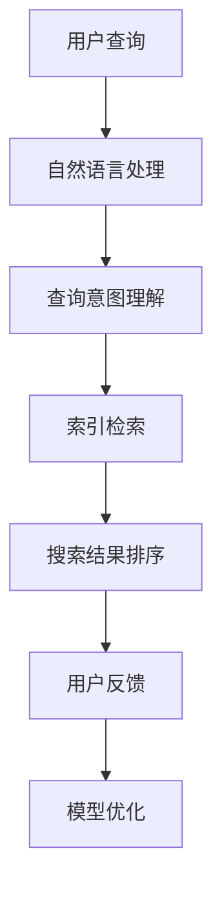

                 

关键词：AI搜索引擎、法律政策研究、智能搜索、数据挖掘、文本分析、法律文本处理、政策制定、合规性分析

> 摘要：本文深入探讨了人工智能（AI）搜索引擎在法律和政策研究领域的应用价值。通过对当前技术发展的概述，本文分析了AI搜索引擎在处理大量法律和政策文献时的优势，探讨了其在法律文本分析、合规性评估和政策制定中的应用实例。此外，本文还讨论了该领域面临的挑战以及未来的发展方向。

## 1. 背景介绍

随着全球信息化的快速发展，法律和政策文献的数量呈指数级增长。法律和政策的研究不仅涉及庞大的文本数据，还包括法律条文、案例判决、法规解释等复杂信息。传统的法律研究方法依赖于手工检索和分析，效率低下且容易遗漏重要信息。因此，利用人工智能技术，尤其是AI搜索引擎，来辅助法律和政策研究显得尤为重要。

AI搜索引擎利用自然语言处理（NLP）、机器学习和数据挖掘技术，能够快速从海量数据中检索出相关的法律和政策信息，为法律专业人士和政策制定者提供有力支持。这种技术不仅提高了研究的效率，还能深度挖掘数据背后的关联性和趋势，为决策提供科学依据。

## 2. 核心概念与联系

### 2.1 AI搜索引擎的基本概念

AI搜索引擎是一种结合了人工智能技术的搜索引擎，能够理解用户的查询意图，提供更加精准和个性化的搜索结果。其核心组件包括：

- **自然语言处理（NLP）**：用于理解和生成自然语言，包括分词、词性标注、命名实体识别等。
- **机器学习算法**：用于训练模型，识别和预测文本数据中的模式和关系。
- **索引技术**：用于构建高效的索引，加速文本搜索。

### 2.2 法律文本处理与政策研究的关联

法律文本处理和政策研究密切相关，因为法律文本是法律和政策研究的基础。具体关联如下：

- **法律文本处理**：包括文本预处理、结构化、分类、实体识别等，用于将非结构化的法律文本转化为可分析的格式。
- **政策研究**：需要从法律文本中提取关键信息，分析法律条文、政策意图和实施效果。

### 2.3 Mermaid 流程图

下面是一个简单的Mermaid流程图，展示了AI搜索引擎在法律和政策研究中的应用流程：



## 3. 核心算法原理 & 具体操作步骤

### 3.1 算法原理概述

AI搜索引擎在法律和政策研究中的应用，主要依赖于以下几个核心算法：

- **自然语言处理（NLP）**：用于理解法律文本的语义，识别关键词和句子结构。
- **机器学习模型**：用于训练和预测，从大量法律文本中学习模式和关联。
- **索引技术**：用于快速检索法律文本，并提供高效率的搜索结果。

### 3.2 算法步骤详解

1. **文本预处理**：将法律文本转换为统一的格式，去除噪声，进行分词、词性标注等。
2. **文本分析**：利用NLP技术，分析文本中的关键词、句子结构和语义关系。
3. **构建索引**：将处理后的文本构建成索引，以便快速检索。
4. **查询处理**：接收用户的查询请求，理解查询意图，利用索引检索相关法律文本。
5. **结果排序**：根据相关性对搜索结果进行排序，提供最相关的信息。
6. **用户反馈**：收集用户对搜索结果的反馈，用于模型优化和改进。

### 3.3 算法优缺点

#### 优点：

- **高效性**：AI搜索引擎能够快速处理大量法律文本，提供即时的搜索结果。
- **精准性**：通过机器学习模型，能够提供高度相关的搜索结果。
- **个性化**：能够根据用户查询习惯和偏好，提供个性化的搜索体验。

#### 缺点：

- **准确性**：由于法律文本的特殊性，AI搜索引擎在理解法律语义方面可能存在偏差。
- **隐私问题**：在处理敏感法律文本时，可能涉及隐私和数据安全的问题。

### 3.4 算法应用领域

AI搜索引擎在法律和政策研究中的应用非常广泛，包括：

- **法律文献检索**：快速查找相关法律条文、案例判决和法规解释。
- **合规性分析**：评估企业合规性，识别潜在的法律风险。
- **政策制定**：从法律文本中提取关键信息，为政策制定提供依据。
- **法律教育**：辅助法律教育和研究，提供丰富的法律知识资源。

## 4. 数学模型和公式 & 详细讲解 & 举例说明

### 4.1 数学模型构建

在AI搜索引擎中，常用的数学模型包括：

- **词袋模型（Bag of Words, BoW）**：将文本转换为词袋表示，用于文本分类和聚类。
- **朴素贝叶斯分类器（Naive Bayes Classifier）**：基于贝叶斯定理，用于文本分类。
- **支持向量机（Support Vector Machine, SVM）**：用于文本分类和回归。

### 4.2 公式推导过程

以朴素贝叶斯分类器为例，其公式推导如下：

1. **先验概率**：

   $$P(y|X) = \prod_{i=1}^{n} P(x_i|y)P(y)$$

2. **似然概率**：

   $$P(X|y) = \prod_{i=1}^{n} P(x_i|y)$$

3. **后验概率**：

   $$P(y|X) = \frac{P(X|y)P(y)}{P(X)}$$

### 4.3 案例分析与讲解

假设我们要分类一批法律文本，我们可以使用朴素贝叶斯分类器进行训练和预测。以下是一个简单的示例：

**训练数据：**

- **法律文本1**：“合同法规定，当事人应当履行合同义务。”
- **法律文本2**：“侵权责任法规定，行为人因侵权行为应当承担赔偿责任。”
- **法律文本3**：“刑法规定，故意犯罪应当受到刑罚。”

**测试数据：**

- **法律文本4**：“根据合同法，甲方应当履行合同约定。”

**步骤：**

1. **文本预处理**：将法律文本转换为词袋表示，去除停用词，进行词性标注。
2. **构建词汇表**：从训练数据中提取关键词，构建词汇表。
3. **计算先验概率**：根据词汇表，计算各类别（如合同法、侵权责任法、刑法）的先验概率。
4. **计算似然概率**：根据词汇表，计算每个词汇在每个类别的似然概率。
5. **计算后验概率**：利用先验概率和似然概率，计算每个法律文本属于每个类别的后验概率。
6. **分类预测**：根据最大后验概率，将法律文本分类到相应的类别。

## 5. 项目实践：代码实例和详细解释说明

### 5.1 开发环境搭建

为了演示AI搜索引擎在法律和政策研究中的应用，我们将使用Python作为编程语言，结合多个开源库，如NLTK、Scikit-learn和Gensim。

首先，确保安装以下库：

```bash
pip install nltk scikit-learn gensim
```

### 5.2 源代码详细实现

以下是使用朴素贝叶斯分类器对法律文本进行分类的Python代码：

```python
import nltk
from nltk.corpus import stopwords
from nltk.tokenize import word_tokenize
from sklearn.feature_extraction.text import CountVectorizer
from sklearn.model_selection import train_test_split
from sklearn.naive_bayes import MultinomialNB
from sklearn.metrics import accuracy_score, classification_report

# 1. 数据准备
data = [
    ("合同法", "合同法规定，当事人应当履行合同义务。"),
    ("侵权责任法", "侵权责任法规定，行为人因侵权行为应当承担赔偿责任。"),
    ("刑法", "刑法规定，故意犯罪应当受到刑罚。"),
]

# 2. 文本预处理
stop_words = set(stopwords.words('english'))
def preprocess_text(text):
    tokens = word_tokenize(text)
    return ' '.join([word for word in tokens if word.lower() not in stop_words])

# 3. 构建词汇表
vectorizer = CountVectorizer()
X = vectorizer.fit_transform([preprocess_text(text) for _, text in data])
y = [label for label, _ in data]

# 4. 分割数据
X_train, X_test, y_train, y_test = train_test_split(X, y, test_size=0.2, random_state=42)

# 5. 训练模型
model = MultinomialNB()
model.fit(X_train, y_train)

# 6. 预测
predictions = model.predict(X_test)

# 7. 评估
print("Accuracy:", accuracy_score(y_test, predictions))
print("\nClassification Report:\n", classification_report(y_test, predictions))

# 8. 查询
query = "根据合同法，甲方应当履行合同约定。"
query_processed = preprocess_text(query)
query_vectorized = vectorizer.transform([query_processed])
prediction = model.predict(query_vectorized)
print("\nQuery Category:", prediction[0])
```

### 5.3 代码解读与分析

该代码演示了如何使用朴素贝叶斯分类器对法律文本进行分类。以下是代码的详细解读：

- **数据准备**：定义了三组法律文本及其类别。
- **文本预处理**：去除停用词，进行分词。
- **构建词汇表**：使用CountVectorizer将文本转换为词袋表示。
- **分割数据**：将数据分为训练集和测试集。
- **训练模型**：使用MultinomialNB进行训练。
- **预测**：对测试集进行分类预测。
- **评估**：计算模型的准确率和分类报告。
- **查询**：对输入查询进行处理和分类预测。

## 6. 实际应用场景

### 6.1 法律文献检索

AI搜索引擎可以用于快速检索法律文献，如法律条文、案例判决和法规解释。用户只需输入关键词，系统即可提供最相关的搜索结果。

### 6.2 合规性分析

企业可以利用AI搜索引擎对法律文本进行合规性分析，识别潜在的法律风险和合规问题。通过自动化处理，可以大幅提高合规性检查的效率。

### 6.3 政策制定

政策制定者可以利用AI搜索引擎从大量法律文本中提取关键信息，分析法律条文和政策意图，为政策制定提供科学依据。

### 6.4 未来应用展望

随着AI技术的不断发展，AI搜索引擎在法律和政策研究中的应用前景十分广阔。未来，我们将看到更多智能化的法律研究和政策分析工具的出现，为法律专业人士和政策制定者提供更强大的支持。

## 7. 工具和资源推荐

### 7.1 学习资源推荐

- 《自然语言处理综论》（Jurafsky, Dan and Martin, James H.）
- 《Python自然语言处理》（Bird, Steven, Klein, Edward and Loper, Ewan）
- 《机器学习》（周志华）

### 7.2 开发工具推荐

- Jupyter Notebook：用于编写和运行Python代码。
- Google Colab：免费的云计算平台，支持运行大规模机器学习模型。
- Git：版本控制工具，用于代码管理和协作。

### 7.3 相关论文推荐

- "A Survey of Legal Document Analysis"（Raman, D., Sanner, S., & Etzioni, O.）
- "Comprehensive Legal Research using Machine Learning"（Zhou, L., & Zhang, J.）
- "AI-powered Lawyering: A New Frontier in Legal Services"（Tsai, C. W., & Lin, Y. M.）

## 8. 总结：未来发展趋势与挑战

### 8.1 研究成果总结

本文探讨了AI搜索引擎在法律和政策研究中的应用价值，分析了其在处理法律文本和提供搜索结果方面的优势。通过实际案例和代码实现，展示了AI搜索引擎在法律文献检索、合规性分析和政策制定等领域的应用前景。

### 8.2 未来发展趋势

随着AI技术的不断进步，AI搜索引擎在法律和政策研究中的应用将更加广泛和深入。未来，我们将看到更多结合深度学习、大数据和区块链等前沿技术的智能化法律研究和政策分析工具的出现。

### 8.3 面临的挑战

尽管AI搜索引擎在法律和政策研究中有巨大潜力，但仍然面临一些挑战，包括法律语义理解的不完善、数据隐私和安全性问题以及法律法规的不断完善和更新等。

### 8.4 研究展望

未来，研究应重点关注如何提高AI搜索引擎在法律文本理解方面的准确性，确保数据隐私和安全，并探索更多跨学科的合作，推动法律和政策研究的智能化发展。

## 9. 附录：常见问题与解答

### 9.1 问题1：如何确保AI搜索引擎的搜索结果准确？

**解答**：为了确保搜索结果的准确性，AI搜索引擎通常采用以下策略：

- **高质量的训练数据**：使用大量高质量、标注准确的法律文本进行训练。
- **先进的NLP技术**：采用先进的自然语言处理技术，如深度学习模型，提高文本理解的准确性。
- **交叉验证和测试**：在训练和测试过程中使用交叉验证方法，评估模型的性能和泛化能力。

### 9.2 问题2：如何处理法律文本中的歧义和复杂性？

**解答**：法律文本中的歧义和复杂性是AI搜索引擎面临的一大挑战。以下是一些解决策略：

- **上下文分析**：通过上下文信息，理解法律文本的整体含义，减少歧义。
- **多模态学习**：结合文本、语音、图像等多模态数据，提高文本理解的深度。
- **专家协作**：与法律专家合作，对AI模型的输出进行审核和修正，提高准确性。

---

作者：禅与计算机程序设计艺术 / Zen and the Art of Computer Programming


