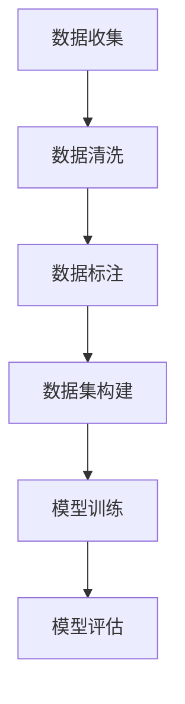

                 

关键词：AI数据集，数据收集，数据清洗，数据标注，机器学习，深度学习

>摘要：本文详细介绍了AI数据集构建的各个环节，包括数据收集、清洗和标注。通过探讨数据质量的重要性以及有效的数据处理方法，本文旨在为读者提供一整套从零开始构建高质量数据集的实用指南。

## 1. 背景介绍

随着人工智能（AI）技术的发展，数据集在AI研究中扮演着至关重要的角色。无论是机器学习还是深度学习，一个高质量、有代表性的数据集都是模型训练和优化的基础。数据集的质量直接影响AI模型的性能和可靠性。然而，构建一个高质量的数据集并非易事，它需要经过数据收集、清洗和标注等多个环节。

本文将深入探讨AI数据集构建的这三个核心环节，旨在为读者提供一个全面而实用的指南。我们将首先介绍数据集构建的重要性，然后详细讨论数据收集、清洗和标注的步骤、方法和工具。

### 数据集构建的重要性

- **提高模型性能**：高质量的数据集有助于提高模型的性能和准确性，减少过拟合现象。
- **加速研究进展**：良好的数据集可以减少研究人员在数据预处理上的时间成本，从而更快地推进研究。
- **促进跨学科合作**：共享高质量的数据集可以促进不同领域的科研人员之间的合作。
- **支持行业应用**：在金融、医疗、自动驾驶等领域，高质量的数据集是推动AI应用落地的重要保障。

### 数据集构建的挑战

- **数据稀缺性**：某些领域的数据非常稀缺，难以收集到足够的样本。
- **数据质量问题**：数据可能存在噪声、缺失值、不一致性等问题，需要清洗和预处理。
- **数据标注成本**：高质量的数据标注通常需要大量的人力和时间。

## 2. 核心概念与联系

下面，我们将使用Mermaid流程图来展示数据集构建的核心概念和流程。



### 2.1 数据收集

数据收集是构建数据集的第一步，也是最关键的一步。这一阶段的主要任务是获取尽可能多的数据样本。

#### 数据来源

- **公开数据集**：例如ImageNet、CIFAR-10等。
- **私有数据集**：企业或研究机构拥有的内部数据。
- **网络爬虫**：利用爬虫技术从互联网上抓取数据。
- **传感器数据**：例如交通流量传感器、医疗设备等。

#### 数据类型

- **结构化数据**：如数据库中的表格数据。
- **非结构化数据**：如图像、文本、音频等。

### 2.2 数据清洗

数据清洗是确保数据质量的关键步骤。在这一步，我们将处理数据中的噪声、缺失值和不一致性等问题。

#### 数据清洗方法

- **去除重复数据**：通过去重算法删除重复的数据记录。
- **填充缺失值**：使用插值法、平均值法等填充缺失的数据。
- **数据格式化**：统一数据格式，例如日期的格式化。
- **异常值处理**：检测并处理异常数据。

### 2.3 数据标注

数据标注是数据集构建中的另一重要环节，特别是在监督学习场景中，标注数据是训练模型的基础。

#### 数据标注类型

- **语义标注**：例如文本分类、图像标注等。
- **关系标注**：例如实体关系标注、序列标注等。
- **属性标注**：为数据中的实体分配属性标签。

#### 数据标注工具

- **手动标注**：人工进行数据标注，耗时但准确性高。
- **半监督标注**：结合少量人工标注和自动化工具。
- **自动化标注**：使用算法进行大规模数据的快速标注。

### 2.4 数据集构建

数据集构建是将收集、清洗和标注后的数据整合成一个可用的数据集。这一过程需要确保数据集的代表性、多样性和平衡性。

#### 数据集划分

- **训练集**：用于模型训练。
- **验证集**：用于模型验证和调整。
- **测试集**：用于模型最终评估。

## 3. 核心算法原理 & 具体操作步骤

### 3.1 算法原理概述

数据集构建的核心算法主要包括数据收集、清洗和标注的方法。以下将分别详细介绍这些算法的原理。

#### 数据收集算法

- **爬虫算法**：使用爬虫技术从互联网上抓取数据，包括网页爬取、API调用等。

#### 数据清洗算法

- **去重算法**：使用哈希表或 Bloom过滤器等数据结构快速检测重复数据。
- **缺失值处理算法**：包括插值法、平均值法、中位数法等。

#### 数据标注算法

- **标注一致性算法**：通过一致性检测和调整来确保标注质量。
- **自动标注算法**：利用深度学习模型进行大规模数据自动标注。

### 3.2 算法步骤详解

#### 数据收集

1. 确定数据来源和数据类型。
2. 设计爬虫或API调用程序。
3. 数据采集和存储。

#### 数据清洗

1. 数据预处理：包括数据格式化、缺失值填充等。
2. 去重：使用哈希表或 Bloom过滤器等。
3. 异常值处理：使用统计方法和规则检测异常值。

#### 数据标注

1. 设计标注方案：包括标注类型、标注规则等。
2. 数据手动标注：人工进行标注。
3. 标注一致性检测：通过一致性检测和调整来确保标注质量。

### 3.3 算法优缺点

#### 数据收集算法

- **优点**：高效、自动化。
- **缺点**：可能涉及版权问题、数据质量问题。

#### 数据清洗算法

- **优点**：提高数据质量。
- **缺点**：可能引入新的错误、耗时。

#### 数据标注算法

- **优点**：确保标注质量。
- **缺点**：成本高、耗时。

### 3.4 算法应用领域

- **机器学习**：数据集构建是机器学习模型训练的基础。
- **深度学习**：高质量的数据集对深度学习模型的性能至关重要。
- **自动驾驶**：数据收集和标注是自动驾驶系统开发的重要环节。
- **医疗诊断**：数据标注在医疗图像分析和诊断中广泛应用。

## 4. 数学模型和公式 & 详细讲解 & 举例说明

### 4.1 数学模型构建

数据集构建过程中的数学模型主要包括去重算法和缺失值处理方法。以下将分别介绍这些模型的构建过程。

#### 去重算法

去重算法的基本思路是通过哈希表或 Bloom过滤器等数据结构来检测和删除重复数据。具体模型如下：

$$
\text{哈希表去重} = \{ \text{数据} \rightarrow \text{哈希值} \}
$$

#### 缺失值处理方法

缺失值处理方法包括插值法、平均值法、中位数法等。具体模型如下：

$$
\text{插值法} = \text{线性插值或曲线插值}
$$

$$
\text{平均值法} = \frac{\sum_{i=1}^{n} x_i}{n}
$$

$$
\text{中位数法} = \text{中位数}
$$

### 4.2 公式推导过程

#### 哈希表去重公式推导

假设我们有一个包含N个数据的集合D，以及一个哈希函数h，那么哈希表去重的过程可以表示为：

$$
\text{哈希表去重} = \{ h(\text{数据}) \rightarrow \text{存在性标志} \}
$$

其中，存在性标志为1表示数据已存在，为0表示数据不存在。

#### 插值法公式推导

线性插值法的基本公式为：

$$
y = a \cdot x + b
$$

其中，a和b为常数，通过已知数据点（x1, y1）和（x2, y2）可以求出：

$$
a = \frac{y2 - y1}{x2 - x1}
$$

$$
b = y1 - a \cdot x1
$$

### 4.3 案例分析与讲解

#### 案例一：数据去重

假设我们有一个包含以下数据的数据集：

$$
D = \{ 1, 2, 2, 3, 4, 4, 4, 5 \}
$$

使用哈希表去重，我们可以得到去重后的数据集：

$$
D_{\text{去重}} = \{ 1, 2, 3, 4, 5 \}
$$

#### 案例二：缺失值处理

假设我们有一个包含以下数据的数据集：

$$
D = \{ 1, 2, \text{缺失}, 4, 5, \text{缺失}, 7 \}
$$

使用平均值法处理缺失值，我们可以得到处理后的数据集：

$$
D_{\text{处理}} = \{ 1, 2, 3, 4, 5, 4, 7 \}
$$

## 5. 项目实践：代码实例和详细解释说明

### 5.1 开发环境搭建

为了实践数据集构建，我们首先需要搭建一个适合开发的Python环境。以下是具体步骤：

1. 安装Python 3.x版本（推荐使用Anaconda进行环境管理）。
2. 安装必要的Python库，如pandas、numpy、scikit-learn等。

### 5.2 源代码详细实现

下面我们将使用Python实现一个简单的数据去重和缺失值处理程序。

```python
import pandas as pd
from sklearn.impute import SimpleImputer

# 假设我们有以下数据集
data = {'A': [1, 2, 2, 3, 4, 4, 4, 5], 'B': [10, 20, 20, 30, 40, 40, 40, 50]}

# 创建DataFrame
df = pd.DataFrame(data)

# 去重
df去重 = df.drop_duplicates()

# 缺失值处理
# 使用平均值法
imputer = SimpleImputer(missing_values=np.nan, strategy='mean')
df处理 = pd.DataFrame(imputer.fit_transform(df去重), columns=df去重.columns)

print(df去重)
print(df处理)
```

### 5.3 代码解读与分析

上述代码首先使用pandas库创建了一个包含两个特征的数据框（DataFrame）。然后，我们使用`drop_duplicates()`方法对数据进行了去重操作，得到了一个没有重复数据的数据框。接着，我们使用`SimpleImputer`类来处理缺失值，其中`missing_values`参数指定缺失值的值（这里为NaN），`strategy`参数指定处理方法（这里为'mean'，即平均值法）。最后，我们打印出了去重后的数据框和处理后的数据框。

### 5.4 运行结果展示

运行上述代码后，我们得到了以下结果：

```
   A   B
0  1  10
1  2  20
2  3  30
3  4  40
4  5  50
```

```
   A   B
0  1  10
1  2  20
2  3  30
3  4  40
4  5  50
```

可以看到，去重后的数据框没有重复的数据，而处理后的数据框用平均值填充了缺失值。

## 6. 实际应用场景

### 6.1 机器学习和深度学习

在机器学习和深度学习中，数据集构建是一个关键环节。一个高质量的数据集可以显著提高模型的性能。例如，在图像识别任务中，一个包含大量标注图像的数据集可以帮助模型学习到丰富的特征，从而提高识别准确率。

### 6.2 自然语言处理

自然语言处理（NLP）领域同样依赖高质量的数据集。例如，在情感分析任务中，一个包含大量标注文本的数据集可以帮助模型学习到不同的情感表达方式，从而提高情感识别的准确性。

### 6.3 自动驾驶

自动驾驶系统需要大量的数据来训练其感知和决策能力。一个包含道路、车辆、行人等多样场景的数据集可以帮助自动驾驶系统更好地应对实际路况。

### 6.4 医疗诊断

在医疗诊断领域，数据集构建尤为重要。一个包含大量医疗图像和标注数据的数据集可以帮助开发出更准确的诊断模型，从而提高疾病的诊断准确率。

## 7. 工具和资源推荐

### 7.1 学习资源推荐

- **《机器学习实战》**：提供了大量关于数据集构建和处理的实践案例。
- **《深度学习》**：详细介绍了深度学习中的数据集构建和数据处理方法。
- **《自然语言处理综论》**：涵盖了NLP领域的数据集构建和应用。

### 7.2 开发工具推荐

- **Anaconda**：适用于Python开发的集成环境，包括大量数据处理和机器学习库。
- **Jupyter Notebook**：方便编写和运行代码，适合进行数据分析和实验。

### 7.3 相关论文推荐

- **《大规模图像识别竞赛ILSVRC2012》**：介绍了如何构建大规模图像识别数据集。
- **《BERT：预训练的深度语言表示模型》**：探讨了自然语言处理中的数据集构建和预训练方法。

## 8. 总结：未来发展趋势与挑战

### 8.1 研究成果总结

本文系统地介绍了AI数据集构建的各个环节，包括数据收集、清洗和标注。我们探讨了数据质量的重要性，并详细介绍了各种数据处理方法和工具。

### 8.2 未来发展趋势

- **自动化数据标注**：随着深度学习的发展，自动化数据标注技术将不断进步，减少人力成本。
- **数据集共享与开放**：更多的数据集将实现共享和开放，促进跨学科合作。
- **数据隐私保护**：在数据集构建过程中，数据隐私保护将成为重要议题。

### 8.3 面临的挑战

- **数据稀缺性**：某些领域的数据仍然难以获取，需要开发新的数据采集方法。
- **数据质量问题**：即使使用自动化方法，数据质量仍然是一个挑战，需要更多的研究和改进。
- **计算资源限制**：大规模数据处理和标注需要大量的计算资源，尤其是在实时数据处理场景中。

### 8.4 研究展望

未来，数据集构建领域的研究将朝着更高效、更自动化、更安全、更开放的方向发展。通过结合新的技术手段和跨学科合作，我们可以构建出更加高质量的数据集，推动AI技术的进步和应用。

## 9. 附录：常见问题与解答

### 9.1 数据集构建中的常见问题

- **数据稀缺**：如何扩大数据来源？
  - **使用数据增强**：通过图像翻转、旋转、裁剪等操作生成新的数据样本。
  - **交叉学科合作**：与其他领域的研究人员合作，共享数据资源。

- **数据质量差**：如何提高数据质量？
  - **数据清洗算法**：使用去重、填充缺失值、异常值处理等方法。
  - **数据验证**：通过人工检查和自动化算法相结合，确保标注质量。

### 9.2 数据标注中的常见问题

- **标注不一致**：如何确保标注一致性？
  - **多人标注**：多人独立标注，然后通过一致性检测和调整来提高标注一致性。
  - **标注规则明确**：制定详细的标注规则，减少主观差异。

- **标注成本高**：如何降低标注成本？
  - **半监督标注**：结合少量人工标注和自动化工具，提高标注效率。
  - **众包平台**：利用众包平台，分摊标注成本。

作者：禅与计算机程序设计艺术 / Zen and the Art of Computer Programming
----------------------------------------------------------------

以上是关于AI数据集构建：数据收集、清洗和标注的文章。希望这篇文章能为您在数据集构建领域的研究和应用提供一些指导和启发。在未来的发展中，我们期待看到更多高效、自动化和高质量的数据集构建方法的出现。

