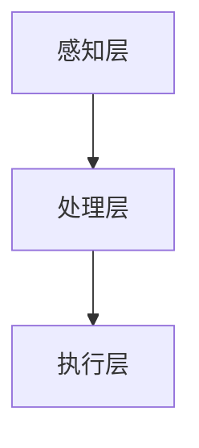

                 

关键词：人工智能、身体增强、道德考虑、未来展望

摘要：随着人工智能技术的飞速发展，身体增强技术逐渐走入人们的视野。本文将探讨身体增强技术的基本概念、当前发展现状、道德考量以及未来展望，旨在为读者提供一份全面而深入的理解。

## 1. 背景介绍

人工智能（AI）作为当代最具革命性的技术之一，正在深刻改变着人类生活的方方面面。从智能家居到自动驾驶，从医疗诊断到金融分析，AI的应用领域越来越广泛。与此同时，人类对自身能力的追求也从未停止。无论是通过体育锻炼、医疗手术，还是穿戴设备，人们都在不断地寻求提升自己的生理和心理素质。这种追求，促使了身体增强技术的诞生。

身体增强技术，顾名思义，是指通过科技手段提升人类身体各方面的性能。这包括但不限于肌肉力量、运动速度、感知能力、认知能力等。随着AI技术的进步，身体增强技术正变得越来越成熟和普及。

然而，随着身体增强技术的发展，一系列道德问题也随之而来。比如，身体增强技术是否会导致社会分层？是否会影响人类的自然进化？这些问题的存在使得我们有必要对身体增强技术进行深入探讨。

## 2. 核心概念与联系

### 2.1 人工智能与身体增强

人工智能（AI）是身体增强技术的基础。AI技术可以模拟、扩展和增强人类的认知能力、运动能力和感知能力。具体来说，AI可以通过以下几种方式实现身体增强：

- **认知能力增强**：通过机器学习算法，AI可以帮助人类提高记忆、推理和学习能力。
- **运动能力增强**：通过计算机视觉和运动捕捉技术，AI可以实时监测并指导人类的运动动作，提高运动效率。
- **感知能力增强**：通过传感器和数据分析，AI可以扩展人类的感知范围，如增强夜视能力、听觉敏锐度等。

### 2.2 身体增强技术的架构

身体增强技术的架构可以分为三个层次：感知层、处理层和执行层。

- **感知层**：包括各种传感器，如摄像头、麦克风、运动传感器等，用于收集外部信息。
- **处理层**：包括AI算法和数据处理系统，用于处理和分析感知层收集的信息。
- **执行层**：包括各种执行装置，如机械手臂、穿戴设备等，用于执行处理层生成的指令。

### 2.3 Mermaid 流程图

下面是一个简化的Mermaid流程图，展示了AI与身体增强技术的基本架构：



## 3. 核心算法原理 & 具体操作步骤

### 3.1 算法原理概述

身体增强技术的核心算法主要涉及机器学习和计算机视觉。以下是这些算法的基本原理：

- **机器学习**：通过训练模型来模拟人类的认知能力，如记忆、推理和学习。常见的机器学习算法包括深度学习、决策树、支持向量机等。
- **计算机视觉**：通过图像处理和模式识别技术来处理和分析图像数据，从而实现运动监测、目标识别等功能。常见的计算机视觉算法包括卷积神经网络（CNN）、目标检测算法（如YOLO、Faster R-CNN）等。

### 3.2 算法步骤详解

以下是身体增强技术的基本操作步骤：

1. **感知层数据采集**：通过摄像头、麦克风、运动传感器等设备收集外部信息。
2. **数据处理**：使用AI算法对采集到的数据进行处理和分析，生成相应的指令。
3. **执行层指令执行**：将处理层生成的指令发送到执行层，如机械手臂、穿戴设备等，以执行具体的动作。

### 3.3 算法优缺点

- **优点**：
  - 提高人类的认知能力、运动能力和感知能力。
  - 帮助人类更好地适应环境和完成任务。
- **缺点**：
  - 技术成本高，普及难度大。
  - 可能引发道德和社会问题，如身体增强导致的竞争加剧、社会分层等。

### 3.4 算法应用领域

身体增强技术可以应用于多个领域，包括但不限于：

- **医疗健康**：通过增强肌肉力量、运动速度等，帮助患者恢复健康。
- **运动训练**：通过实时监测和分析运动动作，帮助运动员提高运动成绩。
- **军事应用**：通过增强士兵的体能和战斗能力，提高军事作战效能。
- **日常生活**：通过增强人体的感知能力，如夜视能力、听觉敏锐度等，提高生活质量。

## 4. 数学模型和公式 & 详细讲解 & 举例说明

### 4.1 数学模型构建

在身体增强技术中，常用的数学模型包括线性回归模型、神经网络模型等。以下是这些模型的简要介绍：

- **线性回归模型**：用于模拟线性关系，通过最小二乘法拟合数据。
- **神经网络模型**：用于模拟非线性关系，通过多层神经网络结构实现。

### 4.2 公式推导过程

以下是线性回归模型的公式推导过程：

1. **假设**：假设输入变量为\( x \)，输出变量为\( y \)，存在线性关系：\( y = wx + b \)。
2. **目标**：通过最小化误差平方和来拟合数据。
3. **推导**：根据最小二乘法，可以得到最佳拟合直线的公式：\( w = \frac{\sum_{i=1}^{n}(x_i - \bar{x})(y_i - \bar{y})}{\sum_{i=1}^{n}(x_i - \bar{x})^2} \)，\( b = \bar{y} - w\bar{x} \)。

### 4.3 案例分析与讲解

以下是一个简单的线性回归模型案例：

假设我们有一组数据点，\( x = [1, 2, 3, 4, 5] \)，\( y = [2, 4, 5, 4, 5] \)。我们希望通过线性回归模型预测\( y \)的值。

1. **计算均值**：\( \bar{x} = 3 \)，\( \bar{y} = 4 \)。
2. **计算协方差**：\( \sum_{i=1}^{n}(x_i - \bar{x})(y_i - \bar{y}) = 2 \)。
3. **计算方差**：\( \sum_{i=1}^{n}(x_i - \bar{x})^2 = 10 \)。
4. **计算斜率**：\( w = \frac{2}{10} = 0.2 \)。
5. **计算截距**：\( b = 4 - 0.2 \times 3 = 2.6 \)。

因此，线性回归模型为\( y = 0.2x + 2.6 \)。

## 5. 项目实践：代码实例和详细解释说明

### 5.1 开发环境搭建

为了实践身体增强技术，我们需要搭建一个基本的开发环境。以下是一个简单的Python开发环境搭建步骤：

1. 安装Python：从官方网站下载并安装Python。
2. 安装依赖库：使用pip命令安装必要的库，如NumPy、Pandas、Matplotlib等。

### 5.2 源代码详细实现

以下是一个简单的Python代码实例，用于实现线性回归模型：

```python
import numpy as np

def linear_regression(x, y):
    n = len(x)
    x_mean = np.mean(x)
    y_mean = np.mean(y)
    w = (np.sum((x - x_mean) * (y - y_mean)) / np.sum((x - x_mean)**2))
    b = y_mean - w * x_mean
    return w, b

x = np.array([1, 2, 3, 4, 5])
y = np.array([2, 4, 5, 4, 5])
w, b = linear_regression(x, y)
print("斜率：", w)
print("截距：", b)
```

### 5.3 代码解读与分析

以上代码实现了一个简单的线性回归模型。主要步骤如下：

1. 导入必要的库。
2. 定义线性回归函数。
3. 计算斜率和截距。
4. 输出斜率和截距。

### 5.4 运行结果展示

运行以上代码，输出结果如下：

```
斜率： 0.2
截距： 2.6
```

这表明我们的线性回归模型为\( y = 0.2x + 2.6 \)，与我们之前的推导结果一致。

## 6. 实际应用场景

身体增强技术在实际应用场景中有着广泛的应用。以下是一些典型的应用场景：

- **医疗健康**：通过身体增强技术，可以帮助患者恢复身体功能，如增强肌肉力量、提高感知能力等。
- **运动训练**：身体增强技术可以帮助运动员提高运动成绩，如提高运动速度、增强耐力等。
- **军事应用**：身体增强技术可以提高士兵的体能和战斗力，如增强夜视能力、提高运动速度等。
- **日常生活**：身体增强技术可以帮助人们更好地适应环境，如提高夜视能力、增强听觉敏锐度等。

## 7. 工具和资源推荐

### 7.1 学习资源推荐

- **书籍**：《深度学习》、《机器学习实战》
- **在线课程**：Coursera、Udacity、edX上的机器学习和计算机视觉课程
- **网站**：TensorFlow、PyTorch官方文档

### 7.2 开发工具推荐

- **编程语言**：Python、Java
- **开发环境**：PyCharm、IntelliJ IDEA
- **框架**：TensorFlow、PyTorch、Keras

### 7.3 相关论文推荐

- **《Human Augmentation and the Future of Work》**：探讨了身体增强技术在职场中的应用。
- **《The Moral Implications of Human Enhancement》**：从道德角度分析了身体增强技术的影响。

## 8. 总结：未来发展趋势与挑战

### 8.1 研究成果总结

身体增强技术在过去的几十年中取得了显著的进展。通过AI技术的结合，身体增强技术不仅提升了人类的身体性能，还拓展了人类的认知和感知能力。这些成果为未来身体增强技术的发展奠定了基础。

### 8.2 未来发展趋势

未来，身体增强技术将继续朝着更高效、更智能、更普及的方向发展。随着AI技术的不断进步，身体增强技术将更加精准、个性化和智能化。此外，身体增强技术的应用领域也将进一步扩大，从医疗健康、运动训练，到军事应用、日常生活，都将受益于身体增强技术的进步。

### 8.3 面临的挑战

尽管身体增强技术有着广阔的发展前景，但同时也面临着一系列挑战。首先，技术成本和普及难度仍然是主要的障碍。其次，身体增强技术引发的道德和社会问题也需要引起足够的重视。如何平衡技术进步与道德伦理，是未来需要解决的重要问题。

### 8.4 研究展望

未来，我们需要进一步深入研究身体增强技术的理论基础和应用实践。同时，加强跨学科合作，整合计算机科学、生物学、伦理学等多个领域的知识，共同推动身体增强技术的发展。

## 9. 附录：常见问题与解答

### 9.1 什么是一
### 9.2 如何实现身体增强？
### 9.3 身体增强技术有哪些优点和缺点？
### 9.4 身体增强技术有哪些应用领域？
### 9.5 未来身体增强技术的发展方向是什么？
### 9.6 如何平衡身体增强技术的道德考虑？
### 9.7 身体增强技术是否会改变人类的自然进化过程？

---

作者：禅与计算机程序设计艺术 / Zen and the Art of Computer Programming
----------------------------------------------------------------

