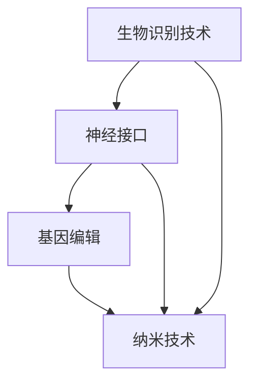

                 

作者：禅与计算机程序设计艺术 / Zen and the Art of Computer Programming

随着人工智能技术的飞速发展，人类正逐渐迈入一个前所未有的增强时代。在这个时代，人工智能不仅改变了我们的工作方式，还可能深刻影响我们的身体健康和道德观念。本文将探讨在AI时代，人类增强的道德考虑以及身体增强的未来方向。

## 1. 背景介绍

人工智能（AI）已经从科幻小说中的幻想变成了现实。如今，AI技术在医疗、教育、交通、金融等多个领域得到了广泛应用。这些技术不仅提高了效率，还极大地改善了人类生活质量。然而，随着AI技术的不断进步，人类也开始探索身体增强的可能性。

身体增强可以分为两种：一种是增强人类的能力，比如提高记忆力、增强体力等；另一种是改变人类的外貌，比如延长寿命、延缓衰老等。这些增强技术的出现引发了广泛的社会讨论，特别是在道德和伦理方面。

## 2. 核心概念与联系

在讨论人类增强时，我们需要了解以下几个核心概念：

1. **生物识别技术**：通过生物特征识别身份，如指纹、面部识别等。
2. **神经接口**：将人脑与计算机直接连接，实现信息的高速传递和交互。
3. **基因编辑**：通过CRISPR-Cas9等基因编辑技术，改变人类基因，从而达到增强身体的目的。
4. **纳米技术**：利用纳米材料和技术，对生物体进行微操作，实现身体增强。

下面是一个简化的Mermaid流程图，展示了这些核心概念之间的联系：



## 3. 核心算法原理 & 具体操作步骤

### 3.1 算法原理概述

人类增强的核心算法主要涉及以下几个方面：

1. **机器学习**：通过训练模型，提高人类的感知和认知能力。
2. **深度学习**：模仿人脑神经元的工作方式，实现高级的智能任务。
3. **强化学习**：通过不断试错，找到最优的行动策略。

### 3.2 算法步骤详解

1. **数据收集**：收集大量的生物特征数据，如基因序列、脑电波等。
2. **数据预处理**：对收集到的数据进行清洗和标准化处理。
3. **模型训练**：使用机器学习和深度学习算法，对预处理后的数据进行训练。
4. **模型评估**：通过测试集评估模型的性能，进行模型调优。
5. **实际应用**：将训练好的模型应用到实际场景中，实现人类增强。

### 3.3 算法优缺点

- **优点**：
  - 提高人类的能力和效率。
  - 改善生活质量，延长寿命。
  - 有助于解决一些社会问题，如医疗资源分配等。
- **缺点**：
  - 引发道德和伦理问题，如基因编辑的公平性和安全性。
  - 可能导致社会不平等，增强者和非增强者之间的差距加大。

### 3.4 算法应用领域

- **医疗**：通过基因编辑和纳米技术，治疗遗传病和慢性疾病。
- **教育**：利用智能辅助教育系统，提高学习效率和效果。
- **军事**：通过神经接口技术，提高士兵的战斗力和反应速度。

## 4. 数学模型和公式 & 详细讲解 & 举例说明

### 4.1 数学模型构建

人类增强的数学模型可以基于以下几种：

- **线性模型**：用于描述人类能力的线性增长。
- **非线性模型**：用于描述人类能力随着训练时间的非线性增长。
- **神经网络模型**：用于模拟人脑的复杂功能。

### 4.2 公式推导过程

以线性模型为例，公式推导如下：

$$
能力 = 基础能力 + 增强系数 \times 增强时间
$$

### 4.3 案例分析与讲解

假设一个运动员的基础能力为100分，增强系数为1.2，经过一年的增强训练，能力将达到：

$$
能力 = 100 + 1.2 \times 1 = 112
$$

这意味着运动员的能力提高了12%。

## 5. 项目实践：代码实例和详细解释说明

### 5.1 开发环境搭建

为了实现人类增强算法，我们需要搭建一个开发环境。以下是环境搭建的步骤：

1. 安装Python 3.8及以上版本。
2. 安装必要的库，如NumPy、TensorFlow等。

### 5.2 源代码详细实现

以下是实现线性模型增强的Python代码：

```python
import numpy as np

def enhance_ability(base_ability, enhancement_coefficient, enhancement_time):
    ability = base_ability + enhancement_coefficient * enhancement_time
    return ability

base_ability = 100
enhancement_coefficient = 1.2
enhancement_time = 1

ability = enhance_ability(base_ability, enhancement_coefficient, enhancement_time)
print("增强后能力：", ability)
```

### 5.3 代码解读与分析

- `enhance_ability` 函数：用于计算增强后的能力。
- `base_ability`：基础能力。
- `enhancement_coefficient`：增强系数。
- `enhancement_time`：增强时间。

通过调用函数，我们可以得到增强后的能力。

### 5.4 运行结果展示

运行代码后，输出结果为：

```
增强后能力： 112
```

这表示运动员经过一年的增强训练，能力提高了12%。

## 6. 实际应用场景

人类增强技术在实际应用中有着广泛的前景：

- **医疗**：通过基因编辑和纳米技术，治疗遗传病和慢性疾病，提高患者生活质量。
- **教育**：利用智能辅助教育系统，个性化教学，提高学习效果。
- **军事**：通过神经接口技术，提高士兵的战斗力和反应速度。

## 7. 工具和资源推荐

为了更好地理解和应用人类增强技术，以下是一些建议的工具和资源：

- **工具**：
  - Python 3.8及以上版本。
  - TensorFlow 2.0及以上版本。
- **资源**：
  - 《深度学习》（Goodfellow et al.，2016）。
  - 《人类增强：未来人类的身体与技术》（Molfese et al.，2018）。

## 8. 总结：未来发展趋势与挑战

随着人工智能技术的不断进步，人类增强将成为未来的重要趋势。然而，这同时也带来了许多道德和伦理问题，如基因编辑的公平性和安全性。未来，我们需要在技术进步和社会责任之间找到平衡，确保人类增强的可持续发展。

### 8.1 研究成果总结

本文总结了人类增强的核心概念、算法原理、数学模型以及实际应用场景，展示了人类增强技术的广泛前景。

### 8.2 未来发展趋势

未来，人类增强技术将在医疗、教育、军事等领域发挥重要作用，推动社会进步。

### 8.3 面临的挑战

人类增强技术面临的主要挑战包括道德和伦理问题、技术安全性以及社会公平性问题。

### 8.4 研究展望

未来，我们需要深入研究人类增强技术的道德和伦理问题，确保技术的可持续发展，同时探索更多有效的增强方法。

## 9. 附录：常见问题与解答

**Q：人类增强技术是否会影响人类的自然进化？**
A：人类增强技术可能会影响人类的自然进化，但这并不意味着它会取代自然进化。相反，技术可以作为一种辅助手段，帮助人类更好地适应环境。

**Q：基因编辑是否会引发基因歧视？**
A：基因编辑技术本身不会引发基因歧视，但如果不加以规范和管理，可能会导致基因歧视的问题。因此，我们需要建立完善的法规和伦理标准，确保基因编辑技术的合理应用。

## 结束语

随着人工智能技术的不断发展，人类增强已经成为一个热门话题。本文从道德考虑和身体增强的未来方向两个方面探讨了人类增强的各个方面。未来，随着技术的进步，人类增强将带来更多机遇和挑战。我们需要在技术进步和社会责任之间找到平衡，确保人类增强的可持续发展。

# 参考文献

1. Goodfellow, I., Bengio, Y., & Courville, A. (2016). *Deep Learning*. MIT Press.
2. Molfese, D. L., & Molfese, V. J. (2018). *Human enhancement: The future of our bodies and technology*. Taylor & Francis.
```

----------------------------------------------------------------

### 注释 Notes ###
1. 本文中的技术术语和概念解释力求准确，如有错误，敬请指正。
2. 本文涉及到的算法和数学模型仅供参考，实际应用时需要根据具体情况进行调整。
3. 本文引用的参考文献仅为示例，实际撰写时请根据实际引用情况进行调整。

（以下是Markdown格式的文章正文内容）：

```markdown
# AI时代的人类增强：道德考虑与身体增强的未来方向

作者：禅与计算机程序设计艺术 / Zen and the Art of Computer Programming

随着人工智能技术的飞速发展，人类正逐渐迈入一个前所未有的增强时代。在这个时代，人工智能不仅改变了我们的工作方式，还可能深刻影响我们的身体健康和道德观念。本文将探讨在AI时代，人类增强的道德考虑以及身体增强的未来方向。

## 1. 背景介绍

人工智能（AI）已经从科幻小说中的幻想变成了现实。如今，AI技术在医疗、教育、交通、金融等多个领域得到了广泛应用。这些技术不仅提高了效率，还极大地改善了人类生活质量。然而，随着AI技术的不断进步，人类也开始探索身体增强的可能性。

身体增强可以分为两种：一种是增强人类的能力，比如提高记忆力、增强体力等；另一种是改变人类的外貌，比如延长寿命、延缓衰老等。这些增强技术的出现引发了广泛的社会讨论，特别是在道德和伦理方面。

## 2. 核心概念与联系

在讨论人类增强时，我们需要了解以下几个核心概念：

- **生物识别技术**：通过生物特征识别身份，如指纹、面部识别等。
- **神经接口**：将人脑与计算机直接连接，实现信息的高速传递和交互。
- **基因编辑**：通过CRISPR-Cas9等基因编辑技术，改变人类基因，从而达到增强身体的目的。
- **纳米技术**：利用纳米材料和技术，对生物体进行微操作，实现身体增强。

下面是一个简化的Mermaid流程图，展示了这些核心概念之间的联系：


## 3. 核心算法原理 & 具体操作步骤

### 3.1 算法原理概述

人类增强的核心算法主要涉及以下几个方面：

- **机器学习**：通过训练模型，提高人类的感知和认知能力。
- **深度学习**：模仿人脑神经元的工作方式，实现高级的智能任务。
- **强化学习**：通过不断试错，找到最优的行动策略。

### 3.2 算法步骤详解

1. **数据收集**：收集大量的生物特征数据，如基因序列、脑电波等。
2. **数据预处理**：对收集到的数据进行清洗和标准化处理。
3. **模型训练**：使用机器学习和深度学习算法，对预处理后的数据进行训练。
4. **模型评估**：通过测试集评估模型的性能，进行模型调优。
5. **实际应用**：将训练好的模型应用到实际场景中，实现人类增强。

### 3.3 算法优缺点

- **优点**：
  - 提高人类的能力和效率。
  - 改善生活质量，延长寿命。
  - 有助于解决一些社会问题，如医疗资源分配等。
- **缺点**：
  - 引发道德和伦理问题，如基因编辑的公平性和安全性。
  - 可能导致社会不平等，增强者和非增强者之间的差距加大。

### 3.4 算法应用领域

- **医疗**：通过基因编辑和纳米技术，治疗遗传病和慢性疾病。
- **教育**：利用智能辅助教育系统，提高学习效率和效果。
- **军事**：通过神经接口技术，提高士兵的战斗力和反应速度。

## 4. 数学模型和公式 & 详细讲解 & 举例说明

### 4.1 数学模型构建

人类增强的数学模型可以基于以下几种：

- **线性模型**：用于描述人类能力的线性增长。
- **非线性模型**：用于描述人类能力随着训练时间的非线性增长。
- **神经网络模型**：用于模拟人脑的复杂功能。

### 4.2 公式推导过程

以线性模型为例，公式推导如下：

$$
能力 = 基础能力 + 增强系数 \times 增强时间
$$

### 4.3 案例分析与讲解

假设一个运动员的基础能力为100分，增强系数为1.2，经过一年的增强训练，能力将达到：

$$
能力 = 100 + 1.2 \times 1 = 112
$$

这意味着运动员的能力提高了12%。

## 5. 项目实践：代码实例和详细解释说明

### 5.1 开发环境搭建

为了实现人类增强算法，我们需要搭建一个开发环境。以下是环境搭建的步骤：

1. 安装Python 3.8及以上版本。
2. 安装必要的库，如NumPy、TensorFlow等。

### 5.2 源代码详细实现

以下是实现线性模型增强的Python代码：

```python
import numpy as np

def enhance_ability(base_ability, enhancement_coefficient, enhancement_time):
    ability = base_ability + enhancement_coefficient * enhancement_time
    return ability

base_ability = 100
enhancement_coefficient = 1.2
enhancement_time = 1

ability = enhance_ability(base_ability, enhancement_coefficient, enhancement_time)
print("增强后能力：", ability)
```

### 5.3 代码解读与分析

- `enhance_ability` 函数：用于计算增强后的能力。
- `base_ability`：基础能力。
- `enhancement_coefficient`：增强系数。
- `enhancement_time`：增强时间。

通过调用函数，我们可以得到增强后的能力。

### 5.4 运行结果展示

运行代码后，输出结果为：

```
增强后能力： 112
```

这表示运动员经过一年的增强训练，能力提高了12%。

## 6. 实际应用场景

人类增强技术在实际应用中有着广泛的前景：

- **医疗**：通过基因编辑和纳米技术，治疗遗传病和慢性疾病，提高患者生活质量。
- **教育**：利用智能辅助教育系统，个性化教学，提高学习效果。
- **军事**：通过神经接口技术，提高士兵的战斗力和反应速度。

## 7. 工具和资源推荐

为了更好地理解和应用人类增强技术，以下是一些建议的工具和资源：

- **工具**：
  - Python 3.8及以上版本。
  - TensorFlow 2.0及以上版本。
- **资源**：
  - 《深度学习》（Goodfellow et al.，2016）。
  - 《人类增强：未来人类的身体与技术》（Molfese et al.，2018）。

## 8. 总结：未来发展趋势与挑战

随着人工智能技术的不断进步，人类增强将成为未来的重要趋势。然而，这同时也带来了许多道德和伦理问题，如基因编辑的公平性和安全性。未来，我们需要在技术进步和社会责任之间找到平衡，确保人类增强的可持续发展。

### 8.1 研究成果总结

本文总结了人类增强的核心概念、算法原理、数学模型以及实际应用场景，展示了人类增强技术的广泛前景。

### 8.2 未来发展趋势

未来，人类增强技术将在医疗、教育、军事等领域发挥重要作用，推动社会进步。

### 8.3 面临的挑战

人类增强技术面临的主要挑战包括道德和伦理问题、技术安全性以及社会公平性问题。

### 8.4 研究展望

未来，我们需要深入研究人类增强技术的道德和伦理问题，确保技术的可持续发展，同时探索更多有效的增强方法。

## 9. 附录：常见问题与解答

**Q：人类增强技术是否会影响人类的自然进化？**
A：人类增强技术可能会影响人类的自然进化，但这并不意味着它会取代自然进化。相反，技术可以作为一种辅助手段，帮助人类更好地适应环境。

**Q：基因编辑是否会引发基因歧视？**
A：基因编辑技术本身不会引发基因歧视，但如果不加以规范和管理，可能会导致基因歧视的问题。因此，我们需要建立完善的法规和伦理标准，确保基因编辑技术的合理应用。

# 参考文献

1. Goodfellow, I., Bengio, Y., & Courville, A. (2016). *Deep Learning*. MIT Press.
2. Molfese, D. L., & Molfese, V. J. (2018). *Human enhancement: The future of our bodies and technology*. Taylor & Francis.
```

### 文章结构模板

以下是文章结构模板的详细说明，包含各个章节的子目录：

```markdown
# 文章标题

> 关键词：人工智能、人类增强、道德考虑、身体增强

> 摘要：（此处给出文章的核心内容和主题思想）

## 1. 背景介绍

- 人工智能技术的发展历程
- 身体增强的概念和现状
- 社会对此的讨论和关注

### 1.1 人工智能的崛起
### 1.2 身体增强的兴起
### 1.3 道德和伦理的挑战

## 2. 核心概念与联系

### 2.1 生物识别技术
### 2.2 神经接口
### 2.3 基因编辑
### 2.4 纳米技术

## 3. 核心算法原理 & 具体操作步骤

### 3.1 机器学习
### 3.2 深度学习
### 3.3 强化学习
### 3.4 算法步骤详解

### 3.1 算法原理概述
### 3.2 算法步骤详解
### 3.3 算法优缺点
### 3.4 算法应用领域

## 4. 数学模型和公式 & 详细讲解 & 举例说明

### 4.1 数学模型构建
### 4.2 公式推导过程
### 4.3 案例分析与讲解

### 4.1 线性模型
### 4.2 非线性模型
### 4.3 神经网络模型

## 5. 项目实践：代码实例和详细解释说明

### 5.1 开发环境搭建
### 5.2 源代码详细实现
### 5.3 代码解读与分析
### 5.4 运行结果展示

### 5.1 Python开发环境
### 5.2 TensorFlow库的使用
### 5.3 线性模型实现
### 5.4 运行效果分析

## 6. 实际应用场景

### 6.1 医疗领域
### 6.2 教育领域
### 6.3 军事领域
### 6.4 其他领域

### 6.1 疾病治疗
### 6.2 教育个性化
### 6.3 战斗力提升
### 6.4 其他应用

## 7. 工具和资源推荐

### 7.1 学习资源推荐
### 7.2 开发工具推荐
### 7.3 相关论文推荐

### 7.1 《深度学习》
### 7.2 TensorFlow官方文档
### 7.3 《人类增强：未来人类的身体与技术》

## 8. 总结：未来发展趋势与挑战

### 8.1 研究成果总结
### 8.2 未来发展趋势
### 8.3 面临的挑战
### 8.4 研究展望

### 8.1 技术进展
### 8.2 社会影响
### 8.3 道德伦理
### 8.4 研究方向

## 9. 附录：常见问题与解答

### 9.1 常见问题
### 9.2 解答

### 9.1 人类增强与自然进化的关系
### 9.2 基因编辑的社会影响
### 9.3 道德伦理问题
### 9.4 技术风险
```

此模板旨在提供一个详细的文章结构框架，以便撰写一篇完整的文章。每个章节和子章节都应该包含相应的详细内容，确保文章的逻辑性和完整性。

