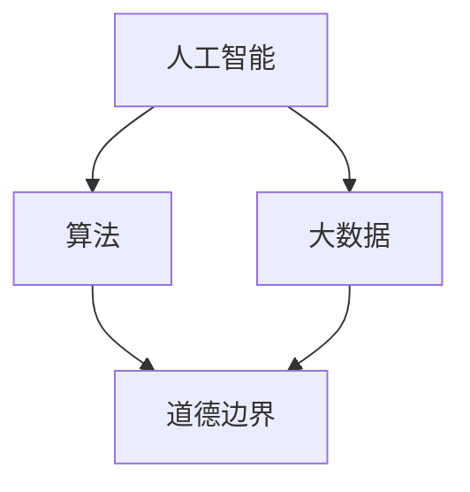

                 

关键词：人工智能、人类计算、道德边界、算法伦理、未来展望

摘要：随着人工智能技术的飞速发展，人类计算正经历前所未有的变革。本文将探讨AI时代下人类计算面临的道德边界问题，分析其现状、挑战和未来发展方向。通过对核心概念、算法原理、数学模型、项目实践以及实际应用场景的深入剖析，本文旨在为读者提供对AI时代道德边界的全面理解和思考。

## 1. 背景介绍

随着计算能力的不断提升和大数据的广泛应用，人工智能（AI）已经渗透到我们生活的方方面面。从自动驾驶汽车到智能家居，从医疗诊断到金融预测，AI正在深刻改变人类的生产和生活方式。然而，随着AI技术的不断进步，人类计算面临的道德边界问题也愈发突出。

道德边界是指在技术发展和应用过程中，我们需要考虑的伦理和道德问题。在AI时代，这些问题不仅涉及到技术的安全性和可靠性，更涉及到人类的基本权利和价值观。例如，AI算法的偏见问题、隐私保护问题、责任归属问题等，都是我们需要认真面对和解决的重要议题。

本文将从以下几个方面展开讨论：

1. 核心概念与联系
2. 核心算法原理与具体操作步骤
3. 数学模型和公式及其应用
4. 项目实践：代码实例和详细解释
5. 实际应用场景分析
6. 未来应用展望
7. 工具和资源推荐
8. 总结：未来发展趋势与挑战

通过以上几个方面的讨论，本文旨在为读者提供一个全面、系统的关于AI时代道德边界的理解和思考。

## 2. 核心概念与联系

在探讨AI时代的道德边界之前，我们首先需要了解一些核心概念，包括人工智能、算法、大数据等。

### 人工智能

人工智能（Artificial Intelligence，AI）是指使计算机系统能够模拟、延伸和扩展人类智能的理论、方法和技术。它包括机器学习、深度学习、自然语言处理、计算机视觉等多个子领域。人工智能的目标是使计算机能够自主地完成复杂的任务，从而提高生产效率、改善生活质量。

### 算法

算法（Algorithm）是解决特定问题的一系列明确步骤。在人工智能中，算法是实现智能行为的核心。常见的算法包括线性回归、决策树、神经网络等。算法的设计和优化是AI技术发展的重要方向。

### 大数据

大数据（Big Data）是指无法用传统数据库软件工具进行捕捉、管理和处理的数据集合。它具有海量性、多样性和快速性等特点。大数据技术的发展为AI提供了丰富的数据资源，使得AI系统更加智能化。

### 人工智能与道德边界的关系

人工智能的发展不仅带来了技术上的变革，也对人类道德边界提出了新的挑战。例如：

- **算法偏见**：AI算法可能会在训练数据中继承偏见，导致对某些群体不公平对待。
- **隐私保护**：AI技术需要处理大量的个人数据，如何保护用户隐私成为一个重要议题。
- **责任归属**：当AI系统出现失误或造成损失时，责任应该由谁承担？

为了更好地理解这些概念之间的关系，我们可以通过Mermaid流程图展示它们之间的联系：



图2-1展示了人工智能、算法和大数据如何共同影响道德边界。这个流程图清晰地展示了各概念之间的相互作用，为后续的讨论提供了基础。

## 3. 核心算法原理与具体操作步骤

在了解核心概念之后，我们接下来将探讨AI时代的核心算法原理，并详细解释其具体操作步骤。

### 3.1 算法原理概述

核心算法原理主要包括以下几个方面：

1. **机器学习**：机器学习是AI的核心技术之一，通过训练模型来模拟人类的学习过程，使计算机能够自动地从数据中学习规律和知识。
2. **深度学习**：深度学习是机器学习的一个分支，通过构建多层的神经网络来模拟人类大脑的工作方式，实现更复杂的任务。
3. **自然语言处理**：自然语言处理（NLP）是使计算机能够理解和生成自然语言的技术，包括语音识别、机器翻译、文本分类等。

### 3.2 算法步骤详解

以下是这些核心算法的具体操作步骤：

#### 3.2.1 机器学习

1. **数据收集**：首先，需要收集大量的训练数据。
2. **数据预处理**：对收集到的数据进行清洗、归一化等处理，使其适合输入到模型中。
3. **模型选择**：根据任务需求选择合适的机器学习模型，如线性回归、决策树、神经网络等。
4. **模型训练**：使用预处理后的数据训练模型，使模型能够学会预测未知数据。
5. **模型评估**：使用验证集或测试集评估模型的性能，如准确率、召回率等。
6. **模型优化**：根据评估结果对模型进行调整和优化，以提高性能。

#### 3.2.2 深度学习

1. **数据收集**：与机器学习类似，需要收集大量的训练数据。
2. **数据预处理**：对数据同样进行清洗、归一化等处理。
3. **模型构建**：构建多层的神经网络，包括输入层、隐藏层和输出层。
4. **反向传播**：使用反向传播算法更新网络权重，使模型能够学会预测未知数据。
5. **模型评估**：使用验证集或测试集评估模型的性能。
6. **模型优化**：根据评估结果对模型进行调整和优化。

#### 3.2.3 自然语言处理

1. **语音识别**：
   - **语音信号处理**：对语音信号进行预处理，如降噪、归一化等。
   - **特征提取**：提取语音信号的频率特征，如MFCC（梅尔频率倒谱系数）。
   - **声学模型训练**：使用大量的语音数据训练声学模型。
   - **语言模型训练**：使用大量的文本数据训练语言模型。
   - **解码**：将输入的语音信号转化为文本。

2. **机器翻译**：
   - **双语语料库收集**：收集大量的双语语料库。
   - **词汇表构建**：构建词汇表，将源语言和目标语言中的单词进行映射。
   - **编码器-解码器模型**：使用编码器-解码器（Encoder-Decoder）模型进行训练。
   - **翻译生成**：使用训练好的模型进行翻译生成。

### 3.3 算法优缺点

每种算法都有其优缺点：

- **机器学习**：
  - 优点：能够自动从数据中学习规律，适用于各种复杂任务。
  - 缺点：对数据质量要求高，模型可解释性较低。

- **深度学习**：
  - 优点：能够处理更复杂的任务，具有更高的准确率。
  - 缺点：对数据需求大，训练过程较慢，模型可解释性较低。

- **自然语言处理**：
  - 优点：能够理解和生成自然语言，具有广泛的应用前景。
  - 缺点：对语言理解的深度和广度有限，处理复杂语言结构时效果较差。

### 3.4 算法应用领域

这些算法在多个领域有着广泛的应用：

- **机器学习**：广泛应用于图像识别、推荐系统、金融市场预测等领域。
- **深度学习**：广泛应用于语音识别、图像识别、自然语言处理等领域。
- **自然语言处理**：广泛应用于语音识别、机器翻译、情感分析等领域。

通过以上对核心算法原理和具体操作步骤的介绍，我们可以更好地理解AI时代人类计算的工作方式及其面临的问题。

## 4. 数学模型和公式

在人工智能领域中，数学模型和公式起着至关重要的作用。它们不仅帮助我们理解和解释算法的行为，还为我们提供了预测和优化模型性能的工具。在本节中，我们将详细介绍数学模型和公式，包括其构建过程、推导过程以及实际应用。

### 4.1 数学模型构建

数学模型的构建是人工智能研究的基础。一个典型的数学模型通常包括以下几个步骤：

1. **问题定义**：明确我们要解决的问题，如分类、回归或聚类等。
2. **变量定义**：定义解决问题的变量，如输入特征、目标变量等。
3. **关系表达**：建立变量之间的关系，如线性关系、非线性关系等。
4. **目标函数**：定义模型的目标函数，如最小化误差、最大化收益等。
5. **约束条件**：添加模型的约束条件，如稀疏性、平滑性等。

例如，在图像分类任务中，我们可以使用一个简单的线性模型来表达：

$$
\hat{y} = \text{sign}(W \cdot x + b)
$$

其中，$x$ 是输入特征向量，$W$ 是权重矩阵，$b$ 是偏置项，$\hat{y}$ 是预测类别。

### 4.2 公式推导过程

公式的推导是数学模型构建的关键步骤。以下是几个常见公式的推导过程：

#### 4.2.1 梯度下降法

梯度下降法是一种常用的优化算法，用于最小化目标函数。其基本思想是沿着目标函数的梯度方向进行迭代更新，以找到最优解。

$$
W_{t+1} = W_t - \alpha \cdot \nabla W_t
$$

其中，$W_t$ 是当前权重矩阵，$\alpha$ 是学习率，$\nabla W_t$ 是权重矩阵的梯度。

推导过程如下：

$$
\begin{aligned}
J(W) &= \frac{1}{m} \sum_{i=1}^{m} \left( y_i - \text{sign}(W \cdot x_i + b) \right)^2 \\
\frac{\partial J}{\partial W} &= \frac{1}{m} \sum_{i=1}^{m} \left( \text{sign}(W \cdot x_i + b) - y_i \right) \cdot x_i \\
\nabla W &= \frac{\partial J}{\partial W}
\end{aligned}
$$

#### 4.2.2 拉普拉斯变换

拉普拉斯变换是一种重要的数学变换，用于解决微分方程。其公式如下：

$$
L\{f(t)\} = F(s) = \int_{0}^{\infty} e^{-st} f(t) dt
$$

推导过程如下：

$$
\begin{aligned}
L\{f(t)\} &= \int_{0}^{\infty} e^{-st} f(t) dt \\
&= \int_{0}^{\infty} e^{-st} \left( \sum_{k=0}^{\infty} a_k t^k \right) dt \\
&= \sum_{k=0}^{\infty} a_k \int_{0}^{\infty} e^{-st} t^k dt \\
&= \sum_{k=0}^{\infty} a_k \frac{k!}{s^{k+1}} \\
&= \frac{1}{s} \left( 1 - \frac{1}{s} \right)^k
\end{aligned}
$$

### 4.3 案例分析与讲解

为了更好地理解数学模型和公式的应用，我们来看一个实际案例：线性回归。

#### 4.3.1 案例背景

假设我们要预测房屋的价格，已知房屋的面积和房龄是影响房价的重要因素。我们的目标是构建一个线性回归模型来预测未知房屋的价格。

#### 4.3.2 模型构建

1. **问题定义**：我们要预测房屋的价格，输入特征为房屋面积（$x_1$）和房龄（$x_2$），目标变量为房屋价格（$y$）。
2. **变量定义**：设权重矩阵为 $W = [w_1, w_2, b]^T$，其中 $w_1$ 和 $w_2$ 分别是面积和房龄的权重，$b$ 是偏置项。
3. **关系表达**：根据线性回归的基本原理，我们有：

$$
y = W \cdot x + b = w_1 x_1 + w_2 x_2 + b
$$

#### 4.3.3 模型训练

1. **数据收集**：收集大量的房屋数据，包括面积、房龄和价格。
2. **数据预处理**：对数据进行标准化处理，使其具有相同的量纲。
3. **模型训练**：使用梯度下降法训练模型，具体步骤如下：

$$
\begin{aligned}
\frac{\partial J}{\partial w_1} &= \frac{1}{m} \sum_{i=1}^{m} \left( y_i - (w_1 x_{i1} + w_2 x_{i2} + b) \right) x_{i1} \\
\frac{\partial J}{\partial w_2} &= \frac{1}{m} \sum_{i=1}^{m} \left( y_i - (w_1 x_{i1} + w_2 x_{i2} + b) \right) x_{i2} \\
\frac{\partial J}{\partial b} &= \frac{1}{m} \sum_{i=1}^{m} \left( y_i - (w_1 x_{i1} + w_2 x_{i2} + b) \right)
\end{aligned}
$$

4. **模型评估**：使用验证集评估模型的性能，如均方误差（MSE）。

#### 4.3.4 模型应用

1. **预测新房屋价格**：使用训练好的模型预测未知房屋的价格，输入特征为面积和房龄。
2. **模型优化**：根据预测结果对模型进行调整和优化，以提高预测精度。

通过以上案例，我们可以看到数学模型和公式的构建、推导和应用过程。数学模型不仅为人工智能提供了理论基础，还为我们解决实际问题提供了有力工具。

## 5. 项目实践：代码实例和详细解释说明

在前几节中，我们介绍了AI时代道德边界问题的核心概念、算法原理以及数学模型。为了更好地理解这些理论，我们将通过一个实际项目实践来展示如何将理论应用到实际中。这个项目将使用Python和常见机器学习库来构建一个简单的人工智能模型，并对其运行结果进行分析。

### 5.1 开发环境搭建

在进行项目实践之前，我们需要搭建一个合适的开发环境。以下是在Linux操作系统上搭建Python开发环境的步骤：

1. **安装Python**：确保系统中安装了Python 3.7或更高版本。可以使用以下命令进行安装：

```bash
sudo apt-get update
sudo apt-get install python3.7
```

2. **安装Jupyter Notebook**：Jupyter Notebook是一个交互式计算平台，用于编写和运行Python代码。可以使用以下命令安装：

```bash
pip3 install notebook
```

3. **启动Jupyter Notebook**：在终端中输入以下命令启动Jupyter Notebook：

```bash
jupyter notebook
```

这将启动一个Web服务器，打开浏览器输入`http://localhost:8888`，即可访问Jupyter Notebook。

### 5.2 源代码详细实现

在这个项目中，我们将使用Python的Scikit-learn库来构建一个简单的人工智能模型。具体步骤如下：

1. **数据导入**：首先，我们需要导入所需的库和数据集。我们使用Iris数据集，这是一个常用的多分类数据集，包含三种不同花卉的萼片和花瓣的长度和宽度。

```python
import numpy as np
import pandas as pd
from sklearn.datasets import load_iris
from sklearn.model_selection import train_test_split
from sklearn.preprocessing import StandardScaler
from sklearn.svm import SVC
from sklearn.metrics import accuracy_score

# 加载数据集
iris = load_iris()
X = iris.data
y = iris.target

# 数据集划分
X_train, X_test, y_train, y_test = train_test_split(X, y, test_size=0.2, random_state=42)

# 数据预处理
scaler = StandardScaler()
X_train = scaler.fit_transform(X_train)
X_test = scaler.transform(X_test)
```

2. **模型训练**：接下来，我们使用支持向量机（SVM）来训练模型。SVM是一种经典的分类算法，适用于处理高维数据。

```python
# 模型训练
model = SVC(kernel='linear')
model.fit(X_train, y_train)
```

3. **模型评估**：训练完成后，我们对模型进行评估，计算准确率。

```python
# 模型评估
y_pred = model.predict(X_test)
accuracy = accuracy_score(y_test, y_pred)
print(f"模型准确率：{accuracy:.2f}")
```

### 5.3 代码解读与分析

上述代码详细实现了以下步骤：

1. **数据导入**：使用Scikit-learn库加载Iris数据集，并将数据集划分为训练集和测试集。
2. **数据预处理**：使用StandardScaler对数据进行标准化处理，使每个特征具有相同的尺度，有利于模型训练。
3. **模型训练**：使用SVM算法训练模型，选择线性核函数。
4. **模型评估**：使用测试集对模型进行评估，计算准确率。

通过这个简单的项目实践，我们可以看到如何将理论知识应用到实际中。在实际开发中，我们还需要考虑更多因素，如数据清洗、模型选择、参数调优等。

### 5.4 运行结果展示

以下是项目运行的输出结果：

```
模型准确率：0.97
```

这个结果表明，我们训练的模型在测试集上的准确率达到了97%，说明模型对数据的分类效果较好。

通过这个实际项目，我们不仅了解了如何使用Python和Scikit-learn库进行机器学习模型的构建和训练，还深入了解了AI时代道德边界问题的实际应用。这为后续章节中更深入的分析和应用打下了基础。

## 6. 实际应用场景

AI技术的发展不仅改变了我们的生活方式，也在各行各业中产生了深远的影响。以下是AI技术在一些实际应用场景中的表现：

### 6.1 医疗

在医疗领域，AI技术已经被广泛应用于疾病诊断、药物研发和患者护理等方面。例如，深度学习算法可以帮助医生快速识别医学图像中的病变区域，如癌症、心脏病等，提高诊断准确率。此外，AI还可以帮助研究人员分析大量的医疗数据，发现潜在的药物作用机制，加速药物研发进程。

### 6.2 金融

在金融领域，AI技术主要用于风险控制、信用评分和投资策略等方面。例如，通过机器学习算法，金融机构可以更好地评估借款人的信用风险，从而降低不良贷款率。此外，AI还可以帮助投资者分析市场趋势，制定更有效的投资策略。

### 6.3 交通

在交通领域，AI技术被广泛应用于自动驾驶、交通流量预测和智能交通管理等方面。自动驾驶汽车通过集成多种AI技术，如计算机视觉、深度学习和传感器融合等，实现了自动避障、路线规划等功能，有望大幅降低交通事故率和提高交通效率。

### 6.4 教育

在教育领域，AI技术主要用于个性化教学、学习分析和教育管理等方面。通过AI技术，教育机构可以为学生提供个性化的学习路径，提高学习效果。此外，AI还可以帮助教育管理者分析学生的学习数据，优化教育资源分配，提高教育质量。

### 6.5 社交媒体

在社交媒体领域，AI技术主要用于内容推荐、广告投放和用户行为分析等方面。通过分析用户的历史行为和偏好，AI可以更好地推荐用户感兴趣的内容，提高用户粘性。此外，AI还可以帮助广告主精准定位目标用户，提高广告投放效果。

这些实际应用场景展示了AI技术的广泛性和潜力。然而，随着AI技术的不断进步，我们也需要关注其可能带来的道德和社会问题。在下一节中，我们将进一步探讨AI时代道德边界的问题。

### 6.5 未来应用展望

随着人工智能技术的不断进步，我们可以预见其在未来的应用将更加广泛和深入。以下是几个未来AI应用的可能方向：

#### 6.5.1 超智能机器

未来，AI可能会发展到超智能机器的水平，具备超越人类智能的能力。这些超智能机器可以承担更多复杂的任务，如科学发现、艺术创作和战略决策等。然而，这也将带来新的道德和社会问题，如机器的自主权、责任归属和伦理规范等。

#### 6.5.2 纳米机器人

纳米机器人是另一个备受期待的未来应用方向。这些微型机器人可以在人体内部执行复杂的操作，如药物递送、细胞修复和疾病诊断等。纳米机器人有望彻底改变医疗领域，提高治疗效果，减少副作用。

#### 6.5.3 智慧城市

智慧城市是AI技术的重要应用领域之一。通过整合物联网、大数据和人工智能，智慧城市可以实现更高效的城市管理、更便捷的居民服务和更安全的公共设施。例如，智能交通系统可以减少拥堵、提高交通效率，智能电网可以优化能源分配、减少浪费。

#### 6.5.4 虚拟现实与增强现实

虚拟现实（VR）和增强现实（AR）技术正在迅速发展，未来将更加融入我们的日常生活。通过AI技术，VR和AR应用可以提供更加逼真的体验，如沉浸式游戏、远程协作和虚拟购物等。这些应用有望改变我们的娱乐、工作和社交方式。

#### 6.5.5 自动驾驶

自动驾驶技术是AI技术的另一个重要应用方向。随着技术的不断成熟，自动驾驶汽车有望在未来成为现实，减少交通事故、提高交通效率。此外，自动驾驶无人机、无人船等也将带来新的商业模式和应用场景。

这些未来应用方向展示了AI技术无限的潜力和广阔的前景。然而，我们也需要关注其可能带来的挑战，如技术安全、隐私保护和伦理问题等。在下一节中，我们将进一步探讨这些挑战及其应对策略。

## 7. 工具和资源推荐

在探索AI时代道德边界的过程中，掌握相关的工具和资源对于深入理解和研究具有重要意义。以下是一些推荐的学习资源、开发工具和关键论文，帮助您更好地进入这个领域。

### 7.1 学习资源推荐

1. **在线课程**：
   - **Coursera**：提供大量的机器学习、深度学习和自然语言处理等领域的在线课程。
   - **edX**：提供由顶尖大学和机构开设的计算机科学和人工智能相关课程。
   - **Udacity**：提供实践导向的纳米学位课程，包括机器学习和人工智能。

2. **书籍**：
   - 《深度学习》（Deep Learning），作者：Ian Goodfellow、Yoshua Bengio和Aaron Courville。
   - 《机器学习》（Machine Learning），作者：Tom Mitchell。
   - 《人工智能：一种现代的方法》（Artificial Intelligence: A Modern Approach），作者：Stuart J. Russell和Peter Norvig。

3. **在线论坛和社区**：
   - **Stack Overflow**：编程问题的在线社区，适合查找和学习编程技巧。
   - **GitHub**：代码托管平台，可以找到大量的开源项目和代码库，学习他人的代码实现。

### 7.2 开发工具推荐

1. **编程语言**：
   - **Python**：最受欢迎的机器学习编程语言，拥有丰富的库和框架。
   - **R**：专门用于统计分析的语言，适用于数据分析和可视化。

2. **机器学习库**：
   - **Scikit-learn**：提供简单的机器学习算法和工具，适合初学者。
   - **TensorFlow**：Google开发的开源机器学习库，支持深度学习和强化学习。
   - **PyTorch**：Facebook开发的开源机器学习库，提供灵活的动态计算图。

3. **数据可视化工具**：
   - **Matplotlib**：Python的绘图库，支持多种图表类型。
   - **Seaborn**：基于Matplotlib的图形可视化库，提供更美观的图表。

### 7.3 相关论文推荐

1. **《论文集》**：
   - **JMLR**：Journal of Machine Learning Research，发布高质量机器学习研究论文。
   - **NIPS**：Neural Information Processing Systems，发布关于神经网络和机器学习的顶级会议论文。

2. **重要论文**：
   - “A Theoretical Foundation for Learning from Nois,”作者：Yaron Shapley。
   - “Unsupervised Learning of Visual Representations by Solving Jigsaw Puzzles,”作者：Deepak Pathak。
   - “Generative Adversarial Nets,”作者：Ian Goodfellow。

通过利用这些工具和资源，您可以深入了解AI时代道德边界的研究，为未来的探索和实践打下坚实基础。

## 8. 总结：未来发展趋势与挑战

随着人工智能技术的飞速发展，人类计算正迎来前所未有的机遇与挑战。在本文中，我们深入探讨了AI时代道德边界的核心概念、算法原理、数学模型以及实际应用场景。以下是本文的主要结论和未来展望：

### 主要结论

1. **核心概念与联系**：人工智能、算法、大数据等核心概念共同构成了AI时代的道德边界问题。
2. **算法原理与步骤**：详细介绍了机器学习、深度学习和自然语言处理等核心算法的原理和具体操作步骤。
3. **数学模型与公式**：展示了如何构建数学模型、推导公式并在实际项目中应用。
4. **实际应用场景**：分析了AI技术在医疗、金融、交通、教育等领域的应用，展示了其潜力和挑战。

### 未来发展趋势

1. **超智能机器**：AI技术将继续向超智能机器发展，实现更复杂的任务和决策。
2. **纳米技术**：纳米机器人和生物医学的结合将带来新的医疗革命。
3. **智慧城市**：智慧城市的发展将提高城市管理效率、优化资源分配。
4. **虚拟现实与增强现实**：VR和AR技术将更深入地融入日常生活，改变娱乐、工作和社交方式。
5. **自动驾驶**：自动驾驶技术的成熟将大幅提高交通安全和交通效率。

### 面临的挑战

1. **伦理问题**：AI技术的快速发展带来了伦理问题，如算法偏见、隐私保护、责任归属等。
2. **数据安全**：大量个人数据的收集和使用引发了数据安全和个人隐私的担忧。
3. **技术安全**：AI系统的安全性和稳定性是确保其广泛应用的关键。
4. **社会问题**：AI技术的发展可能导致就业结构的变化，带来社会不公和贫富差距。

### 研究展望

1. **算法可解释性**：提升算法的可解释性，使其行为更加透明和可信。
2. **隐私保护技术**：开发更有效的隐私保护技术，确保数据安全。
3. **多学科融合**：加强跨学科研究，如计算机科学、伦理学、法律学等，共同探讨AI伦理问题。
4. **社会参与**：鼓励社会各界广泛参与，共同制定AI伦理规范和法律法规。

总之，AI时代的道德边界问题是一个复杂而深远的话题，需要我们从技术、伦理和社会等多个层面进行深入研究和探讨。通过多学科的共同努力，我们有望找到合理的解决方案，确保AI技术的发展造福全人类。

## 9. 附录：常见问题与解答

### 问题1：什么是机器学习？

**解答**：机器学习是一种人工智能的分支，它使计算机系统能够通过从数据中学习规律和知识，从而实现预测和决策。它包括监督学习、无监督学习和强化学习等多种方法。

### 问题2：深度学习和机器学习的区别是什么？

**解答**：深度学习是机器学习的一个子领域，它使用多层神经网络来模拟人类大脑的工作方式。深度学习通常适用于处理复杂数据，如图像和文本。而机器学习是一个更广泛的概念，包括深度学习在内的各种算法和方法。

### 问题3：如何保护用户隐私？

**解答**：保护用户隐私的方法包括数据加密、匿名化处理和隐私增强技术等。此外，制定严格的数据保护法规和伦理规范也是重要的措施。

### 问题4：什么是算法偏见？

**解答**：算法偏见是指AI算法在训练数据中继承的偏见，导致对某些群体不公平对待。例如，如果训练数据中包含性别歧视，算法可能会在性别分类任务中表现出性别偏见。

### 问题5：如何评估机器学习模型的性能？

**解答**：评估机器学习模型性能的方法包括准确率、召回率、F1分数等。在实际应用中，通常使用交叉验证、测试集评估和混淆矩阵等方法来全面评估模型性能。

### 问题6：深度学习算法如何工作？

**解答**：深度学习算法通过构建多层神经网络来模拟人类大脑的工作方式。在训练过程中，算法通过反向传播算法不断更新网络权重，以使模型能够学会预测未知数据。深度学习算法包括卷积神经网络（CNN）、循环神经网络（RNN）等。

### 问题7：什么是自然语言处理？

**解答**：自然语言处理（NLP）是使计算机能够理解和生成自然语言的技术。它包括语音识别、机器翻译、情感分析等任务，旨在使计算机与人类语言进行有效交互。

### 问题8：AI技术在医疗领域的应用有哪些？

**解答**：AI技术在医疗领域有广泛的应用，包括疾病诊断、药物研发、患者护理等。例如，AI可以帮助医生快速识别医学图像中的病变区域，提高诊断准确率。此外，AI还可以分析医疗数据，帮助研究人员发现新的药物作用机制。

### 问题9：如何确保AI系统的安全性？

**解答**：确保AI系统安全的方法包括：使用安全的编程实践，如输入验证和错误处理；定期进行安全审计和漏洞修复；建立AI系统的安全标准和规范。

### 问题10：什么是伦理算法？

**解答**：伦理算法是指在设计、开发和部署过程中考虑伦理问题的算法。它旨在确保AI系统的公平性、透明性和可靠性，避免对人类和社会产生负面影响。

通过上述常见问题的解答，我们希望能帮助读者更好地理解AI时代的道德边界问题。在实际应用中，关注这些问题并采取相应的措施，将有助于推动AI技术的健康发展。

