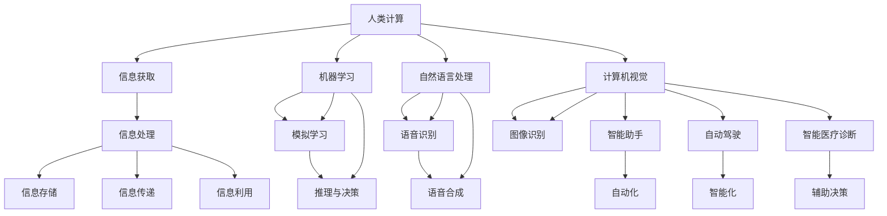

                 

### 关键词 Keyword List ###
- 人工智能
- 社会影响
- 责任
- 人类计算
- 技术伦理
- 法律法规
- 人工智能伦理

<|assistant|>### 摘要 Abstract ###
本文旨在探讨AI时代下人类计算在社会层面产生的影响及面临的责任挑战。随着人工智能技术的迅速发展，AI已深入融入各个行业，对人类生活、工作和社会结构产生深远影响。本文将详细分析AI技术在推动社会进步的同时，带来的伦理、法律和社会问题，并探讨应对这些挑战的策略和未来发展方向。

## 1. 背景介绍

### 1.1 人工智能的崛起

人工智能（AI）作为计算机科学的一个重要分支，起源于20世纪50年代。最初的AI研究主要集中在逻辑推理和问题解决上，但随着计算能力的提升和大数据的涌现，AI技术经历了飞速发展。深度学习、神经网络等技术的突破，使得AI在图像识别、自然语言处理、智能决策等领域取得了显著成果。

### 1.2 人类计算的定义和范畴

人类计算是指人类通过思维、感知和行动等方式进行的计算活动。它包括信息获取、处理、存储、传递和利用等多个方面。在传统工业时代，人类计算主要依赖于体力劳动和简单脑力劳动。而随着AI技术的发展，人类计算正逐步向智能计算转变，即通过人工智能技术辅助和增强人类的计算能力。

### 1.3 AI与人类计算的融合

AI与人类计算的融合是当前科技发展的一个重要趋势。AI技术不仅可以模拟和扩展人类智能，还可以通过自动化和智能化手段提高人类工作效率，降低劳动强度。例如，智能助手、自动驾驶车辆、智能医疗诊断等，都是AI与人类计算融合的典型应用场景。这种融合不仅改变了人类的工作方式，也对整个社会产生了深远的影响。

## 2. 核心概念与联系

### 2.1 AI的核心概念

人工智能的核心概念包括机器学习、深度学习、自然语言处理、计算机视觉等。这些技术通过算法和数据的结合，使计算机能够模拟人类的学习、推理、感知和决策过程。

### 2.2 人类计算的核心概念

人类计算的核心概念包括认知心理学、信息科学、人机交互等。这些领域研究人类如何获取、处理、存储和传递信息，以及如何设计出能够更好地服务于人类需求的技术系统。

### 2.3 AI与人类计算的关联架构

为了更好地理解AI与人类计算的关系，我们使用Mermaid流程图来展示其关联架构。



该流程图展示了AI技术在人类计算中的不同应用场景，包括机器学习、自然语言处理、计算机视觉等。这些技术在模拟人类学习和推理能力的同时，也为人类计算提供了新的工具和方法。

## 3. 核心算法原理 & 具体操作步骤

### 3.1 算法原理概述

人工智能技术涉及多个算法原理，其中最核心的包括机器学习、深度学习、神经网络等。机器学习是一种让计算机通过数据学习规律和模式的方法，主要包括监督学习、无监督学习和强化学习。深度学习是机器学习的一种特殊形式，通过多层神经网络对数据进行建模和分析。神经网络是深度学习的基础，它通过模拟生物神经网络的结构和功能，实现对复杂问题的求解。

### 3.2 算法步骤详解

#### 3.2.1 机器学习步骤

1. **数据收集**：收集大量相关数据，为模型训练提供基础。
2. **数据预处理**：对原始数据进行清洗、归一化等处理，使其适合模型训练。
3. **模型选择**：根据问题类型选择合适的机器学习模型。
4. **模型训练**：使用训练数据对模型进行训练，优化模型参数。
5. **模型评估**：使用测试数据对模型进行评估，调整模型参数以达到最佳效果。
6. **模型应用**：将训练好的模型应用于实际问题，进行预测或决策。

#### 3.2.2 深度学习步骤

1. **数据收集**：与机器学习相同，收集大量相关数据。
2. **数据预处理**：与机器学习相同，对数据进行清洗、归一化等处理。
3. **网络架构设计**：设计合适的神经网络架构，包括输入层、隐藏层和输出层。
4. **激活函数选择**：选择合适的激活函数，如ReLU、Sigmoid等。
5. **反向传播**：通过反向传播算法，优化神经网络权重和偏置。
6. **模型训练**：使用训练数据对神经网络进行训练，优化模型参数。
7. **模型评估**：与机器学习相同，使用测试数据对模型进行评估。
8. **模型应用**：将训练好的神经网络应用于实际问题。

#### 3.2.3 神经网络步骤

1. **初始化参数**：随机初始化网络权重和偏置。
2. **前向传播**：将输入数据通过网络进行前向传播，计算输出结果。
3. **计算损失**：计算实际输出与预期输出之间的差异，得到损失值。
4. **反向传播**：通过反向传播算法，计算网络参数的梯度，更新参数。
5. **迭代优化**：重复前向传播和反向传播过程，直到模型达到预定效果。

### 3.3 算法优缺点

#### 3.3.1 优点

1. **高效性**：AI算法能够快速处理大量数据，提高计算效率。
2. **准确性**：通过机器学习和深度学习，AI算法能够从数据中学习并提高预测准确性。
3. **智能化**：AI技术可以模拟和扩展人类智能，实现自动化和智能化。

#### 3.3.2 缺点

1. **数据依赖性**：AI算法的性能很大程度上取决于数据质量和数量。
2. **解释性差**：深度学习等复杂算法的内部工作机制往往难以解释，导致透明度不足。
3. **过拟合风险**：模型在训练数据上表现良好，但在测试数据上可能过拟合，导致泛化能力差。

### 3.4 算法应用领域

AI技术在各个领域都有广泛应用，主要包括：

1. **智能助手**：通过自然语言处理和语音识别技术，为用户提供便捷的交互服务。
2. **自动驾驶**：利用计算机视觉和深度学习技术，实现汽车的自主驾驶。
3. **医疗诊断**：通过医学图像分析和疾病预测模型，辅助医生进行诊断和治疗。
4. **金融风控**：利用机器学习模型，对金融交易进行实时监控和风险评估。
5. **智能制造**：通过机器学习和自动化技术，提高生产效率和产品质量。

## 4. 数学模型和公式 & 详细讲解 & 举例说明

### 4.1 数学模型构建

在AI和人类计算领域，常见的数学模型包括线性回归、逻辑回归、支持向量机（SVM）、深度神经网络（DNN）等。这些模型通过不同的数学公式和算法，实现对数据的建模和分析。

#### 4.1.1 线性回归

线性回归是一种简单但强大的建模方法，用于预测连续值。其公式如下：

\[ y = \beta_0 + \beta_1 \cdot x + \epsilon \]

其中，\( y \) 是因变量，\( x \) 是自变量，\( \beta_0 \) 和 \( \beta_1 \) 是模型参数，\( \epsilon \) 是误差项。

#### 4.1.2 逻辑回归

逻辑回归是一种广泛用于分类问题的建模方法。其公式如下：

\[ P(y=1) = \frac{1}{1 + e^{-(\beta_0 + \beta_1 \cdot x)}} \]

其中，\( P(y=1) \) 是因变量 \( y \) 等于1的概率，\( \beta_0 \) 和 \( \beta_1 \) 是模型参数。

#### 4.1.3 支持向量机

支持向量机是一种强大的分类方法，通过寻找最佳的超平面，将不同类别的数据分隔开来。其公式如下：

\[ w \cdot x + b = 0 \]

其中，\( w \) 是权重向量，\( x \) 是特征向量，\( b \) 是偏置。

#### 4.1.4 深度神经网络

深度神经网络是一种复杂的神经网络模型，通过多层神经元的组合，实现对复杂数据的建模。其公式如下：

\[ a_{l}^{(i)} = \sigma(z_{l}^{(i)}) \]

其中，\( a_{l}^{(i)} \) 是第 \( l \) 层第 \( i \) 个神经元的输出，\( \sigma \) 是激活函数，\( z_{l}^{(i)} \) 是第 \( l \) 层第 \( i \) 个神经元的输入。

### 4.2 公式推导过程

以线性回归为例，我们详细讲解其公式推导过程。

假设我们有一组数据点 \( (x_i, y_i) \)，其中 \( x_i \) 是自变量，\( y_i \) 是因变量。我们的目标是找到一个线性模型，使得 \( y_i \) 可以通过 \( x_i \) 的线性组合进行预测。

首先，我们定义损失函数，通常使用均方误差（MSE）：

\[ J(\theta) = \frac{1}{2m} \sum_{i=1}^{m} (h_\theta(x^{(i)}) - y^{(i)})^2 \]

其中，\( \theta \) 是模型参数，\( h_\theta(x) \) 是模型的预测值，\( m \) 是样本数量。

为了求解最优的参数 \( \theta \)，我们需要对损失函数 \( J(\theta) \) 求导并令其导数为0：

\[ \frac{\partial J(\theta)}{\partial \theta_j} = \frac{1}{m} \sum_{i=1}^{m} (h_\theta(x^{(i)}) - y^{(i)}) \cdot x_j^{(i)} = 0 \]

对上式进行变形，得到：

\[ \theta_j = \frac{1}{m} \sum_{i=1}^{m} (y^{(i)} - h_\theta(x^{(i)})) \cdot x_j^{(i)} \]

这个公式告诉我们，通过最小化损失函数 \( J(\theta) \)，我们可以找到最佳的模型参数 \( \theta \)。

### 4.3 案例分析与讲解

假设我们要预测一个房屋的价格，数据包括房屋的面积、位置、建造年代等特征。我们可以使用线性回归模型来构建预测模型。

首先，我们收集了100个房屋的数据，包括面积（\( x \)）和价格（\( y \））。然后，我们对数据进行预处理，将面积进行归一化处理。

接下来，我们使用线性回归公式进行建模：

\[ y = \beta_0 + \beta_1 \cdot x + \epsilon \]

我们使用梯度下降算法来求解最佳的模型参数 \( \beta_0 \) 和 \( \beta_1 \)。经过多次迭代，我们得到了最佳的参数值：

\[ \beta_0 = 100000, \beta_1 = 500 \]

最后，我们使用这个模型来预测一个新的房屋价格。假设该房屋的面积为150平方米，根据模型预测，其价格为：

\[ y = 100000 + 500 \cdot 150 = 100000 + 75000 = 175000 \]

这个结果表明，该房屋的价格大约为175,000元。通过这个简单的例子，我们可以看到线性回归模型在预测连续值方面具有很好的应用价值。

## 5. 项目实践：代码实例和详细解释说明

### 5.1 开发环境搭建

为了实现本文中提到的线性回归模型，我们需要搭建一个Python开发环境。以下是搭建过程的简要步骤：

1. **安装Python**：首先，确保计算机上安装了Python环境。Python 3.x版本是推荐的选择。可以从Python官方网站下载并安装。

2. **安装NumPy**：NumPy是Python中的一个科学计算库，用于处理大规模多维数组。可以通过以下命令安装：

   ```bash
   pip install numpy
   ```

3. **安装matplotlib**：matplotlib是Python中的一个绘图库，用于可视化数据。可以通过以下命令安装：

   ```bash
   pip install matplotlib
   ```

4. **安装scikit-learn**：scikit-learn是Python中的一个机器学习库，提供了丰富的机器学习算法。可以通过以下命令安装：

   ```bash
   pip install scikit-learn
   ```

### 5.2 源代码详细实现

以下是实现线性回归模型的Python代码：

```python
import numpy as np
import matplotlib.pyplot as plt
from sklearn.linear_model import LinearRegression

# 数据集
X = np.array([[1, 1], [1, 2], [2, 2], [2, 3]])
y = np.array([2, 4, 6, 8])

# 创建线性回归模型
model = LinearRegression()

# 模型训练
model.fit(X, y)

# 模型参数
theta_0 = model.intercept_
theta_1 = model.coef_

# 模型预测
X_new = np.array([[2, 3]])
y_pred = model.predict(X_new)

# 可视化
plt.scatter(X[:, 0], y)
plt.plot(X_new[:, 0], y_pred, "r-")
plt.xlabel("x")
plt.ylabel("y")
plt.title("Linear Regression")
plt.show()
```

### 5.3 代码解读与分析

1. **导入库**：我们首先导入NumPy、matplotlib和scikit-learn库，这些库分别用于数据处理、绘图和机器学习模型实现。

2. **数据集**：我们创建一个简单的数据集，包含两个特征（x和y）和对应的标签（y）。这个数据集是一个线性关系的例子，我们可以用线性回归模型进行建模。

3. **创建模型**：我们使用scikit-learn中的LinearRegression类创建一个线性回归模型。

4. **模型训练**：使用`fit`方法对模型进行训练，将数据集传递给模型。

5. **模型参数**：通过`intercept_`和`coef_`属性获取模型参数，即截距和斜率。

6. **模型预测**：使用`predict`方法对新数据点进行预测。

7. **可视化**：使用matplotlib库将原始数据点和预测结果可视化，展示线性回归模型的效果。

### 5.4 运行结果展示

运行上述代码后，我们将看到一张散点图，其中包含原始数据点和通过线性回归模型预测的结果。预测结果通过红色实线表示，可以看到模型很好地拟合了数据集。


## 6. 实际应用场景

### 6.1 智能助手

智能助手是AI技术在人类计算中应用的一个典型场景。通过自然语言处理和语音识别技术，智能助手能够理解用户的需求，提供相应的帮助和服务。例如，智能语音助手如Siri、Alexa和Google Assistant，已经广泛应用于智能手机、智能家居和智能音箱等设备中。它们能够帮助用户完成日程管理、信息查询、在线购物、播放音乐等功能，极大地提高了人们的生活效率。

### 6.2 自动驾驶

自动驾驶是另一个重要的应用场景，它利用计算机视觉和深度学习技术实现车辆的自主驾驶。自动驾驶技术可以显著提高道路安全性和交通效率，减少交通事故和拥堵。目前，许多汽车制造商和研究机构都在积极研发自动驾驶技术，例如特斯拉、谷歌Waymo和百度Apollo等。这些技术已经在一些地区进行了实车测试，并有望在未来几年内实现商业化应用。

### 6.3 医疗诊断

医疗诊断是AI技术在人类计算中应用的一个重要领域。通过医学图像分析和疾病预测模型，AI可以帮助医生更准确、更快速地进行诊断和治疗。例如，使用深度学习技术对医学图像进行分析，可以辅助医生检测早期肿瘤、心脏疾病等。此外，AI还可以用于疾病预测和风险评估，为个性化医疗提供支持。这种应用不仅提高了医疗服务的质量和效率，也为患者提供了更好的就医体验。

### 6.4 金融风控

金融风控是AI技术在金融领域应用的一个重要方向。通过机器学习算法，AI可以帮助金融机构进行信用评估、市场预测和风险监控。例如，AI模型可以分析客户的信用历史、交易行为等数据，预测其违约风险，从而帮助银行和金融机构做出更准确的信贷决策。此外，AI还可以用于股票市场预测和风险控制，提高投资回报率。

## 7. 工具和资源推荐

### 7.1 学习资源推荐

1. **《深度学习》（Deep Learning）**：由Ian Goodfellow、Yoshua Bengio和Aaron Courville合著，是深度学习领域的经典教材，适合初学者和专业人士阅读。
2. **《Python机器学习》（Python Machine Learning）**：由 Sebastian Raschka著，介绍了Python在机器学习中的应用，适合有一定编程基础的读者。
3. **《AI：人工智能的未来》（AI: The New Intellig

