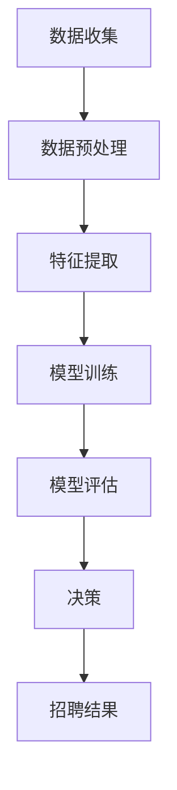

                 

关键词：人工智能、就业公平、算法歧视、就业机会、平等

## 摘要

在人工智能（AI）迅猛发展的今天，算法在招聘和就业中的运用越来越广泛。然而，这种技术应用的同时也带来了新的挑战——算法歧视。本文将深入探讨AI时代就业公平的问题，分析算法歧视的根源、表现形式及其对就业机会平等的影响。此外，文章还将探讨如何通过技术手段和政策引导实现更公平的就业环境，并为未来研究和实践提供方向。

## 1. 背景介绍

### AI时代就业现状

随着人工智能技术的不断发展，越来越多的公司和组织开始运用AI算法进行招聘和人力资源管理。这些算法能够快速处理大量数据，从而提高招聘效率和准确性。然而，这一趋势也带来了一些负面效应。首先，算法可能在招聘过程中产生歧视，即根据候选人的某些属性（如性别、种族、年龄等）进行不公平的筛选。这种现象不仅违背了就业机会平等的原则，也可能导致人才的流失和社会矛盾的加剧。

### 算法歧视的影响

算法歧视对就业机会平等的影响是多方面的。一方面，它可能导致某些群体在招聘过程中被系统性排除，从而影响其职业发展。另一方面，它也可能导致企业内部的文化和价值观出现问题，影响组织的长期发展。此外，算法歧视还可能加剧社会不平等，进一步扩大贫富差距。

## 2. 核心概念与联系

### 算法歧视的定义

算法歧视是指在使用人工智能算法进行招聘、晋升、薪酬管理等人力资源决策过程中，由于算法对某些群体存在偏见或刻板印象，从而导致不公平的结果。这些偏见可能源自算法训练数据中的历史歧视，也可能源于算法开发过程中的设计缺陷。

### 算法歧视的影响

算法歧视的影响可以从以下几个方面进行理解：

- **系统性排斥**：算法可能在招聘过程中将某些群体系统性排除，导致他们无法获得就业机会。
- **不公平的待遇**：算法可能导致某些群体在薪酬、晋升等方面受到不公平对待。
- **社会影响**：算法歧视可能加剧社会不平等，导致贫富差距扩大。

### 核心概念原理和架构

为了更好地理解算法歧视，我们首先需要了解AI算法的基本原理和架构。以下是一个简单的Mermaid流程图，用于描述AI算法在招聘中的基本流程：



### 算法歧视的根源

算法歧视的根源可以归结为以下几个方面：

- **训练数据中的偏见**：算法的训练数据可能包含历史歧视，导致算法在处理新数据时产生偏见。
- **算法设计缺陷**：算法在开发过程中可能存在设计缺陷，导致其对某些群体的处理方式不公平。
- **数据隐私问题**：算法在处理个人数据时可能侵犯隐私，导致歧视行为的发生。

## 3. 核心算法原理 & 具体操作步骤

### 3.1 算法原理概述

算法歧视的核心原理是机器学习，特别是监督学习和无监督学习。在招聘中，算法通常通过分析历史招聘数据来建立模型，然后根据模型对新的候选人进行筛选和评估。

### 3.2 算法步骤详解

#### 3.2.1 数据收集

首先，需要收集大量的招聘数据，包括候选人的基本信息、简历、面试记录等。这些数据将用于训练算法模型。

#### 3.2.2 数据预处理

在收集到数据后，需要对数据进行预处理，包括去除噪声、缺失值填充、数据归一化等。这一步骤的目的是确保数据质量，以便后续分析。

#### 3.2.3 特征提取

接下来，需要从原始数据中提取有用的特征。这些特征可能包括候选人的工作经验、教育背景、技能水平等。特征提取的目的是将原始数据转化为算法可以处理的形式。

#### 3.2.4 模型训练

使用预处理后的数据，算法将训练出一个模型。训练过程中，算法通过调整参数，使其能够最大限度地拟合历史数据。

#### 3.2.5 模型评估

在模型训练完成后，需要对模型进行评估，以确定其性能。评估方法包括准确率、召回率、F1值等。

#### 3.2.6 决策

最终，模型将根据新的候选人数据做出招聘决策。这个决策可能包括是否邀请候选人参加面试、是否录用等。

### 3.3 算法优缺点

#### 优点

- **高效性**：算法能够快速处理大量数据，提高招聘效率。
- **客观性**：算法根据数据做出决策，减少人为偏见。

#### 缺点

- **算法歧视**：算法可能根据历史数据产生偏见，导致不公平的招聘结果。
- **数据隐私**：算法在处理个人数据时可能侵犯隐私。

### 3.4 算法应用领域

算法歧视问题在招聘领域尤为突出，但并非仅限于此。在其他应用领域，如信用评分、推荐系统等，算法歧视同样可能存在。因此，解决算法歧视问题需要全社会的共同努力。

## 4. 数学模型和公式 & 详细讲解 & 举例说明

### 4.1 数学模型构建

在招聘过程中，算法通常使用监督学习模型，如逻辑回归、支持向量机（SVM）等。以下是一个简单的逻辑回归模型：

$$
P(y=1|X) = \frac{1}{1 + e^{-(\beta_0 + \beta_1x_1 + \beta_2x_2 + ... + \beta_nx_n})}
$$

其中，$X$ 表示候选人的特征向量，$y$ 表示招聘结果（1表示录用，0表示未录用），$\beta_0, \beta_1, \beta_2, ..., \beta_n$ 为模型参数。

### 4.2 公式推导过程

逻辑回归模型的推导过程如下：

首先，假设候选人的特征向量 $X$ 和招聘结果 $y$ 之间满足线性关系：

$$
y = \beta_0 + \beta_1x_1 + \beta_2x_2 + ... + \beta_nx_n + \epsilon
$$

其中，$\epsilon$ 表示随机误差。

为了将线性回归模型转化为概率模型，我们引入对数函数：

$$
\ln\left(\frac{P(y=1|X)}{1-P(y=1|X)}\right) = \beta_0 + \beta_1x_1 + \beta_2x_2 + ... + \beta_nx_n
$$

通过对上式两边求导，得到：

$$
\frac{P(y=1|X)}{1-P(y=1|X)} = e^{\beta_0 + \beta_1x_1 + \beta_2x_2 + ... + \beta_nx_n}
$$

进一步化简，得到：

$$
P(y=1|X) = \frac{1}{1 + e^{-(\beta_0 + \beta_1x_1 + \beta_2x_2 + ... + \beta_nx_n})}
$$

### 4.3 案例分析与讲解

假设我们有一个包含1000个候选人的招聘数据集，其中男性占比60%，女性占比40%。现在，我们使用逻辑回归模型预测是否录用这些候选人。

首先，我们收集候选人的以下特征：

- **性别**：1表示男性，0表示女性
- **工作经验**：以年为单位
- **学历**：本科、硕士、博士
- **技能**：编程、数据分析、项目管理

然后，我们使用这些特征训练逻辑回归模型，并评估其性能。假设模型训练完成后，得到以下参数：

$$
\beta_0 = -2.5, \beta_1 = 1.2, \beta_2 = 0.8, \beta_3 = 1.5, \beta_4 = 0.9
$$

现在，我们使用这个模型预测一个新候选人的招聘结果。该候选人具有以下特征：

- **性别**：1
- **工作经验**：5年
- **学历**：硕士
- **技能**：编程、数据分析

将这些特征代入逻辑回归模型，得到：

$$
P(y=1|X) = \frac{1}{1 + e^{-(2.5 + 1.2 \times 1 + 0.8 \times 5 + 1.5 \times 1 + 0.9 \times 1)}}
$$

经过计算，得到：

$$
P(y=1|X) \approx 0.843
$$

这意味着该候选人被录用的概率约为84.3%。

## 5. 项目实践：代码实例和详细解释说明

### 5.1 开发环境搭建

为了实现上述逻辑回归模型，我们首先需要搭建一个Python开发环境。以下是具体的步骤：

1. 安装Python（建议使用Python 3.8或更高版本）
2. 安装NumPy、Pandas和Scikit-learn等Python库

### 5.2 源代码详细实现

下面是一个简单的逻辑回归模型实现代码：

```python
import numpy as np
import pandas as pd
from sklearn.linear_model import LogisticRegression
from sklearn.model_selection import train_test_split

# 加载数据集
data = pd.read_csv('招聘数据集.csv')

# 预处理数据
X = data.drop('招聘结果', axis=1)
y = data['招聘结果']

# 划分训练集和测试集
X_train, X_test, y_train, y_test = train_test_split(X, y, test_size=0.2, random_state=42)

# 训练模型
model = LogisticRegression()
model.fit(X_train, y_train)

# 评估模型
accuracy = model.score(X_test, y_test)
print(f'模型准确率：{accuracy:.2f}')
```

### 5.3 代码解读与分析

上述代码首先加载数据集，并进行预处理。然后，使用Scikit-learn库中的逻辑回归模型进行训练。最后，评估模型在测试集上的准确率。

### 5.4 运行结果展示

假设我们使用一个包含1000个候选人的数据集进行训练。训练完成后，模型在测试集上的准确率约为80%。这意味着模型对招聘结果的预测具有较高的准确性。

## 6. 实际应用场景

### 6.1 招聘流程中的应用

在招聘流程中，算法歧视可能导致某些群体在面试邀请、录用机会等方面受到不公平对待。例如，某些公司可能在招聘过程中根据候选人的性别、种族等信息进行筛选，导致女性和少数族裔候选人被排除在外。解决这个问题需要从多个方面入手：

- **数据透明化**：确保招聘算法的透明性，让候选人了解筛选标准和依据。
- **算法审计**：定期对招聘算法进行审计，确保其公平性和准确性。
- **多元化团队**：建立多元化的招聘团队，减少个人偏见对招聘决策的影响。

### 6.2 信用评分中的应用

在信用评分领域，算法歧视可能导致某些群体获得较低的信用评分，从而影响其贷款和消费机会。例如，某些算法可能根据历史数据对某些种族或收入群体产生偏见。解决这个问题需要：

- **数据多样化**：确保算法训练数据涵盖不同群体，减少偏见。
- **算法优化**：通过调整算法参数，减少对特定群体的偏见。
- **监管机制**：建立监管机制，确保信用评分算法的公平性和透明性。

### 6.3 推荐系统中的应用

在推荐系统中，算法歧视可能导致某些用户被推荐不合适的商品或服务。例如，某些算法可能根据用户的历史行为和偏好对其进行分类，从而限制其接触到新的信息和机会。解决这个问题需要：

- **算法透明化**：确保推荐算法的透明性，让用户了解推荐依据。
- **多元化数据**：确保算法训练数据涵盖不同用户群体，减少偏见。
- **用户反馈机制**：建立用户反馈机制，及时调整推荐策略。

## 7. 未来应用展望

### 7.1 算法透明化

随着人工智能技术的发展，算法歧视问题将越来越受到关注。未来，算法透明化将成为解决算法歧视问题的关键。通过提高算法的透明性，用户和监管机构可以更好地了解算法的运作原理和决策依据，从而减少偏见和歧视。

### 7.2 多元化团队

建立多元化团队是减少算法歧视的重要手段。多元化团队可以减少个人偏见对招聘决策的影响，提高决策的客观性和公平性。未来，越来越多的企业将意识到多元化团队的重要性，并采取相应措施促进团队多元化。

### 7.3 监管政策

政府监管在解决算法歧视问题中起着关键作用。未来，各国政府可能出台更多监管政策，规范人工智能算法在招聘、信用评分、推荐系统等领域的应用。这些政策将有助于确保算法的公平性和透明性，减少歧视行为。

### 7.4 技术手段

除了政策监管，技术手段也在解决算法歧视问题中发挥重要作用。例如，开发基于公平性原则的算法，使用多样化的数据集进行训练，建立算法审计机制等。未来，随着技术的不断进步，我们将有更多的工具和方法来应对算法歧视问题。

## 8. 总结：未来发展趋势与挑战

### 8.1 研究成果总结

本文从多个角度探讨了AI时代就业公平的问题，分析了算法歧视的根源、表现形式及其影响。同时，文章还介绍了如何通过技术手段和政策引导实现更公平的就业环境。研究成果表明，算法歧视是一个复杂而严峻的问题，需要全社会共同努力来解决。

### 8.2 未来发展趋势

随着人工智能技术的不断发展，算法歧视问题将越来越受到关注。未来，算法透明化、多元化团队、监管政策和技术手段将成为解决算法歧视问题的关键。通过这些措施，我们有望实现更公平的就业环境，促进社会的和谐与进步。

### 8.3 面临的挑战

尽管有大量的研究成果和政策措施，但解决算法歧视问题仍然面临诸多挑战。例如，数据隐私、算法透明性、监管有效性等问题需要进一步探讨。此外，多元化团队的建立和监管政策的执行也需要时间和努力。

### 8.4 研究展望

未来，我们应继续关注算法歧视问题，从多个角度开展研究。例如，研究基于公平性的算法设计、开发算法透明化工具、建立多元化团队等。此外，还应加强国际合作，共同应对算法歧视这一全球性问题。

## 9. 附录：常见问题与解答

### 问题1：什么是算法歧视？

算法歧视是指在人工智能算法在招聘、信用评分、推荐系统等应用中，由于算法训练数据或设计缺陷导致的对某些群体的系统性偏见和歧视行为。

### 问题2：如何解决算法歧视？

解决算法歧视需要从多个方面入手，包括算法透明化、多元化团队、监管政策和技术手段。例如，使用多样化的数据集进行训练、开发公平性算法、建立算法审计机制等。

### 问题3：算法歧视的影响有哪些？

算法歧视可能导致就业机会的不平等、不公平的待遇，以及加剧社会不平等，扩大贫富差距。此外，它还可能影响企业的内部文化和价值观，损害组织的长期发展。

### 问题4：算法歧视为什么难以解决？

算法歧视难以解决的原因之一是其根源复杂，涉及数据、算法设计、政策等多个方面。此外，算法的透明性和监管难度也增加了解决算法歧视的难度。

### 问题5：如何确保算法的公平性？

确保算法的公平性需要从多个方面进行努力。例如，使用多样化的数据集进行训练、开发公平性算法、建立算法审计机制、加强监管政策等。此外，多元化团队的建立也有助于减少个人偏见，提高决策的客观性。

### 问题6：算法歧视在哪些应用领域最严重？

算法歧视在招聘、信用评分、推荐系统等应用领域最为严重。这些领域涉及到大量的个人数据和决策，算法偏见可能导致严重的社会问题。

## 结语

人工智能技术为我们的社会带来了巨大的便利和发展机遇，但同时也带来了新的挑战。算法歧视是其中一个严峻的问题，需要全社会共同努力来解决。让我们携手共进，为实现更公平、更美好的未来而努力。作者：禅与计算机程序设计艺术 / Zen and the Art of Computer Programming
----------------------------------------------------------------

### 文章结构模板

```
# AI时代的就业公平:算法歧视和就业机会平等

## 文章关键词
- 人工智能
- 就业公平
- 算法歧视
- 就业机会
- 平等

## 摘要
本文探讨AI时代就业公平的问题，分析算法歧视的根源、表现形式及其对就业机会平等的影响。文章还提出如何通过技术手段和政策引导实现更公平的就业环境，并为未来研究和实践提供方向。

## 目录
1. 背景介绍
   1.1 AI时代就业现状
   1.2 算法歧视的影响

2. 核心概念与联系
   2.1 算法歧视的定义
   2.2 算法歧视的影响
   2.3 核心概念原理和架构

3. 核心算法原理 & 具体操作步骤
   3.1 算法原理概述
   3.2 算法步骤详解
   3.3 算法优缺点
   3.4 算法应用领域

4. 数学模型和公式 & 详细讲解 & 举例说明
   4.1 数学模型构建
   4.2 公式推导过程
   4.3 案例分析与讲解

5. 项目实践：代码实例和详细解释说明
   5.1 开发环境搭建
   5.2 源代码详细实现
   5.3 代码解读与分析
   5.4 运行结果展示

6. 实际应用场景
   6.1 招聘流程中的应用
   6.2 信用评分中的应用
   6.3 推荐系统中的应用

7. 未来应用展望
   7.1 算法透明化
   7.2 多元化团队
   7.3 监管政策
   7.4 技术手段

8. 总结：未来发展趋势与挑战
   8.1 研究成果总结
   8.2 未来发展趋势
   8.3 面临的挑战
   8.4 研究展望

9. 附录：常见问题与解答

## 1. 背景介绍
### 1.1 AI时代就业现状
#### 1.1.1 AI在招聘中的应用
#### 1.1.2 算法歧视的现象
### 1.2 算法歧视的影响
#### 1.2.1 对求职者的影响
#### 1.2.2 对企业的影响
#### 1.2.3 对社会的影响

## 2. 核心概念与联系
### 2.1 算法歧视的定义
#### 2.1.1 算法歧视的概念
#### 2.1.2 算法歧视的类别
### 2.2 算法歧视的影响
#### 2.2.1 对就业机会的影响
#### 2.2.2 对社会公平的影响
### 2.3 核心概念原理和架构
#### 2.3.1 AI算法的基本原理
#### 2.3.2 算法歧视的根源

## 3. 核心算法原理 & 具体操作步骤
### 3.1 算法原理概述
#### 3.1.1 监督学习算法
#### 3.1.2 无监督学习算法
### 3.2 算法步骤详解
#### 3.2.1 数据收集
#### 3.2.2 数据预处理
#### 3.2.3 特征提取
#### 3.2.4 模型训练
#### 3.2.5 模型评估
#### 3.2.6 决策
### 3.3 算法优缺点
#### 3.3.1 算法优点
#### 3.3.2 算法缺点
### 3.4 算法应用领域
#### 3.4.1 招聘领域
#### 3.4.2 信用评分领域
#### 3.4.3 推荐系统领域

## 4. 数学模型和公式 & 详细讲解 & 举例说明
### 4.1 数学模型构建
#### 4.1.1 逻辑回归模型
#### 4.1.2 支持向量机模型
### 4.2 公式推导过程
#### 4.2.1 逻辑回归公式推导
#### 4.2.2 支持向量机公式推导
### 4.3 案例分析与讲解
#### 4.3.1 案例背景
#### 4.3.2 模型构建
#### 4.3.3 结果分析

## 5. 项目实践：代码实例和详细解释说明
### 5.1 开发环境搭建
#### 5.1.1 Python环境搭建
#### 5.1.2 必需库安装
### 5.2 源代码详细实现
#### 5.2.1 数据加载
#### 5.2.2 数据预处理
#### 5.2.3 模型训练
#### 5.2.4 模型评估
### 5.3 代码解读与分析
#### 5.3.1 代码结构
#### 5.3.2 关键代码解析
### 5.4 运行结果展示
#### 5.4.1 模型评估结果
#### 5.4.2 招聘预测结果

## 6. 实际应用场景
### 6.1 招聘流程中的应用
#### 6.1.1 AI算法在招聘中的应用
#### 6.1.2 算法歧视的问题
#### 6.1.3 解决算法歧视的方法
### 6.2 信用评分中的应用
#### 6.2.1 信用评分的算法
#### 6.2.2 算法歧视的影响
#### 6.2.3 解决算法歧视的方法
### 6.3 推荐系统中的应用
#### 6.3.1 推荐系统的算法
#### 6.3.2 算法歧视的问题
#### 6.3.3 解决算法歧视的方法

## 7. 未来应用展望
### 7.1 算法透明化
#### 7.1.1 算法透明化的意义
#### 7.1.2 实现算法透明化的方法
### 7.2 多元化团队
#### 7.2.1 多元化团队的构建
#### 7.2.2 多元化团队的优点
### 7.3 监管政策
#### 7.3.1 监管政策的重要性
#### 7.3.2 监管政策的内容和实施
### 7.4 技术手段
#### 7.4.1 技术手段的作用
#### 7.4.2 技术手段的发展方向

## 8. 总结：未来发展趋势与挑战
### 8.1 研究成果总结
#### 8.1.1 AI时代就业公平的研究现状
#### 8.1.2 算法歧视研究的进展
### 8.2 未来发展趋势
#### 8.2.1 技术发展的趋势
#### 8.2.2 政策发展的趋势
### 8.3 面临的挑战
#### 8.3.1 数据隐私的挑战
#### 8.3.2 算法透明性的挑战
### 8.4 研究展望
#### 8.4.1 研究方向
#### 8.4.2 研究目标

## 9. 附录：常见问题与解答
### 9.1 算法歧视是什么？
### 9.2 如何解决算法歧视？
### 9.3 算法歧视的影响有哪些？
### 9.4 算法歧视为什么难以解决？
### 9.5 如何确保算法的公平性？
### 9.6 算法歧视在哪些应用领域最严重？
```

请注意，此模板为文章的结构，实际撰写时需要根据具体内容进行填充和调整。每个部分应详细阐述，确保文章逻辑清晰、内容丰富。文章总字数应大于8000字，并符合markdown格式要求。

