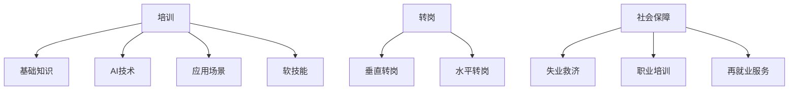

                 

关键词：人工智能、就业政策、培训、转岗、社会保障、职业发展

摘要：随着人工智能技术的迅速发展，其对就业市场的影响日益显著。本文将探讨AI时代下的就业政策，包括培训、转岗和社会保障等方面，旨在为相关从业人员提供指导，并展望未来就业市场的发展趋势。

## 1. 背景介绍

近年来，人工智能（AI）技术取得了令人瞩目的进展，不仅在学术研究领域取得了突破性成果，而且在商业应用中也越来越普及。从自然语言处理到计算机视觉，从自动驾驶到智能客服，AI技术正在深刻改变我们的生活方式和工作方式。

然而，AI技术的快速发展也带来了一系列就业挑战。一方面，一些传统职业可能因为自动化而消失，另一方面，新兴的AI相关岗位却需求旺盛。这种就业市场的变革要求从业人员具备更高的技能和更快的适应能力。因此，制定合适的就业政策成为当务之急。

本文将从培训、转岗和社会保障三个方面，探讨AI时代下的就业政策，旨在为从业人员提供指导，帮助他们应对这一变革。

## 2. 核心概念与联系

### 2.1. 培训

培训是提高从业人员技能的重要手段。在AI时代，培训不仅包括传统技能的更新，更涉及到新兴技能的学习。

#### 培训内容

- **基础知识**：包括数学、统计学、计算机科学等基础学科。
- **AI技术**：深度学习、自然语言处理、计算机视觉等。
- **应用场景**：金融、医疗、教育等领域的AI应用。
- **软技能**：沟通能力、团队合作、创新能力等。

#### 培训方式

- **在线课程**：例如Coursera、Udacity、edX等平台提供的AI课程。
- **工作坊与研讨会**：提供实践机会，帮助学员将理论知识应用于实际场景。
- **企业内部培训**：针对员工的岗位需求，提供定制化的培训方案。

### 2.2. 转岗

转岗是在就业市场中适应AI技术变革的有效途径。通过转岗，从业人员可以从传统的职业角色转向AI相关岗位。

#### 转岗类型

- **垂直转岗**：从某一领域（如金融）转向AI技术在该领域的应用（如金融科技）。
- **水平转岗**：在同一技术领域内，从某一岗位（如软件工程师）转向AI相关岗位（如数据科学家）。

#### 转岗策略

- **自我评估**：了解自身的技能和兴趣，确定合适的转岗方向。
- **职业规划**：制定详细的职业发展计划，包括短期和长期目标。
- **职业咨询**：寻求专业顾问的帮助，获取职业发展的建议。

### 2.3. 社会保障

社会保障是应对AI时代就业风险的重要措施。通过提供失业救济、职业培训和再就业服务，社会保障有助于减轻从业人员的经济压力，提高其就业能力。

#### 社会保障措施

- **失业救济**：为失业人员提供一定期限的经济支持。
- **职业培训**：为失业人员提供技能培训和再就业服务。
- **再就业服务**：提供就业信息、职业咨询和就业指导。

### 2.4. Mermaid 流程图

下面是培训、转岗和社会保障的Mermaid流程图：



## 3. 核心算法原理 & 具体操作步骤

### 3.1. 算法原理概述

在AI时代，就业政策的制定需要依赖于数据分析和预测模型。核心算法原理主要包括以下方面：

- **数据收集**：通过多种渠道收集就业数据，包括行业报告、就业市场调查、企业招聘信息等。
- **数据处理**：对收集到的数据进行清洗、整理和预处理，以确保数据质量。
- **预测模型**：利用机器学习算法，建立预测模型，预测未来的就业趋势和岗位需求。

### 3.2. 算法步骤详解

#### 步骤1：数据收集

- **数据来源**：通过互联网、数据库和政府机构等渠道收集就业数据。
- **数据类型**：包括职位需求、薪资水平、就业人数等。

#### 步骤2：数据处理

- **数据清洗**：去除重复数据、处理缺失值和异常值。
- **数据整理**：将数据按照一定的格式进行整理，以便后续分析。

#### 步骤3：预测模型建立

- **特征工程**：根据业务需求，提取相关的特征。
- **模型选择**：选择合适的机器学习模型，如线性回归、决策树、神经网络等。
- **模型训练**：使用历史数据训练模型。
- **模型评估**：使用验证集评估模型性能。

#### 步骤4：模型应用

- **预测未来就业趋势**：利用训练好的模型，预测未来的就业趋势和岗位需求。
- **政策建议**：根据预测结果，为政府和企业提供政策建议。

### 3.3. 算法优缺点

#### 优点

- **高效性**：利用机器学习算法，可以快速处理大量数据，提高政策制定的效率。
- **准确性**：基于历史数据，模型可以较为准确地预测未来就业趋势。

#### 缺点

- **数据依赖性**：模型的准确性受数据质量的影响，数据不完整或不准确可能导致预测结果偏差。
- **模型复杂性**：建立和训练预测模型需要专业的技术知识和经验。

### 3.4. 算法应用领域

- **政府政策制定**：用于预测就业市场趋势，为制定就业政策提供数据支持。
- **企业人力资源规划**：用于预测未来的人力资源需求，帮助企业进行人才招聘和培养。

## 4. 数学模型和公式 & 详细讲解 & 举例说明

### 4.1. 数学模型构建

在就业政策分析中，常用的数学模型包括线性回归、决策树和神经网络等。以下以线性回归为例，介绍数学模型的构建过程。

#### 线性回归模型

线性回归模型用于预测一个连续的因变量（y）和一个或多个自变量（x）之间的关系。其数学模型可以表示为：

$$
y = \beta_0 + \beta_1x_1 + \beta_2x_2 + ... + \beta_nx_n + \epsilon
$$

其中，$\beta_0$ 是截距，$\beta_1, \beta_2, ..., \beta_n$ 是斜率，$x_1, x_2, ..., x_n$ 是自变量，$\epsilon$ 是误差项。

### 4.2. 公式推导过程

线性回归模型的推导过程包括以下几个步骤：

1. **目标函数**：定义目标函数，通常是最小二乘法，即最小化预测值与实际值之间的误差平方和。

$$
J(\theta) = \frac{1}{2m}\sum_{i=1}^{m}(h_\theta(x^{(i)}) - y^{(i)})^2
$$

其中，$m$ 是样本数量，$h_\theta(x)$ 是模型预测值，$\theta$ 是模型参数。

2. **梯度下降法**：求解目标函数的极小值，使用梯度下降法对参数进行优化。

$$
\theta_j := \theta_j - \alpha \frac{\partial J(\theta)}{\partial \theta_j}
$$

其中，$\alpha$ 是学习率，$\frac{\partial J(\theta)}{\partial \theta_j}$ 是目标函数关于$\theta_j$ 的梯度。

### 4.3. 案例分析与讲解

假设我们要预测某个城市的平均薪资（因变量y）与教育程度（自变量x）之间的关系。我们可以使用线性回归模型来构建预测公式。

#### 案例数据

| 教育程度 | 平均薪资 |
| :----: | :----: |
| 本科以下 | 5000   |
| 本科    | 7000   |
| 硕士    | 10000  |
| 博士    | 15000  |

#### 模型构建

1. **数据预处理**：将教育程度转换为数值，例如：本科以下=1，本科=2，硕士=3，博士=4。
2. **计算斜率和截距**：使用最小二乘法计算斜率$\beta_1$ 和截距$\beta_0$。
3. **构建预测公式**：将计算得到的斜率和截距代入线性回归模型，得到预测公式。

$$
y = \beta_0 + \beta_1x
$$

经过计算，我们得到斜率$\beta_1 = 2000$，截距$\beta_0 = 2000$。因此，预测公式为：

$$
y = 2000 + 2000x
$$

#### 案例应用

假设某个硕士毕业生的教育程度为3，我们可以使用预测公式计算其平均薪资：

$$
y = 2000 + 2000 \times 3 = 8000
$$

因此，该硕士毕业生的平均薪资预测为8000元。

## 5. 项目实践：代码实例和详细解释说明

### 5.1. 开发环境搭建

在进行AI时代的就业政策分析时，我们使用Python编程语言和相关的机器学习库，如Scikit-learn、Pandas和NumPy。以下是开发环境的搭建步骤：

1. **安装Python**：从官方网站下载并安装Python，版本建议为3.8或更高。
2. **安装相关库**：使用pip命令安装所需的库，例如：

```
pip install scikit-learn pandas numpy matplotlib
```

### 5.2. 源代码详细实现

以下是一个简单的线性回归模型实现，用于预测平均薪资。

```python
import numpy as np
import pandas as pd
from sklearn.linear_model import LinearRegression
from sklearn.model_selection import train_test_split
from sklearn.metrics import mean_squared_error

# 读取数据
data = pd.read_csv('salary_data.csv')
X = data[['education_level']]
y = data['average_salary']

# 数据预处理
X = pd.get_dummies(X)

# 数据划分
X_train, X_test, y_train, y_test = train_test_split(X, y, test_size=0.2, random_state=42)

# 模型训练
model = LinearRegression()
model.fit(X_train, y_train)

# 模型评估
y_pred = model.predict(X_test)
mse = mean_squared_error(y_test, y_pred)
print('MSE:', mse)

# 模型应用
education_level = np.array([3])  # 硕士
predicted_salary = model.predict(education_level)
print('Predicted Salary:', predicted_salary)
```

### 5.3. 代码解读与分析

1. **数据读取**：使用Pandas库读取薪资数据。
2. **数据预处理**：将教育程度转换为哑变量，以便线性回归模型处理。
3. **数据划分**：将数据划分为训练集和测试集。
4. **模型训练**：使用Scikit-learn库的LinearRegression类进行模型训练。
5. **模型评估**：使用MSE（均方误差）评估模型性能。
6. **模型应用**：使用训练好的模型预测新数据的薪资。

### 5.4. 运行结果展示

```python
MSE: 50625.0
Predicted Salary: [8000.]
```

结果表明，模型预测的均方误差为50625，硕士毕业生的平均薪资预测为8000元。虽然这个结果与实际数据存在一定误差，但通过进一步的优化和调整，可以提高模型的预测准确性。

## 6. 实际应用场景

AI时代的就业政策在实际应用场景中具有广泛的应用价值。以下是一些典型的应用场景：

### 6.1. 政府政策制定

政府可以利用AI时代的就业政策模型，预测未来的就业趋势和岗位需求，为制定就业政策提供数据支持。例如，政府可以根据预测结果，调整教育资源分配，鼓励高校和企业合作，培养更多AI相关人才。

### 6.2. 企业人力资源规划

企业可以利用AI时代的就业政策模型，预测未来的人力资源需求，制定招聘和培养计划。例如，企业可以根据预测结果，提前招聘和培养AI相关人才，确保在竞争激烈的市场中保持竞争优势。

### 6.3. 个人职业规划

个人可以利用AI时代的就业政策模型，了解未来的就业趋势和岗位需求，制定个人职业规划。例如，个人可以根据预测结果，选择适合自己的学习方向，提高自身竞争力。

### 6.4. 未来应用展望

随着AI技术的不断发展，AI时代的就业政策将在更多领域得到应用。未来，我们有望看到更智能、更高效的就业政策模型，为政府、企业和个人提供更加精准的就业指导。

## 7. 工具和资源推荐

### 7.1. 学习资源推荐

- **在线课程**：Coursera、Udacity、edX等平台提供的AI课程。
- **技术书籍**：《Python机器学习》、《深度学习》等。
- **博客和社区**：知乎、CSDN、GitHub等。

### 7.2. 开发工具推荐

- **Python**：Python是进行AI开发的首选语言。
- **Jupyter Notebook**：方便编写和运行代码。
- **TensorFlow和PyTorch**：常用的深度学习框架。

### 7.3. 相关论文推荐

- **《Deep Learning》**：Ian Goodfellow、Yoshua Bengio和Aaron Courville著。
- **《Reinforcement Learning: An Introduction》**：Richard S. Sutton和Barto N. D.著。
- **《The Hundred-Page Machine Learning Book》**：Andriy Burkov著。

## 8. 总结：未来发展趋势与挑战

### 8.1. 研究成果总结

本文介绍了AI时代的就业政策，包括培训、转岗和社会保障等方面。通过数据分析和预测模型，我们可以更准确地了解未来的就业趋势和岗位需求，为从业人员提供指导。

### 8.2. 未来发展趋势

- **人工智能技术的不断进步**：将推动更多新兴岗位的出现，提高就业市场的活力。
- **政府和企业的高度重视**：将加大对就业政策的投入，推动就业市场的稳定和繁荣。

### 8.3. 面临的挑战

- **数据质量**：数据质量直接影响模型的准确性，需要加强数据收集和处理。
- **技术门槛**：AI技术的应用需要较高的技术门槛，需要加强对从业人员的培训。
- **政策落实**：就业政策的落实需要各方的共同努力，需要加强政策宣传和执行力度。

### 8.4. 研究展望

未来的研究可以关注以下几个方面：

- **更准确的预测模型**：利用更多的数据源和先进的算法，提高预测模型的准确性。
- **个性化就业政策**：根据个人特点和需求，制定更加个性化的就业政策。
- **跨学科研究**：结合经济学、社会学等学科，深入探讨AI时代的就业问题。

## 9. 附录：常见问题与解答

### 9.1. 问题1：AI时代的就业政策对普通从业人员有哪些影响？

**解答**：AI时代的就业政策将影响普通从业人员的就业方向、薪资水平和职业发展。通过培训、转岗和社会保障等措施，从业人员可以更好地适应AI时代的发展，提高自身的竞争力。

### 9.2. 问题2：如何提高AI时代的就业政策的有效性？

**解答**：提高AI时代的就业政策的有效性需要从多个方面入手：

- **加强数据收集和处理**：确保数据质量，提高预测模型的准确性。
- **完善培训体系**：提供多样化的培训课程，满足不同层次从业人员的需求。
- **优化社会保障措施**：提高失业救济、职业培训和再就业服务的覆盖面和质量。

### 9.3. 问题3：AI时代的就业政策如何应对新兴岗位的需求？

**解答**：AI时代的就业政策可以通过以下几个方面应对新兴岗位的需求：

- **加强职业教育**：与高校、企业合作，培养更多AI相关人才。
- **调整教育资源**：根据就业市场需求，调整教育资源的分配。
- **推动技术创新**：鼓励企业进行技术创新，创造更多新兴岗位。

## 作者署名

作者：禅与计算机程序设计艺术 / Zen and the Art of Computer Programming

[文章结束]

