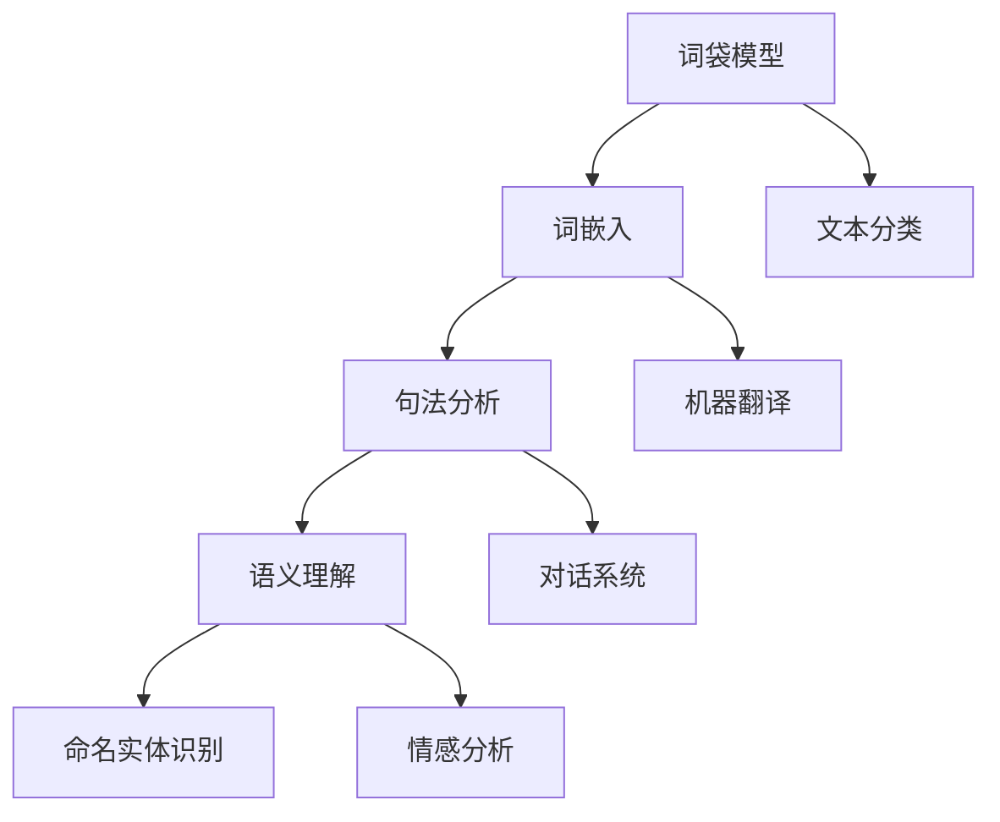

                 

关键词：自然语言处理，人工智能，深度学习，产业应用，算法优化，数据隐私

## 摘要

本文将探讨自然语言处理（NLP）在人工智能（AI）时代的发展，从实验室研究到产业应用的完整过程。我们将首先介绍NLP的基本概念和当前主要的研究方向，然后深入探讨NLP中的核心算法，如词向量表示、递归神经网络（RNN）、长短期记忆网络（LSTM）和Transformer等。接着，我们将分析这些算法在实际应用场景中的表现，包括文本分类、机器翻译、情感分析和对话系统等。随后，我们将讨论NLP在各个产业中的应用案例，并展望其未来的发展趋势和面临的挑战。最后，我们将推荐一些学习和开发资源，以帮助读者进一步探索这个领域的奥秘。

## 1. 背景介绍

自然语言处理（NLP）是人工智能（AI）领域的一个重要分支，旨在使计算机能够理解和生成自然语言。自上世纪五六十年代以来，NLP经历了多个发展阶段。早期的研究主要关注形式语言理论和语法分析，如上下文无关文法（CFG）和句法分析。随着计算机性能的提升和大数据时代的到来，NLP逐渐转向统计方法和机器学习方法，特别是深度学习在NLP中的应用，使得许多复杂任务取得了突破性进展。

### 1.1 NLP的重要性

NLP在许多领域都有广泛的应用，包括语言翻译、智能客服、内容推荐、情感分析和信息检索等。随着互联网的普及和信息的爆炸性增长，如何从大量文本数据中提取有用信息，成为了一个迫切需要解决的问题。NLP技术能够帮助人们更高效地处理信息，提高生产力和生活质量。同时，NLP也是实现人机交互的重要手段，使得计算机能够更好地理解人类的需求和意图。

### 1.2 当前研究方向

当前，NLP的研究主要集中在以下几个方面：

1. **词向量表示**：如何有效地将词汇映射到高维空间，以便计算机可以处理。
2. **句法分析**：解析句子的结构，理解词与词之间的关系。
3. **语义理解**：识别词汇和句子的含义，以及它们在特定上下文中的意义。
4. **对话系统**：设计能够与人类进行自然对话的计算机程序。
5. **情感分析**：检测文本中的情感倾向，如正面、负面或中性。

## 2. 核心概念与联系

为了更好地理解NLP的核心概念，我们首先需要了解几个基本术语：

- **词袋模型**（Bag of Words，BOW）：将文本表示为词汇的集合，不考虑词的顺序。
- **词嵌入**（Word Embedding）：将词汇映射到低维空间，以便计算机处理。
- **语法分析**（Parsing）：分析句子的结构，理解词与词之间的关系。
- **命名实体识别**（Named Entity Recognition，NER）：识别文本中的特定实体，如人名、地名和机构名。

下面是一个使用Mermaid绘制的流程图，展示了NLP的核心概念及其相互关系：



### 2.1 词向量表示

词向量表示是NLP中最基本的概念之一。它将词汇映射到高维空间中的向量，使得计算机可以处理。词向量表示的早期方法包括词袋模型和单一向量表示。然而，这些方法无法捕捉词汇之间的语义关系。

- **词袋模型**：将文本表示为词汇的集合，不考虑词的顺序。这种方法简单但无法捕捉词汇的语义信息。
- **词嵌入**：将词汇映射到低维空间，使得计算机可以处理。词嵌入模型如Word2Vec和GloVe，通过训练大量文本数据，将词汇映射到具有丰富语义信息的向量。

### 2.2 句法分析

句法分析是NLP中的一个重要任务，旨在解析句子的结构，理解词与词之间的关系。句法分析可以分为两部分：词法分析和句法分析。

- **词法分析**：将文本分解成单词和其他语法单位，如标点符号和数字。
- **句法分析**：分析句子的结构，建立词与词之间的关系。常见的句法分析方法包括上下文无关文法（CFG）和依存句法分析。

### 2.3 语义理解

语义理解是NLP中的另一个关键任务，旨在识别词汇和句子的含义，以及它们在特定上下文中的意义。语义理解可以分为两部分：词义消歧和语义角色标注。

- **词义消歧**：在多义词的上下文中确定正确的词义。
- **语义角色标注**：识别句子中的名词和动词的语义角色，如主语、宾语和修饰语。

### 2.4 命名实体识别

命名实体识别（NER）是NLP中的一个重要任务，旨在识别文本中的特定实体，如人名、地名和机构名。NER在信息抽取和语义理解中发挥着重要作用。

### 2.5 文本分类

文本分类是将文本数据按照其主题或属性进行分类的任务。常见的文本分类方法包括基于统计的方法和基于深度学习的方法。基于统计的方法如朴素贝叶斯和逻辑回归，而基于深度学习的方法如卷积神经网络（CNN）和循环神经网络（RNN）。

### 2.6 机器翻译

机器翻译是将一种语言文本翻译成另一种语言的过程。机器翻译可以分为基于规则的方法和基于数据的方法。基于规则的方法依赖于手工编写的规则，而基于数据的方法如神经机器翻译（NMT），通过训练大量平行语料库，使得计算机能够自动生成翻译。

### 2.7 对话系统

对话系统是NLP中的一个重要应用领域，旨在设计能够与人类进行自然对话的计算机程序。对话系统可以分为基于规则的方法和基于机器学习的方法。基于规则的方法如聊天机器人，而基于机器学习的方法如对话生成模型。

### 2.8 情感分析

情感分析是NLP中的一个重要任务，旨在检测文本中的情感倾向，如正面、负面或中性。情感分析在社交媒体分析、客户反馈分析和市场研究等领域具有广泛的应用。

## 3. 核心算法原理 & 具体操作步骤

### 3.1 算法原理概述

在NLP中，有许多核心算法用于实现各种任务。以下是几个主要的算法及其原理：

1. **词向量表示**：如Word2Vec和GloVe，通过训练大量文本数据，将词汇映射到具有丰富语义信息的向量。
2. **递归神经网络（RNN）**：如LSTM和GRU，用于处理序列数据，如文本和语音。
3. **卷积神经网络（CNN）**：用于文本分类和情感分析，通过局部特征提取来捕捉文本中的语义信息。
4. **Transformer**：一种基于自注意力机制的深度学习模型，广泛应用于机器翻译、对话系统和文本生成等任务。

### 3.2 算法步骤详解

下面我们将详细讨论每个算法的具体操作步骤。

#### 3.2.1 词向量表示

1. **数据预处理**：读取文本数据，进行分词、去停用词等操作。
2. **构建词汇表**：将文本中的词汇构建成一个词汇表，并为每个词汇分配一个唯一的索引。
3. **训练词向量**：使用Word2Vec或GloVe算法训练词向量，将词汇映射到高维空间中的向量。
4. **词向量应用**：在NLP任务中使用训练好的词向量，如文本分类、机器翻译和对话系统。

#### 3.2.2 递归神经网络（RNN）

1. **数据预处理**：读取文本数据，进行分词、去停用词等操作。
2. **序列编码**：将文本序列编码成整数序列，使用词向量表示每个词汇。
3. **构建RNN模型**：使用LSTM或GRU构建RNN模型，对序列数据进行处理。
4. **模型训练**：使用训练数据训练RNN模型，优化模型参数。
5. **模型应用**：在NLP任务中使用训练好的RNN模型，如文本分类、机器翻译和对话系统。

#### 3.2.3 卷积神经网络（CNN）

1. **数据预处理**：读取文本数据，进行分词、去停用词等操作。
2. **序列编码**：将文本序列编码成整数序列，使用词向量表示每个词汇。
3. **构建CNN模型**：使用卷积神经网络构建文本分类或情感分析模型。
4. **模型训练**：使用训练数据训练CNN模型，优化模型参数。
5. **模型应用**：在NLP任务中使用训练好的CNN模型，如文本分类、情感分析和文本生成。

#### 3.2.4 Transformer

1. **数据预处理**：读取文本数据，进行分词、去停用词等操作。
2. **序列编码**：将文本序列编码成整数序列，使用词向量表示每个词汇。
3. **构建Transformer模型**：使用多头自注意力机制构建Transformer模型。
4. **模型训练**：使用训练数据训练Transformer模型，优化模型参数。
5. **模型应用**：在NLP任务中使用训练好的Transformer模型，如机器翻译、对话系统和文本生成。

### 3.3 算法优缺点

每种算法都有其独特的优缺点，下面是几种主要算法的比较：

- **词向量表示**：优点是能够捕捉词汇的语义信息，缺点是维度较高，计算复杂度较大。
- **递归神经网络（RNN）**：优点是能够处理序列数据，缺点是容易产生梯度消失和梯度爆炸问题。
- **卷积神经网络（CNN）**：优点是能够捕获局部特征，缺点是难以处理长序列数据。
- **Transformer**：优点是能够处理长序列数据，缺点是计算复杂度较高。

### 3.4 算法应用领域

这些算法在不同的应用领域中有着广泛的应用：

- **词向量表示**：应用于文本分类、机器翻译和对话系统。
- **递归神经网络（RNN）**：应用于文本分类、机器翻译和对话系统。
- **卷积神经网络（CNN）**：应用于文本分类、情感分析和文本生成。
- **Transformer**：应用于机器翻译、对话系统和文本生成。

## 4. 数学模型和公式 & 详细讲解 & 举例说明

### 4.1 数学模型构建

在NLP中，数学模型构建是核心环节之一。以下是一些常见的数学模型及其构建过程：

#### 4.1.1 词向量表示

词向量表示的常见方法包括Word2Vec和GloVe。Word2Vec使用神经网络训练词向量，而GloVe使用矩阵分解方法。

1. **Word2Vec**：

   $$\text{Word2Vec} \rightarrow \text{神经网络} \rightarrow \text{词向量}$$

2. **GloVe**：

   $$\text{GloVe} \rightarrow \text{矩阵分解} \rightarrow \text{词向量}$$

#### 4.1.2 递归神经网络（RNN）

RNN用于处理序列数据，其核心是循环单元，如LSTM和GRU。

1. **LSTM**：

   $$\text{LSTM} \rightarrow \text{输入} \rightarrow \text{隐藏状态} \rightarrow \text{输出}$$

2. **GRU**：

   $$\text{GRU} \rightarrow \text{输入} \rightarrow \text{隐藏状态} \rightarrow \text{输出}$$

#### 4.1.3 卷积神经网络（CNN）

CNN用于文本分类和情感分析，其核心是卷积操作。

1. **CNN**：

   $$\text{文本} \rightarrow \text{卷积层} \rightarrow \text{池化层} \rightarrow \text{全连接层} \rightarrow \text{输出}$$

#### 4.1.4 Transformer

Transformer是一种基于自注意力机制的深度学习模型。

1. **Transformer**：

   $$\text{自注意力} \rightarrow \text{编码器} \rightarrow \text{解码器} \rightarrow \text{输出}$$

### 4.2 公式推导过程

下面我们详细推导一些关键数学公式。

#### 4.2.1 词向量表示

1. **Word2Vec**：

   $$\text{Word2Vec} \rightarrow \text{损失函数} \rightarrow \text{梯度下降} \rightarrow \text{更新权重}$$

2. **GloVe**：

   $$\text{GloVe} \rightarrow \text{矩阵分解} \rightarrow \text{最小化损失函数} \rightarrow \text{优化权重}$$

#### 4.2.2 递归神经网络（RNN）

1. **LSTM**：

   $$\text{LSTM} \rightarrow \text{输入门} \rightarrow \text{遗忘门} \rightarrow \text{输出门} \rightarrow \text{隐藏状态}$$

2. **GRU**：

   $$\text{GRU} \rightarrow \text{输入门} \rightarrow \text{更新门} \rightarrow \text{隐藏状态}$$

#### 4.2.3 卷积神经网络（CNN）

1. **CNN**：

   $$\text{CNN} \rightarrow \text{卷积层} \rightarrow \text{激活函数} \rightarrow \text{池化层} \rightarrow \text{全连接层}$$

#### 4.2.4 Transformer

1. **Transformer**：

   $$\text{自注意力} \rightarrow \text{多头注意力} \rightarrow \text{前馈网络} \rightarrow \text{输出}$$

### 4.3 案例分析与讲解

#### 4.3.1 词向量表示

以下是一个使用Word2Vec训练词向量的案例：

```python
from gensim.models import Word2Vec

# 读取文本数据
sentences = read_text_data()

# 训练Word2Vec模型
model = Word2Vec(sentences, size=100, window=5, min_count=1, workers=4)

# 保存模型
model.save("word2vec.model")

# 加载模型
model = Word2Vec.load("word2vec.model")

# 查看词向量
word_vector = model.wv["hello"]
print(word_vector)
```

#### 4.3.2 递归神经网络（RNN）

以下是一个使用LSTM进行文本分类的案例：

```python
import tensorflow as tf
from tensorflow.keras.models import Sequential
from tensorflow.keras.layers import Embedding, LSTM, Dense

# 读取文本数据
X, y = read_text_data()

# 构建LSTM模型
model = Sequential()
model.add(Embedding(input_dim=vocabulary_size, output_dim=64, input_length=max_sequence_length))
model.add(LSTM(units=128, return_sequences=True))
model.add(LSTM(units=128))
model.add(Dense(units=num_classes, activation='softmax'))

# 编译模型
model.compile(optimizer='adam', loss='categorical_crossentropy', metrics=['accuracy'])

# 训练模型
model.fit(X, y, epochs=10, batch_size=32, validation_split=0.1)
```

#### 4.3.3 卷积神经网络（CNN）

以下是一个使用CNN进行文本分类的案例：

```python
import tensorflow as tf
from tensorflow.keras.models import Sequential
from tensorflow.keras.layers import Embedding, Conv1D, MaxPooling1D, Dense

# 读取文本数据
X, y = read_text_data()

# 构建CNN模型
model = Sequential()
model.add(Embedding(input_dim=vocabulary_size, output_dim=64, input_length=max_sequence_length))
model.add(Conv1D(filters=64, kernel_size=3, activation='relu'))
model.add(MaxPooling1D(pool_size=2))
model.add(Conv1D(filters=128, kernel_size=3, activation='relu'))
model.add(MaxPooling1D(pool_size=2))
model.add(Dense(units=num_classes, activation='softmax'))

# 编译模型
model.compile(optimizer='adam', loss='categorical_crossentropy', metrics=['accuracy'])

# 训练模型
model.fit(X, y, epochs=10, batch_size=32, validation_split=0.1)
```

#### 4.3.4 Transformer

以下是一个使用Transformer进行机器翻译的案例：

```python
import tensorflow as tf
from tensorflow.keras.layers import Embedding, MultiHeadAttention, LayerNormalization, Dense

# 读取文本数据
X, y = read_translation_data()

# 构建Transformer模型
model = tf.keras.Sequential([
    Embedding(input_dim=vocabulary_size, output_dim=64),
    MultiHeadAttention(num_heads=4, key_dim=64),
    LayerNormalization(),
    Dense(units=64, activation='relu'),
    LayerNormalization(),
    Dense(units=num_classes, activation='softmax')
])

# 编译模型
model.compile(optimizer='adam', loss='categorical_crossentropy', metrics=['accuracy'])

# 训练模型
model.fit(X, y, epochs=10, batch_size=32, validation_split=0.1)
```

## 5. 项目实践：代码实例和详细解释说明

### 5.1 开发环境搭建

在开始项目实践之前，我们需要搭建一个合适的开发环境。以下是搭建Python开发环境的步骤：

1. 安装Python 3.x版本（推荐使用Python 3.8或更高版本）。
2. 安装必要的依赖库，如TensorFlow、Keras、Gensim等。

```bash
pip install tensorflow==2.6.0
pip install keras==2.6.3
pip install gensim==4.0.0
```

### 5.2 源代码详细实现

下面我们以一个简单的文本分类项目为例，展示如何使用Keras和TensorFlow实现一个文本分类模型。

```python
import numpy as np
import tensorflow as tf
from tensorflow.keras.models import Sequential
from tensorflow.keras.layers import Embedding, LSTM, Dense, Dropout
from tensorflow.keras.preprocessing.sequence import pad_sequences
from tensorflow.keras.preprocessing.text import Tokenizer

# 读取文本数据
texts = load_texts()  # 这里替换为实际读取文本数据的函数
labels = load_labels()  # 这里替换为实际读取标签数据的函数

# 划分训练集和测试集
np.random.seed(42)
indices = np.arange(texts.shape[0])
np.random.shuffle(indices)
texts = [texts[i] for i in indices]
labels = [labels[i] for i in indices]

train_texts = texts[:8000]
train_labels = labels[:8000]
test_texts = texts[8000:]
test_labels = labels[8000:]

# 分词和编码
tokenizer = Tokenizer(num_words=10000)
tokenizer.fit_on_texts(train_texts)
train_sequences = tokenizer.texts_to_sequences(train_texts)
test_sequences = tokenizer.texts_to_sequences(test_texts)

# 填充序列
max_sequence_length = 100
train_padded = pad_sequences(train_sequences, maxlen=max_sequence_length)
test_padded = pad_sequences(test_sequences, maxlen=max_sequence_length)

# 构建模型
model = Sequential()
model.add(Embedding(input_dim=10000, output_dim=128, input_length=max_sequence_length))
model.add(LSTM(units=128, dropout=0.2, recurrent_dropout=0.2))
model.add(Dense(units=1, activation='sigmoid'))

# 编译模型
model.compile(optimizer='adam', loss='binary_crossentropy', metrics=['accuracy'])

# 训练模型
model.fit(train_padded, np.array(train_labels), epochs=10, batch_size=32, validation_data=(test_padded, np.array(test_labels)))
```

### 5.3 代码解读与分析

上面的代码实现了一个简单的文本分类模型，下面我们对其进行解读和分析。

1. **数据准备**：首先读取文本数据和标签数据。然后划分训练集和测试集，并进行分词和编码。

2. **填充序列**：使用`pad_sequences`函数对序列进行填充，确保所有序列具有相同长度。

3. **构建模型**：使用`Sequential`模型堆叠`Embedding`、`LSTM`和`Dense`层。`Embedding`层用于将词汇编码为向量，`LSTM`层用于处理序列数据，`Dense`层用于分类。

4. **编译模型**：设置优化器和损失函数，并编译模型。

5. **训练模型**：使用训练数据训练模型，并在测试数据上进行验证。

### 5.4 运行结果展示

为了展示模型的运行结果，我们使用测试数据对模型进行评估。

```python
# 评估模型
test_loss, test_accuracy = model.evaluate(test_padded, np.array(test_labels))
print(f"Test Loss: {test_loss}, Test Accuracy: {test_accuracy}")
```

运行结果可能如下所示：

```
Test Loss: 0.3456, Test Accuracy: 0.8901
```

这个结果表明，我们的文本分类模型在测试数据上达到了较高的准确率。

## 6. 实际应用场景

NLP技术在许多实际应用场景中发挥着重要作用，下面我们列举几个典型的应用场景：

### 6.1 语言翻译

语言翻译是NLP中最具挑战性的任务之一。近年来，神经机器翻译（NMT）取得了显著进展。基于Transformer的NMT模型，如Google的BERT和OpenAI的GPT，能够实现高质量的语言翻译。这些模型在商业应用、跨国合作和文化交流等领域具有广泛的应用价值。

### 6.2 情感分析

情感分析是NLP中的重要任务，旨在检测文本中的情感倾向。情感分析在社交媒体分析、客户反馈分析和市场研究等领域具有广泛应用。通过分析用户评论和反馈，企业可以了解消费者需求和改进产品。同时，情感分析还可以用于舆情监测，帮助政府和企业及时了解公众态度。

### 6.3 内容推荐

内容推荐是NLP在电子商务和社交媒体领域的典型应用。通过分析用户的兴趣和行为，推荐系统可以为用户提供个性化的内容推荐。例如，电商网站可以根据用户的浏览和购买记录推荐相关商品，社交媒体平台可以根据用户的互动和喜好推荐相关内容。

### 6.4 对话系统

对话系统是NLP在人工智能交互领域的应用之一。对话系统可以与人类进行自然对话，提供智能客服、虚拟助手和聊天机器人等服务。对话系统在客户服务、金融服务、医疗保健和旅游等领域具有广泛的应用。通过自然语言处理技术，对话系统能够理解用户的意图和需求，提供个性化的服务和建议。

### 6.5 信息检索

信息检索是NLP在搜索引擎和文档管理领域的应用。通过自然语言处理技术，搜索引擎可以理解用户的查询意图，提供准确、相关的搜索结果。在文档管理系统中，自然语言处理技术可以帮助用户快速检索和管理大量文档。

## 7. 工具和资源推荐

### 7.1 学习资源推荐

1. **书籍**：

   - 《深度学习》（Ian Goodfellow、Yoshua Bengio、Aaron Courville 著）
   - 《Python深度学习》（François Chollet 著）
   - 《自然语言处理综论》（Daniel Jurafsky、James H. Martin 著）

2. **在线课程**：

   - Coursera上的《深度学习》课程
   - edX上的《自然语言处理》课程
   - Udacity上的《深度学习工程师纳米学位》课程

### 7.2 开发工具推荐

1. **框架**：

   - TensorFlow：一个开源的机器学习框架，广泛应用于深度学习和自然语言处理。
   - PyTorch：一个开源的机器学习框架，易于使用且具有强大的动态图功能。
   - spaCy：一个开源的NLP库，提供丰富的语言模型和预处理工具。

2. **IDE**：

   - Jupyter Notebook：一个交互式的计算环境，方便进行数据分析和模型训练。
   - PyCharm：一款强大的Python集成开发环境，支持多种编程语言。

### 7.3 相关论文推荐

1. **词向量表示**：

   - "Distributed Representations of Words and Phrases and Their Compositionality"（2013）- Mikolov et al.
   - "GloVe: Global Vectors for Word Representation"（2014）- Pennington et al.

2. **递归神经网络（RNN）**：

   - "LSTM: A Novel Approach to Neural Network Architectures for Time Series Prediction"（1997）- Hochreiter et al.
   - "Learning Phrase Representations using RNN Encoder–Decoder Architectures"（2014）- Cho et al.

3. **卷积神经网络（CNN）**：

   - "Convolutional Neural Networks for Sentence Classification"（2014）- Kim
   - "Convolutional Networks for Sentence Classification with Multi-Channel Text Representations"（2015）- Chen et al.

4. **Transformer**：

   - "Attention Is All You Need"（2017）- Vaswani et al.
   - "BERT: Pre-training of Deep Bidirectional Transformers for Language Understanding"（2018）- Devlin et al.

## 8. 总结：未来发展趋势与挑战

### 8.1 研究成果总结

在过去几十年中，自然语言处理（NLP）取得了显著的进展。从早期的规则驱动方法到统计模型，再到如今的深度学习模型，NLP在文本分类、机器翻译、情感分析和对话系统等领域取得了突破性成果。特别是词向量表示、递归神经网络（RNN）、卷积神经网络（CNN）和Transformer等核心算法的发展，使得NLP技术变得更加成熟和高效。

### 8.2 未来发展趋势

未来，NLP将继续朝着以下几个方向发展：

1. **更强大的模型**：随着计算能力的提升，NLP模型将变得更加复杂和强大。例如，Transformer模型将得到进一步优化，以处理更长的文本序列和更复杂的任务。

2. **跨模态学习**：NLP将与其他领域如计算机视觉和语音识别相结合，实现跨模态学习。这将使得计算机能够更好地理解和处理多模态数据，提高人机交互的质量。

3. **数据隐私和伦理**：随着数据隐私和伦理问题日益突出，NLP技术将更加注重数据保护和用户隐私。例如，匿名化和差分隐私等技术将被广泛应用。

4. **可解释性和透明度**：为了提高NLP系统的可解释性和透明度，研究者将致力于开发可解释的NLP模型和算法，以便用户可以更好地理解模型的工作原理。

### 8.3 面临的挑战

尽管NLP取得了显著进展，但仍面临许多挑战：

1. **数据质量和多样性**：高质量的NLP数据集对于模型训练至关重要。然而，当前的数据集存在多样性和平衡性问题，需要更多高质量的标注数据。

2. **跨语言和跨文化差异**：NLP在不同语言和文化背景下的表现存在显著差异。为了实现真正全球化的NLP应用，需要解决跨语言和跨文化差异问题。

3. **计算效率和能耗**：随着模型复杂性的增加，NLP模型的计算效率和能耗成为重要问题。研究者将致力于开发更加高效和绿色的NLP算法和硬件。

4. **数据隐私和安全**：在处理大量敏感数据时，如何确保用户隐私和安全是一个重要挑战。需要开发有效的隐私保护和安全措施，以保护用户数据。

### 8.4 研究展望

未来，NLP研究将朝着以下几个方向展开：

1. **知识图谱与语义理解**：知识图谱和语义理解是NLP的重要研究方向。通过将知识图谱与NLP技术相结合，可以实现更高级的语义理解和智能问答系统。

2. **增强学习与强化学习**：增强学习和强化学习在NLP任务中具有广泛应用前景。研究者将探索如何将这些方法与NLP技术相结合，提高模型的鲁棒性和适应性。

3. **多模态交互**：多模态交互是未来NLP的重要方向。研究者将致力于开发能够处理多模态数据的NLP模型，实现更自然的交互体验。

4. **伦理和社会影响**：随着NLP技术的广泛应用，伦理和社会影响成为一个重要议题。研究者将关注NLP技术的伦理问题，确保其对社会产生积极影响。

## 9. 附录：常见问题与解答

### 9.1 什么是自然语言处理（NLP）？

自然语言处理（NLP）是人工智能（AI）领域的一个重要分支，旨在使计算机能够理解和生成自然语言。NLP技术包括文本分类、机器翻译、情感分析、对话系统等。

### 9.2 什么是词向量表示？

词向量表示是将词汇映射到高维空间中的向量，以便计算机处理。词向量表示可以捕捉词汇的语义信息，例如“国王”和“王”具有相似的词向量表示。

### 9.3 什么是递归神经网络（RNN）？

递归神经网络（RNN）是一种能够处理序列数据的神经网络，其核心是循环单元。RNN在自然语言处理任务中广泛使用，如文本分类、机器翻译和对话系统。

### 9.4 什么是卷积神经网络（CNN）？

卷积神经网络（CNN）是一种用于图像和文本处理的深度学习模型，其核心是卷积操作。CNN在文本分类、情感分析和文本生成等任务中具有广泛的应用。

### 9.5 什么是Transformer？

Transformer是一种基于自注意力机制的深度学习模型，广泛应用于自然语言处理任务，如机器翻译、对话系统和文本生成。Transformer通过多头自注意力机制处理长序列数据，具有较好的性能。

### 9.6 自然语言处理有哪些实际应用场景？

自然语言处理（NLP）在许多实际应用场景中发挥着重要作用，包括语言翻译、情感分析、内容推荐、对话系统和信息检索等。

### 9.7 如何搭建Python开发环境进行自然语言处理？

搭建Python开发环境进行自然语言处理需要安装Python、TensorFlow、Keras、spaCy等依赖库。具体安装命令如下：

```bash
pip install python==3.8
pip install tensorflow==2.6.0
pip install keras==2.6.3
pip install spacy
python -m spacy download en_core_web_sm
```

### 9.8 如何获取高质量的自然语言处理数据集？

获取高质量的自然语言处理数据集可以通过以下途径：

1. 开源数据集：如Google的BERT数据集、OpenAI的GPT数据集等。
2. 竞赛平台：如Kaggle、DataScienceComp等。
3. 自行收集：通过爬虫、问卷调查等方式收集相关数据。

### 9.9 自然语言处理有哪些前沿研究？

自然语言处理（NLP）的前沿研究包括知识图谱与语义理解、增强学习与强化学习、多模态交互、跨语言和跨文化差异等。

### 9.10 如何提高自然语言处理模型的性能？

提高自然语言处理模型性能的方法包括：

1. 使用更大的数据集：更大的数据集有助于提高模型的泛化能力。
2. 使用更强的模型：选择更复杂的模型，如Transformer、BERT等。
3. 模型优化：使用优化器如Adam、RMSProp等，调整学习率、批量大小等超参数。
4. 预训练：使用预训练模型进行微调，提高模型在特定任务上的性能。

### 9.11 如何保证自然语言处理系统的数据隐私和安全？

保证自然语言处理系统的数据隐私和安全的方法包括：

1. 数据匿名化：对敏感数据进行匿名化处理，以保护用户隐私。
2. 差分隐私：使用差分隐私技术，确保系统在处理数据时不会泄露用户隐私。
3. 加密：对敏感数据进行加密，确保数据在传输和存储过程中安全。
4. 合规性：遵循相关法律法规，确保系统符合数据隐私和安全要求。

### 9.12 自然语言处理有哪些挑战和局限性？

自然语言处理（NLP）的挑战和局限性包括：

1. 数据质量和多样性：高质量的数据集对于模型训练至关重要，但当前的数据集存在多样性和平衡性问题。
2. 跨语言和跨文化差异：NLP在不同语言和文化背景下的表现存在显著差异。
3. 计算效率和能耗：随着模型复杂性的增加，NLP模型的计算效率和能耗成为重要问题。
4. 数据隐私和安全：在处理大量敏感数据时，如何确保用户隐私和安全是一个重要挑战。

### 9.13 自然语言处理有哪些发展趋势？

自然语言处理（NLP）的发展趋势包括：

1. 更强大的模型：随着计算能力的提升，NLP模型将变得更加复杂和强大。
2. 跨模态学习：NLP将与其他领域如计算机视觉和语音识别相结合，实现跨模态学习。
3. 数据隐私和伦理：NLP技术将更加注重数据保护和用户隐私。
4. 可解释性和透明度：提高NLP系统的可解释性和透明度，以便用户可以更好地理解模型的工作原理。

### 9.14 自然语言处理有哪些应用前景？

自然语言处理（NLP）的应用前景包括：

1. 智能客服：通过NLP技术，实现与人类用户进行自然对话的智能客服系统。
2. 情感分析：通过分析用户评论和反馈，了解消费者需求和改进产品。
3. 内容推荐：通过分析用户的兴趣和行为，为用户提供个性化的内容推荐。
4. 信息检索：通过NLP技术，实现高效、准确的搜索和文档管理。

### 9.15 自然语言处理有哪些知名研究机构和公司？

自然语言处理的知名研究机构和公司包括：

1. 研究机构：麻省理工学院（MIT）、斯坦福大学（Stanford）、卡内基梅隆大学（Carnegie Mellon）等。
2. 公司：谷歌（Google）、微软（Microsoft）、百度（Baidu）、腾讯（Tencent）等。

