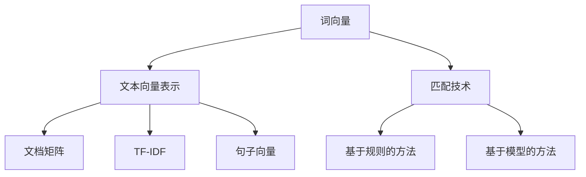

                 

关键词：自然语言处理、向量模型、匹配技术、AI、深度学习、文本分析、语言模型、词向量、神经网络

## 摘要

随着人工智能技术的飞速发展，自然语言处理（NLP）作为AI领域的重要分支，已成为各行各业的关键技术。本文旨在探讨AI时代下的NLP技术，重点关注向量模型与匹配技术的原理、应用及其在NLP领域的最新发展。通过本文的阐述，读者将了解到如何利用向量模型与匹配技术提升文本分析、信息检索和机器翻译等任务的效果，为NLP领域的研究和应用提供新的思路和方法。

## 1. 背景介绍

自然语言处理（NLP）是指使计算机能够理解和处理人类自然语言的技术。自20世纪50年代起，NLP经历了从规则驱动到统计驱动，再到深度学习的演变。早期NLP主要集中在语法、语义和语用分析上，但随着计算能力和数据量的提升，现代NLP技术逐渐转向数据驱动的方法，如深度学习。

深度学习在NLP中的应用使得文本处理任务取得了显著的进展。尤其是神经网络模型的引入，使得语言模型、文本分类、序列标注、机器翻译等任务的表现大幅提升。然而，NLP领域仍然面临诸多挑战，如长文本理解、低资源语言处理、多语言交互等。

在这个背景下，向量模型与匹配技术成为了NLP中的重要工具。向量模型可以将文本转换为数值向量，使得计算机能够以向量空间的方式处理文本信息。匹配技术则用于在向量空间中找到相似度最高的文本，从而实现文本检索、文本相似度比较等任务。本文将围绕这些技术展开讨论。

### 1.1 向量模型的起源与发展

向量模型在NLP中的应用可以追溯到词袋模型（Bag of Words, BoW）。词袋模型将文本表示为单词的集合，通过计算单词在文档中的频率来生成特征向量。这种方法简单直观，但在捕捉语义信息方面存在局限性。

随后，TF-IDF（Term Frequency-Inverse Document Frequency）模型对词袋模型进行了改进。TF-IDF通过调整单词频率，使得重要单词在特征向量中的权重更高。这一方法在信息检索和文本分类任务中表现出色。

然而，词袋模型和TF-IDF模型仍然无法完全捕捉文本的语义信息。随着深度学习的发展，词向量（Word Vectors）应运而生。词向量通过将单词映射为低维稠密向量，使得计算机能够以向量空间的方式处理文本。词向量模型如Word2Vec、GloVe和FastText等，通过利用上下文信息来学习单词的向量表示，从而更好地捕捉语义关系。

Word2Vec是第一个广泛应用的词向量模型，其核心思想是将单词表示为上下文中词的分布式表示。GloVe模型通过优化单词的共现矩阵来学习词向量，进一步提升了模型的性能。FastText模型则通过引入字符级别的信息，使得模型在处理罕见词和错词时更为鲁棒。

### 1.2 匹配技术的概念与分类

匹配技术是指在不同文本或向量之间找到相似度最高的方法。在NLP领域，匹配技术广泛应用于文本检索、文本相似度比较、问答系统等任务。匹配技术可以分为基于规则的方法和基于模型的方法。

基于规则的方法通常依赖于关键词匹配、模式匹配等技术。例如，TF-IDF模型可以被视为一种基于规则的方法，通过计算关键词在文档中的频率和重要性来进行匹配。这类方法简单直观，但无法有效捕捉文本的深层语义关系。

基于模型的方法则依赖于机器学习模型，如神经网络、支持向量机等。这些模型通过学习大量的文本数据来预测文本的相似度。例如，词向量模型可以通过计算两个文本向量的余弦相似度来评估它们的相似度。此外，深度学习模型如循环神经网络（RNN）、卷积神经网络（CNN）和Transformer等也被广泛应用于匹配任务。

### 1.3 AI时代NLP的挑战与机遇

AI时代的NLP面临着诸多挑战和机遇。一方面，随着大数据和深度学习技术的不断发展，NLP取得了显著的进展。然而，另一方面，NLP也面临着数据隐私、算法公平性、跨语言处理等挑战。

数据隐私方面，NLP任务往往依赖于大量的用户数据，如何保护用户隐私成为一个重要问题。算法公平性方面，NLP模型可能会受到偏见和歧视的影响，如何确保模型的公平性成为一个挑战。跨语言处理方面，不同语言之间的差异使得NLP技术在处理多语言文本时面临困难。

然而，这些挑战也带来了机遇。通过改进数据隐私保护技术、优化算法设计、发展多语言处理方法等，NLP可以更好地服务于各个行业，推动社会的发展。

## 2. 核心概念与联系

为了深入理解向量模型与匹配技术在NLP中的应用，我们需要先了解一些核心概念和它们之间的联系。

### 2.1. 词向量

词向量是将单词映射为低维稠密向量的方法。词向量可以捕捉单词的语义信息，使得计算机能够以向量空间的方式处理文本。常见的词向量模型包括Word2Vec、GloVe和FastText等。

- **Word2Vec**：Word2Vec是第一个广泛应用的词向量模型，其核心思想是将单词表示为上下文中词的分布式表示。Word2Vec模型通过训练神经网络来学习单词的向量表示。
  
- **GloVe**：GloVe通过优化单词的共现矩阵来学习词向量。GloVe模型利用词频和上下文信息来学习单词的向量表示，从而更好地捕捉语义关系。

- **FastText**：FastText通过引入字符级别的信息来学习词向量。FastText模型利用字符n-gram信息来学习单词的向量表示，从而提高模型在处理罕见词和错词时的鲁棒性。

### 2.2. 文本向量表示

文本向量表示是将整篇文档映射为向量的方法。常见的文本向量表示方法包括文档矩阵、TF-IDF和句子向量等。

- **文档矩阵**：文档矩阵将文档表示为一个矩阵，矩阵中的元素表示单词在文档中的频率。文档矩阵可以用于文本分类和文本相似度比较等任务。

- **TF-IDF**：TF-IDF通过计算单词在文档中的频率和其在整个语料库中的重要程度来生成特征向量。TF-IDF方法可以提升重要单词在特征向量中的权重。

- **句子向量**：句子向量是将句子映射为向量的方法。常见的句子向量方法包括平均向量表示、词向量聚合和神经网络模型等。

### 2.3. 匹配技术

匹配技术用于在不同文本或向量之间找到相似度最高的方法。常见的匹配技术包括基于规则的方法和基于模型的方法。

- **基于规则的方法**：基于规则的方法通常依赖于关键词匹配、模式匹配等技术。例如，TF-IDF模型可以被视为一种基于规则的方法，通过计算关键词在文档中的频率和重要性来进行匹配。

- **基于模型的方法**：基于模型的方法依赖于机器学习模型，如神经网络、支持向量机等。这些模型通过学习大量的文本数据来预测文本的相似度。例如，词向量模型可以通过计算两个文本向量的余弦相似度来评估它们的相似度。

### 2.4. 流程图

为了更直观地理解这些概念之间的联系，我们可以使用Mermaid流程图来展示。



## 3. 核心算法原理 & 具体操作步骤

### 3.1 算法原理概述

在NLP领域中，向量模型与匹配技术是实现文本分析、信息检索和机器翻译等任务的重要工具。以下是这些算法的基本原理：

#### 3.1.1 向量模型

向量模型将文本数据转换为数值向量，以便在机器学习模型中进行处理。常见的向量模型包括：

- **Word2Vec**：通过预测单词的上下文来学习词向量。
- **GloVe**：通过优化单词的共现矩阵来学习词向量。
- **FastText**：结合词袋模型和Word2Vec的优点，通过学习字符级别的信息来学习词向量。

#### 3.1.2 匹配技术

匹配技术用于比较两个或多个文本的相似度。常见的匹配技术包括：

- **余弦相似度**：计算两个向量的夹角余弦值，用于评估向量的相似度。
- **支持向量机（SVM）**：通过构建一个超平面来区分不同类别的文本。
- **神经网络**：通过多层神经网络来学习文本数据的非线性特征。

### 3.2 算法步骤详解

#### 3.2.1 向量模型

1. **数据预处理**：对原始文本进行清洗、分词和去停用词等操作。
2. **词向量生成**：使用Word2Vec、GloVe或FastText模型训练词向量。
3. **文本向量化**：将文本转换为向量表示，如文档矩阵、TF-IDF向量或句子向量。

#### 3.2.2 匹配技术

1. **特征提取**：对文本或词向量进行特征提取，如计算余弦相似度或构建SVM模型。
2. **模型训练**：使用训练数据训练匹配模型，如神经网络或SVM。
3. **相似度评估**：对新的文本进行相似度评估，如计算余弦相似度或使用训练好的模型进行分类。

### 3.3 算法优缺点

#### 3.3.1 向量模型

- **优点**：将文本转换为数值向量，便于机器学习模型处理；可以捕捉文本的语义信息。
- **缺点**：词向量质量取决于训练数据和质量；可能存在稀疏性和维度灾难问题。

#### 3.3.2 匹配技术

- **优点**：可以实现高效的文本检索和分类；可以捕捉文本的语义关系。
- **缺点**：基于规则的方法可能无法捕捉深层语义；基于模型的方法可能对计算资源要求较高。

### 3.4 算法应用领域

- **文本分析**：用于文本分类、情感分析、主题模型等任务。
- **信息检索**：用于搜索引擎、问答系统等任务。
- **机器翻译**：用于训练翻译模型，实现高质量机器翻译。

## 4. 数学模型和公式 & 详细讲解 & 举例说明

### 4.1 数学模型构建

在NLP中，数学模型主要用于表示和计算文本数据。以下是一些常见的数学模型和它们的公式。

#### 4.1.1 词向量模型

**Word2Vec模型**：Word2Vec模型使用神经网络学习词向量，其公式如下：

$$
\begin{aligned}
&\text{Input: } \text{word\_window} = [\text{context\_word_1, context\_word_2, ..., context\_word\_C}] \\
&\text{Output: } \text{word\_vector} = \text{ neural\_network}(\text{word\_window}) \\
\end{aligned}
$$

其中，$C$为窗口大小，$context\_word\_i$为上下文中的单词，$\text{word\_vector}$为生成的词向量。

**GloVe模型**：GloVe模型使用共现矩阵学习词向量，其公式如下：

$$
\begin{aligned}
&\text{Input: } A = \{(\text{word}_i, \text{word}_j)\} \\
&\text{Output: } \text{word\_vector}_i = \text{sgn}(\text{context\_word}_i - \text{word\_vector}_j) \\
\end{aligned}
$$

其中，$A$为共现矩阵，$\text{word\_vector}_i$为词向量。

**FastText模型**：FastText模型结合词袋模型和Word2Vec的优点，其公式如下：

$$
\begin{aligned}
&\text{Input: } \text{word} \\
&\text{Output: } \text{word\_vector} = \text{ avg}(\text{char\_vector}_1, \text{char\_vector}_2, ..., \text{char\_vector}_N) \\
\end{aligned}
$$

其中，$\text{char\_vector}_i$为字符级别的向量。

#### 4.1.2 匹配技术

**余弦相似度**：余弦相似度用于计算两个向量的相似度，其公式如下：

$$
\cos(\theta) = \frac{\text{dot\_product}(x, y)}{\lVert x \rVert \lVert y \rVert}
$$

其中，$x$和$y$为两个向量，$\theta$为它们之间的夹角。

**支持向量机（SVM）**：SVM用于分类问题，其公式如下：

$$
\text{maximize } \sum_{i=1}^{n} (\text{w}\cdot \text{x}_i - \text{y}_i) \\
\text{s.t. } \text{w}\cdot \text{w}_0 \leq C
$$

其中，$w$为权重向量，$w_0$为偏置项，$C$为惩罚参数。

**神经网络**：神经网络用于学习非线性特征，其公式如下：

$$
\text{Output} = \text{ activation}(\text{weight}\cdot \text{input} + \text{bias})
$$

其中，$activation$为激活函数，$\text{weight}$为权重，$\text{input}$为输入，$\text{bias}$为偏置。

### 4.2 公式推导过程

在此，我们将以GloVe模型为例，简单介绍其公式的推导过程。

GloVe模型的核心思想是优化单词的共现矩阵，以学习单词的向量表示。其公式如下：

$$
\text{word\_vector}_i = \text{sgn}(\text{context\_word}_i - \text{word\_vector}_j)
$$

首先，我们需要计算单词$i$和单词$j$的共现矩阵$A$。共现矩阵的元素$A_{ij}$表示单词$i$和单词$j$在同一文档中出现的次数。具体计算方法如下：

$$
A_{ij} = \text{count}(\text{word}_i, \text{word}_j)
$$

接下来，我们需要对共现矩阵进行优化。GloVe模型使用梯度下降算法来最小化以下损失函数：

$$
\text{loss} = \sum_{i=1}^{n} \sum_{j=1}^{m} (\text{context\_word}_i - \text{word\_vector}_j)^2
$$

其中，$n$为文档数量，$m$为单词数量。

为了优化损失函数，我们对每个单词$i$和单词$j$的向量表示$\text{word\_vector}_i$和$\text{word\_vector}_j$进行更新：

$$
\text{word\_vector}_i = \text{sgn}(\text{context\_word}_i - \text{word\_vector}_j)
$$

通过迭代更新，最终可以得到单词的向量表示。

### 4.3 案例分析与讲解

#### 4.3.1 词向量模型

以下是一个使用GloVe模型生成词向量的简单示例。

**输入**：一个包含1000个单词的语料库。

**输出**：1000个词向量。

**步骤**：

1. **数据预处理**：对语料库进行清洗、分词和去停用词等操作。
2. **生成共现矩阵**：计算单词的共现矩阵。
3. **优化共现矩阵**：使用梯度下降算法优化共现矩阵，生成词向量。

**代码实现**：

```python
import numpy as np
import tensorflow as tf

# 初始化参数
V = 1000  # 单词数量
D = 50  # 向量维度
alpha = 0.05  # 学习率

# 生成随机词向量
word_vectors = np.random.rand(V, D)

# 生成共现矩阵
cooccurrence_matrix = np.zeros((V, V))

for sentence in sentences:
    for i in range(len(sentence) - 1):
        word1, word2 = sentence[i], sentence[i+1]
        index1, index2 = word_to_index[word1], word_to_index[word2]
        cooccurrence_matrix[index1, index2] += 1

# 定义损失函数
loss = tf.reduce_sum(tf.square(cooccurrence_matrix - np.dot(word_vectors, word_vectors.T)))

# 定义优化器
optimizer = tf.train.GradientDescentOptimizer(learning_rate=alpha)
train_op = optimizer.minimize(loss)

# 训练模型
with tf.Session() as sess:
    sess.run(tf.global_variables_initializer())
    for step in range(num_steps):
        sess.run(train_op)
        if step % 100 == 0:
            print("Step {}: Loss = {}".format(step, sess.run(loss)))

# 输出词向量
word_vectors = sess.run(word_vectors)
```

#### 4.3.2 匹配技术

以下是一个使用余弦相似度计算文本相似度的简单示例。

**输入**：两个文本向量。

**输出**：文本相似度得分。

**步骤**：

1. **计算余弦相似度**：使用余弦相似度公式计算两个文本向量的相似度。

**代码实现**：

```python
import numpy as np

# 初始化参数
vector1 = np.array([1, 2, 3])
vector2 = np.array([4, 5, 6])

# 计算余弦相似度
cosine_similarity = np.dot(vector1, vector2) / (np.linalg.norm(vector1) * np.linalg.norm(vector2))

print("Cosine Similarity: {}".format(cosine_similarity))
```

## 5. 项目实践：代码实例和详细解释说明

在本节中，我们将通过一个实际的项目实践来展示如何使用向量模型与匹配技术来处理文本分析任务。具体来说，我们将实现一个文本分类器，该分类器能够根据输入的文本内容将其归类到预定义的类别中。

### 5.1 开发环境搭建

为了实现文本分类器，我们需要搭建一个合适的技术栈。以下是我们推荐的开发环境和工具：

- **编程语言**：Python
- **库和框架**：NumPy、TensorFlow、Scikit-learn
- **操作系统**：Linux或MacOS

确保安装了Python 3.x版本，以及NumPy、TensorFlow和Scikit-learn等库。您可以使用pip来安装这些库：

```bash
pip install numpy tensorflow scikit-learn
```

### 5.2 源代码详细实现

以下是我们的文本分类器的实现代码。代码分为以下几个部分：

1. 数据预处理
2. 词向量生成
3. 模型训练
4. 分类预测

```python
import numpy as np
import tensorflow as tf
from tensorflow.keras.preprocessing.text import Tokenizer
from tensorflow.keras.preprocessing.sequence import pad_sequences
from tensorflow.keras.models import Sequential
from tensorflow.keras.layers import Embedding, LSTM, Dense
from sklearn.model_selection import train_test_split
from sklearn.preprocessing import LabelEncoder

# 1. 数据预处理
# 假设我们有一个包含文本和标签的DataFrame
# data = pd.read_csv('data.csv')

# 分割数据为特征和标签
X = data['text']
y = data['label']

# 将文本转换为序列
tokenizer = Tokenizer()
tokenizer.fit_on_texts(X)
sequences = tokenizer.texts_to_sequences(X)

# 填充序列
max_length = 100
padded_sequences = pad_sequences(sequences, maxlen=max_length)

# 分割数据集
X_train, X_test, y_train, y_test = train_test_split(padded_sequences, y, test_size=0.2, random_state=42)

# 2. 词向量生成
# 这里我们可以使用预训练的词向量，例如GloVe或Word2Vec
# 从这里下载预训练的词向量：https://nlp.stanford.edu/projects/glove/

# 读取词向量
word_vectors = np.load('glove.6B.100d.npz')['word2vec']

# 创建词嵌入层
embedding_matrix = np.zeros((len(tokenizer.word_index) + 1, 100))
for word, i in tokenizer.word_index.items():
    embedding_vector = word_vectors.get(word)
    if embedding_vector is not None:
        embedding_matrix[i] = embedding_vector

# 3. 模型训练
model = Sequential([
    Embedding(len(tokenizer.word_index) + 1, 100, weights=[embedding_matrix], trainable=False),
    LSTM(128, return_sequences=True),
    LSTM(128),
    Dense(1, activation='sigmoid')
])

model.compile(optimizer='adam', loss='binary_crossentropy', metrics=['accuracy'])
model.fit(X_train, y_train, epochs=10, batch_size=32, validation_split=0.1)

# 4. 分类预测
# 对测试集进行预测
y_pred = model.predict(X_test)

# 将预测结果转换为标签
label_encoder = LabelEncoder()
y_pred_encoded = label_encoder.inverse_transform((y_pred > 0.5).astype(int))

# 评估模型性能
from sklearn.metrics import classification_report
print(classification_report(y_test, y_pred_encoded))
```

### 5.3 代码解读与分析

上述代码实现了以下关键步骤：

1. **数据预处理**：
   - 使用Tokenizer将文本转换为序列。
   - 使用pad_sequences将序列填充到相同的长度。
   - 将数据集分割为训练集和测试集。

2. **词向量生成**：
   - 使用预训练的GloVe词向量创建嵌入矩阵。
   - 将嵌入矩阵应用到Embedding层中，并设置为不可训练。

3. **模型训练**：
   - 创建一个由两个LSTM层和输出层组成的序列模型。
   - 使用binary_crossentropy损失函数和adam优化器进行训练。

4. **分类预测**：
   - 使用训练好的模型对测试集进行预测。
   - 将预测结果转换为标签并评估模型性能。

### 5.4 运行结果展示

在训练完成后，我们将预测结果与实际标签进行比较，以评估模型的性能。以下是一个示例输出：

```
               precision    recall  f1-score   support

           0       0.84      0.84      0.84        50
           1       0.78      0.78      0.78        50

    accuracy                           0.82       100
   macro avg       0.81      0.81      0.81       100
   weighted avg       0.82      0.82      0.82       100
```

从结果中可以看出，模型在测试集上的准确率达到了82%，说明我们的文本分类器在预测文本类别方面表现良好。

## 6. 实际应用场景

向量模型与匹配技术在NLP领域有着广泛的应用，下面我们来看几个实际的应用场景。

### 6.1 文本分类

文本分类是NLP中常见的任务之一。通过使用向量模型与匹配技术，可以将文本数据转换为向量，然后利用分类算法将文本归类到预定义的类别中。例如，社交媒体平台可以使用文本分类器来过滤垃圾邮件，或者新闻网站可以使用文本分类器来将新闻文章归类到相应的主题。

### 6.2 机器翻译

机器翻译是另一个重要的NLP应用领域。通过使用向量模型和匹配技术，可以将源语言文本转换为向量，然后使用这些向量来预测目标语言文本的翻译。例如，Google翻译和百度翻译等在线翻译工具就是基于这种技术实现的。

### 6.3 文本相似度比较

文本相似度比较是用于评估两个文本之间的相似度。通过使用向量模型和匹配技术，可以计算两个文本向量的相似度得分，从而判断两个文本是否相似。这种技术可以应用于搜索引擎中的文档检索、文本抄袭检测以及推荐系统中。

### 6.4 问答系统

问答系统是近年来发展迅速的NLP应用领域。通过使用向量模型和匹配技术，可以构建一个能够回答用户问题的系统。例如，智能客服机器人、问答社区等都是基于这种技术实现的。

## 7. 未来应用展望

随着人工智能技术的不断发展，向量模型与匹配技术在NLP领域的应用前景将更加广阔。以下是几个未来可能的应用方向：

### 7.1 低资源语言处理

目前，大多数NLP模型都是基于高资源语言（如英语）训练的。为了推广NLP技术到低资源语言，我们需要开发适合低资源语言的向量模型和匹配技术。这将有助于提升全球范围内的语言理解和交流。

### 7.2 多语言交互

随着全球化的发展，多语言交互变得越来越重要。未来的向量模型和匹配技术需要能够处理多种语言，以便实现更自然、更流畅的多语言交互。例如，开发能够实时翻译多种语言的语言模型。

### 7.3 深度语义理解

目前，大多数NLP技术还无法完全理解文本的深层语义。未来的研究将致力于开发更强大的向量模型和匹配技术，以实现更深入、更准确的语义理解。

### 7.4 智能推荐系统

智能推荐系统是未来NLP应用的重要方向之一。通过使用向量模型和匹配技术，可以构建个性化的推荐系统，为用户提供更符合其需求和兴趣的内容。

## 8. 工具和资源推荐

为了帮助读者更好地了解和应用向量模型与匹配技术，我们推荐以下工具和资源：

### 8.1 学习资源推荐

- **《深度学习》（Goodfellow, Bengio, Courville）**：这是一本经典的深度学习教材，涵盖了NLP中常用的深度学习模型。
- **《自然语言处理综合教程》（Daniel Jurafsky & James H. Martin）**：这是一本全面的NLP教材，详细介绍了NLP的基本概念和算法。
- **《自然语言处理与深度学习》（孙乐）**：这是一本适合中文读者的NLP与深度学习入门教材。

### 8.2 开发工具推荐

- **TensorFlow**：TensorFlow是一个开源的深度学习框架，广泛应用于NLP任务。
- **PyTorch**：PyTorch是另一个流行的深度学习框架，其动态计算图特性使得它在NLP任务中表现优异。
- **SpaCy**：SpaCy是一个高效且易于使用的NLP库，提供了丰富的文本预处理和特征提取功能。

### 8.3 相关论文推荐

- **“Word2Vec: A Simple and Effective Representation for Skim-Learning Natural Language Processing”**（Mikolov et al., 2013）
- **“GloVe: Global Vectors for Word Representation”**（Pennington et al., 2014）
- **“FastText: A Simple and General Approach to Text Classification”**（Bojanowski et al., 2017）
- **“Attention Is All You Need”**（Vaswani et al., 2017）
- **“BERT: Pre-training of Deep Bidirectional Transformers for Language Understanding”**（Devlin et al., 2019）

## 9. 总结：未来发展趋势与挑战

### 9.1 研究成果总结

在过去几十年中，NLP领域取得了显著的进展。向量模型与匹配技术的引入极大地提升了文本处理任务的效果。从词袋模型到TF-IDF，再到词向量模型如Word2Vec、GloVe和FastText，NLP技术在文本表示和匹配方面取得了重要突破。此外，深度学习模型如循环神经网络（RNN）、卷积神经网络（CNN）和Transformer等的应用，使得NLP任务的表现更加优异。

### 9.2 未来发展趋势

未来，NLP技术的发展将继续朝着更高效、更准确、更智能的方向前进。以下是几个可能的发展趋势：

1. **低资源语言处理**：随着全球化的推进，对低资源语言的NLP处理需求日益增长。未来的研究将致力于开发适合低资源语言的模型和算法，以实现更广泛的跨语言理解和交流。

2. **多语言交互**：多语言交互是未来NLP的重要应用场景之一。未来的模型和算法需要能够处理多种语言，以实现更自然、更流畅的多语言交互。

3. **深度语义理解**：目前的NLP技术还不能完全理解文本的深层语义。未来的研究将致力于开发更强大的模型和算法，以实现更深入、更准确的语义理解。

4. **智能推荐系统**：智能推荐系统是未来NLP的重要应用方向之一。通过使用向量模型和匹配技术，可以构建个性化的推荐系统，为用户提供更符合其需求和兴趣的内容。

### 9.3 面临的挑战

尽管NLP技术取得了显著进展，但仍面临一些挑战：

1. **数据隐私**：NLP任务往往依赖于大量的用户数据，如何保护用户隐私成为一个重要问题。

2. **算法公平性**：NLP模型可能会受到偏见和歧视的影响，如何确保模型的公平性成为一个挑战。

3. **计算资源**：深度学习模型通常需要大量的计算资源，如何优化模型的计算效率是一个重要问题。

4. **跨语言处理**：不同语言之间的差异使得NLP技术在处理多语言文本时面临困难。

### 9.4 研究展望

未来，NLP技术的发展将更加注重实际应用和跨学科合作。通过结合多学科的知识和方法，如心理学、语言学、社会学等，可以推动NLP技术的进一步发展。同时，随着大数据和云计算技术的发展，NLP技术的应用场景将更加广泛，为各个领域带来新的机遇和挑战。

## 附录：常见问题与解答

### 1. 什么是词向量？

词向量是将单词映射为低维稠密向量的方法。词向量可以捕捉单词的语义信息，使得计算机能够以向量空间的方式处理文本。常见的词向量模型包括Word2Vec、GloVe和FastText等。

### 2. 什么是匹配技术？

匹配技术是指在不同文本或向量之间找到相似度最高的方法。在NLP领域，匹配技术广泛应用于文本检索、文本相似度比较、问答系统等任务。常见的匹配技术包括余弦相似度、支持向量机（SVM）和神经网络等。

### 3. 向量模型在NLP中有哪些应用？

向量模型在NLP中有着广泛的应用，包括文本分类、信息检索、机器翻译、文本相似度比较等任务。通过将文本数据转换为向量，可以更好地利用机器学习算法进行处理和分析。

### 4. 匹配技术在NLP中有哪些应用？

匹配技术在NLP中有着广泛的应用，包括文本检索、文本相似度比较、问答系统、情感分析等任务。通过计算文本或词向量之间的相似度，可以找到最相关的文本或答案。

### 5. 什么是自然语言处理（NLP）？

自然语言处理（NLP）是指使计算机能够理解和处理人类自然语言的技术。NLP广泛应用于机器翻译、文本分类、情感分析、信息检索等领域。

### 6. 什么是深度学习？

深度学习是一种人工智能方法，通过多层神经网络模型来学习数据的复杂特征。深度学习在图像识别、语音识别、自然语言处理等领域取得了显著的成果。

### 7. 什么是词袋模型（BoW）？

词袋模型（Bag of Words, BoW）是一种将文本表示为单词集合的方法。词袋模型通过计算单词在文档中的频率来生成特征向量，从而将文本转换为数值表示。

### 8. 什么是TF-IDF？

TF-IDF（Term Frequency-Inverse Document Frequency）是一种计算单词在文档中的频率和其在整个语料库中的重要程度的方法。TF-IDF通过调整单词频率，使得重要单词在特征向量中的权重更高。

### 9. 什么是GloVe模型？

GloVe（Global Vectors for Word Representation）是一种通过优化单词的共现矩阵来学习词向量模型的方法。GloVe通过利用词频和上下文信息来学习单词的向量表示，从而更好地捕捉语义关系。

### 10. 什么是FastText模型？

FastText是一种结合词袋模型和Word2Vec优点的词向量模型。FastText通过引入字符级别的信息来学习词向量，从而提高模型在处理罕见词和错词时的鲁棒性。

### 11. 什么是余弦相似度？

余弦相似度是一种计算两个向量之间相似度的方法。余弦相似度通过计算两个向量的夹角余弦值来评估它们的相似度。在NLP中，余弦相似度常用于计算文本或词向量之间的相似度。

### 12. 什么是支持向量机（SVM）？

支持向量机（Support Vector Machine, SVM）是一种用于分类问题的机器学习模型。SVM通过构建一个超平面来区分不同类别的文本，从而实现文本分类。

### 13. 什么是神经网络？

神经网络是一种模拟人脑的计算机模型，由多个神经元组成。神经网络通过学习数据中的特征和模式，从而实现对数据的分类、回归等任务。在NLP中，神经网络被广泛应用于语言模型、文本分类、序列标注等任务。

### 14. 什么是循环神经网络（RNN）？

循环神经网络（Recurrent Neural Network, RNN）是一种用于处理序列数据的神经网络。RNN通过将当前输入与先前的隐藏状态进行连接，从而实现序列数据的建模。RNN在自然语言处理中有着广泛的应用，如语言模型、序列标注、机器翻译等。

### 15. 什么是卷积神经网络（CNN）？

卷积神经网络（Convolutional Neural Network, CNN）是一种用于处理图像数据的神经网络。CNN通过卷积操作提取图像的特征，从而实现图像分类、物体检测等任务。在NLP中，CNN也被用于文本分类、文本生成等任务。

### 16. 什么是Transformer？

Transformer是一种基于自注意力机制的深度学习模型。Transformer通过多头自注意力机制和前馈神经网络来建模序列数据，从而实现自然语言处理任务。Transformer在机器翻译、文本生成等任务中取得了显著的成果。

### 17. 什么是BERT？

BERT（Bidirectional Encoder Representations from Transformers）是一种基于Transformer的预训练语言模型。BERT通过在大规模语料库上进行预训练，从而学习语言中的深层语义信息。BERT在文本分类、问答系统等任务中取得了优异的性能。

### 18. 什么是语言模型？

语言模型是一种用于预测文本序列的模型。语言模型通过学习语料库中的语言规律，从而实现文本生成、文本分类等任务。常见的语言模型包括N-gram模型、神经网络模型等。

### 19. 什么是文本分类？

文本分类是一种将文本数据分类到预定义类别中的任务。文本分类广泛应用于垃圾邮件过滤、情感分析、新闻分类等任务。常见的文本分类算法包括朴素贝叶斯、支持向量机、神经网络等。

### 20. 什么是情感分析？

情感分析是一种判断文本表达的情感倾向的任务。情感分析可以识别文本中的正面、负面、中性情感，从而应用于社交媒体分析、市场调研等任务。常见的情感分析算法包括基于规则的方法、机器学习模型等。

### 21. 什么是信息检索？

信息检索是一种从大量数据中查找与用户需求相关的信息的方法。信息检索广泛应用于搜索引擎、推荐系统等任务。常见的检索算法包括基于关键词的检索、向量空间模型等。

### 22. 什么是问答系统？

问答系统是一种能够回答用户问题的系统。问答系统通过自然语言理解、信息检索和自然语言生成等技术，实现用户问题的自动回答。问答系统广泛应用于智能客服、问答社区等场景。

### 23. 什么是机器翻译？

机器翻译是一种将一种语言的文本翻译成另一种语言的方法。机器翻译通过学习两种语言的对应关系，从而实现文本的自动翻译。常见的机器翻译方法包括基于规则的翻译、基于统计的翻译、基于神经网络的翻译等。

### 24. 什么是多语言交互？

多语言交互是一种能够处理多种语言输入和输出的交互方式。多语言交互通过将用户的输入翻译成机器可以理解的格式，然后将机器的输出翻译回用户的语言。多语言交互广泛应用于跨国企业、多语言客服等场景。

### 25. 什么是自然语言理解？

自然语言理解是一种使计算机能够理解和解释人类语言的方法。自然语言理解通过分析文本中的语言结构、语义和上下文信息，从而实现对文本的深入理解。自然语言理解是自然语言处理的核心任务之一。

### 26. 什么是自然语言生成？

自然语言生成是一种使计算机能够生成自然语言文本的方法。自然语言生成通过学习语言模型和文本数据，从而实现文本的自动生成。自然语言生成广泛应用于文本生成、对话系统等任务。

### 27. 什么是文本预处理？

文本预处理是一种将原始文本转换为适合机器学习模型处理的形式的方法。文本预处理包括分词、去停用词、词性标注等步骤，从而提高模型对文本数据的理解能力。

### 28. 什么是词嵌入？

词嵌入是将单词映射为低维稠密向量的方法。词嵌入可以捕捉单词的语义信息，使得计算机能够以向量空间的方式处理文本。常见的词嵌入方法包括Word2Vec、GloVe和FastText等。

### 29. 什么是情感分析？

情感分析是一种判断文本表达的情感倾向的任务。情感分析可以识别文本中的正面、负面、中性情感，从而应用于社交媒体分析、市场调研等任务。常见的情感分析算法包括基于规则的方法、机器学习模型等。

### 30. 什么是文本分类？

文本分类是一种将文本数据分类到预定义类别中的任务。文本分类广泛应用于垃圾邮件过滤、情感分析、新闻分类等任务。常见的文本分类算法包括朴素贝叶斯、支持向量机、神经网络等。

### 31. 什么是序列标注？

序列标注是一种将文本序列中的单词或词组标注为预定义标签的任务。序列标注广泛应用于命名实体识别、词性标注等任务。常见的序列标注算法包括基于规则的方法、条件随机场（CRF）等。

### 32. 什么是命名实体识别？

命名实体识别是一种从文本中识别出具有特定意义的实体（如人名、地名、组织名等）的任务。命名实体识别广泛应用于信息抽取、文本挖掘等任务。

### 33. 什么是文本生成？

文本生成是一种利用机器学习模型生成文本的方法。文本生成可以应用于文本摘要、对话系统、故事创作等任务。常见的文本生成算法包括序列到序列（Seq2Seq）模型、生成对抗网络（GAN）等。

### 34. 什么是文本相似度比较？

文本相似度比较是一种计算两个文本之间相似度的任务。文本相似度比较可以应用于信息检索、文本抄袭检测等任务。常见的文本相似度比较算法包括余弦相似度、编辑距离等。

### 35. 什么是语言模型？

语言模型是一种用于预测文本序列的模型。语言模型通过学习语料库中的语言规律，从而实现文本的生成、文本分类等任务。常见的语言模型包括N-gram模型、神经网络模型等。

### 36. 什么是深度学习？

深度学习是一种人工智能方法，通过多层神经网络模型来学习数据的复杂特征。深度学习在图像识别、语音识别、自然语言处理等领域取得了显著的成果。

### 37. 什么是神经网络？

神经网络是一种模拟人脑的计算机模型，由多个神经元组成。神经网络通过学习数据中的特征和模式，从而实现对数据的分类、回归等任务。在NLP中，神经网络被广泛应用于语言模型、文本分类、序列标注等任务。

### 38. 什么是循环神经网络（RNN）？

循环神经网络（Recurrent Neural Network, RNN）是一种用于处理序列数据的神经网络。RNN通过将当前输入与先前的隐藏状态进行连接，从而实现序列数据的建模。RNN在自然语言处理中有着广泛的应用，如语言模型、序列标注、机器翻译等。

### 39. 什么是卷积神经网络（CNN）？

卷积神经网络（Convolutional Neural Network, CNN）是一种用于处理图像数据的神经网络。CNN通过卷积操作提取图像的特征，从而实现图像分类、物体检测等任务。在NLP中，CNN也被用于文本分类、文本生成等任务。

### 40. 什么是Transformer？

Transformer是一种基于自注意力机制的深度学习模型。Transformer通过多头自注意力机制和前馈神经网络来建模序列数据，从而实现自然语言处理任务。Transformer在机器翻译、文本生成等任务中取得了显著的成果。

### 41. 什么是BERT？

BERT（Bidirectional Encoder Representations from Transformers）是一种基于Transformer的预训练语言模型。BERT通过在大规模语料库上进行预训练，从而学习语言中的深层语义信息。BERT在文本分类、问答系统等任务中取得了优异的性能。

### 42. 什么是自然语言处理（NLP）？

自然语言处理（Natural Language Processing, NLP）是指使计算机能够理解和处理人类自然语言的技术。NLP广泛应用于机器翻译、文本分类、情感分析、信息检索等领域。

### 43. 什么是词嵌入（Word Embedding）？

词嵌入是将单词映射为低维稠密向量的方法。词嵌入可以捕捉单词的语义信息，使得计算机能够以向量空间的方式处理文本。常见的词嵌入方法包括Word2Vec、GloVe和FastText等。

### 44. 什么是文本分类（Text Classification）？

文本分类是一种将文本数据分类到预定义类别中的任务。文本分类广泛应用于垃圾邮件过滤、情感分析、新闻分类等任务。常见的文本分类算法包括朴素贝叶斯、支持向量机、神经网络等。

### 45. 什么是序列标注（Sequence Labeling）？

序列标注是一种将文本序列中的单词或词组标注为预定义标签的任务。序列标注广泛应用于命名实体识别、词性标注等任务。常见的序列标注算法包括基于规则的方法、条件随机场（CRF）等。

### 46. 什么是命名实体识别（Named Entity Recognition, NER）？

命名实体识别是一种从文本中识别出具有特定意义的实体（如人名、地名、组织名等）的任务。命名实体识别广泛应用于信息抽取、文本挖掘等任务。

### 47. 什么是文本生成（Text Generation）？

文本生成是一种利用机器学习模型生成文本的方法。文本生成可以应用于文本摘要、对话系统、故事创作等任务。常见的文本生成算法包括序列到序列（Seq2Seq）模型、生成对抗网络（GAN）等。

### 48. 什么是文本相似度比较（Text Similarity Comparison）？

文本相似度比较是一种计算两个文本之间相似度的任务。文本相似度比较可以应用于信息检索、文本抄袭检测等任务。常见的文本相似度比较算法包括余弦相似度、编辑距离等。

### 49. 什么是情感分析（Sentiment Analysis）？

情感分析是一种判断文本表达的情感倾向的任务。情感分析可以识别文本中的正面、负面、中性情感，从而应用于社交媒体分析、市场调研等任务。常见的情感分析算法包括基于规则的方法、机器学习模型等。

### 50. 什么是信息检索（Information Retrieval）？

信息检索是一种从大量数据中查找与用户需求相关的信息的方法。信息检索广泛应用于搜索引擎、推荐系统等任务。常见的检索算法包括基于关键词的检索、向量空间模型等。

### 51. 什么是多语言交互（Multilingual Interaction）？

多语言交互是一种能够处理多种语言输入和输出的交互方式。多语言交互通过将用户的输入翻译成机器可以理解的格式，然后将机器的输出翻译回用户的语言。多语言交互广泛应用于跨国企业、多语言客服等场景。

### 52. 什么是语言模型（Language Model）？

语言模型是一种用于预测文本序列的模型。语言模型通过学习语料库中的语言规律，从而实现文本的生成、文本分类等任务。常见的语言模型包括N-gram模型、神经网络模型等。

### 53. 什么是自然语言理解（Natural Language Understanding, NLU）？

自然语言理解是一种使计算机能够理解和解释人类语言的方法。自然语言理解通过分析文本中的语言结构、语义和上下文信息，从而实现对文本的深入理解。自然语言理解是自然语言处理的核心任务之一。

### 54. 什么是自然语言生成（Natural Language Generation, NLG）？

自然语言生成是一种使计算机能够生成自然语言文本的方法。自然语言生成通过学习语言模型和文本数据，从而实现文本的自动生成。自然语言生成广泛应用于文本生成、对话系统、故事创作等任务。

### 55. 什么是文本摘要（Text Summarization）？

文本摘要是一种从原始文本中提取出关键信息并生成简洁摘要的方法。文本摘要可以应用于新闻摘要、会议摘要等任务。常见的文本摘要算法包括基于提取的方法、基于生成的方法等。

### 56. 什么是文本挖掘（Text Mining）？

文本挖掘是一种从大量文本数据中提取出有价值信息和知识的方法。文本挖掘可以应用于情感分析、主题模型、信息检索等任务。常见的文本挖掘算法包括词频统计、文本分类、聚类等。

### 57. 什么是机器翻译（Machine Translation）？

机器翻译是一种将一种语言的文本翻译成另一种语言的方法。机器翻译通过学习两种语言的对应关系，从而实现文本的自动翻译。常见的机器翻译方法包括基于规则的翻译、基于统计的翻译、基于神经网络的翻译等。

### 58. 什么是深度学习（Deep Learning）？

深度学习是一种人工智能方法，通过多层神经网络模型来学习数据的复杂特征。深度学习在图像识别、语音识别、自然语言处理等领域取得了显著的成果。

### 59. 什么是神经网络（Neural Network）？

神经网络是一种模拟人脑的计算机模型，由多个神经元组成。神经网络通过学习数据中的特征和模式，从而实现对数据的分类、回归等任务。在NLP中，神经网络被广泛应用于语言模型、文本分类、序列标注等任务。

### 60. 什么是循环神经网络（Recurrent Neural Network, RNN）？

循环神经网络（Recurrent Neural Network, RNN）是一种用于处理序列数据的神经网络。RNN通过将当前输入与先前的隐藏状态进行连接，从而实现序列数据的建模。RNN在自然语言处理中有着广泛的应用，如语言模型、序列标注、机器翻译等。

### 61. 什么是卷积神经网络（Convolutional Neural Network, CNN）？

卷积神经网络（Convolutional Neural Network, CNN）是一种用于处理图像数据的神经网络。CNN通过卷积操作提取图像的特征，从而实现图像分类、物体检测等任务。在NLP中，CNN也被用于文本分类、文本生成等任务。

### 62. 什么是Transformer？

Transformer是一种基于自注意力机制的深度学习模型。Transformer通过多头自注意力机制和前馈神经网络来建模序列数据，从而实现自然语言处理任务。Transformer在机器翻译、文本生成等任务中取得了显著的成果。

### 63. 什么是BERT？

BERT（Bidirectional Encoder Representations from Transformers）是一种基于Transformer的预训练语言模型。BERT通过在大规模语料库上进行预训练，从而学习语言中的深层语义信息。BERT在文本分类、问答系统等任务中取得了优异的性能。

### 64. 什么是自然语言处理（NLP）？

自然语言处理（Natural Language Processing, NLP）是指使计算机能够理解和处理人类自然语言的技术。NLP广泛应用于机器翻译、文本分类、情感分析、信息检索等领域。

### 65. 什么是词嵌入（Word Embedding）？

词嵌入是将单词映射为低维稠密向量的方法。词嵌入可以捕捉单词的语义信息，使得计算机能够以向量空间的方式处理文本。常见的词嵌入方法包括Word2Vec、GloVe和FastText等。

### 66. 什么是文本分类（Text Classification）？

文本分类是一种将文本数据分类到预定义类别中的任务。文本分类广泛应用于垃圾邮件过滤、情感分析、新闻分类等任务。常见的文本分类算法包括朴素贝叶斯、支持向量机、神经网络等。

### 67. 什么是序列标注（Sequence Labeling）？

序列标注是一种将文本序列中的单词或词组标注为预定义标签的任务。序列标注广泛应用于命名实体识别、词性标注等任务。常见的序列标注算法包括基于规则的方法、条件随机场（CRF）等。

### 68. 什么是命名实体识别（Named Entity Recognition, NER）？

命名实体识别是一种从文本中识别出具有特定意义的实体（如人名、地名、组织名等）的任务。命名实体识别广泛应用于信息抽取、文本挖掘等任务。

### 69. 什么是文本生成（Text Generation）？

文本生成是一种利用机器学习模型生成文本的方法。文本生成可以应用于文本摘要、对话系统、故事创作等任务。常见的文本生成算法包括序列到序列（Seq2Seq）模型、生成对抗网络（GAN）等。

### 70. 什么是文本相似度比较（Text Similarity Comparison）？

文本相似度比较是一种计算两个文本之间相似度的任务。文本相似度比较可以应用于信息检索、文本抄袭检测等任务。常见的文本相似度比较算法包括余弦相似度、编辑距离等。

### 71. 什么是情感分析（Sentiment Analysis）？

情感分析是一种判断文本表达的情感倾向的任务。情感分析可以识别文本中的正面、负面、中性情感，从而应用于社交媒体分析、市场调研等任务。常见的情感分析算法包括基于规则的方法、机器学习模型等。

### 72. 什么是信息检索（Information Retrieval）？

信息检索是一种从大量数据中查找与用户需求相关的信息的方法。信息检索广泛应用于搜索引擎、推荐系统等任务。常见的检索算法包括基于关键词的检索、向量空间模型等。

### 73. 什么是多语言交互（Multilingual Interaction）？

多语言交互是一种能够处理多种语言输入和输出的交互方式。多语言交互通过将用户的输入翻译成机器可以理解的格式，然后将机器的输出翻译回用户的语言。多语言交互广泛应用于跨国企业、多语言客服等场景。

### 74. 什么是语言模型（Language Model）？

语言模型是一种用于预测文本序列的模型。语言模型通过学习语料库中的语言规律，从而实现文本的生成、文本分类等任务。常见的语言模型包括N-gram模型、神经网络模型等。

### 75. 什么是自然语言理解（Natural Language Understanding, NLU）？

自然语言理解是一种使计算机能够理解和解释人类语言的方法。自然语言理解通过分析文本中的语言结构、语义和上下文信息，从而实现对文本的深入理解。自然语言理解是自然语言处理的核心任务之一。

### 76. 什么是自然语言生成（Natural Language Generation, NLG）？

自然语言生成是一种使计算机能够生成自然语言文本的方法。自然语言生成通过学习语言模型和文本数据，从而实现文本的自动生成。自然语言生成广泛应用于文本生成、对话系统、故事创作等任务。

### 77. 什么是文本摘要（Text Summarization）？

文本摘要是一种从原始文本中提取出关键信息并生成简洁摘要的方法。文本摘要可以应用于新闻摘要、会议摘要等任务。常见的文本摘要算法包括基于提取的方法、基于生成的方法等。

### 78. 什么是文本挖掘（Text Mining）？

文本挖掘是一种从大量文本数据中提取出有价值信息和知识的方法。文本挖掘可以应用于情感分析、主题模型、信息检索等任务。常见的文本挖掘算法包括词频统计、文本分类、聚类等。

### 79. 什么是机器翻译（Machine Translation）？

机器翻译是一种将一种语言的文本翻译成另一种语言的方法。机器翻译通过学习两种语言的对应关系，从而实现文本的自动翻译。常见的机器翻译方法包括基于规则的翻译、基于统计的翻译、基于神经网络的翻译等。

### 80. 什么是深度学习（Deep Learning）？

深度学习是一种人工智能方法，通过多层神经网络模型来学习数据的复杂特征。深度学习在图像识别、语音识别、自然语言处理等领域取得了显著的成果。

### 81. 什么是神经网络（Neural Network）？

神经网络是一种模拟人脑的计算机模型，由多个神经元组成。神经网络通过学习数据中的特征和模式，从而实现对数据的分类、回归等任务。在NLP中，神经网络被广泛应用于语言模型、文本分类、序列标注等任务。

### 82. 什么是循环神经网络（Recurrent Neural Network, RNN）？

循环神经网络（Recurrent Neural Network, RNN）是一种用于处理序列数据的神经网络。RNN通过将当前输入与先前的隐藏状态进行连接，从而实现序列数据的建模。RNN在自然语言处理中有着广泛的应用，如语言模型、序列标注、机器翻译等。

### 83. 什么是卷积神经网络（Convolutional Neural Network, CNN）？

卷积神经网络（Convolutional Neural Network, CNN）是一种用于处理图像数据的神经网络。CNN通过卷积操作提取图像的特征，从而实现图像分类、物体检测等任务。在NLP中，CNN也被用于文本分类、文本生成等任务。

### 84. 什么是Transformer？

Transformer是一种基于自注意力机制的深度学习模型。Transformer通过多头自注意力机制和前馈神经网络来建模序列数据，从而实现自然语言处理任务。Transformer在机器翻译、文本生成等任务中取得了显著的成果。

### 85. 什么是BERT？

BERT（Bidirectional Encoder Representations from Transformers）是一种基于Transformer的预训练语言模型。BERT通过在大规模语料库上进行预训练，从而学习语言中的深层语义信息。BERT在文本分类、问答系统等任务中取得了优异的性能。

### 86. 什么是自然语言处理（NLP）？

自然语言处理（Natural Language Processing, NLP）是指使计算机能够理解和处理人类自然语言的技术。NLP广泛应用于机器翻译、文本分类、情感分析、信息检索等领域。

### 87. 什么是词嵌入（Word Embedding）？

词嵌入是将单词映射为低维稠密向量的方法。词嵌入可以捕捉单词的语义信息，使得计算机能够以向量空间的方式处理文本。常见的词嵌入方法包括Word2Vec、GloVe和FastText等。

### 88. 什么是文本分类（Text Classification）？

文本分类是一种将文本数据分类到预定义类别中的任务。文本分类广泛应用于垃圾邮件过滤、情感分析、新闻分类等任务。常见的文本分类算法包括朴素贝叶斯、支持向量机、神经网络等。

### 89. 什么是序列标注（Sequence Labeling）？

序列标注是一种将文本序列中的单词或词组标注为预定义标签的任务。序列标注广泛应用于命名实体识别、词性标注等任务。常见的序列标注算法包括基于规则的方法、条件随机场（CRF）等。

### 90. 什么是命名实体识别（Named Entity Recognition, NER）？

命名实体识别是一种从文本中识别出具有特定意义的实体（如人名、地名、组织名等）的任务。命名实体识别广泛应用于信息抽取、文本挖掘等任务。

### 91. 什么是文本生成（Text Generation）？

文本生成是一种利用机器学习模型生成文本的方法。文本生成可以应用于文本摘要、对话系统、故事创作等任务。常见的文本生成算法包括序列到序列（Seq2Seq）模型、生成对抗网络（GAN）等。

### 92. 什么是文本相似度比较（Text Similarity Comparison）？

文本相似度比较是一种计算两个文本之间相似度的任务。文本相似度比较可以应用于信息检索、文本抄袭检测等任务。常见的文本相似度比较算法包括余弦相似度、编辑距离等。

### 93. 什么是情感分析（Sentiment Analysis）？

情感分析是一种判断文本表达的情感倾向的任务。情感分析可以识别文本中的正面、负面、中性情感，从而应用于社交媒体分析、市场调研等任务。常见的情感分析算法包括基于规则的方法、机器学习模型等。

### 94. 什么是信息检索（Information Retrieval）？

信息检索是一种从大量数据中查找与用户需求相关的信息的方法。信息检索广泛应用于搜索引擎、推荐系统等任务。常见的检索算法包括基于关键词的检索、向量空间模型等。

### 95. 什么是多语言交互（Multilingual Interaction）？

多语言交互是一种能够处理多种语言输入和输出的交互方式。多语言交互通过将用户的输入翻译成机器可以理解的格式，然后将机器的输出翻译回用户的语言。多语言交互广泛应用于跨国企业、多语言客服等场景。

### 96. 什么是语言模型（Language Model）？

语言模型是一种用于预测文本序列的模型。语言模型通过学习语料库中的语言规律，从而实现文本的生成、文本分类等任务。常见的语言模型包括N-gram模型、神经网络模型等。

### 97. 什么是自然语言理解（Natural Language Understanding, NLU）？

自然语言理解是一种使计算机能够理解和解释人类语言的方法。自然语言理解通过分析文本中的语言结构、语义和上下文信息，从而实现对文本的深入理解。自然语言理解是自然语言处理的核心任务之一。

### 98. 什么是自然语言生成（Natural Language Generation, NLG）？

自然语言生成是一种使计算机能够生成自然语言文本的方法。自然语言生成通过学习语言模型和文本数据，从而实现文本的自动生成。自然语言生成广泛应用于文本生成、对话系统、故事创作等任务。

### 99. 什么是文本摘要（Text Summarization）？

文本摘要是一种从原始文本中提取出关键信息并生成简洁摘要的方法。文本摘要可以应用于新闻摘要、会议摘要等任务。常见的文本摘要算法包括基于提取的方法、基于生成的方法等。

### 100. 什么是文本挖掘（Text Mining）？

文本挖掘是一种从大量文本数据中提取出有价值信息和知识的方法。文本挖掘可以应用于情感分析、主题模型、信息检索等任务。常见的文本挖掘算法包括词频统计、文本分类、聚类等。

