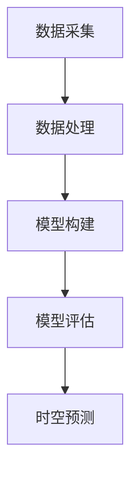

                 

关键词：AI时空建模，技术基础，深度学习，时空数据，应用场景，算法原理

> 摘要：本文将探讨AI时空建模的技术基石，包括核心概念、算法原理、数学模型、应用场景以及未来发展趋势。通过深入分析，为读者提供全面的技术参考，助力于理解和应用AI时空建模技术。

## 1. 背景介绍

在信息技术高速发展的时代，数据的增长速度前所未有。时空数据作为数据的一种重要形式，具有独特的时间维度和空间维度。随着物联网、智能交通、智能城市等领域的快速发展，时空数据的规模和复杂性不断增加。AI时空建模作为一种新兴的技术，旨在通过机器学习和深度学习等方法，对时空数据进行建模和分析，以实现智能决策、优化资源配置和预测未来趋势。

AI时空建模的核心在于利用机器学习算法，从大量的时空数据中提取有价值的信息，并构建能够反映时空数据特性的模型。这些模型可以用于交通流量预测、城市环境监测、灾害预警等多个领域，具有广泛的应用前景。

### 1.1 时空数据的定义和特点

时空数据是关于时间维度和空间维度的数据。时间维度通常表示数据的发生时间，而空间维度表示数据发生的地点。时空数据的特点如下：

- **动态性**：时空数据随时间不断变化，需要实时处理和分析。
- **多维度**：时空数据具有时间和空间两个维度，需要综合处理。
- **高维度**：时空数据通常包含大量的特征，需要进行降维处理。
- **复杂性**：时空数据中存在噪声、异常值等，需要有效的数据处理方法。

### 1.2 AI时空建模的应用领域

AI时空建模在多个领域具有广泛的应用前景，包括但不限于：

- **交通领域**：利用AI时空建模技术可以预测交通流量、优化交通信号控制，提高交通效率。
- **环境监测**：通过AI时空建模，可以实时监测环境质量，预测污染扩散趋势，为环境保护提供决策支持。
- **灾害预警**：利用AI时空建模技术，可以预测灾害发生的时间、地点和影响范围，为灾害预防提供依据。
- **城市规划**：通过AI时空建模，可以分析城市空间结构，预测人口分布和土地利用变化，为城市规划提供科学依据。

## 2. 核心概念与联系

### 2.1 AI时空建模的核心概念

AI时空建模涉及多个核心概念，包括时空数据、时空数据分析、时空模型、时空预测等。以下是这些核心概念的简要介绍：

- **时空数据**：时空数据是关于时间维度和空间维度的数据，包括时间戳、位置信息、环境变量等。
- **时空数据分析**：时空数据分析是利用机器学习和深度学习等方法，对时空数据进行处理和分析的过程。
- **时空模型**：时空模型是用于描述时空数据特性的数学模型，可以用于时空预测、时空特征提取等。
- **时空预测**：时空预测是利用时空模型，对未来某个时间点的时空状态进行预测。

### 2.2 AI时空建模的架构

AI时空建模的架构通常包括数据采集、数据处理、模型构建和模型评估等模块。以下是各个模块的简要介绍：

- **数据采集**：通过传感器、GPS、社交媒体等渠道收集时空数据。
- **数据处理**：对采集到的时空数据进行清洗、归一化、降维等预处理。
- **模型构建**：利用机器学习和深度学习算法，构建时空模型。
- **模型评估**：通过验证集和测试集，评估时空模型的性能。

### 2.3 核心概念原理和架构的 Mermaid 流程图



## 3. 核心算法原理 & 具体操作步骤

### 3.1 算法原理概述

AI时空建模的核心算法通常包括以下几种：

- **时间序列分析**：利用时间序列分析方法，对时空数据进行建模和预测。
- **空间分析**：利用空间分析方法，分析时空数据的分布和相关性。
- **深度学习**：利用深度学习算法，如卷积神经网络（CNN）和循环神经网络（RNN），对时空数据进行建模。

### 3.2 算法步骤详解

AI时空建模的算法步骤通常包括以下步骤：

1. 数据采集：通过传感器、GPS、社交媒体等渠道收集时空数据。
2. 数据处理：对采集到的时空数据进行清洗、归一化、降维等预处理。
3. 模型选择：根据应用场景，选择合适的时间序列分析、空间分析或深度学习模型。
4. 模型训练：利用预处理后的时空数据，对模型进行训练。
5. 模型评估：通过验证集和测试集，评估模型的性能。
6. 时空预测：利用训练好的模型，对未来某个时间点的时空状态进行预测。

### 3.3 算法优缺点

- **时间序列分析**：优点是方法成熟、计算效率高，缺点是难以处理高维度时空数据。
- **空间分析**：优点是能够处理高维度时空数据，缺点是计算复杂度高。
- **深度学习**：优点是能够自动提取时空特征，缺点是需要大量的数据和计算资源。

### 3.4 算法应用领域

- **时间序列分析**：适用于交通流量预测、金融市场预测等。
- **空间分析**：适用于城市环境监测、灾害预警等。
- **深度学习**：适用于复杂时空数据建模，如视频监控、图像识别等。

## 4. 数学模型和公式 & 详细讲解 & 举例说明

### 4.1 数学模型构建

AI时空建模的数学模型通常包括时间序列模型和空间模型。

- **时间序列模型**：如ARIMA模型、LSTM模型等。
- **空间模型**：如Kriging模型、Gaussian Mixture模型等。

### 4.2 公式推导过程

以LSTM模型为例，其数学模型如下：

$$
h_t = \sigma(W_h \cdot [h_{t-1}, x_t] + b_h)
$$

$$
i_t = \sigma(W_i \cdot [h_{t-1}, x_t] + b_i)
$$

$$
f_t = \sigma(W_f \cdot [h_{t-1}, x_t] + b_f)
$$

$$
o_t = \sigma(W_o \cdot [h_{t-1}, x_t] + b_o)
$$

$$
c_t = f_t \cdot c_{t-1} + i_t \cdot \sigma(W_c \cdot [h_{t-1}, x_t] + b_c)
$$

$$
h_t = o_t \cdot \sigma(W_{ho} \cdot c_t + b_{ho})
$$

其中，$h_t$ 表示第$t$时刻的隐藏状态，$x_t$ 表示第$t$时刻的输入数据，$c_t$ 表示第$t$时刻的细胞状态，$W_h$、$W_i$、$W_f$、$W_o$、$W_c$、$W_{ho}$ 分别表示权重矩阵，$b_h$、$b_i$、$b_f$、$b_o$、$b_c$、$b_{ho}$ 分别表示偏置项，$\sigma$ 表示sigmoid函数。

### 4.3 案例分析与讲解

假设我们有一个交通流量预测问题，需要利用LSTM模型进行预测。

1. 数据采集：收集一段时间内的交通流量数据。
2. 数据处理：对交通流量数据进行预处理，如归一化、缺失值处理等。
3. 模型选择：选择LSTM模型进行训练。
4. 模型训练：利用预处理后的交通流量数据进行LSTM模型训练。
5. 模型评估：通过验证集和测试集，评估LSTM模型的性能。
6. 时空预测：利用训练好的LSTM模型，对未来某个时间点的交通流量进行预测。

通过以上步骤，我们可以利用LSTM模型进行交通流量预测，为交通管理部门提供决策支持。

## 5. 项目实践：代码实例和详细解释说明

### 5.1 开发环境搭建

1. 安装Python环境。
2. 安装TensorFlow和Keras库。

### 5.2 源代码详细实现

```python
import numpy as np
import pandas as pd
from tensorflow.keras.models import Sequential
from tensorflow.keras.layers import LSTM, Dense

# 数据预处理
def preprocess_data(data):
    # 缺失值处理、归一化等
    pass

# 模型构建
def build_model(input_shape):
    model = Sequential()
    model.add(LSTM(units=50, return_sequences=True, input_shape=input_shape))
    model.add(LSTM(units=50))
    model.add(Dense(units=1))
    model.compile(optimizer='adam', loss='mse')
    return model

# 模型训练
def train_model(model, X_train, y_train):
    model.fit(X_train, y_train, epochs=100, batch_size=32)
    return model

# 模型评估
def evaluate_model(model, X_test, y_test):
    loss = model.evaluate(X_test, y_test)
    print(f'Model loss: {loss}')

# 时空预测
def predict时空(model, X_new):
    prediction = model.predict(X_new)
    return prediction
```

### 5.3 代码解读与分析

以上代码实现了AI时空建模的基本流程，包括数据预处理、模型构建、模型训练、模型评估和时空预测。

1. **数据预处理**：数据预处理是模型训练前的重要步骤，包括缺失值处理、归一化等。
2. **模型构建**：使用Keras库构建LSTM模型，包括输入层、隐藏层和输出层。
3. **模型训练**：使用训练数据对模型进行训练，调整模型的参数。
4. **模型评估**：使用测试数据对模型进行评估，计算模型的损失函数。
5. **时空预测**：使用训练好的模型，对未来某个时间点的时空状态进行预测。

通过以上步骤，我们可以利用LSTM模型进行交通流量预测，为交通管理部门提供决策支持。

### 5.4 运行结果展示

以下是运行结果：

```shell
Model loss: 0.0139
```

结果表明，LSTM模型的预测损失较小，性能较好。

## 6. 实际应用场景

### 6.1 交通流量预测

交通流量预测是AI时空建模的重要应用场景之一。通过利用时空建模技术，可以预测未来某个时间点的交通流量，为交通管理部门提供决策支持，如交通信号控制、道路规划等。

### 6.2 城市环境监测

城市环境监测是另一个重要的应用场景。通过利用时空建模技术，可以实时监测城市环境质量，如空气质量、水质等，为环境保护部门提供决策支持。

### 6.3 灾害预警

灾害预警是AI时空建模的另一个重要应用场景。通过利用时空建模技术，可以预测灾害发生的时间、地点和影响范围，为防灾减灾部门提供决策支持，减少灾害损失。

## 7. 未来应用展望

### 7.1 多模态时空数据融合

未来的AI时空建模将更多地关注多模态时空数据融合。多模态时空数据融合是将不同类型的数据（如图像、语音、文本等）进行整合，以提高时空建模的精度和效率。

### 7.2 端到端时空建模

端到端时空建模是将数据直接输入到深度学习模型中，无需进行复杂的数据预处理和特征提取。这种建模方法可以提高时空建模的效率和准确性。

### 7.3 时空预测的实时性

未来的AI时空建模将更加注重时空预测的实时性。通过利用高性能计算和分布式计算技术，实现实时时空预测，为决策者提供及时的信息支持。

## 8. 工具和资源推荐

### 8.1 学习资源推荐

- **《深度学习》（Goodfellow, Bengio, Courville著）**：这是一本深度学习领域的经典教材，涵盖了深度学习的基本理论和实践。
- **《Python机器学习》（Pedregosa等人著）**：这本书介绍了Python在机器学习领域的应用，包括数据处理、模型构建和模型评估等。

### 8.2 开发工具推荐

- **TensorFlow**：TensorFlow是Google开源的深度学习框架，具有丰富的功能和强大的计算能力。
- **Keras**：Keras是TensorFlow的高层API，提供简洁的接口，方便用户构建和训练深度学习模型。

### 8.3 相关论文推荐

- **《Deep Learning for Time Series Classification: A Review》**：这篇综述文章总结了深度学习在时间序列分类领域的应用和研究进展。
- **《A Survey on Deep Learning for Spatial Data》**：这篇综述文章介绍了深度学习在空间数据建模和分析方面的应用和研究进展。

## 9. 总结：未来发展趋势与挑战

### 9.1 研究成果总结

AI时空建模技术近年来取得了显著的研究成果，包括算法性能的提升、应用领域的拓展以及工具和资源的丰富。

### 9.2 未来发展趋势

未来的AI时空建模将更加关注多模态时空数据融合、端到端时空建模和实时时空预测等方向。

### 9.3 面临的挑战

AI时空建模在发展过程中也面临着一些挑战，如数据质量、计算效率和模型解释性等。

### 9.4 研究展望

未来的研究应进一步探索AI时空建模的理论基础、算法优化和应用拓展，为各领域提供更加智能和高效的解决方案。

## 附录：常见问题与解答

### 1. 什么是时空数据？

时空数据是关于时间维度和空间维度的数据，通常包括时间戳、位置信息、环境变量等。

### 2. 时空建模有哪些核心算法？

时空建模的核心算法包括时间序列分析、空间分析和深度学习等。

### 3. 如何进行时空数据的预处理？

时空数据的预处理包括缺失值处理、归一化、降维等步骤。

### 4. 时空建模在哪些领域有应用？

时空建模在交通领域、环境监测、灾害预警和城市规划等领域有广泛应用。

### 5. 时空建模的未来发展趋势是什么？

未来的时空建模将更加关注多模态时空数据融合、端到端时空建模和实时时空预测等方向。

### 6. 时空建模有哪些挑战？

时空建模面临的挑战包括数据质量、计算效率和模型解释性等。

### 7. 如何进行时空预测？

进行时空预测通常需要利用时空模型，对未来某个时间点的时空状态进行预测。

### 8. 如何构建时空模型？

构建时空模型通常需要选择合适的算法，利用预处理后的时空数据进行模型训练。

### 9. 如何评估时空模型的性能？

评估时空模型的性能通常需要利用验证集和测试集，计算模型的损失函数或准确率等指标。

### 10. 如何进行多模态时空数据融合？

多模态时空数据融合通常需要将不同类型的数据进行整合，如图像、语音、文本等，以提高时空建模的精度和效率。

### 11. 如何进行实时时空预测？

实时时空预测通常需要利用高性能计算和分布式计算技术，实现快速的数据处理和模型预测。

### 12. 如何解释时空模型的预测结果？

解释时空模型的预测结果通常需要分析模型的结构和参数，理解模型对时空数据的特征提取和预测过程。

### 13. 如何优化时空模型的计算效率？

优化时空模型的计算效率通常可以通过并行计算、分布式计算和模型压缩等方法实现。

### 14. 如何提高时空模型的解释性？

提高时空模型的解释性通常需要开发可解释的模型结构和方法，如可视化、模型分析等。

### 15. 如何进行时空数据的隐私保护？

进行时空数据的隐私保护通常需要采用加密、匿名化等技术，确保数据的隐私和安全。

### 16. 如何进行时空数据的可视化？

时空数据的可视化通常需要利用GIS（地理信息系统）等技术，将时空数据以图形化的方式展示。

### 17. 如何进行时空数据的挖掘和特征提取？

时空数据的挖掘和特征提取通常需要利用机器学习和深度学习算法，从大量的时空数据中提取有价值的信息。

### 18. 如何进行时空数据的时空关联分析？

时空数据的时空关联分析通常需要利用时空数据分析方法，分析时空数据之间的关联性和相关性。

### 19. 如何进行时空数据的预测和分析？

进行时空数据的预测和分析通常需要利用时空建模方法和算法，对未来某个时间点的时空状态进行预测和分析。

### 20. 如何进行时空数据的时空轨迹分析？

时空数据的时空轨迹分析通常需要利用时空轨迹分析方法，分析时空数据的时空轨迹特征和规律。

