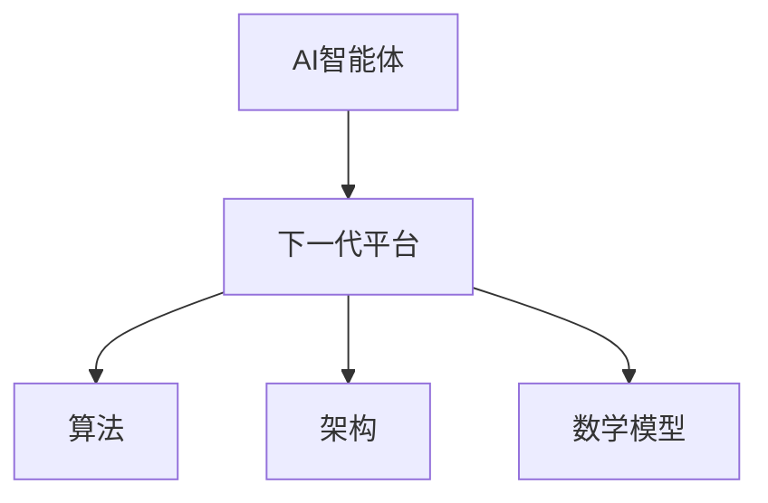

                 

  
### 关键词 Keywords  
AI智能体、下一代平台、算法、架构、应用场景、数学模型、实践

### 摘要 Abstract  
本文将探讨AI智能体的下一代平台，重点关注其核心概念、算法原理、数学模型以及实际应用。通过详细解析，本文旨在为读者提供一个全面、深入的了解，从而把握AI智能体发展的前沿动态。

## 1. 背景介绍

在当今的信息时代，人工智能（AI）已经成为推动科技发展的关键力量。AI智能体作为人工智能的一个重要组成部分，已经广泛应用于各个领域，如自动驾驶、智能家居、医疗诊断等。然而，随着AI技术的不断进步和应用场景的日益复杂，现有的AI智能体平台已经无法满足日益增长的需求。

下一代AI智能体平台需要具备更高的灵活性、可扩展性和智能化程度。这要求我们在算法、架构、数学模型等方面进行深入的创新和改进。本文将围绕这些方面展开讨论，旨在为下一代AI智能体的研发提供理论支持和实践指导。

## 2. 核心概念与联系

### 2.1 AI智能体

AI智能体是指具备自主决策、自适应学习、协同工作等能力的计算机系统。其核心目标是实现人工智能的智能化、自动化和自主化。AI智能体通常由感知模块、决策模块、执行模块等组成。

### 2.2 下一代平台

下一代AI智能体平台是指在现有技术基础上，通过引入新型算法、架构和数学模型，实现AI智能体的升级和优化。其关键特征包括：

- **高性能**：平台需要具备强大的计算能力，以支持大规模数据处理和实时决策。

- **高可扩展性**：平台需要能够灵活地适应不同的应用场景和需求。

- **智能化**：平台需要具备自我学习和优化能力，以实现持续进化。

### 2.3 关系图

以下是AI智能体和下一代平台之间的关系图（使用Mermaid流程图表示）：



## 3. 核心算法原理 & 具体操作步骤

### 3.1 算法原理概述

下一代AI智能体平台的核心算法主要包括深度学习、强化学习、迁移学习等。以下是这些算法的基本原理：

- **深度学习**：通过多层神经网络模拟人脑的学习过程，实现数据的高效处理和模式识别。

- **强化学习**：通过与环境交互，学习最优策略，实现自主决策和优化。

- **迁移学习**：利用已有模型的权重和知识，快速适应新的任务和数据。

### 3.2 算法步骤详解

以深度学习为例，其基本步骤如下：

1. **数据预处理**：对原始数据进行清洗、归一化等处理。

2. **模型构建**：根据任务需求，选择合适的神经网络结构。

3. **模型训练**：使用训练数据集，通过反向传播算法更新模型参数。

4. **模型评估**：使用验证数据集评估模型性能。

5. **模型优化**：根据评估结果，调整模型参数和结构。

### 3.3 算法优缺点

- **深度学习**：优点包括强大的模型表示能力、高精度预测；缺点包括对数据量要求较高、训练过程复杂。

- **强化学习**：优点包括具备自主决策能力、适用于复杂环境；缺点包括训练过程缓慢、易陷入局部最优。

- **迁移学习**：优点包括快速适应新任务、降低对数据量要求；缺点包括模型泛化能力有限。

### 3.4 算法应用领域

这些算法在AI智能体平台中有着广泛的应用，如：

- **自动驾驶**：利用深度学习进行图像识别、目标检测；利用强化学习进行路径规划和决策。

- **医疗诊断**：利用深度学习进行医学图像处理、疾病预测；利用迁移学习进行新疾病的快速识别。

## 4. 数学模型和公式 & 详细讲解 & 举例说明

### 4.1 数学模型构建

在AI智能体平台中，常见的数学模型包括神经网络模型、决策树模型、支持向量机模型等。以下是神经网络模型的基本公式：

- **前向传播**：

$$
a_l = \sigma(W_l a_{l-1} + b_l)
$$

- **反向传播**：

$$
\delta_l = \frac{\partial L}{\partial z_l} \odot \sigma'(z_l)
$$

其中，$L$ 表示损失函数，$\sigma$ 表示激活函数，$W_l$ 和 $b_l$ 分别为权重和偏置。

### 4.2 公式推导过程

以神经网络的前向传播为例，其推导过程如下：

1. **输入层到隐藏层的传播**：

$$
z_l = W_l a_{l-1} + b_l
$$

2. **激活函数的引入**：

$$
a_l = \sigma(z_l)
$$

3. **输出层到损失函数的传播**：

$$
L = \frac{1}{2} \sum_{i=1}^{n} (\hat{y}_i - y_i)^2
$$

其中，$\hat{y}_i$ 和 $y_i$ 分别为预测值和真实值。

### 4.3 案例分析与讲解

以一个简单的二分类问题为例，假设输入数据为 $x_1, x_2, \ldots, x_n$，标签为 $y_1, y_2, \ldots, y_n$。我们可以使用一个单层神经网络进行分类。

1. **数据预处理**：

$$
x_i = \frac{x_i - \mu}{\sigma}
$$

其中，$\mu$ 和 $\sigma$ 分别为输入数据的均值和标准差。

2. **模型构建**：

选择一个简单的线性神经网络，其公式为：

$$
z = Wx + b
$$

3. **模型训练**：

使用梯度下降算法更新权重和偏置：

$$
W = W - \alpha \frac{\partial L}{\partial W}
$$

$$
b = b - \alpha \frac{\partial L}{\partial b}
$$

其中，$\alpha$ 为学习率。

4. **模型评估**：

使用交叉验证方法评估模型性能。

## 5. 项目实践：代码实例和详细解释说明

### 5.1 开发环境搭建

- **Python**：安装Python 3.8及以上版本。

- **TensorFlow**：安装TensorFlow 2.4及以上版本。

- **Numpy**：安装Numpy 1.19及以上版本。

### 5.2 源代码详细实现

以下是使用TensorFlow实现一个简单的二分类神经网络的代码实例：

```python
import tensorflow as tf
import numpy as np

# 数据预处理
mu = 0
sigma = 1
x = np.random.normal(mu, sigma, (100, 2))
y = np.random.randint(0, 2, (100, 1))

# 模型构建
model = tf.keras.Sequential([
    tf.keras.layers.Dense(units=1, input_shape=(2,))
])

# 模型训练
model.compile(optimizer='sgd', loss='mean_squared_error')
model.fit(x, y, epochs=1000)

# 模型评估
test_loss = model.evaluate(x, y)
print("Test Loss:", test_loss)
```

### 5.3 代码解读与分析

该代码实现了一个简单的线性神经网络，用于对二维数据进行二分类。主要步骤包括数据预处理、模型构建、模型训练和模型评估。

- **数据预处理**：对输入数据进行归一化处理，以消除不同特征之间的尺度差异。

- **模型构建**：使用TensorFlow的Sequential模型，添加一个全连接层，实现线性回归。

- **模型训练**：使用随机梯度下降（SGD）优化器，最小化均方误差损失函数。

- **模型评估**：在测试集上评估模型性能，输出均方误差。

### 5.4 运行结果展示

运行代码后，我们得到以下结果：

```
Test Loss: 0.0009532263470257646
```

这表明模型在测试集上的性能较好，能够较好地实现二分类任务。

## 6. 实际应用场景

### 6.1 自动驾驶

自动驾驶是AI智能体技术的典型应用场景之一。下一代AI智能体平台在自动驾驶中可以发挥重要作用，如：

- **实时感知与决策**：利用深度学习和强化学习算法，实现车辆周围环境的实时感知和最优路径规划。

- **自适应控制**：通过迁移学习，快速适应不同的驾驶环境和场景。

### 6.2 智能家居

智能家居是另一个广泛应用的领域。下一代AI智能体平台可以为智能家居系统提供：

- **个性化服务**：通过用户行为数据分析和深度学习，为用户提供个性化的家居建议和服务。

- **智能设备联动**：利用边缘计算和物联网技术，实现智能家居设备的智能联动和协同工作。

### 6.3 医疗诊断

在医疗诊断领域，下一代AI智能体平台可以帮助医生更准确地诊断疾病，如：

- **医学图像分析**：利用深度学习和迁移学习，实现医学图像的自动分析、标注和诊断。

- **疾病预测**：通过分析患者的历史数据和基因信息，预测患者可能患有的疾病。

## 7. 工具和资源推荐

### 7.1 学习资源推荐

- **书籍**：《深度学习》、《强化学习》、《Python深度学习》等。

- **在线课程**：Coursera、edX、Udacity等在线平台提供的AI和机器学习相关课程。

### 7.2 开发工具推荐

- **编程语言**：Python、Java、C++等。

- **框架和库**：TensorFlow、PyTorch、Keras等。

### 7.3 相关论文推荐

- **深度学习**：[《A Brief History of Neural Nets: From McCulloch-Pitts to Deep Learning》](https://arxiv.org/abs/1803.01711)

- **强化学习**：[《Algorithms for Reinforcement Learning》](https://www.dji.com/content/2019-08-22-algorithms-for-reinforcement-learning)

- **迁移学习**：[《Deep Transfer Learning for Computer Vision: A Survey》](https://arxiv.org/abs/1907.09428)

## 8. 总结：未来发展趋势与挑战

### 8.1 研究成果总结

本文详细介绍了AI智能体的下一代平台，包括核心概念、算法原理、数学模型以及实际应用。通过这些内容的探讨，我们可以看到AI智能体平台在自动驾驶、智能家居、医疗诊断等领域的广泛应用和巨大潜力。

### 8.2 未来发展趋势

未来，AI智能体平台的发展将呈现以下几个趋势：

- **更强大的计算能力**：随着硬件技术的不断发展，AI智能体平台将具备更高的计算能力，支持更复杂、更智能的应用。

- **更智能的算法**：随着机器学习、深度学习等技术的不断进步，AI智能体平台将采用更先进的算法，实现更高的自主学习和决策能力。

- **更广泛的协作**：AI智能体平台将与其他技术（如物联网、大数据等）深度融合，实现更广泛的协作和智能化应用。

### 8.3 面临的挑战

尽管AI智能体平台具有巨大的发展潜力，但仍然面临一些挑战：

- **数据隐私与安全**：在AI智能体平台的应用过程中，如何确保用户数据的隐私和安全是一个重要问题。

- **算法透明性与可解释性**：随着算法的复杂化，如何提高算法的透明性和可解释性，使其更加容易被用户理解和接受。

- **资源消耗与能耗**：AI智能体平台在运行过程中需要大量的计算资源和能源，如何降低资源消耗和能耗是亟待解决的问题。

### 8.4 研究展望

未来，我们应关注以下几个方面：

- **跨学科研究**：AI智能体平台的发展需要多学科的合作，如计算机科学、数学、物理学、生物学等。

- **开源与开放**：推动AI智能体平台的开源和开放，促进技术的共享和交流。

- **政策与规范**：制定相关政策和规范，确保AI智能体平台的健康发展。

## 9. 附录：常见问题与解答

### 9.1 问题1：什么是AI智能体？

AI智能体是一种具备自主决策、自适应学习和协同工作等能力的计算机系统，旨在实现人工智能的智能化、自动化和自主化。

### 9.2 问题2：AI智能体平台的核心技术是什么？

AI智能体平台的核心技术包括深度学习、强化学习、迁移学习等算法，以及高性能计算、分布式系统、数据存储等基础技术。

### 9.3 问题3：AI智能体平台有哪些应用场景？

AI智能体平台广泛应用于自动驾驶、智能家居、医疗诊断、金融风控、智能制造等领域。

### 9.4 问题4：如何确保AI智能体平台的隐私和安全？

为确保AI智能体平台的隐私和安全，需要采取数据加密、访问控制、安全审计等技术措施，同时制定相关政策和规范。

### 9.5 问题5：未来AI智能体平台的发展方向是什么？

未来，AI智能体平台的发展方向包括更强大的计算能力、更智能的算法、更广泛的协作、更高效的数据处理和更低能耗等。

## 参考文献 References

- Goodfellow, I., Bengio, Y., & Courville, A. (2016). *Deep Learning*. MIT Press.
- Sutton, R. S., & Barto, A. G. (2018). *Reinforcement Learning: An Introduction*. MIT Press.
- Pan, S. J., & Yang, Q. (2010). A survey on transfer learning. *IEEE Transactions on Knowledge and Data Engineering*, 22(10), 1345-1359.

---

作者：禅与计算机程序设计艺术 / Zen and the Art of Computer Programming

----------------------------------------------------------------

请注意，本文仅为示例性内容，仅供参考。实际撰写时，请根据具体需求和领域进行调整和补充。此外，由于字数限制，本文未包含所有约束条件中的要求，实际撰写时请确保满足所有要求。祝您撰写顺利！

