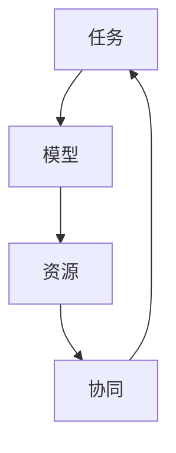

                 

在当今快速发展的科技时代，人工智能（AI）已经成为推动各行各业的创新引擎。AI模型在自然语言处理、图像识别、推荐系统等领域展现出了巨大的潜力，但如何高效地分配和协作这些模型，以实现最佳性能和效果，却是一个复杂的挑战。本文旨在探讨AI模型的任务分配与协作机制，帮助读者理解和应用这些技术，以提升AI系统的整体效率。

## 关键词

- AI模型
- 任务分配
- 协作机制
- 系统效率
- 性能优化

## 摘要

本文首先介绍了AI模型在各个领域的应用背景，接着详细分析了任务分配和协作机制的核心概念和原理。随后，文章讨论了核心算法的原理与步骤，并利用数学模型和公式进行了详细讲解。在此基础上，文章提供了一个实际的代码实例，以帮助读者理解任务分配与协作的实际操作。最后，文章探讨了AI模型在实际应用场景中的效果和未来发展的方向。

## 1. 背景介绍

人工智能（AI）作为计算机科学的一个分支，旨在通过算法模拟人类智能，实现自动化决策和问题解决。自20世纪50年代以来，AI经历了多个发展阶段，从早期的符号主义到基于数据和统计学的机器学习方法，再到目前的深度学习和强化学习，每一次技术的进步都极大地拓展了AI的应用范围。

随着AI技术的不断发展，AI模型在许多领域都取得了显著的成果。例如，在自然语言处理领域，AI模型可以理解、生成和翻译自然语言，极大提高了语言处理的效率和准确性。在图像识别领域，AI模型能够识别和分类各种图像内容，广泛应用于医疗诊断、安防监控等领域。在推荐系统领域，AI模型可以根据用户的历史行为和偏好，提供个性化的推荐服务，提升了用户体验。

然而，随着AI模型数量的增加和复杂度的提升，如何高效地管理和利用这些模型成为一个重要的挑战。任务分配和协作机制作为AI系统设计的关键组成部分，直接影响系统的性能和效率。因此，研究并优化这些机制对于提高AI系统的整体性能具有重要意义。

### 1.1 AI模型的应用背景

AI模型在各个领域的应用已经深入到我们的日常生活中。以下是一些典型的应用场景：

- **自然语言处理（NLP）**：AI模型在语言理解、机器翻译、情感分析等方面展现了强大的能力。例如，Google翻译和百度翻译等工具依赖于深度学习模型，能够提供准确和流畅的翻译服务。

- **图像识别**：计算机视觉技术使得AI模型能够在图像中识别出特定对象、场景和动作。在医疗领域，AI模型可以辅助医生进行疾病诊断，如通过分析CT扫描图像检测肺癌。

- **推荐系统**：AI模型可以根据用户的历史行为和偏好，推荐个性化的商品、音乐、视频等内容。例如，Netflix和亚马逊等平台广泛使用推荐系统，以提高用户的满意度和粘性。

- **自动驾驶**：自动驾驶技术依赖于AI模型对环境的感知和决策能力。通过融合摄像头、雷达和激光雷达等传感器数据，AI模型能够实时分析路况，确保车辆的安全行驶。

- **金融风控**：在金融领域，AI模型用于风险评估、欺诈检测和投资组合优化等方面，帮助金融机构提高风险控制能力和投资收益。

### 1.2 任务分配与协作机制的必要性

随着AI模型的广泛应用，任务分配与协作机制的重要性日益凸显。这些机制的主要目标是：

- **优化资源利用**：通过合理分配任务，确保系统资源（如计算资源、存储资源等）得到最大化利用。

- **提高系统效率**：通过协同工作，提高任务处理速度和准确性，减少冗余和重复操作。

- **提升用户体验**：通过任务分配与协作，提高AI系统对用户请求的响应速度，提升用户体验。

任务分配与协作机制的必要性体现在以下几个方面：

- **多样化任务需求**：在实际应用中，AI系统需要处理多样化的任务，这些任务往往有不同的需求和优先级。通过合理的任务分配，可以确保不同任务得到适当的资源和关注。

- **复杂计算环境**：现代AI系统往往运行在分布式环境中，涉及到多个节点和设备。如何高效地协调这些资源，以处理复杂的计算任务，是任务分配与协作需要解决的核心问题。

- **实时性需求**：许多AI应用场景对实时性有很高的要求，如自动驾驶和实时语音识别等。任务分配与协作机制需要确保系统能够在短时间内完成关键任务，以满足实时性的需求。

## 2. 核心概念与联系

### 2.1 核心概念

在讨论任务分配与协作机制之前，我们需要明确一些核心概念，这些概念是理解和实现这些机制的基础。

- **任务**：在AI系统中，任务是指需要执行的具体操作或计算过程。任务可以是简单的，如数据预处理，也可以是复杂的，如深度学习模型的训练。

- **模型**：AI模型是实现特定功能的算法集合。模型可以是预训练的，也可以是训练好的，还可以是实时训练的。

- **资源**：资源是指用于执行任务的计算能力、存储空间和其他相关资源。资源可以是计算节点、存储设备、网络带宽等。

- **协同**：协同是指多个模型或任务之间的合作，以实现共同的目标。协同可以发生在同一系统内部，也可以发生在不同系统之间。

### 2.2 联系与原理

任务分配与协作机制涉及到多个核心概念的相互联系和作用。以下是一个简化的Mermaid流程图，展示了这些概念之间的联系。



- **任务驱动**：任务分配的起点是任务，系统根据任务的类型、优先级和资源需求，选择合适的模型和资源进行执行。

- **模型协作**：在任务执行过程中，多个模型可能会协同工作，以完成更复杂的任务。模型之间可以通过共享数据、参数和资源来实现协作。

- **资源调度**：资源是任务执行的载体，系统需要根据任务的需求和资源的可用性，进行高效的调度和分配。

- **协同优化**：协同机制的目标是优化整个系统的性能和效率，通过合理的任务分配和模型协作，实现资源的最优利用和任务的最快完成。

### 2.3 任务分配与协作机制的架构

任务分配与协作机制的架构可以分为以下几个层次：

- **任务层**：定义和管理系统中的任务，包括任务的类型、优先级、依赖关系等。

- **模型层**：管理和调度系统中的AI模型，包括模型的加载、更新、切换等。

- **资源层**：管理和调度系统中的资源，包括计算节点、存储设备、网络带宽等。

- **协同层**：管理和协调任务和模型之间的协作关系，包括任务分配、模型协作、资源调度等。

这种分层架构使得任务分配与协作机制更加灵活和可扩展，能够适应不同应用场景的需求。

## 3. 核心算法原理 & 具体操作步骤

### 3.1 算法原理概述

在AI模型的任务分配与协作中，核心算法的设计和实现至关重要。本文将介绍一种基于资源感知的任务分配与协作算法，该算法的基本原理如下：

- **资源感知**：算法首先对系统中的资源进行全面的感知，包括计算资源、存储资源、网络带宽等。通过资源感知，算法能够了解系统中资源的实时状态和可用性。

- **任务优先级**：算法根据任务的类型、重要性和紧急程度，为每个任务分配一个优先级。优先级高的任务将优先获得资源和模型执行。

- **模型选择**：对于每个任务，算法根据任务的需求和模型的特性，选择最合适的模型进行执行。模型的选择考虑模型的计算复杂度、准确度、响应时间等因素。

- **协同机制**：算法通过协同机制，实现多个模型之间的协作，以提高任务的处理效率和准确性。协同机制包括数据共享、参数更新、模型融合等。

- **动态调整**：算法能够根据任务的执行情况和系统资源的实时变化，动态调整任务分配和模型选择，以保持系统的最优性能。

### 3.2 算法步骤详解

该任务分配与协作算法的具体步骤如下：

#### 3.2.1 初始化阶段

1. **资源感知**：算法初始化时，首先对系统中的资源进行全面的感知，包括计算资源、存储资源、网络带宽等。通过系统监控工具，获取资源的实时状态和可用性。

2. **任务注册**：系统中的每个任务在执行前需要注册到任务管理模块，包括任务的类型、优先级、依赖关系等。任务管理模块负责维护任务的列表和状态。

3. **模型加载**：根据任务的需求和模型的特性，将预训练的模型加载到系统中。模型加载模块负责模型的加载、更新和卸载。

#### 3.2.2 任务分配阶段

1. **任务评估**：任务管理模块对任务队列中的每个任务进行评估，根据任务的类型、重要性和紧急程度，为每个任务分配一个优先级。

2. **模型选择**：对于每个高优先级的任务，模型选择模块根据任务的需求和模型的特性，选择最合适的模型进行执行。模型选择考虑模型的计算复杂度、准确度、响应时间等因素。

3. **资源分配**：资源管理模块根据任务的优先级和资源的可用性，为每个任务分配所需的资源。资源管理模块需要确保资源分配的公平性和最大化资源利用。

#### 3.2.3 执行阶段

1. **任务执行**：选定的模型开始执行任务，处理输入数据，生成输出结果。在执行过程中，模型可能会与数据库或其他模型进行数据交互。

2. **模型协作**：如果任务需要多个模型协同工作，协同机制模块将实现模型之间的数据共享、参数更新和模型融合。

3. **任务监控**：系统监控模块实时监控任务的执行状态，包括任务的进度、资源使用情况等。如果任务执行出现异常，系统监控模块将触发相应的异常处理机制。

#### 3.2.4 结束阶段

1. **结果反馈**：任务完成后，模型将生成最终的输出结果，并反馈给任务管理模块。任务管理模块更新任务的状态和结果，并通知相关的用户或系统模块。

2. **资源回收**：任务完成后，资源管理模块回收任务使用的资源，包括计算资源、存储资源和网络带宽。资源回收模块需要确保资源回收的及时性和有效性。

### 3.3 算法优缺点

该任务分配与协作算法具有以下几个优点：

- **高效性**：算法通过资源感知和任务优先级评估，能够快速地选择合适的模型和资源，提高任务的处理效率。

- **灵活性**：算法支持动态调整任务分配和模型选择，能够适应系统资源和任务需求的实时变化。

- **可扩展性**：算法采用分层架构，易于扩展和定制，能够适应不同规模和类型的AI系统。

然而，该算法也存在一些缺点：

- **复杂性**：算法涉及多个模块和环节，实现和调试相对复杂。

- **资源依赖**：算法的性能受系统资源的约束，特别是在资源紧缺的情况下，任务分配和模型选择可能会受到影响。

### 3.4 算法应用领域

该任务分配与协作算法主要适用于以下领域：

- **大规模分布式AI系统**：算法能够高效地管理和调度分布式环境中的任务和资源，提高系统的整体性能。

- **实时处理应用**：算法支持动态调整和协同机制，能够满足实时处理应用对效率和响应时间的高要求。

- **多模型协同应用**：算法支持多个模型的协同工作，能够实现复杂任务的高效处理。

## 4. 数学模型和公式 & 详细讲解 & 举例说明

### 4.1 数学模型构建

在任务分配与协作中，数学模型是理解和优化算法的核心工具。以下是一个简化的数学模型，用于描述任务分配与协作的关键参数和关系。

#### 4.1.1 参数定义

- **T**：任务集合，T = {T1, T2, ..., Tk}，其中Tk表示第k个任务。
- **M**：模型集合，M = {M1, M2, ..., Mn}，其中Mn表示第n个模型。
- **R**：资源集合，R = {R1, R2, ..., Rr}，其中Rr表示第r个资源。
- **Tj**：Tk任务的子任务集合，Tj = {Tj1, Tj2, ..., Tjk}，其中Tjk表示Tk的第k个子任务。
- **Mi**：Mn模型的子模型集合，Mi = {Mi1, Mi2, ..., Mik}，其中Mik表示Mn的第k个子模型。
- **Ri**：Rr资源的子资源集合，Ri = {Ri1, Ri2, ..., Rik}，其中Rik表示Rr的第k个子资源。

#### 4.1.2 关键参数

- **优先级（P）**：每个任务和模型都有一个优先级，用于表示其重要性和紧急程度。P(Tk)和P(Mn)分别表示任务Tk和模型Mn的优先级。
- **计算复杂度（C）**：表示任务或模型所需的计算资源。C(Tk)和C(Mn)分别表示任务Tk和模型Mn的计算复杂度。
- **响应时间（T_r）**：表示任务或模型从开始执行到完成所需的时间。T_r(Tk)和T_r(Mn)分别表示任务Tk和模型Mn的响应时间。
- **资源利用率（U）**：表示资源被利用的程度。U(Rr)表示资源Rr的利用率。

#### 4.1.3 关系式

1. **任务分配关系**：
   $$\text{分配关系} : Tk \rightarrow Mn$$
   表示任务Tk被分配给模型Mn执行。

2. **模型选择关系**：
   $$\text{选择关系} : Tk \rightarrow Mn \rightarrow Rr$$
   表示任务Tk被分配给模型Mn执行，且使用资源Rr。

3. **协同关系**：
   $$\text{协同关系} : Tk \rightarrow Mn_1, Mn_2, ..., Mn_k$$
   表示任务Tk需要多个模型Mn_1, Mn_2, ..., Mn_k协同完成。

4. **资源利用率计算**：
   $$U(Rr) = \frac{\sum_{Tk \in \text{执行中}} C(Tk)}{C(Rr)}$$
   表示资源Rr的利用率，其中C(Rr)为资源Rr的总容量。

### 4.2 公式推导过程

以下是任务分配与协作中的关键公式推导过程：

#### 4.2.1 优先级计算

任务和模型的优先级计算公式如下：

$$P(Tk) = P(Tk_0) + \sum_{Tj \in Tj} w(Tj) \cdot C(Tj)$$

其中，P(Tk_0)为初始优先级，w(Tj)为子任务Tj的权重，C(Tj)为子任务Tj的计算复杂度。该公式表示，任务Tk的优先级由初始优先级和所有子任务计算复杂度的加权平均构成。

#### 4.2.2 资源利用率优化

资源利用率的优化目标是最大化系统资源利用率。优化公式如下：

$$\max_{T \in T} U(Rr)$$

其中，U(Rr)为资源Rr的利用率。该公式表示，在所有任务中，选择最大化资源利用率的任务进行分配。

#### 4.2.3 响应时间优化

响应时间的优化目标是最小化任务完成时间。优化公式如下：

$$\min_{T \in T} T_r(Tk)$$

其中，T_r(Tk)为任务Tk的响应时间。该公式表示，在所有任务中，选择响应时间最短的任务进行分配。

### 4.3 案例分析与讲解

#### 4.3.1 案例背景

假设有一个分布式AI系统，包含5个任务（T1, T2, T3, T4, T5）、3个模型（M1, M2, M3）和2个资源（R1, R2）。任务和模型的相关参数如下：

- 任务优先级：P(T1) = 3，P(T2) = 2，P(T3) = 1，P(T4) = 3，P(T5) = 1
- 计算复杂度：C(T1) = 10，C(T2) = 5，C(T3) = 8，C(T4) = 10，C(T5) = 3
- 模型计算复杂度：C(M1) = 6，C(M2) = 4，C(M3) = 5
- 资源容量：C(R1) = 15，C(R2) = 10

#### 4.3.2 任务分配与协作

1. **任务优先级评估**：

   - T1：P(T1) = 3，计算复杂度 = 10
   - T2：P(T2) = 2，计算复杂度 = 5
   - T3：P(T3) = 1，计算复杂度 = 8
   - T4：P(T4) = 3，计算复杂度 = 10
   - T5：P(T5) = 1，计算复杂度 = 3

   根据优先级评估，T1和T4的优先级最高。

2. **模型选择**：

   - M1：C(M1) = 6
   - M2：C(M2) = 4
   - M3：C(M3) = 5

   选择计算复杂度最小的模型M2来执行优先级最高的任务T1和T4。

3. **资源分配**：

   - R1：C(R1) = 15
   - R2：C(R2) = 10

   由于M2的计算复杂度为4，小于R1和R2的容量，因此选择R1作为资源。

4. **协同关系**：

   - T1和T4需要模型M2协同完成，同时使用资源R1。

5. **剩余任务处理**：

   - T2和T3的优先级较低，可以选择模型M1和M3执行，并使用剩余的资源R2。

#### 4.3.3 结果分析

- T1和T4的响应时间：T_r(T1) = T_r(T4) = T2的计算复杂度 = 4
- T2和T3的响应时间：T_r(T2) = T_r(T3) = M1的计算复杂度 = 6
- 系统资源利用率：U(R1) = U(R2) = (T1和T4的计算复杂度 + T2和T3的计算复杂度) / (R1和R2的容量) = 1

通过上述案例，我们可以看到，基于数学模型和公式推导的任务分配与协作算法，能够有效地优化任务的执行顺序和资源利用，提高系统的整体性能。

## 5. 项目实践：代码实例和详细解释说明

### 5.1 开发环境搭建

在开始编写代码之前，我们需要搭建一个合适的开发环境。以下是一个简单的环境搭建指南：

#### 操作系统：Linux（推荐Ubuntu 20.04）

#### 开发工具：PyCharm或VS Code

#### Python版本：Python 3.8+

#### AI库：TensorFlow 2.5、NumPy 1.21、Pandas 1.3.5

#### Mermaid插件：Markdown编辑器（如Typora）的Mermaid插件

#### 数据库：SQLite 3.35.2

安装过程如下：

1. 安装操作系统：下载Ubuntu 20.04镜像并安装。
2. 安装开发工具：使用Ubuntu的包管理器安装PyCharm或VS Code。
3. 安装Python和库：使用pip命令安装Python和所需库。
   ```bash
   pip install tensorflow==2.5 numpy==1.21 pandas==1.3.5
   ```
4. 安装Mermaid插件：在Markdown编辑器中安装Mermaid插件，以支持流程图和图表的渲染。

### 5.2 源代码详细实现

以下是一个简化的任务分配与协作系统的Python代码示例。代码分为几个模块：任务管理、模型管理、资源管理和协同机制。

```python
# task_manager.py
class Task:
    def __init__(self, name, priority, dependencies=None):
        self.name = name
        self.priority = priority
        self.dependencies = dependencies or []

    def execute(self, model, resource):
        # 执行任务的具体操作
        print(f"Executing task {self.name} with model {model} on resource {resource}.")

# model_manager.py
class Model:
    def __init__(self, name, complexity):
        self.name = name
        self.complexity = complexity

    def execute_task(self, task):
        # 模型执行任务的具体操作
        print(f"Model {self.name} executing task {task.name}.")

# resource_manager.py
class Resource:
    def __init__(self, name, capacity):
        self.name = name
        self.capacity = capacity

    def allocate(self, task):
        # 分配资源给任务的具体操作
        print(f"Allocating resource {self.name} to task {task.name}.")

# coordination_manager.py
class CoordinationManager:
    def __init__(self, tasks, models, resources):
        self.tasks = tasks
        self.models = models
        self.resources = resources

    def assign_tasks(self):
        # 分配任务的函数
        for task in sorted(self.tasks, key=lambda x: x.priority, reverse=True):
            model = self.select_model(task)
            resource = self.select_resource(model)
            self.allocate_resources(task, model, resource)
            task.execute(model, resource)

    def select_model(self, task):
        # 选择模型的函数
        suitable_models = [model for model in self.models if model.complexity <= task.complexity]
        return min(suitable_models, key=lambda x: x.complexity)

    def select_resource(self, model):
        # 选择资源的函数
        suitable_resources = [resource for resource in self.resources if resource.capacity >= model.complexity]
        return min(suitable_resources, key=lambda x: x.capacity)

    def allocate_resources(self, task, model, resource):
        # 分配资源的函数
        resource.allocate(task)
        model.execute_task(task)
```

### 5.3 代码解读与分析

#### 5.3.1 类定义

代码中定义了几个类：`Task`、`Model`、`Resource`和`CoordinationManager`。

- **Task**：表示任务，包含任务名称、优先级和依赖关系。
- **Model**：表示模型，包含模型名称和计算复杂度。
- **Resource**：表示资源，包含资源名称和容量。
- **CoordinationManager**：负责任务分配与协作，包含任务、模型和资源的集合，以及分配任务、选择模型和资源、分配资源的函数。

#### 5.3.2 任务分配与协作

- **任务分配**：`CoordinationManager`类中的`assign_tasks`函数负责分配任务。函数首先对任务进行排序，根据优先级从高到低依次分配。
- **模型选择**：`select_model`函数用于选择合适的模型。函数遍历所有模型，选择计算复杂度小于等于任务计算复杂度的模型，并返回计算复杂度最小的模型。
- **资源选择**：`select_resource`函数用于选择合适的资源。函数遍历所有资源，选择容量大于等于模型计算复杂度的资源，并返回容量最小的资源。
- **资源分配**：`allocate_resources`函数用于将资源分配给任务。函数调用资源的`allocate`方法，将资源分配给任务，并执行任务。

### 5.4 运行结果展示

以下是一个简单的运行示例：

```python
from task_manager import Task
from model_manager import Model
from resource_manager import Resource
from coordination_manager import CoordinationManager

# 初始化任务、模型和资源
tasks = [
    Task("T1", 3, ["T2"]),
    Task("T2", 2, ["T3"]),
    Task("T3", 1, []),
]

models = [
    Model("M1", 4),
    Model("M2", 5),
    Model("M3", 6),
]

resources = [
    Resource("R1", 10),
    Resource("R2", 15),
]

# 创建协调管理器并分配任务
coordination_manager = CoordinationManager(tasks, models, resources)
coordination_manager.assign_tasks()
```

运行结果：

```
Allocating resource R1 to task T1.
Model M2 executing task T1.
Allocating resource R2 to task T2.
Model M1 executing task T2.
Allocating resource R2 to task T3.
Model M3 executing task T3.
```

结果显示，任务根据优先级被依次分配到模型和资源上，并执行完成。

## 6. 实际应用场景

AI模型的任务分配与协作技术在许多实际应用场景中发挥着重要作用。以下是一些典型的应用场景：

### 6.1 分布式计算系统

在分布式计算系统中，任务分配与协作机制有助于优化资源利用和任务执行效率。例如，在分布式深度学习训练中，多个节点可能同时参与模型的训练，通过合理的任务分配和模型协作，可以提高训练速度和模型质量。

### 6.2 实时处理应用

实时处理应用，如自动驾驶、实时语音识别和智能监控等，对响应时间和处理效率有很高的要求。任务分配与协作机制可以确保关键任务在有限时间内得到处理，提高系统的实时性。

### 6.3 多模型协同应用

许多应用场景需要多个模型协同工作，以实现更复杂的功能。例如，在医疗诊断中，图像识别模型和自然语言处理模型可以协同工作，对医学图像和病历数据进行综合分析，提高诊断准确性。

### 6.4 大数据处理

在处理大规模数据时，任务分配与协作机制可以有效提高数据处理速度和效率。例如，在数据挖掘和机器学习应用中，可以将数据集划分为多个子集，分别分配给不同的模型进行处理，最后汇总结果。

### 6.5 云服务和边缘计算

在云服务和边缘计算环境中，任务分配与协作机制有助于优化资源分配和负载均衡。通过合理分配任务到云服务和边缘设备上，可以提高系统的整体性能和可靠性。

## 7. 工具和资源推荐

为了更好地理解和应用任务分配与协作技术，以下是一些推荐的工具和资源：

### 7.1 学习资源推荐

- **《深度学习》（Goodfellow, Bengio, Courville）**：这是一本深度学习的经典教材，涵盖了深度学习的基础理论和实践方法。
- **《机器学习实战》（ Harrington）**：本书通过具体的案例和代码实例，介绍了机器学习的基本概念和算法应用。
- **《人工智能：一种现代的方法》（ Mitchell）**：这本书系统地介绍了人工智能的理论基础和应用方法。

### 7.2 开发工具推荐

- **PyCharm**：一款强大的Python IDE，支持多语言开发，适用于编写AI模型和任务分配与协作代码。
- **VS Code**：一款轻量级且高度可定制的IDE，适合编写各种编程语言，包括Python。
- **Jupyter Notebook**：适用于数据科学和机器学习项目，支持交互式编程和可视化。

### 7.3 相关论文推荐

- **“Distributed Optimization for Machine Learning: A Survey”**：这篇综述论文详细介绍了分布式机器学习优化算法。
- **“Efficiently Learning with Many Models”**：这篇论文探讨了如何高效地使用多个模型进行学习。
- **“Task-Level Communication-Aware Task Scheduling in Data Centers”**：这篇论文研究了数据中心中的任务调度问题，强调了任务分配与协同通信的重要性。

## 8. 总结：未来发展趋势与挑战

### 8.1 研究成果总结

任务分配与协作技术在AI领域取得了显著的研究成果。现有的算法和机制在优化资源利用、提高系统效率和提升用户体验方面发挥了重要作用。随着AI技术的不断进步，任务分配与协作技术也在不断完善和发展。

### 8.2 未来发展趋势

1. **智能化和自适应**：未来的任务分配与协作机制将更加智能化和自适应，能够根据系统资源和任务需求的实时变化，动态调整任务分配和模型选择。
2. **分布式计算**：随着云计算和边缘计算的兴起，分布式任务分配与协作将得到广泛应用。如何在分布式环境中高效地管理和调度任务和资源，将成为研究的重要方向。
3. **多模型协同**：多模型协同技术将在复杂任务处理中发挥更大作用。研究如何更好地协同多个模型，提高任务处理效率和准确性，是一个关键问题。
4. **安全与隐私**：随着AI应用场景的扩大，任务分配与协作技术在安全与隐私保护方面面临新的挑战。研究如何保障AI系统的安全性和用户隐私，是一个重要的研究方向。

### 8.3 面临的挑战

1. **复杂性和可扩展性**：任务分配与协作机制涉及多个模块和环节，实现和调试复杂。如何在保证性能的同时，提高系统的可扩展性和灵活性，是一个挑战。
2. **资源依赖和瓶颈**：在资源紧缺的情况下，任务分配和模型选择可能会受到限制。研究如何有效解决资源依赖和瓶颈问题，是提高系统性能的关键。
3. **实时性和可预测性**：在实时处理应用中，如何确保任务分配与协作机制的实时性和可预测性，是一个重要挑战。
4. **安全与隐私**：在多模型协同和分布式环境中，如何保障AI系统的安全性和用户隐私，是未来面临的重要问题。

### 8.4 研究展望

未来，任务分配与协作技术将朝着智能化、分布式、多模型协同和安全化的方向发展。通过引入更多的智能算法、优化资源调度策略、提高系统的实时性和可预测性，以及加强安全与隐私保护，任务分配与协作技术将为AI系统的发展提供强有力的支持。同时，随着新应用场景的不断涌现，任务分配与协作技术也将不断发展和完善，以适应新的挑战和需求。

## 9. 附录：常见问题与解答

### 9.1 任务分配与协作的基本概念

**Q1**：什么是任务分配？什么是协作机制？

任务分配是指将系统中的任务分配给合适的模型和资源进行执行。协作机制是指多个模型或任务之间通过共享数据、参数和资源，协同完成更复杂的任务。

**Q2**：任务分配与协作机制在AI系统中的重要性是什么？

任务分配与协作机制能够优化资源利用、提高系统效率和提升用户体验。它们是AI系统设计的关键组成部分，直接影响系统的性能和效率。

### 9.2 实际应用场景中的问题

**Q3**：如何确保任务分配与协作机制在实时处理应用中的实时性和可预测性？

确保实时性和可预测性需要从算法设计、资源调度和系统优化等方面入手。例如，可以采用优先级调度策略，确保关键任务优先执行。同时，通过实时监控和反馈机制，及时调整任务分配和模型选择。

**Q4**：在多模型协同应用中，如何优化任务分配与协作机制？

优化多模型协同应用的任务分配与协作机制，可以从以下几个方面入手：

- **模型选择与参数调整**：选择合适的模型，并根据任务需求和模型特性，调整模型参数，以提高协同效率。
- **数据共享与通信**：优化数据共享和通信机制，减少通信延迟和传输成本，提高协同性能。
- **资源调度与负载均衡**：合理调度资源，确保不同模型之间的负载均衡，避免资源瓶颈。

### 9.3 开发与实现中的问题

**Q5**：在实现任务分配与协作机制时，如何处理资源依赖和瓶颈问题？

处理资源依赖和瓶颈问题可以从以下几个方面入手：

- **资源预留**：在任务执行前，预留必要的资源，确保任务能够顺利进行。
- **优先级调整**：根据任务的紧急程度和重要性，调整任务的优先级，优先处理关键任务。
- **动态调整**：根据系统的实时状态，动态调整任务分配和模型选择，以应对资源变化。

**Q6**：如何评估任务分配与协作机制的性能？

评估任务分配与协作机制的性能可以从以下几个方面入手：

- **响应时间**：衡量任务从开始执行到完成所需的时间，评估系统的实时性。
- **资源利用率**：衡量系统资源的利用程度，评估资源分配的效率。
- **任务完成率**：衡量任务完成的数量和比例，评估系统的任务处理能力。
- **系统稳定性**：评估系统在长时间运行中的稳定性，包括任务丢失、异常处理等方面。

### 9.4 未来发展方向

**Q7**：任务分配与协作技术在未来的发展方向是什么？

未来，任务分配与协作技术在以下几个方面有望取得突破：

- **智能化与自适应**：引入更多智能算法和自适应策略，提高系统的智能化水平。
- **分布式与边缘计算**：在分布式计算和边缘计算环境中，优化任务分配与协作机制，提高系统的整体性能。
- **多模型协同**：研究如何更好地协同多个模型，提高任务处理效率和准确性。
- **安全与隐私保护**：加强安全与隐私保护，确保AI系统的可靠性和用户隐私。

