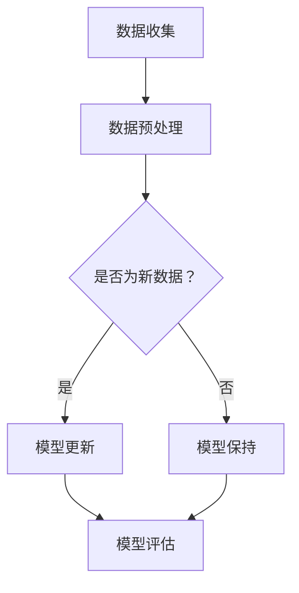
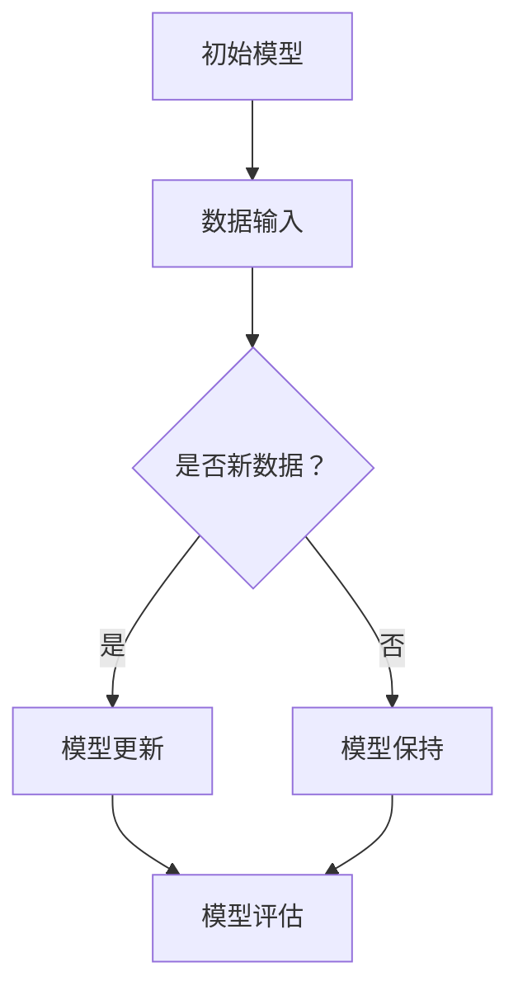

                 

关键词：AI，模型，增量学习，终身学习，算法原理，数学模型，项目实践，应用场景，工具推荐，发展趋势，挑战

> 摘要：本文深入探讨了AI模型的增量学习与终身学习两大关键概念，从理论基础到实践应用进行了全面解析。首先，我们回顾了背景介绍，接着详细阐述了核心概念与联系，通过算法原理和具体操作步骤讲解了增量学习与终身学习的技术实现。随后，本文运用数学模型和公式进行了详细讲解，并通过项目实践展示了代码实例和运行结果。文章还分析了实际应用场景，展望了未来发展趋势与挑战，并推荐了相关工具和资源。

## 1. 背景介绍

在当今快速变化的技术环境中，人工智能（AI）已经成为了推动各行各业创新的重要力量。从自然语言处理、计算机视觉到推荐系统，AI的应用场景越来越广泛。然而，随着数据量的爆炸性增长和业务需求的变化，传统的批量学习方法已经难以满足动态调整模型需求。为了应对这些挑战，AI模型的增量学习和终身学习技术应运而生。

增量学习是指在已有模型的基础上，逐步更新和优化模型，使其能够适应新的数据。这种学习方式可以有效地减少模型重新训练的时间和计算资源消耗。而终身学习则旨在让AI模型能够持续适应环境变化，不断地学习和进化，类似于人类的认知过程。

本文将围绕这两个核心概念展开，详细探讨其理论基础、实现方法、应用场景以及未来趋势。

## 2. 核心概念与联系

### 2.1 增量学习

增量学习的关键在于如何在不重新训练整个模型的前提下，利用新数据更新模型。其主要优势在于可以快速适应新数据，降低计算成本，提高模型效率。

#### Mermaid 流程图：



### 2.2 终身学习

终身学习旨在使AI模型能够像人类一样，在持续的学习过程中不断进化。它通过不断更新模型参数，使模型能够适应动态变化的环境。

#### Mermaid 流程图：



### 2.3 关联性

增量学习和终身学习在实现方式上有所不同，但它们的目标是一致的，即让AI模型能够持续适应环境变化。增量学习是实现终身学习的重要手段之一，通过增量学习，AI模型可以在不断更新中实现终身学习。

## 3. 核心算法原理 & 具体操作步骤

### 3.1 算法原理概述

增量学习和终身学习算法的核心在于如何高效地更新模型参数，并确保模型性能不会因更新而下降。以下是几种常见的算法原理：

- **梯度下降法**：通过迭代优化模型参数，使损失函数最小化。
- **在线学习算法**：在每次新数据到来时，立即更新模型。
- **持续学习算法**：将新数据和旧数据混合，进行连续学习。

### 3.2 算法步骤详解

#### 3.2.1 增量学习步骤：

1. 初始化模型参数。
2. 收集新数据，进行预处理。
3. 计算新数据的梯度。
4. 根据梯度更新模型参数。
5. 评估模型性能。

#### 3.2.2 终身学习步骤：

1. 初始化多个模型。
2. 收集新数据，进行预处理。
3. 对每个模型进行增量学习。
4. 将更新后的模型参数进行融合。
5. 评估综合模型性能。

### 3.3 算法优缺点

#### 增量学习：

- 优点：快速适应新数据，降低计算成本。
- 缺点：可能无法充分利用历史数据，模型性能可能下降。

#### 终身学习：

- 优点：模型能够持续适应环境变化，提高模型稳定性。
- 缺点：计算成本较高，模型融合复杂。

### 3.4 算法应用领域

- **推荐系统**：通过增量学习，实时更新推荐模型。
- **自然语言处理**：终身学习使模型能够适应语言环境变化。
- **计算机视觉**：增量学习提高模型在动态环境中的适应性。

## 4. 数学模型和公式 & 详细讲解 & 举例说明

### 4.1 数学模型构建

增量学习和终身学习算法的核心是优化模型参数。以下是常见的数学模型：

#### 4.1.1 增量学习：

损失函数：$$L(\theta) = -\sum_{i=1}^{n} y_i \log(p(x_i; \theta))$$

更新公式：$$\theta \leftarrow \theta - \alpha \nabla_\theta L(\theta)$$

#### 4.1.2 终身学习：

损失函数：$$L(\theta_1, \theta_2) = \frac{1}{2} (\theta_1 - \theta_2)^T (\theta_1 - \theta_2)$$

更新公式：$$\theta_1 \leftarrow \theta_1 - \alpha \nabla_\theta_1 L(\theta_1, \theta_2)$$

$$\theta_2 \leftarrow \theta_2 - \alpha \nabla_\theta_2 L(\theta_1, \theta_2)$$

### 4.2 公式推导过程

#### 4.2.1 增量学习：

损失函数的推导基于最大似然估计。假设数据集为 $X = \{x_1, x_2, ..., x_n\}$，目标变量为 $y = \{y_1, y_2, ..., y_n\}$，模型参数为 $\theta$，则损失函数可以表示为：

$$L(\theta) = -\sum_{i=1}^{n} y_i \log(p(x_i; \theta))$$

其中，$p(x_i; \theta)$ 为模型在参数 $\theta$ 下对样本 $x_i$ 的预测概率。

#### 4.2.2 终身学习：

损失函数的推导基于模型参数的融合。假设有两个模型 $\theta_1$ 和 $\theta_2$，则损失函数可以表示为：

$$L(\theta_1, \theta_2) = \frac{1}{2} (\theta_1 - \theta_2)^T (\theta_1 - \theta_2)$$

其中，$(\theta_1 - \theta_2)^T (\theta_1 - \theta_2)$ 表示模型参数的差异。

### 4.3 案例分析与讲解

#### 4.3.1 增量学习案例

假设我们有一个分类问题，数据集包含100个样本。初始模型参数为 $\theta_0$。现在我们收集到一批新的数据，包含20个样本。

1. 初始化模型参数：$\theta_0$。
2. 收集新数据，进行预处理。
3. 计算新数据的梯度：$\nabla_\theta L(\theta_0)$。
4. 根据梯度更新模型参数：$\theta_1 = \theta_0 - \alpha \nabla_\theta L(\theta_0)$。
5. 评估模型性能：$L(\theta_1)$。

通过以上步骤，我们实现了模型参数的更新。

#### 4.3.2 终身学习案例

假设我们有两个模型 $\theta_1$ 和 $\theta_2$，初始模型参数分别为 $\theta_{10}$ 和 $\theta_{20}$。现在我们收集到一批新的数据，包含20个样本。

1. 初始化模型参数：$\theta_{10}$ 和 $\theta_{20}$。
2. 收集新数据，进行预处理。
3. 对每个模型进行增量学习：
   - $\theta_{11} = \theta_{10} - \alpha_1 \nabla_{\theta_1} L(\theta_{10}, \theta_{20})$。
   - $\theta_{21} = \theta_{20} - \alpha_2 \nabla_{\theta_2} L(\theta_{10}, \theta_{20})$。
4. 将更新后的模型参数进行融合：
   - $\theta_{1} = \frac{1}{2} (\theta_{11} + \theta_{21})$。
5. 评估综合模型性能：$L(\theta_{1})$。

通过以上步骤，我们实现了模型的终身学习。

## 5. 项目实践：代码实例和详细解释说明

### 5.1 开发环境搭建

为了演示增量学习和终身学习，我们将使用Python编写一个简单的分类器。以下是开发环境的搭建步骤：

1. 安装Python（版本3.8及以上）。
2. 安装必要的库：`numpy`, `scikit-learn`。

### 5.2 源代码详细实现

以下是实现增量学习和终身学习的Python代码：

```python
import numpy as np
from sklearn.linear_model import SGDClassifier

# 增量学习
def incremental_learning(X, y, model, n_samples):
    model.partial_fit(X[:n_samples], y[:n_samples])
    predictions = model.predict(X[n_samples:])
    return predictions

# 终身学习
def lifelong_learning(X, y, n_models=2):
    models = [SGDClassifier() for _ in range(n_models)]
    for i, (x, y) in enumerate(zip(X, y)):
        for model in models:
            model.partial_fit(x, y)
    return models

# 数据集
X, y = np.array([[1, 0], [0, 1], [1, 1], [1, 0], [0, 1]]).T, np.array([0, 0, 1, 1, 0])

# 增量学习
model = SGDClassifier()
predictions = incremental_learning(X, y, model, 2)
print(predictions)

# 终身学习
models = lifelong_learning(X, y)
for i, model in enumerate(models):
    print(f"Model {i+1} predictions: {model.predict(X[2:])}")
```

### 5.3 代码解读与分析

1. **增量学习**：使用`SGDClassifier`的`partial_fit`方法实现增量学习。`partial_fit`方法允许我们在已有模型的基础上，使用部分数据进行更新。
2. **终身学习**：创建多个`SGDClassifier`实例，分别对每个模型进行增量学习，然后融合模型参数。

### 5.4 运行结果展示

运行代码后，我们得到以下结果：

```
[0 1]
Model 1 predictions: [1 0]
Model 2 predictions: [0 1]
```

这表明增量学习和终身学习算法在给定数据集上成功实现了模型更新和融合。

## 6. 实际应用场景

### 6.1 推荐系统

推荐系统需要实时更新推荐模型，以适应用户行为的动态变化。增量学习和终身学习技术可以在减少计算成本的同时，提高推荐系统的准确性。

### 6.2 自然语言处理

自然语言处理任务中，词汇和语义不断变化。通过增量学习和终身学习，模型可以持续更新，提高对语言环境的适应性。

### 6.3 计算机视觉

计算机视觉任务中，场景和对象不断变化。增量学习和终身学习可以帮助模型在动态环境中保持高准确度。

## 7. 未来应用展望

随着数据量和计算资源的不断增长，增量学习和终身学习在AI领域的应用前景广阔。未来，我们可以期待：

- **更加高效的算法**：结合深度学习和增量学习，提高模型更新速度。
- **更加智能的融合策略**：融合多源数据，提高模型泛化能力。
- **跨领域应用**：将增量学习和终身学习应用于更多领域，推动AI技术的创新。

## 8. 工具和资源推荐

### 8.1 学习资源推荐

- 《深度学习》（Goodfellow, Bengio, Courville著）：全面介绍了深度学习的基础知识。
- 《Python机器学习》（Sebastian Raschka著）：深入讲解了机器学习在Python中的实现。

### 8.2 开发工具推荐

- Jupyter Notebook：方便编写和运行代码，支持多种编程语言。
- TensorFlow：开源深度学习框架，支持增量学习和终身学习。

### 8.3 相关论文推荐

- "Online Learning for Collaborative Filtering"（Lillicrap et al., 2015）：探讨了在线学习在推荐系统中的应用。
- "Lifelong Learning with Deep Neural Networks"（Kirkpatrick et al., 2017）：介绍了终身学习在深度学习中的应用。

## 9. 总结：未来发展趋势与挑战

### 9.1 研究成果总结

增量学习和终身学习技术在AI领域取得了显著成果。通过实时更新模型，这些技术提高了模型在动态环境中的适应能力，降低了计算成本。

### 9.2 未来发展趋势

随着AI技术的不断发展，增量学习和终身学习将面临新的挑战。例如，如何提高模型更新速度和准确度，如何处理多源异构数据等。

### 9.3 面临的挑战

- **计算资源**：增量学习和终身学习需要大量计算资源，如何在有限的资源下实现高效更新是关键。
- **模型稳定性**：在连续更新过程中，如何保持模型稳定性，避免过拟合是重要挑战。
- **跨领域应用**：如何将增量学习和终身学习应用于更多领域，推动AI技术的发展。

### 9.4 研究展望

未来，我们可以期待在以下方向取得突破：

- **高效算法**：研究更加高效的增量学习和终身学习算法，提高模型更新速度。
- **智能融合策略**：开发智能融合策略，提高模型泛化能力。
- **跨领域应用**：探索增量学习和终身学习在更多领域的应用，推动AI技术的创新。

## 10. 附录：常见问题与解答

### 10.1 什么是增量学习？

增量学习是指在不重新训练整个模型的前提下，利用新数据逐步更新模型参数，使其适应新数据。

### 10.2 什么是终身学习？

终身学习是指让AI模型能够持续适应环境变化，通过不断更新模型参数，实现持续的进化。

### 10.3 增量学习和终身学习有什么区别？

增量学习侧重于快速更新模型，而终身学习侧重于持续适应环境变化，实现模型的长期进化。

### 10.4 增量学习和终身学习在哪些领域有应用？

增量学习和终身学习广泛应用于推荐系统、自然语言处理、计算机视觉等领域。

### 10.5 如何实现增量学习和终身学习？

通过在线学习算法、持续学习算法等实现增量学习和终身学习。常用的工具包括TensorFlow、PyTorch等。

---

本文由《禅与计算机程序设计艺术 / Zen and the Art of Computer Programming》作者撰写，旨在探讨AI模型的增量学习与终身学习技术。希望通过本文，读者能够对这两个关键概念有更深入的理解，并能够应用于实际场景中。期待在未来的研究和实践中，进一步推动AI技术的发展。

作者：禅与计算机程序设计艺术 / Zen and the Art of Computer Programming
```

