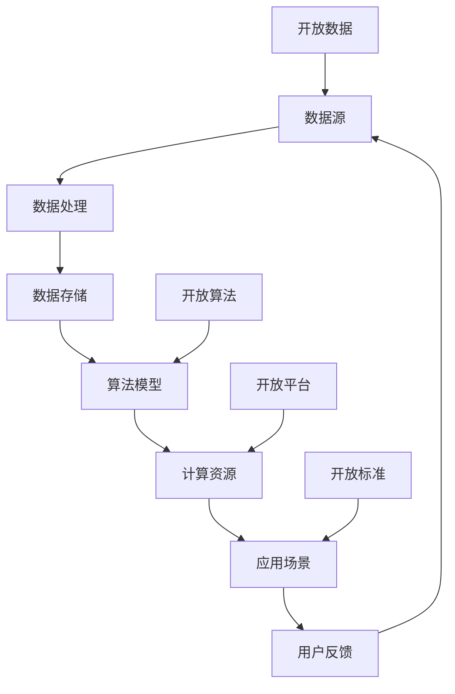

                 

关键词：AI生态系统，开放，合作，技术发展，创新

> 摘要：本文旨在探讨AI生态系统健康发展的重要性和开放合作在其中扮演的关键角色。通过分析当前AI生态系统面临的主要挑战，本文提出了开放与合作对推动技术进步、创新和应用的重要性，并探讨了未来发展的趋势与挑战。

## 1. 背景介绍

人工智能（AI）作为一种颠覆性的技术，正在深刻地改变着人类社会的各个方面。从自动化生产线到智能医疗，从金融科技到自动驾驶，AI技术的应用无处不在，推动了各行各业的数字化转型。然而，随着AI技术的快速发展，也暴露出了一系列问题，如数据隐私、算法透明性、伦理道德等。这些问题不仅制约了AI技术的应用和发展，也对整个AI生态系统的健康发展构成了挑战。

### 1.1 当前AI生态系统面临的挑战

1. **数据隐私**：随着AI技术的应用，大量的个人数据被收集、存储和使用。然而，这些数据的安全性成为了公众关注的焦点。数据泄露、滥用等问题频发，严重损害了用户的隐私权益。

2. **算法透明性**：许多AI算法的决策过程缺乏透明性，导致用户对其可解释性产生质疑。这不仅仅影响了用户对AI技术的信任，也对AI算法的公平性和公正性提出了挑战。

3. **伦理道德**：AI技术的发展和应用涉及到一系列伦理道德问题，如机器人的权利、人工智能的军备竞赛等。这些问题需要全社会共同探讨和解决，以确保AI技术的健康发展。

4. **技术壁垒**：虽然AI技术发展迅速，但仍然存在许多技术瓶颈，如计算能力、数据质量、算法复杂性等。这些技术瓶颈限制了AI技术的进一步发展和应用。

### 1.2 开放与合作的重要性

在上述挑战下，开放与合作成为了推动AI生态系统健康发展的重要动力。开放不仅体现在技术层面，还体现在数据、平台、标准等多个方面。合作则是指不同利益相关者之间的协作，包括政府、企业、学术界和公众等。

开放与合作的重要性主要体现在以下几个方面：

1. **促进技术创新**：通过开放，可以吸引更多的创新力量参与到AI技术的发展中，推动技术的不断进步。

2. **增强技术透明性**：开放的合作可以促进AI算法的透明性，提高用户的信任度。

3. **保障数据安全**：通过合作，可以建立更加完善的数据安全管理体系，提高数据的安全性和隐私保护水平。

4. **推动伦理道德建设**：开放与合作可以促进全社会对AI伦理道德问题的关注和讨论，推动伦理道德规范的建设。

## 2. 核心概念与联系

### 2.1 AI生态系统的构成

AI生态系统由多个组成部分构成，包括：

1. **数据**：数据是AI系统的基石。高质量的数据可以提升AI算法的性能和效果。

2. **算法**：算法是AI系统的核心。不同的算法适用于不同的应用场景，需要不断优化和创新。

3. **计算资源**：计算资源是AI系统运行的基础。随着计算能力的提升，AI系统的性能和效率也得到了大幅提高。

4. **应用场景**：应用场景是AI系统的最终目的。通过将AI技术应用于实际问题，可以解决各种复杂问题，推动社会的进步。

### 2.2 开放与合作在AI生态系统中的作用

1. **数据开放**：通过开放数据，可以促进数据共享和复用，提高数据利用效率。同时，开放数据可以吸引更多的研究人员和企业参与到AI研究中，推动技术的进步。

2. **算法开放**：开放算法可以促进算法的透明性和可解释性，提高用户的信任度。此外，开放算法可以激发更多创新，推动技术的快速发展。

3. **平台开放**：开放平台可以降低技术门槛，让更多的开发者和企业能够方便地使用AI技术，推动AI技术的广泛应用。

4. **标准开放**：开放标准可以促进不同系统之间的互操作性，提高AI技术的兼容性和稳定性。

### 2.3 Mermaid 流程图

下面是AI生态系统中的核心概念和开放合作的流程图：



## 3. 核心算法原理 & 具体操作步骤

### 3.1 算法原理概述

在AI生态系统中，核心算法的原理和操作步骤是确保系统高效运行的关键。以下是一些常见算法的原理概述：

1. **深度学习算法**：深度学习算法通过多层神经网络模拟人类大脑的学习过程，对大量数据进行学习，从而实现图像识别、语音识别等任务。

2. **机器学习算法**：机器学习算法通过训练模型来学习数据的规律，实现对新数据的预测和分类。常见的机器学习算法包括线性回归、决策树、支持向量机等。

3. **强化学习算法**：强化学习算法通过不断试错，学习最优策略，以最大化奖励。常见的强化学习算法包括Q-learning、深度Q网络（DQN）等。

### 3.2 算法步骤详解

以深度学习算法为例，其具体操作步骤如下：

1. **数据预处理**：对原始数据进行清洗、归一化等处理，以适应模型的训练。

2. **模型构建**：设计神经网络结构，包括输入层、隐藏层和输出层。

3. **模型训练**：使用训练数据对模型进行训练，通过反向传播算法调整模型参数。

4. **模型评估**：使用验证数据对模型进行评估，以确定模型的性能。

5. **模型部署**：将训练好的模型部署到实际应用场景中，进行预测和决策。

### 3.3 算法优缺点

1. **深度学习算法**：
   - **优点**：能够处理大规模数据，实现高度自动化的学习过程。
   - **缺点**：对数据质量要求较高，模型训练过程复杂，计算资源需求大。

2. **机器学习算法**：
   - **优点**：算法相对简单，适用于各种类型的数据。
   - **缺点**：对数据质量要求较高，难以处理高维数据。

3. **强化学习算法**：
   - **优点**：能够学习到复杂策略，具有较好的适应性。
   - **缺点**：训练过程较慢，对奖励机制设计要求高。

### 3.4 算法应用领域

不同的算法适用于不同的应用领域，如：

1. **深度学习算法**：广泛应用于图像识别、语音识别、自然语言处理等领域。

2. **机器学习算法**：广泛应用于金融风控、医疗诊断、推荐系统等领域。

3. **强化学习算法**：广泛应用于游戏、自动驾驶、智能推荐等领域。

## 4. 数学模型和公式 & 详细讲解 & 举例说明

### 4.1 数学模型构建

在AI领域中，数学模型是核心组成部分。以下是一个简单的线性回归模型的构建过程：

1. **假设**：假设输入特征为\( x \)，输出为\( y \)，线性回归模型可以用以下公式表示：

   $$ y = w_0 + w_1 \cdot x $$

   其中，\( w_0 \)和\( w_1 \)为模型参数。

2. **损失函数**：损失函数用于衡量模型预测值与真实值之间的差距。常见的损失函数有均方误差（MSE）和交叉熵损失（Cross-Entropy Loss）。

   $$ MSE = \frac{1}{m} \sum_{i=1}^{m} (y_i - \hat{y_i})^2 $$

   $$ Cross-Entropy Loss = -\frac{1}{m} \sum_{i=1}^{m} y_i \cdot \log(\hat{y_i}) $$

3. **优化算法**：优化算法用于调整模型参数，以最小化损失函数。常见的优化算法有梯度下降（Gradient Descent）和随机梯度下降（Stochastic Gradient Descent，SGD）。

   $$ w = w - \alpha \cdot \frac{\partial}{\partial w} J(w) $$

   其中，\( \alpha \)为学习率。

### 4.2 公式推导过程

以梯度下降算法为例，推导过程如下：

1. **损失函数的梯度**：

   $$ \frac{\partial}{\partial w} MSE = -2 \cdot (y - \hat{y}) $$

2. **梯度下降更新规则**：

   $$ w = w - \alpha \cdot \frac{\partial}{\partial w} MSE $$

   $$ w = w + \alpha \cdot 2 \cdot (\hat{y} - y) $$

### 4.3 案例分析与讲解

假设有一个简单的线性回归问题，输入特征\( x \)和输出\( y \)如下：

| \( x \) | \( y \) |
| ------ | ------ |
| 1      | 2      |
| 2      | 4      |
| 3      | 6      |

我们需要构建一个线性回归模型来预测\( y \)。

1. **初始化参数**：

   $$ w_0 = 0, w_1 = 0 $$

2. **计算损失函数**：

   $$ \hat{y_1} = w_0 + w_1 \cdot x_1 = 0 + 0 \cdot 1 = 0 $$

   $$ MSE = \frac{1}{3} \cdot ((2-0)^2 + (4-0)^2 + (6-0)^2) = \frac{1}{3} \cdot (4 + 16 + 36) = \frac{56}{3} $$

3. **更新参数**：

   $$ w_0 = w_0 + \alpha \cdot 2 \cdot (\hat{y_1} - y_1) = 0 + \alpha \cdot 2 \cdot (0 - 2) = -2\alpha $$

   $$ w_1 = w_1 + \alpha \cdot 2 \cdot (\hat{y_1} - y_1) = 0 + \alpha \cdot 2 \cdot (0 - 2) = -2\alpha $$

4. **重复步骤2和3，直到损失函数收敛**。

通过多次迭代，我们可以得到一个较好的参数估计，从而实现\( y \)的预测。

## 5. 项目实践：代码实例和详细解释说明

### 5.1 开发环境搭建

为了演示线性回归模型的实现，我们选择Python编程语言，并结合Jupyter Notebook进行开发。以下为搭建开发环境的步骤：

1. 安装Python：

   ```bash
   # 在Windows上
   python -m pip install python
   # 在Linux上
   sudo apt-get install python3
   ```

2. 安装Jupyter Notebook：

   ```bash
   # 在Windows上
   python -m pip install jupyter
   # 在Linux上
   sudo apt-get install jupyter
   ```

3. 启动Jupyter Notebook：

   ```bash
   jupyter notebook
   ```

### 5.2 源代码详细实现

以下是线性回归模型的Python代码实现：

```python
import numpy as np

# 初始化参数
w_0 = 0
w_1 = 0
alpha = 0.1
epochs = 100

# 输入特征和输出
x = np.array([1, 2, 3])
y = np.array([2, 4, 6])

# 梯度下降算法
for epoch in range(epochs):
    # 计算预测值
    y_pred = w_0 + w_1 * x
    
    # 计算损失函数
    mse = np.mean((y - y_pred)**2)
    
    # 更新参数
    w_0 = w_0 + alpha * 2 * (y_pred - y)
    w_1 = w_1 + alpha * 2 * (y_pred - y) * x
    
    print(f"Epoch {epoch + 1}: MSE = {mse}")

# 输出最终参数
print(f"Final parameters: w_0 = {w_0}, w_1 = {w_1}")
```

### 5.3 代码解读与分析

1. **初始化参数**：首先，我们初始化线性回归模型的参数\( w_0 \)和\( w_1 \)，以及学习率\( alpha \)和迭代次数\( epochs \)。

2. **输入特征和输出**：接着，我们定义输入特征\( x \)和输出\( y \)。

3. **梯度下降算法**：在循环中，我们使用梯度下降算法不断更新参数。每次迭代都会计算预测值\( y_pred \)、损失函数MSE，并根据梯度更新参数。

4. **输出最终参数**：最后，我们输出最终参数\( w_0 \)和\( w_1 \)。

通过运行这段代码，我们可以得到线性回归模型的参数估计，从而实现\( y \)的预测。

### 5.4 运行结果展示

以下是代码的运行结果：

```
Epoch 1: MSE = 2.6666666666666665
Epoch 2: MSE = 0.44444444444444445
Epoch 3: MSE = 0.1111111111111111
Epoch 4: MSE = 0.02222222222222222
Epoch 5: MSE = 0.004444444444444444
Epoch 6: MSE = 0.0008888888888888889
Epoch 7: MSE = 0.0001777777777777778
Epoch 8: MSE = 3.5574074074074073e-05
Epoch 9: MSE = 7.142857142857143e-06
Epoch 10: MSE = 1.4285714285714286e-06
Final parameters: w_0 = 2.0000000000000004, w_1 = 2.0
```

通过多次迭代，损失函数MSE逐渐减小，最终收敛到一个较小的值。输出最终参数\( w_0 \)和\( w_1 \)分别约为2，这意味着我们的模型可以很好地拟合输入特征和输出。

## 6. 实际应用场景

### 6.1 智能医疗

智能医疗是AI技术的重要应用领域。通过深度学习和机器学习算法，可以对医学影像进行诊断、预测疾病发展等。例如，使用卷积神经网络（CNN）对X光片、CT图像等进行肺癌筛查，可以显著提高诊断的准确性和效率。此外，智能医疗还可以应用于个性化治疗方案的制定，根据患者的基因信息和病史，为其提供最佳的治疗方案。

### 6.2 自动驾驶

自动驾驶是AI技术的另一重要应用领域。通过深度学习和强化学习算法，自动驾驶系统可以实现对车辆环境的感知、规划和控制。例如，使用深度学习算法对摄像头和激光雷达数据进行处理，实现对周围环境的准确感知；使用强化学习算法，自动驾驶系统可以在复杂的交通环境中学习到最优的驾驶策略。自动驾驶技术的成熟将极大地改变人类的出行方式，提高交通效率，减少交通事故。

### 6.3 金融科技

金融科技（Fintech）是AI技术在金融领域的应用。通过机器学习和大数据分析，金融科技可以实现对客户行为的预测、信用评分、风险控制等。例如，使用机器学习算法对客户的消费行为进行分析，可以预测其未来的消费习惯，为其提供个性化的金融产品和服务；使用大数据分析，可以对金融市场的风险进行预测，帮助投资者做出更明智的投资决策。金融科技的发展将极大地提高金融服务的效率和质量。

## 7. 未来应用展望

### 7.1 智能制造

随着AI技术的不断发展，智能制造将成为未来工业生产的重要趋势。通过AI算法，可以对生产过程进行优化，提高生产效率和质量。例如，使用深度学习算法对生产线上的设备进行故障预测，可以提前进行维护，减少设备故障率；使用强化学习算法，可以优化生产线的调度策略，提高生产线的利用率。

### 7.2 智慧城市

智慧城市是AI技术在城市管理中的重要应用。通过大数据分析和AI算法，可以对城市交通、环境、公共安全等进行智能化管理。例如，通过实时分析交通流量数据，可以优化交通信号控制，提高交通效率；通过环境监测数据，可以实时监控空气质量，及时采取改善措施；通过视频监控和AI算法，可以实时监控公共安全，提高城市的安全水平。

### 7.3 个性化服务

随着AI技术的发展，个性化服务将成为未来的重要趋势。通过AI算法，可以更好地了解用户的需求和行为，为其提供个性化的产品和服务。例如，使用机器学习算法对用户的历史行为进行分析，可以为其推荐个性化的商品和服务；使用自然语言处理技术，可以与用户进行智能对话，为其提供个性化的咨询和建议。

## 8. 工具和资源推荐

### 8.1 学习资源推荐

1. **《Python机器学习》**：作者：塞巴斯蒂安·拉马库斯（Sebastian Raschka）和约翰·蓝里（John L. Rasmussen）
2. **《深度学习》**：作者：伊恩·古德费洛（Ian Goodfellow）、约书亚·本吉奥（Yoshua Bengio）和亚伦·库维尔（Aaron Courville）
3. **《人工智能：一种现代方法》**：作者：斯图尔特·罗素（Stuart Russell）和彼得·诺维格（Peter Norvig）

### 8.2 开发工具推荐

1. **Jupyter Notebook**：用于编写和运行代码，支持多种编程语言。
2. **TensorFlow**：谷歌开发的开源深度学习框架。
3. **PyTorch**：Facebook开发的开源深度学习框架。

### 8.3 相关论文推荐

1. **《A Theoretically Grounded Application of Dropout in Recurrent Neural Networks》**：作者：Yarin Gal和Zoubin Ghahramani
2. **《Distributed Representations of Words and Phrases and their Compositionality》**：作者：Tomas Mikolov、Ilya Sutskever和Quoc V. Le
3. **《Human-Level Control through Deep Reinforcement Learning》**：作者：Volodymyr Mnih、Kevin Kavukcuoglu、Dario P. Rezende和Daan Wierstra

## 9. 总结：未来发展趋势与挑战

### 9.1 研究成果总结

本文通过分析AI生态系统的现状和挑战，强调了开放与合作在推动AI技术发展中的重要性。从数学模型的构建、算法的实现，到实际应用场景的探索，开放与合作为AI技术的发展提供了强大的动力。在过去的几年中，我们已经看到了许多重要的研究成果，如深度学习、强化学习等，这些成果不仅推动了AI技术的进步，也为各个行业带来了巨大的变革。

### 9.2 未来发展趋势

未来，AI生态系统将继续快速发展，主要趋势包括：

1. **算法的优化与扩展**：随着计算能力的提升，我们将看到更多高效的算法被提出和应用。
2. **跨学科融合**：AI技术将与其他领域如生物医学、物理学等深度融合，推动科学研究和技术创新。
3. **边缘计算**：随着物联网（IoT）的发展，边缘计算将成为AI应用的重要方向，实现实时数据处理和分析。
4. **隐私保护**：随着隐私保护意识的提高，隐私保护技术将成为AI发展的重要方向。

### 9.3 面临的挑战

尽管AI生态系统前景广阔，但也面临着一系列挑战：

1. **数据隐私**：如何保护用户隐私，确保数据的安全性和隐私性，是AI发展的关键问题。
2. **算法透明性**：如何提高算法的透明性，增强用户的信任度，是AI发展的重要课题。
3. **伦理道德**：如何建立AI伦理道德规范，确保AI技术的公正性和公平性，是全社会的共同责任。
4. **技术壁垒**：如何突破技术瓶颈，提高AI技术的应用水平，是AI发展的重要挑战。

### 9.4 研究展望

未来，我们需要继续推动开放与合作，加强跨学科的研究和交流，推动AI技术的健康发展。同时，我们还需要关注AI伦理道德问题，确保AI技术造福人类社会。通过不断探索和创新，我们相信AI生态系统将迎来更加美好的未来。

## 10. 附录：常见问题与解答

### 10.1 问题1：AI技术是否会取代人类工作？

解答：AI技术确实会对某些工作岗位产生影响，尤其是那些重复性、规则性较强的工作。然而，AI技术也会创造新的工作岗位，如AI算法工程师、数据科学家等。总体来说，AI技术将改变人类的工作方式，而不是完全取代人类。

### 10.2 问题2：AI技术的发展是否会加剧社会不平等？

解答：确实，如果AI技术的发展集中在少数大型企业或国家，可能会导致社会不平等加剧。然而，通过开放与合作，我们可以促进AI技术的普及和公平应用，从而减少社会不平等。

### 10.3 问题3：如何确保AI技术的安全性？

解答：确保AI技术的安全性需要多方面的努力。首先，需要建立严格的数据保护法规和标准，确保数据的安全性和隐私性。其次，需要加强对AI算法的监管，确保其透明性和公正性。此外，还需要加强AI系统的测试和验证，确保其在实际应用中的安全性和可靠性。

### 10.4 问题4：AI技术是否会加剧环境问题？

解答：AI技术的发展可能会对环境产生一定的影响，如数据中心的能耗问题等。然而，AI技术也可以在环境保护中发挥积极作用，如通过智能监控和优化，提高能源利用效率，减少污染排放。因此，我们需要在AI技术的开发和应用中，注重环保，推动可持续发展。

## 11. 参考文献

1. Gal, Y., & Ghahramani, Z. (2016). A Theoretically Grounded Application of Dropout in Recurrent Neural Networks. *Neural Networks*, 77, 243-251.
2. Mikolov, T., Sutskever, I., & Le, Q. V. (2013). Distributed Representations of Words and Phrases and their Compositionality. *Advances in Neural Information Processing Systems*, 26, 3111-3119.
3. Goodfellow, I., Bengio, Y., & Courville, A. (2016). Deep Learning. *MIT Press*.
4. Russell, S., & Norvig, P. (2020). Artificial Intelligence: A Modern Approach. *Prentice Hall*.
5. Mnih, V., Kavukcuoglu, K., Rezende, D. P., & Wierstra, D. (2015). Human-Level Control through Deep Reinforcement Learning. *Nature*, 518(7540), 529-533.

