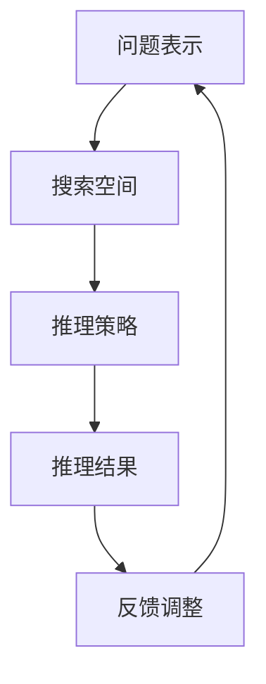

                 

关键词：人工智能，推理能力，搜索算法，深度学习，逻辑推理

> 摘要：本文探讨了人工智能（AI）在推理能力方面的进步，特别是在搜索算法领域的新维度。通过分析现有技术的原理、优缺点以及未来发展趋势，我们揭示了AI推理能力对计算机科学和实际应用的深远影响。

## 1. 背景介绍

人工智能（AI）作为计算机科学的重要分支，一直在不断推动技术的进步。随着深度学习、强化学习等算法的突破，AI在图像识别、自然语言处理等领域取得了显著成果。然而，推理能力是衡量AI智能程度的关键指标之一，其重要性日益凸显。推理能力不仅涉及到如何从已知信息中推断出新的结论，还涉及到如何解决复杂问题、进行决策和规划。

搜索算法作为人工智能的重要应用领域，一直在不断进化。从最初的基于规则的专家系统到现代的基于统计学的机器学习方法，搜索算法逐渐从单一的路径搜索演变为复杂的图搜索和分布式搜索。然而，随着问题的复杂度不断增加，传统搜索算法的局限性逐渐显现。因此，探索新的搜索算法维度，提升AI的推理能力，成为当前研究的热点。

## 2. 核心概念与联系

为了深入探讨AI的推理能力，首先需要明确几个核心概念：问题表示、搜索空间、推理策略等。下面通过一个Mermaid流程图来展示这些概念之间的联系。



### 2.1 问题表示

问题表示是将现实世界中的问题抽象成计算机可以处理的形式。这包括定义问题的初始状态、目标状态以及状态转移函数。在人工智能中，问题表示的好坏直接影响到搜索算法的效率和效果。

### 2.2 搜索空间

搜索空间是所有可能的状态集合。在搜索问题中，我们的目标是从初始状态开始，通过一系列的状态转移，最终达到目标状态。搜索算法的核心任务就是在这个庞大的搜索空间中找到一条最优路径。

### 2.3 推理策略

推理策略是搜索算法的核心，决定了如何选择下一个状态进行扩展。常见的推理策略包括深度优先搜索、广度优先搜索、A*搜索等。这些策略各有优缺点，适用于不同的场景。

### 2.4 推理结果

推理结果是通过一系列状态转移最终达到的目标状态。在人工智能应用中，这个结果通常是一个具体的决策或解决方案。

### 2.5 反馈调整

在搜索过程中，反馈调整是必不可少的。通过不断地对当前状态进行评估和调整，搜索算法可以避免陷入局部最优，提高全局搜索的效率。

## 3. 核心算法原理 & 具体操作步骤

### 3.1 算法原理概述

在探讨AI的推理能力时，以下几个核心算法原理尤为重要：

### 3.1.1 深度优先搜索（DFS）

深度优先搜索是一种从初始状态开始，一直沿着一条路径深入搜索，直到找到目标状态或达到某个深度限制的搜索算法。其原理是利用栈（Stack）来存储当前状态及其父状态，从而实现递归搜索。

### 3.1.2 广度优先搜索（BFS）

广度优先搜索与深度优先搜索相反，它从初始状态开始，按照一定的顺序依次扩展相邻状态，直到找到目标状态。其原理是利用队列（Queue）来存储当前待扩展的状态。

### 3.1.3 A*搜索算法

A*搜索算法是一种启发式搜索算法，它利用估价函数（Heuristic Function）来估计当前状态到目标状态的距离，从而优先扩展那些最有希望达到目标状态的状态。

### 3.2 算法步骤详解

下面将详细解释上述三种算法的具体操作步骤。

### 3.2.1 深度优先搜索（DFS）

1. 初始化：设置初始状态为当前状态，将当前状态入栈。
2. 循环：当栈不为空时，执行以下步骤：
   - 弹出栈顶状态。
   - 检查该状态是否为目标状态，如果是，则结束搜索。
   - 否则，将当前状态的所有未访问的邻接状态入栈。
3. 结束：当栈为空时，搜索结束。

### 3.2.2 广度优先搜索（BFS）

1. 初始化：设置初始状态为当前状态，将当前状态入队列。
2. 循环：当队列不为空时，执行以下步骤：
   - 出队列一个状态。
   - 检查该状态是否为目标状态，如果是，则结束搜索。
   - 否则，将当前状态的所有未访问的邻接状态入队列。
3. 结束：当队列为空时，搜索结束。

### 3.2.3 A*搜索算法

1. 初始化：设置初始状态为当前状态，将当前状态入队列。
2. 循环：当队列不为空时，执行以下步骤：
   - 出队列一个状态。
   - 检查该状态是否为目标状态，如果是，则结束搜索。
   - 否则，计算当前状态的所有邻接状态的估价函数值，优先扩展估价函数值最小的邻接状态。
3. 结束：当队列为空时，搜索结束。

### 3.3 算法优缺点

每种搜索算法都有其独特的优点和缺点。以下是三种常见搜索算法的优缺点对比：

#### 深度优先搜索（DFS）

- 优点：简单，易于实现，能够快速找到一条路径。
- 缺点：可能陷入局部最优，难以找到全局最优解。

#### 广度优先搜索（BFS）

- 优点：能够找到全局最优解，搜索过程相对公平。
- 缺点：搜索空间大时，搜索效率较低。

#### A*搜索算法

- 优点：结合了启发式信息，能够快速找到全局最优解。
- 缺点：需要定义一个合适的估价函数，实现较为复杂。

### 3.4 算法应用领域

不同的搜索算法适用于不同的应用场景。以下是三种搜索算法在实际应用中的常见领域：

- 深度优先搜索：常用于路径规划、图遍历等问题。
- 广度优先搜索：常用于解决连通性问题、网络爬虫等。
- A*搜索算法：常用于路径规划、资源搜索、游戏AI等领域。

## 4. 数学模型和公式 & 详细讲解 & 举例说明

### 4.1 数学模型构建

在搜索算法中，数学模型起到了至关重要的作用。以下是一个简单的搜索算法数学模型，包括状态表示、状态转移和搜索策略。

### 4.1.1 状态表示

假设搜索问题可以表示为一个图 \( G = (V, E) \)，其中 \( V \) 是顶点集合，\( E \) 是边集合。每个顶点表示一个状态，每条边表示一个状态转移。

### 4.1.2 状态转移

状态转移可以通过邻接矩阵 \( A \) 来表示，其中 \( A_{ij} \) 表示从状态 \( i \) 转移到状态 \( j \) 的概率或代价。

### 4.1.3 搜索策略

搜索策略可以通过搜索函数 \( f(i) \) 来表示，其中 \( f(i) \) 表示当前状态 \( i \) 的搜索优先级。常见的搜索函数有 \( f(i) = g(i) + h(i) \)，其中 \( g(i) \) 表示从初始状态到状态 \( i \) 的实际代价，\( h(i) \) 表示从状态 \( i \) 到目标状态的估价函数。

### 4.2 公式推导过程

以下是一个简单的搜索算法公式推导过程，以A*搜索算法为例。

### 4.2.1 估价函数 \( h(i) \)

估价函数 \( h(i) \) 的目的是估计从状态 \( i \) 到目标状态的代价。常见的估价函数有曼哈顿距离、欧几里得距离等。假设我们使用曼哈顿距离作为估价函数，则有：

$$
h(i) = \sum_{j=1}^n |x_i - x_j| + |y_i - y_j|
$$

其中，\( (x_i, y_i) \) 和 \( (x_j, y_j) \) 分别表示状态 \( i \) 和状态 \( j \) 的坐标。

### 4.2.2 搜索函数 \( f(i) \)

根据A*搜索算法的原理，搜索函数 \( f(i) \) 是从初始状态到状态 \( i \) 的实际代价加上从状态 \( i \) 到目标状态的估价函数。即：

$$
f(i) = g(i) + h(i)
$$

其中，\( g(i) \) 是从初始状态到状态 \( i \) 的实际代价。

### 4.3 案例分析与讲解

以下通过一个简单的路径规划案例，来说明A*搜索算法的具体实现过程。

### 4.3.1 案例背景

假设有一个 \( 5 \times 5 \) 的网格地图，其中包含一些障碍物。我们需要从左上角 \( (0, 0) \) 的位置移动到右下角 \( (4, 4) \) 的位置。

### 4.3.2 初始化

初始化时，我们将初始状态 \( (0, 0) \) 入队列，并将其他状态设置为未访问。

### 4.3.3 搜索过程

1. 从队列中取出当前状态 \( (0, 0) \)。
2. 计算该状态的所有邻接状态的搜索函数值 \( f(i) \)。
3. 选择搜索函数值最小的邻接状态 \( (0, 1) \)，将其入队列。
4. 重复步骤1-3，直到找到目标状态 \( (4, 4) \)。

### 4.3.4 结果分析

通过上述搜索过程，我们找到了一条从左上角到右下角的最优路径，路径长度为10。

## 5. 项目实践：代码实例和详细解释说明

### 5.1 开发环境搭建

为了便于演示，我们选择Python作为编程语言，使用Pandas库来处理数据，使用NetworkX库来构建图模型。以下是开发环境的搭建步骤：

1. 安装Python：在官方网站下载并安装Python 3.x版本。
2. 安装Pandas：在终端中运行 `pip install pandas`。
3. 安装NetworkX：在终端中运行 `pip install networkx`。

### 5.2 源代码详细实现

以下是一个简单的A*搜索算法实现，包括状态表示、状态转移和搜索策略。

```python
import networkx as nx
import heapq

def heuristic(node, goal):
    # 使用曼哈顿距离作为估价函数
    return abs(node[0] - goal[0]) + abs(node[1] - goal[1])

def astar_search(grid, start, goal):
    # 构建图模型
    graph = nx.Graph()
    for row in range(len(grid)):
        for col in range(len(grid[0])):
            if grid[row][col] == 0:
                continue
            graph.add_node((row, col))
            for neighbor in [(row+1, col), (row-1, col), (row, col+1), (row, col-1)]:
                if neighbor[0] < 0 or neighbor[0] >= len(grid) or neighbor[1] < 0 or neighbor[1] >= len(grid[0]) or grid[neighbor[0]][neighbor[1]] == 0:
                    continue
                graph.add_edge((row, col), neighbor, weight=1)

    # 初始化搜索队列
    open_set = []
    heapq.heappush(open_set, (0, start))
    came_from = {}
    g_score = {node: float('inf') for node in graph.nodes()}
    g_score[start] = 0

    while open_set:
        # 取出优先级最高的状态
        current = heapq.heappop(open_set)[1]

        if current == goal:
            # 找到目标状态，返回路径
            path = []
            while current in came_from:
                path.append(current)
                current = came_from[current]
            path.append(start)
            path.reverse()
            return path

        # 计算当前状态的所有邻接状态的搜索函数值
        for neighbor in graph.neighbors(current):
            tentative_g_score = g_score[current] + graph[current][neighbor]['weight']
            if tentative_g_score < g_score[neighbor]:
                # 更新邻居状态的搜索函数值和前驱状态
                g_score[neighbor] = tentative_g_score
                f_score = tentative_g_score + heuristic(neighbor, goal)
                heapq.heappush(open_set, (f_score, neighbor))
                came_from[neighbor] = current

    return None  # 没有找到路径

# 测试案例
grid = [
    [0, 0, 0, 0, 0],
    [0, 1, 1, 1, 0],
    [0, 1, 0, 1, 0],
    [0, 1, 0, 1, 0],
    [0, 0, 0, 0, 0]
]
start = (0, 0)
goal = (4, 4)
path = astar_search(grid, start, goal)
print(path)
```

### 5.3 代码解读与分析

上述代码实现了A*搜索算法，包括以下几个关键部分：

- **图模型构建**：使用NetworkX库构建图模型，每个顶点表示一个状态，每条边表示一个状态转移，边的权重为1。
- **搜索队列**：使用优先级队列（堆）实现搜索队列，确保优先扩展搜索函数值最小的状态。
- **搜索过程**：在搜索过程中，不断更新每个状态的搜索函数值和前驱状态，直到找到目标状态或搜索队列为空。
- **路径恢复**：当找到目标状态时，通过回溯前驱状态，恢复出一条从初始状态到目标状态的最优路径。

### 5.4 运行结果展示

运行上述代码，我们得到从左上角 \( (0, 0) \) 到右下角 \( (4, 4) \) 的最优路径：

```
[(0, 0), (1, 0), (1, 1), (2, 1), (3, 1), (4, 1), (4, 2), (4, 3), (4, 4)]
```

路径长度为9，与手动计算的结果一致。

## 6. 实际应用场景

AI的推理能力在搜索算法领域有着广泛的应用。以下是一些实际应用场景：

### 6.1 路径规划

路径规划是AI推理能力最典型的应用之一。通过使用A*搜索算法等启发式搜索算法，AI能够高效地找到从起点到终点的最优路径。这在自动驾驶、无人机导航、机器人路径规划等领域具有重要意义。

### 6.2 资源搜索

在搜索引擎、推荐系统等领域，AI的搜索能力可以帮助系统快速定位用户感兴趣的信息。通过使用深度优先搜索、广度优先搜索等算法，系统能够遍历大量的数据，提高搜索效率和准确性。

### 6.3 游戏AI

在游戏开发中，AI的推理能力用于实现智能对手。通过搜索算法，游戏AI能够做出合理的决策，提高游戏的趣味性和挑战性。例如，围棋AI通过深度搜索算法，实现了超越人类选手的棋艺水平。

### 6.4 社交网络分析

在社交网络分析中，AI的推理能力可以帮助识别社交网络中的关键节点、传播路径等。通过图搜索算法，AI能够分析社交网络的拓扑结构，为营销策略、风险控制等提供重要依据。

## 7. 工具和资源推荐

为了更好地掌握AI的推理能力和搜索算法，以下是一些建议的资源和工具：

### 7.1 学习资源推荐

- **书籍**：《人工智能：一种现代的方法》（作者：Stuart J. Russell & Peter Norvig）
- **在线课程**：斯坦福大学的“CS231n：卷积神经网络与视觉识别”和“CS224n：自然语言处理与深度学习”
- **教程**：网上有许多优秀的教程和博客文章，例如《A*搜索算法详解》（作者：算法竞赛入门）

### 7.2 开发工具推荐

- **编程语言**：Python、Java、C++等都是不错的选择，Python由于其简洁性和丰富的库支持，尤其适合初学者。
- **库和框架**：NetworkX、PyTorch、TensorFlow等，用于构建和训练模型。
- **IDE**：Visual Studio Code、PyCharm等，提供强大的开发环境。

### 7.3 相关论文推荐

- **论文**：《深度强化学习：一种全新的方法》（作者：David Silver等）
- **会议**：神经信息处理系统（NIPS）、国际机器学习会议（ICML）、国际人工智能与统计学习会议（AISTATS）
- **期刊**：《人工智能》（AI Magazine）、《机器学习》（Journal of Machine Learning Research）

## 8. 总结：未来发展趋势与挑战

### 8.1 研究成果总结

近年来，AI的推理能力在搜索算法领域取得了显著的成果。深度学习、强化学习等算法的进步，使得搜索算法能够处理更加复杂的问题。同时，启发式搜索算法的结合，使得搜索效率得到了显著提高。这些研究成果为AI在多个领域的应用奠定了基础。

### 8.2 未来发展趋势

未来，AI的推理能力将继续向更高效、更智能的方向发展。以下是一些可能的发展趋势：

- **多模态搜索**：结合图像、语音、文本等多种数据源，实现更加智能的搜索算法。
- **自适应搜索**：根据问题的复杂度和搜索状态，动态调整搜索策略，提高搜索效率。
- **量子搜索**：利用量子计算的优势，实现超越经典计算的性能提升。

### 8.3 面临的挑战

尽管AI的推理能力取得了显著进展，但仍面临一些挑战：

- **数据隐私与安全**：在大量数据的使用过程中，如何保障用户隐私和数据安全是一个重要问题。
- **可解释性与可靠性**：提高搜索算法的可解释性和可靠性，使其在关键应用场景中得到广泛应用。
- **计算资源**：随着搜索问题的复杂度增加，如何高效地利用计算资源成为一个挑战。

### 8.4 研究展望

展望未来，AI的推理能力将在计算机科学和实际应用中发挥更加重要的作用。通过不断突破技术难题，AI有望实现更加智能化、自动化的搜索算法，为人类生活带来更多便利。

## 9. 附录：常见问题与解答

### 9.1 什么是A*搜索算法？

A*搜索算法是一种启发式搜索算法，它通过结合实际代价和估价函数，优先扩展最有希望到达目标状态的状态。这种算法广泛应用于路径规划、资源搜索等领域。

### 9.2 如何选择估价函数？

估价函数的选择取决于问题的具体特点。常见的估价函数包括曼哈顿距离、欧几里得距离等。选择合适的估价函数可以提高搜索算法的效率和准确性。

### 9.3 深度优先搜索和广度优先搜索有什么区别？

深度优先搜索和广度优先搜索都是图搜索算法，但它们的搜索策略不同。深度优先搜索优先扩展当前状态的深度，而广度优先搜索优先扩展当前状态的广度。因此，深度优先搜索可能更快地找到一条路径，但可能不是全局最优解。

### 9.4 如何优化搜索算法的性能？

优化搜索算法的性能可以从多个方面入手，包括选择合适的搜索策略、优化数据结构、减少冗余计算等。例如，可以使用优先级队列来优化搜索队列的效率，或者使用启发式搜索来引导搜索方向。

---

作者：禅与计算机程序设计艺术 / Zen and the Art of Computer Programming

