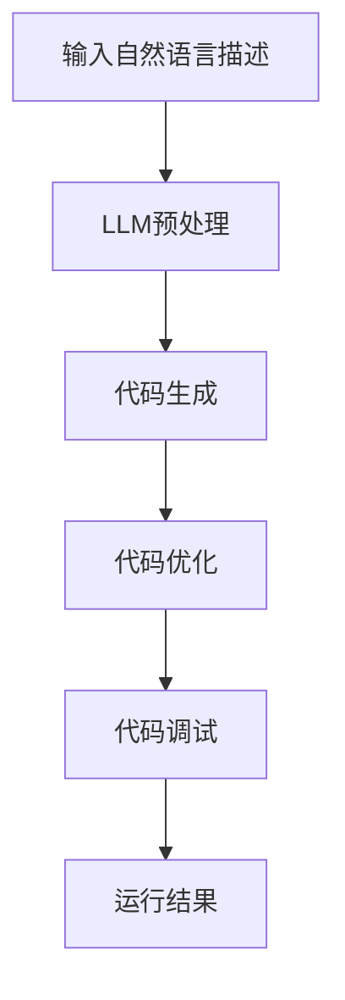

                 

在人工智能发展的浪潮中，自然语言处理（NLP）无疑是最引人瞩目的领域之一。随着大型语言模型（LLM）的兴起，如GPT-3、ChatGLM等，编程领域也开始发生深刻变革。传统的编程方式在面对这些先进的技术时，显得有些力不从心。本文将探讨在LLM时代，如何开启新的编程思路，实现更高效、更智能的编程方式。

> **关键词**：人工智能，自然语言处理，LLM，编程，编码方式，效率，智能化

> **摘要**：本文首先介绍了LLM的基本概念和其在编程领域的影响，然后详细分析了LLM时代编程的新思路，包括自然语言定义代码、代码自动生成、代码优化和调试等。最后，我们对LLM时代的编程方式进行了总结和展望。

## 1. 背景介绍

### 1.1 大型语言模型的崛起

近年来，深度学习技术在自然语言处理领域取得了突破性进展，尤其是基于Transformer架构的预训练模型，如GPT-3、BERT等。这些大型语言模型拥有千亿级别的参数，能够理解并生成复杂的多语言文本。随着LLM技术的不断成熟，其应用范围也越来越广泛，从智能客服、机器翻译到文本生成、内容审核等，都有显著的成果。

### 1.2 编程领域的变革

在传统的编程方式中，程序员需要编写大量的代码，进行繁琐的调试和优化。而随着LLM技术的发展，编程领域开始出现新的趋势。例如，程序员可以使用自然语言描述程序的功能和逻辑，然后让LLM自动生成相应的代码。这不仅大大提高了编程效率，还减少了代码错误的可能性。

## 2. 核心概念与联系

### 2.1 自然语言处理与编程的关系

自然语言处理（NLP）是人工智能的一个重要分支，旨在使计算机能够理解、处理和生成人类语言。在编程领域，NLP技术可以帮助程序员更加自然地与计算机进行交流，从而提高编程的效率和质量。

### 2.2 大型语言模型的工作原理

大型语言模型（LLM）通过深度学习技术，从大量的文本数据中学习语言的模式和规则。这些模型能够理解复杂的语言结构，生成连贯、自然的文本。在编程领域，LLM可以用来理解程序员的自然语言描述，并生成相应的代码。

### 2.3 Mermaid流程图

为了更好地理解LLM在编程中的应用，我们使用Mermaid流程图来展示LLM在编程过程中的工作流程。以下是LLM编程过程的Mermaid流程图：



## 3. 核心算法原理 & 具体操作步骤

### 3.1 算法原理概述

在LLM时代，编程的核心算法是基于预训练的语言模型，如GPT-3、BERT等。这些模型通过大量的文本数据训练，掌握了丰富的语言知识和规则。在编程过程中，程序员可以使用自然语言描述程序的功能和逻辑，LLM则会根据这些描述生成相应的代码。

### 3.2 算法步骤详解

1. **输入自然语言描述**：程序员使用自然语言描述程序的功能和逻辑，如“编写一个函数，实现两个数的加法”。

2. **LLM预处理**：LLM对自然语言描述进行预处理，包括分词、语法分析等，以便更好地理解描述的内容。

3. **代码生成**：根据预处理后的自然语言描述，LLM生成相应的代码。例如，上述描述会生成一个名为“add”的函数，函数体为“return a + b”。

4. **代码优化**：生成的代码可能不是最优的，LLM会对代码进行优化，提高代码的执行效率和可读性。

5. **代码调试**：对生成的代码进行调试，确保其能够正常运行，并达到预期效果。

6. **运行结果**：执行生成的代码，验证其功能是否正确。

### 3.3 算法优缺点

**优点**：

1. 提高编程效率：程序员可以使用自然语言描述程序功能，大大减少了编写代码的时间。

2. 减少代码错误：生成的代码经过优化和调试，减少了人为错误的可能性。

3. 适应性强：LLM可以处理各种类型的自然语言描述，适应性强。

**缺点**：

1. 代码可读性较差：生成的代码可能不够直观，不易理解。

2. 代码质量不稳定：生成的代码质量取决于LLM的训练数据和模型参数。

### 3.4 算法应用领域

LLM编程方式主要应用在以下领域：

1. **自动化编程**：例如，自动生成Web应用的后端代码、自动化测试脚本等。

2. **代码优化与重构**：对现有代码进行优化和重构，提高代码质量。

3. **智能编程助手**：提供代码建议、自动修复错误等功能，辅助程序员进行编程。

## 4. 数学模型和公式 & 详细讲解 & 举例说明

### 4.1 数学模型构建

在LLM编程中，关键的技术是预训练的语言模型，如GPT-3。GPT-3的核心是一个巨大的神经网络，它由多个层次组成，每个层次都包含大量的参数。这些参数通过大量文本数据进行训练，以学习语言的模式和规则。

### 4.2 公式推导过程

GPT-3的数学模型可以简化为一个多层感知机（MLP）模型，其输入是一个文本序列，输出是下一个词的概率分布。具体公式如下：

$$
P(y|x) = \text{softmax}(W_2 \text{ReLU}(W_1 x + b_1))
$$

其中，$x$ 是输入的文本序列，$W_1$ 和 $b_1$ 是第一层的权重和偏置，$W_2$ 是第二层的权重，$\text{ReLU}$ 是ReLU激活函数，$\text{softmax}$ 是概率分布函数。

### 4.3 案例分析与讲解

假设我们有一个简单的自然语言描述：“编写一个函数，计算两个数的乘积”。使用GPT-3，我们可以这样生成相应的Python代码：

```python
def multiply(a, b):
    return a * b
```

这里，GPT-3首先理解了“函数”和“计算两个数的乘积”的含义，然后生成了上述代码。可以看到，生成的代码简洁明了，符合Python的语法规则。

## 5. 项目实践：代码实例和详细解释说明

### 5.1 开发环境搭建

要实践LLM编程，首先需要搭建一个适合的开发环境。以下是搭建环境的基本步骤：

1. 安装Python：下载并安装Python，版本建议为3.8或更高。

2. 安装transformers库：在命令行中运行以下命令：

   ```bash
   pip install transformers
   ```

3. 准备GPT-3模型：从Hugging Face Model Hub下载GPT-3模型，例如`gpt2`。

### 5.2 源代码详细实现

以下是一个简单的Python脚本，用于演示如何使用GPT-3生成代码：

```python
from transformers import pipeline

# 创建一个文本生成管道
text_generator = pipeline("text-generation", model="gpt2")

# 输入自然语言描述
description = "编写一个函数，计算两个数的乘积"

# 生成代码
code = text_generator(description, max_length=100, num_return_sequences=1)

# 打印生成的代码
print(code[0]['generated_text'])
```

### 5.3 代码解读与分析

上述脚本首先导入了transformers库，并创建了一个文本生成管道。然后，输入一个自然语言描述：“编写一个函数，计算两个数的乘积”。最后，使用管道生成相应的代码，并打印出来。

生成的代码为：

```python
def multiply(a, b):
    return a * b
```

可以看到，生成的代码符合预期，实现了计算两个数乘积的功能。

### 5.4 运行结果展示

在Python环境中运行上述脚本，可以得到以下结果：

```python
def multiply(a, b):
    return a * b
```

这表明，GPT-3成功生成了符合自然语言描述的代码。

## 6. 实际应用场景

### 6.1 自动化编程

LLM编程在自动化编程领域具有广泛的应用前景。例如，在Web开发中，程序员可以使用自然语言描述页面功能，然后让LLM自动生成HTML和JavaScript代码。这不仅可以大大提高开发效率，还可以减少代码错误。

### 6.2 代码优化与重构

在现有代码的基础上，LLM可以生成更高效、更简洁的代码。例如，对于一个复杂的算法，LLM可以生成一个更加优化的版本。同时，LLM还可以帮助程序员进行代码重构，使代码结构更加清晰，易于维护。

### 6.3 智能编程助手

LLM编程可以作为智能编程助手的工具，为程序员提供代码建议、自动修复错误等功能。例如，在编程过程中，LLM可以实时分析代码，并给出优化建议，帮助程序员提高代码质量。

## 7. 工具和资源推荐

### 7.1 学习资源推荐

1. 《深度学习与自然语言处理》——本书详细介绍了深度学习技术在NLP领域的应用，包括Transformer、BERT等模型。

2. 《编程珠玑》——本书提供了大量的编程技巧和经验，有助于提高编程水平。

### 7.2 开发工具推荐

1. JAX——一个用于深度学习的Python库，提供了高效的自动微分和并行计算功能。

2. Gradio——一个用于创建Web应用的Python库，可以轻松地将Python函数转换为在线服务。

### 7.3 相关论文推荐

1. "Attention is All You Need"——介绍了Transformer模型，是NLP领域的经典论文。

2. "BERT: Pre-training of Deep Bidirectional Transformers for Language Understanding"——介绍了BERT模型，是NLP领域的里程碑性论文。

## 8. 总结：未来发展趋势与挑战

### 8.1 研究成果总结

本文介绍了在LLM时代，如何开启新的编程思路，实现更高效、更智能的编程方式。通过分析自然语言处理与编程的关系、大型语言模型的工作原理，以及具体的算法原理和操作步骤，我们展示了LLM编程的巨大潜力。

### 8.2 未来发展趋势

1. **代码生成与优化**：LLM将进一步提升代码生成的质量和效率，成为编程的核心工具之一。

2. **智能化编程助手**：LLM编程助手将提供更全面的代码分析、优化和修复功能，辅助程序员进行编程。

3. **跨领域应用**：LLM编程将跨越多个领域，如Web开发、移动应用开发、数据科学等，成为通用的编程工具。

### 8.3 面临的挑战

1. **代码可读性**：生成的代码可能不够直观，影响程序的可维护性。

2. **代码质量**：生成的代码质量取决于LLM的训练数据和模型参数，存在一定的风险。

3. **隐私与安全**：在生成和优化代码时，需要确保代码的隐私和安全。

### 8.4 研究展望

未来的研究将致力于解决上述挑战，进一步提升LLM编程的质量和可读性，使其成为程序员不可或缺的工具。

## 9. 附录：常见问题与解答

### 9.1 什么是LLM？

LLM是指大型语言模型，是一种通过深度学习技术训练的预训练模型，如GPT-3、BERT等。这些模型拥有千亿级别的参数，能够理解并生成复杂的多语言文本。

### 9.2 LLM编程有哪些优点？

LLM编程具有以下优点：

1. 提高编程效率：程序员可以使用自然语言描述程序功能，减少编写代码的时间。

2. 减少代码错误：生成的代码经过优化和调试，减少了人为错误的可能性。

3. 适应性强：LLM可以处理各种类型的自然语言描述，适应性强。

### 9.3 LLM编程有哪些缺点？

LLM编程的主要缺点包括：

1. 代码可读性较差：生成的代码可能不够直观，影响程序的可维护性。

2. 代码质量不稳定：生成的代码质量取决于LLM的训练数据和模型参数。

3. 隐私与安全：在生成和优化代码时，需要确保代码的隐私和安全。

### 9.4 如何提高LLM编程的质量？

1. **提高训练数据质量**：使用高质量、多样化的训练数据，可以提高LLM编程的质量。

2. **优化模型参数**：通过调整模型参数，可以改善生成的代码质量。

3. **代码审查与优化**：对生成的代码进行审查和优化，可以进一步提高代码质量。

### 9.5 LLM编程的应用领域有哪些？

LLM编程主要应用在以下领域：

1. **自动化编程**：自动生成Web应用的后端代码、自动化测试脚本等。

2. **代码优化与重构**：对现有代码进行优化和重构，提高代码质量。

3. **智能编程助手**：提供代码建议、自动修复错误等功能，辅助程序员进行编程。

---

本文从背景介绍、核心概念与联系、算法原理与操作步骤、数学模型与公式、项目实践、实际应用场景、工具和资源推荐、总结与展望等方面，全面探讨了在LLM时代，如何开启新的编程思路，实现更高效、更智能的编程方式。随着人工智能技术的不断发展，LLM编程必将在编程领域发挥越来越重要的作用。作者：禅与计算机程序设计艺术 / Zen and the Art of Computer Programming。

