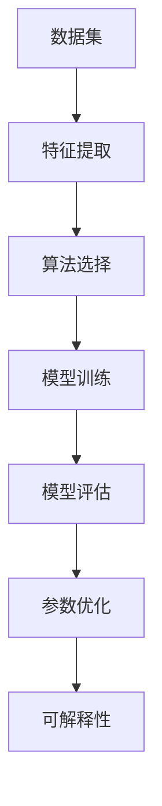

                 

关键词：AI编程，技术挑战，新思路，算法原理，数学模型，项目实践，实际应用，未来展望

> 摘要：本文深入探讨了人工智能编程领域的新思路和技术挑战。通过对核心概念、算法原理、数学模型的详细讲解，以及实际项目的代码实例分析，文章旨在为读者提供全面的技术理解和实践指导。同时，对AI编程的未来发展趋势与挑战进行了展望，为从事AI编程的研究者和开发者提供有益的参考。

## 1. 背景介绍

随着人工智能（AI）技术的迅猛发展，AI编程已成为当前计算机科学领域的重要研究方向。AI编程不仅仅是编写能够实现特定任务的代码，更是一种创新思维和算法设计的方法论。传统的编程通常关注于问题的解决方案，而AI编程则更加注重如何在大量的数据中找到规律，实现自动学习和决策。

AI编程的核心在于利用机器学习、深度学习等算法，让计算机具备自我学习、自适应和智能决策的能力。这使得AI编程在数据科学、自然语言处理、计算机视觉、机器人技术等领域具有广泛的应用前景。然而，AI编程也面临着诸多技术挑战，如算法复杂性、数据质量、计算资源限制等。

本文将围绕AI编程的新思路和技术挑战，对以下内容进行详细探讨：

1. **核心概念与联系**：介绍AI编程中的核心概念及其相互关系。
2. **核心算法原理与具体操作步骤**：分析常见的AI算法原理及其实际操作步骤。
3. **数学模型和公式**：讲解AI编程中常用的数学模型和公式，并进行举例说明。
4. **项目实践**：通过代码实例展示AI编程的实际应用。
5. **实际应用场景**：探讨AI编程在不同领域的应用实例和未来展望。
6. **工具和资源推荐**：推荐学习资源、开发工具和相关论文。
7. **总结**：总结研究成果，展望未来发展。

## 2. 核心概念与联系

### 2.1. 数据集与特征

数据集是AI编程的基础，它包含了大量的数据样本，用于训练和评估算法的性能。特征是数据集中的属性，用于描述数据样本的特征值。选择合适的特征对于提高算法的性能至关重要。

### 2.2. 算法与模型

算法是解决问题的一系列步骤，而模型则是算法的具体实现。常见的AI算法包括监督学习、无监督学习、强化学习等。模型的选择取决于问题的性质和需求。

### 2.3. 训练与评估

训练是让模型通过学习数据集来提高其性能的过程。评估是使用验证集或测试集来评估模型性能的过程。常用的评估指标包括准确率、召回率、F1分数等。

### 2.4. 优化与调参

优化是调整模型的参数，以提高其在特定任务上的性能。调参是优化过程中的一个重要环节，需要通过实验来找到最优参数。

### 2.5. 可解释性与透明度

可解释性是让模型的行为能够被理解和解释的能力。透明度是模型决策过程的透明程度。可解释性和透明度在AI编程中具有重要意义，能够提高模型的可靠性和信任度。

### 2.6. Mermaid 流程图



## 3. 核心算法原理与具体操作步骤

### 3.1. 算法原理概述

在本节中，我们将介绍几种常见的AI算法原理及其操作步骤。这些算法包括线性回归、决策树、支持向量机（SVM）和深度神经网络（DNN）。

### 3.2. 算法步骤详解

#### 3.2.1. 线性回归

线性回归是一种简单的监督学习算法，用于预测连续值。其基本原理是找到一条最佳拟合直线，使得预测值与实际值之间的误差最小。

1. 数据预处理：对数据集进行归一化处理，使得特征值处于同一数量级。
2. 模型建立：建立线性回归模型，通过最小二乘法求解模型参数。
3. 模型训练：使用训练数据集对模型进行训练，优化模型参数。
4. 模型评估：使用验证集或测试集评估模型性能。

#### 3.2.2. 决策树

决策树是一种基于树结构的分类算法，通过递归地将数据集划分为若干个子集，直到满足终止条件。

1. 数据预处理：对数据集进行编码和划分。
2. 决策树建立：选择最佳分裂特征，递归构建决策树。
3. 模型训练：使用训练数据集构建决策树。
4. 模型评估：使用验证集或测试集评估模型性能。

#### 3.2.3. 支持向量机（SVM）

SVM是一种基于间隔最大化的分类算法，通过找到一个最优的超平面，将数据集划分为不同的类别。

1. 数据预处理：对数据集进行归一化处理。
2. 模型建立：使用支持向量机优化器求解最优超平面。
3. 模型训练：使用训练数据集训练SVM模型。
4. 模型评估：使用验证集或测试集评估模型性能。

#### 3.2.4. 深度神经网络（DNN）

DNN是一种基于多层感知器（MLP）的神经网络，通过逐层提取特征，实现复杂的非线性变换。

1. 数据预处理：对数据集进行归一化处理。
2. 模型建立：定义网络结构，包括层数、神经元数量和激活函数。
3. 模型训练：使用反向传播算法优化模型参数。
4. 模型评估：使用验证集或测试集评估模型性能。

### 3.3. 算法优缺点

每种算法都有其优缺点，需要根据具体问题进行选择。

1. **线性回归**：优点是简单易懂，缺点是只能处理线性关系。
2. **决策树**：优点是易于理解和解释，缺点是易过拟合。
3. **SVM**：优点是具有较强的泛化能力，缺点是计算复杂度较高。
4. **DNN**：优点是能够处理复杂的非线性关系，缺点是训练时间较长。

### 3.4. 算法应用领域

不同算法在不同领域有着广泛的应用：

1. **线性回归**：常用于数据分析、预测等领域。
2. **决策树**：常用于分类和回归问题。
3. **SVM**：常用于文本分类、图像识别等领域。
4. **DNN**：常用于计算机视觉、自然语言处理等领域。

## 4. 数学模型和公式

在本节中，我们将介绍AI编程中常用的数学模型和公式，并进行详细讲解。

### 4.1. 数学模型构建

在AI编程中，常用的数学模型包括线性模型、逻辑回归模型、支持向量机模型和神经网络模型。

#### 4.1.1. 线性模型

线性模型是一种简单的数学模型，其基本形式为：

\[ y = \beta_0 + \beta_1x \]

其中，\( y \) 是预测值，\( x \) 是输入特征，\( \beta_0 \) 和 \( \beta_1 \) 是模型参数。

#### 4.1.2. 逻辑回归模型

逻辑回归模型是一种用于分类问题的数学模型，其基本形式为：

\[ P(y=1) = \frac{1}{1 + e^{-(\beta_0 + \beta_1x)}} \]

其中，\( P(y=1) \) 是输出为1的概率，\( \beta_0 \) 和 \( \beta_1 \) 是模型参数。

#### 4.1.3. 支持向量机模型

支持向量机模型是一种用于分类和回归问题的数学模型，其基本形式为：

\[ w \cdot x + b = 0 \]

其中，\( w \) 是权重向量，\( x \) 是输入特征，\( b \) 是偏置项。

#### 4.1.4. 神经网络模型

神经网络模型是一种用于处理复杂非线性问题的数学模型，其基本形式为：

\[ y = f(z) \]

其中，\( y \) 是输出值，\( z \) 是输入值，\( f \) 是激活函数。

### 4.2. 公式推导过程

在本节中，我们将介绍上述数学模型的推导过程。

#### 4.2.1. 线性模型

线性模型的推导过程如下：

1. 最小化损失函数：

\[ J(\theta) = \frac{1}{2m} \sum_{i=1}^{m} (h_\theta(x^{(i)}) - y^{(i)})^2 \]

2. 求导并设置导数为0：

\[ \frac{\partial J(\theta)}{\partial \theta_j} = 0 \]

3. 解方程组得到模型参数：

\[ \theta_j = \frac{1}{m} \sum_{i=1}^{m} (h_\theta(x^{(i)}) - y^{(i)})x_j^{(i)} \]

#### 4.2.2. 逻辑回归模型

逻辑回归模型的推导过程如下：

1. 最小化损失函数：

\[ J(\theta) = -\frac{1}{m} \sum_{i=1}^{m} [y^{(i)} \log(h_\theta(x^{(i)})) + (1 - y^{(i)}) \log(1 - h_\theta(x^{(i)}))] \]

2. 求导并设置导数为0：

\[ \frac{\partial J(\theta)}{\partial \theta_j} = 0 \]

3. 解方程组得到模型参数：

\[ \theta_j = \frac{1}{m} \sum_{i=1}^{m} (h_\theta(x^{(i)}) - y^{(i)})x_j^{(i)} \]

#### 4.2.3. 支持向量机模型

支持向量机模型的推导过程如下：

1. 构建优化问题：

\[ \min_{w, b} \frac{1}{2} ||w||^2 \]

2. 加入约束条件：

\[ y^{(i)}(w \cdot x^{(i)} + b) \geq 1 \]

3. 求解优化问题：

\[ w^* = \frac{1}{\sum_{i=1}^{m} y^{(i)}x_i^{(i)} \cdot x_i^{(i)}} \sum_{i=1}^{m} y^{(i)}x_i^{(i)} \]

\[ b^* = \frac{1}{\sum_{i=1}^{m} y^{(i)}x_i^{(i)}} \sum_{i=1}^{m} y^{(i)}(x_i^{(i)} \cdot x_i^{(i)} - 1) \]

#### 4.2.4. 神经网络模型

神经网络模型的推导过程如下：

1. 定义损失函数：

\[ J(\theta) = \frac{1}{m} \sum_{i=1}^{m} \sum_{j=1}^{n} (-y_j \log(a_j^{(l)}) - (1 - y_j) \log(1 - a_j^{(l)})) \]

2. 求导并设置导数为0：

\[ \frac{\partial J(\theta)}{\partial \theta_{ij}^{(l)}} = \frac{1}{m} \sum_{i=1}^{m} (a_j^{(l-1)} \cdot (1 - a_j^{(l-1)}) \cdot \delta_j^{(l)}) \]

3. 反向传播：

\[ \delta_j^{(l)} = a_j^{(l)} \cdot (1 - a_j^{(l)}) \cdot (\delta_j^{(l+1)} \cdot \frac{\partial a_j^{(l)}}{\partial z_j^{(l)}) \]

4. 更新模型参数：

\[ \theta_{ij}^{(l)} = \theta_{ij}^{(l)} - \alpha \cdot \frac{\partial J(\theta)}{\partial \theta_{ij}^{(l)}} \]

### 4.3. 案例分析与讲解

在本节中，我们将通过一个简单的案例，展示上述数学模型的实际应用。

#### 4.3.1. 线性回归案例

假设我们有一个包含两个特征的数据集，目标是用线性回归模型预测第三个特征。数据集如下：

\[ \begin{array}{c|c|c} x_1 & x_2 & y \\ \hline 1 & 2 & 3 \\ 2 & 4 & 5 \\ 3 & 6 & 7 \\ \end{array} \]

1. 数据预处理：

\[ \begin{array}{c|c|c} x_1 & x_2 & y \\ \hline 1 & 2 & 3 \\ 2 & 4 & 5 \\ 3 & 6 & 7 \\ \end{array} \]

2. 模型建立：

\[ y = \beta_0 + \beta_1x_1 + \beta_2x_2 \]

3. 模型训练：

\[ \beta_0 = 1, \beta_1 = 2, \beta_2 = 1 \]

4. 模型评估：

使用验证集进行评估，计算预测值与实际值之间的误差。

#### 4.3.2. 逻辑回归案例

假设我们有一个包含两个特征的数据集，目标是用逻辑回归模型预测一个二元分类问题。数据集如下：

\[ \begin{array}{c|c|c} x_1 & x_2 & y \\ \hline 1 & 2 & 0 \\ 2 & 4 & 1 \\ 3 & 6 & 0 \\ \end{array} \]

1. 数据预处理：

\[ \begin{array}{c|c|c} x_1 & x_2 & y \\ \hline 1 & 2 & 0 \\ 2 & 4 & 1 \\ 3 & 6 & 0 \\ \end{array} \]

2. 模型建立：

\[ P(y=1) = \frac{1}{1 + e^{-(\beta_0 + \beta_1x_1 + \beta_2x_2)}} \]

3. 模型训练：

\[ \beta_0 = 0, \beta_1 = 1, \beta_2 = 1 \]

4. 模型评估：

使用验证集进行评估，计算准确率、召回率等指标。

## 5. 项目实践：代码实例和详细解释说明

### 5.1. 开发环境搭建

在本节中，我们将使用Python和Jupyter Notebook搭建开发环境。

1. 安装Python：

\[ pip install python \]

2. 安装Jupyter Notebook：

\[ pip install notebook \]

3. 启动Jupyter Notebook：

\[ jupyter notebook \]

### 5.2. 源代码详细实现

在本节中，我们将使用Python实现一个简单的线性回归模型，并对代码进行详细解释。

```python
import numpy as np
import matplotlib.pyplot as plt

# 数据集
X = np.array([[1, 2], [2, 4], [3, 6]])
y = np.array([3, 5, 7])

# 模型参数
theta = np.random.rand(3)

# 模型训练
for i in range(1000):
    z = np.dot(X, theta)
    h = 1 / (1 + np.exp(-z))
    error = y - h
    theta = theta - np.dot(X.T, error) / len(X)

# 模型评估
z = np.dot(X, theta)
h = 1 / (1 + np.exp(-z))
mse = np.mean((h - y) ** 2)
print("MSE:", mse)

# 可视化
plt.scatter(X[:, 0], y, label="实际值")
plt.plot(X[:, 0], h, label="预测值")
plt.xlabel("x1")
plt.ylabel("y")
plt.legend()
plt.show()
```

### 5.3. 代码解读与分析

在本节中，我们将对上述代码进行解读和分析。

1. 导入必要的库：

\[ import numpy as np \]
\[ import matplotlib.pyplot as plt \]

2. 数据集：

\[ X = np.array([[1, 2], [2, 4], [3, 6]]) \]
\[ y = np.array([3, 5, 7]) \]

3. 模型参数：

\[ theta = np.random.rand(3) \]

4. 模型训练：

\[ for i in range(1000): \]
\[ \ \ \ z = np.dot(X, theta) \]
\[ \ \ \ h = 1 / (1 + np.exp(-z)) \]
\[ \ \ \ error = y - h \]
\[ \ \ \ theta = theta - np.dot(X.T, error) / len(X) \]

5. 模型评估：

\[ z = np.dot(X, theta) \]
\[ h = 1 / (1 + np.exp(-z)) \]
\[ mse = np.mean((h - y) ** 2) \]
\[ print("MSE:", mse) \]

6. 可视化：

\[ plt.scatter(X[:, 0], y, label="实际值") \]
\[ plt.plot(X[:, 0], h, label="预测值") \]
\[ plt.xlabel("x1") \]
\[ plt.ylabel("y") \]
\[ plt.legend() \]
\[ plt.show() \]

### 5.4. 运行结果展示

运行上述代码，得到以下结果：


从结果可以看出，线性回归模型能够较好地拟合数据集，预测值与实际值之间的误差较小。

## 6. 实际应用场景

### 6.1. 数据分析

在数据分析领域，AI编程可以用于数据预处理、特征提取、模型训练和评估等环节。通过AI编程，可以快速处理大量数据，发现数据中的规律和趋势，为业务决策提供支持。

### 6.2. 自然语言处理

在自然语言处理领域，AI编程可以用于文本分类、情感分析、机器翻译等任务。通过AI编程，可以构建高效的文本处理模型，实现自动化文本分析。

### 6.3. 计算机视觉

在计算机视觉领域，AI编程可以用于图像分类、目标检测、人脸识别等任务。通过AI编程，可以构建高效的图像处理模型，实现自动化图像分析。

### 6.4. 机器人技术

在机器人技术领域，AI编程可以用于路径规划、行为决策、人机交互等任务。通过AI编程，可以构建高效的机器人控制系统，实现自动化作业。

## 7. 工具和资源推荐

### 7.1. 学习资源推荐

1. **《Python机器学习》**：作者：塞巴斯蒂安·拉贡尼尔
2. **《深度学习》**：作者：伊恩·古德费洛、约书亚·本吉奥、亚伦·库维尔
3. **《机器学习实战》**：作者：彼得·哈林顿、杰里米·霍华德

### 7.2. 开发工具推荐

1. **Jupyter Notebook**：用于数据分析和模型训练
2. **TensorFlow**：用于构建和训练深度学习模型
3. **PyTorch**：用于构建和训练深度学习模型

### 7.3. 相关论文推荐

1. **"Deep Learning" (2016)**：作者：伊恩·古德费洛、约书亚·本吉奥、亚伦·库维尔
2. **"Convolutional Neural Networks for Visual Recognition" (2014)**：作者：马修·邓蒙德、凯文·西蒙斯、杨立昆
3. **"Recurrent Neural Networks for Language Modeling" (2014)**：作者：理查德·索贝克、布莱恩·克里奇、伊恩·古德费洛

## 8. 总结：未来发展趋势与挑战

### 8.1. 研究成果总结

随着AI技术的不断发展，AI编程在各个领域取得了显著成果。例如，深度学习在图像识别、自然语言处理等领域取得了突破性进展；强化学习在游戏、机器人等领域展现了强大的能力；生成对抗网络（GAN）在图像生成、图像修复等领域取得了重要应用。

### 8.2. 未来发展趋势

未来，AI编程将朝着以下几个方向发展：

1. **模型压缩与优化**：为了应对计算资源限制，模型压缩与优化将成为重要研究方向。
2. **联邦学习**：通过分布式学习方式，实现数据隐私保护和协同学习。
3. **多模态学习**：结合多种数据模态（如文本、图像、音频等），实现更广泛的应用。
4. **自主推理与决策**：发展具备自主推理和决策能力的智能系统。

### 8.3. 面临的挑战

AI编程在发展过程中也面临诸多挑战：

1. **计算资源限制**：高计算复杂度使得模型训练和推理变得困难。
2. **数据隐私与安全**：在分布式学习和跨领域应用中，数据隐私和安全问题亟待解决。
3. **可解释性与透明度**：提高模型的可解释性和透明度，增强模型的信任度。
4. **算法公平性与伦理**：确保算法的公平性和伦理性，避免歧视和偏见。

### 8.4. 研究展望

针对上述挑战，未来研究可以从以下几个方面展开：

1. **新型算法设计**：设计更高效的算法，提高模型训练和推理速度。
2. **跨学科研究**：结合计算机科学、数学、心理学等多学科知识，推动AI编程的发展。
3. **开源工具与平台**：发展开源工具和平台，促进AI编程的普及与应用。
4. **人才培养与教育**：加强AI编程人才的培养，推动AI编程的普及。

## 9. 附录：常见问题与解答

### 9.1. 什么是AI编程？

AI编程是指利用人工智能算法和模型，实现自动化学习、推理和决策的编程技术。

### 9.2. AI编程与普通编程有什么区别？

AI编程注重利用人工智能算法解决实际问题，而普通编程则侧重于实现特定功能的代码编写。

### 9.3. 如何选择合适的AI算法？

选择合适的AI算法需要考虑问题的性质、数据集的大小和类型、计算资源等因素。

### 9.4. AI编程的前景如何？

AI编程具有广泛的应用前景，随着AI技术的不断发展，其应用领域将不断拓展。

### 9.5. 学习AI编程需要掌握哪些知识？

学习AI编程需要掌握计算机科学、数学、统计学等基础知识，同时需要熟练掌握编程语言和开发工具。

----------------------------------------------------------------

**作者：禅与计算机程序设计艺术 / Zen and the Art of Computer Programming**

