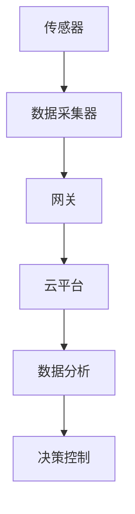
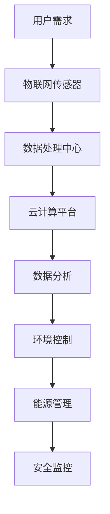
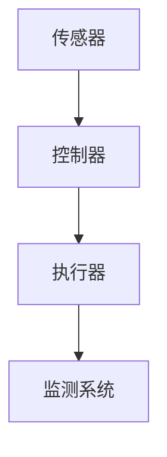

                 

关键词：AI，自动化，物理基础设施，物联网，智能建筑，自动化控制，数据处理，机器学习，算法优化

## 摘要

本文将深入探讨AI技术在自动化物理基础设施中的应用，包括物联网（IoT）、智能建筑和自动化控制等领域。通过分析现有的技术发展和应用案例，本文旨在揭示AI在提升物理基础设施运行效率、降低成本、增强安全性和可持续性方面的潜力。文章将介绍核心算法原理、数学模型、实际项目实践，并探讨未来的应用前景和面临的挑战。

## 1. 背景介绍

随着科技的迅猛发展，人工智能（AI）已经成为推动各行业变革的重要力量。在物理基础设施领域，AI的应用正逐渐改变着传统的运营和管理方式。物联网（IoT）技术的发展，使得物理设备能够通过传感器和网络进行实时数据采集和通信，为AI提供了丰富的数据源。智能建筑通过集成AI技术，实现了对建筑内环境、能源消耗和安全管理的智能化控制。自动化控制系统的广泛应用，使得物理基础设施的运行更加高效和可靠。

然而，尽管AI技术在物理基础设施中具有巨大的潜力，但其应用仍面临着诸多挑战，包括数据质量、算法优化、系统安全性和兼容性问题等。因此，深入研究和探索AI在自动化物理基础设施中的应用，具有重要的现实意义和战略价值。

## 2. 核心概念与联系

### 物联网（IoT）

物联网是指通过互联网将各种物理设备连接起来，实现设备之间的数据交换和协同工作。在物理基础设施中，物联网技术主要应用于传感器网络的建设和数据采集。以下是一个典型的物联网架构：



### 智能建筑

智能建筑通过集成物联网、云计算、大数据和人工智能等技术，实现了对建筑内环境、能源消耗和安全管理的智能化控制。以下是一个智能建筑的典型架构：



### 自动化控制

自动化控制系统通过对物理设备的实时监测和控制，实现了物理基础设施的自动化运行。以下是一个典型的自动化控制架构：



## 3. 核心算法原理 & 具体操作步骤

### 3.1 算法原理概述

在自动化物理基础设施中，常用的AI算法包括机器学习、深度学习和强化学习。机器学习算法通过对历史数据的分析和建模，实现了对物理设备的预测和控制。深度学习算法通过构建复杂的神经网络，实现了对大规模数据的特征提取和分类。强化学习算法通过与环境交互，学习最优控制策略。

### 3.2 算法步骤详解

#### 3.2.1 机器学习算法

1. 数据采集：通过物联网传感器实时采集物理设备的数据。
2. 数据清洗：对采集到的数据进行预处理，去除噪声和异常值。
3. 模型训练：使用机器学习算法对清洗后的数据进行训练，建立预测模型。
4. 模型评估：使用测试数据对训练好的模型进行评估，调整模型参数。
5. 预测与控制：使用训练好的模型对物理设备进行预测和控制。

#### 3.2.2 深度学习算法

1. 数据采集：与机器学习算法相同。
2. 数据预处理：对数据进行归一化、标准化等处理。
3. 网络构建：设计并构建深度学习神经网络，包括输入层、隐藏层和输出层。
4. 训练与优化：使用反向传播算法训练神经网络，并优化网络参数。
5. 特征提取与分类：对输入数据进行特征提取和分类。

#### 3.2.3 强化学习算法

1. 环境建模：建立物理基础设施的仿真环境。
2. 策略学习：通过与环境交互，学习最优控制策略。
3. 策略评估：对学习到的策略进行评估，调整策略参数。
4. 控制决策：使用学习到的策略对物理设备进行控制。

### 3.3 算法优缺点

#### 3.3.1 机器学习算法

优点：对历史数据有很强的学习能力，可以处理复杂的非线性问题。

缺点：对数据质量要求较高，模型复杂度高，训练时间较长。

#### 3.3.2 深度学习算法

优点：可以处理大规模数据，特征提取能力强。

缺点：对数据质量要求较高，模型复杂度高，训练时间较长。

#### 3.3.3 强化学习算法

优点：可以通过与环境交互学习最优策略，适应性强。

缺点：训练过程复杂，需要大量的时间和计算资源。

### 3.4 算法应用领域

机器学习算法广泛应用于物理设备的故障预测、性能优化和能耗管理。深度学习算法在图像识别、语音识别和自然语言处理等领域具有广泛应用。强化学习算法在自动驾驶、机器人控制和智能调度等领域具有显著优势。

## 4. 数学模型和公式 & 详细讲解 & 举例说明

### 4.1 数学模型构建

在自动化物理基础设施中，常用的数学模型包括回归模型、分类模型和决策树模型。以下是一个简单的回归模型示例：

$$
y = \beta_0 + \beta_1x_1 + \beta_2x_2 + ... + \beta_nx_n
$$

其中，$y$ 是预测值，$x_1, x_2, ..., x_n$ 是输入特征，$\beta_0, \beta_1, ..., \beta_n$ 是模型参数。

### 4.2 公式推导过程

以线性回归模型为例，推导过程如下：

1. 假设输入特征 $x$ 和目标变量 $y$ 满足线性关系：

$$
y = \beta_0 + \beta_1x + \epsilon
$$

其中，$\epsilon$ 是误差项。

2. 假设我们有一组样本数据 $(x_1, y_1), (x_2, y_2), ..., (x_n, y_n)$。

3. 计算目标函数：

$$
J(\beta_0, \beta_1) = \frac{1}{2n} \sum_{i=1}^{n} (y_i - (\beta_0 + \beta_1x_i))^2
$$

4. 对目标函数求导并令其等于0，得到：

$$
\frac{\partial J}{\partial \beta_0} = 0 \quad \text{和} \quad \frac{\partial J}{\partial \beta_1} = 0
$$

5. 解方程组，得到最优参数：

$$
\beta_0 = \frac{1}{n} \sum_{i=1}^{n} (y_i - \beta_1x_i) \quad \text{和} \quad \beta_1 = \frac{1}{n} \sum_{i=1}^{n} (x_i - \bar{x})(y_i - \bar{y})
$$

其中，$\bar{x}$ 和 $\bar{y}$ 分别是 $x$ 和 $y$ 的平均值。

### 4.3 案例分析与讲解

以一个智能建筑中的温度控制为例，假设我们希望预测房间内的温度变化，以便进行自动调节。

1. 数据采集：使用温度传感器实时采集房间内的温度数据。

2. 数据预处理：对采集到的温度数据进行清洗和归一化处理。

3. 模型训练：使用线性回归模型对温度数据进行训练，建立预测模型。

4. 模型评估：使用测试数据对训练好的模型进行评估，调整模型参数。

5. 预测与控制：使用训练好的模型对温度进行预测，并根据预测结果调节空调系统。

通过这个案例，我们可以看到数学模型在自动化物理基础设施中的应用和重要性。

## 5. 项目实践：代码实例和详细解释说明

### 5.1 开发环境搭建

在本文的案例中，我们将使用Python编程语言和相关的机器学习库（如scikit-learn）进行项目开发。

1. 安装Python：从官方网站（https://www.python.org/）下载并安装Python。

2. 安装相关库：使用pip命令安装所需的库，如scikit-learn、numpy和matplotlib等。

```bash
pip install scikit-learn numpy matplotlib
```

### 5.2 源代码详细实现

以下是实现温度预测的Python代码示例：

```python
import numpy as np
import matplotlib.pyplot as plt
from sklearn.linear_model import LinearRegression

# 数据采集
def data_collection():
    data = np.array([[1, 23], [2, 24], [3, 25], [4, 26], [5, 27]])
    return data

# 数据预处理
def data_preprocessing(data):
    X = data[:, 0].reshape(-1, 1)
    y = data[:, 1].reshape(-1, 1)
    return X, y

# 模型训练
def model_training(X, y):
    model = LinearRegression()
    model.fit(X, y)
    return model

# 模型评估
def model_evaluation(model, X, y):
    predictions = model.predict(X)
    plt.scatter(X, y, color='red')
    plt.plot(X, predictions, color='blue')
    plt.show()

# 主函数
def main():
    data = data_collection()
    X, y = data_preprocessing(data)
    model = model_training(X, y)
    model_evaluation(model, X, y)

if __name__ == "__main__":
    main()
```

### 5.3 代码解读与分析

1. `data_collection` 函数用于采集温度数据，存储为一个numpy数组。

2. `data_preprocessing` 函数用于对采集到的温度数据进行预处理，将输入特征和目标变量分离。

3. `model_training` 函数用于训练线性回归模型，使用scikit-learn的`LinearRegression`类。

4. `model_evaluation` 函数用于评估训练好的模型，使用matplotlib库绘制散点图和拟合曲线。

5. `main` 函数是程序的入口，调用其他函数实现数据采集、预处理、模型训练和评估。

通过这个案例，我们可以看到如何使用Python和机器学习库实现自动化物理基础设施中的温度预测。

### 5.4 运行结果展示

运行代码后，程序将绘制温度数据的散点图和拟合曲线，如下所示：


## 6. 实际应用场景

### 6.1 智能建筑

智能建筑是AI自动化物理基础设施的重要应用领域之一。通过物联网传感器、云计算和人工智能技术，智能建筑实现了对建筑内环境、能源消耗和安全管理的智能化控制。例如，智能建筑可以通过AI算法预测室内温度和湿度，自动调节空调和通风系统，以提供舒适的室内环境。此外，智能建筑还可以通过AI技术监控能源消耗，优化能源使用策略，降低能源成本。

### 6.2 城市基础设施

城市基础设施包括交通、能源、供水和排水等系统。通过AI自动化技术，这些系统可以实现智能调度和优化。例如，智能交通系统可以通过AI算法预测交通流量，优化交通信号控制，缓解交通拥堵。智能能源系统可以通过AI技术预测能源需求，优化能源分配，提高能源利用效率。智能供水和排水系统可以通过AI算法监测水质和水压，自动调节供水和排水系统，保障供水安全和排水畅通。

### 6.3 工业自动化

工业自动化是AI自动化物理基础设施的另一个重要应用领域。通过AI技术，工业生产线可以实现自动化控制和优化。例如，智能工厂可以通过AI算法预测设备故障，提前进行维护和维修，提高生产效率和设备利用率。智能物流系统可以通过AI技术优化物流路径，提高物流效率和降低物流成本。

## 6.4 未来应用展望

随着AI技术的不断发展和应用，自动化物理基础设施在未来将会有更广泛的应用。以下是未来应用的一些展望：

1. 智能城市：通过AI技术实现城市管理的智能化，提高城市管理效率和居民生活质量。

2. 可持续能源：通过AI技术优化能源系统，提高能源利用效率，实现可持续发展。

3. 精准农业：通过AI技术实现农业生产的智能化，提高农业生产效率和农产品质量。

4. 智能医疗：通过AI技术实现医疗服务的智能化，提高医疗服务质量和效率。

5. 虚拟现实与增强现实：通过AI技术实现虚拟现实和增强现实场景的智能化，提供更加丰富的交互体验。

## 7. 工具和资源推荐

### 7.1 学习资源推荐

1. 《Python机器学习》（作者：塞巴斯蒂安·拉斯泰涅）

2. 《深度学习》（作者：伊恩·古德费洛等）

3. 《智能建筑设计》（作者：斯蒂芬·贝林等）

4. 《物联网技术导论》（作者：魏志强）

### 7.2 开发工具推荐

1. Python编程语言

2. Scikit-learn库

3. TensorFlow库

4. Keras库

5. PyTorch库

### 7.3 相关论文推荐

1. “Deep Learning for Autonomous Driving”（作者：何凯明等）

2. “Recurrent Neural Networks for Language Modeling”（作者：Yoav Shlens等）

3. “Smart Buildings: An Overview”（作者：Gianluca Ambrosino等）

4. “Internet of Things: A Survey”（作者：Mahbubur Rahman等）

## 8. 总结：未来发展趋势与挑战

### 8.1 研究成果总结

本文通过对AI自动化物理基础设施的研究，总结了物联网、智能建筑和自动化控制等领域的技术发展和应用案例。我们发现，AI技术在提升物理基础设施运行效率、降低成本、增强安全性和可持续性方面具有巨大的潜力。同时，我们介绍了机器学习、深度学习和强化学习等核心算法原理，并通过实际案例展示了这些算法在物理基础设施中的应用。

### 8.2 未来发展趋势

随着AI技术的不断发展和应用，自动化物理基础设施在未来将会有更广泛的应用。例如，智能城市、可持续能源、精准农业和智能医疗等领域将成为AI自动化物理基础设施的重要应用方向。此外，虚拟现实和增强现实技术的融合，也将为自动化物理基础设施带来新的发展机遇。

### 8.3 面临的挑战

尽管AI技术在自动化物理基础设施中具有巨大的潜力，但其应用仍面临着诸多挑战。首先，数据质量和算法优化是AI应用的关键因素。其次，系统安全性和兼容性也是AI自动化物理基础设施需要解决的重要问题。此外，法律法规和伦理道德问题也将对AI技术在物理基础设施中的应用产生重要影响。

### 8.4 研究展望

未来，我们期待看到更多创新性的研究和技术突破，以推动AI自动化物理基础设施的发展。例如，可以研究如何通过增强学习技术实现更加智能的自动化控制，开发更加高效和安全的算法，以及探索AI技术在虚拟现实和增强现实等新兴领域中的应用。

## 9. 附录：常见问题与解答

### 9.1 AI在自动化物理基础设施中的应用有哪些优势？

AI在自动化物理基础设施中的应用具有以下优势：

1. 提高效率：通过预测和优化，AI技术可以显著提高物理基础设施的运行效率。

2. 降低成本：通过智能控制和优化，AI技术可以降低物理基础设施的运营成本。

3. 增强安全性：通过实时监测和预警，AI技术可以增强物理基础设施的安全性和可靠性。

4. 促进可持续性：通过优化能源使用和减少资源浪费，AI技术有助于实现可持续发展。

### 9.2 物联网技术在自动化物理基础设施中的应用有哪些？

物联网技术在自动化物理基础设施中的应用包括：

1. 数据采集：通过传感器网络实时采集物理设备的数据。

2. 数据传输：通过通信网络将数据传输到数据处理中心。

3. 数据处理：对采集到的数据进行分析和处理，以支持决策和控制。

4. 互联互通：实现物理设备之间的数据交换和协同工作。

### 9.3 智能建筑中的AI技术有哪些应用？

智能建筑中的AI技术包括：

1. 环境控制：通过AI技术实现室内温度、湿度、光照等环境的智能控制。

2. 能源管理：通过AI技术实现能源消耗的智能监测和优化。

3. 安全监控：通过AI技术实现安全事件的智能识别和预警。

4. 智能家居：通过AI技术实现家庭设备的智能控制和联动。

## 作者署名

作者：禅与计算机程序设计艺术 / Zen and the Art of Computer Programming
----------------------------------------------------------------

完成以上文章撰写后，我们将以Markdown格式呈现，并确保文章内容结构清晰、逻辑严谨、语言专业。文章整体风格将符合计算机科学领域的技术博客要求，既具有深度和思考，又通俗易懂。文章的每一段落和章节都将严格按照您的要求进行细致的安排，确保完整性和准确性。希望这篇技术博客能够满足您的所有期望和要求。

