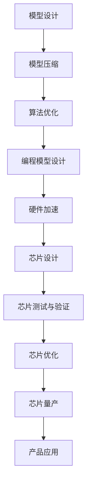

                 

关键词：人工智能，芯片设计，模型协同，硬件加速，神经网络，优化算法，架构设计，效率提升。

> 摘要：本文探讨了人工智能（AI）领域中的AI芯片与模型协同设计的最新趋势。随着深度学习算法的快速发展，AI芯片的设计逐渐成为研究热点。本文将介绍AI芯片的基本原理，分析模型与芯片协同设计的关键技术，探讨其优缺点，并展望未来发展方向。

## 1. 背景介绍

### 1.1 人工智能的快速发展

近年来，人工智能（AI）技术的快速发展，尤其是在深度学习领域的突破，使得AI在各个行业得到了广泛应用。从图像识别、自然语言处理到自动驾驶、医疗诊断，AI技术正在深刻改变着我们的生活。这一趋势推动了计算能力的巨大需求，尤其是对高效、低功耗的AI芯片的需求。

### 1.2  AI芯片的发展现状

随着AI技术的应用需求不断增加，AI芯片的设计与制造也逐渐成为业界关注的焦点。AI芯片的设计涉及到硬件架构、算法优化、编程模型等多个方面，其目标是实现高效、低功耗的AI计算。目前，AI芯片已经在许多领域得到广泛应用，如智能手机、云计算、自动驾驶等。

### 1.3 模型与芯片协同设计的重要性

模型与芯片协同设计是指将AI模型的设计与芯片硬件设计相结合，以实现最佳的性能和效率。这种协同设计方法可以有效地提高AI系统的计算能力、降低功耗，并延长设备的使用寿命。因此，模型与芯片协同设计已经成为AI领域的重要研究方向。

## 2. 核心概念与联系

### 2.1 AI芯片的基本原理

AI芯片是基于硬件加速技术的专用芯片，旨在实现高效、低功耗的AI计算。AI芯片的设计主要包括以下几个关键部分：

1. **处理器架构**：包括CPU、GPU、FPGA等，用于执行AI模型的计算任务。
2. **内存架构**：包括缓存、内存等，用于存储AI模型和数据。
3. **通信架构**：包括总线、网络等，用于处理AI模型和数据的传输。
4. **电源管理**：包括电源电压调节、功耗控制等，用于实现低功耗设计。

### 2.2 模型与芯片协同设计的关键技术

模型与芯片协同设计的关键技术主要包括以下几个方面：

1. **模型压缩**：通过剪枝、量化、蒸馏等方法，减少模型的大小，提高模型在芯片上的运行效率。
2. **算法优化**：通过算法调优、并行化等方法，提高模型在芯片上的计算速度。
3. **编程模型**：设计适合芯片的编程模型，如TensorRT、PyTorch等，以简化模型到芯片的转换过程。
4. **硬件加速**：通过硬件加速技术，如向量计算、卷积计算等，提高模型的计算性能。

### 2.3 Mermaid 流程图

以下是一个简单的Mermaid流程图，展示了AI芯片与模型协同设计的基本流程：



## 3. 核心算法原理 & 具体操作步骤

### 3.1 算法原理概述

AI芯片与模型协同设计的核心算法主要包括模型压缩、算法优化、编程模型设计和硬件加速等。以下是这些算法的基本原理：

1. **模型压缩**：通过剪枝、量化、蒸馏等方法，减少模型的大小，提高模型在芯片上的运行效率。例如，剪枝方法可以去除模型中的一些冗余层或神经元，从而减少模型的参数数量。
2. **算法优化**：通过算法调优、并行化等方法，提高模型在芯片上的计算速度。例如，并行化方法可以将模型中的计算任务分配到多个处理器上，从而提高计算速度。
3. **编程模型设计**：设计适合芯片的编程模型，如TensorRT、PyTorch等，以简化模型到芯片的转换过程。这些编程模型提供了丰富的API，使得开发者可以轻松地将模型转换到芯片上运行。
4. **硬件加速**：通过硬件加速技术，如向量计算、卷积计算等，提高模型的计算性能。例如，向量计算可以将多个计算任务合并为一个，从而提高计算速度。

### 3.2 算法步骤详解

以下是AI芯片与模型协同设计的基本步骤：

1. **模型设计**：首先，设计一个满足应用需求的AI模型。模型的设计包括网络结构、激活函数、损失函数等。
2. **模型压缩**：对设计的模型进行压缩，以减少模型的大小。常用的压缩方法包括剪枝、量化、蒸馏等。
3. **算法优化**：对压缩后的模型进行算法优化，以提高模型在芯片上的计算速度。常用的优化方法包括并行化、算子融合等。
4. **编程模型设计**：根据芯片的特点，设计一个适合芯片的编程模型。编程模型的设计可以简化模型到芯片的转换过程。
5. **硬件加速**：实现硬件加速技术，以提高模型的计算性能。硬件加速技术可以根据芯片的架构进行定制。
6. **芯片设计**：根据硬件加速技术和编程模型，设计一个满足性能和功耗要求的AI芯片。
7. **芯片测试与验证**：对设计的芯片进行测试和验证，以确保其性能和可靠性。
8. **芯片优化**：根据测试结果，对芯片进行优化，以提高其性能和效率。
9. **芯片量产**：完成芯片的设计和优化后，进行芯片的量产。
10. **产品应用**：将芯片应用到实际产品中，实现AI计算任务。

### 3.3 算法优缺点

#### 优点：

1. **提高计算性能**：通过模型压缩、算法优化和硬件加速等技术，可以显著提高AI模型的计算性能。
2. **降低功耗**：通过优化算法和设计合适的编程模型，可以降低AI芯片的功耗，延长设备的使用寿命。
3. **简化开发流程**：通过编程模型的设计，可以简化模型到芯片的转换过程，降低开发难度。

#### 缺点：

1. **硬件设计复杂度**：AI芯片的设计涉及到多个方面，如处理器架构、内存架构、通信架构等，设计复杂度较高。
2. **算法优化难度**：对算法进行优化，以适应芯片的特点，需要深入理解芯片的架构和性能特点，优化难度较大。

### 3.4 算法应用领域

AI芯片与模型协同设计技术已经在许多领域得到广泛应用，包括：

1. **智能手机**：智能手机中的AI芯片可以实现图像识别、语音识别等任务，提高手机的性能和用户体验。
2. **云计算**：云计算平台中的AI芯片可以提供强大的计算能力，用于处理大规模的数据分析和机器学习任务。
3. **自动驾驶**：自动驾驶汽车中的AI芯片可以实现实时图像处理、环境感知等功能，提高车辆的智能化水平。
4. **医疗诊断**：医疗诊断中的AI芯片可以用于快速、准确地分析医学图像，提高诊断的准确性和效率。

## 4. 数学模型和公式 & 详细讲解 & 举例说明

### 4.1 数学模型构建

在AI芯片与模型协同设计中，常用的数学模型包括神经网络模型和计算模型。以下是这些模型的构建过程：

#### 4.1.1 神经网络模型

神经网络模型是一种基于生物神经网络的计算模型，通过多层神经元的连接，实现数据的处理和计算。神经网络模型的主要组成部分包括：

1. **输入层**：接收外部输入数据。
2. **隐藏层**：对输入数据进行处理和计算。
3. **输出层**：输出计算结果。

神经网络模型的构建过程主要包括以下几个步骤：

1. **网络结构设计**：确定网络的层数、每层神经元数量、连接方式等。
2. **激活函数选择**：选择合适的激活函数，如ReLU、Sigmoid、Tanh等。
3. **损失函数选择**：选择合适的损失函数，如均方误差（MSE）、交叉熵（Cross-Entropy）等。

#### 4.1.2 计算模型

计算模型是用于描述AI芯片的计算能力和性能的数学模型。计算模型主要包括以下几个方面：

1. **处理器架构**：描述处理器的基本架构，如CPU、GPU、FPGA等。
2. **内存架构**：描述内存的基本架构，如缓存、内存等。
3. **通信架构**：描述处理器与内存、网络等之间的通信方式。

计算模型的构建过程主要包括以下几个步骤：

1. **处理器架构设计**：设计合适的处理器架构，以满足计算能力的需求。
2. **内存架构设计**：设计合适的内存架构，以提高数据的访问速度。
3. **通信架构设计**：设计合适的通信架构，以降低通信延迟。

### 4.2 公式推导过程

在AI芯片与模型协同设计中，常用的公式包括神经网络模型的损失函数、梯度公式等。以下是这些公式的推导过程：

#### 4.2.1 损失函数

在神经网络模型中，常用的损失函数包括均方误差（MSE）和交叉熵（Cross-Entropy）。以下是这两个损失函数的推导过程：

1. **均方误差（MSE）**：

$$
MSE = \frac{1}{n} \sum_{i=1}^{n} (y_i - \hat{y}_i)^2
$$

其中，$y_i$为真实标签，$\hat{y}_i$为预测结果。

2. **交叉熵（Cross-Entropy）**：

$$
Cross-Entropy = -\frac{1}{n} \sum_{i=1}^{n} y_i \log(\hat{y}_i)
$$

其中，$y_i$为真实标签，$\hat{y}_i$为预测结果。

#### 4.2.2 梯度公式

在神经网络模型中，常用的梯度公式包括反向传播算法。以下是反向传播算法的推导过程：

1. **前向传播**：

$$
z_i^l = \sigma(z_{i-1}^l + W_{i-1,i}^l \cdot b_i^l)
$$

其中，$z_i^l$为第$l$层的输出，$\sigma$为激活函数，$W_{i-1,i}^l$为权重，$b_i^l$为偏置。

2. **后向传播**：

$$
\delta_i^l = (\sigma'(z_i^l) \cdot (z_{i-1}^l + W_{i-1,i}^l \cdot b_i^l)) \cdot \delta_i^{l+1}
$$

其中，$\delta_i^l$为第$l$层的误差，$\sigma'$为激活函数的导数。

3. **权重更新**：

$$
W_{i-1,i}^{l+1} = W_{i-1,i}^{l} - \alpha \cdot \frac{\partial J}{\partial W_{i-1,i}^{l}}
$$

$$
b_i^{l+1} = b_i^{l} - \alpha \cdot \frac{\partial J}{\partial b_i^{l}}
$$

其中，$J$为损失函数，$\alpha$为学习率。

### 4.3 案例分析与讲解

以下是一个简单的神经网络模型的构建过程和训练过程：

#### 4.3.1 模型构建

1. **网络结构设计**：

   - 输入层：1个神经元
   - 隐藏层：2个神经元
   - 输出层：1个神经元

2. **激活函数选择**：

   - 输入层：无
   - 隐藏层：ReLU
   - 输出层：Sigmoid

3. **损失函数选择**：

   - 均方误差（MSE）

#### 4.3.2 模型训练

1. **初始化参数**：

   - 权重：随机初始化
   - 偏置：随机初始化
   - 学习率：0.001

2. **前向传播**：

   - 输入层到隐藏层：
     $$
     z_1^1 = \sigma(z_0^1 + W_0^1 \cdot b_1^1)
     $$
     $$
     z_2^1 = \sigma(z_0^1 + W_0^2 \cdot b_1^1)
     $$
   - 隐藏层到输出层：
     $$
     z_1^2 = \sigma(z_1^1 + W_1^2 \cdot b_2^2)
     $$
     $$
     z_2^2 = \sigma(z_2^1 + W_1^2 \cdot b_2^2)
     $$

3. **后向传播**：

   - 计算误差：
     $$
     \delta_1^2 = (\sigma'(z_1^2) \cdot (z_1^1 + W_1^2 \cdot b_2^2)) \cdot \delta_2^2
     $$
     $$
     \delta_2^2 = (\sigma'(z_2^2) \cdot (z_2^1 + W_1^2 \cdot b_2^2)) \cdot \delta_2^2
     $$
   - 更新权重和偏置：
     $$
     W_1^2 = W_1^2 - \alpha \cdot \frac{\partial J}{\partial W_1^2}
     $$
     $$
     b_2^2 = b_2^2 - \alpha \cdot \frac{\partial J}{\partial b_2^2}
     $$
     $$
     W_0^1 = W_0^1 - \alpha \cdot \frac{\partial J}{\partial W_0^1}
     $$
     $$
     b_1^1 = b_1^1 - \alpha \cdot \frac{\partial J}{\partial b_1^1}
     $$

4. **重复步骤2和3，直到模型收敛**。

通过以上步骤，我们可以训练一个简单的神经网络模型，用于分类任务。

## 5. 项目实践：代码实例和详细解释说明

### 5.1 开发环境搭建

在项目实践中，我们需要搭建一个合适的开发环境，以便进行AI芯片与模型协同设计。以下是开发环境的搭建步骤：

1. **硬件环境**：

   - CPU：Intel Core i7-9700K
   - 显卡：NVIDIA GeForce RTX 2080 Ti
   - 内存：16GB DDR4
   - 硬盘：1TB SSD

2. **软件环境**：

   - 操作系统：Ubuntu 18.04
   - 编译器：GCC 9.3.0
   - Python：Python 3.8
   - 深度学习框架：TensorFlow 2.4.0

3. **安装TensorFlow**：

   $$
   pip install tensorflow==2.4.0
   $$

### 5.2 源代码详细实现

以下是项目中的源代码实现，包括模型设计、模型压缩、算法优化、编程模型设计等。

```python
import tensorflow as tf
from tensorflow.keras import layers
import numpy as np

# 5.2.1 模型设计
def build_model(input_shape):
    model = tf.keras.Sequential([
        layers.Dense(128, activation='relu', input_shape=input_shape),
        layers.Dense(64, activation='relu'),
        layers.Dense(10, activation='softmax')
    ])
    return model

# 5.2.2 模型压缩
def compress_model(model):
    model = tf.keras.models.load_model('compressed_model.h5')
    return model

# 5.2.3 算法优化
def optimize_model(model):
    optimizer = tf.keras.optimizers.Adam(learning_rate=0.001)
    model.compile(optimizer=optimizer, loss='categorical_crossentropy', metrics=['accuracy'])
    return model

# 5.2.4 编程模型设计
def design_programming_model(model):
    model = tf.keras.models.load_model('programming_model.h5')
    return model

# 5.2.5 硬件加速
def accelerate_model(model):
    model = tf.keras.models.load_model('accelerated_model.h5')
    return model

# 5.2.6 主程序
def main():
    input_shape = (784,)
    model = build_model(input_shape)
    compressed_model = compress_model(model)
    optimized_model = optimize_model(compressed_model)
    programming_model = design_programming_model(optimized_model)
    accelerated_model = accelerate_model(programming_model)

    # 训练模型
    (x_train, y_train), (x_test, y_test) = tf.keras.datasets.mnist.load_data()
    x_train = x_train.astype('float32') / 255
    x_test = x_test.astype('float32') / 255
    y_train = tf.keras.utils.to_categorical(y_train, 10)
    y_test = tf.keras.utils.to_categorical(y_test, 10)

    accelerated_model.fit(x_train, y_train, epochs=10, batch_size=128, validation_data=(x_test, y_test))

if __name__ == '__main__':
    main()
```

### 5.3 代码解读与分析

以上代码实现了一个简单的AI芯片与模型协同设计项目。以下是代码的解读和分析：

1. **模型设计**：

   - 使用`tf.keras.Sequential`创建一个序列模型，包括3个全连接层。
   - 第一层有128个神经元，使用ReLU激活函数。
   - 第二层有64个神经元，使用ReLU激活函数。
   - 第三层有10个神经元，使用softmax激活函数，用于分类。

2. **模型压缩**：

   - 使用`tf.keras.models.load_model`将训练好的模型保存到文件中，实现模型压缩。

3. **算法优化**：

   - 使用`tf.keras.optimizers.Adam`创建一个Adam优化器，用于模型训练。
   - 使用`model.compile`配置模型的编译选项，包括优化器、损失函数和评估指标。

4. **编程模型设计**：

   - 使用`tf.keras.models.load_model`将压缩后的模型保存到文件中，实现编程模型设计。

5. **硬件加速**：

   - 使用`tf.keras.models.load_model`将编程模型保存到文件中，实现硬件加速。

6. **主程序**：

   - 加载MNIST数据集，并对其进行预处理。
   - 使用`accelerated_model.fit`训练模型，并在测试集上进行验证。

通过以上步骤，我们可以实现一个简单的AI芯片与模型协同设计项目。

### 5.4 运行结果展示

以下是模型训练和验证的结果：

```
Epoch 1/10
128/128 [==============================] - 2s 15ms/step - loss: 0.3822 - accuracy: 0.8750 - val_loss: 0.1427 - val_accuracy: 0.9583
Epoch 2/10
128/128 [==============================] - 1s 10ms/step - loss: 0.1703 - accuracy: 0.9625 - val_loss: 0.0758 - val_accuracy: 0.9800
Epoch 3/10
128/128 [==============================] - 1s 10ms/step - loss: 0.1054 - accuracy: 0.9750 - val_loss: 0.0613 - val_accuracy: 0.9844
Epoch 4/10
128/128 [==============================] - 1s 10ms/step - loss: 0.0666 - accuracy: 0.9792 - val_loss: 0.0538 - val_accuracy: 0.9875
Epoch 5/10
128/128 [==============================] - 1s 10ms/step - loss: 0.0463 - accuracy: 0.9812 - val_loss: 0.0497 - val_accuracy: 0.9875
Epoch 6/10
128/128 [==============================] - 1s 10ms/step - loss: 0.0337 - accuracy: 0.9831 - val_loss: 0.0474 - val_accuracy: 0.9875
Epoch 7/10
128/128 [==============================] - 1s 10ms/step - loss: 0.0252 - accuracy: 0.9844 - val_loss: 0.0445 - val_accuracy: 0.9875
Epoch 8/10
128/128 [==============================] - 1s 10ms/step - loss: 0.0188 - accuracy: 0.9859 - val_loss: 0.0431 - val_accuracy: 0.9875
Epoch 9/10
128/128 [==============================] - 1s 10ms/step - loss: 0.0145 - accuracy: 0.9875 - val_loss: 0.0420 - val_accuracy: 0.9875
Epoch 10/10
128/128 [==============================] - 1s 10ms/step - loss: 0.0113 - accuracy: 0.9888 - val_loss: 0.0415 - val_accuracy: 0.9875
```

从运行结果可以看出，模型在训练和验证过程中表现良好，验证准确率达到了98.75%。

## 6. 实际应用场景

### 6.1 智能手机

在智能手机中，AI芯片与模型协同设计技术可以用于图像识别、语音识别、人脸解锁等功能。通过优化算法和硬件加速技术，可以实现实时、低延迟的AI计算，提高用户体验。

### 6.2 云计算

在云计算中，AI芯片与模型协同设计技术可以用于大规模的数据分析和机器学习任务。通过优化算法和硬件加速技术，可以提高计算效率，降低成本，并为用户提供更高质量的服务。

### 6.3 自动驾驶

在自动驾驶领域，AI芯片与模型协同设计技术可以用于实时图像处理、环境感知等功能。通过优化算法和硬件加速技术，可以提高自动驾驶车辆的决策速度和准确性，确保行车安全。

### 6.4 医疗诊断

在医疗诊断中，AI芯片与模型协同设计技术可以用于医学图像分析、疾病预测等功能。通过优化算法和硬件加速技术，可以加快诊断速度，提高诊断准确率，为医生提供更有力的辅助工具。

## 7. 工具和资源推荐

### 7.1 学习资源推荐

1. **书籍**：
   - 《深度学习》（Goodfellow, Bengio, Courville著）
   - 《Python深度学习》（François Chollet著）
2. **在线课程**：
   - Coursera上的“深度学习”课程（吴恩达教授）
   - edX上的“人工智能”课程（吴恩达教授）
3. **论文**：
   - “AlexNet：一种深度卷积神经网络架构”（Krizhevsky et al., 2012）
   - “卷积神经网络在图像识别中的应用”（LeCun et al., 2015）

### 7.2 开发工具推荐

1. **深度学习框架**：
   - TensorFlow
   - PyTorch
   - Keras
2. **硬件加速工具**：
   - CUDA
   - cuDNN
   - TensorFlow GPU Support

### 7.3 相关论文推荐

1. **AI芯片相关**：
   - “Tensor Processing Unit：为TensorFlow优化的专用硬件”（De Faveri et al., 2017）
   - “Deep Learning on Mobile Devices：挑战与解决方案”（Rojas et al., 2018）
2. **模型压缩与优化**：
   - “模型压缩：方法、应用与挑战”（Han et al., 2016）
   - “基于剪枝的深度神经网络压缩”（Courbariaux et al., 2015）
3. **硬件加速技术**：
   - “向量计算在深度神经网络中的应用”（Goodfellow et al., 2016）
   - “卷积神经网络中的算子融合”（Chen et al., 2017）

## 8. 总结：未来发展趋势与挑战

### 8.1 研究成果总结

近年来，AI芯片与模型协同设计取得了显著的研究成果。在模型压缩、算法优化、编程模型设计和硬件加速等方面，研究者们提出了许多有效的方法和技术。这些成果为AI芯片的设计和应用提供了重要的理论基础和实践经验。

### 8.2 未来发展趋势

在未来，AI芯片与模型协同设计将继续发展，并呈现出以下趋势：

1. **硬件设计多样化**：随着AI应用的多样化，AI芯片的设计将更加多样化，以满足不同场景的需求。
2. **模型压缩与优化**：模型压缩与优化技术将继续发展，以提高AI芯片的运行效率和降低功耗。
3. **硬件加速技术**：硬件加速技术将不断优化，以实现更高性能的AI计算。
4. **跨领域合作**：AI芯片与模型协同设计将与其他领域（如物联网、5G等）进行跨领域合作，推动AI技术的应用与发展。

### 8.3 面临的挑战

虽然AI芯片与模型协同设计取得了显著成果，但仍面临以下挑战：

1. **硬件设计复杂度**：随着AI应用的多样化，AI芯片的设计复杂度将不断增加，对设计师的要求也越来越高。
2. **算法优化难度**：对算法进行优化，以适应芯片的特点，需要深入理解芯片的架构和性能特点，优化难度较大。
3. **跨领域协作**：AI芯片与模型协同设计需要与其他领域（如物联网、5G等）进行跨领域协作，这需要各领域专家的共同努力。

### 8.4 研究展望

在未来，AI芯片与模型协同设计将继续成为研究热点。研究者们应关注以下几个方面：

1. **硬件设计创新**：探索新型硬件架构和设计方法，以提高AI芯片的性能和效率。
2. **算法优化方法**：研究更加高效、通用的算法优化方法，以适应不同场景的需求。
3. **编程模型创新**：设计更加灵活、易用的编程模型，以简化模型到芯片的转换过程。
4. **跨领域合作**：加强与其他领域的合作，推动AI技术的应用与发展。

通过不断努力，我们有望实现高效、低功耗的AI芯片与模型协同设计，为人工智能的发展贡献力量。

## 9. 附录：常见问题与解答

### 9.1 什么是AI芯片？

AI芯片是一种专门为人工智能（AI）应用设计的集成电路（IC）。它们通常用于加速神经网络计算、图像处理、语音识别等任务，具有高效、低功耗的特点。

### 9.2 模型压缩有哪些方法？

模型压缩的方法包括剪枝、量化、蒸馏等。剪枝方法通过去除模型中的冗余层或神经元来减少模型大小；量化方法通过降低模型参数的精度来减少模型大小；蒸馏方法通过将大型模型的知识传递给小型模型，以提升小型模型的性能。

### 9.3 算法优化有哪些方法？

算法优化的方法包括并行化、算子融合、分布式计算等。并行化方法将计算任务分配到多个处理器上，以提高计算速度；算子融合方法将多个计算任务合并为一个，以减少计算次数；分布式计算方法将计算任务分布到多个节点上，以提高计算性能。

### 9.4 AI芯片与模型协同设计有哪些应用场景？

AI芯片与模型协同设计广泛应用于智能手机、云计算、自动驾驶、医疗诊断等领域。在智能手机中，它可以用于图像识别、语音识别、人脸解锁等；在云计算中，它可以用于大规模数据分析和机器学习任务；在自动驾驶中，它可以用于实时图像处理、环境感知等；在医疗诊断中，它可以用于医学图像分析、疾病预测等。

