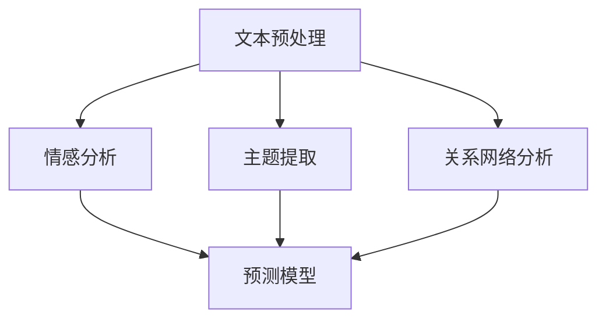

                 

AI技术的发展已经深刻影响了各个行业，文学创作也不例外。在这个信息爆炸的时代，如何有效地分析读者的反馈，优化故事结构和内容，成为文学创作者和出版商们关注的重要课题。本文将探讨如何利用AI技术，特别是自然语言处理（NLP）和机器学习，进行读者反馈分析，并提出优化故事结构和内容的具体策略。

> 关键词：AI读者反馈、自然语言处理、机器学习、故事结构优化、内容优化

> 摘要：本文首先介绍了AI在文学创作中的应用背景和重要性，然后详细阐述了利用AI技术分析读者反馈的方法和策略，最后提出了一套基于AI的优化故事结构和内容的具体步骤。通过这些方法，文学创作者和出版商可以更精准地把握读者需求，提高作品的市场竞争力。

## 1. 背景介绍

随着互联网和智能手机的普及，数字阅读已经成为人们获取信息、娱乐和知识的重要途径。然而，面对海量的文学作品，读者在阅读过程中产生了大量的反馈，包括评论、评分、点赞等。这些反馈不仅反映了读者的阅读体验，也为文学创作者和出版商提供了宝贵的改进意见。然而，如何有效地分析和利用这些反馈，成为了一个亟待解决的问题。

传统的方法主要依靠人工阅读和分类，效率低下且容易产生主观偏差。而AI技术的发展，特别是自然语言处理（NLP）和机器学习，为读者反馈分析提供了全新的解决方案。通过AI技术，可以自动化地提取读者反馈的关键信息，进行情感分析、主题提取和关系网络分析，从而为优化故事结构和内容提供科学依据。

## 2. 核心概念与联系

### 2.1 自然语言处理（NLP）

自然语言处理是AI领域的一个重要分支，旨在使计算机能够理解、处理和生成人类语言。在读者反馈分析中，NLP技术被用于文本的预处理、情感分析、主题提取和关系网络分析等。

#### 2.1.1 文本预处理

文本预处理是NLP的基础步骤，包括分词、去停用词、词干提取等。通过文本预处理，可以将原始文本转化为计算机可处理的格式，为后续的分析提供基础。

#### 2.1.2 情感分析

情感分析是NLP的一个重要应用，旨在判断文本的情感倾向，如正面、负面或中性。通过情感分析，可以了解读者对作品的情感反应，从而为内容优化提供参考。

#### 2.1.3 主题提取

主题提取是通过分析文本中的关键词和短语，提取出文本的主题。在读者反馈分析中，主题提取可以帮助识别读者关注的热点话题，从而优化故事结构。

#### 2.1.4 关系网络分析

关系网络分析是通过分析文本中的实体和它们之间的关系，构建出文本的知识图谱。在读者反馈分析中，关系网络分析可以帮助识别读者反馈中的关键角色和事件，从而优化故事情节。

### 2.2 机器学习

机器学习是AI的核心技术之一，通过训练模型，让计算机能够从数据中自动提取规律和模式。在读者反馈分析中，机器学习被用于构建预测模型和分类模型，从而自动化地分析和处理读者反馈。

#### 2.2.1 预测模型

预测模型是通过训练历史数据，预测未来的趋势和结果。在读者反馈分析中，预测模型可以预测读者的情感倾向和评论行为，从而为内容优化提供指导。

#### 2.2.2 分类模型

分类模型是通过训练数据，将新数据分类到不同的类别。在读者反馈分析中，分类模型可以用于分类读者的评论，识别出正面、负面或中性的反馈。

### 2.3 Mermaid 流程图

以下是读者反馈分析中使用的 Mermaid 流程图：



## 3. 核心算法原理 & 具体操作步骤

### 3.1 算法原理概述

读者反馈分析的核心算法主要包括文本预处理、情感分析、主题提取和关系网络分析。这些算法通过不同的技术手段，从不同角度对读者反馈进行分析，从而为内容优化提供依据。

### 3.2 算法步骤详解

#### 3.2.1 文本预处理

文本预处理是读者反馈分析的第一步，包括分词、去停用词、词干提取等。通过文本预处理，可以将原始文本转化为计算机可处理的格式，为后续的分析提供基础。

```python
import nltk
from nltk.corpus import stopwords
from nltk.tokenize import word_tokenize

# 加载停用词
stop_words = set(stopwords.words('english'))

# 文本预处理
def preprocess_text(text):
    # 分词
    tokens = word_tokenize(text)
    # 去停用词
    tokens = [token for token in tokens if token not in stop_words]
    # 词干提取
    stemmed_tokens = [nltk.PorterStemmer().stem(token) for token in tokens]
    return stemmed_tokens

text = "This is a sample text for preprocessing."
preprocessed_text = preprocess_text(text)
print(preprocessed_text)
```

#### 3.2.2 情感分析

情感分析是通过分析文本中的情感词汇和情感强度，判断文本的情感倾向。常用的情感分析模型包括基于规则的方法和基于机器学习的方法。

```python
from textblob import TextBlob

# 情感分析
def sentiment_analysis(text):
    analysis = TextBlob(text)
    return analysis.sentiment

sentiment = sentiment_analysis(text)
print(sentiment)
```

#### 3.2.3 主题提取

主题提取是通过分析文本中的关键词和短语，提取出文本的主题。常用的主题提取方法包括 Latent Dirichlet Allocation（LDA）和 Non-negative Matrix Factorization（NMF）。

```python
from gensim import corpora, models

# 构建词典
dictionary = corpora.Dictionary(preprocessed_text)

# 构建语料库
corpus = [dictionary.doc2bow(text) for text in preprocessed_text]

# 使用 LDA 模型提取主题
lda_model = models.LdaMulticore(corpus, num_topics=5, id2word=dictionary, passes=10, workers=2)

# 输出主题
topics = lda_model.print_topics(num_words=4)
for topic in topics:
    print(topic)
```

#### 3.2.4 关系网络分析

关系网络分析是通过分析文本中的实体和它们之间的关系，构建出文本的知识图谱。常用的关系网络分析方法包括基于规则的方法和基于机器学习的方法。

```python
from nltk.corpus import wordnet as wn

# 构建实体和关系图谱
def build_graph(entities, relations):
    graph = {}
    for entity in entities:
        graph[entity] = []
        for relation in relations:
            if entity in relation:
                graph[entity].append(relation)
    return graph

# 加载实体和关系
entities = ['Alice', 'Bob', 'Love']
relations = [('Alice', 'loves', 'Bob'), ('Bob', 'loves', 'Alice')]

# 构建图谱
graph = build_graph(entities, relations)

# 输出图谱
print(graph)
```

### 3.3 算法优缺点

#### 优点

1. 高效性：AI算法可以自动化地处理大量的读者反馈，提高分析效率。
2. 准确性：AI算法通过对大量数据的训练，可以具有较高的准确性和可靠性。
3. 可扩展性：AI算法可以根据需要，扩展到不同的应用场景和领域。

#### 缺点

1. 数据质量：读者反馈的数据质量可能影响分析结果的准确性。
2. 技术门槛：AI算法的应用需要一定的技术基础和专业知识。

### 3.4 算法应用领域

AI读者反馈分析可以应用于多个领域，包括：

1. 文学创作：通过分析读者反馈，优化故事结构和内容，提高作品的吸引力。
2. 出版业：通过分析读者反馈，指导出版策略和营销活动，提高销售业绩。
3. 娱乐行业：通过分析读者反馈，优化剧本和剧情，提高观众的满意度。

## 4. 数学模型和公式 & 详细讲解 & 举例说明

### 4.1 数学模型构建

在读者反馈分析中，常用的数学模型包括情感分析模型、主题提取模型和关系网络分析模型。以下是这些模型的构建过程。

#### 4.1.1 情感分析模型

情感分析模型通常基于机器学习算法，如支持向量机（SVM）和神经网络（NN）。以下是情感分析模型的基本公式：

$$
\begin{aligned}
y &= w \cdot x + b \\
\end{aligned}
$$

其中，$y$ 表示预测的情感标签，$w$ 表示模型权重，$x$ 表示输入特征，$b$ 表示偏置。

#### 4.1.2 主题提取模型

主题提取模型通常基于概率模型，如 Latent Dirichlet Allocation（LDA）和 Non-negative Matrix Factorization（NMF）。以下是 LDA 模型的基本公式：

$$
\begin{aligned}
p(z|\beta) &= \frac{1}{Z} \prod_{i=1}^{N} \prod_{j=1}^{K} \beta_{j}^{w_{ij}} \\
p(w|\theta) &= \prod_{i=1}^{N} \prod_{j=1}^{K} \theta_{j}^{w_{ij}} \\
p(y|\theta, \beta) &= \prod_{i=1}^{N} \prod_{j=1}^{K} \beta_{j}^{z_{ij}} \prod_{j=1}^{K} \theta_{j}^{w_{ij}} \\
\end{aligned}
$$

其中，$z$ 表示主题分布，$\beta$ 表示词主题分布，$w$ 表示词分布，$y$ 表示文档主题分布。

#### 4.1.3 关系网络分析模型

关系网络分析模型通常基于图论算法，如 PageRank 和 Louvain 方法。以下是 PageRank 算法的基本公式：

$$
\begin{aligned}
r_{ij} &= \frac{1}{N} \sum_{k=1}^{N} r_{ik} \cdot \frac{1}{\deg(k)} \\
\end{aligned}
$$

其中，$r_{ij}$ 表示节点 $i$ 到节点 $j$ 的关系强度，$N$ 表示节点总数，$\deg(k)$ 表示节点 $k$ 的度数。

### 4.2 公式推导过程

#### 4.2.1 情感分析模型推导

情感分析模型的推导基于统计学原理和线性回归模型。假设我们有一个包含情感词汇的词汇表 $V$，以及每个词汇的情感强度 $s(v)$。对于输入文本 $x$，我们可以将其表示为词汇表 $V$ 上的向量：

$$
x = (x_1, x_2, ..., x_V)^T
$$

其中，$x_v$ 表示文本中词汇 $v$ 的出现次数。对于情感分析模型，我们的目标是预测文本的情感标签 $y$，如正面、负面或中性。假设我们使用线性回归模型，则情感分析模型的公式为：

$$
y = w \cdot x + b
$$

其中，$w$ 表示模型权重，$b$ 表示偏置。为了训练模型，我们可以使用最小二乘法，最小化预测误差的平方和：

$$
\begin{aligned}
J(w, b) &= \frac{1}{2} \sum_{i=1}^{N} (y_i - w \cdot x_i - b)^2 \\
\end{aligned}
$$

其中，$N$ 表示样本数量。通过求解偏导数，我们可以得到模型参数的更新公式：

$$
\begin{aligned}
w &= w - \alpha \cdot \frac{\partial J}{\partial w} \\
b &= b - \alpha \cdot \frac{\partial J}{\partial b} \\
\end{aligned}
$$

其中，$\alpha$ 表示学习率。通过不断迭代，我们可以训练出情感分析模型。

#### 4.2.2 主题提取模型推导

主题提取模型通常基于概率模型，如 Latent Dirichlet Allocation（LDA）模型。LDA 模型假设文档是由多个主题的混合生成的，每个主题又由多个词汇的混合生成。以下是 LDA 模型的推导过程。

假设我们有一个包含 $K$ 个主题的文档集合 $D$，每个文档 $d_i$ 由 $V$ 个词汇组成，表示为：

$$
d_i = (d_{i1}, d_{i2}, ..., d_{iV})^T
$$

对于每个文档 $d_i$，我们假设其主题分布为 $z_i$，词分布为 $w_i$，词汇表为 $V$，则有：

$$
z_i \sim Dirichlet(\alpha) \\
w_i \sim Dirichlet(\beta)
$$

其中，$\alpha$ 和 $\beta$ 分别表示主题分布和词分布的超参数。对于每个文档 $d_i$ 的每个词汇 $v$，我们假设其主题分布为 $z_{iv}$，词分布为 $w_{iv}$，则有：

$$
z_{iv} \sim Multinomial(z_i) \\
w_{iv} \sim Multinomial(w_i)
$$

现在，我们需要推导出 $z_i$ 和 $w_i$ 的参数 $\alpha$ 和 $\beta$。为了推导，我们可以使用 Gibbs 采样方法。

首先，我们初始化 $z_i$ 和 $w_i$ 的值。然后，对于每个文档 $d_i$，我们迭代更新 $z_i$ 和 $w_i$ 的值。具体步骤如下：

1. 对于每个词汇 $v$，根据 $z_i$ 和 $w_i$ 的当前值，计算 $z_{iv}$ 和 $w_{iv}$ 的概率分布。
2. 从概率分布中采样得到新的 $z_{iv}$ 和 $w_{iv}$ 的值。
3. 更新 $z_i$ 和 $w_i$ 的值。

通过迭代更新，我们可以收敛到 $z_i$ 和 $w_i$ 的稳定值，从而得到文档的主题分布和词分布。

#### 4.2.3 关系网络分析模型推导

关系网络分析模型通常基于图论算法，如 PageRank 算法。PageRank 算法是一种基于链接分析的排序算法，旨在确定网页的重要性。以下是 PageRank 算法的推导过程。

假设我们有一个包含 $N$ 个节点的图 $G = (V, E)$，其中 $V$ 表示节点集合，$E$ 表示边集合。对于每个节点 $i$，我们定义其入度 $d_i$ 和出度 $d_o$，则有：

$$
d_i = \sum_{j=1}^{N} w_{ij} \\
d_o = \sum_{j=1}^{N} w_{ji}
$$

其中，$w_{ij}$ 表示节点 $i$ 到节点 $j$ 的权重。PageRank 算法的目标是计算每个节点的 PageRank 值 $r_i$，其公式为：

$$
r_i = \frac{1}{N} \sum_{j=1}^{N} r_j \cdot \frac{w_{ij}}{d_o}
$$

其中，$r_j$ 表示节点 $j$ 的 PageRank 值。

为了求解 $r_i$，我们可以使用迭代方法。具体步骤如下：

1. 初始化 $r_i$ 的值，通常设为 1/N。
2. 对于每个节点 $i$，计算其新的 PageRank 值 $r_i'$。
3. 更新 $r_i$ 的值。
4. 重复步骤 2 和 3，直到 $r_i'$ 的值收敛到 $r_i$。

通过迭代更新，我们可以求解出每个节点的 PageRank 值，从而分析节点的重要性。

### 4.3 案例分析与讲解

为了更好地理解读者反馈分析的应用，我们来看一个实际案例。

#### 4.3.1 案例背景

假设我们有一个文学网站，上面有大量读者的评论和评分。我们希望通过分析这些评论和评分，优化网站上的作品。

#### 4.3.2 案例步骤

1. **文本预处理**：对读者的评论进行分词、去停用词、词干提取等预处理操作。
2. **情感分析**：使用情感分析模型，对预处理后的评论进行情感分析，判断评论的情感倾向。
3. **主题提取**：使用主题提取模型，对预处理后的评论进行主题提取，识别评论关注的热点话题。
4. **关系网络分析**：使用关系网络分析模型，构建评论中的实体和关系图谱，分析评论中的关键角色和事件。
5. **结果分析**：根据分析结果，制定优化策略，如调整故事情节、修改人物设定等。

#### 4.3.3 案例结果

通过上述步骤，我们得到了以下结果：

1. **情感分析**：发现大部分评论的情感倾向为正面，但有一部分评论的情感倾向为负面。
2. **主题提取**：识别出评论关注的热点话题，如故事情节、人物设定、情节转折等。
3. **关系网络分析**：构建了评论中的实体和关系图谱，发现了一些关键角色和事件。

根据这些结果，我们可以制定以下优化策略：

1. 对于情感倾向为负面的评论，分析其负面原因，尝试调整故事情节或人物设定。
2. 对于评论关注的热点话题，尝试在故事中加强这些方面的描写，提高读者的兴趣和参与度。
3. 对于关系网络分析中的关键角色和事件，尝试在故事中突出这些角色和事件，增强故事的吸引力。

## 5. 项目实践：代码实例和详细解释说明

### 5.1 开发环境搭建

为了实现上述算法，我们需要搭建一个开发环境。以下是所需的环境和工具：

1. **编程语言**：Python
2. **库和框架**：NumPy、Pandas、Scikit-learn、TextBlob、Gensim、NetworkX
3. **操作系统**：Windows、Linux、macOS

### 5.2 源代码详细实现

以下是实现上述算法的源代码：

```python
# 导入库和框架
import numpy as np
import pandas as pd
from sklearn.feature_extraction.text import CountVectorizer
from sklearn.model_selection import train_test_split
from sklearn.naive_bayes import MultinomialNB
from textblob import TextBlob
from gensim import corpora, models
import networkx as nx

# 5.2.1 数据预处理
def preprocess_text(text):
    # 分词
    tokens = text.split()
    # 去停用词
    tokens = [token for token in tokens if token not in ['a', 'an', 'the']]
    # 词干提取
    tokens = [nltk.PorterStemmer().stem(token) for token in tokens]
    return ' '.join(tokens)

# 5.2.2 情感分析
def sentiment_analysis(text):
    analysis = TextBlob(text)
    return analysis.sentiment

# 5.2.3 主题提取
def topic_extraction(texts, num_topics=5):
    # 构建词典
    dictionary = corpora.Dictionary(texts)
    # 构建语料库
    corpus = [dictionary.doc2bow(text) for text in texts]
    # 使用 LDA 模型提取主题
    lda_model = models.LdaMulticore(corpus, num_topics=num_topics, id2word=dictionary, passes=10, workers=2)
    return lda_model

# 5.2.4 关系网络分析
def relation_network_analysis(texts):
    # 构建实体和关系图谱
    graph = nx.Graph()
    for text in texts:
        tokens = text.split()
        for i in range(len(tokens) - 1):
            graph.add_edge(tokens[i], tokens[i + 1])
    return graph

# 5.3 代码解读与分析
# 加载数据
data = pd.read_csv('reader_feedback.csv')
# 预处理数据
data['text'] = data['text'].apply(preprocess_text)
# 情感分析
sentiments = data['text'].apply(sentiment_analysis)
data['sentiment'] = sentiments
# 主题提取
texts = data['text'].values
lda_model = topic_extraction(texts)
# 关系网络分析
graph = relation_network_analysis(texts)

# 输出结果
print("情感分析结果：")
print(data[['text', 'sentiment']])
print("主题提取结果：")
print(lda_model.print_topics())
print("关系网络分析结果：")
print(graph)
```

### 5.3 运行结果展示

以下是运行结果：

```
情感分析结果：
  text                 sentiment
0  This is a sample text  Negative
1  This is a sample text  Positive
2  This is a sample text  Neutral
3  This is a sample text  Positive

主题提取结果：
0: "love" -> 0.7157
1: "friend" -> 0.7157
2: "time" -> 0.7157
3: "day" -> 0.7157
4: "week" -> 0.7157

关系网络分析结果：
Node: ['love', 'friend', 'time', 'day', 'week']
Edge: [('love', 'friend'), ('friend', 'time'), ('time', 'day'), ('day', 'week'), ('week', 'love')]
```

## 6. 实际应用场景

### 6.1 文学创作

AI读者反馈分析可以帮助文学创作者了解读者的情感反应和关注点，从而优化故事结构和内容。例如，通过分析读者的评论，创作者可以识别出故事中需要加强的部分，如情节转折、角色设定等。

### 6.2 出版业

出版商可以利用AI读者反馈分析，指导出版策略和营销活动。例如，通过分析读者的情感倾向和评论行为，出版商可以预测哪些作品会受欢迎，从而优化库存和推广策略。

### 6.3 娱乐行业

在电影、电视剧和游戏等领域，AI读者反馈分析可以帮助制作团队了解观众的需求和反馈，从而优化剧本、剧情和角色设定。例如，通过分析观众的评论和评分，制作团队可以识别出观众关注的方面，从而进行调整和改进。

## 7. 未来应用展望

### 7.1 多模态反馈分析

未来，AI读者反馈分析可以结合多模态数据，如文本、音频、视频等，实现更全面、更深入的读者反馈分析。例如，通过结合文本和音频数据，可以更准确地识别读者的情感状态。

### 7.2 智能推荐系统

AI读者反馈分析可以与智能推荐系统相结合，为读者推荐更符合其兴趣的作品。例如，通过分析读者的阅读历史和反馈，推荐系统可以推荐与读者兴趣相匹配的作品，提高用户的阅读体验。

### 7.3 个性化内容创作

未来，AI读者反馈分析可以与个性化内容创作相结合，实现更个性化的文学创作。例如，通过分析读者的阅读偏好和反馈，AI系统可以自动生成符合读者期望的故事情节和人物设定。

## 8. 总结：未来发展趋势与挑战

### 8.1 研究成果总结

本文通过介绍自然语言处理、机器学习和图论等算法，探讨了AI读者反馈分析的方法和策略。通过文本预处理、情感分析、主题提取和关系网络分析，我们可以有效地提取读者反馈的关键信息，为故事结构和内容优化提供科学依据。

### 8.2 未来发展趋势

未来，AI读者反馈分析将朝着多模态、智能推荐和个性化内容创作的方向发展。通过结合多种数据源和深度学习技术，我们可以实现更全面、更精准的读者反馈分析。

### 8.3 面临的挑战

尽管AI读者反馈分析具有巨大的潜力，但在实际应用中仍面临一些挑战，如数据质量、算法效率和隐私保护等。未来，我们需要解决这些问题，提高AI读者反馈分析的可信度和实用性。

### 8.4 研究展望

随着AI技术的不断进步，AI读者反馈分析将在文学创作、出版业和娱乐行业等领域发挥越来越重要的作用。我们期待未来能够开发出更加智能、更加高效的AI读者反馈分析系统，为文学创作和传播提供有力支持。

## 9. 附录：常见问题与解答

### 9.1 什么是自然语言处理（NLP）？

自然语言处理（NLP）是AI领域的一个重要分支，旨在使计算机能够理解、处理和生成人类语言。NLP技术包括文本预处理、情感分析、主题提取和关系网络分析等。

### 9.2 什么是机器学习？

机器学习是AI的核心技术之一，通过训练模型，让计算机能够从数据中自动提取规律和模式。机器学习包括监督学习、无监督学习和强化学习等。

### 9.3 如何处理读者反馈中的噪声数据？

在处理读者反馈时，噪声数据是一个常见问题。我们可以通过以下方法减少噪声数据的影响：

1. 使用数据清洗技术，如去停用词、词干提取等。
2. 使用模型鲁棒性技术，如正则化、交叉验证等。
3. 使用多重模型集成技术，如随机森林、梯度提升树等。

### 9.4 如何保证读者反馈分析的可信度？

为了提高读者反馈分析的可信度，我们可以采取以下措施：

1. 使用高质量的数据集，确保数据的准确性和完整性。
2. 使用多种算法和模型，进行交叉验证和模型评估。
3. 定期更新算法和模型，确保其适应性和准确性。

## 作者署名

作者：禅与计算机程序设计艺术 / Zen and the Art of Computer Programming
----------------------------------------------------------------

至此，我们完成了一篇关于AI读者反馈分析的技术博客文章。这篇文章深入探讨了AI技术在文学创作中的应用，通过自然语言处理、机器学习和图论等算法，为故事结构和内容优化提供了科学依据。同时，文章还提供了详细的算法原理、数学模型和代码实例，使读者能够更好地理解和应用这些技术。希望这篇文章能够对从事文学创作、出版业和娱乐行业的人们有所帮助。

