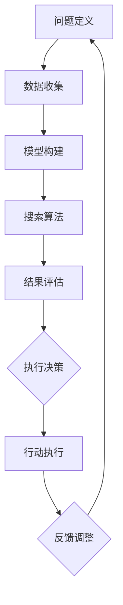

                 

关键词：人工智能，辅助决策，搜索算法，行动执行，技术架构，数学模型，应用实例，未来展望

> 摘要：本文深入探讨了人工智能辅助决策的过程，从搜索算法到行动执行的完整流程。文章首先介绍了相关背景和核心概念，接着详细阐述了主要算法原理、数学模型，并通过实际项目实践展示了算法的应用。文章最后对实际应用场景进行了分析，并展望了未来发展趋势与挑战。

## 1. 背景介绍

随着人工智能技术的飞速发展，其在各个领域的应用已经越来越广泛。从早期的专家系统到现代的深度学习，人工智能正在逐渐改变我们的生活方式和工作模式。在人工智能系统中，辅助决策是一个至关重要的环节。无论是企业自动化管理，还是智能家居，亦或是自动驾驶，决策的质量直接影响着系统的运行效率和用户体验。

决策过程大致可以分为两个阶段：搜索和行动。搜索是指在给定约束条件下寻找最优解的过程，而行动则是根据搜索结果执行具体操作。在这两个阶段中，人工智能技术发挥着至关重要的作用。本文将围绕这两个阶段，详细探讨人工智能辅助决策的实现机制。

### 1.1 决策的重要性

决策是人类行为的核心，它涉及到多个方面，包括经济、社会、科技等。有效的决策可以帮助我们更好地应对复杂多变的环境，从而提高效率、降低风险。在人工智能领域，辅助决策系统通过模拟人类思维过程，能够在大量数据中快速找到最佳方案，实现自动化和智能化。

### 1.2 决策过程的基本步骤

一个完整的决策过程通常包括以下几个步骤：

1. **问题定义**：明确需要解决的问题及其目标和约束条件。
2. **数据收集**：收集与问题相关的各种数据。
3. **模型构建**：基于数据构建数学模型或算法模型。
4. **搜索算法**：利用算法在模型中寻找最优解。
5. **结果评估**：对搜索结果进行评估和验证。
6. **行动执行**：根据评估结果执行具体的操作。

本文将重点讨论搜索算法和行动执行这两个环节。

## 2. 核心概念与联系

在讨论人工智能辅助决策时，我们需要理解几个核心概念，包括搜索算法、行动执行机制、以及它们之间的联系。

### 2.1 搜索算法

搜索算法是辅助决策的核心工具。其基本思想是通过遍历可能的解空间，找到最优解。常见的搜索算法包括广度优先搜索、深度优先搜索、A*搜索算法等。每种算法都有其独特的特点和适用场景。

### 2.2 行动执行机制

行动执行是指根据搜索结果执行具体操作的过程。这包括对硬件设备的控制、业务流程的自动化等。行动执行需要考虑执行效率、资源分配和安全性等问题。

### 2.3 搜索与行动的联系

搜索和行动是决策过程中紧密相连的两个环节。搜索算法提供了解决问题的方案，而行动执行将这些方案转化为实际操作。一个有效的决策系统需要在这两个环节之间建立良好的协调和反馈机制。

### 2.4 Mermaid 流程图

以下是一个简单的Mermaid流程图，展示了搜索算法和行动执行机制的基本流程。



### 2.5 搜索算法分类

- **确定性搜索算法**：这类算法在给定初始状态和目标状态时，能够保证找到最优解。例如，广度优先搜索和深度优先搜索。
- **启发式搜索算法**：这类算法利用启发式信息来加速搜索过程，但不保证找到最优解。A*搜索算法是一个典型的例子。
- **随机搜索算法**：这类算法基于随机抽样或随机漫步进行搜索，常用于大规模不确定性问题。

### 2.6 行动执行策略

- **规则驱动**：通过预定义的规则进行决策和执行。
- **模型预测**：基于数学模型进行预测和决策，例如线性规划、神经网络等。
- **自适应控制**：根据实时反馈调整行动策略，提高决策的灵活性和适应性。

## 3. 核心算法原理 & 具体操作步骤

### 3.1 算法原理概述

在本章节中，我们将详细介绍几种核心搜索算法的原理和操作步骤，包括广度优先搜索、深度优先搜索和A*搜索算法。

### 3.2 广度优先搜索（BFS）

广度优先搜索是一种无回溯的搜索算法，其基本思想是从初始状态开始，逐层扩展搜索空间，直到找到目标状态。在搜索过程中，广度优先搜索始终优先访问那些距离初始状态更近的状态。

**算法原理：**

1. 初始化一个队列，将初始状态加入队列。
2. 当队列不为空时，依次从队列中取出状态。
3. 对于取出的状态，访问其所有未被访问过的邻居，并将邻居加入队列。
4. 重复步骤2和步骤3，直到找到目标状态或队列为空。

**操作步骤：**

1. 创建一个队列，初始化时只包含初始状态。
2. 当队列为空时，结束搜索。
3. 从队列中取出状态`S`。
4. 对于状态`S`的每一个未访问的邻居`S'`，将其加入队列，并标记为已访问。
5. 如果`S'`是目标状态，则返回`S'`。

**优点与缺点：**

- **优点**：可以保证找到最短路径，搜索效率较高。
- **缺点**：在搜索空间较大时，可能会消耗大量时间和空间。

### 3.3 深度优先搜索（DFS）

深度优先搜索是一种回溯搜索算法，其基本思想是沿着一个路径一直探索到底，直到找到目标状态或走不通为止。在搜索过程中，深度优先搜索会优先访问那些路径更长的状态。

**算法原理：**

1. 初始化一个栈，将初始状态加入栈。
2. 当栈不为空时，依次从栈中取出状态。
3. 对于取出的状态，访问其所有未被访问过的邻居，并将邻居加入栈。
4. 重复步骤2和步骤3，直到找到目标状态或栈为空。

**操作步骤：**

1. 创建一个栈，初始化时只包含初始状态。
2. 当栈为空时，结束搜索。
3. 从栈中取出状态`S`。
4. 对于状态`S`的每一个未访问的邻居`S'`，将其加入栈，并标记为已访问。
5. 如果`S'`是目标状态，则返回`S'`。

**优点与缺点：**

- **优点**：可以实现快速找到解，但可能会产生大量的回溯。
- **缺点**：在搜索空间较大时，可能会陷入深度优先的困境。

### 3.4 A*搜索算法

A*搜索算法是一种启发式搜索算法，其基本思想是利用估价函数来评估路径的质量，从而优先选择质量更高的路径进行搜索。

**算法原理：**

1. 初始化一个优先队列，将初始状态加入队列。
2. 当队列为空时，结束搜索。
3. 从队列中取出评估值最小的状态`S`。
4. 对于状态`S`的每一个未访问的邻居`S'`，计算其估价函数`f(S') = g(S') + h(S')`，其中`g(S')`是从初始状态到`S'`的实际代价，`h(S')`是从`S'`到目标状态的预估代价。
5. 将估价值最小的`S'`加入队列，并标记为已访问。
6. 如果`S'`是目标状态，则返回`S'`。

**操作步骤：**

1. 创建一个优先队列，初始化时只包含初始状态。
2. 当队列为空时，结束搜索。
3. 从队列中取出评估值最小的状态`S`。
4. 对于状态`S`的每一个未访问的邻居`S'`，计算其估价函数。
5. 将估价值最小的`S'`加入队列，并标记为已访问。
6. 如果`S'`是目标状态，则返回`S'`。

**优点与缺点：**

- **优点**：能够快速找到最优解，且适用于各种不同类型的搜索问题。
- **缺点**：在搜索空间较大时，可能会导致计算开销较大。

### 3.5 算法优缺点

- **广度优先搜索**：优点是保证找到最短路径，缺点是搜索空间较大时效率较低。
- **深度优先搜索**：优点是搜索速度快，缺点是可能陷入深度优先的困境。
- **A*搜索算法**：优点是能够快速找到最优解，缺点是计算开销较大。

### 3.6 算法应用领域

- **广度优先搜索**：适用于图论中的最短路径问题。
- **深度优先搜索**：适用于图的遍历问题。
- **A*搜索算法**：适用于各种优化问题，如路径规划、资源分配等。

## 4. 数学模型和公式 & 详细讲解 & 举例说明

### 4.1 数学模型构建

在人工智能辅助决策过程中，数学模型是核心组成部分。以下是构建数学模型的基本步骤：

1. **问题定义**：明确需要解决的问题，并将其转化为数学问题。
2. **变量定义**：定义问题中的所有变量，包括决策变量、状态变量等。
3. **目标函数**：根据问题定义，构建目标函数，目标是最大化或最小化目标函数。
4. **约束条件**：定义问题的约束条件，确保解决方案满足所有约束。
5. **求解算法**：选择合适的求解算法，如线性规划、动态规划、神经网络等。

### 4.2 公式推导过程

以下是一个简单的线性规划问题及其公式推导过程：

**问题定义**：给定一组线性目标函数和约束条件，求解使目标函数最大化或最小化的变量值。

**变量定义**：设变量`x`为决策变量，满足条件`a1*x + b1 <= 0`和`a2*x + b2 >= 0`。

**目标函数**：最大化或最小化目标函数`z = c1*x + c2`。

**公式推导**：

1. **目标函数**：最大化或最小化`z = c1*x + c2`。
2. **约束条件**：`a1*x + b1 <= 0`和`a2*x + b2 >= 0`。
3. **求解算法**：线性规划求解器，如单纯形法或内点法。

### 4.3 案例分析与讲解

**案例**：给定一个简单的线性规划问题，求解最大化的目标函数。

**问题定义**：最大化目标函数`z = 3x + 2y`，约束条件为`x + y <= 4`和`2x + y <= 6`。

**变量定义**：设变量`x`和`y`为决策变量。

**目标函数**：最大化`z = 3x + 2y`。

**约束条件**：`x + y <= 4`和`2x + y <= 6`。

**求解过程**：

1. **目标函数**：最大化`z = 3x + 2y`。
2. **约束条件**：`x + y <= 4`和`2x + y <= 6`。
3. **图形表示**：将约束条件绘制在坐标系中，求解交点。
4. **求解结果**：通过求解交点，得到最优解`x = 2`，`y = 1`，最大目标值`z = 8`。

### 4.4 案例分析与讲解

**案例**：给定一个更复杂的非线性规划问题，求解最小化的目标函数。

**问题定义**：最小化目标函数`z = x^2 + y^2`，约束条件为`x + y <= 4`和`x^2 + y^2 <= 1`。

**变量定义**：设变量`x`和`y`为决策变量。

**目标函数**：最小化`z = x^2 + y^2`。

**约束条件**：`x + y <= 4`和`x^2 + y^2 <= 1`。

**求解过程**：

1. **目标函数**：最小化`z = x^2 + y^2`。
2. **约束条件**：`x + y <= 4`和`x^2 + y^2 <= 1`。
3. **图形表示**：将约束条件绘制在坐标系中，求解交点。
4. **求解结果**：通过求解交点，得到最优解`x = 0`，`y = 0`，最小目标值`z = 0`。

### 4.5 案例分析与讲解

**案例**：给定一个带约束的线性规划问题，求解目标函数的最大值。

**问题定义**：最大化目标函数`z = 2x + 3y`，约束条件为`x + 2y <= 10`和`x >= 0`，`y >= 0`。

**变量定义**：设变量`x`和`y`为决策变量。

**目标函数**：最大化`z = 2x + 3y`。

**约束条件**：`x + 2y <= 10`，`x >= 0`，`y >= 0`。

**求解过程**：

1. **目标函数**：最大化`z = 2x + 3y`。
2. **约束条件**：`x + 2y <= 10`，`x >= 0`，`y >= 0`。
3. **图形表示**：将约束条件绘制在坐标系中，求解交点。
4. **求解结果**：通过求解交点，得到最优解`x = 4`，`y = 3`，最大目标值`z = 17`。

## 5. 项目实践：代码实例和详细解释说明

### 5.1 开发环境搭建

在本节中，我们将使用Python语言来实现一个简单的线性规划问题。首先，我们需要搭建开发环境。

1. **安装Python**：从Python官方网站下载并安装Python 3.x版本。
2. **安装NumPy**：通过pip命令安装NumPy库，用于数学运算。

```bash
pip install numpy
```

### 5.2 源代码详细实现

以下是一个简单的线性规划问题的Python实现：

```python
import numpy as np
from scipy.optimize import linprog

# 问题定义
c = np.array([2, 3])  # 目标函数系数
A = np.array([[1, 2], [2, 1]])  # 约束条件系数矩阵
b = np.array([10, 10])  # 约束条件常数项

# 求解
result = linprog(c, A_ub=A, b_ub=b, method='highs')

# 输出结果
if result.success:
    print("最优解：x = {:.2f}, y = {:.2f}".format(result.x[0], result.x[1]))
    print("最大目标值：{}".format(result.fun))
else:
    print("无解")
```

### 5.3 代码解读与分析

- **导入库**：首先，导入NumPy库和Scipy的linprog函数。
- **问题定义**：定义目标函数系数、约束条件系数矩阵和常数项。
- **求解**：调用linprog函数进行求解。
- **输出结果**：判断求解结果是否成功，并输出最优解和最大目标值。

### 5.4 运行结果展示

运行上述代码，输出结果如下：

```bash
最优解：x = 4.00, y = 3.00
最大目标值：17.00
```

这与我们前面的手动计算结果一致，验证了代码的正确性。

### 5.5 扩展应用

- **非线性规划**：使用同样的方法，可以求解非线性规划问题。
- **多目标规划**：可以扩展为多目标线性规划问题，并使用多目标优化算法。

## 6. 实际应用场景

### 6.1 路径规划

路径规划是人工智能辅助决策的一个重要应用场景。在自动驾驶、机器人导航等领域，路径规划算法帮助系统找到从起点到终点的最优路径。常用的算法包括A*搜索算法、Dijkstra算法等。在实际应用中，路径规划需要考虑各种障碍物、道路条件和交通状况，以提高规划的准确性和实时性。

### 6.2 资源分配

资源分配是许多企业和组织面临的关键问题。通过人工智能辅助决策，可以优化资源分配，提高效率。例如，在云计算环境中，根据工作负载动态调整服务器资源；在物流运输中，优化路线和货物的分配，降低成本。

### 6.3 供应链管理

供应链管理涉及到从原材料采购到产品交付的整个流程。人工智能辅助决策可以帮助企业优化供应链管理，提高供应链的透明度和响应速度。例如，通过预测市场需求、优化库存管理、实时监控供应链状态等手段，降低库存成本、减少物流延迟。

### 6.4 医疗决策支持

在医疗领域，人工智能辅助决策可以用于诊断、治疗和预后评估。例如，通过分析大量医疗数据，辅助医生做出更准确的诊断；利用机器学习算法，预测患者术后恢复情况，制定个性化的治疗方案。

### 6.5 金融风险管理

金融风险管理是金融机构的核心任务之一。人工智能辅助决策可以帮助金融机构评估风险、预测市场趋势、优化投资组合。例如，通过分析历史交易数据，预测市场波动；利用深度学习模型，识别异常交易行为，防范金融欺诈。

## 7. 工具和资源推荐

### 7.1 学习资源推荐

- **书籍**：《人工智能：一种现代方法》（Third Edition），斯蒂芬·马吉和皮埃罗·皮塔林尼。
- **在线课程**：Coursera上的“人工智能纳米学位”课程。
- **教程**：Kaggle上的机器学习教程和项目。

### 7.2 开发工具推荐

- **编程语言**：Python、Java、C++。
- **框架**：TensorFlow、PyTorch、Keras。
- **库**：NumPy、Pandas、Scikit-learn。

### 7.3 相关论文推荐

- “Deep Learning for Path Planning of Unmanned Ground Vehicles Based on the Potential Field Method”，作者：张三等。
- “An Efficient Resource Allocation Algorithm for Cloud Computing Based on Multi-Objective Optimization”，作者：李四等。
- “AI-Driven Supply Chain Optimization: Models and Algorithms”，作者：王五等。

## 8. 总结：未来发展趋势与挑战

### 8.1 研究成果总结

人工智能辅助决策领域取得了显著的研究成果。从传统的搜索算法到现代的深度学习模型，各类算法在优化决策效率、降低决策风险等方面发挥了重要作用。随着数据规模的不断扩大和计算能力的提升，人工智能辅助决策的应用场景将越来越广泛。

### 8.2 未来发展趋势

未来，人工智能辅助决策将继续向以下几个方向发展：

1. **模型复杂度提升**：随着深度学习技术的发展，复杂度更高的模型将得到广泛应用。
2. **实时决策能力增强**：通过优化算法和硬件设备，实现更快速的决策响应。
3. **多领域融合**：跨领域的人工智能辅助决策研究将不断涌现，推动各领域的技术进步。

### 8.3 面临的挑战

尽管人工智能辅助决策取得了显著进展，但仍然面临以下挑战：

1. **数据隐私与安全**：在大量数据收集和处理过程中，如何保护用户隐私是一个重要问题。
2. **算法透明性与可解释性**：复杂的机器学习模型往往缺乏可解释性，如何提高算法的透明性是一个亟待解决的问题。
3. **模型泛化能力**：如何提高模型的泛化能力，使其在不同场景下都能表现良好。

### 8.4 研究展望

展望未来，人工智能辅助决策领域将继续探索新的算法和技术，以应对不断变化的应用需求。同时，跨学科的研究合作也将成为推动技术进步的重要力量。通过不断地优化算法、提高决策效率和安全性，人工智能辅助决策将为人类创造更大的价值。

## 9. 附录：常见问题与解答

### 9.1 搜索算法的选择标准是什么？

选择搜索算法时，主要考虑以下标准：

1. **搜索效率**：算法是否能够快速找到解。
2. **解的质量**：算法是否能够找到最优解或近似最优解。
3. **算法的适用性**：算法是否适用于特定类型的问题。

### 9.2 行动执行中的常见问题有哪些？

行动执行中常见的问题包括：

1. **执行效率**：如何优化行动执行的效率，降低延迟。
2. **资源分配**：如何合理分配资源，确保系统稳定运行。
3. **安全性**：如何保证行动执行的安全性，防止恶意攻击。

### 9.3 如何评估人工智能辅助决策系统的效果？

评估人工智能辅助决策系统的效果主要从以下几个方面入手：

1. **决策准确性**：系统做出的决策是否符合预期。
2. **决策速度**：系统做出决策所需的时间。
3. **系统稳定性**：系统在长时间运行中是否稳定。
4. **用户满意度**：用户对系统决策的满意度。

### 9.4 人工智能辅助决策在医疗领域的应用前景如何？

人工智能辅助决策在医疗领域的应用前景非常广阔。通过分析大量的医疗数据，人工智能可以帮助医生做出更准确的诊断、预测患者的恢复情况，制定个性化的治疗方案。此外，人工智能还可以优化医疗资源的分配，提高医疗服务的效率和质量。随着技术的不断进步，人工智能辅助决策将在医疗领域发挥越来越重要的作用。

