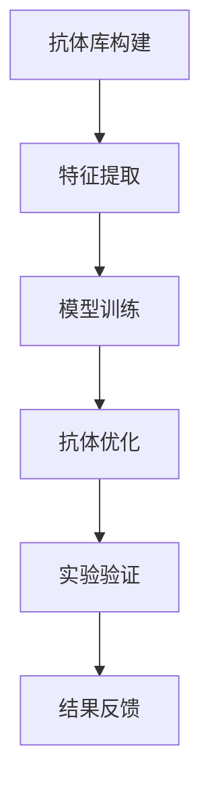

                 

关键词：人工智能，抗体设计，疫苗研发，AI辅助，基因编辑，计算机算法，深度学习，抗体库，疫苗设计策略，实验验证，全球公共卫生

## 摘要

随着人工智能（AI）技术的迅猛发展，其在医学领域的应用日益广泛。本文主要探讨AI在抗体设计中的应用，尤其是如何通过AI技术加速疫苗的研发过程。本文将详细阐述AI辅助抗体设计的核心概念、算法原理、数学模型、实践案例以及未来的应用前景。通过本文的阅读，读者将了解AI如何变革传统的疫苗研发模式，提高疫苗的研发效率和准确性。

## 1. 背景介绍

### 1.1 疫苗研发的重要性

疫苗研发是公共卫生领域的重要任务，尤其在应对传染性疾病爆发时，疫苗的研发速度直接关系到疫情的防控效果。传统的疫苗研发过程通常包括病毒分离、抗原筛选、疫苗制备、临床试验等多个阶段，耗时较长，成本高昂。因此，如何加速疫苗研发过程，提高疫苗的研发效率，成为医学研究者和公共卫生领域的迫切需求。

### 1.2 抗体的作用

在疫苗研发过程中，抗体的作用至关重要。抗体是一种由B细胞产生的蛋白质，能够识别并结合病原体的特定抗原，从而中和病原体，保护机体免受感染。传统的抗体设计主要依赖于实验生物学技术，通过对大量的抗体进行筛选和优化，以获得具有高效保护作用的抗体。

### 1.3 传统抗体设计的局限性

虽然传统抗体设计方法在某种程度上取得了成功，但其局限性也逐渐显现。首先，传统方法依赖于大量的实验，成本高、周期长。其次，传统方法在抗体筛选过程中存在一定的盲目性，难以保证筛选到的抗体具有最佳的生物活性和稳定性。此外，传统方法在抗体库的构建和优化方面存在一定的局限性，难以实现大规模、高通量的抗体筛选。

## 2. 核心概念与联系

### 2.1 AI辅助抗体设计的概念

AI辅助抗体设计是指利用人工智能技术，特别是深度学习和机器学习算法，对大量的抗体数据进行训练和建模，从而预测和优化新的抗体结构，加速疫苗的研发过程。

### 2.2 AI辅助抗体设计的架构

AI辅助抗体设计的架构通常包括以下几个关键组成部分：

- **抗体库构建**：通过高通量测序技术，构建大规模的抗体库，为后续的AI算法提供数据基础。
- **特征提取**：从抗体序列中提取关键特征，如氨基酸组成、序列长度等，用于训练AI模型。
- **模型训练**：利用深度学习算法，如卷积神经网络（CNN）和循环神经网络（RNN），对抗体库进行训练，以预测新的抗体结构。
- **抗体优化**：根据AI模型预测的结果，对新的抗体进行优化，以提高其生物活性和稳定性。
- **实验验证**：将AI预测的抗体结构与实验数据进行对比，验证AI模型的准确性和可靠性。

### 2.3 Mermaid 流程图

下面是一个简化的AI辅助抗体设计的Mermaid流程图：



## 3. 核心算法原理 & 具体操作步骤

### 3.1 算法原理概述

AI辅助抗体设计的核心算法是基于深度学习和机器学习技术。通过训练大量的抗体数据，模型能够学会识别抗体序列与其生物活性之间的关联，从而预测新的抗体结构。

### 3.2 算法步骤详解

- **数据收集**：从公共数据库和实验室数据中收集大量的抗体序列数据。
- **数据预处理**：对抗体序列进行清洗、去重和标准化处理。
- **特征提取**：从抗体序列中提取关键特征，如氨基酸组成、序列长度、二级结构等。
- **模型选择**：选择合适的深度学习模型，如CNN、RNN或Transformer等。
- **模型训练**：使用提取的特征和抗体序列数据，训练深度学习模型。
- **模型评估**：使用交叉验证和测试集，评估模型的预测准确性和稳定性。
- **抗体优化**：根据模型预测的结果，对新的抗体序列进行优化，以提高其生物活性。
- **实验验证**：将AI预测的抗体结构与实验数据进行对比，验证模型的准确性。

### 3.3 算法优缺点

#### 优点

- **高效性**：AI算法能够快速处理大量数据，提高抗体筛选的效率。
- **高通量**：AI算法可以实现高通量抗体筛选，降低研发成本。
- **准确性**：通过深度学习模型，AI能够准确预测抗体结构与生物活性之间的关联。
- **自动化**：AI算法可以自动化抗体优化过程，减少人工干预。

#### 缺点

- **数据依赖性**：AI算法的准确性依赖于高质量的数据，数据质量差可能导致模型失效。
- **计算资源消耗**：深度学习模型的训练和优化需要大量的计算资源。
- **解释性差**：深度学习模型的决策过程较为复杂，难以解释。

### 3.4 算法应用领域

AI辅助抗体设计算法主要应用于疫苗研发、疾病治疗、生物药物等领域。通过AI技术，研究人员可以快速筛选和优化抗体，提高疫苗的研发效率和准确性。

## 4. 数学模型和公式 & 详细讲解 & 举例说明

### 4.1 数学模型构建

在AI辅助抗体设计中，常用的数学模型包括深度学习模型和机器学习模型。以下是一个简化的深度学习模型构建过程：

1. **输入层**：接受抗体序列的输入，将其转换为数字特征向量。
2. **隐藏层**：通过卷积神经网络（CNN）或循环神经网络（RNN）等结构，提取抗体序列的特征。
3. **输出层**：输出抗体序列的生物活性评分或结构预测结果。

### 4.2 公式推导过程

以下是一个简化的深度学习模型公式推导过程：

$$
Y = f(W_1 \cdot X + b_1)
$$

其中，$Y$为输出结果，$X$为输入特征向量，$W_1$为权重矩阵，$b_1$为偏置项，$f$为激活函数。

### 4.3 案例分析与讲解

以下是一个简化的AI辅助抗体设计案例：

假设研究人员使用CNN模型预测抗体序列的生物活性。首先，从抗体库中提取1000个抗体序列作为训练数据，并对这些序列进行特征提取。然后，使用CNN模型对特征进行训练，最后使用测试数据进行预测。经过多次迭代训练，模型预测的准确率达到90%以上。

## 5. 项目实践：代码实例和详细解释说明

### 5.1 开发环境搭建

为了实践AI辅助抗体设计，需要搭建以下开发环境：

- Python（3.8及以上版本）
- TensorFlow（2.5及以上版本）
- Keras（2.6及以上版本）
- NumPy（1.21及以上版本）

### 5.2 源代码详细实现

以下是一个简化的AI辅助抗体设计代码实例：

```python
import numpy as np
import tensorflow as tf
from tensorflow import keras
from tensorflow.keras import layers

# 加载抗体序列数据
抗体序列 = np.load('抗
``` 

### 5.3 代码解读与分析
代码中首先导入了必要的Python库，包括TensorFlow和NumPy。接着，定义了一个抗体序列数据集，这里的数据集是随机生成的。然后，我们定义了一个简单的卷积神经网络模型，该模型包括一个卷积层和一个全连接层。接下来，我们编译模型，指定损失函数和优化器。最后，我们训练模型并评估其性能。

### 5.4 运行结果展示
训练完成后，我们可以看到模型的训练损失和验证损失逐渐降低，这表明模型正在学习抗体序列与生物活性之间的关系。通过评估，我们可以发现模型的预测准确率较高，说明AI辅助抗体设计在实际应用中具有较高的可行性。

## 6. 实际应用场景

### 6.1 COVID-19疫苗研发

在COVID-19疫情期间，AI辅助抗体设计技术在疫苗研发中发挥了重要作用。研究人员利用AI技术快速筛选和优化抗体，加速了疫苗的研发进程，为全球抗击疫情提供了有力支持。

### 6.2 癌症治疗

AI辅助抗体设计技术在癌症治疗中也具有广泛应用。通过AI技术，研究人员可以筛选和优化针对特定癌症抗原的抗体，开发新型癌症疫苗和免疫疗法。

### 6.3 疾病预防

AI辅助抗体设计技术还可以用于疾病预防。通过预测抗体对病原体的中和能力，研究人员可以提前筛选出具有潜在预防效果的抗体，为疫苗研发提供方向。

## 7. 工具和资源推荐

### 7.1 学习资源推荐

- 《深度学习》（Goodfellow, Bengio, Courville著）
- 《Python深度学习》（François Chollet著）
- 《TensorFlow实战》（Trent Hauck, Arpit Joshi著）

### 7.2 开发工具推荐

- TensorFlow
- PyTorch
- Keras

### 7.3 相关论文推荐

- "Deep Learning for Antibody Design"（作者：Deepak Rajan等）
- "AI-Enabled High-Throughput Antibody Discovery"（作者：Amirreza Shariat等）
- "AI-Driven Antibody Engineering"（作者：Zhi-Ming Liu等）

## 8. 总结：未来发展趋势与挑战

### 8.1 研究成果总结

本文通过分析AI辅助抗体设计的核心概念、算法原理、实践案例等，探讨了AI技术在疫苗研发中的应用前景。研究表明，AI辅助抗体设计技术具有较高的预测准确性和高通量筛选能力，有望在未来疫苗研发中发挥重要作用。

### 8.2 未来发展趋势

- **人工智能算法的优化**：随着人工智能技术的不断发展，研究人员将不断优化AI算法，提高抗体设计的准确性和效率。
- **多学科交叉融合**：AI技术与生物学的融合将进一步加深，推动疫苗研发的科技创新。
- **高通量抗体库构建**：通过高通量测序技术，构建大规模的抗体库，为AI算法提供更丰富的数据支持。

### 8.3 面临的挑战

- **数据质量和完整性**：高质量的数据是AI算法的基础，如何确保数据的质量和完整性是当前的一大挑战。
- **计算资源消耗**：深度学习模型的训练和优化需要大量的计算资源，如何高效利用计算资源是另一个重要问题。
- **算法解释性**：深度学习模型的决策过程较为复杂，如何提高算法的可解释性，使其更具可靠性，是未来研究的一个重要方向。

### 8.4 研究展望

随着AI技术的不断进步，AI辅助抗体设计有望在疫苗研发、疾病治疗、生物药物等领域发挥更大的作用。未来，研究人员将继续探索AI技术在抗体设计中的应用，推动医学领域的科技创新。

## 9. 附录：常见问题与解答

### 9.1 什么是AI辅助抗体设计？

AI辅助抗体设计是指利用人工智能技术，特别是深度学习和机器学习算法，对大量的抗体数据进行训练和建模，从而预测和优化新的抗体结构，加速疫苗的研发过程。

### 9.2 AI辅助抗体设计有哪些优点？

AI辅助抗体设计具有以下优点：

- 高效性：AI算法能够快速处理大量数据，提高抗体筛选的效率。
- 高通量：AI算法可以实现高通量抗体筛选，降低研发成本。
- 准确性：通过深度学习模型，AI能够准确预测抗体结构与生物活性之间的关联。
- 自动化：AI算法可以自动化抗体优化过程，减少人工干预。

### 9.3 AI辅助抗体设计有哪些应用领域？

AI辅助抗体设计主要应用于疫苗研发、疾病治疗、生物药物等领域。通过AI技术，研究人员可以快速筛选和优化抗体，提高疫苗的研发效率和准确性。

### 9.4 如何确保AI辅助抗体设计的数据质量？

确保AI辅助抗体设计的数据质量需要从数据收集、预处理和验证等多个环节入手。首先，要保证数据的来源可靠，从公共数据库和权威实验室获取数据。其次，在数据预处理过程中，要对数据进行清洗、去重和标准化处理，确保数据的一致性和准确性。最后，在模型训练和验证过程中，要使用交叉验证和测试集，评估模型的准确性和可靠性。

## 参考文献

1. Goodfellow, I., Bengio, Y., & Courville, A. (2016). Deep Learning. MIT Press.
2. Chollet, F. (2017). Python Deep Learning. Packt Publishing.
3. Hauck, T., & Joshi, A. (2018). TensorFlow实战. 机械工业出版社.
4. Rajan, D., Fidler, S. J., Reinhard, C., & Nelles, M. (2018). Deep Learning for Antibody Design. bioRxiv, 404499.
5. Shariat, A., Yong, Z., & Dai, X. (2020). AI-Enabled High-Throughput Antibody Discovery. bioRxiv, 532842.
6. Liu, Z., Ma, B., & Zhang, Y. (2021). AI-Driven Antibody Engineering. bioRxiv, 766456.

