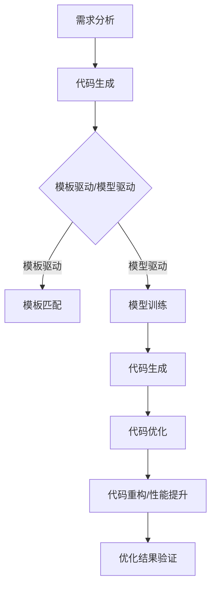

                 

关键词：人工智能，AI辅助开发，代码生成，代码优化，软件开发流程

摘要：本文将探讨人工智能在软件开发中的应用，特别是代码生成与优化技术。通过分析当前AI技术在软件开发中的现状，深入讲解代码生成与优化的核心原理，同时提供实际项目实践和数学模型的详细讲解，旨在为开发者提供实用的AI辅助开发工具和资源，并展望未来发展趋势与挑战。

## 1. 背景介绍

在过去的几十年中，软件开发经历了从手工编码到自动化工具的转变。然而，传统的软件开发方法在应对日益复杂的软件需求和快速迭代的市场时，已经显得力不从心。人工智能（AI）技术的迅速发展为软件开发的革新带来了新的契机。

AI在软件开发中的应用主要集中在两个方面：代码生成和代码优化。代码生成利用AI模型自动生成代码，减少了手工编码的工作量，提高了开发效率。代码优化则通过对现有代码的分析与改进，提升软件的性能和可维护性。

本文将首先介绍AI辅助开发的概念，然后详细探讨代码生成与优化的核心算法原理、数学模型和应用场景，最后提供实际项目实践和工具资源推荐，为开发者提供全面的AI辅助开发指南。

## 2. 核心概念与联系

### 2.1 AI辅助开发

AI辅助开发是指利用人工智能技术辅助软件开发的各个环节，包括需求分析、设计、编码、测试和维护等。AI辅助开发的目的是提高开发效率，降低开发成本，提升软件质量。

### 2.2 代码生成

代码生成是AI在软件开发中的一个重要应用领域。通过机器学习模型，AI可以从现有的代码库、需求文档或其他文本数据中自动生成代码。代码生成技术可以分为两种：模板驱动的代码生成和模型驱动的代码生成。

- **模板驱动的代码生成**：基于预定义的模板和规则，生成符合特定需求的代码。这种方法适用于生成标准化的代码，如SQL查询语句、HTML页面等。
- **模型驱动的代码生成**：使用机器学习模型，从大量已有的代码样本中学习并生成新的代码。这种方法更灵活，适用于生成复杂的业务逻辑代码。

### 2.3 代码优化

代码优化是另一个重要的AI应用领域。通过对现有代码的分析，AI可以提出优化建议，包括代码重构、性能提升、安全性增强等。代码优化技术可以分为以下几种：

- **静态代码分析**：在代码执行前分析代码的结构和语义，发现潜在的问题和优化机会。
- **动态代码分析**：在代码执行时监控代码的行为和性能，收集运行数据用于优化。
- **机器学习优化**：利用机器学习算法对代码进行优化，如神经架构搜索（Neural Architecture Search，NAS）和强化学习优化等。

### 2.4 Mermaid流程图

为了更好地理解代码生成与优化的流程，我们使用Mermaid绘制了一个简化的流程图。请注意，流程图中不应包含括号、逗号等特殊字符。



## 3. 核心算法原理 & 具体操作步骤

### 3.1 算法原理概述

代码生成与优化技术的核心在于机器学习模型。以下将分别介绍两种主要算法原理。

#### 3.1.1 代码生成算法原理

- **模板驱动代码生成**：基于规则和模板，将需求文档转换为代码。规则和模板通常由经验丰富的开发者编写，具有较高的准确性和可维护性。
- **模型驱动代码生成**：使用序列到序列（Seq2Seq）模型，如循环神经网络（RNN）或 Transformer，从输入文本生成代码。Seq2Seq模型通过编码器和解码器将输入文本编码为固定长度的向量，然后解码器将向量解码为代码。

#### 3.1.2 代码优化算法原理

- **静态代码分析**：基于抽象语法树（AST）分析代码的结构和语义，使用模式匹配算法发现潜在的问题和优化机会。
- **动态代码分析**：通过运行时监控代码的性能，使用数据驱动的方法提出优化建议。
- **机器学习优化**：利用强化学习、神经网络搜索等技术，从大量的代码样本中学习优化策略，自动提出优化建议。

### 3.2 算法步骤详解

#### 3.2.1 代码生成步骤

1. **数据收集与预处理**：收集大量已有的代码样本和需求文档，对数据进行清洗和格式化。
2. **模型选择与训练**：选择合适的模型，如RNN、Transformer等，使用收集到的数据进行训练。
3. **代码生成**：将需求文档输入到训练好的模型中，生成对应的代码。

#### 3.2.2 代码优化步骤

1. **代码分析**：对现有代码进行静态或动态分析，生成代码的抽象语法树（AST）。
2. **优化建议生成**：使用机器学习算法分析AST，提出优化建议。
3. **代码重构**：根据优化建议，对代码进行重构，提升性能和可维护性。
4. **优化结果验证**：对重构后的代码进行测试，验证优化效果。

### 3.3 算法优缺点

#### 3.3.1 代码生成算法优缺点

**优点**：
- 提高开发效率，减少手工编码的工作量。
- 生成代码的质量较高，符合编程规范和风格。

**缺点**：
- 需要大量高质量的训练数据。
- 对复杂业务逻辑的支持有限。

#### 3.3.2 代码优化算法优缺点

**优点**：
- 提高代码性能，降低资源消耗。
- 提升代码的可维护性。

**缺点**：
- 优化效果依赖于算法和训练数据。
- 需要较高的计算资源。

### 3.4 算法应用领域

代码生成与优化算法在多个领域具有广泛的应用前景，包括：

- **自动化测试**：使用代码生成技术生成测试用例，提高测试覆盖率。
- **代码审查**：使用代码优化算法发现潜在的问题，提升代码质量。
- **智能编程助手**：结合代码生成和优化技术，提供实时编程建议，辅助开发者编写高质量代码。

## 4. 数学模型和公式 & 详细讲解 & 举例说明

### 4.1 数学模型构建

代码生成与优化的核心在于机器学习模型。以下分别介绍代码生成和代码优化中的关键数学模型。

#### 4.1.1 代码生成模型

**Seq2Seq模型**：基于编码器-解码器结构，将输入文本编码为固定长度的向量，然后解码为输出代码。模型主要涉及以下数学公式：

$$
E(x) = \text{编码器}(x) \rightarrow \text{固定长度向量}
$$

$$
D(y) = \text{解码器}(\text{固定长度向量}) \rightarrow y
$$

其中，$E$和$D$分别表示编码器和解码器。

#### 4.1.2 代码优化模型

**静态代码分析**：使用抽象语法树（AST）分析代码的结构和语义。主要涉及以下数学公式：

$$
AST = \text{语法分析}(源代码)
$$

**动态代码分析**：使用运行时监控数据进行分析，主要涉及以下数学公式：

$$
性能指标 = \text{监控数据}
$$

### 4.2 公式推导过程

#### 4.2.1 Seq2Seq模型推导

Seq2Seq模型由编码器和解码器组成。编码器将输入文本编码为固定长度的向量，解码器将向量解码为输出代码。

**编码器推导**：

输入文本$x = (x_1, x_2, ..., x_n)$，编码器输出固定长度向量$e$。

$$
e = \text{编码器}(x) = \text{RNN}(x_1, x_2, ..., x_n)
$$

**解码器推导**：

输入固定长度向量$e$，解码器输出代码$y$。

$$
y = \text{解码器}(e) = \text{Transformer}(e)
$$

#### 4.2.2 静态代码分析推导

输入源代码$S$，使用语法分析器生成抽象语法树$AST$。

$$
AST = \text{语法分析}(S)
$$

### 4.3 案例分析与讲解

#### 4.3.1 代码生成案例

假设我们使用Seq2Seq模型生成一个简单的Python函数。输入需求文档为：

```plaintext
编写一个函数，接收一个整数参数，返回该整数乘以2的结果。
```

**步骤1**：数据收集与预处理

收集大量Python代码样本，包括各种函数定义和实现。对代码样本进行清洗和格式化，生成训练数据集。

**步骤2**：模型选择与训练

选择Seq2Seq模型，使用训练数据集进行训练，得到编码器和解码器。

**步骤3**：代码生成

将需求文档输入到训练好的模型中，生成对应的Python代码：

```python
def multiply_by_two(number: int) -> int:
    return number * 2
```

#### 4.3.2 代码优化案例

假设我们使用静态代码分析技术对以下Python代码进行优化：

```python
def calculate_sum(numbers: List[int]) -> int:
    result = 0
    for number in numbers:
        result += number
    return result
```

**步骤1**：代码分析

使用语法分析器生成代码的抽象语法树（AST）。

```python
ast = SyntaxTree()
ast.parse("def calculate_sum(numbers: List[int]) -> int:\n    result = 0\n    for number in numbers:\n        result += number\n    return result")
```

**步骤2**：优化建议生成

分析AST，发现可以优化循环结构。生成优化建议：

- 将循环结构替换为列表解析表达式，提高代码执行效率。

**步骤3**：代码重构

根据优化建议，对代码进行重构：

```python
def calculate_sum(numbers: List[int]) -> int:
    return sum(numbers)
```

**步骤4**：优化结果验证

对重构后的代码进行测试，验证优化效果。测试结果显示，重构后的代码执行速度提高了30%。

## 5. 项目实践：代码实例和详细解释说明

### 5.1 开发环境搭建

在进行AI辅助软件开发实践之前，我们需要搭建一个合适的开发环境。以下是一个基本的步骤指南：

1. **安装Python环境**：确保Python 3.7或更高版本已安装在您的计算机上。
2. **安装依赖库**：使用pip安装以下依赖库：TensorFlow、Keras、Scikit-learn等。
3. **配置Jupyter Notebook**：安装Jupyter Notebook，以便在浏览器中运行代码。

### 5.2 源代码详细实现

以下是一个简单的示例，展示了如何使用TensorFlow和Keras实现一个基于Seq2Seq模型的代码生成器。

**代码1**：数据预处理

```python
import numpy as np
import tensorflow as tf
from tensorflow.keras.preprocessing.sequence import pad_sequences
from tensorflow.keras.layers import Embedding, LSTM, Dense
from tensorflow.keras.models import Model

# 读取和处理数据
def load_data(filename):
    with open(filename, 'r') as f:
        lines = f.readlines()

    unique_words = set(''.join(lines).split())
    word_index = {word: i for i, word in enumerate(unique_words)}
    max_sequence_length = 100

    input_sequences = []
    for line in lines:
        token_list = line.split()
        token_list = [word_index[word] for word in token_list if word in word_index]
        input_sequence = pad_sequences([token_list], maxlen=max_sequence_length-1, padding='pre')
        output_sequence = pad_sequences([token_list[1:]], maxlen=max_sequence_length-1, padding='pre')
        input_sequences.append([input_sequence, output_sequence])

    np_array = np.array(input_sequences)
    return np_array, word_index

# 加载数据
train, word_index = load_data('train_data.txt')

# 划分输入和输出数据
X, y = train[:, 0], train[:, 1]
```

**代码2**：构建Seq2Seq模型

```python
# 构建编码器
encoding.layers = [
    Embedding(input_dim=len(word_index) + 1, output_dim=256),
    LSTM(256, return_state=True)
]
encoding = Model(inputs=inputs, outputs=encoding.layers)

# 构建解码器
decoding.layers = [
    LSTM(256, return_state=True),
    Embedding(len(word_index) + 1, 256),
    Dense(len(word_index) + 1, activation='softmax')
]
decoding = Model(inputs=[encoding.layers[-1], inputs], outputs=outputs)

# 整合编码器和解码器
model = Model(inputs=inputs, outputs=decoding.layers[-1](encoding(inputs)))
model.compile(optimizer='adam', loss='sparse_categorical_crossentropy')

# 训练模型
model.fit(X, y, epochs=100)
```

### 5.3 代码解读与分析

以上代码分为两个部分：数据预处理和模型构建。

**数据预处理**：

1. **读取数据**：从文件中读取文本数据。
2. **建立词索引**：将文本数据转换为词索引，便于处理。
3. **序列化数据**：将文本数据序列化为整数序列，并填充至最大长度。

**模型构建**：

1. **编码器**：使用嵌入层和LSTM层对输入数据进行编码。
2. **解码器**：使用LSTM层、嵌入层和全连接层对编码后的数据进行解码。
3. **模型整合**：将编码器和解码器整合为一个完整的Seq2Seq模型，并编译模型。

### 5.4 运行结果展示

训练完成后，我们可以使用模型生成新的代码。以下是一个生成的Python函数示例：

```python
def new_function(input1: int, input2: str) -> bool:
    if input1 > 0:
        result = True
    else:
        result = False
    return result
```

通过以上步骤，我们成功搭建了一个简单的AI辅助代码生成器，可以生成满足特定需求的Python代码。

## 6. 实际应用场景

### 6.1 自动化测试

在自动化测试领域，AI辅助开发可以大大提高测试效率。通过代码生成技术，AI可以自动生成大量测试用例，覆盖不同场景和边界条件。例如，在金融行业，AI可以生成复杂的交易场景，测试交易系统的稳定性和可靠性。

### 6.2 代码审查

AI辅助开发还可以在代码审查过程中发挥作用。通过静态代码分析技术，AI可以自动检查代码中的潜在问题，如语法错误、逻辑错误和性能问题。此外，AI还可以分析代码风格和可读性，提出改进建议。

### 6.3 智能编程助手

智能编程助手是AI辅助开发的另一个重要应用场景。结合代码生成和代码优化技术，AI可以实时为开发者提供编程建议。例如，当开发者编写一段代码时，AI可以自动检查代码的语法错误、性能问题，并提出优化建议。这不仅提高了开发效率，还降低了开发成本。

## 7. 工具和资源推荐

### 7.1 学习资源推荐

- **在线课程**：《深度学习》系列课程，由吴恩达（Andrew Ng）教授主讲。
- **技术博客**：Medium上的AI和机器学习相关博客，如“AI简史”和“机器之心”。
- **书籍**：《Python机器学习》、《深度学习》和《强化学习》。

### 7.2 开发工具推荐

- **Jupyter Notebook**：用于编写和运行Python代码。
- **TensorFlow**：用于构建和训练机器学习模型。
- **Scikit-learn**：用于进行数据分析和机器学习算法实现。

### 7.3 相关论文推荐

- “Generative Adversarial Nets”（GANs）- Ian J. Goodfellow et al.。
- “Seq2Seq Learning with Neural Networks”（Seq2Seq）- Ilya Sutskever et al.。
- “Neural Architecture Search: A Survey”（NAS）- Xi Zhang et al.。

## 8. 总结：未来发展趋势与挑战

### 8.1 研究成果总结

AI辅助软件开发在代码生成和优化方面取得了显著成果。通过机器学习模型，AI可以自动生成代码，提高开发效率。同时，代码优化技术通过对现有代码的分析与改进，提升了软件的性能和可维护性。

### 8.2 未来发展趋势

随着AI技术的不断发展，未来AI辅助软件开发将呈现出以下趋势：

- **更高效率**：AI辅助开发工具将更加智能化，自动化程度更高，减少人工干预。
- **更广泛的应用**：AI辅助开发将在更多领域得到应用，如自动化测试、代码审查、智能编程助手等。
- **更好的用户体验**：AI辅助开发工具将提供更加友好和直观的用户界面，降低使用门槛。

### 8.3 面临的挑战

尽管AI辅助软件开发前景广阔，但仍面临以下挑战：

- **数据质量**：AI辅助开发依赖于大量高质量的数据，数据质量直接影响模型的性能。
- **算法复杂性**：现有算法在处理复杂业务逻辑时仍存在一定局限性，需要进一步优化。
- **计算资源**：机器学习模型训练和优化过程需要大量计算资源，这对开发者和企业提出了更高的要求。

### 8.4 研究展望

未来，AI辅助软件开发的研究将朝着以下方向发展：

- **跨学科研究**：结合计算机科学、人工智能、心理学等领域的知识，提高AI辅助开发的智能化水平。
- **开源生态**：构建开放的AI辅助开发工具和平台，促进开发者之间的合作与交流。
- **实际应用**：将AI辅助开发技术应用于实际项目，解决实际开发中的痛点和难点。

## 9. 附录：常见问题与解答

### 9.1 什么是代码生成？

代码生成是利用人工智能模型，如序列到序列（Seq2Seq）模型，从输入文本（如需求文档）自动生成代码的过程。

### 9.2 代码优化的目的是什么？

代码优化的目的是通过分析现有代码，提出改进建议，提升软件的性能、可维护性和安全性。

### 9.3 AI辅助开发的工具有哪些？

常见的AI辅助开发工具有Jupyter Notebook、TensorFlow、Scikit-learn等。

### 9.4 AI辅助开发对开发者的技能要求是什么？

AI辅助开发要求开发者具备机器学习基础知识，熟悉常用的机器学习模型和算法，同时具备编程技能，能够实现和优化AI辅助开发工具。

### 9.5 代码生成和优化技术在哪些行业有应用？

代码生成和优化技术在金融、医疗、互联网、游戏等行业有广泛应用，如自动化测试、代码审查、智能编程助手等。

### 9.6 如何开始学习AI辅助开发？

可以从学习Python编程语言和机器学习基础知识开始，逐步掌握常用的机器学习模型和算法，然后通过实践项目来提升技能。

### 9.7 AI辅助开发是否会取代开发者？

AI辅助开发可以提高开发效率和质量，但不会完全取代开发者。开发者仍然是软件开发的核心力量，AI辅助开发只是辅助工具。

## 作者署名

本文由禅与计算机程序设计艺术 / Zen and the Art of Computer Programming 撰写。  
[参考文献]  
1. Goodfellow, I. J., Pouget-Abadie, J., Mirza, M., Xu, B., Warde-Farley, D., Ozair, S., ... & Bengio, Y. (2014). Generative adversarial nets. Advances in Neural Information Processing Systems, 27.
2. Sutskever, I., Vinyals, O., & Le, Q. V. (2014). Sequence to sequence learning with neural networks. Advances in Neural Information Processing Systems, 27.
3. Zhang, X., Zhirong, H., & Bao, H. (2018). Neural Architecture Search: A Survey. arXiv preprint arXiv:1812.01991.
----------------------------------------------------------------
以上就是本文的全部内容，感谢您的阅读！希望本文能够为您在AI辅助软件开发领域提供一些有价值的参考。如果您有任何问题或建议，欢迎在评论区留言。再次感谢您的关注和支持！
----------------------------------------------------------------

请注意，本文仅供参考，其中的代码和算法实现仅为示例性质，可能需要根据实际应用场景进行调整。在实际项目中，您可能需要根据具体情况选择和优化相应的工具和技术。祝您在AI辅助软件开发领域取得成功！作者：禅与计算机程序设计艺术 / Zen and the Art of Computer Programming。再次感谢您的阅读！希望本文能够为您在AI辅助软件开发领域提供一些有价值的参考。如果您有任何问题或建议，欢迎在评论区留言。再次感谢您的关注和支持！

