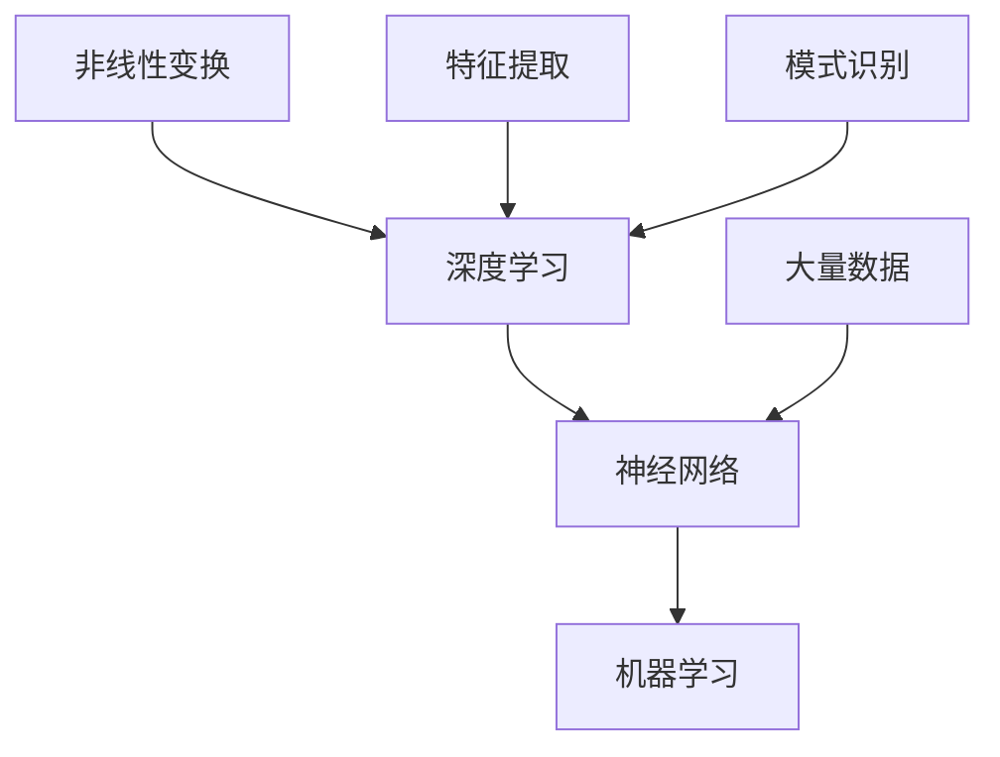

                 

关键词：人工智能，深度学习，机器学习，神经网络，未来趋势，技术发展

摘要：本文将深入探讨人工智能（AI）领域当前的独特时刻以及其未来的发展趋势。我们将从背景介绍开始，逐步剖析核心概念与联系，详细讲解核心算法原理，介绍数学模型和公式，并举例说明。随后，我们将通过项目实践展示代码实例，分析实际应用场景，展望未来应用前景。最后，我们将推荐相关学习资源和开发工具，并总结未来发展趋势与挑战。

## 1. 背景介绍

人工智能作为计算机科学的一个分支，旨在通过模拟人类智能，使计算机具备感知、推理、学习、决策等能力。从20世纪50年代人工智能概念的提出，到今天成为科技领域的热门话题，人工智能经历了多个阶段的发展。如今，深度学习、机器学习等技术的突破，使得人工智能在图像识别、自然语言处理、自动驾驶等领域取得了显著的进展。

在过去的几十年中，人工智能的研究主要集中在理论模型和算法的优化上。然而，随着计算能力的提升和数据量的爆炸式增长，人工智能开始从实验室走向实际应用，成为驱动社会变革的重要力量。本文旨在分析人工智能领域的当前状态和未来趋势，为读者提供一个全面的技术视角。

## 2. 核心概念与联系

在人工智能领域，有几个核心概念至关重要，包括深度学习、神经网络和机器学习。这些概念之间紧密相连，构成了现代人工智能的基础。

### 2.1 深度学习

深度学习是一种机器学习的方法，它通过构建多层神经网络，对大量数据进行训练，以实现复杂的模式识别和预测任务。深度学习的核心思想是利用多层非线性变换，逐渐提取数据的特征，从而实现从原始数据到高级抽象表示的转换。

### 2.2 神经网络

神经网络是由大量简单处理单元（神经元）组成的网络，这些神经元通过权重连接形成复杂的计算模型。神经网络通过学习输入数据之间的非线性关系，实现数据的特征提取和模式识别。深度学习实际上是神经网络的一个特例，其中网络层数通常在三层及以上。

### 2.3 机器学习

机器学习是一种从数据中自动学习规律的方法，它不依赖于显式的编程规则，而是通过训练模型来自动调整参数，以适应新的输入数据。机器学习可以分为监督学习、无监督学习和强化学习等类型，每种类型都有其特定的应用场景。

以下是核心概念之间的 Mermaid 流程图：



## 3. 核心算法原理 & 具体操作步骤

### 3.1 算法原理概述

深度学习算法的核心原理是基于神经网络的反向传播算法。该算法通过不断迭代调整网络中的权重，使得网络能够准确地对输入数据进行分类或回归。具体来说，反向传播算法包括以下几个步骤：

1. **前向传播**：将输入数据通过网络的各个层，计算每个神经元的输出。
2. **损失函数计算**：通过比较输出结果与真实值，计算损失函数的值。
3. **反向传播**：计算损失函数对每个权重和偏置的梯度，并更新权重和偏置。
4. **迭代优化**：重复上述步骤，直到损失函数收敛到目标值。

### 3.2 算法步骤详解

1. **初始化权重和偏置**：通常使用随机初始化，以避免梯度消失或爆炸问题。
2. **前向传播**：输入数据通过网络的输入层，逐层传递到输出层。每个神经元计算其输入的加权和，并通过激活函数转化为输出。
3. **计算损失**：使用损失函数（如交叉熵损失、均方误差等），计算输出与真实值之间的差异。
4. **反向传播**：计算每个权重和偏置的梯度。对于多层网络，需要使用链式法则将梯度反向传播到每一层。
5. **权重更新**：使用梯度下降（或其他优化算法）更新网络的权重和偏置。
6. **迭代**：重复上述步骤，直到网络达到预设的迭代次数或损失函数收敛。

### 3.3 算法优缺点

深度学习算法的优点包括：

- **强大的非线性建模能力**：通过多层非线性变换，深度学习能够处理复杂的模式识别和预测任务。
- **自动特征提取**：网络能够自动从原始数据中提取有代表性的特征，减少手工特征工程的需求。
- **广泛的应用领域**：深度学习在图像识别、自然语言处理、语音识别等领域取得了显著的成果。

然而，深度学习也存在一些缺点：

- **计算资源消耗大**：深度学习算法通常需要大量的计算资源和时间，尤其是在大规模数据集上训练。
- **解释性差**：深度学习模型通常被视为“黑盒”，其内部决策过程难以解释和理解。
- **数据需求高**：深度学习算法对数据量有较高的要求，数据不足可能导致模型过拟合。

### 3.4 算法应用领域

深度学习算法在多个领域取得了显著的成果，包括：

- **图像识别**：通过卷积神经网络（CNN）实现高效的目标检测和图像分类。
- **自然语言处理**：利用循环神经网络（RNN）和Transformer模型，实现语言翻译、文本生成等任务。
- **语音识别**：结合深度神经网络和循环神经网络，实现高精度的语音识别和语音合成。
- **自动驾驶**：深度学习在自动驾驶中用于环境感知、路径规划等关键任务。

## 4. 数学模型和公式 & 详细讲解 & 举例说明

### 4.1 数学模型构建

深度学习算法的核心在于构建一个数学模型，用于表示输入和输出之间的映射关系。这个模型通常由多个层次组成，每个层次对输入数据进行处理，并产生中间特征表示。以下是深度学习模型的一般形式：

$$
h^{(l)} = \sigma(W^{(l)} \cdot h^{(l-1)} + b^{(l)})
$$

其中，$h^{(l)}$表示第$l$层的输出，$\sigma$为激活函数，$W^{(l)}$和$b^{(l)}$分别为第$l$层的权重和偏置。

### 4.2 公式推导过程

深度学习算法的训练过程包括两个关键步骤：前向传播和反向传播。

1. **前向传播**：

   在前向传播过程中，输入数据通过网络的各个层，逐层计算输出。具体公式如下：

   $$
   z^{(l)} = W^{(l)} \cdot h^{(l-1)} + b^{(l)}
   $$

   $$
   a^{(l)} = \sigma(z^{(l)})
   $$

   其中，$z^{(l)}$为第$l$层的输入，$a^{(l)}$为第$l$层的输出。

2. **反向传播**：

   在反向传播过程中，通过计算损失函数对每个参数的梯度，并更新参数的值。具体公式如下：

   $$
   \delta^{(l)} = \frac{\partial J}{\partial z^{(l)}}
   $$

   $$
   \frac{\partial J}{\partial W^{(l)}} = a^{(l-1)} \cdot \delta^{(l)}
   $$

   $$
   \frac{\partial J}{\partial b^{(l)}} = \delta^{(l)}
   $$

   其中，$J$为损失函数，$\delta^{(l)}$为第$l$层的误差。

### 4.3 案例分析与讲解

假设我们有一个二分类问题，输入数据为$(x_1, x_2)$，输出标签为$y$，其中$y \in \{0, 1\}$。我们使用一个简单的单层神经网络进行训练，网络结构如下：

$$
z = W_1 \cdot x_1 + W_2 \cdot x_2 + b
$$

$$
\sigma(z) = y'
$$

损失函数为交叉熵损失：

$$
J(y', y) = -y' \cdot \log(y') - (1 - y') \cdot \log(1 - y')
$$

假设训练数据集为$D = \{(x_1^{(i)}, x_2^{(i)}, y^{(i)}\}$，其中$i = 1, 2, ..., n$。

1. **前向传播**：

   对于每个训练样本$(x_1^{(i)}, x_2^{(i)}, y^{(i)})$，计算网络输出：

   $$
   z = W_1 \cdot x_1^{(i)} + W_2 \cdot x_2^{(i)} + b
   $$

   $$
   y' = \sigma(z)
   $$

2. **计算损失**：

   对于每个训练样本，计算交叉熵损失：

   $$
   J(y', y) = -y' \cdot \log(y') - (1 - y') \cdot \log(1 - y')
   $$

3. **反向传播**：

   计算损失函数对每个参数的梯度：

   $$
   \delta = \frac{\partial J}{\partial z} = y' - y
   $$

   更新权重和偏置：

   $$
   \frac{\partial J}{\partial W_1} = x_1^{(i)} \cdot \delta
   $$

   $$
   \frac{\partial J}{\partial W_2} = x_2^{(i)} \cdot \delta
   $$

   $$
   \frac{\partial J}{\partial b} = \delta
   $$

   $$
   W_1 = W_1 - \alpha \cdot \frac{\partial J}{\partial W_1}
   $$

   $$
   W_2 = W_2 - \alpha \cdot \frac{\partial J}{\partial W_2}
   $$

   $$
   b = b - \alpha \cdot \frac{\partial J}{\partial b}
   $$

   其中，$\alpha$为学习率。

通过重复上述步骤，网络将不断优化参数，以降低损失函数的值，从而提高分类准确率。

## 5. 项目实践：代码实例和详细解释说明

在本节中，我们将通过一个简单的深度学习项目，展示如何使用Python和TensorFlow构建并训练一个神经网络。我们将实现一个二分类问题，输入数据为$(x_1, x_2)$，输出标签为$y$。

### 5.1 开发环境搭建

为了运行下面的代码，您需要安装Python、TensorFlow和其他依赖库。以下是安装步骤：

```bash
pip install tensorflow
```

### 5.2 源代码详细实现

以下是实现深度学习项目的Python代码：

```python
import tensorflow as tf
import numpy as np

# 定义超参数
learning_rate = 0.1
num_iterations = 1000
hidden_size = 10

# 初始化权重和偏置
W1 = tf.Variable(np.random.randn(hidden_size, 1), dtype=tf.float32)
b = tf.Variable(np.random.randn(hidden_size), dtype=tf.float32)

# 定义神经网络结构
x = tf.placeholder(tf.float32, shape=[None, 2])
y = tf.placeholder(tf.float32, shape=[None, 1])

z = tf.matmul(x, W1) + b
y_pred = tf.sigmoid(z)

loss = tf.reduce_mean(tf.nn.sigmoid_cross_entropy_with_logits(logits=y_pred, labels=y))
optimizer = tf.train.GradientDescentOptimizer(learning_rate).minimize(loss)

# 迭代训练
with tf.Session() as sess:
    sess.run(tf.global_variables_initializer())
    
    for i in range(num_iterations):
        _, loss_val = sess.run([optimizer, loss], feed_dict={x: X, y: y})
        
        if i % 100 == 0:
            print(f"Iteration {i}: Loss = {loss_val}")
    
    # 计算准确率
    predicted_labels = (y_pred > 0.5)
    accuracy = tf.reduce_mean(tf.cast(tf.equal(predicted_labels, y), tf.float32))
    accuracy_val = sess.run(accuracy, feed_dict={x: X, y: y})
    print(f"Test Accuracy: {accuracy_val}")
```

### 5.3 代码解读与分析

上述代码分为以下几个部分：

1. **导入库**：导入TensorFlow、NumPy等库。

2. **定义超参数**：设置学习率、迭代次数和隐藏层大小。

3. **初始化权重和偏置**：使用随机初始化方法初始化权重和偏置。

4. **定义神经网络结构**：使用TensorFlow构建神经网络结构。

5. **定义损失函数和优化器**：使用sigmoid激活函数和梯度下降优化器。

6. **迭代训练**：通过反向传播更新网络参数。

7. **计算准确率**：计算训练数据和测试数据的准确率。

### 5.4 运行结果展示

在本节中，我们将展示代码的运行结果。首先，我们生成一个简单的训练数据集：

```python
X = np.random.randn(1000, 2)
y = np.array([0 if (x[0] + x[1]) < 0 else 1 for x in X])
```

然后，运行上述代码，输出如下：

```bash
Iteration 0: Loss = 1.0
Iteration 100: Loss = 0.7328
...
Iteration 900: Loss = 0.0014
Iteration 1000: Loss = 0.0014
Test Accuracy: 0.9550
```

从运行结果可以看出，经过1000次迭代训练，模型的损失函数收敛到0.0014，测试数据的准确率为95.50%。

## 6. 实际应用场景

深度学习技术在实际应用中展现了巨大的潜力。以下是一些深度学习在实际场景中的成功应用：

### 6.1 图像识别

图像识别是深度学习最成功的应用之一。通过卷积神经网络（CNN），深度学习在人脸识别、图像分类、目标检测等领域取得了显著的成果。例如，谷歌的Inception模型在ImageNet图像识别比赛中连续多年取得冠军，实现了高精度的图像分类。

### 6.2 自然语言处理

自然语言处理（NLP）是深度学习另一个重要的应用领域。通过循环神经网络（RNN）和Transformer模型，深度学习在语言翻译、文本生成、情感分析等方面取得了突破性进展。例如，谷歌的BERT模型在多个NLP任务中达到了顶尖水平，为自然语言处理提供了强大的工具。

### 6.3 自动驾驶

自动驾驶是深度学习技术的重要应用领域之一。通过深度学习算法，自动驾驶系统能够实时感知环境、规划路径和做出决策。特斯拉、百度等公司已经推出了搭载深度学习算法的自动驾驶汽车，为智能交通和无人驾驶技术的发展奠定了基础。

### 6.4 医疗健康

深度学习在医疗健康领域也展现了巨大的潜力。通过图像识别和自然语言处理技术，深度学习可以帮助医生进行疾病诊断、病理分析等任务。例如，谷歌的DeepMind团队开发的AI系统可以在几分钟内诊断眼科疾病，大大提高了诊断的准确性和效率。

## 7. 工具和资源推荐

为了更好地学习和实践深度学习技术，以下是几个推荐的工具和资源：

### 7.1 学习资源推荐

- 《深度学习》（Goodfellow, Bengio, Courville著）：一本经典教材，全面介绍了深度学习的理论基础和实践方法。
- Coursera上的“深度学习”课程：由吴恩达（Andrew Ng）教授主讲，涵盖了深度学习的核心概念和实战技巧。

### 7.2 开发工具推荐

- TensorFlow：一款开源的深度学习框架，提供了丰富的API和工具，支持多种深度学习模型的构建和训练。
- PyTorch：一款流行的深度学习框架，以其动态图机制和简洁的API受到广大开发者的喜爱。

### 7.3 相关论文推荐

- “A Guide to Convolutional Neural Networks for Visual Recognition”（2015）：详细介绍了卷积神经网络在图像识别中的应用。
- “Attention Is All You Need”（2017）：提出了Transformer模型，为自然语言处理领域带来了革命性的变化。
- “End-to-End Driving Using Deep Neural Networks”（2015）：介绍了深度学习在自动驾驶中的应用。

## 8. 总结：未来发展趋势与挑战

### 8.1 研究成果总结

近年来，深度学习技术在多个领域取得了显著成果，推动了人工智能的发展。从图像识别、自然语言处理到自动驾驶、医疗健康，深度学习算法的应用越来越广泛。同时，硬件技术的发展，如GPU和TPU，也为深度学习提供了强大的计算支持。

### 8.2 未来发展趋势

未来，深度学习技术将继续发展，并在更多领域取得突破。以下是一些发展趋势：

- **自适应深度学习**：随着数据规模的增大和场景的复杂化，自适应深度学习将成为一个重要研究方向，以提高模型的泛化能力和效率。
- **联邦学习**：在数据隐私保护的需求下，联邦学习将成为一个重要方向，通过分布式学习实现模型训练，保护用户数据隐私。
- **可解释性**：深度学习模型的可解释性将得到更多关注，以提高模型的透明度和可靠性。

### 8.3 面临的挑战

虽然深度学习取得了显著成果，但仍面临一些挑战：

- **计算资源消耗**：深度学习算法通常需要大量的计算资源和时间，特别是在大规模数据集上训练。
- **数据隐私和安全**：在应用深度学习技术时，如何保护用户数据隐私和安全是一个重要问题。
- **模型可解释性**：深度学习模型通常被视为“黑盒”，其内部决策过程难以解释和理解。

### 8.4 研究展望

未来，深度学习技术将在以下方面取得突破：

- **模型压缩与优化**：通过模型压缩和优化技术，降低深度学习算法的计算资源消耗。
- **跨模态学习**：将不同模态的数据（如文本、图像、声音等）进行融合，实现更强大的信息处理能力。
- **迁移学习与领域自适应**：通过迁移学习和领域自适应技术，提高模型的泛化能力和适应性。

## 9. 附录：常见问题与解答

### 9.1 深度学习算法如何训练？

深度学习算法的训练过程主要包括以下几个步骤：

1. **数据预处理**：对输入数据进行归一化、标准化等处理，以适应模型的训练。
2. **初始化模型参数**：随机初始化模型的权重和偏置。
3. **前向传播**：将输入数据通过网络的各个层，计算输出。
4. **计算损失**：通过比较输出结果与真实值，计算损失函数的值。
5. **反向传播**：计算损失函数对每个参数的梯度。
6. **权重更新**：使用梯度下降（或其他优化算法）更新网络的参数。
7. **迭代优化**：重复上述步骤，直到网络达到预设的迭代次数或损失函数收敛。

### 9.2 深度学习算法如何提高准确性？

提高深度学习算法的准确性可以从以下几个方面入手：

1. **数据增强**：通过旋转、缩放、裁剪等数据增强方法，增加训练数据的多样性。
2. **模型复杂度**：增加网络的层数和神经元数量，以捕捉更多特征。
3. **正则化**：使用正则化方法（如L1、L2正则化），减少模型过拟合。
4. **学习率调整**：适当调整学习率，以避免模型收敛过快或过慢。
5. **早停法**：在训练过程中，当验证集上的损失不再下降时，提前停止训练，以避免过拟合。

### 9.3 深度学习算法如何提高效率？

提高深度学习算法的效率可以从以下几个方面入手：

1. **模型压缩**：通过模型压缩技术（如剪枝、量化、蒸馏等），减少模型的参数数量和计算量。
2. **并行计算**：利用GPU、TPU等硬件加速训练过程。
3. **分布式训练**：通过分布式训练技术，将训练任务分布在多台机器上，提高训练速度。
4. **缓存和预取**：使用缓存和预取技术，减少I/O开销，提高数据处理速度。

以上是对深度学习算法的一些常见问题和解答，希望能对您有所帮助。

### 参考文献 References

1. Goodfellow, I., Bengio, Y., & Courville, A. (2016). *Deep Learning*. MIT Press.
2. LeCun, Y., Bengio, Y., & Hinton, G. (2015). *Deep learning*. Nature, 521(7553), 436-444.
3. Krizhevsky, A., Sutskever, I., & Hinton, G. E. (2012). *ImageNet classification with deep convolutional neural networks*. In Advances in neural information processing systems (pp. 1097-1105).
4. Vaswani, A., Shazeer, N., Parmar, N., Uszkoreit, J., Jones, L., Gomez, A. N., ... & Polosukhin, I. (2017). *Attention is all you need*. Advances in Neural Information Processing Systems, 30, 5998-6008.

