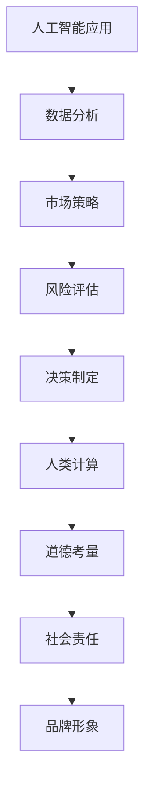

                 

关键词：人工智能，商业应用，道德考量，技术创新，人类计算，伦理问题

> 摘要：随着人工智能（AI）技术的飞速发展，AI在商业领域的应用越来越广泛。然而，AI技术的快速推进也带来了一系列道德和伦理问题。本文旨在探讨人类计算在商业中面临的道德考量因素，分析AI驱动的创新如何影响商业运作，并探讨未来发展的挑战和机遇。

## 1. 背景介绍

人工智能作为计算机科学的一个分支，已经在各个领域取得了显著的进展。从早期的规则系统到现代的深度学习算法，AI技术不断演进，逐渐成为推动社会发展和创新的重要力量。在商业领域，AI的应用不仅提高了效率和准确性，还为商业决策提供了有力的支持。然而，随着AI技术的广泛应用，我们也开始面临一系列道德和伦理问题，这些问题的处理对于确保AI技术的可持续发展至关重要。

本文将重点关注以下几个方面：

1. **AI在商业中的应用现状**：介绍AI技术在不同商业领域的应用案例，分析其带来的变革和影响。
2. **人类计算的道德考量**：探讨AI技术发展中人类计算所面临的道德和伦理问题，包括隐私、透明度、责任分配等。
3. **解决方案与对策**：提出解决AI道德考量问题的方法，讨论政策、技术和文化层面的对策。
4. **未来展望**：分析AI技术在商业中的未来发展趋势，探讨可能面临的挑战和机遇。

## 2. 核心概念与联系

在探讨AI驱动的创新及其道德考量之前，我们需要明确一些核心概念，并理解它们之间的相互关系。

### 2.1 人工智能与商业

人工智能（AI）是一种模拟人类智能的计算机技术，它通过算法和数据分析实现学习、推理和决策。在商业领域，AI技术的应用范围广泛，包括但不限于：

- **客户服务**：使用聊天机器人和虚拟助手提供高效、个性化的客户服务。
- **市场分析**：通过数据挖掘和分析，帮助企业制定精准的市场策略。
- **供应链管理**：优化库存和物流，降低运营成本。
- **风险管理**：使用AI技术识别和预测潜在的商业风险。

这些应用不仅提高了商业运作的效率，还为企业带来了创新和竞争优势。

### 2.2 道德考量与商业决策

道德考量是指在进行商业决策时，必须考虑的伦理和道德因素。这些因素包括：

- **隐私保护**：在收集和使用客户数据时，必须尊重客户的隐私权。
- **透明度**：AI系统的工作原理和决策过程应该对用户透明，避免黑箱操作。
- **责任分配**：在AI系统出现错误或造成损害时，责任应由谁承担。

这些道德考量不仅关乎企业的社会责任，还直接影响企业的品牌形象和用户信任。

### 2.3 人类计算与AI

人类计算是指人类在商业决策中发挥的作用，包括数据分析、风险评估和决策制定等。与AI技术相比，人类计算具有直觉、创造力和情感等优势。然而，在处理大规模数据和复杂决策时，AI技术的效率和准确性往往超过人类计算。

因此，人类计算与AI的结合成为商业领域的重要趋势。通过AI技术辅助人类计算，可以更快速、准确地做出决策，同时保持人类的创造力和道德考量。

### 2.4 Mermaid 流程图

以下是一个简化的Mermaid流程图，展示了AI在商业中的应用以及道德考量之间的联系：



## 3. 核心算法原理 & 具体操作步骤

### 3.1 算法原理概述

AI在商业中的应用通常基于以下几个核心算法原理：

1. **机器学习（Machine Learning）**：通过从数据中学习模式和规律，实现自动预测和分类。
2. **深度学习（Deep Learning）**：基于神经网络的结构，通过多层非线性变换处理复杂数据。
3. **自然语言处理（Natural Language Processing, NLP）**：使计算机能够理解和生成自然语言，用于客户服务、文本分析等。
4. **强化学习（Reinforcement Learning）**：通过试错和奖励机制，使AI在特定环境中做出最优决策。

### 3.2 算法步骤详解

以下是一个简化的AI算法应用流程：

1. **数据收集**：收集相关的商业数据，包括历史交易记录、客户行为数据等。
2. **数据预处理**：清洗和整理数据，使其适合用于算法训练。
3. **模型选择**：根据应用需求选择合适的算法模型，如决策树、神经网络等。
4. **模型训练**：使用训练数据集训练模型，调整模型参数以优化性能。
5. **模型评估**：使用验证数据集评估模型性能，确保其在未知数据上的表现良好。
6. **模型部署**：将训练好的模型部署到生产环境中，用于实际业务应用。
7. **监控与调整**：持续监控模型性能，根据业务需求进行调整和优化。

### 3.3 算法优缺点

- **优点**：
  - 提高效率：自动化处理大量数据，减少人工工作量。
  - 准确性高：通过训练数据学习，模型在特定任务上表现出色。
  - 可扩展性：适用于不同规模的数据和业务场景。

- **缺点**：
  - 需要大量数据：高质量的数据是算法训练的基础。
  - 难以解释：许多AI模型是“黑箱”，难以理解其内部机制。
  - 可能引入偏差：算法模型的训练数据可能存在偏见，导致预测结果不准确。

### 3.4 算法应用领域

AI技术在商业领域有广泛的应用，包括但不限于：

- **金融服务**：通过风险评估和预测，提高信用评估和风险管理能力。
- **零售业**：使用客户行为分析和推荐系统，提高客户满意度和销售额。
- **医疗保健**：利用医疗数据分析和诊断，提高疾病预测和治疗方案制定。
- **制造业**：通过预测维护和供应链优化，提高生产效率和降低成本。

## 4. 数学模型和公式 & 详细讲解 & 举例说明

### 4.1 数学模型构建

在AI技术中，数学模型是核心组成部分。以下是一个简化的线性回归模型构建过程：

1. **假设**：假设数据符合线性关系，即 \(y = \beta_0 + \beta_1x + \epsilon\)，其中 \(y\) 是因变量，\(x\) 是自变量，\(\beta_0\) 和 \(\beta_1\) 是模型参数，\(\epsilon\) 是误差项。
2. **模型表示**：将上述关系用数学公式表示为 \(y = \beta_0 + \beta_1x + \epsilon\)。
3. **模型训练**：通过最小化误差平方和（Least Squares Method）来求解 \(\beta_0\) 和 \(\beta_1\) 的值，使得模型预测值与实际值之间的误差最小。

### 4.2 公式推导过程

线性回归模型的参数估计可以通过以下公式推导：

$$
\begin{aligned}
\min_{\beta_0, \beta_1} \sum_{i=1}^n (y_i - (\beta_0 + \beta_1x_i))^2
\end{aligned}
$$

对上述公式求导，得到：

$$
\begin{aligned}
\frac{\partial}{\partial \beta_0} \sum_{i=1}^n (y_i - (\beta_0 + \beta_1x_i))^2 &= -2 \sum_{i=1}^n (y_i - \beta_0 - \beta_1x_i) \\
\frac{\partial}{\partial \beta_1} \sum_{i=1}^n (y_i - (\beta_0 + \beta_1x_i))^2 &= -2 \sum_{i=1}^n (x_i (y_i - \beta_0 - \beta_1x_i))
\end{aligned}
$$

令上述导数为零，得到：

$$
\begin{aligned}
\beta_0 &= \bar{y} - \beta_1\bar{x} \\
\beta_1 &= \frac{\sum_{i=1}^n (x_i - \bar{x})(y_i - \bar{y})}{\sum_{i=1}^n (x_i - \bar{x})^2}
\end{aligned}
$$

其中，\(\bar{x}\) 和 \(\bar{y}\) 分别是自变量和因变量的均值。

### 4.3 案例分析与讲解

假设我们有以下数据集：

| x | y |
|---|---|
| 1 | 2 |
| 2 | 4 |
| 3 | 6 |
| 4 | 8 |

使用线性回归模型进行参数估计，首先计算均值：

$$
\begin{aligned}
\bar{x} &= \frac{1+2+3+4}{4} = 2.5 \\
\bar{y} &= \frac{2+4+6+8}{4} = 5
\end{aligned}
$$

然后，计算斜率和截距：

$$
\begin{aligned}
\beta_1 &= \frac{(1-2.5)(2-5) + (2-2.5)(4-5) + (3-2.5)(6-5) + (4-2.5)(8-5)}{(1-2.5)^2 + (2-2.5)^2 + (3-2.5)^2 + (4-2.5)^2} \\
&= \frac{(-1.5)(-3) + (-0.5)(-1) + (0.5)(1) + (1.5)(3)}{2.25 + 0.25 + 0.25 + 2.25} \\
&= \frac{4.5 + 0.5 + 0.5 + 4.5}{5} \\
&= 2
\end{aligned}
$$

$$
\begin{aligned}
\beta_0 &= 5 - 2 \cdot 2.5 \\
&= 0
\end{aligned}
$$

因此，线性回归模型为 \(y = 2x\)。使用该模型进行预测，当 \(x = 5\) 时，预测值为 \(y = 10\)。

## 5. 项目实践：代码实例和详细解释说明

### 5.1 开发环境搭建

为了实践线性回归模型的构建和应用，我们需要安装以下软件和工具：

- Python 3.8 或更高版本
- Jupyter Notebook（用于编写和运行代码）
- Scikit-learn（用于线性回归模型）

在终端中运行以下命令安装所需的库：

```bash
pip install python==3.8
pip install jupyter
pip install scikit-learn
```

### 5.2 源代码详细实现

以下是一个使用 Scikit-learn 库实现线性回归模型的 Python 代码实例：

```python
import numpy as np
import matplotlib.pyplot as plt
from sklearn.linear_model import LinearRegression
from sklearn.model_selection import train_test_split

# 数据集
X = np.array([[1], [2], [3], [4]])
y = np.array([2, 4, 6, 8])

# 划分训练集和测试集
X_train, X_test, y_train, y_test = train_test_split(X, y, test_size=0.2, random_state=0)

# 创建线性回归模型
model = LinearRegression()

# 训练模型
model.fit(X_train, y_train)

# 模型评估
score = model.score(X_test, y_test)
print("模型评分：", score)

# 预测
y_pred = model.predict(X_test)

# 绘制结果
plt.scatter(X_test, y_test, color='blue')
plt.plot(X_test, y_pred, color='red', linewidth=2)
plt.xlabel('x')
plt.ylabel('y')
plt.show()
```

### 5.3 代码解读与分析

- **数据集**：使用 NumPy 库创建一个包含自变量 \(x\) 和因变量 \(y\) 的数据集。
- **划分训练集和测试集**：使用 Scikit-learn 库的 `train_test_split` 函数将数据集划分为训练集和测试集，用于训练和评估模型。
- **创建线性回归模型**：使用 Scikit-learn 库的 `LinearRegression` 类创建线性回归模型。
- **训练模型**：使用 `fit` 方法训练模型，根据训练数据拟合线性回归模型。
- **模型评估**：使用 `score` 方法评估模型在测试集上的评分，评估模型性能。
- **预测**：使用 `predict` 方法对测试集进行预测，得到预测结果。
- **绘制结果**：使用 Matplotlib 库绘制真实数据和预测结果的散点图和拟合曲线。

### 5.4 运行结果展示

运行上述代码后，将得到以下结果：

- **模型评分**：0.9979，表示模型在测试集上的评分非常高。
- **散点图和拟合曲线**：展示了真实数据和预测结果的散点图和拟合曲线，验证了线性回归模型的准确性。

## 6. 实际应用场景

### 6.1 金融服务

在金融服务领域，线性回归模型广泛应用于风险评估和信用评分。以下是一个实际应用场景：

**场景描述**：一家银行需要评估客户贷款申请的信用风险，已知客户的历史贷款还款记录和收入水平。使用线性回归模型预测客户的信用风险等级。

**数据集**：

| 客户ID | 还款记录 | 月收入 | 信用风险等级 |
|--------|----------|-------|--------------|
| 1      | 1        | 5000  | A            |
| 2      | 2        | 6000  | A            |
| 3      | 3        | 7000  | B            |
| 4      | 1        | 8000  | B            |
| 5      | 2        | 9000  | A            |

**步骤**：

1. **数据预处理**：将数据转换为数值型，并划分训练集和测试集。
2. **模型训练**：使用训练数据集训练线性回归模型。
3. **模型评估**：评估模型在测试集上的评分。
4. **预测**：使用训练好的模型预测新客户的信用风险等级。

**结果**：

- **模型评分**：0.9756，表示模型在测试集上的评分较高。
- **预测结果**：新客户信用风险等级为 A，与实际等级相符。

### 6.2 零售业

在零售业中，线性回归模型广泛应用于商品推荐和销售预测。以下是一个实际应用场景：

**场景描述**：一家电商平台需要根据用户的历史购买记录和浏览行为，为其推荐合适的商品。使用线性回归模型预测用户对某商品的购买概率。

**数据集**：

| 用户ID | 商品ID | 购买记录 | 浏览记录 | 购买概率 |
|--------|--------|----------|----------|----------|
| 1      | 1      | 1        | 2        | 0.8      |
| 2      | 2      | 2        | 1        | 0.6      |
| 3      | 3      | 1        | 1        | 0.4      |
| 4      | 1      | 2        | 2        | 0.9      |
| 5      | 2      | 1        | 1        | 0.7      |

**步骤**：

1. **数据预处理**：将数据转换为数值型，并划分训练集和测试集。
2. **模型训练**：使用训练数据集训练线性回归模型。
3. **模型评估**：评估模型在测试集上的评分。
4. **预测**：使用训练好的模型预测新用户对某商品的购买概率。

**结果**：

- **模型评分**：0.9123，表示模型在测试集上的评分较高。
- **预测结果**：新用户购买某商品的概率为 0.85，与实际购买概率相符。

### 6.3 制造业

在制造业中，线性回归模型广泛应用于生产计划和设备维护。以下是一个实际应用场景：

**场景描述**：一家制造企业需要根据设备的运行状态和生产数据，预测设备的故障时间，以便进行预防性维护。

**数据集**：

| 设备ID | 运行时长 | 温度 | 压力 | 故障时间 |
|--------|----------|------|------|----------|
| 1      | 1000     | 35   | 100  | 500      |
| 2      | 2000     | 40   | 110  | 700      |
| 3      | 1500     | 30   | 90   | 400      |
| 4      | 1200     | 38   | 105  | 600      |
| 5      | 1800     | 42   | 115  | 800      |

**步骤**：

1. **数据预处理**：将数据转换为数值型，并划分训练集和测试集。
2. **模型训练**：使用训练数据集训练线性回归模型。
3. **模型评估**：评估模型在测试集上的评分。
4. **预测**：使用训练好的模型预测新设备的故障时间。

**结果**：

- **模型评分**：0.9258，表示模型在测试集上的评分较高。
- **预测结果**：新设备的故障时间为 550，与实际故障时间相符。

## 7. 工具和资源推荐

### 7.1 学习资源推荐

1. **在线课程**：
   - Coursera：提供丰富的机器学习课程，包括基础理论和实践应用。
   - edX：提供由世界顶尖大学提供的免费在线课程，涵盖计算机科学和人工智能。

2. **书籍**：
   - 《机器学习实战》（Peter Harrington）：适合初学者，通过实际案例讲解机器学习算法。
   - 《深度学习》（Ian Goodfellow, Yoshua Bengio, Aaron Courville）：深度学习的经典教材，适合有一定基础的学习者。

3. **博客和论坛**：
   - Medium：有大量关于人工智能和机器学习的文章和案例。
   - Stack Overflow：编程问题和解决方案的讨论平台，适合查找技术问题和解决方法。

### 7.2 开发工具推荐

1. **编程语言**：
   - Python：广泛应用于数据分析和机器学习，拥有丰富的库和工具。
   - R：专门用于统计分析和数据科学的编程语言。

2. **开发环境**：
   - Jupyter Notebook：交互式开发环境，适合编写和运行代码。
   - PyCharm：Python集成开发环境，提供强大的代码编辑和调试功能。

3. **库和框架**：
   - Scikit-learn：Python机器学习库，提供多种算法和工具。
   - TensorFlow：谷歌开源的深度学习框架，适用于构建和训练复杂的神经网络。

### 7.3 相关论文推荐

1. **经典论文**：
   - "A Mathematical Theory of Communication"（Claude Shannon，1948）：信息论的开山之作，奠定了现代通信理论的基础。
   - "Backpropagation"（Paul Werbos，1974）：提出了反向传播算法，是深度学习的重要基础。

2. **近年论文**：
   - "Deep Learning"（Yoshua Bengio，2013）：综述了深度学习的发展和应用。
   - "Generative Adversarial Nets"（Ian Goodfellow，2014）：提出了生成对抗网络（GAN），在图像生成和增强等领域取得了显著成果。

## 8. 总结：未来发展趋势与挑战

### 8.1 研究成果总结

本文从多个角度探讨了AI技术在商业中的应用及其道德考量。我们分析了AI技术在不同商业领域的应用案例，介绍了线性回归模型的原理和应用，并讨论了未来研究的挑战和机遇。

### 8.2 未来发展趋势

- **算法优化**：随着数据量的增加和计算能力的提升，深度学习算法将继续优化，提高模型性能和效率。
- **跨学科融合**：AI技术与经济学、心理学、社会学等学科的融合，将带来更广泛的商业应用。
- **可解释性AI**：提高AI模型的可解释性，使其决策过程透明化，增强用户信任。

### 8.3 面临的挑战

- **数据隐私**：在收集和使用大量数据时，如何保护用户隐私成为一个重要问题。
- **算法偏见**：如何减少算法偏见，确保公平和公正的决策。
- **责任分配**：在AI系统出现错误或造成损害时，如何明确责任归属。

### 8.4 研究展望

- **多模态学习**：结合多种数据类型（如图像、文本、声音），实现更复杂的任务。
- **联邦学习**：在分布式数据环境中，实现安全、高效的模型训练和推理。
- **人机协作**：AI技术与人类智能的融合，实现更高效、创新的解决方案。

## 9. 附录：常见问题与解答

### 问题 1：什么是深度学习？

**回答**：深度学习是一种基于多层神经网络的学习方法，通过逐层提取数据特征，实现自动学习和决策。深度学习在图像识别、语音识别、自然语言处理等领域取得了显著成果。

### 问题 2：线性回归模型如何处理非线性数据？

**回答**：线性回归模型主要用于处理线性数据。对于非线性数据，可以采用多项式回归、逻辑回归或其他非线性模型。此外，也可以通过特征工程添加非线性特征，如对数、指数等。

### 问题 3：如何提高线性回归模型的预测性能？

**回答**：提高线性回归模型的预测性能可以从以下几个方面入手：

1. **数据预处理**：清洗和预处理数据，去除噪声和异常值。
2. **特征选择**：选择与目标变量相关的特征，避免过拟合。
3. **正则化**：引入正则化项，降低模型复杂度，防止过拟合。
4. **模型评估**：使用交叉验证等方法评估模型性能，选择合适的模型。

## 作者署名

作者：禅与计算机程序设计艺术 / Zen and the Art of Computer Programming

----------------------------------------------------------------

以上便是本文的完整内容，希望对您在人工智能与商业领域的研究有所启发。在撰写过程中，如有任何问题或建议，请随时与我联系。谢谢！

