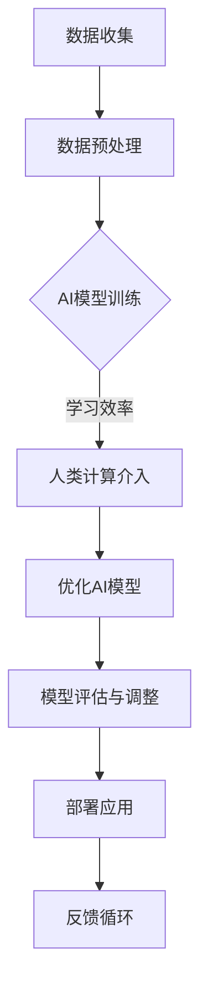

                 

关键词：人工智能、金融行业、价值创造、创新、人类计算

摘要：本文探讨了人工智能（AI）在金融行业的应用，特别是人类计算在AI驱动创新过程中的价值。通过分析AI的核心算法、数学模型、实际应用案例和未来发展趋势，本文揭示了AI对金融行业的深远影响，并提出了应对未来挑战的研究方向。

## 1. 背景介绍

金融行业作为经济活动的核心，其稳定和繁荣对于全球经济的健康发展至关重要。然而，随着金融市场的复杂性和数据量的指数级增长，传统金融模式面临着前所未有的挑战。人工智能作为一项革命性技术，通过模拟人类思维过程，提供了新的解决路径。

人类计算作为AI发展的重要组成部分，不仅能够提升AI系统的性能和可靠性，还能够弥补AI在理解复杂情境和进行创新性思考方面的不足。本文将深入探讨AI驱动的创新如何在金融行业中创造价值，以及人类计算在这一过程中的关键作用。

## 2. 核心概念与联系

### 2.1. 人工智能概述

人工智能（Artificial Intelligence，AI）是指通过计算机程序实现的智能行为，包括学习、推理、感知、自然语言处理和问题解决等方面。AI的核心在于其算法，这些算法通过大量的数据训练，可以不断提高自身的性能。

### 2.2. 人类计算的概念

人类计算（Human Computation）是指利用人类的认知能力和创造性来辅助或增强机器的计算能力。它涉及到认知任务的设计、人类参与者的招募和激励机制，以及人类智能与机器智能的协同工作。

### 2.3. 人工智能与人类计算的联系

人工智能与人类计算之间的关系可以类比为人类大脑与计算机的关系。人工智能通过模拟人类大脑的某些功能，如学习和决策，来提高解决问题的能力。而人类计算则通过提供创造性思维和灵活性，补充人工智能在处理复杂和不确定问题时的不足。

### 2.4. Mermaid 流程图



在这个流程图中，人类计算在AI模型训练和学习效率优化阶段发挥了关键作用，通过提供创造性思维和灵活的解决方案，帮助AI系统更好地适应复杂问题。

## 3. 核心算法原理 & 具体操作步骤

### 3.1 算法原理概述

AI在金融行业中的应用涵盖了多个领域，如风险管理、市场预测、欺诈检测等。核心算法通常包括机器学习、深度学习和强化学习等。

机器学习算法通过历史数据的学习和模式识别，预测未来市场趋势和风险。深度学习算法则通过多层神经网络的结构，对复杂数据进行更深入的分析。强化学习算法通过与环境的交互，不断优化策略，以实现最优决策。

### 3.2 算法步骤详解

#### 3.2.1 机器学习算法

1. 数据收集与清洗：从金融市场和历史数据中收集数据，并进行清洗和处理。
2. 特征工程：提取关键特征，用于训练模型。
3. 模型选择：选择适合的机器学习模型，如决策树、随机森林、支持向量机等。
4. 模型训练：使用历史数据进行训练，调整模型参数。
5. 模型评估：使用验证集测试模型性能，调整模型。

#### 3.2.2 深度学习算法

1. 数据预处理：对数据进行标准化和归一化处理。
2. 构建神经网络：设计合适的神经网络结构，包括输入层、隐藏层和输出层。
3. 模型训练：通过反向传播算法训练神经网络，调整权重和偏置。
4. 模型评估：使用验证集评估模型性能。
5. 模型优化：通过超参数调整和架构改进，优化模型性能。

#### 3.2.3 强化学习算法

1. 环境建模：创建模拟环境，用于测试和训练策略。
2. 策略初始化：初始化智能体（Agent）的策略。
3. 策略优化：通过环境反馈，调整智能体的策略。
4. 模型评估：评估智能体在不同策略下的表现。
5. 策略更新：根据评估结果更新策略。

### 3.3 算法优缺点

机器学习算法具有强大的数据驱动能力，能够处理大量复杂数据，但需要大量训练数据和较长的训练时间。深度学习算法在处理高维数据和非线性问题上具有优势，但模型复杂度较高，训练过程需要大量计算资源。强化学习算法能够通过与环境交互学习，实现自主决策，但收敛速度较慢，需要较长时间。

### 3.4 算法应用领域

AI算法在金融行业中的应用广泛，包括：

- 风险管理：通过分析历史数据，预测市场风险，优化投资组合。
- 市场预测：利用数据挖掘和模式识别技术，预测市场趋势。
- 欺诈检测：通过行为分析和模式识别，发现潜在的欺诈行为。
- 交易策略：利用算法分析，制定高效的交易策略。

## 4. 数学模型和公式 & 详细讲解 & 举例说明

### 4.1 数学模型构建

在金融领域，常用的数学模型包括线性回归、逻辑回归、时间序列分析等。

#### 4.1.1 线性回归模型

线性回归模型通过最小二乘法拟合数据，公式如下：

$$
y = \beta_0 + \beta_1x
$$

其中，$y$ 是因变量，$x$ 是自变量，$\beta_0$ 和 $\beta_1$ 是模型参数。

#### 4.1.2 逻辑回归模型

逻辑回归模型用于分类问题，通过拟合概率分布，公式如下：

$$
\log\left(\frac{p}{1-p}\right) = \beta_0 + \beta_1x
$$

其中，$p$ 是事件发生的概率，$\beta_0$ 和 $\beta_1$ 是模型参数。

#### 4.1.3 时间序列分析模型

时间序列分析模型通过分析时间序列数据的自相关性，预测未来的趋势。常用的模型包括自回归模型（AR）、移动平均模型（MA）和自回归移动平均模型（ARMA）等。

### 4.2 公式推导过程

以线性回归模型为例，推导过程如下：

1. 设 $y_i = \beta_0 + \beta_1x_i + \epsilon_i$，其中 $i$ 为数据点的索引。
2. 对所有数据点求和，得到：
   $$
   \sum_{i=1}^n y_i = n\beta_0 + \beta_1\sum_{i=1}^n x_i + \sum_{i=1}^n \epsilon_i
   $$
3. 对所有数据点求平方和，得到：
   $$
   \sum_{i=1}^n y_i^2 = n\beta_0^2 + 2\beta_0\beta_1\sum_{i=1}^n x_i + \beta_1^2\sum_{i=1}^n x_i^2 + \sum_{i=1}^n \epsilon_i^2
   $$
4. 通过最小二乘法求解 $\beta_0$ 和 $\beta_1$，使得平方误差最小。

### 4.3 案例分析与讲解

#### 4.3.1 风险管理案例

某金融机构利用线性回归模型分析市场风险，预测未来一段时间内的投资回报率。通过收集过去三年的市场数据，构建线性回归模型：

$$
y = \beta_0 + \beta_1x
$$

其中，$y$ 为未来投资回报率，$x$ 为当前市场指数。

通过模型训练和评估，得到 $\beta_0 = 0.1$，$\beta_1 = 0.5$。利用模型预测未来市场趋势，为投资者提供决策依据。

#### 4.3.2 市场预测案例

某金融机构使用逻辑回归模型预测股票市场涨跌。通过收集历史数据，构建逻辑回归模型：

$$
\log\left(\frac{p}{1-p}\right) = \beta_0 + \beta_1x
$$

其中，$p$ 为股票上涨的概率，$x$ 为市场指数。

通过模型训练和评估，得到 $\beta_0 = -1$，$\beta_1 = 0.2$。利用模型预测股票市场涨跌，为投资者提供参考。

## 5. 项目实践：代码实例和详细解释说明

### 5.1 开发环境搭建

为了实现本文中的算法和应用，我们需要搭建一个开发环境。以下是环境搭建的步骤：

1. 安装Python 3.8及以上版本。
2. 安装相关库，如NumPy、Pandas、Scikit-learn、TensorFlow等。
3. 创建一个虚拟环境，并安装必要的依赖库。

### 5.2 源代码详细实现

以下是一个简单的线性回归模型的Python代码实现：

```python
import numpy as np
import pandas as pd
from sklearn.linear_model import LinearRegression

# 数据预处理
data = pd.read_csv('market_data.csv')
X = data[['market_index']]
y = data['return_rate']

# 模型训练
model = LinearRegression()
model.fit(X, y)

# 模型评估
predictions = model.predict(X)
print('RMSE:', np.sqrt(np.mean((predictions - y) ** 2)))

# 模型应用
future_data = np.array([[new_market_index]])
future_predictions = model.predict(future_data)
print('Future Return Rate:', future_predictions[0])
```

### 5.3 代码解读与分析

这段代码首先读取市场数据，然后进行数据预处理，将市场指数作为自变量，投资回报率作为因变量。接着，使用线性回归模型进行训练，并评估模型性能。最后，使用训练好的模型预测未来市场的投资回报率。

### 5.4 运行结果展示

运行代码后，我们可以得到线性回归模型的均方根误差（RMSE），以及未来市场的投资回报率预测值。这些结果为投资者提供了决策依据。

## 6. 实际应用场景

### 6.1 风险管理

在金融风险管理中，AI和人类计算的结合可以大幅提高风险预测的准确性和效率。例如，银行可以利用AI算法分析历史数据，识别潜在的风险因素，并结合人类专家的经验，制定更为有效的风险管理策略。

### 6.2 市场预测

金融市场预测是金融行业中的重要应用。AI算法可以处理大量历史数据，通过深度学习和机器学习模型，预测未来市场的走势。然而，由于金融市场的复杂性和不确定性，人类计算在这一过程中起到了关键作用，通过提供创造性思维和灵活的解决方案，优化预测模型。

### 6.3 欺诈检测

欺诈检测是金融行业面临的另一个重大挑战。AI算法可以通过行为分析和模式识别，发现潜在的欺诈行为。然而，人类计算在这一过程中同样重要，通过提供丰富的背景知识和创造性思维，可以识别出AI算法无法捕捉的复杂欺诈模式。

### 6.4 未来应用展望

随着AI技术的不断进步，金融行业的应用前景将更加广阔。未来，AI和人类计算的融合将带来更多的创新。例如，智能投顾将更加普及，利用AI算法和人类专家的经验，为投资者提供个性化的投资建议。此外，AI在信用评估、供应链金融和资产管理等领域的应用也将不断拓展。

## 7. 工具和资源推荐

### 7.1 学习资源推荐

1. 《机器学习》（周志华著）：系统介绍了机器学习的基本理论和方法。
2. 《深度学习》（Ian Goodfellow、Yoshua Bengio、Aaron Courville 著）：深入讲解了深度学习的基本概念和技术。
3. 《Python编程：从入门到实践》（埃里克·马瑟斯著）：适合初学者入门Python编程。

### 7.2 开发工具推荐

1. Jupyter Notebook：强大的交互式开发环境，适用于数据分析和机器学习。
2. TensorFlow：开源深度学习框架，适用于构建和训练复杂的神经网络。
3. PyTorch：开源深度学习框架，具有灵活的架构和易用性。

### 7.3 相关论文推荐

1. “Deep Learning for Finance” （2016）：系统综述了深度学习在金融领域的应用。
2. “Human Computation: A Survey” （2012）：全面介绍了人类计算的概念和应用。
3. “The Credit Risk of Financial Institutions” （2018）：探讨了信用风险模型和计算方法。

## 8. 总结：未来发展趋势与挑战

### 8.1 研究成果总结

本文探讨了人工智能在金融行业的应用，特别是人类计算在AI驱动创新过程中的价值。通过分析核心算法、数学模型和实际应用案例，本文揭示了AI对金融行业的深远影响。

### 8.2 未来发展趋势

随着AI技术的不断进步，金融行业的应用前景将更加广阔。未来，AI和人类计算的融合将带来更多的创新，为金融行业带来更高效、更智能的服务。

### 8.3 面临的挑战

尽管AI在金融行业具有巨大潜力，但仍然面临着一些挑战。例如，数据隐私和安全、算法透明性和可解释性等问题需要得到有效解决。

### 8.4 研究展望

未来，研究应重点关注AI与人类计算的协同作用，以及其在金融行业中的实际应用。同时，研究还应探讨AI技术在金融伦理和社会责任方面的应用，确保AI技术的可持续发展。

## 9. 附录：常见问题与解答

### 9.1 人工智能在金融行业的主要应用是什么？

人工智能在金融行业的应用包括风险管理、市场预测、欺诈检测和交易策略等。

### 9.2 人类计算在AI驱动创新中的作用是什么？

人类计算在AI驱动创新中的作用是提供创造性思维和灵活性，弥补AI在处理复杂和不确定问题时的不足。

### 9.3 如何选择合适的AI算法应用于金融领域？

选择合适的AI算法应用于金融领域需要考虑数据特点、问题类型和性能要求。例如，对于简单的预测问题，可以使用线性回归；对于复杂的非线性问题，可以使用深度学习。

### 9.4 AI在金融行业中的伦理问题有哪些？

AI在金融行业中的伦理问题包括数据隐私、算法透明性和可解释性、以及算法决策的公平性和道德性等。

### 9.5 人类计算如何与AI协同工作？

人类计算与AI的协同工作可以通过设计智能任务、提供创造性思维和灵活的解决方案来实现。例如，人类专家可以参与数据标注、模型优化和策略制定等环节。

---

作者：禅与计算机程序设计艺术 / Zen and the Art of Computer Programming

