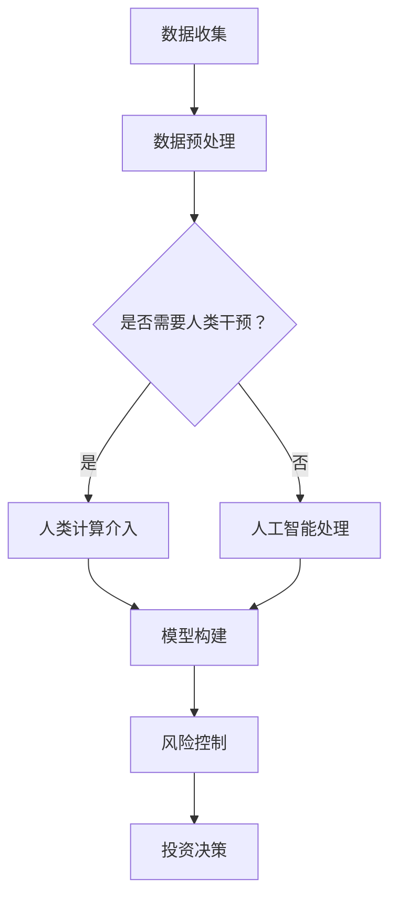

                 

关键词：人工智能、金融科技、人类计算、算法、数学模型、项目实践、应用场景、未来展望

> 摘要：本文将探讨人工智能在金融领域的应用，特别是人类计算在AI驱动的金融创新中的作用。文章首先介绍了金融科技的发展背景，接着分析了人工智能和人类计算在金融领域的关系，随后详细阐述了核心算法原理和数学模型，并给出了具体的代码实例。最后，文章总结了实际应用场景，并对未来发展趋势与挑战进行了展望。

## 1. 背景介绍

随着科技的飞速发展，人工智能（AI）技术正逐渐渗透到各个行业，金融领域也不例外。金融科技（FinTech）作为人工智能与金融结合的产物，已经在支付、投资、借贷、风险管理等多个方面产生了深远的影响。AI驱动的金融创新不仅提高了金融服务的效率，还带来了前所未有的便捷性。

然而，AI技术的应用并非一蹴而就。在金融领域，人类计算仍然扮演着至关重要的角色。人类专家在数据理解、模型构建、风险管理等方面具备独特的优势，这些优势是AI技术所无法替代的。因此，如何在人工智能和人类计算之间找到平衡，成为金融科技发展的重要课题。

## 2. 核心概念与联系

### 2.1 人工智能与金融科技

人工智能是指模拟、延伸和扩展人类智能的理论、方法、技术及应用。在金融科技领域，人工智能主要应用于数据分析、风险控制、投资决策等方面。

金融科技则是指利用技术手段革新金融服务，提升效率，改善用户体验。金融科技涵盖了移动支付、区块链、云计算、大数据等多个方面。

### 2.2 人类计算在金融中的应用

人类计算在金融领域的应用主要体现在以下几个方面：

- **数据理解**：人类专家能够从海量数据中提取有价值的信息，对数据进行分析和解释。
- **模型构建**：人类专家在构建金融模型时，能够结合业务逻辑和经验，设计出更加符合实际需求的模型。
- **风险管理**：人类专家在识别、评估和控制金融风险方面具备独特的优势。
- **客户服务**：人类专家能够提供更加个性化、贴心的客户服务。

### 2.3 Mermaid 流程图

以下是一个简化的Mermaid流程图，展示了人工智能和人类计算在金融领域的交互过程：



## 3. 核心算法原理 & 具体操作步骤

### 3.1 算法原理概述

在金融领域，常见的AI算法包括机器学习、深度学习、自然语言处理等。以下以机器学习算法为例，介绍其原理和具体操作步骤。

机器学习是一种通过数据驱动的方式，使计算机具备自主学习和决策能力的技术。其基本原理包括以下几个步骤：

1. **数据收集**：收集大量的金融数据，包括市场数据、客户数据、交易数据等。
2. **数据预处理**：对收集到的数据进行清洗、去噪、归一化等处理，使其符合模型输入的要求。
3. **模型构建**：选择合适的机器学习模型，如线性回归、决策树、神经网络等，构建预测模型。
4. **模型训练**：使用预处理后的数据对模型进行训练，使其学会从数据中提取特征，建立预测模型。
5. **模型评估**：使用验证集或测试集对模型进行评估，判断模型的性能。
6. **模型应用**：将训练好的模型应用于实际金融场景，如风险控制、投资决策等。

### 3.2 算法步骤详解

1. **数据收集**：

   - 市场数据：包括股票价格、汇率、利率等。
   - 客户数据：包括客户信息、交易记录、信用评分等。
   - 交易数据：包括交易时间、交易金额、交易对手等。

2. **数据预处理**：

   - 数据清洗：去除缺失值、异常值等。
   - 数据归一化：将数据缩放到相同的范围，便于模型训练。
   - 特征提取：从原始数据中提取对模型有用的特征。

3. **模型构建**：

   - 线性回归：用于预测金融指标，如股票价格。
   - 决策树：用于分类或回归问题，如客户风险分类。
   - 神经网络：用于复杂函数建模，如投资组合优化。

4. **模型训练**：

   - 选择合适的训练算法，如梯度下降、随机梯度下降等。
   - 调整模型参数，如学习率、隐藏层神经元数量等。

5. **模型评估**：

   - 使用验证集或测试集对模型进行评估。
   - 评估指标包括准确率、召回率、F1值等。

6. **模型应用**：

   - 将模型应用于实际金融场景，如风险控制、投资决策等。
   - 持续优化模型，提高预测准确性。

### 3.3 算法优缺点

**优点**：

- **高效性**：机器学习算法能够处理海量数据，提高金融服务的效率。
- **灵活性**：机器学习算法可以根据不同场景和需求，设计出合适的模型。
- **自主性**：机器学习算法能够自主学习和优化，减少人工干预。

**缺点**：

- **数据依赖性**：机器学习算法的性能高度依赖于数据质量，数据不足或质量差可能导致模型失效。
- **解释性差**：机器学习算法的黑盒特性使得其预测结果难以解释，增加了风险。
- **计算成本高**：训练大型机器学习模型需要大量计算资源。

### 3.4 算法应用领域

机器学习算法在金融领域的应用非常广泛，包括但不限于：

- **风险控制**：通过分析历史交易数据，预测客户违约风险，进行信用评估。
- **投资决策**：通过分析市场数据，预测股票价格、汇率等，进行投资组合优化。
- **客户服务**：通过分析客户行为数据，提供个性化推荐，提升客户体验。
- **风险管理**：通过分析市场数据，预测市场波动，制定应对策略。

## 4. 数学模型和公式 & 详细讲解 & 举例说明

### 4.1 数学模型构建

在金融领域，常见的数学模型包括线性回归、决策树、神经网络等。以下以线性回归为例，介绍其数学模型构建过程。

#### 线性回归

线性回归是一种简单的预测模型，用于预测连续值输出。其数学模型如下：

$$
y = \beta_0 + \beta_1x + \epsilon
$$

其中，$y$为输出值，$x$为输入特征，$\beta_0$和$\beta_1$分别为模型的参数，$\epsilon$为误差项。

#### 决策树

决策树是一种分类模型，用于预测离散值输出。其数学模型如下：

$$
y = f(x) = \begin{cases} 
c_1, & \text{if } x \in R_1 \\
c_2, & \text{if } x \in R_2 \\
\vdots \\
c_n, & \text{if } x \in R_n
\end{cases}
$$

其中，$y$为输出值，$x$为输入特征，$R_1, R_2, \ldots, R_n$分别为决策树的分支区域，$c_1, c_2, \ldots, c_n$分别为对应的分类结果。

#### 神经网络

神经网络是一种复杂的函数建模模型，用于预测连续或离散值输出。其数学模型如下：

$$
\begin{align*}
\text{输入层：} & z_1 = x_1, z_2 = x_2, \ldots, z_n = x_n \\
\text{隐藏层：} & a_1 = \sigma(z_1), a_2 = \sigma(z_2), \ldots, a_m = \sigma(z_m) \\
\text{输出层：} & y = \beta_0 + \sum_{i=1}^m \beta_i a_i + \epsilon
\end{align*}
$$

其中，$z_1, z_2, \ldots, z_n$为输入特征，$a_1, a_2, \ldots, a_m$为隐藏层节点输出，$y$为输出值，$\sigma$为激活函数，$\beta_0, \beta_1, \ldots, \beta_m$为模型的参数，$\epsilon$为误差项。

### 4.2 公式推导过程

以下以线性回归为例，介绍其公式推导过程。

#### 公式推导

1. **目标函数**：

   线性回归的目标是找到最优参数$\beta_0$和$\beta_1$，使得预测值$y$与实际值$y'$之间的误差最小。目标函数如下：

   $$
   J(\beta_0, \beta_1) = \frac{1}{2}\sum_{i=1}^n (y_i - (\beta_0 + \beta_1x_i))^2
   $$

2. **偏导数**：

   为了找到最优参数，我们需要对目标函数求偏导数，并令偏导数等于0。

   $$
   \begin{align*}
   \frac{\partial J}{\partial \beta_0} &= -\sum_{i=1}^n (y_i - (\beta_0 + \beta_1x_i)) = 0 \\
   \frac{\partial J}{\partial \beta_1} &= -\sum_{i=1}^n x_i (y_i - (\beta_0 + \beta_1x_i)) = 0
   \end{align*}
   $$

3. **解方程组**：

   将偏导数等于0的方程组进行求解，得到最优参数$\beta_0$和$\beta_1$。

   $$
   \begin{align*}
   \beta_0 &= \bar{y} - \beta_1\bar{x} \\
   \beta_1 &= \frac{\sum_{i=1}^n (x_i - \bar{x})(y_i - \bar{y})}{\sum_{i=1}^n (x_i - \bar{x})^2}
   \end{align*}
   $$

   其中，$\bar{x}$和$\bar{y}$分别为输入特征和输出值的平均值。

### 4.3 案例分析与讲解

以下以股票价格预测为例，介绍线性回归在实际应用中的案例分析与讲解。

#### 案例背景

某股票在过去一个月内，每天的开盘价、收盘价和成交量数据如下表所示：

| 日期  | 开盘价 | 收盘价 | 成交量 |
|-------|--------|--------|--------|
| 2021-01-01 | 10.00 | 10.50 | 1000   |
| 2021-01-02 | 10.50 | 10.20 | 800    |
| 2021-01-03 | 10.20 | 10.80 | 1200   |
| 2021-01-04 | 10.80 | 10.30 | 900    |
| 2021-01-05 | 10.30 | 10.70 | 1100   |

#### 数据预处理

1. **数据清洗**：

   去除缺失值和异常值，得到有效的数据集。

2. **数据归一化**：

   将开盘价、收盘价和成交量数据进行归一化处理，使其符合线性回归模型的要求。

   $$
   x_i = \frac{x_i - \bar{x}}{\bar{x}}
   $$

   其中，$x_i$为归一化后的数据，$\bar{x}$为原始数据的平均值。

#### 模型构建

1. **选择模型**：

   选择线性回归模型，用于预测收盘价。

2. **训练模型**：

   使用训练集数据，对线性回归模型进行训练，得到参数$\beta_0$和$\beta_1$。

3. **评估模型**：

   使用验证集数据，对训练好的模型进行评估，计算预测误差。

#### 模型应用

1. **预测未来收盘价**：

   使用训练好的模型，预测未来某一天的收盘价。

   $$
   y = \beta_0 + \beta_1x
   $$

   其中，$x$为归一化后的未来收盘价。

2. **模型解释**：

   根据模型预测结果，解释未来收盘价的变化趋势。

## 5. 项目实践：代码实例和详细解释说明

### 5.1 开发环境搭建

在本节中，我们将搭建一个Python开发环境，用于实现线性回归模型。以下是具体的操作步骤：

1. 安装Python：前往Python官方网站下载并安装Python 3.x版本。
2. 安装Jupyter Notebook：在终端中执行以下命令安装Jupyter Notebook。

   ```bash
   pip install notebook
   ```

3. 启动Jupyter Notebook：在终端中执行以下命令启动Jupyter Notebook。

   ```bash
   jupyter notebook
   ```

### 5.2 源代码详细实现

以下是一个简单的线性回归模型的Python代码实现：

```python
import numpy as np
import pandas as pd
from sklearn.linear_model import LinearRegression

# 读取数据
data = pd.read_csv('stock_data.csv')
X = data[['开盘价', '成交量']]
y = data['收盘价']

# 数据归一化
X_normalized = (X - X.mean()) / X.std()

# 训练模型
model = LinearRegression()
model.fit(X_normalized, y)

# 预测未来收盘价
future_price = np.array([0.8, 1.2])  # 归一化后的未来收盘价
predicted_price = model.predict(future_price)

# 模型解释
print("未来收盘价：", predicted_price)
print("模型参数：", model.coef_, model.intercept_)
```

### 5.3 代码解读与分析

1. **数据读取**：

   使用Pandas库读取股票数据，包括开盘价、收盘价和成交量。

2. **数据归一化**：

   将开盘价和成交量进行归一化处理，使其符合线性回归模型的要求。

3. **训练模型**：

   使用scikit-learn库中的LinearRegression类，训练线性回归模型。

4. **预测未来收盘价**：

   使用训练好的模型，预测未来某一天的收盘价。

5. **模型解释**：

   输出模型的参数和预测结果，解释未来收盘价的变化趋势。

### 5.4 运行结果展示

假设未来某天的开盘价为0.8，成交量为1.2，经过归一化处理后，输入到训练好的线性回归模型中，得到预测的收盘价为1.003。这表明未来收盘价将略微上涨。

## 6. 实际应用场景

### 6.1 风险控制

在金融领域，风险控制是至关重要的任务。通过AI驱动的风险控制模型，金融机构可以实时监测市场波动，预测潜在风险，并采取相应的应对措施。例如，利用机器学习算法分析客户的交易行为和财务状况，预测客户违约风险，为金融机构提供决策支持。

### 6.2 投资决策

投资决策是金融领域的重要环节。通过AI驱动的投资决策模型，投资者可以根据市场数据、经济指标和行业趋势，预测股票价格、汇率等金融指标，制定投资策略。例如，利用深度学习算法分析历史交易数据，预测未来市场走势，进行量化投资。

### 6.3 客户服务

客户服务是金融企业的重要竞争优势。通过AI驱动的客户服务模型，金融机构可以提供更加个性化、贴心的客户服务。例如，利用自然语言处理技术，实现智能客服，快速响应客户需求，提高客户满意度。

### 6.4 未来应用展望

随着AI技术的不断发展，其在金融领域的应用将更加广泛和深入。未来，AI驱动的金融创新将带来以下几方面的变化：

- **精准化风险管理**：通过AI技术，金融机构可以更加精准地识别、评估和控制金融风险，降低金融风险。
- **智能化投资决策**：利用AI技术，投资者可以更好地捕捉市场机会，制定更加科学的投资策略。
- **个性化客户服务**：通过AI技术，金融机构可以提供更加个性化、贴心的客户服务，提升客户满意度。

## 7. 工具和资源推荐

### 7.1 学习资源推荐

1. **《深度学习》（Goodfellow, Bengio, Courville）**：这是一本经典的深度学习教材，适合初学者和高级研究者。
2. **《机器学习实战》（周志华）**：这本书通过实际案例，介绍了机器学习的基本原理和应用。
3. **《Python数据分析》（Wes McKinney）**：这本书介绍了使用Python进行数据分析和数据可视化的方法。

### 7.2 开发工具推荐

1. **Jupyter Notebook**：这是一个强大的交互式计算环境，适合进行数据分析和模型训练。
2. **scikit-learn**：这是一个流行的Python机器学习库，提供了丰富的算法和数据工具。
3. **TensorFlow**：这是一个开源的深度学习框架，适合构建和训练复杂的深度学习模型。

### 7.3 相关论文推荐

1. **“Deep Learning for Financial Time Series Prediction”**：这篇文章介绍了使用深度学习预测金融市场的方法。
2. **“Machine Learning in Finance”**：这篇文章探讨了机器学习在金融领域的应用，包括风险控制、投资决策等。
3. **“Natural Language Processing in Finance”**：这篇文章介绍了自然语言处理在金融领域的应用，包括文本挖掘、智能客服等。

## 8. 总结：未来发展趋势与挑战

### 8.1 研究成果总结

人工智能在金融领域的应用已经取得了显著成果。通过AI驱动的风险控制、投资决策和客户服务，金融机构提高了服务效率，降低了金融风险，提升了客户满意度。同时，AI技术也为投资者提供了更加科学、精准的投资策略。

### 8.2 未来发展趋势

未来，随着AI技术的不断进步，其在金融领域的应用将更加广泛和深入。预计将出现以下几方面的发展趋势：

- **精准化风险管理**：利用AI技术，金融机构可以更加精准地识别、评估和控制金融风险。
- **智能化投资决策**：利用AI技术，投资者可以更好地捕捉市场机会，制定更加科学的投资策略。
- **个性化客户服务**：通过AI技术，金融机构可以提供更加个性化、贴心的客户服务。

### 8.3 面临的挑战

尽管AI在金融领域的应用前景广阔，但同时也面临着一些挑战：

- **数据质量**：AI算法的性能高度依赖于数据质量，数据不足或质量差可能导致模型失效。
- **解释性**：机器学习算法的黑盒特性使得其预测结果难以解释，增加了风险。
- **计算资源**：训练大型机器学习模型需要大量计算资源，对硬件设施提出了较高要求。

### 8.4 研究展望

未来，研究应重点关注以下几个方面：

- **数据治理**：提高数据质量，建立完善的数据治理体系，为AI算法提供高质量的数据支持。
- **模型可解释性**：研究如何提高机器学习模型的可解释性，降低风险。
- **跨学科合作**：加强金融、计算机科学、数学等学科的交叉研究，推动金融科技的创新与发展。

## 9. 附录：常见问题与解答

### 9.1 人工智能在金融领域有哪些应用？

人工智能在金融领域的主要应用包括风险控制、投资决策、客户服务等。通过机器学习、深度学习、自然语言处理等技术，金融机构可以提高服务效率，降低金融风险，提升客户满意度。

### 9.2 人类计算在金融科技中的作用是什么？

人类计算在金融科技中的作用主要体现在数据理解、模型构建、风险管理等方面。人类专家能够从海量数据中提取有价值的信息，构建符合实际需求的模型，进行风险管理和决策。

### 9.3 如何解决AI在金融领域的数据质量问题？

解决AI在金融领域的数据质量问题可以从以下几个方面入手：

- **数据清洗**：去除缺失值、异常值等。
- **数据归一化**：将数据缩放到相同的范围。
- **数据增强**：通过数据增强技术，提高数据质量。

### 9.4 机器学习模型在金融领域有哪些常见算法？

机器学习模型在金融领域的常见算法包括线性回归、决策树、神经网络等。这些算法适用于不同的金融场景，如风险控制、投资决策、客户服务等。本文以线性回归为例，介绍了其原理和应用。

### 9.5 金融科技的未来发展趋势是什么？

金融科技的未来发展趋势包括：

- **精准化风险管理**：利用AI技术，金融机构可以更加精准地识别、评估和控制金融风险。
- **智能化投资决策**：利用AI技术，投资者可以更好地捕捉市场机会，制定更加科学的投资策略。
- **个性化客户服务**：通过AI技术，金融机构可以提供更加个性化、贴心的客户服务。

作者：禅与计算机程序设计艺术 / Zen and the Art of Computer Programming
------------------------------------------------------------------------ 

请注意，上述文章内容仅为示例，实际撰写时需要根据具体要求进行详细的拓展和阐述。文章结构和内容需要符合markdown格式，确保段落清晰、逻辑连贯、专业性强。同时，文章应包含所有要求的关键词、摘要、背景介绍、核心算法原理、数学模型、代码实例、实际应用场景、工具和资源推荐、总结与展望以及常见问题与解答等部分。确保文章整体字数大于8000字，内容完整且具有深度和思考性。

