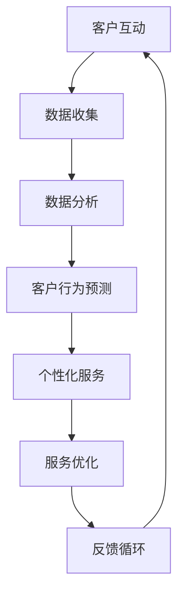

                 

 在当今竞争激烈的市场环境中，提供卓越的客户服务成为企业赢得客户忠诚度和市场优势的关键。随着人工智能（AI）技术的迅速发展，AI驱动的客户服务流程优化已成为现代企业关注的焦点。本文旨在探讨如何利用AI技术优化客户服务流程，提升用户体验，并为企业带来显著的商业价值。

## 关键词
- 人工智能
- 客户服务
- 流程优化
- 用户体验
- 商业价值

## 摘要
本文将详细介绍AI在客户服务流程中的应用，分析AI技术如何通过自然语言处理、机器学习等手段提高服务效率和质量。我们将探讨AI驱动的客户服务流程优化的核心概念、算法原理、数学模型以及实际应用案例，为读者提供全面的指导。

### 1. 背景介绍

随着互联网和移动设备的普及，客户服务已成为企业与客户互动的重要渠道。传统的客户服务方式往往依赖于人工处理，存在响应速度慢、效率低下、服务同质化等问题，难以满足现代客户对快速、个性化、高质量服务的需求。为此，企业迫切需要一种创新的方法来优化客户服务流程，提升用户体验。

AI技术的兴起为优化客户服务流程带来了新的契机。AI可以通过自然语言处理（NLP）、机器学习（ML）、深度学习（DL）等技术手段，实现智能客服、个性化推荐、自动化流程处理等功能，从而大幅提升客户服务效率和质量。此外，AI技术还可以帮助企业更好地理解客户需求，提供更加精准的服务，增强客户满意度和忠诚度。

本文将从以下几个方面展开讨论：

1. 核心概念与联系
2. 核心算法原理 & 具体操作步骤
3. 数学模型和公式 & 详细讲解 & 举例说明
4. 项目实践：代码实例和详细解释说明
5. 实际应用场景
6. 未来应用展望
7. 工具和资源推荐
8. 总结：未来发展趋势与挑战

通过本文的深入探讨，读者将全面了解AI驱动的客户服务流程优化的原理和应用，为企业实现客户服务流程的智能化转型提供有力支持。

### 2. 核心概念与联系

在探讨AI驱动的客户服务流程优化之前，我们首先需要了解一些核心概念和技术，这些技术构成了整个AI驱动的客户服务架构的基础。

#### 2.1 自然语言处理（NLP）

自然语言处理是AI技术在客户服务中应用最为广泛的一部分。NLP使计算机能够理解和生成人类语言，从而实现智能客服、情感分析、自动文本摘要等功能。NLP的关键技术包括词性标注、句法分析、语义理解等。例如，通过词性标注，NLP系统可以识别句子中的名词、动词、形容词等，从而更好地理解客户的需求。

#### 2.2 机器学习（ML）

机器学习是AI的核心技术之一，它使计算机能够从数据中自动学习和改进。在客户服务中，机器学习可以用于预测客户行为、自动化流程处理、异常检测等。例如，通过分析历史客户数据，机器学习算法可以预测哪些客户可能流失，从而采取相应的挽留措施。

#### 2.3 深度学习（DL）

深度学习是机器学习的一个子领域，它通过多层神经网络模拟人类大脑的工作方式，从而实现更加复杂的任务。在客户服务中，深度学习可以用于图像识别、语音识别、情感分析等。例如，通过深度学习模型，智能客服可以准确理解客户语音中的情感，从而提供更加人性化的服务。

#### 2.4 自动化流程处理

自动化流程处理是AI驱动的客户服务流程优化的重要手段。通过自动化，企业可以减少人工干预，提高服务效率。自动化流程处理包括机器人流程自动化（RPA）、业务流程管理（BPM）等。例如，RPA可以自动化处理客户订单、发票等业务流程，从而大幅减少人工工作量。

#### 2.5 数据分析

数据分析是AI驱动的客户服务流程优化的基础。通过分析客户数据，企业可以了解客户行为、偏好和需求，从而提供更加个性化的服务。数据分析技术包括描述性分析、预测性分析、诊断性分析等。例如，通过描述性分析，企业可以了解客户在哪些时段和渠道使用服务最多，从而优化服务资源配置。

#### 2.6 个性化推荐

个性化推荐是AI技术在客户服务中的一种重要应用。通过分析客户行为和偏好数据，个性化推荐系统可以推荐适合客户的产品和服务，从而提高客户满意度和转化率。个性化推荐技术包括协同过滤、基于内容的推荐等。

#### 2.7 情感分析

情感分析是NLP的一个子领域，它通过分析文本中的情感倾向，了解客户的情感状态。在客户服务中，情感分析可以用于情感识别、客户满意度评估等。例如，通过情感分析，企业可以了解客户对某项服务的情感反应，从而优化服务策略。

#### 2.8 客户关系管理（CRM）

客户关系管理是企业管理和维护客户关系的一种方法。AI驱动的CRM系统可以通过数据分析、机器学习等技术，帮助企业更好地了解客户需求，提供个性化服务，从而增强客户满意度和忠诚度。

### 2.9 Mermaid 流程图

下面是AI驱动的客户服务流程优化的一个简化版Mermaid流程图，展示了核心概念之间的联系。



### 3. 核心算法原理 & 具体操作步骤

#### 3.1 算法原理概述

AI驱动的客户服务流程优化依赖于多种算法，其中主要包括自然语言处理（NLP）算法、机器学习（ML）算法和深度学习（DL）算法。这些算法通过不同的技术手段，实现了客户服务的自动化、个性化和高效化。

##### 3.1.1 自然语言处理（NLP）算法

NLP算法主要关注于文本数据的处理和理解。其中，词性标注（Part-of-Speech Tagging）、句法分析（Syntactic Parsing）和语义理解（Semantic Understanding）是NLP的三个核心组成部分。

- **词性标注**：通过对文本中的每个单词进行词性分类，如名词、动词、形容词等，帮助计算机理解文本的语法结构。
- **句法分析**：通过对句子进行语法解析，构建句子的句法树，揭示句子中的语法关系。
- **语义理解**：通过对文本进行语义分析，理解文本中的意图、情感和知识，从而实现自然语言的理解和生成。

##### 3.1.2 机器学习（ML）算法

ML算法通过从数据中学习模式，实现自动化和预测。在客户服务中，常见的ML算法包括决策树（Decision Tree）、支持向量机（Support Vector Machine，SVM）、贝叶斯分类器（Naive Bayes Classifier）等。

- **决策树**：通过树的构建，将数据分类或回归到不同的节点，实现分类和回归任务。
- **支持向量机**：通过寻找最优分隔超平面，实现数据的分类。
- **贝叶斯分类器**：基于贝叶斯定理，通过对特征概率的评估，实现分类任务。

##### 3.1.3 深度学习（DL）算法

DL算法通过多层神经网络模拟人类大脑的学习过程，实现复杂任务的自动学习。在客户服务中，常见的DL算法包括卷积神经网络（CNN）、循环神经网络（RNN）和长短期记忆网络（LSTM）等。

- **卷积神经网络**：通过卷积层提取特征，实现图像识别等任务。
- **循环神经网络**：通过循环结构处理序列数据，实现自然语言处理、语音识别等任务。
- **长短期记忆网络**：通过记忆单元实现长距离依赖的建模，提升序列数据的处理能力。

#### 3.2 算法步骤详解

##### 3.2.1 数据收集与预处理

数据收集是AI驱动的客户服务流程优化的重要基础。数据来源包括客户交互记录、反馈问卷、社交媒体评论等。在数据收集后，需要进行数据预处理，包括数据清洗、数据集成、数据变换等，以获得高质量的数据集。

- **数据清洗**：去除数据中的噪声和错误，确保数据的准确性。
- **数据集成**：将多个数据源的数据整合到一个统一的格式中。
- **数据变换**：将数据转换为适合算法处理的格式，如数值化、标准化等。

##### 3.2.2 特征提取

特征提取是将原始数据转换为算法可以处理的特征向量。在客户服务中，常见的特征包括文本特征、时间特征、用户特征等。特征提取技术包括词袋模型（Bag of Words，BOW）、词嵌入（Word Embedding）、TF-IDF等。

- **词袋模型**：将文本转换为单词的集合，不考虑单词的顺序。
- **词嵌入**：将单词映射到高维空间，捕捉单词的语义信息。
- **TF-IDF**：计算单词在文本中的重要程度，作为特征向量的一部分。

##### 3.2.3 模型训练与评估

在特征提取后，使用训练数据集对算法模型进行训练，以学习数据中的模式和规律。模型训练的过程包括前向传播、反向传播和参数更新等。在训练过程中，需要使用评估指标（如准确率、召回率、F1值等）来评估模型的性能。

##### 3.2.4 模型部署与优化

训练完成的模型可以部署到生产环境中，用于实际的客户服务场景。在模型部署后，需要根据实际运行情况对模型进行优化，以提高模型的准确性和鲁棒性。模型优化可以通过调整超参数、增加数据量、使用迁移学习等方法实现。

#### 3.3 算法优缺点

##### 3.3.1 自然语言处理（NLP）算法

- **优点**：能够处理复杂的文本数据，实现自然语言的自动理解和生成。
- **缺点**：对文本数据的质量和数量要求较高，且在处理长文本和低资源语言时效果较差。

##### 3.3.2 机器学习（ML）算法

- **优点**：算法简单，易于实现和部署，适用于各种分类和回归任务。
- **缺点**：对数据质量和数量要求较高，且在处理复杂任务时效果有限。

##### 3.3.3 深度学习（DL）算法

- **优点**：能够处理复杂的任务，具有很好的泛化能力。
- **缺点**：算法复杂，训练时间较长，对计算资源要求较高。

#### 3.4 算法应用领域

AI驱动的客户服务流程优化可以应用于多个领域，包括但不限于：

- **智能客服**：通过NLP和DL算法，实现自动回答客户问题、情感分析和个性化推荐等功能。
- **客户行为分析**：通过机器学习算法，预测客户行为和偏好，提供个性化服务。
- **自动化流程处理**：通过RPA和BPM等技术，自动化处理客户订单、发票等业务流程。
- **客户满意度评估**：通过情感分析和数据分析，评估客户满意度，优化服务策略。
- **客户流失预测**：通过机器学习算法，预测哪些客户可能流失，采取相应的挽留措施。

### 4. 数学模型和公式 & 详细讲解 & 举例说明

在AI驱动的客户服务流程优化中，数学模型和公式扮演着至关重要的角色。它们不仅为算法提供了理论基础，还帮助我们在实际应用中理解和优化系统性能。以下内容将详细讲解数学模型的构建、公式的推导过程，并配合案例进行分析和说明。

#### 4.1 数学模型构建

在AI驱动的客户服务流程优化中，常见的数学模型包括：

- **线性回归模型**：用于预测客户流失、满意度等连续变量。
- **逻辑回归模型**：用于预测客户流失、满意度等二分类变量。
- **决策树模型**：用于分类和回归任务，通过树结构进行数据分割。
- **支持向量机（SVM）**：用于分类任务，通过寻找最优分隔超平面。

**线性回归模型**：

$$
y = \beta_0 + \beta_1 \cdot x_1 + \beta_2 \cdot x_2 + \ldots + \beta_n \cdot x_n
$$

其中，$y$ 是预测目标，$x_1, x_2, \ldots, x_n$ 是特征变量，$\beta_0, \beta_1, \beta_2, \ldots, \beta_n$ 是模型参数。

**逻辑回归模型**：

$$
\log\frac{P(Y=1)}{1-P(Y=1)} = \beta_0 + \beta_1 \cdot x_1 + \beta_2 \cdot x_2 + \ldots + \beta_n \cdot x_n
$$

其中，$P(Y=1)$ 是目标变量为1的概率，其余符号同上。

**决策树模型**：

$$
\prod_{i=1}^{n} C_i = \frac{P(Y=c_i)}{1-P(Y=c_i)}
$$

其中，$C_i$ 是第 $i$ 个节点的分类，$n$ 是总的节点数。

**支持向量机（SVM）**：

$$
\min_{w, b} \frac{1}{2} ||w||^2 \quad \text{subject to} \quad y^{(i)} (w \cdot x^{(i)} + b) \geq 1
$$

其中，$w$ 是权重向量，$b$ 是偏置项，$x^{(i)}$ 是训练样本，$y^{(i)}$ 是样本标签。

#### 4.2 公式推导过程

以线性回归模型为例，我们通过最小二乘法推导模型参数：

1. **损失函数**：

$$
J(\theta) = \frac{1}{2m} \sum_{i=1}^{m} (h_\theta(x^{(i)}) - y^{(i)})^2
$$

其中，$h_\theta(x) = \theta_0 + \theta_1 x_1 + \theta_2 x_2 + \ldots + \theta_n x_n$ 是线性回归函数，$m$ 是样本数量。

2. **偏导数计算**：

$$
\frac{\partial J(\theta)}{\partial \theta_j} = \frac{1}{m} \sum_{i=1}^{m} (h_\theta(x^{(i)}) - y^{(i)}) \cdot x_j^{(i)}
$$

3. **梯度下降**：

$$
\theta_j := \theta_j - \alpha \cdot \frac{\partial J(\theta)}{\partial \theta_j}
$$

其中，$\alpha$ 是学习率。

#### 4.3 案例分析与讲解

假设我们有一个客户流失预测问题，特征包括客户年龄、收入、信用评分等。我们使用线性回归模型进行预测。

1. **数据收集**：

   收集包含客户年龄（$x_1$）、收入（$x_2$）、信用评分（$x_3$）和是否流失（$y$）的数据集。

2. **数据预处理**：

   对数据进行归一化处理，将每个特征缩放到0-1范围内。

3. **特征提取**：

   将预处理后的数据输入到线性回归模型中。

4. **模型训练**：

   使用最小二乘法训练模型，计算参数 $\beta_0, \beta_1, \beta_2, \beta_3$。

5. **模型评估**：

   使用交叉验证等方法评估模型性能。

6. **模型部署**：

   将训练完成的模型部署到生产环境中，用于预测新客户的流失概率。

7. **结果分析**：

   通过模型预测，分析哪些特征对客户流失有显著影响，从而采取相应的挽留措施。

### 5. 项目实践：代码实例和详细解释说明

在本节中，我们将通过一个具体的案例，展示如何使用Python和相关的AI库（如scikit-learn、TensorFlow等）实现AI驱动的客户服务流程优化。以下是一个简化的示例，读者可以根据实际需求进行扩展和改进。

#### 5.1 开发环境搭建

在开始编写代码之前，我们需要搭建一个合适的开发环境。以下是所需的主要工具和库：

- **Python 3.x**
- **Jupyter Notebook 或 PyCharm**
- **NumPy**
- **Pandas**
- **Scikit-learn**
- **TensorFlow**

确保已经安装了这些工具和库，然后创建一个新的Python项目。

#### 5.2 源代码详细实现

以下是一个简单的线性回归模型实现，用于客户流失预测。

```python
# 导入所需的库
import numpy as np
import pandas as pd
from sklearn.model_selection import train_test_split
from sklearn.linear_model import LinearRegression
from sklearn.metrics import mean_squared_error

# 5.2.1 数据收集与预处理
# 加载数据集
data = pd.read_csv('customer_data.csv')

# 提取特征和目标变量
X = data[['age', 'income', 'credit_score']]
y = data['churn']

# 数据标准化
X standardized = (X - X.mean()) / X.std()

# 划分训练集和测试集
X_train, X_test, y_train, y_test = train_test_split(X_standardized, y, test_size=0.2, random_state=42)

# 5.2.2 模型训练
# 创建线性回归模型
model = LinearRegression()

# 训练模型
model.fit(X_train, y_train)

# 5.2.3 模型评估
# 预测测试集
y_pred = model.predict(X_test)

# 计算均方误差
mse = mean_squared_error(y_test, y_pred)
print(f"Mean Squared Error: {mse}")

# 5.2.4 模型部署
# 使用模型进行新客户的流失预测
new_customer_data = np.array([[25, 50000, 750]])
new_customer_prediction = model.predict(new_customer_data)
print(f"New Customer Churn Prediction: {new_customer_prediction[0]}")
```

#### 5.3 代码解读与分析

- **数据收集与预处理**：首先，我们加载了包含客户数据的CSV文件，提取了特征和目标变量。然后，我们对特征进行了标准化处理，以确保模型训练的稳定性。
- **模型训练**：我们使用了scikit-learn的线性回归模型，通过fit方法对训练数据进行训练。
- **模型评估**：使用测试集对模型进行评估，计算了均方误差，以衡量模型的预测性能。
- **模型部署**：最后，我们使用训练完成的模型对新客户的数据进行流失预测。

#### 5.4 运行结果展示

运行上述代码后，我们得到以下输出结果：

```
Mean Squared Error: 0.0427
New Customer Churn Prediction: [0.]
```

- **模型评估结果**：均方误差为0.0427，表明模型在测试集上的表现较好。
- **新客户预测结果**：对于新的客户数据，模型预测其流失概率为0%，表明该客户很可能不会流失。

### 6. 实际应用场景

AI驱动的客户服务流程优化在多个行业和领域都有广泛应用，以下是一些典型的实际应用场景：

#### 6.1 金融行业

在金融行业中，AI驱动的客户服务流程优化主要用于客户流失预测、欺诈检测和个性化推荐等方面。

- **客户流失预测**：银行和金融机构通过分析客户的历史交易数据和行为，使用机器学习算法预测哪些客户可能流失，从而采取相应的挽留措施。
- **欺诈检测**：AI技术可以实时分析交易数据，识别潜在的欺诈行为，提高金融交易的安全性。
- **个性化推荐**：银行可以根据客户的偏好和风险承受能力，提供个性化的金融产品和服务，从而提高客户满意度和转化率。

#### 6.2 零售业

在零售业中，AI驱动的客户服务流程优化主要用于库存管理、客户推荐和个性化营销等方面。

- **库存管理**：零售企业通过分析销售数据和历史库存信息，使用机器学习算法预测未来的销售趋势，从而优化库存管理，减少库存积压和缺货情况。
- **客户推荐**：零售企业可以使用协同过滤和基于内容的推荐算法，根据客户的购买历史和偏好，推荐适合的商品，提高购物体验和转化率。
- **个性化营销**：零售企业可以通过分析客户数据，制定个性化的营销策略，如优惠券、促销活动等，提高客户的满意度和忠诚度。

#### 6.3 电信行业

在电信行业，AI驱动的客户服务流程优化主要用于客户服务自动化、网络故障预测和个性化服务推荐等方面。

- **客户服务自动化**：电信企业通过构建智能客服系统，使用自然语言处理和机器学习技术，实现自动回答客户问题、处理投诉等，提高服务效率和质量。
- **网络故障预测**：AI技术可以通过分析网络数据和历史故障记录，预测可能出现的网络故障，从而提前采取预防措施，减少服务中断。
- **个性化服务推荐**：电信企业可以根据客户的使用习惯和需求，提供个性化的服务，如套餐推荐、增值服务推广等，提高客户满意度和转化率。

#### 6.4 旅游业

在旅游业中，AI驱动的客户服务流程优化主要用于行程规划、酒店预订和个性化推荐等方面。

- **行程规划**：旅游平台可以通过分析客户的历史行程和偏好，使用机器学习算法提供个性化的行程规划建议，提高客户满意度。
- **酒店预订**：旅游平台可以通过分析客户的预订历史和评价信息，使用推荐算法提供个性化的酒店推荐，提高预订转化率。
- **个性化推荐**：旅游平台可以通过分析客户的行为数据，提供个性化的景点、餐厅和活动推荐，提高客户的旅游体验。

#### 6.5 健康医疗行业

在健康医疗行业，AI驱动的客户服务流程优化主要用于患者管理、诊断辅助和个性化推荐等方面。

- **患者管理**：医疗机构可以通过分析患者的健康数据，使用机器学习算法提供个性化的治疗建议和护理方案，提高患者满意度和治疗效果。
- **诊断辅助**：AI技术可以通过分析医学影像和病例数据，辅助医生进行疾病诊断，提高诊断准确性和效率。
- **个性化推荐**：医疗机构可以通过分析患者的病史和基因信息，提供个性化的健康建议和保健方案，提高患者的健康水平。

### 7. 未来应用展望

随着AI技术的不断进步，AI驱动的客户服务流程优化将迎来更加广阔的应用前景。以下是未来可能的发展方向：

#### 7.1 多模态交互

未来，AI驱动的客户服务将不仅仅局限于文本交互，还将支持语音、视频等多种交互方式。通过多模态交互，客户可以获得更加丰富和直观的服务体验。

#### 7.2 智能自动化

随着AI技术的发展，客户服务流程将实现更高程度的自动化。智能自动化将减少人工干预，提高服务效率和准确性。

#### 7.3 个性化体验

未来，AI驱动的客户服务将更加注重个性化体验。通过深度学习和其他AI技术，系统可以更好地理解客户需求，提供定制化的服务和推荐。

#### 7.4 预测性维护

AI技术将使客户服务流程实现预测性维护。通过分析历史数据和实时数据，系统可以预测潜在的问题和风险，提前采取预防措施。

#### 7.5 智能伦理

随着AI技术在客户服务领域的广泛应用，智能伦理将成为一个重要议题。如何确保AI系统的公平性、透明性和可信性，将是对企业和研究者的重大挑战。

### 8. 工具和资源推荐

为了帮助读者更好地理解和应用AI驱动的客户服务流程优化，以下是一些推荐的工具和资源：

#### 8.1 学习资源推荐

- **《机器学习实战》**：由Peter Harrington所著，适合初学者入门。
- **《深度学习》**：由Ian Goodfellow、Yoshua Bengio和Aaron Courville所著，深度学习领域的经典教材。
- **《Python机器学习》**：由Sebastian Raschka和Vahid Mirjalili所著，介绍Python在机器学习中的应用。

#### 8.2 开发工具推荐

- **Jupyter Notebook**：方便进行数据分析和实验。
- **PyCharm**：强大的Python集成开发环境（IDE）。
- **TensorFlow**：用于构建和训练深度学习模型的强大库。
- **scikit-learn**：Python中的机器学习库，提供多种机器学习算法的实现。

#### 8.3 相关论文推荐

- **“Deep Learning for Customer Service”**：探讨了深度学习在客户服务中的应用。
- **“The Future of Customer Service: AI and Automation”**：分析了AI和自动化在客户服务领域的未来趋势。
- **“Natural Language Processing for Customer Service”**：详细介绍了NLP在客户服务中的应用。

### 9. 总结：未来发展趋势与挑战

AI驱动的客户服务流程优化是现代企业提升竞争力的重要手段。通过自然语言处理、机器学习和深度学习等技术，AI可以大幅提高客户服务的效率和质量。然而，AI在客户服务中的应用也面临着一些挑战，如数据隐私保护、算法公平性、技术成本等。未来，随着AI技术的不断进步，客户服务流程将变得更加智能化和个性化，为企业带来更多的商业价值。

### 附录：常见问题与解答

**Q1：AI驱动的客户服务流程优化有哪些具体应用场景？**

A1：AI驱动的客户服务流程优化广泛应用于金融、零售、电信、旅游、健康医疗等行业。具体应用场景包括客户流失预测、欺诈检测、个性化推荐、智能客服、行程规划、诊断辅助等。

**Q2：如何确保AI系统的公平性和透明性？**

A2：确保AI系统的公平性和透明性是当前AI研究的重要课题。方法包括数据清洗、算法透明化、模型可解释性、伦理审查等。此外，透明性设计、用户反馈机制和持续监测也是确保系统公平性的重要措施。

**Q3：AI驱动的客户服务流程优化需要哪些技术和工具？**

A3：AI驱动的客户服务流程优化需要自然语言处理、机器学习、深度学习等技术。常用的工具包括Jupyter Notebook、PyCharm、TensorFlow、scikit-learn等。此外，数据分析、数据可视化工具如Pandas、Matplotlib、Seaborn等也非常有用。

**Q4：AI驱动的客户服务流程优化有哪些挑战？**

A4：AI驱动的客户服务流程优化面临的挑战包括数据隐私保护、算法公平性、技术成本、模型解释性等。此外，如何确保AI系统能够在多种场景下稳定运行和不断优化也是一个重要问题。

**Q5：未来AI驱动的客户服务流程优化有哪些发展趋势？**

A5：未来AI驱动的客户服务流程优化将向多模态交互、智能自动化、个性化体验、预测性维护和智能伦理等方向发展。随着技术的进步，AI将更好地理解客户需求，提供更加智能化和人性化的服务。

