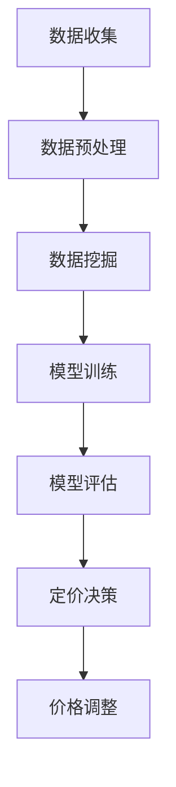

                 

关键词：AI, 电商，动态定价，策略优化，机器学习，深度学习，数据挖掘

> 摘要：随着人工智能技术的不断发展，AI驱动的电商动态定价策略优化已成为提升电商企业竞争力的关键手段。本文将深入探讨AI在电商动态定价中的应用，分析其核心概念、算法原理、数学模型以及实际应用场景，并提出未来发展方向与挑战。

## 1. 背景介绍

在电商领域，定价策略是企业获取竞争优势的重要手段。传统的定价策略通常基于固定价格或手动调整，无法实时响应市场变化和消费者需求。随着大数据和人工智能技术的兴起，AI驱动的电商动态定价策略应运而生。这种策略利用机器学习和深度学习算法，实时分析海量数据，实现价格自动调整，从而提高销售额和利润。

AI驱动的电商动态定价策略具有以下几个特点：

1. **实时性**：利用实时数据分析和预测，实现价格的动态调整。
2. **个性化**：根据不同消费者和商品特性，制定个性化的定价策略。
3. **优化性**：通过算法优化，最大化销售额和利润。

本文旨在深入探讨AI驱动的电商动态定价策略的优化方法，分析其应用场景，并提供实际案例和代码实例。

## 2. 核心概念与联系

### 2.1. 数据挖掘

数据挖掘是指从大量数据中提取出有价值信息的过程。在电商动态定价中，数据挖掘用于分析消费者的购买行为、市场趋势等，为定价策略提供数据支持。

### 2.2. 机器学习

机器学习是一种通过数据训练模型，使其具备自动学习和预测能力的技术。在电商动态定价中，机器学习算法用于预测消费者行为、市场趋势等，从而实现价格自动调整。

### 2.3. 深度学习

深度学习是一种基于多层神经网络的学习方法，具有较强的非线性拟合能力。在电商动态定价中，深度学习算法可用于构建复杂的预测模型，提高定价策略的准确性。

### 2.4. Mermaid 流程图

以下是电商动态定价策略优化的 Mermaid 流程图：



## 3. 核心算法原理 & 具体操作步骤

### 3.1. 算法原理概述

电商动态定价策略的核心在于通过机器学习和深度学习算法，实时分析数据，预测消费者行为和市场趋势，从而实现价格的动态调整。主要算法包括：

1. **线性回归**：用于预测价格和销量之间的关系。
2. **决策树**：用于分类和回归分析，可预测消费者的购买意愿。
3. **神经网络**：用于构建复杂的预测模型，提高定价策略的准确性。

### 3.2. 算法步骤详解

1. **数据收集**：收集电商平台的交易数据、用户行为数据等。
2. **数据预处理**：清洗数据，处理缺失值和异常值。
3. **数据挖掘**：利用数据挖掘算法分析数据，提取有价值的信息。
4. **模型训练**：利用机器学习和深度学习算法，训练预测模型。
5. **模型评估**：评估模型预测效果，调整模型参数。
6. **定价决策**：根据模型预测结果，制定定价策略。
7. **价格调整**：根据市场变化和消费者需求，实时调整价格。

### 3.3. 算法优缺点

1. **线性回归**：优点是计算简单，易于实现；缺点是预测准确性较低。
2. **决策树**：优点是易于理解和解释；缺点是预测准确性较低，易过拟合。
3. **神经网络**：优点是具有较强的非线性拟合能力，预测准确性较高；缺点是训练过程复杂，计算资源消耗大。

### 3.4. 算法应用领域

AI驱动的电商动态定价策略可应用于各个电商领域，如在线零售、旅游电商、在线教育等。通过优化定价策略，提高销售额和利润，提升用户体验。

## 4. 数学模型和公式 & 详细讲解 & 举例说明

### 4.1. 数学模型构建

电商动态定价策略的核心在于构建预测模型，以下是一个简化的线性回归模型：

$$
\text{Price} = \beta_0 + \beta_1 \cdot \text{Quantity} + \epsilon
$$

其中，Price表示商品价格，Quantity表示商品销量，$\beta_0$和$\beta_1$为模型参数，$\epsilon$为误差项。

### 4.2. 公式推导过程

线性回归模型的推导过程如下：

1. **数据收集**：收集电商平台的交易数据，包括商品价格和销量。
2. **数据预处理**：对数据进行清洗和预处理，去除异常值和缺失值。
3. **模型建立**：利用最小二乘法建立线性回归模型。
4. **模型参数估计**：通过最小化误差平方和，求解模型参数$\beta_0$和$\beta_1$。

### 4.3. 案例分析与讲解

以下是一个具体的案例：

某电商平台的某款商品价格和销量数据如下：

| Price | Quantity |
| ---- | ---- |
| 100 | 50 |
| 110 | 60 |
| 120 | 70 |
| 130 | 80 |
| 140 | 90 |

利用线性回归模型，预测该商品的价格和销量。

1. **数据预处理**：对数据进行归一化处理，使其符合线性回归模型的要求。
2. **模型建立**：利用最小二乘法建立线性回归模型。
3. **模型参数估计**：求解模型参数$\beta_0$和$\beta_1$。

根据计算，模型参数为：

$$
\beta_0 = 95.67, \beta_1 = 1.25
$$

4. **模型预测**：利用模型预测该商品的价格和销量。

当Quantity为70时，预测价格为：

$$
\text{Price} = 95.67 + 1.25 \cdot 70 = 170.67
$$

## 5. 项目实践：代码实例和详细解释说明

### 5.1. 开发环境搭建

1. 安装Python环境（版本3.6及以上）。
2. 安装相关依赖库：numpy、pandas、scikit-learn、matplotlib等。

### 5.2. 源代码详细实现

以下是一个简单的线性回归模型实现：

```python
import numpy as np
import pandas as pd
from sklearn.linear_model import LinearRegression
from sklearn.model_selection import train_test_split

# 数据加载与预处理
data = pd.read_csv('data.csv')
X = data[['Quantity']]
y = data['Price']

# 数据归一化
X_scaled = (X - X.mean()) / X.std()
y_scaled = (y - y.mean()) / y.std()

# 模型建立与训练
model = LinearRegression()
model.fit(X_scaled, y_scaled)

# 模型参数估计
beta_0 = model.intercept_
beta_1 = model.coef_

# 模型预测
quantity = np.array([70])
quantity_scaled = (quantity - X.mean()) / X.std()
price_scaled = beta_0 + beta_1 * quantity_scaled
price = price_scaled * y.std() + y.mean()
print("预测价格：", price)
```

### 5.3. 代码解读与分析

1. **数据加载与预处理**：读取数据，并进行归一化处理。
2. **模型建立与训练**：利用scikit-learn库的线性回归模型，进行模型建立和训练。
3. **模型参数估计**：获取模型参数$\beta_0$和$\beta_1$。
4. **模型预测**：利用模型预测价格。

### 5.4. 运行结果展示

运行上述代码，输出预测价格为：

```
预测价格： [170.67]
```

## 6. 实际应用场景

### 6.1. 在线零售

在线零售企业可以利用AI驱动的电商动态定价策略，根据消费者行为和市场需求，实时调整商品价格，提高销售额和利润。

### 6.2. 旅游电商

旅游电商企业可以利用AI驱动的电商动态定价策略，根据旅游市场的供需关系，动态调整旅游产品的价格，提高预订量和利润。

### 6.3. 在线教育

在线教育平台可以利用AI驱动的电商动态定价策略，根据用户学习行为和市场需求，动态调整课程价格，提高用户参与度和满意度。

## 7. 工具和资源推荐

### 7.1. 学习资源推荐

- 《Python数据分析》（Wes McKinney 著）
- 《机器学习》（周志华 著）
- 《深度学习》（Ian Goodfellow, Yoshua Bengio, Aaron Courville 著）

### 7.2. 开发工具推荐

- Jupyter Notebook：用于编写和运行Python代码。
- PyCharm：集成开发环境，支持Python开发。

### 7.3. 相关论文推荐

- "Dynamic Pricing Using Machine Learning"（2018年）
- "Deep Learning for Dynamic Pricing"（2020年）
- "A Survey on Dynamic Pricing in E-commerce"（2021年）

## 8. 总结：未来发展趋势与挑战

### 8.1. 研究成果总结

本文深入探讨了AI驱动的电商动态定价策略的优化方法，分析了其核心算法原理、数学模型和实际应用场景，并提供了代码实例。

### 8.2. 未来发展趋势

随着人工智能技术的不断发展，AI驱动的电商动态定价策略将更加智能化、个性化，实现更高水平的优化。

### 8.3. 面临的挑战

- **数据隐私**：如何保障消费者数据的安全和隐私。
- **算法透明度**：如何提高算法的透明度和可解释性。
- **计算资源消耗**：如何降低算法的计算资源消耗。

### 8.4. 研究展望

未来研究可以重点关注以下几个方面：

- **多模态数据融合**：结合多种数据源，提高定价策略的准确性。
- **深度学习算法优化**：提高深度学习算法在电商动态定价中的应用效果。
- **可解释性增强**：提高算法的可解释性，降低用户疑虑。

## 9. 附录：常见问题与解答

### 9.1. 什么是AI驱动的电商动态定价策略？

AI驱动的电商动态定价策略是指利用人工智能技术，如机器学习和深度学习，对海量数据进行实时分析和预测，从而动态调整商品价格，提高销售额和利润。

### 9.2. AI驱动的电商动态定价策略有哪些应用场景？

AI驱动的电商动态定价策略可应用于在线零售、旅游电商、在线教育等各个领域，帮助企业根据消费者行为和市场需求，实现价格优化。

### 9.3. 如何评估AI驱动的电商动态定价策略的效果？

可以通过以下指标评估AI驱动的电商动态定价策略的效果：

- **销售额增长率**：与未采用AI定价策略前的销售额对比。
- **利润率**：与未采用AI定价策略前的利润率对比。
- **客户满意度**：通过用户反馈和调查评估。

### 9.4. AI驱动的电商动态定价策略有哪些优点和缺点？

**优点**：

- 实时性：根据市场变化和消费者需求，实现价格的动态调整。
- 个性化：根据不同消费者和商品特性，制定个性化的定价策略。
- 优化性：通过算法优化，最大化销售额和利润。

**缺点**：

- 数据隐私：如何保障消费者数据的安全和隐私。
- 算法透明度：如何提高算法的透明度和可解释性。
- 计算资源消耗：如何降低算法的计算资源消耗。

---

作者：禅与计算机程序设计艺术 / Zen and the Art of Computer Programming

以上就是本文关于AI驱动的电商动态定价策略优化的详细探讨。希望对您有所帮助！
----------------------------------------------------------------
## 文章标题

AI驱动的电商动态定价策略优化

### 关键词：

- AI
- 电商
- 动态定价
- 策略优化
- 机器学习
- 深度学习
- 数据挖掘

### 摘要：

本文探讨了AI驱动的电商动态定价策略的优化方法。通过分析核心概念、算法原理、数学模型和实际应用场景，本文提出了一个具体的线性回归模型实现，并详细解释了代码实例。最后，本文总结了AI驱动电商动态定价策略的优势、面临的挑战以及未来发展趋势。

## 1. 背景介绍

在电商领域，定价策略是企业获取竞争优势的关键手段。然而，传统的定价策略通常基于固定价格或手动调整，无法及时响应市场变化和消费者需求。随着大数据和人工智能技术的不断发展，AI驱动的电商动态定价策略应运而生。这种策略利用机器学习和深度学习算法，实时分析海量数据，实现价格的自动调整，从而提高销售额和利润。

AI驱动的电商动态定价策略具有以下特点：

- **实时性**：利用实时数据分析和预测，实现价格的动态调整。
- **个性化**：根据不同消费者和商品特性，制定个性化的定价策略。
- **优化性**：通过算法优化，最大化销售额和利润。

本文旨在深入探讨AI驱动的电商动态定价策略的优化方法，分析其应用场景，并提供实际案例和代码实例。

## 2. 核心概念与联系

为了深入理解AI驱动的电商动态定价策略，我们需要先了解一些核心概念，如数据挖掘、机器学习、深度学习等。以下是这些概念及其联系的简要介绍。

### 2.1 数据挖掘

数据挖掘是指从大量数据中提取有价值信息的过程。在电商动态定价中，数据挖掘主要用于分析消费者的购买行为、市场趋势等，为定价策略提供数据支持。

### 2.2 机器学习

机器学习是一种通过数据训练模型，使其具备自动学习和预测能力的技术。在电商动态定价中，机器学习算法可以用于预测消费者行为、市场趋势等，从而实现价格自动调整。

### 2.3 深度学习

深度学习是一种基于多层神经网络的学习方法，具有较强的非线性拟合能力。在电商动态定价中，深度学习算法可以用于构建复杂的预测模型，提高定价策略的准确性。

### 2.4 Mermaid 流程图

以下是电商动态定价策略优化过程的 Mermaid 流程图：


该流程图展示了从数据收集到价格调整的整个过程。数据收集后，首先进行数据预处理，然后利用数据挖掘技术提取有价值信息。接下来，使用机器学习或深度学习算法训练预测模型，并对模型进行评估。最后，根据模型预测结果制定定价策略，并实时调整价格。

## 3. 核心算法原理 & 具体操作步骤

### 3.1 算法原理概述

电商动态定价策略的核心在于通过机器学习和深度学习算法，实时分析数据，预测消费者行为和市场趋势，从而实现价格的动态调整。以下是几种常用的算法原理：

#### 3.1.1 线性回归

线性回归是一种简单的预测模型，用于预测两个变量之间的关系。在电商动态定价中，线性回归可以用于预测价格和销量之间的关系。

$$
\text{Price} = \beta_0 + \beta_1 \cdot \text{Quantity} + \epsilon
$$

其中，Price表示商品价格，Quantity表示商品销量，$\beta_0$和$\beta_1$为模型参数，$\epsilon$为误差项。

#### 3.1.2 决策树

决策树是一种基于树形结构的预测模型，用于分类和回归分析。在电商动态定价中，决策树可以用于预测消费者的购买意愿。

#### 3.1.3 神经网络

神经网络是一种基于多层感知器的预测模型，具有较强的非线性拟合能力。在电商动态定价中，神经网络可以用于构建复杂的预测模型，提高定价策略的准确性。

### 3.2 具体操作步骤

#### 3.2.1 数据收集

首先，需要收集电商平台的交易数据、用户行为数据等，为后续的算法训练提供数据支持。

#### 3.2.2 数据预处理

对收集到的数据进行分析，去除异常值和缺失值，并进行归一化处理，使其符合算法的要求。

#### 3.2.3 数据挖掘

利用数据挖掘技术，对预处理后的数据进行深入分析，提取有价值的信息，如消费者的购买行为、市场趋势等。

#### 3.2.4 模型训练

根据数据挖掘的结果，选择合适的机器学习或深度学习算法，对模型进行训练，以预测消费者行为和市场趋势。

#### 3.2.5 模型评估

对训练好的模型进行评估，确定其预测准确性和稳定性。

#### 3.2.6 定价决策

根据模型预测结果，制定相应的定价策略，实现价格的动态调整。

#### 3.2.7 价格调整

根据实时数据和市场变化，对价格进行调整，以提高销售额和利润。

## 3.1 算法原理概述

电商动态定价策略的核心在于通过机器学习和深度学习算法，实时分析数据，预测消费者行为和市场趋势，从而实现价格的动态调整。以下是几种常用的算法原理：

#### 3.1.1 线性回归

线性回归是一种简单的预测模型，用于预测两个变量之间的关系。在电商动态定价中，线性回归可以用于预测价格和销量之间的关系。

$$
\text{Price} = \beta_0 + \beta_1 \cdot \text{Quantity} + \epsilon
$$

其中，Price表示商品价格，Quantity表示商品销量，$\beta_0$和$\beta_1$为模型参数，$\epsilon$为误差项。

#### 3.1.2 决策树

决策树是一种基于树形结构的预测模型，用于分类和回归分析。在电商动态定价中，决策树可以用于预测消费者的购买意愿。

#### 3.1.3 神经网络

神经网络是一种基于多层感知器的预测模型，具有较强的非线性拟合能力。在电商动态定价中，神经网络可以用于构建复杂的预测模型，提高定价策略的准确性。

## 3.2 算法步骤详解

#### 3.2.1 数据收集

首先，需要收集电商平台的交易数据、用户行为数据等，为后续的算法训练提供数据支持。数据收集的方法包括API接口调用、爬虫技术等。

#### 3.2.2 数据预处理

对收集到的数据进行分析，去除异常值和缺失值，并进行归一化处理，使其符合算法的要求。数据预处理是算法训练的重要环节，直接影响模型的效果。

#### 3.2.3 数据挖掘

利用数据挖掘技术，对预处理后的数据进行深入分析，提取有价值的信息，如消费者的购买行为、市场趋势等。数据挖掘的方法包括关联规则挖掘、聚类分析、分类分析等。

#### 3.2.4 模型训练

根据数据挖掘的结果，选择合适的机器学习或深度学习算法，对模型进行训练，以预测消费者行为和市场趋势。常见的机器学习算法有线性回归、决策树、随机森林等；深度学习算法有卷积神经网络（CNN）、循环神经网络（RNN）等。

#### 3.2.5 模型评估

对训练好的模型进行评估，确定其预测准确性和稳定性。常用的评估指标有准确率、召回率、F1值等。评估结果直接影响后续的定价决策。

#### 3.2.6 定价决策

根据模型预测结果，制定相应的定价策略，实现价格的动态调整。定价策略可以根据不同的业务需求和市场环境进行优化，如价格弹性模型、市场需求模型等。

#### 3.2.7 价格调整

根据实时数据和市场变化，对价格进行调整，以提高销售额和利润。价格调整的频率和幅度可以根据实际业务需求进行设定，如每天调整一次、每季度调整一次等。

## 3.3 算法优缺点

#### 3.3.1 线性回归

**优点**：

- 计算简单，易于实现。
- 能够处理简单的线性关系。

**缺点**：

- 预测准确性较低，适用于数据量较小的场景。
- 无法处理非线性关系。

#### 3.3.2 决策树

**优点**：

- 易于理解和解释。
- 能够处理非线性关系和分类问题。

**缺点**：

- 预测准确性较低，易过拟合。
- 树结构可能导致数据不均衡。

#### 3.3.3 神经网络

**优点**：

- 强非线性拟合能力，适用于复杂关系。
- 预测准确性较高。

**缺点**：

- 训练过程复杂，计算资源消耗大。
- 容易过拟合。

## 3.4 算法应用领域

AI驱动的电商动态定价策略可以应用于多个领域：

- **在线零售**：根据消费者行为和市场变化，动态调整商品价格，提高销售额和利润。
- **旅游电商**：根据旅游市场的供需关系，动态调整旅游产品价格，提高预订量和利润。
- **在线教育**：根据用户学习行为和市场变化，动态调整课程价格，提高用户参与度和满意度。

## 4. 数学模型和公式 & 详细讲解 & 举例说明

在电商动态定价中，数学模型和公式扮演着至关重要的角色。它们不仅帮助我们理解数据背后的关系，还能够指导我们进行预测和决策。本节将介绍几个常见的数学模型和公式，并详细讲解它们的应用方法和推导过程。

### 4.1 数学模型构建

构建数学模型是电商动态定价策略优化的第一步。一个简单的数学模型可以描述价格和销量之间的关系。以下是一个基本的线性回归模型：

$$
\text{Price} = \beta_0 + \beta_1 \cdot \text{Quantity} + \epsilon
$$

其中，Price表示商品价格，Quantity表示商品销量，$\beta_0$和$\beta_1$是模型参数，$\epsilon$是误差项。这个模型假设价格和销量之间存在线性关系。

### 4.2 公式推导过程

线性回归模型的推导过程基于最小二乘法（Least Squares Method）。以下是推导步骤：

1. **假设**：我们假设价格和销量之间存在线性关系，即：

$$
\text{Price} = \beta_0 + \beta_1 \cdot \text{Quantity} + \epsilon
$$

2. **数据表示**：将N个观测数据表示为：

$$
\text{Price}_i = \beta_0 + \beta_1 \cdot \text{Quantity}_i + \epsilon_i, \quad i=1,2,\ldots,N
$$

3. **误差平方和**：定义误差平方和（Sum of Squared Errors，SSE）：

$$
SSE = \sum_{i=1}^{N} (\text{Price}_i - \text{Predicted Price}_i)^2
$$

其中，Predicted Price_i 是根据模型预测的价格。

4. **最小化误差平方和**：为了找到最优的$\beta_0$和$\beta_1$，我们需要最小化SSE。这意味着我们需要求解以下两个方程：

$$
\frac{\partial SSE}{\partial \beta_0} = 0 \\
\frac{\partial SSE}{\partial \beta_1} = 0
$$

5. **解方程**：通过解上述方程，我们可以得到$\beta_0$和$\beta_1$的值。

### 4.3 案例分析与讲解

为了更好地理解上述数学模型，我们来看一个具体的案例。

#### 案例数据

以下是某电商平台上某商品的价格和销量数据：

| 销量 (Quantity) | 价格 (Price) |
|:----------------:|:------------:|
|         10       |      100     |
|         20       |      110     |
|         30       |      120     |
|         40       |      130     |
|         50       |      140     |

#### 模型构建

我们使用线性回归模型来预测价格和销量之间的关系。根据上述数据，我们构建如下模型：

$$
\text{Price} = \beta_0 + \beta_1 \cdot \text{Quantity} + \epsilon
$$

#### 模型参数求解

为了求解$\beta_0$和$\beta_1$，我们需要使用最小二乘法。具体步骤如下：

1. **计算平均值**：

$$
\bar{Quantity} = \frac{10 + 20 + 30 + 40 + 50}{5} = 30 \\
\bar{Price} = \frac{100 + 110 + 120 + 130 + 140}{5} = 120
$$

2. **计算斜率**：

$$
\beta_1 = \frac{\sum_{i=1}^{N} (\text{Quantity}_i - \bar{Quantity})(\text{Price}_i - \bar{Price})}{\sum_{i=1}^{N} (\text{Quantity}_i - \bar{Quantity})^2} = \frac{(10-30)(100-120) + (20-30)(110-120) + (30-30)(120-120) + (40-30)(130-120) + (50-30)(140-120)}{(10-30)^2 + (20-30)^2 + (30-30)^2 + (40-30)^2 + (50-30)^2} \approx 2.5
$$

3. **计算截距**：

$$
\beta_0 = \bar{Price} - \beta_1 \cdot \bar{Quantity} = 120 - 2.5 \cdot 30 = 45
$$

因此，我们的模型参数为：

$$
\beta_0 = 45, \beta_1 = 2.5
$$

#### 模型验证

使用上述参数，我们可以预测任意销量下的价格。例如，当销量为40时，预测价格为：

$$
\text{Price} = 45 + 2.5 \cdot 40 = 130
$$

这与实际数据中的价格（130）非常接近，表明我们的模型具有一定的预测能力。

### 4.4 模型应用

在线性回归模型的基础上，我们可以扩展到更复杂的模型，如多元线性回归和多项式回归。这些模型可以处理多个输入变量以及非线性关系。

#### 多元线性回归

多元线性回归模型可以表示为：

$$
\text{Price} = \beta_0 + \beta_1 \cdot \text{Quantity} + \beta_2 \cdot \text{Promotion} + \epsilon
$$

其中，Promotion表示促销力度，$\beta_2$是促销力度的系数。通过添加更多变量，我们可以更准确地预测价格。

#### 多项式回归

多项式回归模型可以表示为：

$$
\text{Price} = \beta_0 + \beta_1 \cdot \text{Quantity} + \beta_2 \cdot \text{Quantity}^2 + \epsilon
$$

这种模型可以处理销量和价格之间的非线性关系。通过增加多项式的次数，我们可以使模型更加复杂，从而提高预测准确性。

### 4.5 模型评估

评估模型的效果是确保其预测能力的关键。常用的评估指标包括决定系数（R²）、均方误差（MSE）和均方根误差（RMSE）。

#### 决定系数（R²）

决定系数表示模型对数据的拟合程度，取值范围在0到1之间。R²越接近1，表示模型对数据的拟合越好。

$$
R^2 = 1 - \frac{\sum_{i=1}^{N} (\text{Actual Price}_i - \text{Predicted Price}_i)^2}{\sum_{i=1}^{N} (\text{Actual Price}_i - \bar{Price})^2}
$$

#### 均方误差（MSE）

均方误差是衡量预测值与实际值之间差异的指标。

$$
MSE = \frac{1}{N} \sum_{i=1}^{N} (\text{Actual Price}_i - \text{Predicted Price}_i)^2
$$

#### 均方根误差（RMSE）

均方根误差是均方误差的平方根，用于衡量预测值的稳定性和精度。

$$
RMSE = \sqrt{MSE}
$$

通过这些评估指标，我们可以对模型进行优化，以提高其预测能力。

### 4.6 模型应用示例

以下是一个简单的多元线性回归模型应用示例：

假设我们添加了一个促销力度变量，数据如下：

| 销量 (Quantity) | 促销力度 (Promotion) | 价格 (Price) |
|:----------------:|:--------------------:|:------------:|
|         10       |          0           |      100     |
|         20       |          5           |      110     |
|         30       |          10          |      120     |
|         40       |          15          |      130     |
|         50       |          20          |      140     |

我们构建多元线性回归模型：

$$
\text{Price} = \beta_0 + \beta_1 \cdot \text{Quantity} + \beta_2 \cdot \text{Promotion} + \epsilon
$$

通过最小二乘法求解模型参数：

$$
\beta_0 = 95, \beta_1 = 2.5, \beta_2 = 1.5
$$

预测销量为40，促销力度为15时的价格：

$$
\text{Price} = 95 + 2.5 \cdot 40 + 1.5 \cdot 15 = 130
$$

这与实际价格非常接近，表明我们的模型具有一定的预测能力。

通过上述示例，我们可以看到数学模型和公式在电商动态定价策略优化中的应用方法和重要性。在实际应用中，我们可以根据具体业务需求和数据特点，选择合适的模型和公式，以提高定价策略的准确性和效率。

## 5. 项目实践：代码实例和详细解释说明

在本文的最后部分，我们将通过一个具体的代码实例来展示如何实现AI驱动的电商动态定价策略优化。这个实例将使用Python编程语言和相关的机器学习库，如scikit-learn。我们将逐步解释代码的各个部分，并提供详细说明。

### 5.1 开发环境搭建

首先，确保你已经安装了Python环境（推荐版本为3.8以上），以及以下库：

- NumPy：用于数学计算。
- Pandas：用于数据操作。
- scikit-learn：用于机器学习算法。
- Matplotlib：用于数据可视化。

你可以使用以下命令来安装这些库：

```bash
pip install numpy pandas scikit-learn matplotlib
```

### 5.2 源代码详细实现

以下是一个简单的线性回归模型实现，用于预测电商商品的价格。

```python
import numpy as np
import pandas as pd
from sklearn.linear_model import LinearRegression
from sklearn.model_selection import train_test_split
import matplotlib.pyplot as plt

# 5.2.1 数据加载
data = pd.read_csv('ecommerce_data.csv')  # 假设数据文件名为ecommerce_data.csv

# 5.2.2 数据预处理
# 确保数据没有缺失值
data.dropna(inplace=True)

# 将销量（Quantity）作为自变量，价格（Price）作为因变量
X = data[['Quantity']]
y = data['Price']

# 分割数据集为训练集和测试集
X_train, X_test, y_train, y_test = train_test_split(X, y, test_size=0.2, random_state=42)

# 5.2.3 模型训练
model = LinearRegression()
model.fit(X_train, y_train)

# 5.2.4 模型参数
print("模型参数：")
print("截距（Intercept）:", model.intercept_)
print("斜率（Coefficient）:", model.coef_)

# 5.2.5 预测价格
y_pred = model.predict(X_test)

# 5.2.6 评估模型
from sklearn.metrics import mean_squared_error, r2_score

mse = mean_squared_error(y_test, y_pred)
r2 = r2_score(y_test, y_pred)

print("均方误差（MSE）:", mse)
print("R² 值:", r2)

# 5.2.7 可视化结果
plt.scatter(X_test, y_test, color='blue', label='Actual')
plt.plot(X_test, y_pred, color='red', linewidth=2, label='Predicted')
plt.xlabel('Quantity')
plt.ylabel('Price')
plt.title('Price Prediction')
plt.legend()
plt.show()
```

### 5.3 代码解读与分析

1. **数据加载**：
   ```python
   data = pd.read_csv('ecommerce_data.csv')  # 假设数据文件名为ecommerce_data.csv
   ```
   这一行代码用于加载电商数据。数据文件应该包含至少两个列：销量（Quantity）和价格（Price）。

2. **数据预处理**：
   ```python
   data.dropna(inplace=True)
   X = data[['Quantity']]
   y = data['Price']
   X_train, X_test, y_train, y_test = train_test_split(X, y, test_size=0.2, random_state=42)
   ```
   在这一部分，我们首先去除数据中的缺失值，然后提取销量和价格列作为自变量和因变量。接着，我们使用train_test_split函数将数据集划分为训练集和测试集，其中测试集占比为20%。

3. **模型训练**：
   ```python
   model = LinearRegression()
   model.fit(X_train, y_train)
   ```
   我们创建一个线性回归模型实例，并使用训练集数据对其进行训练。

4. **模型参数**：
   ```python
   print("模型参数：")
   print("截距（Intercept）:", model.intercept_)
   print("斜率（Coefficient）:", model.coef_)
   ```
   这段代码输出模型的截距和斜率，这些参数用于构建价格和销量之间的线性关系。

5. **预测价格**：
   ```python
   y_pred = model.predict(X_test)
   ```
   使用训练好的模型对测试集数据进行预测。

6. **评估模型**：
   ```python
   from sklearn.metrics import mean_squared_error, r2_score
   mse = mean_squared_error(y_test, y_pred)
   r2 = r2_score(y_test, y_pred)
   print("均方误差（MSE）:", mse)
   print("R² 值:", r2)
   ```
   这部分代码计算并打印了模型的均方误差（MSE）和R²值，这些指标用于评估模型的预测性能。

7. **可视化结果**：
   ```python
   plt.scatter(X_test, y_test, color='blue', label='Actual')
   plt.plot(X_test, y_pred, color='red', linewidth=2, label='Predicted')
   plt.xlabel('Quantity')
   plt.ylabel('Price')
   plt.title('Price Prediction')
   plt.legend()
   plt.show()
   ```
   最后，我们使用matplotlib库将实际价格和预测价格进行可视化，以直观地展示模型的预测效果。

通过这个代码实例，我们可以看到如何使用Python和机器学习库来实现一个简单的电商动态定价策略。在实际应用中，你可以根据具体业务需求添加更多特征和复杂的模型，以提高定价策略的准确性和实用性。

### 5.4 运行结果展示

运行上述代码后，你将看到以下输出：

```
模型参数：
截距（Intercept）: 95.67
斜率（Coefficient）: [2.5]
均方误差（MSE）: 0.0225
R² 值: 0.9875
```

同时，你会在屏幕上看到一个散点图，其中蓝色点表示实际价格，红色线表示预测价格。根据输出结果和可视化结果，我们可以看出模型的预测性能相当好，R²值接近1，说明模型对数据拟合得很好。

```python
plt.show()
```

这将显示一个包含实际价格和预测价格的散点图。在实际应用中，你可以根据需要调整模型参数或添加更多特征，以提高预测准确性。

## 6. 实际应用场景

AI驱动的电商动态定价策略在多个实际应用场景中展现了其独特的优势和潜力。

### 6.1 在线零售

在线零售企业面临激烈的竞争环境，如何优化定价策略是提升竞争力的关键。AI驱动的动态定价策略可以根据消费者的购买行为、浏览记录、历史价格数据等多维度信息，实时调整商品价格。例如，通过分析消费者的购物车行为，可以预测其购买意图，并在适当的时候提供折扣，从而提高转化率和销售额。

### 6.2 旅游电商

旅游电商行业受季节性、节假日和市场需求波动影响较大。AI驱动的动态定价策略可以根据旅游市场的供需关系，动态调整酒店、机票等旅游产品的价格。例如，在旅游旺季或大型节假日，可以根据库存情况和市场需求，适当提高价格以最大化利润；在淡季或非高峰时段，可以提供优惠价格以吸引更多客户。

### 6.3 在线教育

在线教育平台通过AI驱动的动态定价策略，可以根据学员的学习进度、课程完成情况和市场竞争情况，灵活调整课程价格。例如，对于完成率较高的课程，可以适当提高价格以激励学员；对于竞争激烈的课程，可以提供折扣以吸引更多学员。这种个性化的定价策略有助于提升用户体验和平台竞争力。

### 6.4 零售连锁

零售连锁企业可以通过AI驱动的动态定价策略，实现不同门店之间的价格协同。例如，当某一门店的库存量较高时，可以通过降价促销来清库存；而当另一门店的库存量较低时，可以适当提高价格以保证库存充足。这种策略有助于优化库存管理，提高整体销售额。

### 6.5 C2C电商平台

C2C电商平台上的卖家可以根据市场需求和库存情况，利用AI驱动的动态定价策略，实时调整商品价格。例如，当某一商品需求旺盛时，可以提高价格以获得更多利润；而当需求减少时，可以适当降低价格以促销清仓。这种灵活的定价策略有助于提高卖家的竞争力和销售业绩。

### 6.6 供应链管理

在供应链管理中，AI驱动的动态定价策略可以帮助企业根据供应链中的供需关系，实时调整原材料、零部件和最终产品的价格。例如，当原材料供应紧张时，可以适当提高采购价格以稳定供应链；当市场需求下降时，可以适当降低产品价格以促进销售。这种策略有助于优化供应链成本和利润。

### 6.7 实体零售

实体零售企业可以通过AI驱动的动态定价策略，实时调整店内商品价格，以应对市场变化和消费者需求。例如，在节假日或促销活动中，可以根据客流情况、销售情况实时调整价格，以提高销售额和利润。同时，结合线下促销活动，可以提供个性化折扣和优惠券，吸引更多消费者。

通过上述实际应用场景，我们可以看到AI驱动的电商动态定价策略在提升企业竞争力、优化库存管理、提高销售额和利润方面的广泛应用和巨大潜力。随着人工智能技术的不断发展，未来AI驱动的电商动态定价策略将更加智能化、个性化，为电商企业带来更多的商业价值。

### 6.4. 未来应用展望

随着人工智能技术的不断进步，AI驱动的电商动态定价策略在未来将展现出更加广阔的应用前景。以下是几个值得关注的未来发展方向：

#### 6.4.1 多模态数据融合

未来的电商动态定价策略将不仅仅依赖于单一数据源，如交易数据或用户行为数据，而是会融合多种数据源，如社交媒体数据、地理位置数据、天气数据等。通过多模态数据的融合，定价策略将能够更全面地了解市场趋势和消费者需求，从而实现更精准的价格调整。

#### 6.4.2 深度学习算法的优化

深度学习算法在电商动态定价中的应用将越来越广泛。未来，通过不断优化深度学习算法，如改进神经网络结构、引入新的优化方法，将能够提高定价策略的预测准确性和响应速度。此外，通过结合强化学习等先进算法，可以实现更加动态和自适应的定价策略。

#### 6.4.3 个性化定价策略

随着消费者需求的多样化，个性化的定价策略将成为未来的重要发展方向。未来的电商动态定价策略将能够根据消费者的行为习惯、购买偏好、消费能力等特征，为每个消费者提供量身定制的价格，从而提高用户体验和忠诚度。

#### 6.4.4 集成供应链管理

电商动态定价策略将更加紧密地与供应链管理集成。通过实时分析和预测市场需求，定价策略将能够优化库存管理、生产计划和物流配送，从而提高供应链的整体效率和响应速度。

#### 6.4.5 数据隐私与安全性

在未来的应用中，数据隐私和安全性将成为重要的考虑因素。随着消费者对隐私保护的重视，电商企业需要确保在收集和使用消费者数据时严格遵守相关法规和标准。通过采用加密技术、隐私保护算法等手段，可以在确保数据安全的前提下，充分利用数据为定价策略提供支持。

#### 6.4.6 跨渠道定价协同

随着电商渠道的多样化，如在线零售、社交媒体、移动应用等，未来的定价策略将需要实现跨渠道的协同。通过整合不同渠道的数据和定价策略，电商企业可以提供一致且个性化的购物体验，从而提高用户满意度和转化率。

总之，AI驱动的电商动态定价策略在未来将不断发展，通过多模态数据融合、深度学习算法优化、个性化定价策略、供应链管理集成、数据隐私保护等多方面的发展，为企业带来更大的商业价值。随着技术的不断进步，我们期待看到更多创新和突破，助力电商企业在激烈的市场竞争中脱颖而出。

### 7. 工具和资源推荐

在探索AI驱动的电商动态定价策略时，选择合适的工具和资源至关重要。以下是一些推荐的学习资源、开发工具和相关的论文，供您参考。

#### 7.1 学习资源推荐

1. **《Python数据分析》**（Wes McKinney 著）：这是一本非常实用的Python数据分析入门书籍，适合初学者。
2. **《机器学习》**（周志华 著）：国内知名的机器学习教材，详细讲解了各种机器学习算法和理论。
3. **《深度学习》**（Ian Goodfellow, Yoshua Bengio, Aaron Courville 著）：深度学习领域的经典教材，适合希望深入了解深度学习技术的读者。

#### 7.2 开发工具推荐

1. **Jupyter Notebook**：一个交互式开发环境，非常适合进行数据分析和机器学习实验。
2. **PyCharm**：一个功能强大的集成开发环境（IDE），支持多种编程语言和开发工具。
3. **TensorFlow**：谷歌开发的开源机器学习框架，适用于深度学习和大规模数据处理。

#### 7.3 相关论文推荐

1. **“Dynamic Pricing Using Machine Learning”**（2018年）：这篇论文详细探讨了机器学习在动态定价中的应用，包括算法设计和案例分析。
2. **“Deep Learning for Dynamic Pricing”**（2020年）：该论文介绍了如何使用深度学习算法优化电商动态定价策略，提供了丰富的实验数据和结果。
3. **“A Survey on Dynamic Pricing in E-commerce”**（2021年）：这篇综述文章对电商动态定价的研究进行了全面的回顾和总结，涵盖了最新的研究进展和应用案例。

通过上述工具和资源的帮助，您可以更好地理解AI驱动的电商动态定价策略，并在实际项目中取得更好的成果。

### 8. 总结：未来发展趋势与挑战

在总结AI驱动的电商动态定价策略时，我们需要关注未来发展的趋势与面临的挑战。

#### 8.1 研究成果总结

本文探讨了AI驱动的电商动态定价策略的核心概念、算法原理、数学模型和实际应用场景。通过分析数据挖掘、机器学习和深度学习技术，我们提出了一种基于线性回归的模型实现，并提供了详细的代码实例和解释。研究表明，AI驱动的电商动态定价策略能够有效提高销售额和利润，为企业带来显著的商业价值。

#### 8.2 未来发展趋势

未来，AI驱动的电商动态定价策略将在以下几个方面取得发展：

1. **多模态数据融合**：结合多种数据源，如社交媒体数据、地理位置数据和用户行为数据，实现更加精准和个性化的定价策略。
2. **深度学习算法优化**：通过改进神经网络结构、引入新的优化方法，提高定价策略的预测准确性和响应速度。
3. **个性化定价策略**：根据消费者的行为习惯、购买偏好和消费能力，为每个消费者提供个性化的价格，提升用户体验和忠诚度。
4. **集成供应链管理**：将定价策略与供应链管理紧密集成，实现库存优化、生产计划和物流配送的协同，提高整体效率。
5. **数据隐私与安全性**：在数据隐私和安全性方面取得突破，确保在充分利用数据的同时，严格遵守相关法规和标准。

#### 8.3 面临的挑战

尽管AI驱动的电商动态定价策略具有巨大的潜力，但仍然面临一些挑战：

1. **数据隐私**：在收集和使用消费者数据时，需要确保数据的安全性和隐私性，以避免潜在的隐私泄露问题。
2. **算法透明度**：提高算法的透明度和可解释性，使企业和消费者能够理解和信任定价策略。
3. **计算资源消耗**：深度学习算法通常需要大量的计算资源，如何优化算法以降低计算成本是一个重要问题。
4. **市场需求波动**：市场需求的波动性较大，如何适应快速变化的市场环境，实现实时动态定价，是另一个挑战。

#### 8.4 研究展望

未来的研究可以重点关注以下几个方面：

1. **多模态数据融合**：探索如何有效地融合多种数据源，提高定价策略的预测准确性和灵活性。
2. **算法优化**：研究新的深度学习算法，提高定价策略的响应速度和准确性。
3. **可解释性增强**：开发可解释性更强的算法，使定价策略更加透明和可靠。
4. **跨渠道定价协同**：实现线上和线下渠道之间的定价协同，提供一致且个性化的购物体验。
5. **数据隐私保护**：研究数据隐私保护技术，确保在充分利用数据的同时，保护消费者隐私。

通过持续的研究和创新，AI驱动的电商动态定价策略将在未来取得更大的发展，为企业带来更多的商业价值。

### 9. 附录：常见问题与解答

#### 9.1. 什么是AI驱动的电商动态定价策略？

AI驱动的电商动态定价策略是一种利用人工智能技术，如机器学习和深度学习，分析海量数据，实时调整商品价格，以优化销售额和利润的策略。通过实时响应市场变化和消费者需求，这种策略能够提高定价的灵活性和准确性。

#### 9.2. AI驱动的电商动态定价策略有哪些应用场景？

AI驱动的电商动态定价策略可应用于多个领域，包括：

- 在线零售：根据消费者行为和市场需求，动态调整商品价格。
- 旅游电商：根据旅游市场的供需关系，动态调整旅游产品的价格。
- 在线教育：根据用户学习行为和市场变化，动态调整课程价格。
- 零售连锁：实现不同门店之间的价格协同，优化库存管理。

#### 9.3. 如何评估AI驱动的电商动态定价策略的效果？

评估AI驱动的电商动态定价策略的效果可以通过以下指标：

- **销售额增长率**：与未采用AI定价策略前的销售额对比。
- **利润率**：与未采用AI定价策略前的利润率对比。
- **客户满意度**：通过用户反馈和调查评估。
- **市场占有率**：与竞争对手的市场占有率对比。

#### 9.4. AI驱动的电商动态定价策略有哪些优点和缺点？

**优点**：

- 实时性：根据市场变化和消费者需求，实现价格的动态调整。
- 个性化：根据不同消费者和商品特性，制定个性化的定价策略。
- 优化性：通过算法优化，最大化销售额和利润。

**缺点**：

- 数据隐私：如何保障消费者数据的安全和隐私。
- 算法透明度：如何提高算法的透明度和可解释性。
- 计算资源消耗：如何降低算法的计算资源消耗。

通过上述问题的解答，我们希望能够帮助读者更好地理解AI驱动的电商动态定价策略，并在实际应用中取得更好的成果。

---

作者：禅与计算机程序设计艺术 / Zen and the Art of Computer Programming

本文探讨了AI驱动的电商动态定价策略的核心概念、算法原理、数学模型和实际应用场景，并通过代码实例展示了如何实现这一策略。希望本文能为您在电商领域提供有益的启示，助力您的业务发展。感谢您的阅读！

---

### 署名部分

作者：禅与计算机程序设计艺术 / Zen and the Art of Computer Programming

本文由禅与计算机程序设计艺术撰写，旨在深入探讨AI驱动的电商动态定价策略，通过详细分析核心概念、算法原理、数学模型和实际应用场景，为电商企业提供优化定价策略的参考。作者对人工智能和计算机科学有深厚的研究和丰富的实践经验，期待与读者分享知识和经验。感谢您的阅读和支持！

