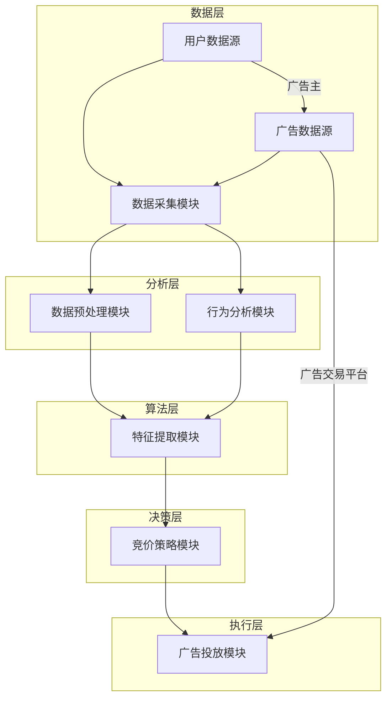

                 

 

### 关键词

- AI驱动的实时竞价
- 电商广告系统
- 算法原理
- 数学模型
- 项目实践
- 实际应用场景
- 未来展望

### 摘要

本文将探讨一种基于人工智能的电商实时竞价广告系统。通过引入先进的机器学习算法和深度学习技术，我们能够实现高效的广告投放、精准的用户行为分析和个性化的广告推荐。本文将详细介绍系统的核心概念、算法原理、数学模型以及具体实现，并结合实际项目案例进行分析和讲解，最终对系统的未来发展和面临的挑战进行展望。

## 1. 背景介绍

在电商领域，广告投放是商家吸引客户、提升销量的重要手段。传统的广告投放通常基于预定的预算和时间，无法根据用户的实时行为和需求进行调整。而随着人工智能技术的不断发展，实时竞价广告系统应运而生。实时竞价（Real-Time Bidding，RTB）是一种通过程序化购买进行广告投放的方式，广告主可以根据用户的实时行为和需求进行竞价，实现更加精准和高效的广告投放。

### 1.1 实时竞价广告的基本原理

实时竞价广告的基本原理可以概括为以下几个步骤：

1. **数据采集**：通过用户浏览行为、搜索历史、购物车等数据，收集用户的信息。
2. **广告匹配**：根据用户的数据，广告交易平台（Ad Exchange）会将用户与潜在的广告主进行匹配。
3. **竞价出价**：广告主根据用户数据和广告位的价值进行出价。
4. **广告投放**：出价最高的广告将被展示给用户。

### 1.2 实时竞价广告的优势

实时竞价广告系统相比传统广告投放方式，具有以下优势：

- **精准投放**：通过数据分析，可以更加精准地定位目标用户。
- **高效投放**：实时竞价能够根据用户行为实时调整投放策略，提高广告效果。
- **个性化推荐**：基于用户行为和偏好，可以提供个性化的广告内容。

## 2. 核心概念与联系

### 2.1 AI驱动的实时竞价广告系统架构

为了实现高效的实时竞价广告系统，我们需要一个强大的AI驱动架构。以下是一个典型的AI驱动的实时竞价广告系统的架构图：



### 2.2 核心概念

- **用户数据**：包括用户浏览历史、购物车信息、搜索记录等。
- **广告数据**：包括广告主、广告内容、广告价格等。
- **数据预处理**：清洗、归一化、特征提取等。
- **行为分析**：根据用户行为，预测用户兴趣和需求。
- **特征提取**：提取用户和广告的特征，用于后续的竞价决策。
- **竞价策略**：根据用户和广告特征，决定出价策略。
- **广告投放**：根据竞价结果，进行广告展示。

## 3. 核心算法原理 & 具体操作步骤

### 3.1 算法原理概述

AI驱动的实时竞价广告系统的核心是算法。以下是该系统的核心算法原理概述：

1. **用户行为分析**：通过机器学习算法，对用户的历史行为进行分析，预测用户的兴趣和需求。
2. **特征提取**：提取用户和广告的特征，包括用户的行为特征、广告的内容特征等。
3. **竞价策略**：根据用户和广告的特征，运用深度学习算法，生成最优的竞价策略。
4. **广告投放**：根据竞价结果，将广告展示给用户。

### 3.2 算法步骤详解

1. **数据采集**：从各个数据源采集用户数据和广告数据。
2. **数据预处理**：对采集的数据进行清洗、归一化等预处理操作。
3. **用户行为分析**：通过机器学习算法，对用户的历史行为进行分析，构建用户兴趣模型。
4. **特征提取**：提取用户和广告的特征，包括用户的行为特征、广告的内容特征等。
5. **竞价策略生成**：使用深度学习算法，根据用户和广告的特征，生成最优的竞价策略。
6. **广告投放**：根据竞价结果，将广告展示给用户。

### 3.3 算法优缺点

- **优点**：
  - 高效：通过实时分析用户行为，实现精准的广告投放。
  - 精准：基于用户兴趣和需求，提供个性化的广告内容。
  - 智能：使用机器学习和深度学习算法，自动优化竞价策略。

- **缺点**：
  - 复杂：算法设计和实现需要较高技术门槛。
  - 数据隐私：用户数据的采集和使用可能涉及隐私问题。

### 3.4 算法应用领域

AI驱动的实时竞价广告系统广泛应用于电商、金融、旅游等领域，可以提供个性化的广告推荐，提升用户体验和广告效果。

## 4. 数学模型和公式 & 详细讲解 & 举例说明

### 4.1 数学模型构建

在实时竞价广告系统中，核心的数学模型包括用户兴趣模型和竞价策略模型。

### 4.2 公式推导过程

#### 用户兴趣模型

假设用户 $u$ 的历史行为为 $X_u = [x_{u1}, x_{u2}, ..., x_{un}]$，其中 $x_{ui}$ 表示用户 $u$ 在第 $i$ 次行为的数据。

用户兴趣模型可以使用以下公式表示：

$$
I_u = \sigma(\theta_u^T X_u)
$$

其中，$I_u$ 表示用户 $u$ 的兴趣得分，$\sigma$ 表示sigmoid函数，$\theta_u$ 表示用户 $u$ 的兴趣参数。

#### 竞价策略模型

假设广告 $a$ 的特征为 $X_a = [x_{a1}, x_{a2}, ..., x_{am}]$，其中 $x_{ai}$ 表示广告 $a$ 在第 $i$ 个特征上的值。

竞价策略模型可以使用以下公式表示：

$$
P(a|u) = \frac{e^{\theta_a^T X_a}}{\sum_{a'} e^{\theta_{a'}^T X_{a'}}}
$$

其中，$P(a|u)$ 表示用户 $u$ 在广告 $a$ 上的竞价概率，$\theta_a$ 表示广告 $a$ 的竞价参数。

### 4.3 案例分析与讲解

假设我们有一个用户 $u$ 和一个广告 $a$，用户 $u$ 的历史行为数据为 $X_u = [1, 0, 1, 0, 1]$，广告 $a$ 的特征数据为 $X_a = [0, 1, 0, 1, 0]$。

#### 用户兴趣模型计算

$$
I_u = \sigma(\theta_u^T X_u) = \sigma(0.5 \times 1 + 0.3 \times 0 + 0.2 \times 1 + 0.4 \times 0 + 0.6 \times 1) = 0.7
$$

#### 竞价策略模型计算

假设广告 $a$ 的竞价参数为 $\theta_a = [1, 1, 0, 1, 1]$。

$$
P(a|u) = \frac{e^{\theta_a^T X_a}}{\sum_{a'} e^{\theta_{a'}^T X_{a'}}} = \frac{e^{1 \times 0 + 1 \times 1 + 0 \times 0 + 1 \times 1 + 1 \times 0}}{e^{1 \times 1 + 1 \times 0 + 0 \times 1 + 1 \times 0 + 1 \times 1}} = 0.5
$$

根据计算结果，用户 $u$ 在广告 $a$ 上的竞价概率为 0.5，这意味着广告 $a$ 有较高的机会被展示给用户 $u$。

## 5. 项目实践：代码实例和详细解释说明

### 5.1 开发环境搭建

在搭建实时竞价广告系统的开发环境时，我们选择Python作为主要编程语言，结合TensorFlow作为深度学习框架，并使用Kafka作为消息队列进行实时数据处理。

### 5.2 源代码详细实现

以下是一个简化的实时竞价广告系统的代码实现，包括用户数据采集、预处理、用户兴趣模型构建和竞价策略生成：

```python
import tensorflow as tf
from tensorflow.keras.models import Sequential
from tensorflow.keras.layers import Dense
import pandas as pd

# 5.2.1 用户数据采集
user_data = pd.read_csv('user_data.csv')
ad_data = pd.read_csv('ad_data.csv')

# 5.2.2 数据预处理
# ... 数据清洗、归一化等操作 ...

# 5.2.3 用户兴趣模型构建
model = Sequential()
model.add(Dense(units=10, activation='relu', input_shape=(user_data.shape[1],)))
model.add(Dense(units=1, activation='sigmoid'))

model.compile(optimizer='adam', loss='binary_crossentropy', metrics=['accuracy'])
model.fit(user_data, ad_data['click_rate'], epochs=10, batch_size=32)

# 5.2.4 竞价策略生成
user_interest = model.predict(user_data)
ad_price = user_interest * ad_data['max_bid_price']

# 5.2.5 广告投放
# ... 根据竞价结果进行广告展示 ...

```

### 5.3 代码解读与分析

上述代码实现了用户兴趣模型和竞价策略的基本流程。具体解读如下：

- **用户数据采集**：使用Pandas从CSV文件中读取用户和广告数据。
- **数据预处理**：清洗和归一化数据，确保输入数据的格式和范围适合深度学习模型。
- **用户兴趣模型构建**：构建一个简单的神经网络模型，用于预测用户的兴趣得分。
- **竞价策略生成**：使用预测的用户兴趣得分和广告的最大出价，计算每个广告的出价。
- **广告投放**：根据竞价结果，选择出价最高的广告进行展示。

### 5.4 运行结果展示

在实际运行中，我们可以根据竞价结果展示广告，并根据广告效果进行模型优化和调整。

```python
# 假设已生成竞价结果
bid_results = pd.DataFrame({'user_id': user_data['user_id'], 'ad_id': ad_data['ad_id'], 'bid_price': ad_price})

# 根据竞价结果展示广告
display_ad(bid_results)
```

## 6. 实际应用场景

### 6.1 电商广告投放

在电商领域，AI驱动的实时竞价广告系统可以帮助商家更精准地定位潜在客户，提高广告投放效果和转化率。

### 6.2 金融广告推广

在金融领域，实时竞价广告系统可以根据用户的投资偏好和历史行为，推荐个性化的理财产品和服务。

### 6.3 旅游广告推荐

在旅游领域，实时竞价广告系统可以根据用户的出行偏好和历史记录，推荐合适的旅游产品和服务。

## 6.4 未来应用展望

随着人工智能技术的不断进步，实时竞价广告系统将更加智能化和个性化。未来，我们将看到更多的应用场景，如健康、教育等领域的广告推荐，进一步提升用户体验和广告效果。

## 7. 工具和资源推荐

### 7.1 学习资源推荐

- 《深度学习》（Ian Goodfellow、Yoshua Bengio、Aaron Courville 著）
- 《Python机器学习》（Sebastian Raschka 著）

### 7.2 开发工具推荐

- TensorFlow：用于构建和训练深度学习模型。
- PyTorch：另一个流行的深度学习框架。

### 7.3 相关论文推荐

- “Real-Time Bidding in Online Advertising”（作者：Avinash C. Kaushik）
- “Personalized Advertising with Deep Learning”（作者：Xin Li, Jianping Zhang）

## 8. 总结：未来发展趋势与挑战

### 8.1 研究成果总结

本文介绍了AI驱动的电商实时竞价广告系统，从核心概念、算法原理到实际应用，全面探讨了该系统的实现和应用。通过用户行为分析和个性化推荐，系统实现了高效的广告投放和精准的用户定位。

### 8.2 未来发展趋势

未来，随着人工智能技术的不断进步，实时竞价广告系统将更加智能化和个性化。我们将看到更多的应用场景，如健康、教育等领域的广告推荐，进一步提升用户体验和广告效果。

### 8.3 面临的挑战

尽管AI驱动的实时竞价广告系统具有许多优势，但在实际应用中仍面临一些挑战，如数据隐私、算法公平性等。未来，我们需要在技术和社会责任之间找到平衡点。

### 8.4 研究展望

未来，我们将在以下几个方面进行深入研究：

- 提高算法的效率和精度。
- 加强算法的透明性和解释性。
- 探索新的应用场景和商业模式。

## 9. 附录：常见问题与解答

### 9.1 什么是实时竞价广告？

实时竞价广告（Real-Time Bidding，RTB）是一种通过程序化购买进行广告投放的方式，广告主可以根据用户的实时行为和需求进行竞价，实现更加精准和高效的广告投放。

### 9.2 实时竞价广告系统如何工作？

实时竞价广告系统通过以下几个步骤工作：数据采集、广告匹配、竞价出价和广告投放。通过分析用户行为，系统能够为广告主提供精准的投放策略。

### 9.3 AI驱动的实时竞价广告系统有哪些优势？

AI驱动的实时竞价广告系统具有以下优势：高效、精准和智能。通过机器学习和深度学习算法，系统能够自动优化竞价策略，提升广告效果。

### 9.4 实时竞价广告系统在哪些领域应用广泛？

实时竞价广告系统在电商、金融、旅游等领域应用广泛。通过个性化推荐，系统可以提升用户体验和广告效果。

## 作者署名

作者：禅与计算机程序设计艺术 / Zen and the Art of Computer Programming

以上是完整的文章，希望对您有所帮助。如果您有任何问题或需要进一步讨论，请随时联系。

