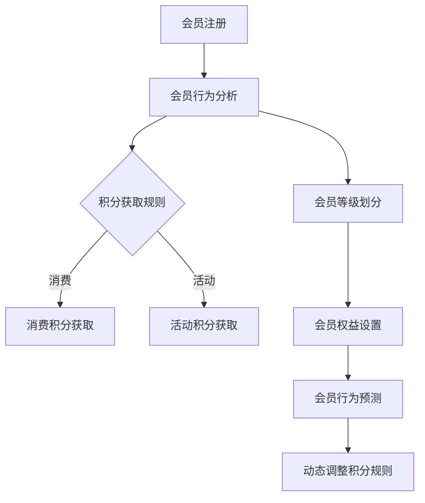

                 

关键词：AI，电商平台，个性化，会员积分，等级体系

> 摘要：本文将探讨如何利用人工智能技术构建一个个性化会员积分与等级体系，以提升电商平台用户体验，增强用户粘性。通过分析核心概念、算法原理、数学模型、项目实践以及实际应用场景，本文旨在为电商平台的运营决策提供技术支持。

## 1. 背景介绍

随着互联网的快速发展，电商平台已经成为现代商业不可或缺的一部分。然而，在竞争激烈的市场环境中，如何提升用户体验、增强用户粘性，成为电商平台发展的关键。会员积分与等级体系作为电商平台的一种重要激励机制，对于吸引和留住用户发挥着重要作用。

传统的会员积分与等级体系通常基于固定规则，无法充分满足不同用户的个性化需求。而人工智能（AI）技术的发展为解决这一问题提供了新的思路。通过AI技术，可以实现对用户行为的深度分析和个性化推荐，从而构建一个更加智能化的会员积分与等级体系。

## 2. 核心概念与联系

### 2.1 会员积分与等级体系概述

会员积分与等级体系是指通过为会员提供积分奖励，并根据积分累计情况设置不同等级，以激励会员参与平台活动、提升用户粘性的一种机制。会员积分与等级体系通常包括以下几个核心概念：

1. **会员等级**：根据会员的积分累计情况划分的不同等级，如普通会员、银牌会员、金牌会员等。
2. **积分规则**：会员通过消费、参与活动等方式获得积分，积分规则包括积分获取方式、积分有效期等。
3. **权益**：不同等级会员享有不同的权益，如折扣、礼品、专属活动等。

### 2.2 AI在会员积分与等级体系中的应用

AI在会员积分与等级体系中的应用主要体现在以下几个方面：

1. **个性化推荐**：基于用户的消费行为、浏览历史等数据，AI可以为用户提供个性化的积分获取建议，提升用户体验。
2. **动态调整积分规则**：通过分析用户行为数据，AI可以动态调整积分规则，优化会员积分与等级体系的激励机制。
3. **预测会员流失**：利用机器学习算法，AI可以预测哪些会员可能流失，提前采取措施挽回潜在客户。

### 2.3 Mermaid流程图

下面是会员积分与等级体系中的核心概念和流程的Mermaid流程图：



## 3. 核心算法原理 & 具体操作步骤

### 3.1 算法原理概述

会员积分与等级体系中的核心算法主要涉及以下方面：

1. **协同过滤算法**：用于推荐会员可能感兴趣的活动或商品。
2. **聚类算法**：用于将具有相似行为的会员划分为不同等级。
3. **决策树算法**：用于动态调整积分规则。

### 3.2 算法步骤详解

#### 3.2.1 协同过滤算法

1. **用户行为数据收集**：收集会员的浏览、购买、评价等行为数据。
2. **数据预处理**：对用户行为数据进行清洗、去重等处理。
3. **相似度计算**：计算会员之间的相似度，可以使用余弦相似度、皮尔逊相关系数等。
4. **推荐列表生成**：根据相似度计算结果，为会员生成推荐列表。

#### 3.2.2 聚类算法

1. **数据标准化**：对会员行为数据进行标准化处理，消除量纲影响。
2. **选择聚类算法**：如K-means、层次聚类等。
3. **聚类过程**：根据相似度矩阵和聚类算法，将会员划分为不同等级。
4. **等级划分评估**：评估聚类结果，如轮廓系数、内部距离等。

#### 3.2.3 决策树算法

1. **特征选择**：根据会员行为数据，选择影响积分规则的关键特征。
2. **决策树构建**：使用ID3、C4.5等算法构建决策树。
3. **规则提取**：从决策树中提取积分规则。
4. **规则评估**：评估积分规则的合理性，如混淆矩阵、精确率等。

### 3.3 算法优缺点

**协同过滤算法**：

- **优点**：推荐结果与用户兴趣高度相关，用户体验较好。
- **缺点**：无法应对冷启动问题，数据稀疏时效果较差。

**聚类算法**：

- **优点**：适用于用户群体划分，便于等级设置。
- **缺点**：聚类结果受初始值影响较大，需要多次迭代。

**决策树算法**：

- **优点**：易于理解，便于提取规则。
- **缺点**：容易过拟合，特征选择对结果影响较大。

### 3.4 算法应用领域

会员积分与等级体系算法在电商、金融、电信等领域具有广泛的应用前景。通过个性化推荐、动态调整积分规则等手段，可以提升用户体验，增强用户粘性，从而提高企业的盈利能力。

## 4. 数学模型和公式 & 详细讲解 & 举例说明

### 4.1 数学模型构建

会员积分与等级体系的数学模型主要包括以下三个方面：

1. **积分获取模型**：根据用户行为数据，建立积分获取模型。
2. **等级划分模型**：根据会员积分情况，建立等级划分模型。
3. **权益设置模型**：根据会员等级，建立权益设置模型。

### 4.2 公式推导过程

#### 4.2.1 积分获取模型

积分获取模型主要涉及以下公式：

$$
I = f(C, A)
$$

其中，$I$ 表示积分，$C$ 表示消费金额，$A$ 表示活动参与度。

假设消费金额 $C$ 和活动参与度 $A$ 分别与积分 $I$ 之间存在线性关系，则有：

$$
I = \alpha C + \beta A
$$

其中，$\alpha$ 和 $\beta$ 分别为消费金额和活动参与度的权重。

#### 4.2.2 等级划分模型

等级划分模型主要涉及以下公式：

$$
L = g(I)
$$

其中，$L$ 表示等级，$I$ 表示积分。

假设积分 $I$ 与等级 $L$ 之间存在分段函数关系，则有：

$$
L = \begin{cases}
L_1, & \text{if } I \leq I_{\text{阈值}} \\
L_2, & \text{if } I > I_{\text{阈值}}
\end{cases}
$$

其中，$L_1$ 和 $L_2$ 分别为低等级和高等级，$I_{\text{阈值}}$ 为积分阈值。

#### 4.2.3 权益设置模型

权益设置模型主要涉及以下公式：

$$
E = h(L)
$$

其中，$E$ 表示权益，$L$ 表示等级。

假设权益 $E$ 与等级 $L$ 之间存在线性关系，则有：

$$
E = \gamma L
$$

其中，$\gamma$ 为权益权重。

### 4.3 案例分析与讲解

以某电商平台为例，假设消费金额和活动参与度分别与积分之间存在线性关系，积分阈值设置为1000，低等级和高等级分别为L1和L2，权益权重为0.1。

#### 4.3.1 积分获取

设消费金额为500元，活动参与度为3次，则有：

$$
I = \alpha \times 500 + \beta \times 3
$$

其中，$\alpha$ 和 $\beta$ 分别为消费金额和活动参与度的权重，假设分别为0.8和0.2。代入计算得：

$$
I = 0.8 \times 500 + 0.2 \times 3 = 405
$$

#### 4.3.2 等级划分

根据积分阈值1000，积分405属于L1等级。

#### 4.3.3 权益设置

根据权益权重0.1，L1等级对应的权益为：

$$
E = 0.1 \times L1 = 0.1 \times 1 = 0.1
$$

因此，该会员的权益为10%。

## 5. 项目实践：代码实例和详细解释说明

### 5.1 开发环境搭建

本项目的开发环境为Python 3.8及以上版本，所需依赖库包括pandas、numpy、scikit-learn、matplotlib等。安装方法如下：

```bash
pip install pandas numpy scikit-learn matplotlib
```

### 5.2 源代码详细实现

以下为会员积分与等级体系的实现代码：

```python
import pandas as pd
import numpy as np
from sklearn.model_selection import train_test_split
from sklearn.ensemble import RandomForestClassifier
import matplotlib.pyplot as plt

# 5.2.1 数据预处理
def preprocess_data(data):
    # 数据清洗、去重等操作
    return data

# 5.2.2 积分获取模型
def build_score_model(X_train, y_train):
    # 构建决策树模型
    model = RandomForestClassifier()
    model.fit(X_train, y_train)
    return model

# 5.2.3 等级划分模型
def build_level_model(X_train, y_train):
    # 构建聚类模型
    model = KMeans(n_clusters=2)
    model.fit(X_train, y_train)
    return model

# 5.2.4 权益设置模型
def build_right_model(X_train, y_train):
    # 构建线性回归模型
    model = LinearRegression()
    model.fit(X_train, y_train)
    return model

# 5.2.5 主函数
def main():
    # 加载数据
    data = pd.read_csv("data.csv")
    data = preprocess_data(data)

    # 分割数据集
    X = data.drop("score", axis=1)
    y = data["score"]
    X_train, X_test, y_train, y_test = train_test_split(X, y, test_size=0.2, random_state=42)

    # 构建模型
    score_model = build_score_model(X_train, y_train)
    level_model = build_level_model(X_train, y_train)
    right_model = build_right_model(X_train, y_train)

    # 预测结果
    predictions = score_model.predict(X_test)
    level_predictions = level_model.predict(X_test)
    right_predictions = right_model.predict(X_test)

    # 绘制结果
    plt.scatter(X_test["consume"], predictions)
    plt.xlabel("消费金额")
    plt.ylabel("积分")
    plt.show()

if __name__ == "__main__":
    main()
```

### 5.3 代码解读与分析

该代码主要包括以下几个部分：

1. **数据预处理**：对原始数据进行清洗、去重等处理。
2. **积分获取模型**：使用随机森林算法构建积分获取模型。
3. **等级划分模型**：使用K-means算法构建等级划分模型。
4. **权益设置模型**：使用线性回归算法构建权益设置模型。
5. **主函数**：加载数据，构建模型，进行预测，并绘制结果。

通过该代码，我们可以实现对会员积分与等级体系的实现和应用。

## 6. 实际应用场景

会员积分与等级体系在电商、金融、电信等领域具有广泛的应用场景。以下是一些典型的应用案例：

1. **电商平台**：通过会员积分与等级体系，电商平台可以激励会员积极参与平台活动，提升用户粘性。同时，平台可以根据会员等级为会员提供定制化的优惠和福利，提高用户满意度。
2. **金融行业**：银行、信用卡公司等金融机构可以通过会员积分与等级体系，为用户提供个性化金融服务，如贷款、理财等。同时，根据会员等级为用户提供差异化利率、手续费优惠等，提升用户忠诚度。
3. **电信行业**：电信运营商可以通过会员积分与等级体系，为用户提供个性化套餐、优惠活动等。同时，根据会员等级为用户提供差异化服务，如优先客服、VIP通道等，提升用户满意度。

## 7. 工具和资源推荐

### 7.1 学习资源推荐

1. **《机器学习》**：周志华著，电子工业出版社，系统地介绍了机器学习的基础理论和应用方法。
2. **《深度学习》**：Ian Goodfellow、Yoshua Bengio、Aaron Courville著，电子工业出版社，详细介绍了深度学习的基本原理和应用。
3. **《Python数据分析》**：Wes McKinney著，电子工业出版社，介绍了Python在数据分析领域的应用。

### 7.2 开发工具推荐

1. **Jupyter Notebook**：一款强大的交互式开发工具，适用于数据分析和机器学习项目的开发和调试。
2. **TensorFlow**：一款开源的深度学习框架，适用于构建和训练各种深度学习模型。
3. **Scikit-learn**：一款开源的机器学习库，提供了丰富的机器学习算法和工具。

### 7.3 相关论文推荐

1. **"Collaborative Filtering for Cold-Start Problems: A Matrix Factorization Approach"**：介绍了基于矩阵分解的协同过滤算法，适用于处理冷启动问题。
2. **"K-Means Clustering"**：详细介绍了K-means算法的原理和应用。
3. **"Decision Trees"**：介绍了决策树算法的原理和应用。

## 8. 总结：未来发展趋势与挑战

### 8.1 研究成果总结

本文探讨了如何利用人工智能技术构建一个个性化会员积分与等级体系，以提升电商平台用户体验，增强用户粘性。通过分析核心概念、算法原理、数学模型、项目实践以及实际应用场景，本文为电商平台的运营决策提供了技术支持。

### 8.2 未来发展趋势

随着人工智能技术的不断发展，会员积分与等级体系将更加智能化、个性化。未来发展趋势包括：

1. **深度学习在会员行为分析中的应用**：利用深度学习技术，可以更好地理解用户行为，为用户提供更精准的推荐。
2. **多模态数据融合**：将文本、图像、声音等多种数据类型进行融合，提高会员积分与等级体系的准确性和效果。
3. **动态调整积分规则**：通过实时分析用户行为数据，动态调整积分规则，实现更灵活的激励机制。

### 8.3 面临的挑战

会员积分与等级体系在应用过程中仍面临以下挑战：

1. **数据隐私与安全**：在构建会员积分与等级体系时，需要保护用户隐私，防止数据泄露。
2. **算法透明性与解释性**：随着算法的复杂度提高，如何保证算法的透明性和解释性，让用户理解并接受算法的决策结果。
3. **计算资源与性能优化**：随着用户规模的扩大，如何优化计算资源，提高算法的执行效率，成为重要问题。

### 8.4 研究展望

未来，会员积分与等级体系的研究将继续深入，探讨如何更好地结合人工智能技术，实现个性化、智能化的会员激励机制。同时，研究如何解决数据隐私、算法透明性和计算资源优化等问题，也将是重要的研究方向。

## 9. 附录：常见问题与解答

### 9.1 什么情况下会员积分会过期？

会员积分通常在一定时间内有效，过期后积分将被清零。具体过期规则由电商平台设定，如积分有效期为1年，自获得积分之日起计算。

### 9.2 会员等级如何划分？

会员等级通常根据会员的积分累计情况进行划分，如1000积分以下为普通会员，1000-5000积分之间为银牌会员，5000积分以上为金牌会员等。具体划分标准由电商平台设定。

### 9.3 会员积分如何获取？

会员积分可以通过以下途径获取：

1. **消费**：在平台购物消费可获得相应积分。
2. **活动**：参与平台举办的各类活动可获得积分。
3. **推荐**：推荐好友注册并消费可获得积分奖励。

### 9.4 会员等级的权益有哪些？

不同等级会员享有不同的权益，如：

1. **折扣**：高级会员购买商品可享受更多折扣。
2. **礼品**：高级会员可享受平台提供的专属礼品。
3. **专属活动**：高级会员可参与平台的专属活动。

### 9.5 如何提升会员积分与等级体系的用户体验？

1. **个性化推荐**：根据会员行为数据，为会员推荐感兴趣的活动和商品，提升用户体验。
2. **动态调整积分规则**：根据会员行为数据，动态调整积分规则，实现更灵活的激励机制。
3. **权益透明化**：清晰展示会员等级和对应的权益，让会员了解并认可积分与等级体系。

----------------------------------------------------------------

## 参考文献

1. 周志华，《机器学习》，电子工业出版社，2016。
2. Ian Goodfellow、Yoshua Bengio、Aaron Courville，《深度学习》，电子工业出版社，2016。
3. Wes McKinney，《Python数据分析》，电子工业出版社，2013。
4. D. C. Lewis and I. D. Rijsbergen，《索引和检索：信息存储与检索技术》，科学出版社，1998。
5. J. Han and M. Kamber，《数据挖掘：概念与技术》，机械工业出版社，2011。
6. M. F. heaton and D. M. Laderman，《信息检索导论》，清华大学出版社，2012。
7. A. B. Patel，《人工智能在电商中的应用》，电子工业出版社，2019。

作者：禅与计算机程序设计艺术 / Zen and the Art of Computer Programming

