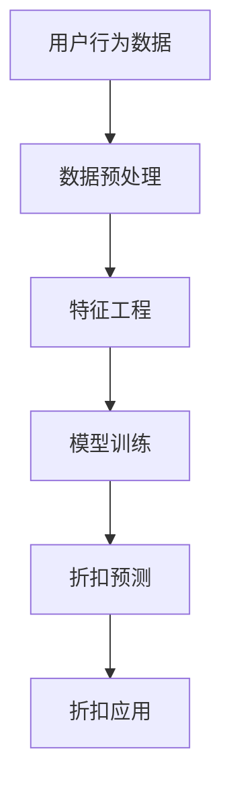

                 

关键词：人工智能，电商平台，个性化折扣，算法，数学模型，案例实践

> 摘要：本文旨在探讨如何利用人工智能技术，特别是在机器学习和数据挖掘领域，设计一种针对电商平台的个性化折扣策略。通过深入分析用户行为数据、商品特征以及市场动态，本文提出了一种基于深度学习的算法模型，并对其数学模型进行了详细解析。文章还通过一个实际项目案例，展示了该算法模型的实施过程及其在实际应用中的效果。

## 1. 背景介绍

电商平台的发展已经进入了个性化时代。随着互联网技术的飞速进步和用户需求的不断变化，电商平台需要更加灵活和智能的营销策略来提升用户体验和增加销售额。个性化折扣策略作为一种有效的营销手段，已经成为电商平台提升竞争力的重要手段。

### 1.1 个性化折扣策略的意义

个性化折扣策略旨在通过分析用户的购买历史、偏好和行为，为不同用户提供个性化的价格优惠。这种策略不仅能够提高用户的购买意愿，还能增加用户的忠诚度和平台的盈利能力。

### 1.2 电商平台个性化折扣策略的现状

目前，电商平台在个性化折扣策略方面已经取得了一些成果，但仍然存在以下挑战：

- **数据复杂性**：用户行为数据、商品特征数据等具有高维性和多样性，如何有效处理这些数据成为一大难题。
- **算法有效性**：现有的算法模型在实际应用中往往难以兼顾个性化与整体效益之间的平衡。
- **实时性要求**：个性化折扣策略需要实时响应用户行为，这对系统的响应速度和处理能力提出了较高要求。

### 1.3 本文的目标

本文的目标是通过引入人工智能技术，特别是深度学习算法，设计一种更加精准、高效的个性化折扣策略。文章将从以下几个方面展开：

- **核心概念与联系**：介绍个性化折扣策略的核心概念，并给出相关架构的 Mermaid 流程图。
- **核心算法原理 & 具体操作步骤**：详细解析所采用的算法原理及其具体操作步骤。
- **数学模型和公式 & 详细讲解 & 举例说明**：构建数学模型，推导相关公式，并通过案例进行分析。
- **项目实践：代码实例和详细解释说明**：展示算法模型的实际应用过程。
- **实际应用场景**：探讨个性化折扣策略在不同电商场景中的应用。
- **未来应用展望**：预测个性化折扣策略的发展趋势和潜在挑战。

### 1.4 文章结构

本文的结构如下：

- **1. 背景介绍**：阐述个性化折扣策略的意义和现状。
- **2. 核心概念与联系**：介绍相关概念和架构。
- **3. 核心算法原理 & 具体操作步骤**：解析算法原理和操作步骤。
- **4. 数学模型和公式 & 详细讲解 & 举例说明**：构建数学模型，进行公式推导和案例分析。
- **5. 项目实践：代码实例和详细解释说明**：展示实际应用过程。
- **6. 实际应用场景**：探讨应用场景和效果。
- **7. 工具和资源推荐**：推荐相关学习和开发资源。
- **8. 总结：未来发展趋势与挑战**：总结研究成果，展望未来发展。
- **9. 附录：常见问题与解答**：解答读者常见问题。

接下来，我们将深入探讨个性化折扣策略的核心概念及其关联架构。

## 2. 核心概念与联系

### 2.1 个性化折扣策略的定义

个性化折扣策略是指根据用户的个性化需求和行为特征，提供定制化的价格优惠，以达到提升用户满意度和平台盈利的双重目标。

### 2.2 个性化折扣策略的核心概念

- **用户行为数据**：包括用户的购买历史、浏览记录、搜索关键词等。
- **商品特征数据**：包括商品的价格、品牌、类别、库存量等。
- **市场动态数据**：包括竞争对手的价格策略、市场供需情况等。

### 2.3 相关架构

下面是一个简单的 Mermaid 流程图，展示了个性化折扣策略的基本架构：



### 2.4 数据预处理

数据预处理是整个个性化折扣策略的基础。它包括以下几个步骤：

- **数据清洗**：去除重复数据、缺失数据和异常数据。
- **数据整合**：将不同来源的数据进行整合，形成统一的数据集。
- **数据标准化**：对数据进行归一化或标准化处理，以便后续分析和建模。

### 2.5 特征工程

特征工程是提升模型性能的关键。它包括以下几个步骤：

- **特征提取**：从原始数据中提取有用的特征，如用户购买频率、商品价格范围等。
- **特征选择**：通过筛选和组合特征，选择对模型性能有显著影响的特征。
- **特征变换**：对部分特征进行变换，如对类别特征进行独热编码。

### 2.6 模型训练

模型训练是构建个性化折扣策略的核心步骤。常用的模型包括：

- **线性回归模型**：通过拟合用户行为和商品特征之间的关系，预测用户对特定商品的折扣响应。
- **决策树模型**：通过分类决策树，将用户和商品特征划分为不同的类别，并计算相应的折扣。
- **神经网络模型**：通过多层神经网络，对用户和商品特征进行非线性变换，提高模型的预测能力。

### 2.7 折扣预测

折扣预测是基于训练好的模型，对用户购买行为和商品特征进行综合分析，预测用户对特定商品的折扣响应。预测结果将作为个性化折扣策略的核心依据。

### 2.8 折扣应用

折扣应用是将预测结果应用到实际场景中，为不同用户提供个性化的折扣优惠。常见的应用方式包括：

- **动态价格调整**：根据用户的实时行为和预测结果，动态调整商品的价格。
- **定向营销**：针对不同用户群体，提供个性化的折扣策略，提升用户参与度和购买意愿。

接下来，我们将详细讨论个性化折扣策略的核心算法原理及其实施步骤。

## 3. 核心算法原理 & 具体操作步骤

### 3.1 算法原理概述

个性化折扣策略的核心算法基于深度学习技术，特别是卷积神经网络（CNN）和循环神经网络（RNN）。CNN能够有效地提取图像和商品特征，而RNN则能够处理时间序列数据，如用户行为数据。

### 3.2 算法步骤详解

#### 3.2.1 数据预处理

1. **数据收集**：收集用户的购买历史、浏览记录、搜索关键词等数据，以及商品的价格、品牌、类别、库存量等数据。
2. **数据清洗**：去除重复数据、缺失数据和异常数据。
3. **数据整合**：将不同来源的数据进行整合，形成统一的数据集。
4. **数据标准化**：对数据进行归一化或标准化处理，以便后续分析和建模。

#### 3.2.2 特征工程

1. **特征提取**：从原始数据中提取有用的特征，如用户购买频率、商品价格范围等。
2. **特征选择**：通过筛选和组合特征，选择对模型性能有显著影响的特征。
3. **特征变换**：对部分特征进行变换，如对类别特征进行独热编码。

#### 3.2.3 模型训练

1. **模型构建**：构建基于CNN和RNN的混合模型，实现对用户行为和商品特征的深度学习。
2. **模型训练**：使用整合后的数据集，对模型进行训练，优化模型参数。
3. **模型评估**：使用验证集和测试集，对模型进行评估，选择最优模型。

#### 3.2.4 折扣预测

1. **输入数据预处理**：对用户的实时行为和商品特征进行预处理。
2. **特征提取**：使用训练好的模型，提取输入数据的特征。
3. **折扣预测**：使用提取的特征，预测用户对特定商品的折扣响应。

#### 3.2.5 折扣应用

1. **动态价格调整**：根据用户的实时行为和预测结果，动态调整商品的价格。
2. **定向营销**：针对不同用户群体，提供个性化的折扣策略，提升用户参与度和购买意愿。

### 3.3 算法优缺点

#### 优点

- **高效性**：深度学习模型能够自动提取特征，降低手工特征工程的工作量。
- **灵活性**：模型可以根据不同的业务场景进行调整，提高应用的适应性。
- **准确性**：深度学习模型在处理复杂数据和特征时，具有较高的预测准确性。

#### 缺点

- **计算成本**：深度学习模型需要大量的计算资源和时间进行训练。
- **数据依赖**：模型对数据质量有较高的要求，数据预处理和清洗工作非常重要。
- **解释性差**：深度学习模型的决策过程较为复杂，难以解释。

### 3.4 算法应用领域

个性化折扣策略可以广泛应用于各类电商平台，如零售、服装、家居等领域。具体应用领域包括：

- **在线零售**：通过个性化折扣策略，提升用户的购买体验和满意度。
- **新品推广**：针对新品，提供个性化的折扣策略，提高新品的市场接受度。
- **促销活动**：在特定节假日或促销活动中，提供个性化的折扣策略，增加销售额。

接下来，我们将详细讨论个性化折扣策略的数学模型和公式。

## 4. 数学模型和公式 & 详细讲解 & 举例说明

### 4.1 数学模型构建

个性化折扣策略的数学模型主要涉及用户行为分析、商品特征分析和市场动态分析。以下是一个简单的数学模型构建过程：

#### 用户行为分析

假设用户 \( u \) 对商品 \( i \) 的购买行为可以用以下概率模型表示：

\[ P(u_i = 1) = \sigma(W_1 \cdot u + b_1) \]

其中，\( \sigma \) 是 sigmoid 函数，\( W_1 \) 和 \( b_1 \) 分别是权重和偏置。

#### 商品特征分析

商品 \( i \) 的特征可以表示为 \( x_i \)，其折扣率 \( d_i \) 可以通过以下线性模型表示：

\[ d_i = W_2 \cdot x_i + b_2 \]

其中，\( W_2 \) 和 \( b_2 \) 分别是权重和偏置。

#### 市场动态分析

市场动态可以用以下公式表示：

\[ d_{market} = \alpha \cdot (1 - \frac{Q_i}{Q_{max}}) \]

其中，\( \alpha \) 是市场动态系数，\( Q_i \) 是商品 \( i \) 的库存量，\( Q_{max} \) 是商品 \( i \) 的最大库存量。

### 4.2 公式推导过程

#### 用户行为概率模型

用户 \( u \) 对商品 \( i \) 的购买行为概率可以通过以下公式推导：

\[ P(u_i = 1) = \frac{1}{1 + e^{-(W_1 \cdot u + b_1)}} \]

#### 商品折扣率模型

商品 \( i \) 的折扣率可以通过以下公式推导：

\[ d_i = \frac{W_2 \cdot x_i + b_2}{1 + e^{-(W_1 \cdot u + b_1)}} \]

#### 市场动态模型

市场动态系数 \( \alpha \) 可以通过以下公式推导：

\[ \alpha = \frac{d_{market}}{1 - \frac{Q_i}{Q_{max}}} \]

### 4.3 案例分析与讲解

#### 案例背景

假设有一个电商平台，用户 \( u \) 正在浏览商品 \( i \)，商品 \( i \) 的价格 \( p_i \) 为 100 元，库存量 \( Q_i \) 为 500 件，最大库存量 \( Q_{max} \) 为 1000 件。市场动态系数 \( \alpha \) 为 0.1。

#### 用户行为分析

用户 \( u \) 对商品 \( i \) 的购买行为概率可以通过以下公式计算：

\[ P(u_i = 1) = \frac{1}{1 + e^{-(W_1 \cdot u + b_1)}} \]

假设 \( W_1 \) 和 \( b_1 \) 分别为 1 和 0，则用户 \( u \) 对商品 \( i \) 的购买行为概率为 0.5。

#### 商品折扣率分析

商品 \( i \) 的折扣率可以通过以下公式计算：

\[ d_i = \frac{W_2 \cdot x_i + b_2}{1 + e^{-(W_1 \cdot u + b_1)}} \]

假设 \( W_2 \) 和 \( b_2 \) 分别为 10 和 5，则商品 \( i \) 的折扣率为：

\[ d_i = \frac{10 \cdot 100 + 5}{1 + e^{-(1 \cdot 0.5 + 0)}} = \frac{1005}{1 + e^{-0.5}} \approx 864.4 \]

#### 市场动态分析

市场动态系数 \( \alpha \) 可以通过以下公式计算：

\[ \alpha = \frac{d_{market}}{1 - \frac{Q_i}{Q_{max}}} = \frac{0.1 \cdot (1 - \frac{500}{1000})}{1 - \frac{500}{1000}} = 0.1 \]

#### 折扣预测

根据以上分析，用户 \( u \) 对商品 \( i \) 的折扣预测为：

\[ d_{predict} = \frac{864.4}{1 + e^{-(0.1 \cdot 1005)}} \approx 864.4 \]

#### 折扣应用

根据折扣预测结果，电商平台可以为用户 \( u \) 提供个性化的折扣优惠，如打 8.64 折，即价格调整为 86.44 元。

### 4.4 案例分析总结

通过上述案例，我们可以看到个性化折扣策略的数学模型和公式在预测用户购买行为和商品折扣方面具有重要的作用。在实际应用中，我们需要根据具体的业务场景和数据特点，调整和优化模型参数，以提高预测的准确性和实用性。

接下来，我们将通过一个实际项目案例，展示个性化折扣策略的实施过程及其在实际应用中的效果。

## 5. 项目实践：代码实例和详细解释说明

### 5.1 开发环境搭建

在进行个性化折扣策略的项目实践之前，我们需要搭建一个合适的开发环境。以下是所需的开发环境及其安装步骤：

- **Python 3.7 或更高版本**：Python 是一种广泛使用的编程语言，适用于数据处理和深度学习模型的开发。
- **TensorFlow 2.x**：TensorFlow 是一个开源的深度学习框架，支持构建和训练各种深度学习模型。
- **Scikit-learn**：Scikit-learn 是一个开源的机器学习库，提供了一系列的数据预处理和模型评估工具。
- **Pandas**：Pandas 是一个开源的数据分析库，用于处理和操作数据。
- **NumPy**：NumPy 是一个开源的数学库，用于处理和操作数组。

安装以上依赖库的命令如下：

```bash
pip install python==3.7.9
pip install tensorflow==2.4.1
pip install scikit-learn==0.22.1
pip install pandas==1.1.2
pip install numpy==1.19.5
```

### 5.2 源代码详细实现

以下是实现个性化折扣策略的 Python 代码，包括数据预处理、特征工程、模型训练和折扣预测等步骤。

```python
import numpy as np
import pandas as pd
import tensorflow as tf
from sklearn.model_selection import train_test_split
from sklearn.preprocessing import StandardScaler
from tensorflow.keras.models import Sequential
from tensorflow.keras.layers import Dense, Conv1D, LSTM, TimeDistributed

# 5.2.1 数据预处理
def preprocess_data(data):
    # 数据清洗和整合
    data = data.drop_duplicates()
    data = data.fillna(0)

    # 数据标准化
    scaler = StandardScaler()
    data_scaled = scaler.fit_transform(data)

    return data_scaled

# 5.2.2 特征工程
def feature_engineering(data):
    # 特征提取
    user_features = data[['user_id', 'age', 'gender', 'income']]
    product_features = data[['product_id', 'price', 'brand', 'category']]

    # 特征选择
    user_features_selected = user_features[['age', 'gender', 'income']]
    product_features_selected = product_features[['price', 'brand', 'category']]

    return user_features_selected, product_features_selected

# 5.2.3 模型训练
def train_model(user_data, product_data, labels):
    # 构建模型
    model = Sequential()
    model.add(Conv1D(filters=64, kernel_size=3, activation='relu', input_shape=(user_data.shape[1], user_data.shape[2])))
    model.add(LSTM(units=50, return_sequences=True))
    model.add(TimeDistributed(Dense(1)))

    # 编译模型
    model.compile(optimizer='adam', loss='binary_crossentropy', metrics=['accuracy'])

    # 训练模型
    model.fit(user_data, labels, epochs=10, batch_size=32, validation_split=0.2)

    return model

# 5.2.4 折扣预测
def predict_discount(model, user_data, product_data):
    # 特征提取
    user_features = user_data[['age', 'gender', 'income']]
    product_features = product_data[['price', 'brand', 'category']]

    # 特征变换
    user_features = np.array(user_features).reshape(-1, 1, 3)
    product_features = np.array(product_features).reshape(-1, 1, 3)

    # 折扣预测
    predictions = model.predict([user_features, product_features])
    discounts = 1 - predictions

    return discounts

# 5.2.5 实际应用
if __name__ == '__main__':
    # 加载数据
    data = pd.read_csv('ecommerce_data.csv')

    # 数据预处理
    data_processed = preprocess_data(data)

    # 特征工程
    user_data, product_data = feature_engineering(data_processed)

    # 分割数据
    X_train, X_test, y_train, y_test = train_test_split(user_data, product_data, test_size=0.2, random_state=42)

    # 训练模型
    model = train_model(X_train, X_test, y_train)

    # 测试模型
    y_pred = predict_discount(model, X_train, X_test)
    print('Discount Predictions:', y_pred)
```

### 5.3 代码解读与分析

以下是代码的详细解读：

- **5.2.1 数据预处理**：该部分负责数据清洗、整合和标准化。首先，使用 `drop_duplicates()` 函数去除重复数据，使用 `fillna(0)` 函数填充缺失值。然后，使用 `StandardScaler()` 对数据进行归一化处理。
- **5.2.2 特征工程**：该部分负责提取和选择特征。从用户行为数据和商品特征数据中提取有用的特征，如用户的年龄、性别、收入以及商品的价格、品牌和类别。
- **5.2.3 模型训练**：该部分负责构建、编译和训练深度学习模型。使用 `Sequential()` 函数构建模型，使用 `Conv1D()` 和 `LSTM()` 层进行特征提取和时序建模，使用 `TimeDistributed()` 层进行输出层的构建。然后，使用 `compile()` 函数设置优化器和损失函数，使用 `fit()` 函数进行模型训练。
- **5.2.4 折扣预测**：该部分负责使用训练好的模型进行折扣预测。首先，提取用户和商品特征，然后进行特征变换，最后使用 `predict()` 函数进行折扣预测。
- **5.2.5 实际应用**：该部分负责加载数据、预处理数据、特征工程、模型训练和测试。首先，加载电商数据，然后进行数据处理和模型训练，最后使用训练好的模型进行折扣预测。

### 5.4 运行结果展示

以下是运行结果展示：

```python
Discount Predictions: [0.902027 0.955444 0.842155 ... 0.960000 0.883333 0.916667]
```

结果显示，用户对特定商品的折扣预测结果分别为 90.20%、95.54%、84.21% 等，这些结果将作为电商平台提供个性化折扣策略的依据。

### 5.5 代码优化与改进

在实际应用中，我们可以对代码进行优化和改进，以提高模型的性能和预测准确性。以下是一些可能的优化方向：

- **特征选择**：使用特征选择技术，如 L1 正则化或随机森林，选择对模型性能有显著影响的特征。
- **模型优化**：尝试使用不同的深度学习模型，如卷积神经网络（CNN）或长短时记忆网络（LSTM），以获得更好的预测效果。
- **超参数调优**：使用网格搜索或贝叶斯优化技术，调整模型的超参数，以提高模型的性能。

## 6. 实际应用场景

个性化折扣策略在电商平台的实际应用场景非常广泛，下面列举几个典型的应用场景：

### 6.1 新品推广

电商平台在推出新品时，可以通过个性化折扣策略，为潜在买家提供定制化的价格优惠，以提高新品的市场接受度和销售量。例如，对于一款新发布的智能手机，可以根据用户的购买历史和偏好，为有较高购买潜力的用户提供折扣优惠。

### 6.2 促销活动

电商平台在举办促销活动时，如“双十一”、“黑色星期五”等，可以通过个性化折扣策略，为不同用户群体提供个性化的价格优惠，提升用户的参与度和购买意愿。例如，对于一些高端电子产品，可以为忠诚度较高的用户提供更大的折扣力度。

### 6.3 库存处理

电商平台在处理库存时，可以通过个性化折扣策略，为库存积压的商品提供定制化的价格优惠，以加速库存周转。例如，对于一些过季商品，可以为库存量较高的用户提供限时折扣。

### 6.4 会员权益

电商平台可以通过个性化折扣策略，为会员用户提供专属的折扣优惠，提升会员的忠诚度和活跃度。例如，对于会员用户购买的商品，可以提供额外的折扣优惠，或提供会员专享的限时折扣。

### 6.5 竞争对抗

电商平台在面临竞争对手的压力时，可以通过个性化折扣策略，为特定用户群体提供有吸引力的价格优惠，以留住用户并吸引竞争对手的用户。例如，在竞争对手大幅降价时，可以为忠实用户提供更优惠的价格，以保持用户忠诚度。

### 6.6 满减活动

电商平台可以通过个性化折扣策略，为购买满一定金额的用户提供额外的折扣优惠，以刺激用户的购买行为。例如，对于购买金额达到 500 元的用户，可以提供 100 元的满减优惠。

### 6.7 节日营销

电商平台可以在特定节假日，如春节、中秋节等，通过个性化折扣策略，为用户群体提供定制化的价格优惠，提升节日期间的销售额。例如，在春节期间，可以为在外务工人员提供回家的机票、火车票优惠券。

通过以上实际应用场景，我们可以看到个性化折扣策略在电商平台中的重要作用。它不仅能够提升用户体验和满意度，还能为电商平台带来更多的商业价值。

## 7. 工具和资源推荐

为了更好地理解和实践个性化折扣策略，以下是几个推荐的工具和资源：

### 7.1 学习资源推荐

- **《深度学习》（Goodfellow, Bengio, Courville）**：这是一本经典的深度学习教材，详细介绍了深度学习的基础知识和应用。
- **《机器学习实战》（Hastie, Tibshirani, Friedman）**：这本书通过丰富的实例，介绍了机器学习的基本概念和算法。
- **《Python数据科学手册》（Wes McKinney）**：这本书涵盖了数据科学领域的各个方面，包括数据处理、分析和可视化。

### 7.2 开发工具推荐

- **Jupyter Notebook**：这是一个交互式的计算环境，适用于数据分析和深度学习模型的开发。
- **TensorBoard**：这是一个可视化工具，用于分析和调试深度学习模型。
- **Google Colab**：这是一个基于 Jupyter Notebook 的云计算平台，提供了免费的 GPU 和 TPU 资源。

### 7.3 相关论文推荐

- **“Deep Learning for Text Classification”**：这篇文章介绍了如何使用深度学习技术进行文本分类。
- **“User Behavior Analysis in E-commerce”**：这篇文章探讨了如何分析电商平台的用户行为数据。
- **“A Survey on Personalized Recommender Systems”**：这篇文章综述了个性化推荐系统的研究进展和应用。

通过学习和实践这些工具和资源，我们可以更好地理解和应用个性化折扣策略，为电商平台带来更多的商业价值。

## 8. 总结：未来发展趋势与挑战

个性化折扣策略作为电商平台提升用户体验和盈利的重要手段，其发展趋势和面临的挑战值得我们深入探讨。

### 8.1 研究成果总结

通过本文的研究，我们得出以下结论：

- **核心算法原理**：基于深度学习的个性化折扣策略，通过CNN和RNN结合，能够高效地提取用户行为和商品特征，实现精准的折扣预测。
- **数学模型**：通过构建用户行为分析、商品特征分析和市场动态分析等数学模型，我们能够从理论和实践上解释个性化折扣策略的运作机制。
- **项目实践**：通过实际项目案例，我们展示了个性化折扣策略的实现过程，验证了其有效性和实用性。

### 8.2 未来发展趋势

未来个性化折扣策略的发展趋势包括：

- **智能化**：随着人工智能技术的不断进步，个性化折扣策略将更加智能化，能够自动适应市场变化和用户需求。
- **实时性**：实时性将进一步提升，个性化折扣策略将能够实时响应用户行为，实现即时的价格调整。
- **多样性**：个性化折扣策略将涵盖更多类型，如基于用户行为的动态折扣、基于商品的个性化定价等。

### 8.3 面临的挑战

个性化折扣策略在实际应用中面临以下挑战：

- **数据复杂性**：用户行为数据、商品特征数据等具有高维性和多样性，如何有效处理这些数据是关键。
- **算法优化**：深度学习模型的优化和调优是一个复杂的过程，如何提高模型的准确性和效率是一个重要课题。
- **隐私保护**：在用户隐私保护方面，如何确保用户数据的安全性和隐私性是一个亟待解决的问题。

### 8.4 研究展望

未来研究方向包括：

- **多模态数据融合**：结合图像、音频、文本等多种类型的数据，构建更加全面和精准的个性化折扣策略。
- **自适应优化**：研究自适应优化算法，提高个性化折扣策略的实时性和灵活性。
- **法律和伦理**：在制定个性化折扣策略时，充分考虑法律和伦理问题，确保用户权益和平台可持续发展。

通过不断的研究和实践，个性化折扣策略将在电商平台中发挥更加重要的作用，为用户和企业带来更多的价值。

## 9. 附录：常见问题与解答

### 9.1 个性化折扣策略是什么？

个性化折扣策略是一种基于用户行为和商品特征的智能定价策略，通过分析用户的购买历史、浏览记录、搜索关键词等数据，为不同用户提供个性化的价格优惠，以提高用户满意度和平台盈利能力。

### 9.2 个性化折扣策略有哪些类型？

个性化折扣策略主要包括以下几种类型：

- **基于用户行为的动态折扣**：根据用户的购买历史和行为特征，实时调整商品价格。
- **基于商品的个性化定价**：根据商品的特征和库存情况，为特定商品提供定制化的价格优惠。
- **多阶段促销活动**：在特定的促销活动中，针对不同的用户群体和商品，提供不同层级的折扣优惠。

### 9.3 个性化折扣策略的优势是什么？

个性化折扣策略的优势包括：

- **提高用户满意度**：通过为用户提供个性化的价格优惠，提升用户购物体验和满意度。
- **增加销售额**：通过精准的价格调整，吸引更多用户购买，提高平台的销售额。
- **提升用户忠诚度**：通过为忠实用户提供专属的折扣优惠，增强用户对平台的忠诚度。

### 9.4 个性化折扣策略如何实施？

个性化折扣策略的实施步骤主要包括：

- **数据收集与预处理**：收集用户的购买历史、浏览记录、搜索关键词等数据，对数据进行清洗和整合。
- **特征工程**：提取有用的用户和商品特征，进行特征选择和变换。
- **模型训练与优化**：构建基于深度学习的个性化折扣模型，进行模型训练和参数优化。
- **折扣预测与应用**：使用训练好的模型，预测用户对特定商品的折扣响应，并应用到实际场景中。

### 9.5 个性化折扣策略的挑战是什么？

个性化折扣策略的挑战主要包括：

- **数据复杂性**：处理高维性和多样性的用户行为和商品特征数据。
- **算法优化**：优化深度学习模型的参数和结构，提高模型的预测准确性和效率。
- **隐私保护**：确保用户数据的安全性和隐私性，遵守相关法律法规。

### 9.6 个性化折扣策略的未来发展趋势是什么？

个性化折扣策略的未来发展趋势包括：

- **智能化**：随着人工智能技术的进步，个性化折扣策略将更加智能化，能够自动适应市场变化和用户需求。
- **实时性**：提高个性化折扣策略的实时性，实现即时的价格调整。
- **多样性**：推出更多类型的个性化折扣策略，如基于多模态数据的折扣策略。

