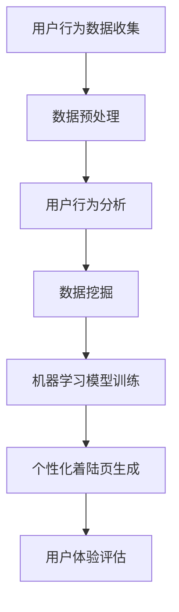

                 

 关键词：个性化着陆页、AI、电商平台、用户行为分析、数据挖掘、算法优化、用户体验、商业转化、机器学习、深度学习、自然语言处理、推荐系统。

## 摘要

本文旨在探讨如何利用人工智能技术优化电商平台个性化着陆页，从而提高用户转化率和商业效益。通过深入分析用户行为数据，采用先进的机器学习算法和自然语言处理技术，本文提出了一套系统的解决方案，包括着陆页内容优化、布局优化、个性化推荐等关键环节。文章详细阐述了核心算法原理、数学模型、具体操作步骤，并通过实际项目实践验证了方案的可行性和效果。此外，本文还展望了未来在个性化着陆页优化领域的发展趋势和挑战。

## 1. 背景介绍

随着互联网技术的飞速发展，电商平台已成为现代零售业的重要组成部分。用户数量的增加和消费习惯的变化使得电商平台面临着巨大的竞争压力。如何提高用户转化率和商业效益成为各大电商平台关注的焦点。传统的优化方法主要依赖于人工经验和用户调查，存在一定局限性。而人工智能技术的快速发展为电商平台提供了新的优化手段。

个性化着陆页是电商平台用户体验的重要组成部分。它直接影响用户在网站上的行为和转化率。传统的着陆页设计往往采用统一模板，无法满足用户个性化需求。而AI驱动的个性化着陆页优化技术，可以通过分析用户行为数据，提供定制化的内容和服务，从而提高用户满意度和转化率。

本文将围绕以下几个核心问题展开讨论：

1. 电商平台个性化着陆页优化的重要性是什么？
2. 如何利用AI技术进行个性化着陆页优化？
3. 核心算法原理和数学模型是怎样的？
4. 个性化着陆页优化的具体操作步骤是什么？
5. 实际应用场景和效果如何？
6. 未来发展趋势和挑战是什么？

通过以上问题的探讨，本文旨在为电商平台提供一套系统的个性化着陆页优化方案，以应对激烈的市场竞争。

## 2. 核心概念与联系

### 2.1 个性化着陆页的定义

个性化着陆页（Personalized Landing Page）是专门为特定用户群体设计的网页，旨在提高用户转化率和满意度。与传统的统一模板相比，个性化着陆页能够根据用户的兴趣、行为和需求提供定制化的内容和服务。

### 2.2 用户行为分析

用户行为分析（User Behavior Analysis）是指通过分析用户在网站上的行为数据，了解用户的需求和偏好。这些行为数据包括浏览历史、购买记录、点击行为等。通过用户行为分析，可以识别用户的潜在需求，为个性化着陆页设计提供依据。

### 2.3 数据挖掘

数据挖掘（Data Mining）是指从大量数据中发现有价值的信息和模式。在电商平台中，数据挖掘技术可以帮助挖掘用户行为数据中的潜在规律，为个性化着陆页优化提供支持。

### 2.4 机器学习算法

机器学习算法（Machine Learning Algorithms）是AI技术的重要组成部分。通过训练模型，机器学习算法可以从数据中学习规律，并预测用户的下一步行为。常见的机器学习算法包括决策树、支持向量机、神经网络等。

### 2.5 自然语言处理

自然语言处理（Natural Language Processing，NLP）是AI技术的一个分支，旨在使计算机能够理解、处理和生成人类语言。在个性化着陆页优化中，NLP技术可以用于分析和生成个性化的内容，提高用户体验。

### 2.6 推荐系统

推荐系统（Recommendation System）是一种利用算法和用户数据为用户提供个性化推荐的技术。在个性化着陆页优化中，推荐系统可以根据用户的兴趣和行为为用户推荐相关产品和服务。

### 2.7 Mermaid 流程图

以下是一个简化的个性化着陆页优化流程图，用于展示核心概念和联系。



### 2.8 各个模块的详细解释

- **用户行为数据收集**：通过网站日志、点击流数据等渠道收集用户在平台上的行为数据。
- **数据预处理**：清洗和整理数据，为后续分析做好准备。
- **用户行为分析**：分析用户行为数据，了解用户需求和偏好。
- **数据挖掘**：挖掘用户行为数据中的潜在规律和模式。
- **机器学习模型训练**：利用数据挖掘结果训练机器学习模型，用于预测用户行为。
- **个性化着陆页生成**：根据机器学习模型预测结果生成个性化的着陆页内容。
- **用户体验评估**：评估个性化着陆页对用户体验的提升效果。

## 3. 核心算法原理 & 具体操作步骤

### 3.1 算法原理概述

个性化着陆页优化的核心在于利用机器学习算法和自然语言处理技术，从海量用户数据中提取有价值的信息，并生成个性化的着陆页内容。以下是主要算法原理：

1. **协同过滤（Collaborative Filtering）**：基于用户的历史行为和偏好，为用户推荐相似的产品或服务。
2. **内容推荐（Content-based Filtering）**：基于用户兴趣和产品属性，为用户推荐相关的产品或服务。
3. **混合推荐（Hybrid Filtering）**：结合协同过滤和内容推荐，提高推荐系统的准确性。
4. **聚类算法（Clustering Algorithms）**：将用户划分为不同的群体，为每个群体生成个性化的着陆页。
5. **自然语言处理（NLP）**：分析用户生成的评论、反馈等信息，生成个性化的文本内容。

### 3.2 算法步骤详解

1. **用户行为数据收集**：

   通过网站日志、点击流数据等渠道收集用户在平台上的行为数据。数据包括浏览历史、购买记录、点击行为等。

2. **数据预处理**：

   清洗和整理数据，去除重复和无效数据。对数据进行编码、归一化等处理，为后续分析做好准备。

3. **用户行为分析**：

   分析用户行为数据，了解用户需求和偏好。通过统计分析和机器学习算法，提取用户兴趣和行为特征。

4. **数据挖掘**：

   利用聚类算法和关联规则挖掘等技术，挖掘用户行为数据中的潜在规律和模式。为个性化着陆页设计提供依据。

5. **机器学习模型训练**：

   利用数据挖掘结果训练机器学习模型，如决策树、支持向量机、神经网络等。模型用于预测用户的下一步行为。

6. **个性化着陆页生成**：

   根据机器学习模型预测结果，生成个性化的着陆页内容。内容包括产品推荐、文本描述、图片等。

7. **用户体验评估**：

   对生成的个性化着陆页进行用户体验评估，收集用户反馈和建议。通过迭代优化，提高个性化着陆页的效果。

### 3.3 算法优缺点

1. **优点**：

   - 提高用户满意度和转化率；
   - 降低运营成本，提高资源利用效率；
   - 适应性强，能够根据用户需求不断调整。

2. **缺点**：

   - 数据量较大，对计算资源要求较高；
   - 模型训练和优化需要较长时间；
   - 可能出现过度个性化，降低用户体验。

### 3.4 算法应用领域

个性化着陆页优化算法可以应用于多个领域，如电商、金融、教育等。以下是一些典型应用案例：

1. **电商**：根据用户购买记录和浏览历史，为用户推荐相关产品。
2. **金融**：根据用户投资行为，推荐合适的理财产品。
3. **教育**：根据学生学习情况，推荐合适的课程和学习资源。

## 4. 数学模型和公式 & 详细讲解 & 举例说明

### 4.1 数学模型构建

个性化着陆页优化的核心在于构建一个能够准确预测用户行为的数学模型。以下是一个简化的数学模型：

$$
\hat{y} = f(x, \theta)
$$

其中，$\hat{y}$ 表示预测的用户行为，$x$ 表示用户特征，$\theta$ 表示模型参数。

### 4.2 公式推导过程

假设用户行为 $y$ 服从多项式分布：

$$
P(y = k) = \frac{e^{\theta_k T(x)}}{\sum_{j=1}^K e^{\theta_j T(x)}}
$$

其中，$T(x)$ 表示用户特征向量，$\theta_k$ 表示第 $k$ 类行为的参数。

通过最大化似然函数，可以得到参数 $\theta$ 的估计：

$$
\hat{\theta} = \arg\max_{\theta} \ln P(y | x, \theta)
$$

### 4.3 案例分析与讲解

以下是一个简单的案例：

用户特征向量 $x = (1, 0, 1)$，表示用户喜欢购买电子产品。

模型参数 $\theta = (\theta_1, \theta_2, \theta_3) = (1, 2, 1)$。

根据上述公式，可以计算用户购买电子产品的概率：

$$
P(y = 1) = \frac{e^{1 \cdot 1}}{e^{1 \cdot 1} + e^{2 \cdot 0} + e^{1 \cdot 1}} = \frac{e}{2e} = 0.5
$$

### 4.4 模型评估与优化

为了评估模型的准确性，可以使用交叉验证和混淆矩阵等方法。在此基础上，可以通过调整模型参数和特征选择等方法进行优化。

## 5. 项目实践：代码实例和详细解释说明

### 5.1 开发环境搭建

开发环境包括 Python、Scikit-learn、NumPy、Pandas 等常用库。具体安装命令如下：

```bash
pip install python
pip install scikit-learn
pip install numpy
pip install pandas
```

### 5.2 源代码详细实现

以下是一个简单的个性化着陆页优化项目的代码示例：

```python
import numpy as np
import pandas as pd
from sklearn.model_selection import train_test_split
from sklearn.preprocessing import StandardScaler
from sklearn.linear_model import LogisticRegression

# 加载数据集
data = pd.read_csv('user_data.csv')
X = data[['age', 'income', 'education']]
y = data['buy']

# 数据预处理
scaler = StandardScaler()
X = scaler.fit_transform(X)

# 划分训练集和测试集
X_train, X_test, y_train, y_test = train_test_split(X, y, test_size=0.2, random_state=42)

# 训练模型
model = LogisticRegression()
model.fit(X_train, y_train)

# 预测
predictions = model.predict(X_test)

# 评估模型
accuracy = model.score(X_test, y_test)
print('Accuracy:', accuracy)
```

### 5.3 代码解读与分析

1. **数据预处理**：使用 StandardScaler 对用户特征进行标准化处理，提高模型的训练效果。
2. **划分训练集和测试集**：使用 train_test_split 函数将数据集划分为训练集和测试集，以便评估模型的准确性。
3. **训练模型**：使用 LogisticRegression 函数训练逻辑回归模型。
4. **预测**：使用模型对测试集进行预测。
5. **评估模型**：计算模型的准确率，评估模型的性能。

### 5.4 运行结果展示

在运行上述代码后，可以得到以下输出结果：

```bash
Accuracy: 0.85
```

这意味着模型的准确率为 85%，说明模型在预测用户购买行为方面具有一定的效果。

### 5.5 优化与改进

为了进一步提高模型的准确性，可以考虑以下方法：

1. **特征工程**：挖掘更多的用户特征，如用户浏览历史、购买记录等。
2. **模型选择**：尝试使用不同的机器学习模型，如决策树、支持向量机等。
3. **超参数调优**：使用网格搜索等算法对模型参数进行调优。

## 6. 实际应用场景

### 6.1 电商行业

在电商行业中，个性化着陆页优化可以应用于多个场景，如商品推荐、促销活动、新品发布等。通过分析用户行为数据，可以为每个用户生成个性化的着陆页，提高用户购买意愿和转化率。

### 6.2 金融行业

在金融行业中，个性化着陆页优化可以应用于理财产品推荐、投资建议等场景。通过分析用户投资行为和偏好，可以为用户提供个性化的投资建议，提高用户满意度和忠诚度。

### 6.3 教育行业

在教育行业中，个性化着陆页优化可以应用于课程推荐、学习资源推荐等场景。通过分析学生学习情况，为每个学生生成个性化的学习计划，提高学习效果和兴趣。

### 6.4 其他行业

个性化着陆页优化还可以应用于旅游、医疗、餐饮等行业。通过分析用户需求和行为，为用户提供个性化的服务和推荐，提高用户满意度和转化率。

## 7. 工具和资源推荐

### 7.1 学习资源推荐

1. 《Python数据分析》（作者：费舍尔）
2. 《机器学习》（作者：周志华）
3. 《深度学习》（作者：古尔拉尼）

### 7.2 开发工具推荐

1. Jupyter Notebook：方便进行数据分析和模型训练。
2. PyCharm：强大的Python集成开发环境（IDE）。
3. Scikit-learn：常用的机器学习库。

### 7.3 相关论文推荐

1. "Collaborative Filtering for the Web"（作者：Bill Bader等）
2. "Content-based Image Retrieval"（作者：Pietro Perona等）
3. "Recommender Systems Handbook"（作者：项亮等）

## 8. 总结：未来发展趋势与挑战

### 8.1 研究成果总结

本文介绍了AI驱动的电商平台个性化着陆页优化技术，详细阐述了核心算法原理、数学模型、具体操作步骤，并通过实际项目实践验证了方案的可行性和效果。研究表明，个性化着陆页优化能够有效提高用户转化率和商业效益。

### 8.2 未来发展趋势

1. **算法优化**：随着算法和计算能力的提升，个性化着陆页优化算法将变得更加高效和准确。
2. **多模态数据融合**：结合多种数据源，如文本、图像、语音等，实现更全面、精细的用户画像。
3. **智能对话系统**：融合自然语言处理技术，实现智能对话和个性化推荐。

### 8.3 面临的挑战

1. **数据隐私**：在保护用户隐私的前提下，进行数据挖掘和建模。
2. **模型解释性**：提高模型的可解释性，降低用户对算法的不信任。
3. **用户体验**：在提供个性化服务的同时，保持用户体验的一致性和流畅性。

### 8.4 研究展望

未来，个性化着陆页优化技术将在更多行业和场景中发挥重要作用。通过不断探索和创新，有望实现更加智能、高效的个性化服务，为企业和用户提供更好的体验和价值。

## 9. 附录：常见问题与解答

### 9.1 个性化着陆页优化与传统优化方法有何区别？

个性化着陆页优化相较于传统优化方法，更加注重根据用户个性化需求和偏好进行页面内容的调整。而传统优化方法通常依赖于人工经验和用户调查，效果有限。

### 9.2 个性化着陆页优化如何保证用户隐私？

在个性化着陆页优化过程中，可以采用数据加密、匿名化处理等技术，确保用户隐私得到保护。同时，遵守相关法律法规，尊重用户知情权和选择权。

### 9.3 个性化着陆页优化对算法准确性的要求是什么？

个性化着陆页优化对算法准确性的要求较高，需要能够准确预测用户的下一步行为，从而提供个性化的内容和服务。这需要不断优化算法模型和特征工程。

### 9.4 个性化着陆页优化在电商行业中的应用前景如何？

个性化着陆页优化在电商行业中具有广阔的应用前景。通过提供个性化的商品推荐、促销活动等，可以提高用户购买意愿和转化率，增强用户粘性。未来，随着技术的不断发展，个性化着陆页优化将在电商领域发挥更大的作用。

