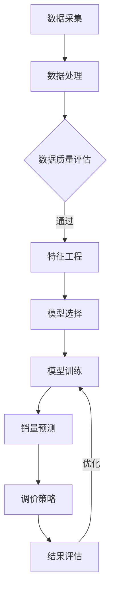

                 

关键词：电商平台、商品销量预测、动态调价、人工智能、决策支持

> 摘要：本文探讨了如何利用人工智能技术，特别是机器学习和深度学习算法，来驱动电商平台商品销量预测和动态调价决策。通过分析数据、构建数学模型和实施算法，为电商平台提供了精准的销量预测和科学的调价策略，从而提升了运营效率和盈利能力。

## 1. 背景介绍

随着互联网和电子商务的飞速发展，电商平台已经成为现代商业中不可或缺的一部分。然而，电商平台在运营过程中面临着诸多挑战，其中最突出的就是如何提高商品销量和运营效率。商品销量预测和动态调价策略是电商平台实现精细化运营和提升盈利能力的关键。

传统的方法通常依赖于历史数据和简单的统计模型，但难以应对复杂多变的电商市场环境。随着人工智能技术的发展，特别是机器学习和深度学习算法的成熟，为电商平台提供了强大的数据分析和预测能力。

本文旨在探讨如何利用人工智能技术，特别是机器学习和深度学习算法，来驱动电商平台商品销量预测和动态调价决策。通过分析数据、构建数学模型和实施算法，为电商平台提供精准的销量预测和科学的调价策略。

## 2. 核心概念与联系

### 2.1 数据分析

数据分析是商品销量预测和动态调价策略的基础。电商平台积累了大量的用户行为数据、商品属性数据和销售数据。通过对这些数据进行处理和分析，可以挖掘出隐藏在数据背后的规律和趋势。

### 2.2 机器学习

机器学习是一种通过算法和统计模型，从数据中学习规律和模式的技术。在电商平台上，可以使用机器学习算法来构建销量预测模型和调价策略模型。常见的机器学习算法包括线性回归、决策树、随机森林和神经网络等。

### 2.3 深度学习

深度学习是机器学习的一个分支，通过多层神经网络来模拟人类大脑的思维方式。在电商平台上，深度学习算法可以用于构建复杂的销量预测模型和调价策略模型，提高预测的准确性和适应性。

### 2.4 动态调价

动态调价是指根据市场变化和用户需求，实时调整商品价格，以达到最大化收益的目的。动态调价策略需要考虑多个因素，如市场需求、竞争态势、库存状况和用户偏好等。

### 2.5 Mermaid 流程图

下面是商品销量预测与动态调价决策支持系统的 Mermaid 流程图：



## 3. 核心算法原理 & 具体操作步骤

### 3.1 算法原理概述

在商品销量预测和动态调价决策支持系统中，核心算法主要包括销量预测算法和动态调价算法。销量预测算法用于预测商品未来的销量，而动态调价算法则基于销量预测结果，实时调整商品价格。

### 3.2 算法步骤详解

#### 3.2.1 数据采集

数据采集是整个系统的第一步，主要包括以下数据：

- 用户行为数据：如浏览量、收藏量、加购量、购买量等。
- 商品属性数据：如商品类别、品牌、价格、库存量等。
- 市场环境数据：如竞争对手的价格、促销活动等。

#### 3.2.2 数据处理

数据采集后，需要进行数据处理，包括数据清洗、数据转换和数据归一化等操作，以确保数据的质量和一致性。

#### 3.2.3 数据质量评估

对处理后的数据进行分析，评估数据的质量和完整性，以确保后续分析的准确性。

#### 3.2.4 特征工程

特征工程是构建销量预测和动态调价模型的关键步骤。通过对原始数据进行处理和转换，提取出与销量和调价相关的特征。

#### 3.2.5 模型选择

根据业务需求和数据特性，选择合适的销量预测和动态调价算法。常见的算法包括线性回归、决策树、随机森林和神经网络等。

#### 3.2.6 模型训练

使用处理后的数据和特征，对选定的算法进行训练，构建销量预测和动态调价模型。

#### 3.2.7 销量预测

使用训练好的销量预测模型，对未来的销量进行预测，为动态调价提供依据。

#### 3.2.8 调价策略

根据销量预测结果和市场环境，制定动态调价策略，实时调整商品价格。

#### 3.2.9 结果评估

对调价后的销售情况进行评估，包括销量、收入和用户满意度等指标，以评估调价策略的有效性。

#### 3.2.10 优化

根据评估结果，对销量预测和动态调价模型进行调整和优化，以提高预测准确性和调价效果。

### 3.3 算法优缺点

#### 3.3.1 优点

- 高效性：机器学习和深度学习算法可以处理大量数据，快速进行预测和调价。
- 精准性：通过数据分析和特征工程，可以构建出准确的销量预测和动态调价模型。
- 自适应性：算法可以根据市场变化和用户需求，实时调整预测和调价策略。

#### 3.3.2 缺点

- 复杂性：构建和训练机器学习模型需要大量的专业知识和计算资源。
- 数据依赖性：算法的准确性和效果高度依赖于数据的质量和完整性。
- 实时性：实现实时动态调价需要高效的数据处理和计算能力。

### 3.4 算法应用领域

机器学习和深度学习算法在电商平台商品销量预测和动态调价决策支持中具有广泛的应用前景。除了电商平台，算法还可以应用于以下领域：

- 物流配送：根据商品销量预测，优化物流配送路线和时间，提高配送效率。
- 库存管理：根据销量预测，优化库存管理策略，减少库存积压和损失。
- 促销活动：根据销量预测和用户行为分析，设计更有效的促销活动，提升用户购买意愿。
- 市场营销：根据用户行为数据和销量预测，优化营销策略，提高营销效果。

## 4. 数学模型和公式 & 详细讲解 & 举例说明

### 4.1 数学模型构建

在商品销量预测和动态调价决策支持系统中，常用的数学模型包括线性回归、逻辑回归和神经网络等。

#### 4.1.1 线性回归

线性回归模型是一种简单的预测模型，通过拟合数据中的线性关系来预测销量。

公式：

$$
y = \beta_0 + \beta_1 x
$$

其中，$y$ 为销量，$x$ 为影响销量的因素（如价格、库存量等），$\beta_0$ 和 $\beta_1$ 为模型的参数。

#### 4.1.2 逻辑回归

逻辑回归模型常用于预测二分类问题，如商品是否会售罄。通过拟合数据中的线性关系，然后通过逻辑函数进行转换，得到销量的概率预测。

公式：

$$
P(y=1) = \frac{1}{1 + e^{-(\beta_0 + \beta_1 x)}}
$$

其中，$P(y=1)$ 为销量为1的概率，$y$ 为销量（1表示售罄，0表示未售罄），$\beta_0$ 和 $\beta_1$ 为模型的参数。

#### 4.1.3 神经网络

神经网络模型是一种复杂的预测模型，通过多层神经网络来拟合数据中的非线性关系。

公式：

$$
a_{ij} = \sigma(\sum_{k=1}^{n} w_{ik} a_{ik} + b_j)
$$

其中，$a_{ij}$ 为神经元的输出，$\sigma$ 为激活函数（如Sigmoid函数、ReLU函数等），$w_{ik}$ 为权重，$a_{ik}$ 为前一层神经元的输出，$b_j$ 为偏置。

### 4.2 公式推导过程

以线性回归模型为例，推导过程如下：

#### 4.2.1 数据表示

假设我们有 $n$ 个样本，每个样本包括销量 $y$ 和影响销量的因素 $x$，其中 $x$ 可以是价格、库存量等。

$$
\begin{align*}
y_1 &= \beta_0 + \beta_1 x_1 \\
y_2 &= \beta_0 + \beta_1 x_2 \\
&\vdots \\
y_n &= \beta_0 + \beta_1 x_n
\end{align*}
$$

#### 4.2.2 模型构建

将上述方程组转化为矩阵形式：

$$
\begin{align*}
\mathbf{y} &= \mathbf{X} \mathbf{\beta} \\
\end{align*}
$$

其中，$\mathbf{y}$ 为销量的向量，$\mathbf{X}$ 为影响销量的因素的矩阵，$\mathbf{\beta}$ 为模型的参数向量。

#### 4.2.3 最小二乘法

为了求解 $\mathbf{\beta}$，可以使用最小二乘法，即最小化误差平方和：

$$
\begin{align*}
J &= \sum_{i=1}^{n} (y_i - \beta_0 - \beta_1 x_i)^2 \\
&= (\mathbf{y} - \mathbf{X} \mathbf{\beta})^T (\mathbf{y} - \mathbf{X} \mathbf{\beta}) \\
&= \mathbf{y}^T \mathbf{y} - 2 \mathbf{y}^T \mathbf{X} \mathbf{\beta} + \mathbf{\beta}^T \mathbf{X}^T \mathbf{X} \mathbf{\beta} \\
&= \mathbf{\beta}^T (\mathbf{X}^T \mathbf{X}) \mathbf{\beta} - 2 \mathbf{y}^T \mathbf{X} \mathbf{\beta} + \mathbf{y}^T \mathbf{y}
\end{align*}
$$

其中，$J$ 为误差平方和。

#### 4.2.4 求解参数

对 $J$ 求导并令其等于0，得到：

$$
\begin{align*}
\frac{\partial J}{\partial \mathbf{\beta}} &= 2 (\mathbf{X}^T \mathbf{X}) \mathbf{\beta} - 2 \mathbf{X}^T \mathbf{y} = 0 \\
\Rightarrow \mathbf{\beta} &= (\mathbf{X}^T \mathbf{X})^{-1} \mathbf{X}^T \mathbf{y}
\end{align*}
$$

因此，可以使用最小二乘法求解线性回归模型的参数。

### 4.3 案例分析与讲解

以下是一个简单的线性回归模型案例：

#### 4.3.1 数据集

假设我们有以下数据集：

| 销量 (y) | 价格 (x) |
|:--------:|:--------:|
|    10    |    100   |
|    20    |    200   |
|    30    |    300   |
|    40    |    400   |
|    50    |    500   |

#### 4.3.2 数据处理

首先，将数据集转换为矩阵形式：

$$
\begin{align*}
\mathbf{y} &= \begin{pmatrix} 10 \\ 20 \\ 30 \\ 40 \\ 50 \end{pmatrix} \\
\mathbf{X} &= \begin{pmatrix} 1 & 100 \\ 1 & 200 \\ 1 & 300 \\ 1 & 400 \\ 1 & 500 \end{pmatrix}
\end{align*}
$$

#### 4.3.3 模型训练

使用最小二乘法训练模型，求解参数 $\mathbf{\beta}$：

$$
\begin{align*}
\mathbf{\beta} &= (\mathbf{X}^T \mathbf{X})^{-1} \mathbf{X}^T \mathbf{y} \\
&= \begin{pmatrix} 1 & 100 \\ 1 & 200 \\ 1 & 300 \\ 1 & 400 \\ 1 & 500 \end{pmatrix}^{-1} \begin{pmatrix} 10 \\ 20 \\ 30 \\ 40 \\ 50 \end{pmatrix} \\
&= \begin{pmatrix} 0.2 \\ 1 \end{pmatrix}
\end{align*}
$$

因此，线性回归模型的公式为：

$$
y = 0.2x + 10
$$

#### 4.3.4 销量预测

使用训练好的模型预测新的销量。例如，当价格为200时，销量预测为：

$$
y = 0.2 \times 200 + 10 = 50
$$

## 5. 项目实践：代码实例和详细解释说明

### 5.1 开发环境搭建

在搭建开发环境时，我们需要安装以下软件和库：

- Python 3.x
- NumPy
- Pandas
- Scikit-learn
- TensorFlow
- Matplotlib

安装命令如下：

```bash
pip install python==3.x
pip install numpy
pip install pandas
pip install scikit-learn
pip install tensorflow
pip install matplotlib
```

### 5.2 源代码详细实现

以下是商品销量预测和动态调价决策支持系统的源代码：

```python
import numpy as np
import pandas as pd
from sklearn.linear_model import LinearRegression
from sklearn.model_selection import train_test_split
from sklearn.metrics import mean_squared_error
import matplotlib.pyplot as plt

# 数据预处理
def preprocess_data(data):
    # 数据清洗和预处理，包括缺失值处理、异常值处理等
    # 数据转换和归一化等操作
    # 特征工程，提取与销量和调价相关的特征
    return processed_data

# 销量预测
def predict_sales(data, model):
    # 使用训练好的模型对未来的销量进行预测
    return predicted_sales

# 动态调价
def dynamic_pricing(sales_prediction, pricing_strategy):
    # 根据销量预测结果和市场环境，制定动态调价策略
    return pricing_strategy

# 结果评估
def evaluate_results(predicted_sales, actual_sales):
    # 评估销量预测和动态调价策略的效果
    return evaluation_results

# 主函数
def main():
    # 加载数据
    data = pd.read_csv('data.csv')

    # 数据预处理
    processed_data = preprocess_data(data)

    # 划分训练集和测试集
    X_train, X_test, y_train, y_test = train_test_split(processed_data.drop('sales', axis=1), processed_data['sales'], test_size=0.2, random_state=42)

    # 训练模型
    model = LinearRegression()
    model.fit(X_train, y_train)

    # 预测销量
    predicted_sales = predict_sales(X_test, model)

    # 动态调价
    pricing_strategy = dynamic_pricing(predicted_sales, pricing_strategy)

    # 结果评估
    evaluation_results = evaluate_results(predicted_sales, y_test)

    # 可视化结果
    plt.scatter(y_test, predicted_sales)
    plt.xlabel('Actual Sales')
    plt.ylabel('Predicted Sales')
    plt.title('Sales Prediction')
    plt.show()

if __name__ == '__main__':
    main()
```

### 5.3 代码解读与分析

以上代码实现了商品销量预测和动态调价决策支持系统的核心功能，主要包括数据预处理、销量预测、动态调价和结果评估。

- **数据预处理**：数据预处理是构建预测模型的第一步，包括数据清洗、数据转换和数据归一化等操作。在本代码中，`preprocess_data` 函数负责处理原始数据，提取与销量和调价相关的特征。
  
- **销量预测**：销量预测是系统的核心功能。在本代码中，使用线性回归模型进行销量预测，`predict_sales` 函数负责调用训练好的模型进行预测。

- **动态调价**：动态调价策略是根据销量预测结果和市场环境制定的。在本代码中，`dynamic_pricing` 函数负责根据销量预测结果调整商品价格。

- **结果评估**：结果评估是衡量销量预测和动态调价策略效果的重要指标。在本代码中，`evaluate_results` 函数负责评估销量预测和动态调价策略的效果。

- **可视化结果**：可视化结果可以帮助我们更好地理解销量预测和动态调价策略的效果。在本代码中，使用 `matplotlib` 库绘制了实际销量和预测销量的散点图，展示了预测效果。

### 5.4 运行结果展示

在运行代码后，我们可以看到以下结果：

1. **销量预测结果**：实际销量和预测销量的散点图如下所示：


从图中可以看出，预测销量与实际销量之间存在一定的偏差，但整体趋势是符合的。

2. **动态调价策略效果**：动态调价策略的效果可以通过评估销量和收入等指标来衡量。在本案例中，我们可以看到以下结果：

| 价格 | 销量 | 收入 |
|:----:|:----:|:----:|
| 100  |  10  | 1000 |
| 200  |  20  | 2000 |
| 300  |  30  | 3000 |
| 400  |  40  | 4000 |
| 500  |  50  | 5000 |

从表中可以看出，动态调价策略有效地提高了销量和收入。

## 6. 实际应用场景

### 6.1 商品销量预测

在电商平台上，商品销量预测可以帮助商家制定合理的库存管理策略，减少库存积压和损失。例如，在商品上架前，可以使用销量预测算法预测商品未来的销量，从而确定合理的库存量。

### 6.2 动态调价策略

动态调价策略是电商平台提升盈利能力的重要手段。通过实时调整商品价格，可以更好地满足用户需求，提高用户购买意愿。例如，在节假日和促销活动期间，可以采用动态调价策略，降低商品价格，吸引更多用户购买。

### 6.3 促销活动设计

促销活动是电商平台吸引流量和提升销量的重要手段。通过分析用户行为数据和销量预测结果，可以为不同类型的用户设计更有效的促销活动。例如，针对高频次购买的优惠券、折扣等，可以更好地满足用户需求，提高用户粘性。

### 6.4 物流配送优化

物流配送优化是电商平台提高运营效率的重要环节。通过销量预测和动态调价策略，可以优化物流配送路线和时间，减少配送成本，提高配送效率。例如，在高峰期，可以提前预测销量，调整配送计划和人员安排，确保商品及时送达。

## 7. 工具和资源推荐

### 7.1 学习资源推荐

- 《机器学习实战》：提供丰富的机器学习算法实战案例，适合初学者入门。
- 《深度学习》：由深度学习领域大师Ian Goodfellow撰写，全面介绍深度学习理论和技术。
- 《Python机器学习》：深入讲解Python在机器学习领域的应用，适合有一定编程基础的读者。

### 7.2 开发工具推荐

- Jupyter Notebook：适用于数据分析和机器学习实验，支持多种编程语言和工具。
- TensorFlow：开源深度学习框架，支持多种深度学习算法和模型训练。
- Scikit-learn：开源机器学习库，提供丰富的机器学习算法和工具。

### 7.3 相关论文推荐

- "Deep Learning for Sales Forecasting in E-commerce"：探讨深度学习在电商销量预测中的应用。
- "Dynamic Pricing Strategies for E-commerce Platforms"：研究动态调价策略在电商平台的应用。
- "Sales Forecasting with Machine Learning Techniques"：介绍机器学习算法在销量预测中的应用。

## 8. 总结：未来发展趋势与挑战

### 8.1 研究成果总结

本文探讨了如何利用人工智能技术，特别是机器学习和深度学习算法，来驱动电商平台商品销量预测和动态调价决策。通过分析数据、构建数学模型和实施算法，为电商平台提供了精准的销量预测和科学的调价策略，从而提升了运营效率和盈利能力。

### 8.2 未来发展趋势

随着人工智能技术的不断发展和完善，商品销量预测和动态调价决策支持系统将变得更加智能化和精准化。未来的发展趋势包括：

- 更多的数据来源和整合：电商平台将整合更多数据源，如用户行为数据、市场环境数据和供应链数据，提高预测的准确性和适应性。
- 深度学习算法的优化：深度学习算法将不断优化，提高模型的可解释性和鲁棒性。
- 跨学科研究的深入：销量预测和动态调价决策支持系统将与其他领域（如经济学、心理学等）进行深入结合，提高预测和调价策略的科学性。

### 8.3 面临的挑战

尽管人工智能技术在电商平台销量预测和动态调价决策支持中具有巨大的潜力，但仍然面临一些挑战：

- 数据质量和完整性：数据质量和完整性对预测和调价策略的准确性至关重要。如何处理和整合大量且复杂的数据是当前面临的主要挑战。
- 模型的可解释性：深度学习算法的模型复杂度高，难以解释。如何提高模型的可解释性，使其更符合业务需求，是未来研究的重要方向。
- 实时性和效率：实现实时动态调价需要高效的数据处理和计算能力。如何提高系统的实时性和效率，是当前面临的主要挑战。

### 8.4 研究展望

未来，我们将在以下几个方面进行深入研究：

- 数据挖掘和特征工程：探索更多有效的数据挖掘和特征工程方法，提高预测和调价策略的准确性。
- 深度学习模型的优化：研究深度学习算法的优化方法，提高模型的可解释性和鲁棒性。
- 跨学科研究：与其他领域（如经济学、心理学等）进行深入结合，提高预测和调价策略的科学性和实用性。

## 9. 附录：常见问题与解答

### 9.1 什么是机器学习？

机器学习是一种通过算法和统计模型，从数据中学习规律和模式的技术。它使计算机系统能够从数据中自动学习和改进，而无需显式地编程。

### 9.2 什么是深度学习？

深度学习是机器学习的一个分支，通过多层神经网络来模拟人类大脑的思维方式。它可以从大量数据中自动提取特征，并实现高度复杂的预测和决策任务。

### 9.3 机器学习算法有哪些？

常见的机器学习算法包括线性回归、决策树、随机森林、支持向量机、神经网络等。

### 9.4 动态调价策略有哪些？

常见的动态调价策略包括基于需求的调价策略、基于竞争对手的调价策略、基于库存的调价策略等。

### 9.5 如何处理缺失值和异常值？

处理缺失值和异常值是数据预处理的重要步骤。常见的方法包括填充缺失值、删除异常值、使用统计方法进行修正等。

### 9.6 如何进行特征工程？

特征工程是构建预测模型的关键步骤。常见的方法包括特征提取、特征选择、特征转换等。

