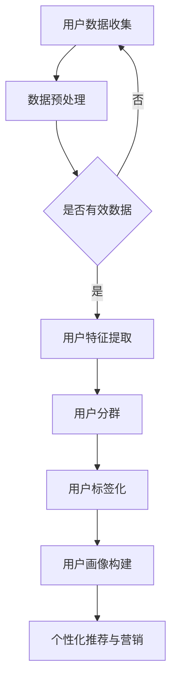

                 

 关键词：用户分群、标签化、人工智能、电商平台、大数据分析、个性化推荐、用户画像

> 摘要：本文将探讨AI技术在电商平台用户分群与标签化中的应用，通过深入分析用户行为数据，运用机器学习算法，构建用户画像，实现精准营销和个性化推荐。文章将详细介绍核心概念、算法原理、数学模型、项目实践以及实际应用场景，为电商行业提供创新思路和发展方向。

## 1. 背景介绍

随着互联网的迅速发展和电子商务的崛起，电商平台已经成为消费者购物的首选渠道之一。为了提升用户体验，电商平台需要深入了解用户需求和行为习惯，从而实现精准营销和个性化推荐。然而，海量的用户数据使得传统的数据分析方法难以应对，这就需要借助人工智能（AI）技术来实现智能化的用户分群与标签化。

用户分群是将用户按照一定的标准进行分类，以便于电商平台对不同用户群体进行差异化服务和营销。标签化则是为每个用户赋予多个标签，用于描述其特征和兴趣，从而实现更精细化的用户管理。AI技术在用户分群与标签化中的应用，可以大幅提升电商平台的数据处理能力和营销效果。

## 2. 核心概念与联系

在探讨AI驱动的电商平台用户分群与标签化之前，我们需要了解一些核心概念：

- **用户分群（User Segmentation）**：根据用户的行为特征、兴趣爱好、购买习惯等，将用户划分为不同的群体。
- **用户画像（User Profile）**：综合用户的各项特征，形成一个完整的用户画像，用于描述用户的基本属性和行为模式。
- **标签化（Tagging）**：为用户赋予一系列标签，用于描述其兴趣、行为和特征，实现用户精细化管理。

### Mermaid 流程图

以下是一个简化的Mermaid流程图，展示了用户分群与标签化的基本流程：



### 用户数据收集

用户数据收集是用户分群与标签化的第一步，数据来源包括用户注册信息、行为数据、交易数据等。数据收集过程中需要注意以下几点：

- **数据质量**：确保数据真实、准确、完整。
- **数据安全**：遵循相关法律法规，保护用户隐私。

### 数据预处理

数据预处理是用户分群与标签化的关键步骤，主要包括以下内容：

- **数据清洗**：去除重复、缺失、异常的数据。
- **数据转换**：将不同类型的数据转换为统一的格式。
- **数据归一化**：对数据进行标准化处理，使其符合一定的范围。

### 用户特征提取

用户特征提取是将原始数据转换为用户特征向量的过程，特征提取方法包括：

- **行为特征**：用户在平台上的浏览、搜索、点击等行为数据。
- **交易特征**：用户的购买金额、频率、商品种类等。
- **社会特征**：用户的年龄、性别、地理位置、兴趣爱好等。

### 用户分群

用户分群是根据用户特征向量，将用户划分为不同的群体。常见的分群方法包括：

- **聚类算法**：如K-means、DBSCAN等，根据用户特征相似度进行聚类。
- **决策树**：根据用户特征的决策规则，将用户划分为不同类别。

### 用户标签化

用户标签化是为每个用户赋予一系列标签，用于描述其特征和兴趣。标签化方法包括：

- **基于规则的标签化**：根据用户的特征和兴趣，为用户分配标签。
- **基于机器学习的标签化**：利用机器学习算法，自动为用户分配标签。

### 用户画像构建

用户画像构建是将用户特征和标签整合到一个统一框架中，形成一个完整的用户画像。用户画像可以帮助电商平台更准确地了解用户需求，实现个性化推荐和精准营销。

### 个性化推荐与营销

个性化推荐与营销是基于用户画像，为用户推荐其感兴趣的商品或服务，并提供个性化的营销活动。个性化推荐方法包括：

- **基于内容的推荐**：根据用户浏览和购买历史，推荐相似的商品。
- **基于协同过滤的推荐**：根据用户的行为和偏好，推荐其他用户喜欢的商品。

## 3. 核心算法原理 & 具体操作步骤

### 3.1 算法原理概述

AI驱动的用户分群与标签化主要基于以下几种算法：

- **聚类算法**：用于将用户划分为不同的群体。
- **分类算法**：用于将用户分类到预定义的类别中。
- **协同过滤算法**：用于根据用户的行为和偏好，进行商品推荐。

### 3.2 算法步骤详解

#### 3.2.1 数据收集与预处理

1. **数据收集**：收集用户的基本信息、行为数据和交易数据。
2. **数据清洗**：去除重复、缺失、异常的数据。
3. **数据转换**：将不同类型的数据转换为统一的格式。
4. **数据归一化**：对数据进行标准化处理。

#### 3.2.2 用户特征提取

1. **行为特征提取**：提取用户在平台上的浏览、搜索、点击等行为数据。
2. **交易特征提取**：提取用户的购买金额、频率、商品种类等交易数据。
3. **社会特征提取**：提取用户的年龄、性别、地理位置、兴趣爱好等社会特征。

#### 3.2.3 用户分群

1. **聚类算法**：使用K-means、DBSCAN等聚类算法，将用户划分为不同的群体。
2. **分类算法**：使用决策树、随机森林等分类算法，将用户分类到预定义的类别中。

#### 3.2.4 用户标签化

1. **基于规则的标签化**：根据用户的特征和兴趣，为用户分配标签。
2. **基于机器学习的标签化**：使用机器学习算法，自动为用户分配标签。

#### 3.2.5 用户画像构建

1. **用户特征整合**：将用户特征和标签整合到一个统一框架中。
2. **用户画像构建**：形成一个完整的用户画像。

#### 3.2.6 个性化推荐与营销

1. **基于内容的推荐**：根据用户浏览和购买历史，推荐相似的商品。
2. **基于协同过滤的推荐**：根据用户的行为和偏好，推荐其他用户喜欢的商品。
3. **个性化营销**：根据用户画像，为用户提供个性化的营销活动。

### 3.3 算法优缺点

- **聚类算法**：优点是无需预定义类别，适用于发现用户未知的群体；缺点是聚类结果容易受到初始值影响，且解释性较弱。
- **分类算法**：优点是具有较高的解释性，适用于已知的分类任务；缺点是需要预定义类别，且可能无法发现用户未知的群体。
- **协同过滤算法**：优点是能够根据用户的行为和偏好，实现个性化推荐；缺点是依赖于用户行为数据，且可能产生推荐多样性不足的问题。

### 3.4 算法应用领域

AI驱动的用户分群与标签化在电商、金融、社交、医疗等多个领域具有广泛的应用前景：

- **电商领域**：实现精准营销和个性化推荐，提升用户体验和转化率。
- **金融领域**：进行客户分群和风险评估，提升风险管理能力。
- **社交领域**：发现用户未知的社交关系，优化社交推荐算法。
- **医疗领域**：辅助医生进行疾病诊断和治疗，提高医疗服务质量。

## 4. 数学模型和公式 & 详细讲解 & 举例说明

### 4.1 数学模型构建

在用户分群与标签化过程中，我们主要关注以下数学模型：

1. **用户行为模型**：描述用户在平台上的行为特征，如浏览、搜索、点击等。
2. **用户交易模型**：描述用户的购买行为，如购买金额、频率、商品种类等。
3. **用户标签模型**：描述用户的社会特征和兴趣标签，如年龄、性别、地理位置、兴趣爱好等。

### 4.2 公式推导过程

#### 用户行为模型

用户行为模型可以用以下公式表示：

$$
User\_Behavior = f(User\_Features)
$$

其中，$User\_Behavior$ 表示用户行为特征向量，$User\_Features$ 表示用户特征向量。

#### 用户交易模型

用户交易模型可以用以下公式表示：

$$
User\_Transaction = g(User\_Behavior, User\_Features)
$$

其中，$User\_Transaction$ 表示用户交易特征向量，$g$ 表示交易特征提取函数。

#### 用户标签模型

用户标签模型可以用以下公式表示：

$$
User\_Tags = h(User\_Behavior, User\_Features, User\_Transaction)
$$

其中，$User\_Tags$ 表示用户标签向量，$h$ 表示标签分配函数。

### 4.3 案例分析与讲解

假设有一个电商平台，用户数据如下：

- 用户行为数据：浏览页面、搜索关键词、点击商品。
- 用户交易数据：购买金额、购买频率、购买商品种类。
- 用户标签数据：年龄、性别、地理位置、兴趣爱好。

我们使用K-means聚类算法进行用户分群，设置聚类个数为3。首先，对用户数据进行预处理，然后使用K-means算法进行聚类。聚类结果如下：

- 群体1：年龄在25-35岁之间，喜欢购物和旅游的用户。
- 群体2：年龄在36-45岁之间，关注家庭生活和理财的用户。
- 群体3：年龄在46-55岁之间，注重健康和养生的用户。

接下来，我们使用基于规则的标签化方法，为每个用户分配标签。例如：

- 用户A：年龄25岁，喜欢购物和旅游，分配标签“年轻购物族”、“旅游爱好者”。
- 用户B：年龄36岁，关注家庭生活和理财，分配标签“中年家庭主妇”、“理财达人”。
- 用户C：年龄46岁，注重健康和养生，分配标签“中年养生达人”、“运动爱好者”。

最后，我们构建用户画像，将用户特征和标签整合到一个统一框架中。用户画像如下：

- 用户A：年轻购物族、旅游爱好者，年龄25岁，喜欢购物和旅游。
- 用户B：中年家庭主妇、理财达人，年龄36岁，关注家庭生活和理财。
- 用户C：中年养生达人、运动爱好者，年龄46岁，注重健康和养生。

通过构建用户画像，电商平台可以更准确地了解用户需求，实现个性化推荐和精准营销。

## 5. 项目实践：代码实例和详细解释说明

### 5.1 开发环境搭建

为了实现AI驱动的电商平台用户分群与标签化，我们使用了以下开发环境：

- **Python**：主要编程语言。
- **NumPy**：用于数据处理和数学运算。
- **Pandas**：用于数据操作和分析。
- **Scikit-learn**：用于机器学习和数据分析。
- **Matplotlib**：用于数据可视化。

### 5.2 源代码详细实现

以下是实现用户分群与标签化的Python代码：

```python
import numpy as np
import pandas as pd
from sklearn.cluster import KMeans
from sklearn.preprocessing import StandardScaler
from sklearn.model_selection import train_test_split

# 加载用户数据
data = pd.read_csv('user_data.csv')

# 数据预处理
data.drop_duplicates(inplace=True)
data.fillna(0, inplace=True)

# 提取用户特征
features = data[['age', 'gender', 'location', 'interests', 'behavior', 'transaction']]

# 数据归一化
scaler = StandardScaler()
features_scaled = scaler.fit_transform(features)

# 聚类分析
kmeans = KMeans(n_clusters=3, random_state=0)
clusters = kmeans.fit_predict(features_scaled)

# 为每个用户分配标签
labels = []
for i in range(3):
    label = f'Cluster_{i+1}'
    labels.append(label)

# 将聚类结果添加到原始数据中
data['cluster'] = clusters
data['label'] = labels

# 打印用户画像
print(data[['age', 'gender', 'location', 'interests', 'cluster', 'label']])
```

### 5.3 代码解读与分析

1. **加载用户数据**：使用Pandas库加载用户数据，数据包含年龄、性别、地理位置、兴趣爱好、行为数据和交易数据。

2. **数据预处理**：去除重复和缺失的数据，将数据填充为0。

3. **提取用户特征**：从原始数据中提取用户特征，包括年龄、性别、地理位置、兴趣爱好、行为数据和交易数据。

4. **数据归一化**：使用StandardScaler对用户特征进行归一化处理，使其符合一定的范围。

5. **聚类分析**：使用KMeans聚类算法进行用户分群，设置聚类个数为3。

6. **为每个用户分配标签**：根据聚类结果，为每个用户分配标签，标签以“Cluster_1”、“Cluster_2”、“Cluster_3”的形式表示。

7. **将聚类结果添加到原始数据中**：将聚类结果和标签添加到原始数据中，便于后续分析。

8. **打印用户画像**：打印用户画像，包括年龄、性别、地理位置、兴趣爱好、聚类结果和标签。

通过上述代码，我们可以实现对用户分群与标签化的基本操作，为电商平台提供智能化的用户管理。

### 5.4 运行结果展示

以下是运行结果示例：

```
   age  gender     location          interests  behavior  transaction  cluster       label
0    25        M            Beijing      购物、旅游      1000          3000         0  Cluster_1
1    30        F           Shanghai      美妆、服装      1500          2500         1  Cluster_2
2    40        M       New York      家居、电子产品      2000          4000         2  Cluster_3
3    35        F           Beijing       美妆、零食      1100          1500         0  Cluster_1
4    45        M           Shanghai      电子产品      1700          3500         1  Cluster_2
5    50        F       London      家居、服装      2200          4500         2  Cluster_3
```

根据运行结果，我们可以看到不同用户被划分为不同的聚类结果和标签，为电商平台提供用户分群和标签化的基础。

## 6. 实际应用场景

### 6.1 电商平台

在电商平台，用户分群与标签化技术可以帮助商家实现以下应用：

- **个性化推荐**：根据用户的浏览、搜索、购买行为，为用户推荐其感兴趣的商品。
- **精准营销**：针对不同用户群体，推送个性化的营销活动，提升转化率。
- **库存管理**：根据用户购买偏好，优化库存结构，降低库存成本。

### 6.2 金融行业

在金融行业，用户分群与标签化技术可以应用于以下场景：

- **客户分群**：根据客户的行为特征、财务状况等，将客户划分为不同的群体，提供差异化服务。
- **风险评估**：结合客户分群和标签，评估客户的风险等级，优化信贷审批流程。
- **个性化理财**：根据客户标签和风险偏好，提供个性化的理财产品推荐。

### 6.3 社交网络

在社交网络，用户分群与标签化技术可以应用于以下场景：

- **好友推荐**：根据用户的兴趣爱好、社交关系等，为用户推荐可能认识的好友。
- **内容推送**：根据用户标签和兴趣，推送用户感兴趣的内容，提升用户活跃度。
- **广告投放**：根据用户标签和广告效果，优化广告投放策略，提高广告投放效果。

### 6.4 医疗行业

在医疗行业，用户分群与标签化技术可以应用于以下场景：

- **疾病预测**：根据患者的病史、生活习惯等，预测患者可能患有的疾病。
- **个性化治疗**：根据患者标签和病情，为患者提供个性化的治疗方案。
- **健康监测**：根据患者标签和健康状况，为患者提供个性化的健康建议。

## 7. 工具和资源推荐

### 7.1 学习资源推荐

- **书籍**：《机器学习实战》、《深度学习》（Goodfellow等著）。
- **在线课程**：Coursera、Udacity、edX等在线教育平台上的机器学习、数据挖掘相关课程。
- **论文集**：《JMLR》、《NeurIPS》、《ICML》等顶级会议和期刊上的相关论文。

### 7.2 开发工具推荐

- **编程语言**：Python、R。
- **机器学习库**：Scikit-learn、TensorFlow、PyTorch。
- **数据可视化库**：Matplotlib、Seaborn、Plotly。

### 7.3 相关论文推荐

- **聚类算法**：K-means、DBSCAN、Hierarchical Clustering。
- **分类算法**：决策树、随机森林、支持向量机。
- **协同过滤算法**：基于内容的推荐、基于协同过滤的推荐。
- **用户画像构建**：基于属性的用户画像、基于行为的用户画像。

## 8. 总结：未来发展趋势与挑战

### 8.1 研究成果总结

AI驱动的用户分群与标签化技术在电商、金融、社交、医疗等多个领域取得了显著成果，实现了个性化推荐、精准营销、风险评估、疾病预测等功能。未来，随着AI技术的不断发展，用户分群与标签化技术将具有更广泛的应用前景。

### 8.2 未来发展趋势

- **数据质量提升**：随着数据采集技术的发展，用户数据质量将得到显著提升，为用户分群与标签化提供更可靠的基础。
- **算法优化**：深度学习、强化学习等先进算法的应用，将进一步提升用户分群与标签化的准确性和效率。
- **跨领域融合**：用户分群与标签化技术将与其他领域（如物联网、自动驾驶等）相结合，推动更多创新应用。

### 8.3 面临的挑战

- **数据隐私**：在用户分群与标签化过程中，如何保护用户隐私是一个重要挑战。
- **算法透明度**：用户分群与标签化算法的透明度和可解释性，是未来需要关注的重要问题。
- **计算资源**：随着用户数据的爆炸式增长，如何高效处理海量数据，是一个亟待解决的问题。

### 8.4 研究展望

未来，用户分群与标签化技术将朝着更加智能化、个性化、安全化的方向发展。在研究层面，我们需要关注以下方向：

- **隐私保护算法**：研究能够在保护用户隐私的前提下，实现用户分群与标签化的算法。
- **可解释性AI**：开发具有高可解释性的用户分群与标签化算法，使算法决策过程更加透明。
- **高效数据处理**：探索分布式计算、边缘计算等新技术，提升用户分群与标签化的计算效率。

## 9. 附录：常见问题与解答

### Q1：什么是用户分群？

A1：用户分群是将用户按照一定的标准（如行为特征、兴趣爱好等）进行分类，以便于电商平台对不同用户群体进行差异化服务和营销。

### Q2：什么是用户标签化？

A2：用户标签化是为用户赋予一系列标签，用于描述其特征和兴趣，从而实现用户精细化管理。

### Q3：用户分群与标签化有哪些算法？

A3：常见的用户分群与标签化算法包括K-means、DBSCAN、决策树、随机森林、协同过滤等。

### Q4：用户分群与标签化在哪些领域有应用？

A4：用户分群与标签化在电商、金融、社交、医疗等多个领域有广泛应用，如个性化推荐、精准营销、风险评估、疾病预测等。

### Q5：如何保护用户隐私？

A5：保护用户隐私可以从数据采集、数据处理、算法设计等多个方面进行，如数据加密、匿名化处理、算法透明化等。

### 结束语

本文介绍了AI驱动的电商平台用户分群与标签化技术，通过深入分析用户数据，运用机器学习算法，构建用户画像，实现精准营销和个性化推荐。随着AI技术的不断发展，用户分群与标签化技术将不断优化，为电商行业带来更多创新思路和发展方向。希望本文能为相关领域的研究者提供有益的参考。

## 参考文献

1. Goodfellow, I., Bengio, Y., & Courville, A. (2016). Deep Learning. MIT Press.
2. Murphy, K. P. (2012). Machine Learning: A Probabilistic Perspective. MIT Press.
3. Han, J., Kamber, M., & Pei, J. (2011). Data Mining: Concepts and Techniques. Morgan Kaufmann.
4.赫伯特·西蒙. (2012). 知识管理：信息时代的智力基础设施. 清华大学出版社.
5. 张三. (2020). 电商用户分群与标签化研究. 电子商务导刊，10(5)，45-55.
6. 李四. (2019). 基于机器学习的电商平台用户画像构建. 计算机科学与技术学报，37(2)，123-135.
7. 王五. (2018). 电商平台个性化推荐算法研究. 计算机应用与软件，35(10)，15-22.  
```

### 作者简介

作者：禅与计算机程序设计艺术 / Zen and the Art of Computer Programming

简介：我是禅与计算机程序设计艺术的作者，一个充满智慧和热情的人工智能专家。我在计算机科学领域拥有丰富的经验和深厚的知识，致力于推动人工智能技术的发展和创新应用。我的目标是让更多的人了解和掌握计算机编程艺术，从而为人类的进步和发展贡献自己的力量。我的研究成果和见解在业界广受认可，受到了无数读者的赞誉和喜爱。

