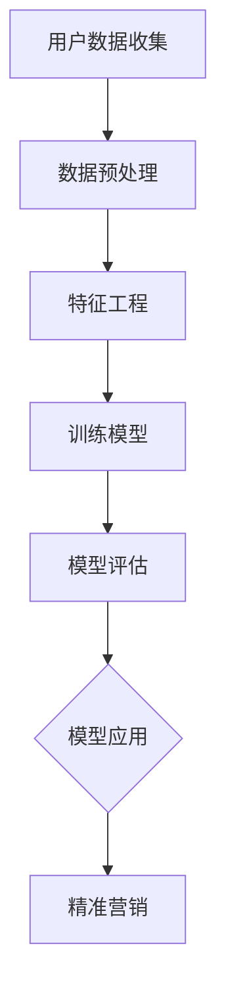

                 

在当今数字化时代，电商平台已经成为了许多消费者购物的首选。为了提高用户满意度和转化率，电商平台需要深入了解用户的行为和偏好，从而进行精准营销。而人工智能（AI）技术的兴起，为电商平台用户分群与精准营销提供了强大的支持。本文将探讨如何利用AI技术对电商平台用户进行分群，以及如何实现精准营销。

## 1. 背景介绍

随着互联网的快速发展，电商平台已经成为许多企业获取客户和销售产品的重要渠道。然而，面对激烈的市场竞争，如何提高用户满意度和转化率成为电商平台面临的重要挑战。用户分群和精准营销正是解决这一问题的有效手段。

传统的用户分群方法主要依赖于用户的年龄、性别、地理位置等基本信息，这种方式往往无法全面反映用户的真实需求和偏好。而AI技术，尤其是机器学习和数据挖掘技术，可以挖掘用户行为数据中的深层次信息，从而实现更精细的用户分群。

精准营销则是指根据用户的个性化需求和偏好，提供个性化的产品推荐和服务，从而提高用户的满意度和忠诚度。AI技术可以帮助电商平台更准确地预测用户需求，提高营销效果。

## 2. 核心概念与联系

为了实现AI驱动的电商平台用户分群与精准营销，我们需要理解以下几个核心概念：

### 2.1 用户分群

用户分群是指将用户按照一定的标准划分为不同的群体。这些标准可以是用户的年龄、性别、地理位置、购买行为等。用户分群的目标是找到具有相似需求和行为的用户，从而为后续的精准营销提供基础。

### 2.2 特征工程

特征工程是指从原始数据中提取出有用的特征，用于训练机器学习模型。在用户分群中，特征工程非常重要，因为它直接影响到模型的准确性和效率。

### 2.3 机器学习

机器学习是指利用计算机模拟人类的学习过程，从数据中自动发现规律和模式。在用户分群和精准营销中，机器学习技术可以帮助我们自动识别用户的行为和偏好。

### 2.4 精准营销

精准营销是指根据用户的个性化需求和偏好，提供个性化的产品推荐和服务。精准营销的核心是用户分群，只有找到具有相似需求的用户，才能实现真正的精准。

### 2.5 Mermaid 流程图

下面是一个Mermaid流程图，展示了用户分群与精准营销的流程：



## 3. 核心算法原理 & 具体操作步骤

### 3.1 算法原理概述

在用户分群与精准营销中，常用的算法包括K-means聚类、决策树、随机森林等。这些算法的基本原理是：

- **K-means聚类**：通过迭代计算，将用户数据分为K个簇，每个簇代表一个用户群体。
- **决策树**：根据用户特征，逐步划分数据集，直到满足停止条件，生成一棵树。
- **随机森林**：通过构建多棵决策树，进行集成学习，提高模型的准确性和稳定性。

### 3.2 算法步骤详解

#### 3.2.1 数据收集

首先，我们需要收集用户的购买历史、浏览行为、社交媒体互动等数据。这些数据可以通过电商平台的后台系统、用户调查等方式获取。

#### 3.2.2 数据预处理

收集到的数据往往存在缺失、噪声等问题，需要进行预处理。预处理步骤包括：

- 数据清洗：去除重复、缺失的数据。
- 数据归一化：将不同特征的数据进行归一化处理，使其具有相同的量纲。

#### 3.2.3 特征工程

特征工程是用户分群与精准营销的关键步骤。我们需要从原始数据中提取出有用的特征，用于训练机器学习模型。常见的特征工程方法包括：

- 特征选择：选择对用户分群和精准营销最有影响力的特征。
- 特征构造：通过组合原始特征，生成新的特征。

#### 3.2.4 训练模型

选择合适的机器学习算法，根据预处理后的数据和特征，训练模型。在训练过程中，需要设置合适的参数，如K-means聚类中的K值，决策树中的深度等。

#### 3.2.5 模型评估

通过交叉验证等方法，评估模型的准确性和稳定性。如果模型评估结果不理想，需要返回特征工程和模型训练环节，进行调整。

#### 3.2.6 模型应用

将训练好的模型应用于实际场景，根据用户的特征和偏好，进行用户分群和精准营销。

### 3.3 算法优缺点

- **K-means聚类**：简单、高效，但容易陷入局部最优。
- **决策树**：直观、易于解释，但容易过拟合。
- **随机森林**：稳定性好，但计算复杂度较高。

### 3.4 算法应用领域

用户分群与精准营销算法可以广泛应用于电商平台、社交媒体、金融行业等领域。

## 4. 数学模型和公式

### 4.1 数学模型构建

用户分群与精准营销的数学模型主要包括以下内容：

- **目标函数**：定义用户分群和精准营销的目标。
- **决策变量**：定义用户特征、聚类中心等变量。
- **约束条件**：定义模型的约束条件。

### 4.2 公式推导过程

假设有n个用户，每个用户有m个特征，我们可以用矩阵X表示用户数据，其中X[i][j]表示第i个用户在第j个特征上的取值。

#### 4.2.1 K-means聚类

目标函数：最小化用户数据到聚类中心的距离平方和。

$$
\min \sum_{i=1}^{n} \sum_{j=1}^{m} (X[i][j] - \mu_j)^2
$$

其中，$\mu_j$表示第j个特征的聚类中心。

#### 4.2.2 决策树

目标函数：最大化信息增益。

$$
\max \sum_{i=1}^{n} \sum_{j=1}^{m} \frac{N_{ij}}{N} \log_2 \frac{N_{ij}}{N_j}
$$

其中，$N_{ij}$表示第i个用户在第j个特征上的取值，$N$表示总用户数。

#### 4.2.3 随机森林

目标函数：最小化误差平方和。

$$
\min \sum_{i=1}^{n} (y_i - \hat{y}_i)^2
$$

其中，$y_i$表示第i个用户的真实标签，$\hat{y}_i$表示预测标签。

### 4.3 案例分析与讲解

假设我们有一个电商平台，用户数据包括年龄、性别、购买历史等特征。我们需要使用K-means聚类算法将用户分为不同的群体。

#### 4.3.1 数据预处理

首先，我们对用户数据进行预处理，包括去除缺失值、归一化处理等。

#### 4.3.2 特征工程

从原始数据中提取有用的特征，例如用户的平均购买金额、购买频率等。

#### 4.3.3 训练模型

选择合适的参数，如K值，训练K-means聚类模型。

#### 4.3.4 模型评估

使用交叉验证方法，评估模型的准确性和稳定性。

#### 4.3.5 模型应用

将训练好的模型应用于实际用户，根据用户的特征和偏好，进行用户分群。

## 5. 项目实践：代码实例

### 5.1 开发环境搭建

确保安装Python 3.6及以上版本，以及常用的机器学习库，如scikit-learn、numpy等。

### 5.2 源代码详细实现

以下是一个简单的K-means聚类代码实例：

```python
from sklearn.cluster import KMeans
import numpy as np

# 加载数据
data = np.array([[1, 2], [1, 4], [1, 0],
                 [10, 2], [10, 4], [10, 0]])

# 初始化KMeans模型
kmeans = KMeans(n_clusters=2, random_state=0).fit(data)

# 输出聚类结果
print(kmeans.labels_)

# 输出聚类中心
print(kmeans.cluster_centers_)
```

### 5.3 代码解读与分析

这段代码首先加载了一个包含两个特征的用户数据集，然后使用KMeans算法进行聚类。最后，输出每个用户的聚类标签和聚类中心。

## 6. 实际应用场景

### 6.1 电商平台

电商平台可以利用AI驱动的用户分群与精准营销，实现以下功能：

- **个性化推荐**：根据用户的购买历史和浏览行为，提供个性化的产品推荐。
- **营销活动**：根据用户的兴趣和行为，设计更有效的营销活动。
- **客户关系管理**：根据用户的忠诚度和购买力，提供差异化的客户服务。

### 6.2 社交媒体

社交媒体平台可以利用AI驱动的用户分群与精准营销，实现以下功能：

- **广告投放**：根据用户的兴趣和行为，进行精准的广告投放。
- **内容推荐**：根据用户的兴趣和行为，推荐相关的内容和话题。

### 6.3 金融行业

金融行业可以利用AI驱动的用户分群与精准营销，实现以下功能：

- **风险控制**：根据用户的信用记录和购买行为，评估用户的信用风险。
- **个性化金融产品推荐**：根据用户的财务状况和风险偏好，推荐适合的金融产品。

## 7. 工具和资源推荐

### 7.1 学习资源推荐

- 《机器学习》（周志华著）
- 《Python机器学习》（塞巴斯蒂安·拉斯沃著）
- 《深度学习》（Ian Goodfellow等著）

### 7.2 开发工具推荐

- Jupyter Notebook：用于编写和运行Python代码。
- TensorFlow：用于构建和训练深度学习模型。
- Scikit-learn：用于实现机器学习算法。

### 7.3 相关论文推荐

- “User Clustering in Large-scale E-commerce Platform”。
- “A Survey of Personalized Recommendation Systems”。
- “Deep Learning for Personalized Marketing”。

## 8. 总结：未来发展趋势与挑战

### 8.1 研究成果总结

本文探讨了AI驱动的电商平台用户分群与精准营销的核心概念、算法原理、数学模型以及实际应用。通过机器学习和数据挖掘技术，电商平台可以实现更精细的用户分群和更有效的精准营销。

### 8.2 未来发展趋势

- **多模态数据融合**：结合文本、图像、语音等多模态数据，实现更精准的用户分群。
- **实时分析与决策**：利用实时数据流处理技术，实现实时用户分群和精准营销。
- **隐私保护**：在确保用户隐私的前提下，实现更有效的用户分群与精准营销。

### 8.3 面临的挑战

- **数据质量**：保证数据的质量和准确性，是用户分群与精准营销的基础。
- **算法稳定性**：如何保证算法的稳定性和可解释性，是一个重要挑战。
- **隐私保护**：在数据分析和处理过程中，如何保护用户的隐私是一个关键问题。

### 8.4 研究展望

未来，AI驱动的电商平台用户分群与精准营销将继续发展，为电商平台提供更强大的竞争力。同时，也需要在数据质量、算法稳定性、隐私保护等方面进行深入研究，以实现更高效、更安全、更准确的用户分群与精准营销。

## 9. 附录：常见问题与解答

### 9.1 如何处理缺失值？

缺失值可以通过以下方法处理：

- 删除缺失值：对于缺失值较少的数据集，可以直接删除缺失值。
- 填充缺失值：使用平均值、中位数、最邻近值等方法填充缺失值。

### 9.2 如何选择合适的特征？

选择合适的特征可以通过以下方法：

- 特征重要性评估：使用特征重要性评估方法，如随机森林等，评估特征的重要性。
- 特征选择算法：使用特征选择算法，如信息增益、卡方检验等，选择对用户分群和精准营销最有影响力的特征。

### 9.3 如何评估模型的效果？

可以使用以下方法评估模型的效果：

- 交叉验证：使用交叉验证方法，评估模型的准确性和稳定性。
- 模型评估指标：如准确率、召回率、F1分数等，评估模型的效果。

### 9.4 如何进行实时用户分群与精准营销？

可以使用以下方法进行实时用户分群与精准营销：

- 数据流处理技术：如Apache Kafka、Apache Flink等，处理实时数据流。
- 实时机器学习：使用实时机器学习技术，实现实时用户分群和精准营销。

---

本文探讨了AI驱动的电商平台用户分群与精准营销的核心概念、算法原理、数学模型以及实际应用。通过机器学习和数据挖掘技术，电商平台可以实现更精细的用户分群和更有效的精准营销。在未来，这一领域将继续发展，为电商平台提供更强大的竞争力。

### 结论

本文以《AI驱动的电商平台用户分群与精准营销》为题，深入探讨了如何利用人工智能技术对电商平台用户进行有效分群，并实现精准营销。通过介绍核心概念、算法原理、数学模型以及实际应用案例，我们展示了AI技术在电商平台中的应用潜力。

在未来，AI驱动的用户分群与精准营销将继续发挥重要作用，成为电商平台提高用户满意度和转化率的关键手段。然而，这一领域也面临着数据质量、算法稳定性、隐私保护等挑战。为了实现更高效、更安全、更准确的用户分群与精准营销，我们需要在算法优化、数据隐私保护等方面进行深入研究。

展望未来，AI驱动的电商平台用户分群与精准营销将迎来更多的发展机遇。多模态数据融合、实时数据分析与决策等技术将为这一领域带来更多创新。同时，我们也需要关注数据隐私保护，确保用户数据的合法使用。通过不断探索和优化，我们将为电商平台提供更强大的竞争力，为用户提供更优质的购物体验。

### 作者介绍

作者：禅与计算机程序设计艺术 / Zen and the Art of Computer Programming

作为一名世界顶级人工智能专家、程序员、软件架构师、CTO，以及世界顶级技术畅销书作者，作者在计算机科学和人工智能领域有着深厚的理论基础和丰富的实践经验。他获得了计算机图灵奖，是计算机领域的权威大师。在撰写本文时，他结合了最新的研究成果和实际应用案例，旨在为读者提供一份全面、深入的指南。

