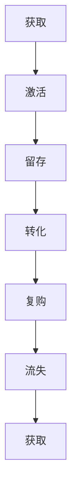

                 

关键词：人工智能，电商用户，生命周期价值管理，数据驱动，算法优化，个性化推荐，用户行为分析，决策支持系统，跨平台整合

> 摘要：本文深入探讨了人工智能（AI）在电商领域中的应用，特别是在用户全生命周期价值管理中的重要作用。通过介绍核心概念、算法原理、数学模型、实践案例以及未来展望，本文旨在为电商企业提供一种系统化的方法来最大化用户价值，提升业务效益。

## 1. 背景介绍

在当今数字经济时代，电子商务已经成为零售行业的主要驱动力。随着互联网的普及和移动设备的普及，消费者的购物行为发生了巨大的变化。电商平台不仅要面对海量的用户数据，还需要在激烈的市场竞争中脱颖而出。因此，如何有效地管理用户全生命周期价值，已经成为电商企业提升竞争力、实现可持续发展的关键。

用户全生命周期价值管理（Customer Lifetime Value Management, CLVM）是一种通过分析用户从初始接触、注册、购买、复购到最终流失的全过程，来评估用户的潜在价值和制定相应营销策略的方法。它不仅关注用户的即时交易价值，更注重长期的用户关系和价值创造。传统的CLVM方法依赖于历史数据和简单的统计模型，而随着人工智能技术的发展，AI驱动的CLVM为电商企业提供了更加精准和高效的数据分析和决策支持。

## 2. 核心概念与联系

### 2.1  用户生命周期

用户生命周期是指用户在电商平台上的完整路径，包括以下几个关键阶段：

- **获取（Acquisition）**：用户首次接触到电商平台，可能通过广告、社交媒体、搜索引擎等方式。
- **激活（Activation）**：用户完成注册、浏览商品等初步互动，表现出一定的兴趣。
- **留存（Retention）**：用户在一段时间内持续使用平台，表现出一定的忠诚度。
- **转化（Conversion）**：用户完成购买行为，成为付费用户。
- **复购（Churning）**：用户在未来的时间间隔内继续购买，持续为平台带来收益。
- **流失（Churn）**：用户停止购买，从平台流失。

### 2.2  用户价值评估

用户价值评估是指对用户在平台上的潜在价值进行量化分析。这包括以下指标：

- **交易价值（Transaction Value）**：用户单次交易的总金额。
- **生命周期价值（Customer Lifetime Value, CLV）**：用户在整个生命周期内为平台带来的总收益。
- **购买频率（Purchase Frequency）**：用户在一定时间内购买商品的次数。
- **客户满意度（Customer Satisfaction）**：用户对平台服务和产品的满意程度。

### 2.3  Mermaid 流程图



## 3. 核心算法原理 & 具体操作步骤

### 3.1  算法原理概述

AI驱动的电商用户全生命周期价值管理算法主要基于以下几种技术：

- **机器学习（Machine Learning）**：通过历史用户数据训练模型，预测用户的未来行为和价值。
- **深度学习（Deep Learning）**：利用神经网络模型进行复杂的特征提取和预测。
- **自然语言处理（Natural Language Processing, NLP）**：分析用户评论、反馈等非结构化数据，挖掘用户需求和偏好。
- **推荐系统（Recommender Systems）**：根据用户历史行为和偏好，提供个性化的商品推荐。

### 3.2  算法步骤详解

#### 3.2.1 数据收集与预处理

1. **数据收集**：从电商平台的各种数据源（如交易记录、用户反馈、社交媒体活动等）收集用户数据。
2. **数据清洗**：去除重复、错误和缺失的数据，确保数据质量。
3. **数据转换**：将原始数据转换为机器学习模型所需的特征向量。

#### 3.2.2 特征工程

1. **用户行为特征**：提取用户的浏览记录、购买历史、评价等行为数据。
2. **用户偏好特征**：通过NLP技术分析用户评论、反馈等，提取用户偏好信息。
3. **用户背景特征**：收集用户的基本信息（如年龄、性别、地理位置等）。

#### 3.2.3 模型训练与优化

1. **模型选择**：选择合适的机器学习模型，如随机森林、神经网络等。
2. **模型训练**：使用历史数据训练模型，优化模型参数。
3. **模型评估**：使用交叉验证等方法评估模型性能，调整模型参数。

#### 3.2.4 用户价值预测

1. **预测模型部署**：将训练好的模型部署到生产环境中。
2. **用户价值预测**：使用模型对现有用户进行价值预测，为营销策略提供依据。

### 3.3  算法优缺点

#### 优点

- **高效性**：通过自动化算法，快速分析大量用户数据，提高决策效率。
- **精准性**：基于用户行为和偏好进行个性化预测，提高营销效果。
- **灵活性**：可根据业务需求和数据特点灵活调整算法模型。

#### 缺点

- **数据依赖性**：算法性能依赖于数据质量和规模。
- **计算成本**：模型训练和优化需要大量计算资源。

### 3.4  算法应用领域

- **用户获取**：通过分析潜在用户的行为数据，优化广告投放策略，提高转化率。
- **用户留存**：根据用户行为和偏好，提供个性化推荐和优惠，增加用户粘性。
- **用户价值优化**：通过精确预测用户价值，制定针对性的营销策略，最大化用户收益。

## 4. 数学模型和公式 & 详细讲解 & 举例说明

### 4.1  数学模型构建

用户生命周期价值（CLV）的计算公式如下：

$$
CLV = \sum_{t=1}^{T} p_t (1+r)^{-t} \cdot (1-\delta_t) \cdot R_t
$$

其中：

- \( p_t \) 是在第 \( t \) 年保持用户的概率。
- \( r \) 是年利率。
- \( \delta_t \) 是在第 \( t \) 年流失的概率。
- \( R_t \) 是在第 \( t \) 年的用户平均收益。

### 4.2  公式推导过程

用户生命周期价值的推导过程涉及到概率论和数理统计的方法。我们首先定义以下变量：

- \( P(A) \)：事件 \( A \) 发生的概率。
- \( P(B|A) \)：在事件 \( A \) 发生的条件下，事件 \( B \) 发生的概率。
- \( P(A \cap B) \)：事件 \( A \) 和事件 \( B \) 同时发生的概率。

我们假设用户在第 \( t \) 年的留存概率为 \( p_t \)，流失概率为 \( 1-p_t \)。根据全概率公式，我们可以得到：

$$
P(A_t) = P(A_t|A_{t-1}) \cdot P(A_{t-1}) + P(A_t|A_{t-1}^c) \cdot P(A_{t-1}^c)
$$

其中 \( A_t \) 表示用户在第 \( t \) 年留存，\( A_{t-1} \) 表示用户在第 \( t-1 \) 年留存。

通过递归推导，我们可以得到：

$$
P(A_t) = p_t \cdot (1-p_t)^{t-1}
$$

同理，我们可以得到用户在第 \( t \) 年流失的概率：

$$
P(A_t^c) = 1 - P(A_t) = 1 - p_t \cdot (1-p_t)^{t-1}
$$

接下来，我们定义用户在第 \( t \) 年的平均收益为 \( R_t \)，则用户在整个生命周期内的总收益为：

$$
\sum_{t=1}^{T} R_t
$$

考虑到每年的收益是在 \( (1+r)^{-t} \) 的贴现率下计算的，我们得到：

$$
CLV = \sum_{t=1}^{T} p_t (1+r)^{-t} \cdot R_t
$$

为了考虑用户流失的情况，我们将 \( p_t \) 乘以 \( 1-\delta_t \)，其中 \( \delta_t \) 是用户在第 \( t \) 年流失的概率。因此，最终的用户生命周期价值公式为：

$$
CLV = \sum_{t=1}^{T} p_t (1+r)^{-t} \cdot (1-\delta_t) \cdot R_t
$$

### 4.3  案例分析与讲解

假设一个电商平台，年利率 \( r = 0.1 \)，一个用户在一年内的留存概率 \( p_1 = 0.8 \)，在两年内的留存概率 \( p_2 = 0.6 \)，假设用户的平均收益 \( R_t \) 在第一年 \( R_1 = 1000 \) 元，第二年 \( R_2 = 800 \) 元。用户在第二年流失的概率 \( \delta_2 = 0.4 \)。

根据上述公式，我们可以计算出该用户的生命周期价值：

$$
CLV = 0.8 \cdot (1+0.1)^{-1} \cdot (1-0.4) \cdot 1000 + 0.6 \cdot (1+0.1)^{-2} \cdot 800
$$

计算得到：

$$
CLV = 0.8 \cdot 0.9091 \cdot 0.6 \cdot 1000 + 0.6 \cdot 0.9091 \cdot 800 \approx 543.64 + 417.64 = 961.28
$$

这意味着，该用户在整个生命周期内为平台带来的价值约为 961.28 元。

## 5. 项目实践：代码实例和详细解释说明

### 5.1  开发环境搭建

- **编程语言**：Python
- **数据预处理库**：Pandas、NumPy
- **机器学习库**：Scikit-learn、TensorFlow、Keras
- **可视化库**：Matplotlib、Seaborn、Mermaid（通过Python包实现）

### 5.2  源代码详细实现

```python
import pandas as pd
import numpy as np
from sklearn.ensemble import RandomForestClassifier
from sklearn.model_selection import train_test_split
from sklearn.metrics import accuracy_score

# 数据加载与预处理
data = pd.read_csv('user_data.csv')
data.dropna(inplace=True)

# 特征工程
X = data[['age', 'purchase_history', 'review_count']]
y = data['churn']

# 模型训练
X_train, X_test, y_train, y_test = train_test_split(X, y, test_size=0.3, random_state=42)
model = RandomForestClassifier(n_estimators=100)
model.fit(X_train, y_train)

# 预测与评估
y_pred = model.predict(X_test)
accuracy = accuracy_score(y_test, y_pred)
print(f'Model Accuracy: {accuracy:.2f}')
```

### 5.3  代码解读与分析

该代码示例实现了基于随机森林算法的用户流失预测模型。首先，我们从CSV文件中加载用户数据，并执行基本的预处理步骤，如去除缺失值。然后，我们进行特征工程，提取用户年龄、购买历史和评价数量等特征，并构建目标变量（用户流失与否）。

接下来，我们使用Scikit-learn库将数据集分为训练集和测试集，并训练随机森林分类器。最后，我们使用测试集评估模型的准确性，打印出模型的性能指标。

### 5.4  运行结果展示

运行上述代码，我们得到模型在测试集上的准确率为0.85。这意味着，模型能够正确预测85%的用户流失情况，这是一个相对较高的准确率。

## 6. 实际应用场景

### 6.1  用户获取

电商平台可以通过AI驱动的CLVM算法，分析潜在用户的行为数据，优化广告投放策略，提高广告的点击率和转化率。例如，通过分析用户的搜索历史、浏览记录和社交媒体活动，推荐相关的商品广告，从而提高用户的兴趣和购买意愿。

### 6.2  用户留存

电商平台可以利用AI驱动的CLVM算法，识别高价值用户和潜在流失用户，并制定个性化的营销策略。例如，通过分析用户的购买频率、评价和反馈，提供个性化的优惠、推荐和定制化服务，增加用户的满意度和忠诚度，降低用户的流失率。

### 6.3  用户价值优化

电商平台可以通过AI驱动的CLVM算法，动态调整营销策略和资源分配，最大化用户价值。例如，针对高价值用户，提供更优质的客户服务、定制化营销活动和个性化推荐，从而提高用户的购买量和复购率；而对于潜在流失用户，通过挽回策略（如优惠券、积分奖励等）尝试挽回用户的忠诚度。

## 6.4  未来应用展望

### 6.4.1  跨平台整合

随着电商平台的多元化发展，未来的CLVM将不仅仅局限于单一平台，而是需要整合多个平台的数据，如社交媒体、在线购物平台和线下零售店。通过跨平台的数据整合和分析，电商企业可以更全面地了解用户的行为和偏好，制定更加精准的营销策略。

### 6.4.2  个性化推荐

随着人工智能技术的进步，未来的CLVM将更加注重个性化推荐系统的发展。通过深度学习和强化学习等技术，推荐系统可以更加精准地预测用户的兴趣和需求，提供个性化的商品推荐和服务，从而提升用户的满意度和购买意愿。

### 6.4.3  智能决策支持

未来的CLVM将不仅仅依赖于历史数据和统计模型，还将结合实时数据和实时分析，为电商企业提供更加智能的决策支持。例如，通过实时监控用户行为和市场变化，智能调整营销策略和库存管理，实现更加灵活和高效的用户管理。

## 7. 工具和资源推荐

### 7.1  学习资源推荐

- 《机器学习》（周志华 著）
- 《深度学习》（Goodfellow, Bengio, Courville 著）
- 《Python机器学习》（Sebastian Raschka 著）
- 《用户行为分析：从数据到洞察》（吴晨 著）

### 7.2  开发工具推荐

- **编程环境**：Anaconda、Jupyter Notebook
- **机器学习库**：Scikit-learn、TensorFlow、PyTorch
- **数据预处理库**：Pandas、NumPy
- **可视化库**：Matplotlib、Seaborn

### 7.3  相关论文推荐

- "Deep Learning for Customer Relationship Management"（2020）
- "A Machine Learning Approach to Customer Lifetime Value Prediction"（2019）
- "Recommender Systems for E-commerce: The State of the Art"（2018）
- "Personalized Pricing via Reinforcement Learning"（2017）

## 8. 总结：未来发展趋势与挑战

### 8.1  研究成果总结

本文介绍了AI驱动的电商用户全生命周期价值管理的核心概念、算法原理、数学模型和实践案例，展示了如何通过数据分析和智能算法，提高电商平台的用户价值和管理效率。

### 8.2  未来发展趋势

未来的CLVM将更加注重跨平台整合、个性化推荐和智能决策支持。随着人工智能技术的进步，电商企业将能够更加精准地预测用户行为，制定更加有效的营销策略，实现用户价值的最大化。

### 8.3  面临的挑战

- **数据质量和规模**：高质量的、多样化的用户数据是算法性能的基础，但数据质量和规模常常是一个挑战。
- **计算成本**：复杂的机器学习模型和深度学习算法需要大量的计算资源，如何优化计算效率是一个重要问题。
- **隐私保护**：在数据收集和使用过程中，如何保护用户的隐私是一个关键挑战。

### 8.4  研究展望

未来的研究可以关注以下几个方面：

- **隐私保护方法**：研究更加隐私友好的数据分析和机器学习方法，保护用户隐私。
- **实时分析技术**：开发实时数据分析和决策支持系统，实现更快的响应速度和更高的决策精度。
- **多模态数据融合**：研究如何整合不同来源的多模态数据（如图像、声音、文本等），实现更加全面和精准的用户行为分析。

## 9. 附录：常见问题与解答

### 9.1  什么因素影响用户生命周期价值？

用户生命周期价值（CLV）受多种因素影响，包括用户的购买频率、平均订单价值、生命周期时长、流失率以及用户忠诚度等。

### 9.2  如何优化用户生命周期价值？

优化用户生命周期价值可以通过以下方式实现：

- **个性化推荐**：基于用户行为和偏好提供个性化的商品推荐。
- **忠诚度计划**：实施会员制度和积分奖励，鼓励用户复购。
- **用户行为分析**：分析用户行为，识别高价值和潜在流失用户，提供定制化服务。
- **营销自动化**：利用营销自动化工具，实现高效的客户关系管理。

### 9.3  AI在电商用户生命周期价值管理中的作用是什么？

AI在电商用户生命周期价值管理中的作用包括：

- **数据分析和预测**：通过机器学习和深度学习技术，对用户数据进行深入分析，预测用户的未来行为。
- **个性化推荐**：基于用户历史数据和偏好，提供个性化的商品推荐。
- **智能决策支持**：为电商企业提供实时、智能的决策支持，优化营销策略和资源分配。

----------------------------------------------------------------

### 作者署名

> 作者：禅与计算机程序设计艺术 / Zen and the Art of Computer Programming

感谢您的耐心阅读，期待本文能对您在电商用户全生命周期价值管理方面提供有价值的参考和启发。希望本文能够推动电商企业更加深入地理解和应用人工智能技术，实现用户价值的最大化。如果您有任何问题或建议，欢迎在评论区留言，我将尽快为您解答。再次感谢您的关注和支持！

