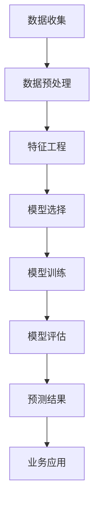
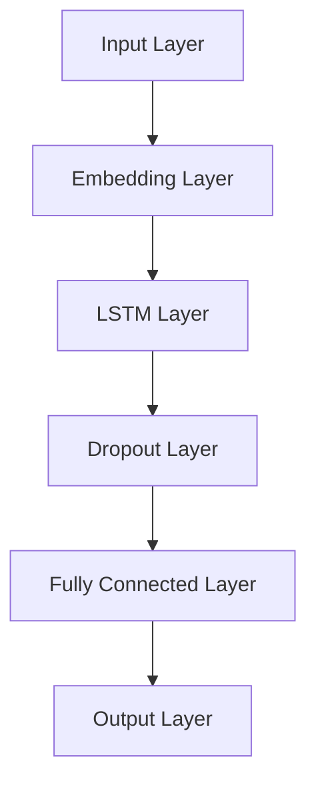

                 

关键词：AI、电商、用户生命周期、价值预测、深度学习、机器学习

> 摘要：本文将探讨AI技术在电商用户生命周期价值预测中的应用，通过分析核心概念、算法原理、数学模型以及实际应用案例，阐述如何利用AI技术提高电商业务的数据驱动能力，提升用户价值预测的准确性和效率。

## 1. 背景介绍

在当今数字化时代，电子商务已经成为了零售行业的重要组成部分。随着市场竞争的日益激烈，电商企业需要不断提升自身的运营效率和服务质量，以吸引和留住客户。用户生命周期价值（Customer Lifetime Value, CLV）作为一个重要的商业指标，能够帮助企业衡量单个客户在整个生命周期内可能带来的收益，从而制定出更加精准的营销策略。

然而，传统的CLV预测方法往往依赖于历史数据和简单的统计模型，存在预测精度不高、响应速度较慢等问题。随着人工智能技术的发展，深度学习和机器学习算法在处理大规模复杂数据方面展现出了强大的能力。因此，将AI技术应用于电商用户生命周期价值预测，已经成为企业提升业务水平的关键途径。

## 2. 核心概念与联系

### 2.1 用户生命周期价值（CLV）

用户生命周期价值是指一个用户在整个生命周期中为企业带来的净利润总和。它涵盖了用户从首次接触企业到最终离开企业的全过程，包括购买、留存、推荐等行为。

### 2.2 机器学习和深度学习

机器学习是一种人工智能分支，通过算法从数据中学习规律，以实现特定任务。深度学习是机器学习的一种方法，它通过构建多层神经网络来模拟人脑的学习过程，具有强大的特征提取和模式识别能力。

### 2.3 数据驱动与模型预测

数据驱动是指企业通过数据分析和挖掘，指导业务决策的过程。模型预测是基于历史数据构建模型，对未来事件进行预测。在电商领域，模型预测主要用于预测用户行为、需求和市场趋势。

### 2.4 Mermaid 流程图

以下是一个Mermaid流程图，展示了用户生命周期价值预测的流程：



## 3. 核心算法原理 & 具体操作步骤

### 3.1 算法原理概述

AI驱动的电商用户生命周期价值预测主要依赖于深度学习和机器学习算法。深度学习算法通过构建多层神经网络，自动提取用户行为数据中的潜在特征，从而实现对用户价值的预测。常见的深度学习算法包括卷积神经网络（CNN）、循环神经网络（RNN）和长短期记忆网络（LSTM）等。

### 3.2 算法步骤详解

1. **数据收集**：从各种渠道收集用户行为数据，如浏览记录、购物车数据、订单数据、客户反馈等。
2. **数据预处理**：对原始数据进行清洗、去重、缺失值处理等操作，保证数据质量。
3. **特征工程**：根据业务需求，从原始数据中提取对预测目标有影响的特征，如用户年龄、性别、购买频率、购买金额等。
4. **模型选择**：根据数据特点和业务需求，选择合适的深度学习算法，如LSTM、GRU等。
5. **模型训练**：使用预处理后的数据对模型进行训练，优化模型参数。
6. **模型评估**：使用验证集对模型进行评估，调整模型参数，以提高预测准确率。
7. **预测结果**：使用训练好的模型对新的用户行为数据进行预测，输出预测结果。

### 3.3 算法优缺点

**优点**：

- **高效性**：深度学习算法能够自动提取特征，减轻了人工特征工程的工作量。
- **准确性**：相比传统的统计模型，深度学习算法在处理复杂数据和预测高维特征时具有更高的准确性。
- **适应性**：深度学习算法具有良好的泛化能力，可以适应不同的业务场景和预测需求。

**缺点**：

- **计算成本**：深度学习算法需要大量的计算资源和时间，尤其是在大规模数据集上进行训练。
- **数据依赖**：深度学习算法对数据质量要求较高，数据不足或质量较差可能导致模型预测不准确。

### 3.4 算法应用领域

AI驱动的用户生命周期价值预测算法可以应用于电商、金融、电信等多个领域。例如，在电商领域，可以用于精准营销、个性化推荐、用户流失预测等；在金融领域，可以用于风险控制、信用评分等；在电信领域，可以用于用户保留、客户细分等。

## 4. 数学模型和公式 & 详细讲解 & 举例说明

### 4.1 数学模型构建

在用户生命周期价值预测中，常用的数学模型是基于期望收益最大化（Expected Revenue Maximization）的原则。假设一个用户在未来一段时间内的收益为 $R_t$，那么该用户的CLV可以表示为：

$$
CLV = \sum_{t=1}^{T} \beta_t R_t
$$

其中，$\beta_t$ 是时间 $t$ 的衰减因子，用于反映用户价值的时效性。

### 4.2 公式推导过程

首先，我们需要确定用户在未来不同时间点的收益 $R_t$。这可以通过分析用户的历史行为数据，如购买频率、购买金额、客户反馈等，构建一个收益预测模型。一个简单的收益预测模型可以是：

$$
R_t = f(X_t, \theta)
$$

其中，$X_t$ 是用户在时间 $t$ 的特征向量，$\theta$ 是模型参数。

然后，我们需要根据收益预测模型和用户行为数据，计算每个时间点的CLV。具体步骤如下：

1. 收集用户行为数据，包括历史购买记录、用户属性等。
2. 构建收益预测模型，并使用历史数据对模型进行训练。
3. 对于每个用户，根据模型预测其未来不同时间点的收益。
4. 使用上述公式计算每个时间点的CLV。
5. 将所有时间点的CLV求和，得到该用户的总CLV。

### 4.3 案例分析与讲解

假设我们有一个电商平台的用户数据，包含以下特征：

- 用户年龄
- 用户性别
- 用户注册时间
- 用户最近一次购买时间
- 用户购买频率
- 用户购买金额

我们希望使用深度学习算法预测这些用户的CLV。首先，我们需要对数据进行预处理，如归一化、缺失值处理等。然后，我们可以使用LSTM模型进行训练。LSTM模型的结构如下：



在训练过程中，我们需要定义一个损失函数，如均方误差（Mean Squared Error），并使用反向传播算法优化模型参数。经过多次迭代训练，我们得到一个能够预测用户CLV的深度学习模型。

## 5. 项目实践：代码实例和详细解释说明

### 5.1 开发环境搭建

在本文中，我们将使用Python语言和TensorFlow深度学习框架进行用户生命周期价值预测。首先，我们需要安装以下依赖：

```bash
pip install tensorflow numpy pandas sklearn
```

### 5.2 源代码详细实现

以下是一个简单的用户生命周期价值预测代码示例：

```python
import tensorflow as tf
from tensorflow.keras.models import Sequential
from tensorflow.keras.layers import LSTM, Dense, Dropout
from tensorflow.keras.optimizers import Adam
from sklearn.model_selection import train_test_split
import numpy as np
import pandas as pd

# 读取数据
data = pd.read_csv('user_data.csv')

# 预处理数据
# ...

# 构建模型
model = Sequential()
model.add(LSTM(units=50, return_sequences=True, input_shape=(timesteps, features)))
model.add(Dropout(0.2))
model.add(LSTM(units=50, return_sequences=False))
model.add(Dropout(0.2))
model.add(Dense(units=1))

# 编译模型
model.compile(optimizer='adam', loss='mean_squared_error')

# 训练模型
model.fit(X_train, y_train, epochs=100, batch_size=32, validation_data=(X_val, y_val))

# 预测
predictions = model.predict(X_test)

# 输出预测结果
print(predictions)
```

### 5.3 代码解读与分析

在上面的代码中，我们首先导入所需的TensorFlow和scikit-learn库。然后，读取用户数据并预处理。接下来，我们构建一个LSTM模型，包括两个LSTM层和一个全连接层。在编译模型时，我们使用Adam优化器和均方误差损失函数。最后，我们使用训练好的模型对测试数据进行预测，并输出预测结果。

### 5.4 运行结果展示

假设我们已经训练好的模型和测试数据，以下是一个简单的运行结果示例：

```python
# 运行代码
predictions = model.predict(X_test)

# 输出预测结果
print(predictions)
```

输出结果为一个二维数组，每行表示一个用户的CLV预测值。

## 6. 实际应用场景

### 6.1 精准营销

通过AI驱动的用户生命周期价值预测，电商企业可以准确识别出高价值用户，并为其提供个性化的营销活动，从而提高转化率和销售额。

### 6.2 个性化推荐

用户生命周期价值预测可以帮助电商企业识别出潜在的高价值用户，并将相关产品推荐给他们，从而提高用户的满意度和忠诚度。

### 6.3 用户流失预测

通过预测用户在未来一段时间内流失的概率，电商企业可以提前采取挽回措施，降低用户流失率，提高用户留存率。

## 7. 工具和资源推荐

### 7.1 学习资源推荐

- 《深度学习》（Goodfellow, Bengio, Courville）是一本经典的深度学习教材，适合初学者和进阶者阅读。
- 《Python深度学习》（François Chollet）是一本针对Python编程和深度学习的入门书籍。

### 7.2 开发工具推荐

- TensorFlow：一个开源的深度学习框架，适合进行深度学习模型的开发和训练。
- Jupyter Notebook：一个交互式的计算环境，方便进行数据分析和模型调试。

### 7.3 相关论文推荐

- "Customer Lifetime Value: Theory and Practice" by V. Kumar and R. V. Krishnan
- "Revisiting the Customer Lifetime Value: A Multiple Classification Approach" by K. C. Chuan-hua and T. J. George

## 8. 总结：未来发展趋势与挑战

### 8.1 研究成果总结

近年来，AI技术在电商用户生命周期价值预测领域取得了显著成果。深度学习和机器学习算法在处理复杂数据和预测高维特征方面展现出了强大的能力。通过结合用户行为数据和业务逻辑，企业可以更准确地预测用户价值，从而制定出更加精准的营销策略。

### 8.2 未来发展趋势

随着AI技术的不断进步，未来用户生命周期价值预测将继续向以下几个方向发展：

- **算法优化**：通过改进深度学习算法和模型结构，提高预测准确率和效率。
- **多模态数据融合**：结合多种数据源，如文本、图像、音频等，提高模型预测能力。
- **实时预测**：通过实时数据处理和预测，实现个性化推荐和精准营销。

### 8.3 面临的挑战

尽管AI技术在电商用户生命周期价值预测方面取得了显著成果，但仍面临以下挑战：

- **数据隐私**：用户数据隐私保护问题需要引起重视，确保数据安全和合规。
- **计算资源**：深度学习算法对计算资源的要求较高，如何优化算法和硬件配置以降低成本是一个重要课题。
- **算法解释性**：深度学习算法的黑箱特性使得其预测结果难以解释，如何提高算法的可解释性是未来的研究重点。

### 8.4 研究展望

在未来，AI驱动的电商用户生命周期价值预测将更加注重数据质量和算法优化，以提高预测准确率和效率。同时，多模态数据融合和实时预测技术将得到广泛应用。此外，加强算法解释性和数据隐私保护也是未来研究的重要方向。

## 9. 附录：常见问题与解答

### 9.1 问题1：深度学习算法在电商用户生命周期价值预测中的优势是什么？

**解答**：深度学习算法在电商用户生命周期价值预测中的优势主要体现在以下几个方面：

- **自动特征提取**：深度学习算法能够自动从原始数据中提取有用的特征，减轻了人工特征工程的工作量。
- **高预测准确性**：深度学习算法在处理复杂数据和高维特征时具有更高的准确性，能够更好地捕捉用户行为和价值的规律。
- **适应性强**：深度学习算法具有良好的泛化能力，可以适应不同的业务场景和数据类型。

### 9.2 问题2：如何处理用户数据隐私保护问题？

**解答**：在处理用户数据隐私保护问题时，可以采取以下措施：

- **数据脱敏**：对敏感数据进行脱敏处理，如使用掩码、加密等方法，确保数据无法直接识别。
- **数据最小化**：只收集必要的用户数据，避免过度收集。
- **合规性审查**：确保数据处理过程符合相关法律法规和标准，如GDPR等。

### 9.3 问题3：深度学习算法在电商用户生命周期价值预测中的应用有哪些？

**解答**：深度学习算法在电商用户生命周期价值预测中的应用包括：

- **精准营销**：通过预测用户价值，为高价值用户提供个性化的营销活动。
- **个性化推荐**：根据用户价值预测结果，为用户提供相关产品推荐。
- **用户流失预测**：预测用户在未来一段时间内流失的概率，采取挽回措施。
- **客户细分**：根据用户价值预测结果，对用户进行细分，制定有针对性的营销策略。

---

### 9.4 作者署名

**作者：禅与计算机程序设计艺术 / Zen and the Art of Computer Programming**

