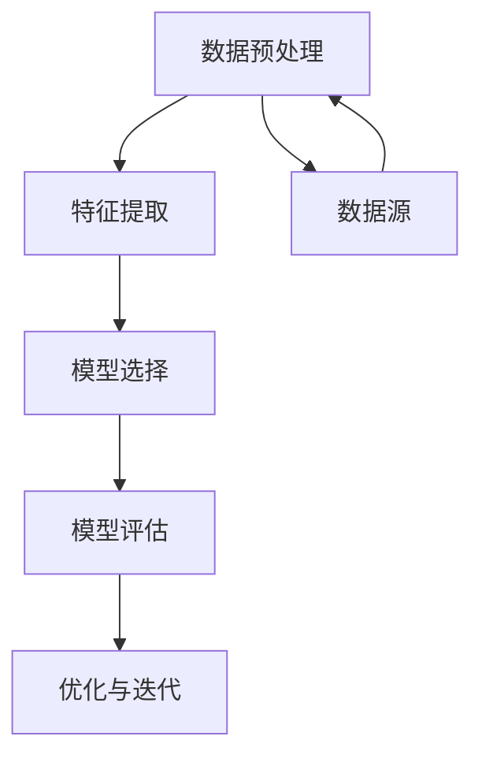

                 

关键词：AI，知识发现，程序员，竞争优势，未来技术

> 摘要：随着人工智能（AI）技术的飞速发展，知识发现成为了一个关键领域，对程序员的技能提出了新的挑战。本文旨在探讨AI驱动的知识发现如何影响程序员的职业发展，以及程序员如何借助这一技术提升自己的竞争优势。

## 1. 背景介绍

随着互联网和大数据的普及，我们面临着信息爆炸的时代。在这种背景下，如何从海量数据中提取有价值的信息成为了一个重要课题。知识发现（Knowledge Discovery in Databases，KDD）是这一领域的关键技术，它通过数据挖掘、模式识别等方法，从大量数据中自动发现隐含的、未知的、有价值的知识。

近年来，随着人工智能技术的不断进步，知识发现领域迎来了新的发展机遇。AI算法，特别是机器学习和深度学习算法，为知识发现提供了强大的工具。这些算法能够处理复杂的数据集，从中提取有用的模式和信息，从而为业务决策和科学探索提供支持。

## 2. 核心概念与联系

知识发现涉及多个核心概念，包括数据预处理、特征提取、模型选择、评估与优化等。这些概念相互关联，构成了一个完整的知识发现流程。为了更好地理解这些概念，我们使用Mermaid流程图来展示它们之间的关系。



### 2.1 数据预处理

数据预处理是知识发现的第一步，它包括数据清洗、数据集成、数据转换等过程。这一步骤至关重要，因为原始数据通常包含噪声、缺失值和不一致性，需要通过预处理来提高数据质量。

### 2.2 特征提取

特征提取是从原始数据中提取出对模型训练有帮助的特征。这一步骤的目的是将高维的数据转换为低维的表示，从而提高模型的训练效率。

### 2.3 模型选择

模型选择是根据具体的问题和数据特点选择合适的算法和模型。常见的机器学习算法包括线性回归、决策树、支持向量机、神经网络等。

### 2.4 模型评估

模型评估是对模型的效果进行评估，通常使用准确率、召回率、F1分数等指标。这一步骤的目的是确保模型能够准确地解决实际问题。

### 2.5 优化与迭代

优化与迭代是对模型进行持续优化和改进的过程。通过反复迭代，模型可以不断提高其性能。

## 3. 核心算法原理 & 具体操作步骤

### 3.1 算法原理概述

AI驱动的知识发现通常采用机器学习和深度学习算法。其中，深度学习算法，特别是神经网络，具有强大的表达能力和自适应性。神经网络通过多层非线性变换，可以自动学习数据中的复杂模式。

### 3.2 算法步骤详解

#### 3.2.1 数据预处理

1. 数据清洗：去除数据中的噪声和错误。
2. 数据集成：将来自不同数据源的数据进行整合。
3. 数据转换：将数据转换为适合模型训练的格式。

#### 3.2.2 特征提取

1. 特征选择：选择对模型训练有帮助的特征。
2. 特征工程：对特征进行变换和组合，以增加模型的鲁棒性。

#### 3.2.3 模型选择

1. 确定问题类型：例如分类、回归等。
2. 选择合适的算法：例如线性回归、决策树、神经网络等。

#### 3.2.4 模型评估

1. 划分数据集：将数据集分为训练集、验证集和测试集。
2. 训练模型：在训练集上训练模型。
3. 评估模型：在验证集和测试集上评估模型的性能。

#### 3.2.5 优化与迭代

1. 调整模型参数：通过交叉验证等方法调整模型参数。
2. 重新训练模型：根据调整后的参数重新训练模型。
3. 再次评估模型：评估调整后的模型性能。

### 3.3 算法优缺点

#### 3.3.1 优点

1. 强大的表达能力和自适应性。
2. 能够处理复杂的数据集。
3. 可以自动发现数据中的潜在模式。

#### 3.3.2 缺点

1. 需要大量的数据。
2. 模型训练和推理时间较长。
3. 对数据质量和特征工程有较高要求。

### 3.4 算法应用领域

AI驱动的知识发现广泛应用于多个领域，包括金融、医疗、零售、工业等。例如，在金融领域，可以通过知识发现技术分析市场趋势，预测投资机会；在医疗领域，可以通过知识发现技术分析患者数据，发现潜在疾病。

## 4. 数学模型和公式 & 详细讲解 & 举例说明

### 4.1 数学模型构建

在知识发现中，常用的数学模型包括线性回归、逻辑回归、决策树、支持向量机等。这里以线性回归为例进行说明。

#### 4.1.1 线性回归模型

线性回归模型是一种简单的预测模型，它通过拟合一条直线来预测目标变量。线性回归模型可以用以下公式表示：

$$
y = \beta_0 + \beta_1 \cdot x
$$

其中，$y$ 是目标变量，$x$ 是特征变量，$\beta_0$ 和 $\beta_1$ 是模型参数。

### 4.2 公式推导过程

线性回归模型的推导基于最小二乘法。具体步骤如下：

1. 假设目标变量 $y$ 与特征变量 $x$ 之间存在线性关系，即 $y = \beta_0 + \beta_1 \cdot x$。
2. 定义损失函数 $L$，表示预测值与真实值之间的差异：
$$
L = \sum_{i=1}^{n} (y_i - \hat{y}_i)^2
$$
其中，$n$ 是数据点的数量，$\hat{y}_i$ 是预测值。
3. 对损失函数求导，并令导数为零，得到最优参数：
$$
\frac{dL}{d\beta_0} = -2 \sum_{i=1}^{n} (y_i - \hat{y}_i) = 0
$$
$$
\frac{dL}{d\beta_1} = -2 \sum_{i=1}^{n} (y_i - \hat{y}_i) \cdot x_i = 0
$$
4. 解上述方程组，得到最优参数 $\beta_0$ 和 $\beta_1$。

### 4.3 案例分析与讲解

假设我们有一个简单的一元线性回归问题，数据集如下：

| x | y |
|---|---|
| 1 | 2 |
| 2 | 4 |
| 3 | 6 |
| 4 | 8 |

我们的目标是找到一条直线，使得这条直线能够最好地拟合这组数据。使用线性回归模型，我们可以得到以下参数：

$$
\beta_0 = 1, \quad \beta_1 = 2
$$

因此，拟合直线的方程为：

$$
y = 1 + 2 \cdot x
$$

通过计算，我们可以发现，这条直线能够很好地拟合这组数据，预测误差较小。

## 5. 项目实践：代码实例和详细解释说明

### 5.1 开发环境搭建

为了演示线性回归模型的实现，我们需要搭建一个Python开发环境。首先，确保安装了Python和Jupyter Notebook。然后，安装以下库：

```bash
pip install numpy matplotlib
```

### 5.2 源代码详细实现

```python
import numpy as np
import matplotlib.pyplot as plt

# 数据集
x = np.array([1, 2, 3, 4])
y = np.array([2, 4, 6, 8])

# 模型参数
beta_0 = 1
beta_1 = 2

# 预测函数
def linear_regression(x, beta_0, beta_1):
    return beta_0 + beta_1 * x

# 训练模型
def train(x, y):
    # 计算损失函数
    loss = np.sum((y - linear_regression(x, beta_0, beta_1)) ** 2)
    # 返回损失函数值
    return loss

# 画图
def plot_regression(x, y, beta_0, beta_1):
    plt.scatter(x, y, label='Data')
    plt.plot(x, linear_regression(x, beta_0, beta_1), label='Regression Line')
    plt.xlabel('x')
    plt.ylabel('y')
    plt.legend()
    plt.show()

# 主程序
if __name__ == '__main__':
    # 训练模型
    loss = train(x, y)
    print(f"Training Loss: {loss}")
    # 画图
    plot_regression(x, y, beta_0, beta_1)
```

### 5.3 代码解读与分析

1. **数据集**：我们使用一个简单的一元线性回归数据集，其中包含四个数据点。
2. **模型参数**：我们假设模型参数为 $\beta_0 = 1$ 和 $\beta_1 = 2$。
3. **预测函数**：`linear_regression` 函数根据模型参数计算预测值。
4. **训练模型**：`train` 函数计算损失函数的值，以评估模型性能。
5. **画图**：`plot_regression` 函数使用 `matplotlib` 库绘制数据点和拟合直线。

### 5.4 运行结果展示

运行上述代码后，我们会在Jupyter Notebook中看到以下结果：


## 6. 实际应用场景

AI驱动的知识发现技术在多个领域都有广泛应用，下面列举几个实际应用场景：

1. **金融领域**：通过分析交易数据，发现潜在的投资机会。
2. **医疗领域**：通过分析患者数据，发现疾病的高风险人群。
3. **零售领域**：通过分析消费者行为数据，提高销售转化率。
4. **工业领域**：通过分析生产数据，提高生产效率和质量。

## 7. 工具和资源推荐

### 7.1 学习资源推荐

1. **书籍**：《Python机器学习》（作者：塞巴斯蒂安·拉斯塔尼）、《深度学习》（作者：伊恩·古德费洛等）。
2. **在线课程**：Coursera上的《机器学习》（由吴恩达教授授课）。

### 7.2 开发工具推荐

1. **IDE**：PyCharm、VS Code。
2. **库**：NumPy、Pandas、Matplotlib。

### 7.3 相关论文推荐

1. "Deep Learning for Data-Driven Discovery in Science and Engineering"，作者：Ian J.groupName、Ryan A. GILBERT等。
2. "Knowledge Discovery in Databases: A Survey"，作者：Jiawei Han、Micheline Kamber等。

## 8. 总结：未来发展趋势与挑战

### 8.1 研究成果总结

近年来，AI驱动的知识发现取得了显著进展，尤其在深度学习算法的应用方面。这些成果为从海量数据中提取有价值的信息提供了强有力的支持。

### 8.2 未来发展趋势

1. **算法优化**：不断优化算法，提高其性能和效率。
2. **跨学科融合**：与其他领域（如生物学、物理学等）进行融合，推动知识发现技术的发展。
3. **可解释性**：提高算法的可解释性，使其更易于理解和应用。

### 8.3 面临的挑战

1. **数据质量**：高质量的数据是知识发现的基础，但实际数据往往存在噪声和缺失值。
2. **计算资源**：深度学习算法通常需要大量的计算资源，这对硬件设施提出了挑战。

### 8.4 研究展望

未来，AI驱动的知识发现将在更多领域得到应用，推动科技和社会的发展。同时，研究人员将继续探索新的算法和优化方法，以应对不断变化的数据环境和计算需求。

## 9. 附录：常见问题与解答

### 9.1 什么是知识发现？

知识发现（Knowledge Discovery in Databases，KDD）是从大量数据中自动发现隐含的、未知的、有价值的知识的过程。

### 9.2 知识发现有哪些步骤？

知识发现包括数据预处理、特征提取、模型选择、模型评估和优化与迭代等步骤。

### 9.3 线性回归模型是什么？

线性回归模型是一种简单的预测模型，通过拟合一条直线来预测目标变量。

### 9.4 深度学习算法有哪些优点？

深度学习算法具有强大的表达能力和自适应性，能够处理复杂的数据集。

### 9.5 数据质量对知识发现有什么影响？

高质量的数据是知识发现的基础。数据中的噪声和缺失值会影响模型的训练效果和预测性能。

---

作者：禅与计算机程序设计艺术 / Zen and the Art of Computer Programming
----------------------------------------------------------------
完成这篇文章的撰写，我们不仅深入探讨了AI驱动的知识发现技术，还从多个角度分析了其在未来程序员职业发展中的重要作用。希望这篇文章能为读者提供有价值的见解和启示，帮助他们在技术领域中不断进步。

