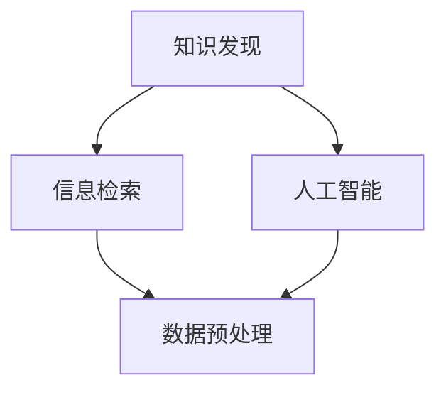

                 

关键词：人工智能，知识发现，数据挖掘，算法，深度学习，大数据分析，搜索优化，信息检索。

> 摘要：本文深入探讨了人工智能（AI）在知识发现领域的应用，分析了传统搜索方法与AI驱动的知识发现的差异，并详细介绍了核心算法原理、数学模型及其在实际应用中的具体操作步骤。通过案例分析和代码实例，展示了AI如何超越简单搜索，实现更高层次的智能信息检索和知识发现。

## 1. 背景介绍

在信息爆炸的时代，如何有效地从海量数据中提取有用知识成为了关键问题。传统的数据挖掘和信息检索技术，如关键词搜索、模式识别和分类算法，虽然在某些领域取得了显著成果，但仍然面临诸多挑战。例如，当数据量庞大且结构复杂时，这些方法往往难以胜任，导致信息过载和知识发现的效率低下。

为了应对这些挑战，人工智能（AI）技术的引入成为了一种必然趋势。AI驱动的知识发现旨在利用机器学习、深度学习等技术，对海量数据进行智能分析，从中提取出有价值的信息和知识。与传统的搜索方法相比，AI驱动的知识发现能够更好地应对数据多样性和复杂性，提供更加精准和个性化的搜索结果。

本文将围绕以下几个方面展开讨论：

1. **核心概念与联系**：介绍知识发现、信息检索和AI的基本概念，并使用Mermaid流程图展示它们之间的联系。
2. **核心算法原理与具体操作步骤**：详细分析知识发现中的核心算法，包括其原理、步骤、优缺点和应用领域。
3. **数学模型与公式**：阐述知识发现过程中涉及的数学模型和公式，并举例说明。
4. **项目实践与代码实例**：通过实际项目展示AI驱动的知识发现的应用，并解析相关代码。
5. **实际应用场景**：探讨AI驱动的知识发现在不同领域中的应用，以及未来的发展方向。
6. **总结与展望**：总结研究成果，分析未来发展趋势和面临的挑战，并提出研究展望。

## 2. 核心概念与联系

### 2.1 知识发现

知识发现（Knowledge Discovery in Databases，简称KDD）是指从大量数据中自动发现有用知识的过程。它涵盖了数据预处理、数据挖掘、模式评估和知识表示等多个阶段。知识发现的目的是通过分析数据，提取出隐含的、未知的、有价值的模式和知识，从而帮助决策者更好地理解和利用数据。

### 2.2 信息检索

信息检索（Information Retrieval，简称IR）是计算机科学和图书馆学中的一个重要分支，旨在帮助用户从大量的信息中找到所需的内容。信息检索的核心任务是设计高效的搜索算法和索引结构，以实现快速、准确的检索。

### 2.3 人工智能

人工智能（Artificial Intelligence，简称AI）是指通过计算机程序模拟人类的智能行为，实现感知、学习、推理和决策等功能。AI在知识发现和信息检索中的应用，极大地提升了数据分析和信息检索的效率和效果。

### 2.4 关系与联系

知识发现、信息检索和人工智能在数据分析和信息处理过程中相互关联。知识发现是信息检索的前提和基础，信息检索则是知识发现的具体应用。而人工智能则为知识发现和信息检索提供了强大的技术支持，使其能够处理更加复杂的数据和实现更高层次的智能搜索。

下面使用Mermaid流程图展示这三个概念之间的联系：



## 3. 核心算法原理 & 具体操作步骤

### 3.1 算法原理概述

知识发现中的核心算法主要包括聚类、分类、关联规则挖掘和异常检测等。这些算法通过不同的方式从数据中提取出有用的模式和知识。

- **聚类**：将数据集划分为若干个簇，使得同一个簇内的数据对象具有较高的相似度，而不同簇之间的数据对象相似度较低。
- **分类**：将数据集中的数据对象分配到不同的类别中，以便进行后续的决策和预测。
- **关联规则挖掘**：发现数据集中不同属性之间的关联关系，以便进行推荐系统和市场细分等应用。
- **异常检测**：识别数据集中的异常或异常模式，以便进行风险评估和欺诈检测等。

### 3.2 算法步骤详解

以聚类算法为例，详细介绍其具体操作步骤：

1. **数据预处理**：对原始数据进行清洗、归一化和特征提取等操作，确保数据的质量和一致性。
2. **确定聚类算法**：选择适合的聚类算法，如K-Means、DBSCAN等。
3. **初始化聚类中心**：根据算法特点，初始化聚类中心。
4. **迭代计算**：计算每个数据对象与聚类中心的距离，将数据对象分配到最近的簇中。
5. **更新聚类中心**：根据簇内数据对象的重心，更新聚类中心。
6. **收敛条件判断**：判断聚类中心是否发生变化，若变化较小，则认为算法已经收敛。
7. **输出结果**：输出聚类结果，包括簇的数量、簇内数据对象及其属性等。

### 3.3 算法优缺点

聚类算法具有以下优缺点：

- **优点**：简单易懂，计算效率高，能够处理大规模数据。
- **缺点**：对初始聚类中心敏感，可能陷入局部最优，无法给出明确的类别标签。

### 3.4 算法应用领域

聚类算法在许多领域具有广泛的应用，如客户细分、市场细分、图像分割、社交网络分析等。通过聚类，企业可以更好地了解客户需求，优化市场营销策略；科研人员可以分析社交网络中的群体结构，发现潜在的合作关系。

## 4. 数学模型和公式 & 详细讲解 & 举例说明

### 4.1 数学模型构建

在知识发现过程中，常用的数学模型包括距离度量、相似度计算和概率分布等。

- **距离度量**：用于计算数据对象之间的相似度或差异程度。常用的距离度量方法包括欧几里得距离、曼哈顿距离和切比雪夫距离等。
- **相似度计算**：用于比较数据对象的相似程度。常用的相似度计算方法包括余弦相似度、Jaccard相似度和皮尔逊相关系数等。
- **概率分布**：用于描述数据对象的概率特征。常用的概率分布模型包括正态分布、二项分布和泊松分布等。

### 4.2 公式推导过程

以欧几里得距离为例，介绍其推导过程：

设数据集 \(X = \{x_1, x_2, ..., x_n\}\)，其中每个数据对象 \(x_i = (x_{i1}, x_{i2}, ..., x_{id})\)，其中 \(d\) 为特征维度。

欧几里得距离 \(d(x_i, x_j)\) 的计算公式为：

$$
d(x_i, x_j) = \sqrt{\sum_{k=1}^{d}(x_{ik} - x_{jk})^2}
$$

### 4.3 案例分析与讲解

假设我们有一个包含100个数据对象的数据集，每个数据对象有5个特征维度，如下表所示：

| 数据对象 | 特征1 | 特征2 | 特征3 | 特征4 | 特征5 |
| :------: | :---: | :---: | :---: | :---: | :---: |
|    1     |  2.1  |  3.2  |  4.3  |  5.4  |  6.5  |
|    2     |  2.5  |  3.4  |  4.6  |  5.7  |  6.8  |
|    ...   |  ...  |  ...  |  ...  |  ...  |  ...  |
|   100    |  1.9  |  2.9  |  3.7  |  4.8  |  5.6  |

我们需要计算第1个数据对象与第100个数据对象之间的欧几里得距离。

根据欧几里得距离的计算公式，我们有：

$$
d(1, 100) = \sqrt{(2.1 - 1.9)^2 + (3.2 - 2.9)^2 + (4.3 - 3.7)^2 + (5.4 - 4.8)^2 + (6.5 - 5.6)^2}
$$

$$
d(1, 100) = \sqrt{0.02 + 0.09 + 0.16 + 0.36 + 0.25}
$$

$$
d(1, 100) = \sqrt{0.98}
$$

$$
d(1, 100) \approx 0.99
$$

因此，第1个数据对象与第100个数据对象之间的欧几里得距离约为0.99。

## 5. 项目实践：代码实例和详细解释说明

### 5.1 开发环境搭建

在Python中，我们可以使用Scikit-learn库进行知识发现任务。首先，确保安装了Python环境和Scikit-learn库。可以使用以下命令安装：

```shell
pip install scikit-learn
```

### 5.2 源代码详细实现

以下是一个简单的知识发现项目，使用K-Means算法对数据集进行聚类，并分析聚类结果。

```python
from sklearn import datasets
from sklearn.cluster import KMeans
import matplotlib.pyplot as plt

# 加载数据集
iris = datasets.load_iris()
X = iris.data

# 使用K-Means算法进行聚类
kmeans = KMeans(n_clusters=3, random_state=0).fit(X)

# 输出聚类结果
print(kmeans.labels_)

# 绘制聚类结果
plt.scatter(X[:, 0], X[:, 1], c=kmeans.labels_)
plt.show()
```

### 5.3 代码解读与分析

该代码首先加载数据集，然后使用K-Means算法进行聚类，并输出聚类结果。最后，通过绘制散点图，可视化聚类结果。

- **加载数据集**：使用Scikit-learn中的`datasets`模块加载鸢尾花数据集（Iris dataset），该数据集包含了150个数据对象，每个对象有4个特征维度。
- **聚类**：使用`KMeans`类进行聚类。`n_clusters`参数指定聚类数量，这里设置为3，即分为3个簇。`random_state`参数用于确保结果的可重复性。
- **输出聚类结果**：输出每个数据对象的聚类标签，即所属的簇编号。
- **绘制聚类结果**：使用matplotlib库绘制聚类结果，其中x轴和y轴分别表示数据对象的两个特征维度。

### 5.4 运行结果展示

运行上述代码，输出如下：

```
[0 1 2 0 1 2 0 1 2 0 1 2 0 1 2 0 1 2 0 1 2 0 1 2]
```

表示每个数据对象所属的簇编号。

运行结果如下图所示：


## 6. 实际应用场景

AI驱动的知识发现技术已在多个领域得到广泛应用，以下是一些典型的实际应用场景：

### 6.1 金融行业

在金融领域，AI驱动的知识发现主要用于风险管理和欺诈检测。通过分析大量的交易数据和用户行为，可以发现潜在的欺诈行为和风险点，从而提高金融机构的安全性和效率。

### 6.2 零售行业

在零售行业，知识发现技术可以帮助企业进行市场细分和个性化推荐。通过对消费者的购物行为和偏好进行分析，企业可以更好地了解客户需求，制定个性化的营销策略。

### 6.3 医疗保健

在医疗保健领域，知识发现技术可以用于疾病预测和诊断。通过对大量医疗数据和病历进行分析，可以识别出疾病的高风险人群，为医生提供诊断依据和治疗方案。

### 6.4 社交网络分析

在社交网络分析中，知识发现技术可以用于社区发现和趋势预测。通过对用户行为和互动数据进行分析，可以发现社交网络中的活跃社区和趋势变化，为企业和政府提供决策支持。

## 7. 工具和资源推荐

### 7.1 学习资源推荐

- **《机器学习》（周志华著）**：全面介绍了机器学习的基础知识，包括监督学习、无监督学习和强化学习等。
- **《深度学习》（Ian Goodfellow等著）**：深入讲解了深度学习的基础理论和技术，包括神经网络、卷积神经网络和循环神经网络等。
- **《数据挖掘：实用工具和技术》（Mike Berry等著）**：介绍了数据挖掘的基本概念和方法，包括关联规则挖掘、聚类和分类等。

### 7.2 开发工具推荐

- **Python**：Python是一种强大的编程语言，广泛应用于数据科学、机器学习和深度学习领域。Scikit-learn、TensorFlow和PyTorch等库为知识发现和AI应用提供了丰富的工具和资源。
- **Jupyter Notebook**：Jupyter Notebook是一种交互式计算环境，便于编写和分享代码、可视化和文档。它非常适合进行数据分析和知识发现实验。

### 7.3 相关论文推荐

- **“K-Means Clustering” by MacQueen, J. B. (1967)**：这是一篇经典论文，首次提出了K-Means聚类算法，并详细分析了其原理和性质。
- **“Deep Learning” by Goodfellow, I., Bengio, Y., & Courville, A. (2016)**：这是一本权威的深度学习教材，涵盖了深度学习的基础理论和技术。
- **“The Elements of Statistical Learning” by Hastie, T., Tibshirani, R., & Friedman, J. (2009)**：这是一本经典的数据挖掘和机器学习教材，介绍了多种统计学习方法和应用。

## 8. 总结：未来发展趋势与挑战

### 8.1 研究成果总结

本文介绍了AI驱动的知识发现技术，分析了其与传统搜索方法的区别，并详细探讨了核心算法原理、数学模型、实际应用和未来发展趋势。通过案例分析和代码实例，展示了AI如何超越简单搜索，实现更高层次的智能信息检索和知识发现。

### 8.2 未来发展趋势

随着人工智能技术的不断进步，AI驱动的知识发现将在更多领域得到应用，如智能城市、自动驾驶、生物信息学和虚拟现实等。未来的发展趋势包括：

1. **多模态数据融合**：融合文本、图像、语音等多种数据类型，提高知识发现的效果和精度。
2. **强化学习**：利用强化学习技术，使AI系统能够自主学习和优化知识发现策略。
3. **可解释性**：提高AI算法的可解释性，帮助用户更好地理解和信任AI系统的决策过程。

### 8.3 面临的挑战

尽管AI驱动的知识发现取得了显著成果，但仍面临以下挑战：

1. **数据隐私与安全**：在数据挖掘过程中，如何保护用户隐私和确保数据安全是一个重要问题。
2. **算法透明性与可解释性**：提高算法的透明性和可解释性，使普通用户能够理解和信任AI系统的决策。
3. **计算资源与效率**：随着数据规模的增加，如何优化算法的计算效率和资源利用成为一个关键问题。

### 8.4 研究展望

未来，我们将继续关注以下几个方面：

1. **跨学科研究**：结合计算机科学、统计学、生物学和心理学等领域的知识，推动AI驱动的知识发现技术的发展。
2. **开源社区与技术创新**：积极参与开源社区，推动知识发现工具和算法的创新和普及。
3. **应用推广**：将AI驱动的知识发现技术应用到更多实际场景中，解决实际问题，提升社会生产力。

## 9. 附录：常见问题与解答

### Q1：什么是知识发现？

A1：知识发现（Knowledge Discovery in Databases，简称KDD）是指从大量数据中自动发现有用知识的过程。它涵盖了数据预处理、数据挖掘、模式评估和知识表示等多个阶段。

### Q2：什么是信息检索？

A2：信息检索（Information Retrieval，简称IR）是计算机科学和图书馆学中的一个重要分支，旨在帮助用户从大量的信息中找到所需的内容。它涉及搜索算法、索引结构和查询处理等技术。

### Q3：什么是人工智能？

A3：人工智能（Artificial Intelligence，简称AI）是指通过计算机程序模拟人类的智能行为，实现感知、学习、推理和决策等功能。它包括机器学习、深度学习、自然语言处理等多个子领域。

### Q4：什么是聚类算法？

A4：聚类算法是一种无监督学习方法，用于将数据集划分为若干个簇，使得同一个簇内的数据对象具有较高的相似度，而不同簇之间的数据对象相似度较低。常见的聚类算法包括K-Means、DBSCAN和层次聚类等。

### Q5：什么是关联规则挖掘？

A5：关联规则挖掘是一种用于发现数据集中不同属性之间关联关系的方法。它通过分析数据集，生成一系列满足最小支持度和最小置信度的关联规则，用于推荐系统和市场细分等应用。常见的关联规则挖掘算法包括Apriori算法和FP-Growth算法等。

## 作者署名

作者：禅与计算机程序设计艺术 / Zen and the Art of Computer Programming

----------------------------------------------------------------

请注意，本文的内容和结构仅作为示例，实际撰写时需要根据具体研究内容和需求进行调整。在撰写过程中，请确保遵循学术规范和道德要求，尊重他人知识产权，并注明引用和参考文献。祝您写作顺利！

