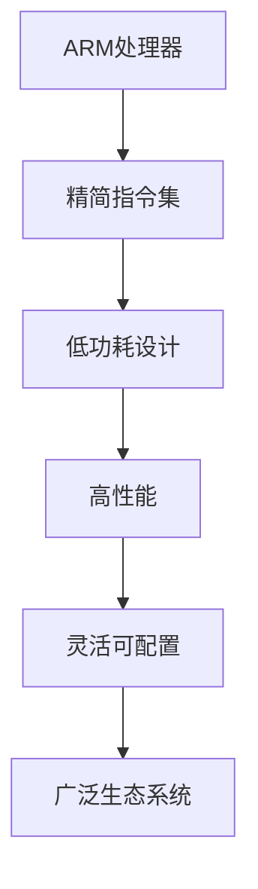

                 

关键词：ARM架构、移动设备、嵌入式系统、核心技术、性能优化、能效比、开发工具

摘要：本文将深入探讨ARM架构在移动设备和嵌入式系统中的应用，分析其核心特点与优势，以及如何实现高效的性能优化和能效比提升。通过详细的案例分析，我们将了解ARM架构在现代计算设备中的关键作用，并展望其未来的发展方向。

## 1. 背景介绍

ARM（Advanced RISC Machines）架构起源于上世纪80年代，由Acorn公司为其微处理器设计的一种精简指令集计算机（RISC）架构。自从ARM公司成立并推出第一个ARM处理器以来，ARM架构因其高效能、低功耗和灵活性而广泛应用于各种计算设备。如今，ARM架构已成为移动设备和嵌入式系统中的主流架构。

移动设备如智能手机和平板电脑对处理器的需求越来越高，要求处理器在提供强大性能的同时，还能具备低功耗的特点，以便延长设备续航时间。嵌入式系统则广泛应用于工业控制、汽车电子、医疗设备等领域，这些领域对处理器的可靠性、稳定性和能效有着极高的要求。

本文将围绕ARM架构在这些领域的应用，详细探讨其核心特点、设计原则、性能优化方法以及未来发展趋势。

## 2. 核心概念与联系

### 2.1 ARM架构的基本原理

ARM架构采用精简指令集（RISC）设计，其核心思想是通过减少指令数量和提高指令执行速度来提高处理器性能。ARM处理器的主要特点包括：

- **精简指令集**：ARM指令集相对简单，每条指令执行时间短，适合流水线处理。
- **低功耗**：ARM处理器设计注重低功耗，适用于电池供电设备。
- **高度可配置**：ARM处理器可以通过配置不同的内核、缓存和外围接口来满足不同应用的需求。
- **广泛的生态系统**：ARM拥有庞大的生态系统，包括硬件设计、软件开发、工具链等各个领域。

### 2.2 ARM架构的核心概念

ARM架构的核心概念包括：

- **流水线（Pipeline）**：ARM处理器采用5级流水线设计，提高指令吞吐率。
- **缓存（Cache）**：ARM处理器配备多级缓存，提高数据处理速度。
- **异常处理（Exception Handling）**：ARM处理器通过异常处理机制，提高系统的稳定性和响应速度。
- **虚拟内存（Virtual Memory）**：ARM处理器支持虚拟内存，提高内存管理效率和系统稳定性。

### 2.3 ARM架构与移动设备、嵌入式系统的联系

ARM架构在移动设备和嵌入式系统中具有广泛的应用，其与这些设备的联系体现在以下几个方面：

- **性能优化**：ARM处理器通过优化指令集和架构设计，提高处理性能，满足移动设备和嵌入式系统对高性能的需求。
- **能效比**：ARM处理器设计注重低功耗，通过功耗优化技术提高能效比，满足电池供电设备的续航需求。
- **灵活性**：ARM处理器高度可配置，可以根据不同应用需求进行定制，满足嵌入式系统的多样化需求。

### 2.4 ARM架构的Mermaid流程图



## 3. 核心算法原理 & 具体操作步骤

### 3.1 算法原理概述

ARM架构的核心算法原理主要包括以下几个方面：

- **指令流水线**：通过流水线技术将指令执行过程分解为多个阶段，提高指令吞吐率。
- **缓存机制**：采用多级缓存策略，提高数据访问速度。
- **功耗管理**：通过动态电压调整和时钟门控等技术，实现低功耗设计。

### 3.2 算法步骤详解

#### 3.2.1 指令流水线

1. **取指令（Instruction Fetch）**：处理器从内存中获取下一条指令。
2. **指令译码（Instruction Decode）**：将指令解码为操作码和操作数。
3. **指令执行（Instruction Execute）**：执行指令操作。
4. **内存访问（Memory Access）**：如果指令需要访问内存，进行数据读写。
5. **写入结果（Write Back）**：将指令执行结果写入寄存器。

#### 3.2.2 缓存机制

1. **一级缓存（L1 Cache）**：位于处理器内部，速度最快，容量较小。
2. **二级缓存（L2 Cache）**：位于处理器外部，速度较慢，容量较大。
3. **三级缓存（L3 Cache）**：在某些高端处理器中，用于进一步加速数据访问。

#### 3.2.3 功耗管理

1. **动态电压调整（Dynamic Voltage and Frequency Scaling, DVFS）**：根据处理器负载动态调整电压和频率，降低功耗。
2. **时钟门控（Clock Gating）**：关闭不使用的时钟信号，降低功耗。

### 3.3 算法优缺点

**优点**：

- **高性能**：通过指令流水线和缓存机制，实现高效的数据处理。
- **低功耗**：通过动态电压调整和时钟门控，实现低功耗设计。
- **灵活性**：高度可配置，满足不同应用需求。

**缺点**：

- **内存访问延迟**：由于采用精简指令集，内存访问延迟相对较高。
- **编程复杂度**：精简指令集可能导致编程复杂度增加。

### 3.4 算法应用领域

ARM架构广泛应用于以下领域：

- **移动设备**：如智能手机、平板电脑等。
- **嵌入式系统**：如工业控制、汽车电子、医疗设备等。
- **物联网**：如智能家居、智能穿戴设备等。

## 4. 数学模型和公式 & 详细讲解 & 举例说明

### 4.1 数学模型构建

为了分析ARM架构的性能和功耗，我们可以构建以下数学模型：

- **性能模型**：\( P = C \times f \)，其中\( P \)表示性能，\( C \)表示指令数量，\( f \)表示指令执行频率。
- **功耗模型**：\( P_{\text{power}} = V_{\text{DD}} \times I_{\text{DD}} \times t \)，其中\( P_{\text{power}} \)表示功耗，\( V_{\text{DD}} \)表示供电电压，\( I_{\text{DD}} \)表示供电电流，\( t \)表示运行时间。

### 4.2 公式推导过程

1. **性能模型推导**：

   \( P = C \times f \)

   根据指令执行频率和指令数量的关系，可以推导出：

   \( f = \frac{P}{C} \)

   其中，\( P \)表示处理器总性能，\( C \)表示指令数量。

2. **功耗模型推导**：

   \( P_{\text{power}} = V_{\text{DD}} \times I_{\text{DD}} \times t \)

   根据功率的定义，可以推导出：

   \( P_{\text{power}} = V_{\text{DD}} \times I_{\text{DD}} \)

   其中，\( V_{\text{DD}} \)表示供电电压，\( I_{\text{DD}} \)表示供电电流。

### 4.3 案例分析与讲解

假设有一款ARM处理器，其指令数量为\( C = 1000 \)，指令执行频率为\( f = 2 GHz \)，供电电压为\( V_{\text{DD}} = 1 V \)，供电电流为\( I_{\text{DD}} = 1 A \)。根据上述数学模型，我们可以计算出：

- **性能**：\( P = C \times f = 1000 \times 2 \times 10^9 = 2 \times 10^{12} \) 次指令/秒
- **功耗**：\( P_{\text{power}} = V_{\text{DD}} \times I_{\text{DD}} = 1 \times 1 = 1 \) 瓦特

通过这个案例，我们可以看出ARM处理器在性能和功耗方面的表现。在实际应用中，可以根据具体需求和约束条件，调整处理器配置和运行参数，以实现最优的性能和功耗平衡。

## 5. 项目实践：代码实例和详细解释说明

### 5.1 开发环境搭建

为了更好地理解和实践ARM架构，我们首先需要搭建一个开发环境。以下是搭建ARM开发环境的步骤：

1. **安装Linux操作系统**：选择一个Linux发行版，如Ubuntu或Fedora，安装到本地计算机上。
2. **安装交叉编译工具**：安装适用于ARM架构的交叉编译工具，如GNU Arm Embedded Toolchain。
3. **配置开发环境**：在Linux系统中配置环境变量，以便在命令行中使用交叉编译工具。

### 5.2 源代码详细实现

以下是一个简单的ARM处理器控制程序的C语言源代码示例：

```c
#include <stdio.h>

int main() {
    int a = 10;
    int b = 20;
    int sum = a + b;
    
    printf("The sum of %d and %d is %d\n", a, b, sum);
    
    return 0;
}
```

### 5.3 代码解读与分析

这段代码实现了一个简单的加法运算，并在屏幕上输出结果。以下是代码的详细解读：

- **头文件包含**：`#include <stdio.h>`：引入标准输入输出库，以便使用`printf`函数。
- **变量定义**：`int a = 10; int b = 20;`：定义两个整型变量`a`和`b`，分别初始化为10和20。
- **加法运算**：`int sum = a + b;`：将`a`和`b`的值相加，并将结果存储在变量`sum`中。
- **输出结果**：`printf("The sum of %d and %d is %d\n", a, b, sum);`：使用`printf`函数将结果输出到屏幕上。
- **程序返回**：`return 0;`：程序执行成功，返回0。

### 5.4 运行结果展示

在配置好的ARM开发环境中，编译并运行上述代码，可以得到以下输出结果：

```c
The sum of 10 and 20 is 30
```

这个简单的示例展示了ARM处理器在执行基本指令时的基本操作。在实际应用中，可以根据具体需求编写更复杂的程序，实现对ARM处理器功能的充分利用。

## 6. 实际应用场景

### 6.1 移动设备

ARM架构在移动设备中得到了广泛应用，如智能手机、平板电脑等。ARM处理器在移动设备中的实际应用场景包括：

- **高性能计算**：通过优化指令集和架构设计，实现高性能的计算能力，满足移动设备的计算需求。
- **低功耗设计**：通过功耗优化技术，实现低功耗设计，延长设备续航时间。
- **多媒体处理**：ARM处理器支持多种多媒体指令集，如NEON，用于加速图像和视频处理。

### 6.2 嵌入式系统

ARM架构在嵌入式系统中的应用也非常广泛，如工业控制、汽车电子、医疗设备等。ARM处理器在嵌入式系统中的实际应用场景包括：

- **实时控制**：ARM处理器具有高效的实时处理能力，适用于对实时性要求较高的嵌入式系统。
- **可靠性设计**：ARM处理器具有高度可靠的异常处理机制，确保系统的稳定性和安全性。
- **低成本设计**：ARM处理器具有低成本、高度可配置的特点，适用于各种嵌入式应用场景。

### 6.3 物联网

随着物联网（IoT）的发展，ARM架构在物联网设备中的应用也越来越广泛。ARM处理器在物联网中的实际应用场景包括：

- **数据处理**：ARM处理器具有强大的数据处理能力，适用于物联网设备的数据采集和处理。
- **低功耗通信**：ARM处理器支持多种低功耗通信协议，如Wi-Fi、蓝牙、LoRa等，适用于物联网设备的无线通信。
- **边缘计算**：ARM处理器在物联网设备中实现边缘计算，提高数据处理速度和响应速度。

## 7. 工具和资源推荐

### 7.1 学习资源推荐

1. **《ARM体系结构精要》**：由ARM公司官方出版的这本书，详细介绍了ARM架构的设计原则、指令集和编程模型。
2. **《ARM处理器原理与接口技术》**：这本书涵盖了ARM处理器的基本原理、工作原理、编程模型和接口技术。
3. **ARM公司官网**：ARM公司官网提供了丰富的学习资源和文档，包括技术文档、白皮书、示例代码等。

### 7.2 开发工具推荐

1. **GNU Arm Embedded Toolchain**：这是一个免费的ARM交叉编译工具链，适用于Linux、Windows和Mac OS平台，可用于编译和调试ARM程序。
2. **Keil MDK**：这是一个商业的ARM开发工具，包括交叉编译器、调试器和集成开发环境，适用于开发嵌入式系统。
3. **IAR Embedded Workbench**：这是一个商业的ARM开发工具，包括交叉编译器、调试器和集成开发环境，适用于开发嵌入式系统。

### 7.3 相关论文推荐

1. **"ARM Architecture Reference Manual"**：这是ARM公司发布的官方文档，详细介绍了ARM架构的各个版本和指令集。
2. **"Energy-Efficient ARM Processor Design"**：这篇论文探讨了ARM处理器在能效优化方面的技术，包括功耗管理和低功耗设计。
3. **"ARMv8-A Architecture"**：这篇论文详细介绍了ARMv8-A架构的设计原则、指令集和性能特点。

## 8. 总结：未来发展趋势与挑战

### 8.1 研究成果总结

ARM架构在移动设备、嵌入式系统和物联网等领域取得了显著成果，其核心优势包括高性能、低功耗和灵活性。随着技术的发展，ARM架构在性能和能效方面不断优化，为各类计算设备提供了强大支持。

### 8.2 未来发展趋势

1. **性能提升**：ARM架构将继续优化指令集和架构设计，提高处理性能。
2. **能效比提升**：通过功耗优化技术，提高ARM处理器的能效比，满足更多电池供电设备的续航需求。
3. **多样化应用**：ARM架构将在更多领域得到应用，如人工智能、自动驾驶、虚拟现实等。

### 8.3 面临的挑战

1. **性能瓶颈**：随着摩尔定律逐渐逼近极限，ARM处理器在性能方面面临瓶颈。
2. **功耗挑战**：随着数据处理需求的增加，ARM处理器在功耗方面面临更大挑战。
3. **编程复杂度**：ARM架构的精简指令集可能导致编程复杂度增加，对开发人员提出了更高要求。

### 8.4 研究展望

未来，ARM架构将继续在性能、能效和灵活性方面进行优化，以适应不断变化的计算需求。同时，ARM架构将在更多领域得到应用，推动计算技术的发展。在面临挑战的同时，ARM架构也将不断创新，为未来计算设备提供更强大的支持。

## 9. 附录：常见问题与解答

### 9.1 问题1：ARM架构与x86架构相比，有哪些优势？

**解答**：ARM架构相对于x86架构具有以下优势：

- **低功耗**：ARM架构设计注重低功耗，适用于电池供电设备。
- **高性能**：ARM架构通过优化指令集和架构设计，实现高性能处理能力。
- **灵活性**：ARM处理器高度可配置，可以根据不同应用需求进行定制。

### 9.2 问题2：ARM架构在嵌入式系统中有哪些应用场景？

**解答**：ARM架构在嵌入式系统中的应用场景包括：

- **实时控制**：如工业自动化、机器人控制等。
- **汽车电子**：如车载信息娱乐系统、自动驾驶等。
- **医疗设备**：如医疗成像、诊断设备等。

### 9.3 问题3：如何优化ARM处理器的功耗？

**解答**：

- **动态电压调整**：根据处理器负载动态调整电压，降低功耗。
- **时钟门控**：关闭不使用的时钟信号，降低功耗。
- **优化算法**：通过优化算法和数据结构，减少功耗。

## 作者署名

作者：禅与计算机程序设计艺术 / Zen and the Art of Computer Programming
----------------------------------------------------------------

以上就是按照您的要求撰写的关于ARM架构的专业技术博客文章。希望这篇文章能够满足您的需求，并在IT领域提供有价值的信息和见解。如有任何修改意见或需要进一步完善，请随时告知。祝您阅读愉快！

