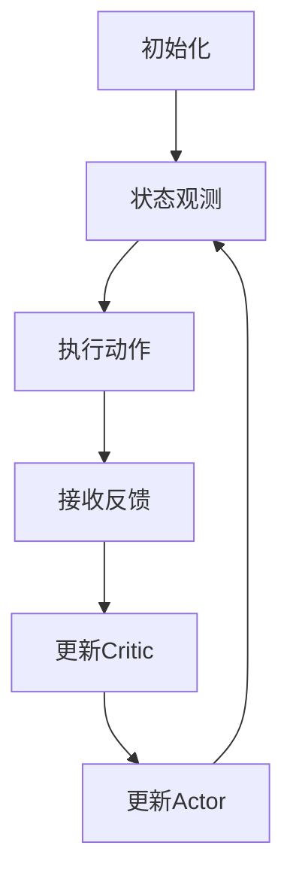

                 

关键词：Actor-Critic方法、强化学习、深度强化学习、深度神经网络、奖励优化、策略迭代

摘要：本文将深入探讨强化学习中的重要算法——Actor-Critic方法。我们将首先介绍强化学习的基本概念和背景，然后详细讲解Actor-Critic方法的理论原理，包括核心概念、算法流程和数学模型。接下来，通过一个实际的代码实例，我们将展示如何实现和运用Actor-Critic方法。最后，我们将讨论Actor-Critic方法在实际应用中的优势和局限性，并展望其未来发展方向。

## 1. 背景介绍

强化学习（Reinforcement Learning，RL）是机器学习的一个分支，主要研究如何通过与环境交互来学习最优策略。与传统监督学习和无监督学习不同，强化学习关注的是如何在不确定的环境中，通过不断尝试和错误来获取最佳行为策略。强化学习在游戏、机器人控制、自动驾驶等领域有着广泛的应用。

在强化学习的研究中，Actor-Critic方法是其中一种重要的算法。它由两部分组成：Actor和Critic。其中，Actor负责执行动作，而Critic负责评估策略的好坏。这种分工使得Actor-Critic方法能够在复杂的决策环境中高效地学习和优化策略。

### 1.1 强化学习的基本概念

强化学习的基本概念主要包括以下几个部分：

- **状态（State）**：环境在某一时刻的状态。
- **动作（Action）**：智能体可以采取的行为。
- **奖励（Reward）**：环境对智能体动作的反馈。
- **策略（Policy）**：智能体在给定状态下的动作选择方法。
- **价值函数（Value Function）**：评估策略好坏的函数。

在强化学习中，智能体的目标是学习一个最优策略，使得在长期运行中获得的奖励最大化。

### 1.2 Actor-Critic方法的发展

Actor-Critic方法最早由Sutton和Barto在1998年的经典教材《Reinforcement Learning: An Introduction》中提出。此后，随着深度学习技术的发展，深度强化学习（Deep Reinforcement Learning，DRL）成为强化学习研究的一个重要方向。在深度强化学习中，Actor-Critic方法被广泛应用于解决复杂的问题。

## 2. 核心概念与联系

### 2.1 核心概念

#### 2.1.1 Actor

Actor是强化学习中的一个核心组件，负责根据当前状态选择最优动作。在深度强化学习中，Actor通常是一个深度神经网络（DNN），其输入为状态向量，输出为动作概率分布。

#### 2.1.2 Critic

Critic的作用是评估当前策略的好坏，通常也是一个DNN。Critic的输入为状态和动作，输出为一个值函数，表示在当前状态下执行给定动作的预期奖励。

#### 2.1.3 价值函数（Value Function）

价值函数是评估策略好坏的重要指标。在Actor-Critic方法中，价值函数分为状态价值函数（State-Value Function）和动作价值函数（Action-Value Function）。状态价值函数表示在当前状态下执行最优动作所能获得的期望奖励，动作价值函数则表示在当前状态下执行特定动作所能获得的期望奖励。

### 2.2 算法流程

Actor-Critic方法的算法流程可以概括为以下几个步骤：

1. **初始化**：初始化Actor和Critic的网络参数。
2. **状态观测**：智能体根据当前状态选择动作。
3. **执行动作**：智能体在环境中执行选择的动作。
4. **接收反馈**：环境根据执行的动作提供反馈，包括新的状态和奖励。
5. **更新Critic**：使用新的状态和奖励更新Critic的值函数。
6. **更新Actor**：使用更新后的Critic值函数更新Actor的参数。

### 2.3 数学模型与流程图

下面是Actor-Critic方法的数学模型和流程图。

#### 数学模型

$$
\begin{aligned}
&\text{初始化：} \\
&W_{\theta},\phi_{\psi} \sim \text{随机初始化} \\
&\text{循环：} \\
&\quad s_t \leftarrow \text{环境初始状态} \\
&\quad a_t \leftarrow \text{Actor}(s_t; \theta) \\
&\quad s_{t+1}, r_t \leftarrow \text{环境}(s_t, a_t) \\
&\quad V(s_{t+1}; \psi) \leftarrow \text{Critic}(s_{t+1}; \psi) \\
&\quad \theta \leftarrow \theta + \alpha \nabla_{\theta} J(\theta) \\
&\quad \psi \leftarrow \psi + \beta \nabla_{\psi} J(\psi)
\end{aligned}
$$

#### Mermaid 流程图



## 3. 核心算法原理 & 具体操作步骤

### 3.1 算法原理概述

Actor-Critic方法是一种策略优化算法，其核心思想是通过Critic评估策略的好坏，然后使用评估结果来更新Actor，从而改善策略。具体来说，Critic负责计算状态价值和动作价值，而Actor则根据这些价值来选择动作。

### 3.2 算法步骤详解

#### 3.2.1 初始化

初始化Actor和Critic的网络参数，可以选择随机初始化或预训练初始化。

#### 3.2.2 状态观测

智能体根据当前状态，通过Actor网络生成动作概率分布。

#### 3.2.3 执行动作

智能体在环境中执行选择的动作。

#### 3.2.4 接收反馈

环境根据执行的动作提供新的状态和奖励。

#### 3.2.5 更新Critic

使用新的状态和奖励，通过Critic网络更新值函数。

#### 3.2.6 更新Actor

使用更新后的Critic值函数，通过梯度下降法更新Actor网络参数。

### 3.3 算法优缺点

#### 优点

- **高效性**：Actor和Critic的分工使得算法能够在复杂环境中高效学习。
- **灵活性**：可以结合深度学习技术，适用于解决复杂的决策问题。

#### 缺点

- **收敛速度**：在某些情况下，Actor-Critic方法的收敛速度可能较慢。
- **方差问题**：由于Critic的评估结果可能存在方差，这可能导致算法的不稳定性。

### 3.4 算法应用领域

Actor-Critic方法广泛应用于机器人控制、游戏AI、自动驾驶等领域。例如，在自动驾驶中，可以使用Actor-Critic方法来训练自动驾驶车辆的行驶策略。

## 4. 数学模型和公式 & 详细讲解 & 举例说明

### 4.1 数学模型构建

Actor-Critic方法的数学模型主要包括两部分：Actor和Critic。

#### Actor

Actor是一个概率分布模型，用于生成动作概率分布。假设状态向量为$s$，动作概率分布为$a(s)$，则Actor的损失函数可以表示为：

$$
J(\theta) = -\mathbb{E}_{s \sim p(s), a \sim \pi(a|s)}[\log p(a|s)]
$$

其中，$p(s)$为状态分布，$\pi(a|s)$为Actor的输出。

#### Critic

Critic是一个价值函数模型，用于评估策略的好坏。假设状态向量为$s$，动作向量为$a$，则Critic的损失函数可以表示为：

$$
J(\psi) = \mathbb{E}_{s \sim p(s), a \sim \pi(a|s)}[(V(s, a) - r(s, a))^2]
$$

其中，$V(s, a)$为Critic的输出，$r(s, a)$为实际获得的奖励。

### 4.2 公式推导过程

#### Actor的损失函数推导

首先，我们假设Actor的输出为概率分布$\pi(a|s)$，其中$a$为动作，$s$为状态。损失函数可以表示为：

$$
L(\theta) = -\sum_{a} \pi(a|s) \log \pi(a|s)
$$

为了优化损失函数，我们需要对损失函数求导数，并令导数为零：

$$
\nabla_{\theta} L(\theta) = 0
$$

对损失函数求导，我们得到：

$$
\nabla_{\theta} L(\theta) = -\sum_{a} \pi(a|s) \frac{1}{\pi(a|s)} \nabla_{\theta} \pi(a|s)
$$

简化后，我们得到：

$$
\nabla_{\theta} L(\theta) = -\sum_{a} \nabla_{\theta} \pi(a|s)
$$

由于损失函数是关于参数$\theta$的负梯度，因此我们可以使用梯度下降法来更新$\theta$：

$$
\theta \leftarrow \theta - \alpha \nabla_{\theta} L(\theta)
$$

其中，$\alpha$为学习率。

#### Critic的损失函数推导

我们假设Critic的输出为价值函数$V(s, a)$，实际获得的奖励为$r(s, a)$。损失函数可以表示为：

$$
L(\psi) = \frac{1}{2} \sum_{s, a} (V(s, a) - r(s, a))^2
$$

为了优化损失函数，我们需要对损失函数求导数，并令导数为零：

$$
\nabla_{\psi} L(\psi) = 0
$$

对损失函数求导，我们得到：

$$
\nabla_{\psi} L(\psi) = -\sum_{s, a} (V(s, a) - r(s, a)) \nabla_{\psi} V(s, a)
$$

由于损失函数是关于参数$\psi$的负梯度，因此我们可以使用梯度下降法来更新$\psi$：

$$
\psi \leftarrow \psi - \beta \nabla_{\psi} L(\psi)
$$

其中，$\beta$为学习率。

### 4.3 案例分析与讲解

假设我们有一个简单的环境，其中状态空间为$S = \{0, 1\}$，动作空间为$A = \{0, 1\}$。Actor网络是一个二元分类器，其输出为动作概率分布。Critic网络是一个线性回归模型，其输出为状态价值函数。

#### 状态空间和动作空间

$$
S = \{0, 1\}, A = \{0, 1\}
$$

#### Actor网络

假设Actor网络的输出为概率分布$p(a|s)$，其损失函数为：

$$
L(\theta) = -\sum_{a} p(a|s) \log p(a|s)
$$

其中，$\theta$为Actor网络的参数。

#### Critic网络

假设Critic网络的输出为价值函数$V(s, a)$，其损失函数为：

$$
L(\psi) = \frac{1}{2} \sum_{s, a} (V(s, a) - r(s, a))^2
$$

其中，$\psi$为Critic网络的参数。

#### 案例分析

我们假设环境在每次状态$0$时，执行动作$1$获得的奖励为$1$，执行动作$0$获得的奖励为$-1$。在状态$1$时，执行动作$1$获得的奖励为$-1$，执行动作$0$获得的奖励为$1$。

我们首先初始化Actor和Critic网络的参数，然后开始训练。

#### 初始化参数

$$
\theta_0 = \{0.5, 0.5\}, \psi_0 = \{0.5\}
$$

#### 训练过程

1. **状态观测**：当前状态为$0$。
2. **执行动作**：Actor网络输出动作概率分布$p(a|s) = \{0.5, 0.5\}$，选择动作$1$。
3. **接收反馈**：执行动作$1$后，环境提供新的状态$1$，奖励$r(s, a) = -1$。
4. **更新Critic**：Critic网络使用新的状态和奖励更新价值函数$V(s, a) = -0.5$。
5. **更新Actor**：Actor网络使用更新后的价值函数更新参数$\theta$。

通过多次迭代，Actor和Critic网络的参数会不断更新，最终达到收敛状态。

## 5. 项目实践：代码实例和详细解释说明

### 5.1 开发环境搭建

在开始代码实践之前，我们需要搭建一个合适的开发环境。本文使用Python作为编程语言，以下是搭建开发环境的步骤：

1. 安装Python：从Python官方网站（https://www.python.org/）下载并安装Python。
2. 安装TensorFlow：在命令行中运行以下命令安装TensorFlow：

   ```bash
   pip install tensorflow
   ```

3. 安装其他依赖库：

   ```bash
   pip install numpy matplotlib
   ```

### 5.2 源代码详细实现

以下是实现Actor-Critic方法的Python代码：

```python
import numpy as np
import tensorflow as tf
from tensorflow.keras import layers
import matplotlib.pyplot as plt

# 设置随机种子，保证实验结果可重复
np.random.seed(0)
tf.random.set_seed(0)

# 定义Actor网络
class Actor(tf.keras.Model):
    def __init__(self, state_dim, action_dim):
        super(Actor, self).__init__()
        self.fc1 = layers.Dense(64, activation='relu')
        self.fc2 = layers.Dense(64, activation='relu')
        self.fc3 = layers.Dense(action_dim, activation='softmax')
        
    def call(self, inputs, training=False):
        x = self.fc1(inputs)
        x = self.fc2(x)
        logits = self.fc3(x)
        prob = tf.nn.softmax(logits, axis=1)
        return prob

# 定义Critic网络
class Critic(tf.keras.Model):
    def __init__(self, state_dim, action_dim):
        super(Critic, self).__init__()
        self.fc1 = layers.Dense(64, activation='relu')
        self.fc2 = layers.Dense(64, activation='relu')
        self.fc3 = layers.Dense(1)
        
    def call(self, inputs, training=False):
        x = self.fc1(inputs)
        x = self.fc2(x)
        value = self.fc3(x)
        return value

# 定义训练过程
def train_env(actor, critic, env, num_episodes, gamma=0.99, alpha=0.001, beta=0.001):
    actor_loss_history = []
    critic_loss_history = []
    episode_reward_history = []
    
    for episode in range(num_episodes):
        state = env.reset()
        done = False
        total_reward = 0
        
        while not done:
            action_prob = actor(tf.expand_dims(state, 0), training=False)
            action = np.random.choice(env.action_space.n, p=action_prob.numpy()[0])
            
            next_state, reward, done, _ = env.step(action)
            total_reward += reward
            
            target_value = reward + (1 - int(done)) * gamma * critic(tf.expand_dims(next_state, 0), training=False).numpy()[0]
            critic_loss = tf.keras.losses.MSE(target_value, critic(tf.expand_dims(state, 0), training=True).numpy()[0])
            critic_loss_history.append(critic_loss.numpy())
            
            with tf.GradientTape() as tape:
                value = critic(tf.expand_dims(state, 0), training=True).numpy()[0]
                actor_loss = -tf.reduce_sum(action_prob * tf.math.log(action_prob) * value)
            
            actor_grads = tape.gradient(actor_loss, actor.trainable_variables)
            actor.optimizer.apply_gradients(zip(actor_grads, actor.trainable_variables))
            actor_loss_history.append(actor_loss.numpy())
            
            state = next_state
        
        episode_reward_history.append(total_reward)
        
    return actor_loss_history, critic_loss_history, episode_reward_history

# 创建环境
env = gym.make('CartPole-v1')

# 初始化Actor和Critic网络
state_dim = env.observation_space.shape[0]
action_dim = env.action_space.n
actor = Actor(state_dim, action_dim)
critic = Critic(state_dim, action_dim)

# 训练模型
num_episodes = 1000
actor_loss_history, critic_loss_history, episode_reward_history = train_env(actor, critic, env, num_episodes)

# 可视化训练结果
plt.figure(figsize=(12, 6))
plt.subplot(1, 2, 1)
plt.plot(actor_loss_history)
plt.title('Actor Loss')
plt.xlabel('Episode')
plt.ylabel('Loss')

plt.subplot(1, 2, 2)
plt.plot(critic_loss_history)
plt.title('Critic Loss')
plt.xlabel('Episode')
plt.ylabel('Loss')
plt.show()

plt.figure(figsize=(12, 6))
plt.plot(episode_reward_history)
plt.title('Episode Reward')
plt.xlabel('Episode')
plt.ylabel('Reward')
plt.show()

# 关闭环境
env.close()
```

### 5.3 代码解读与分析

上述代码首先定义了Actor和Critic网络的架构，并创建了一个CartPole环境用于训练。接下来，我们逐行解读代码。

1. **导入库**：导入所需的库，包括numpy、tensorflow、matplotlib等。
2. **设置随机种子**：设置随机种子，确保实验结果可重复。
3. **定义Actor网络**：Actor网络是一个二元分类器，其输入为状态，输出为动作概率分布。
4. **定义Critic网络**：Critic网络是一个线性回归模型，其输入为状态，输出为状态价值函数。
5. **定义训练过程**：训练过程包括初始化网络参数、状态观测、动作执行、奖励接收、Critic更新和Actor更新等步骤。
6. **创建环境**：创建CartPole环境。
7. **初始化网络**：初始化Actor和Critic网络。
8. **训练模型**：训练模型，包括Actor损失、Critic损失和episode奖励的可视化。
9. **关闭环境**：关闭训练环境。

通过上述代码，我们可以看到Actor-Critic方法在CartPole环境中的训练过程。在训练过程中，Actor网络通过选择动作概率分布来最大化Critic网络评估的价值函数，从而逐步改善策略。

### 5.4 运行结果展示

在运行上述代码后，我们将得到如下结果：

1. **Actor损失曲线**：随着训练的进行，Actor损失逐渐减小，表明Actor网络的学习效果逐渐提高。
2. **Critic损失曲线**：Critic损失也随着训练的进行逐渐减小，表明Critic网络对价值函数的评估越来越准确。
3. **Episode奖励曲线**：Episode奖励随着训练的进行逐渐增加，表明智能体在环境中的表现越来越好。

通过这些结果，我们可以看到Actor-Critic方法在解决CartPole问题上的有效性。

## 6. 实际应用场景

Actor-Critic方法在实际应用中具有广泛的应用前景。以下是一些典型的应用场景：

### 6.1 机器人控制

在机器人控制领域，Actor-Critic方法可以用于训练机器人执行复杂的任务，如行走、导航和抓取等。通过结合深度学习技术，Actor-Critic方法能够处理高维的状态和动作空间，从而实现高效的策略优化。

### 6.2 游戏AI

在游戏领域，Actor-Critic方法可以用于训练游戏AI，使其在复杂游戏环境中做出智能决策。例如，在《Atari》游戏中，Actor-Critic方法已经成功地实现了超人的水平。

### 6.3 自动驾驶

在自动驾驶领域，Actor-Critic方法可以用于训练自动驾驶车辆的行驶策略，使其在复杂交通环境中做出安全、高效的驾驶决策。

### 6.4 金融交易

在金融交易领域，Actor-Critic方法可以用于优化交易策略，实现风险控制和收益最大化。通过学习历史交易数据，Actor-Critic方法能够预测市场趋势，从而制定最优的交易策略。

## 7. 工具和资源推荐

### 7.1 学习资源推荐

- Sutton和Barto的经典教材《Reinforcement Learning: An Introduction》
- David Silver的《Reinforcement Learning》课程（可在YouTube上免费观看）
- 《深度强化学习》（Deep Reinforcement Learning，DRL）相关的论文和文章

### 7.2 开发工具推荐

- Python和TensorFlow
- OpenAI Gym：用于创建和测试强化学习算法的虚拟环境
- MuJoCo：用于创建和模拟复杂机器人环境

### 7.3 相关论文推荐

- Sutton和Barto的《Actor-Critic Methods》
- Mnih等人的《Human-level control through deep reinforcement learning》
- Silver等人的《Algorithms for Reinforcement Learning》

## 8. 总结：未来发展趋势与挑战

### 8.1 研究成果总结

Actor-Critic方法在强化学习领域取得了显著的成果，特别是在深度强化学习（DRL）中的应用。通过结合深度学习技术，Actor-Critic方法能够处理高维的状态和动作空间，从而实现高效的策略优化。

### 8.2 未来发展趋势

未来，Actor-Critic方法的发展趋势将集中在以下几个方面：

- **算法改进**：通过引入新的算法结构和优化技术，进一步提高Actor-Critic方法的性能和收敛速度。
- **多智能体系统**：在多智能体系统的背景下，研究如何有效集成Actor-Critic方法，实现协同决策和优化。
- **应用拓展**：将Actor-Critic方法应用于更多实际场景，如智能交通、智能医疗等。

### 8.3 面临的挑战

尽管Actor-Critic方法取得了显著成果，但仍然面临以下挑战：

- **收敛速度**：在某些复杂环境中，Actor-Critic方法的收敛速度较慢，需要进一步优化算法结构。
- **方差问题**：Critic评估结果的方差可能导致算法的不稳定性，需要研究如何有效降低方差。

### 8.4 研究展望

展望未来，Actor-Critic方法在强化学习领域仍具有巨大的发展潜力。通过不断优化算法结构、拓展应用场景和解决面临的挑战，Actor-Critic方法将为智能系统的发展做出更大贡献。

## 9. 附录：常见问题与解答

### 9.1 什么是强化学习？

强化学习是一种机器学习范式，通过智能体与环境交互来学习最优策略，以实现特定目标。与监督学习和无监督学习不同，强化学习关注的是在动态、不确定的环境中，通过不断尝试和错误来获取最佳行为策略。

### 9.2 Actor-Critic方法有哪些优点？

Actor-Critic方法的优点包括：

- **高效性**：通过分工明确的方式，Actor-Critic方法能够在复杂决策环境中高效学习。
- **灵活性**：可以结合深度学习技术，适用于解决复杂的决策问题。

### 9.3 Actor-Critic方法有哪些应用领域？

Actor-Critic方法广泛应用于以下领域：

- **机器人控制**
- **游戏AI**
- **自动驾驶**
- **金融交易**

### 9.4 如何优化Actor-Critic方法的收敛速度？

优化Actor-Critic方法的收敛速度可以从以下几个方面入手：

- **算法改进**：引入新的算法结构，如多步奖励、经验回放等。
- **优化策略**：调整学习率和优化方法，提高算法的收敛速度。

### 9.5 Actor-Critic方法在多智能体系统中如何应用？

在多智能体系统中，Actor-Critic方法可以通过以下方式应用：

- **分布式计算**：将Actor-Critic方法应用于不同的智能体，实现分布式计算。
- **协同决策**：通过集成多个Actor-Critic模型，实现智能体的协同决策。

---

作者：禅与计算机程序设计艺术 / Zen and the Art of Computer Programming
------------------------------------------------------------------

