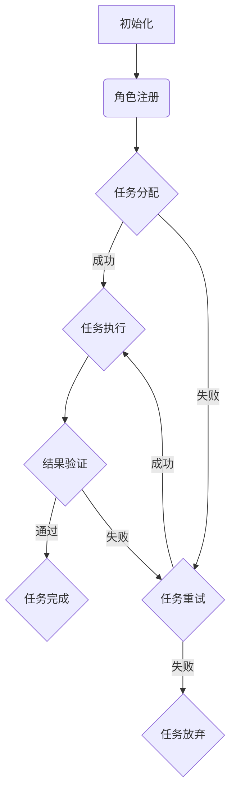

                 

关键词：Agentic Workflow, 工作流，自动化，角色，协作，AI驱动的系统优化

> 摘要：本文探讨了Agentic Workflow的概念及其如何驱动角色工作流的变革。通过深入分析Agentic Workflow的核心原理和实现机制，我们提出了一个全新的角色工作流框架，旨在提高角色之间的协作效率和系统整体性能。本文还通过实际案例展示了Agentic Workflow的强大应用潜力，并展望了其在未来工作流领域的广泛应用和深入研究。

## 1. 背景介绍

在现代信息社会中，工作流管理已经成为各行各业提高工作效率和减少成本的重要手段。传统的基于规则的工作流系统虽然在一定程度上实现了自动化，但在复杂和动态的环境下，其灵活性和适应性往往受到限制。特别是当工作流涉及到多个角色和复杂的任务依赖关系时，传统的系统常常显得力不从心。

随着人工智能技术的发展，特别是在机器学习、自然语言处理和自主决策领域的突破，Agentic Workflow作为一种新兴的工作流管理方法，开始受到越来越多的关注。Agentic Workflow不仅仅是一种自动化工具，更是一种能够智能调整、优化和适应工作流的系统。它通过模拟角色的自主行为和决策过程，实现了工作流的动态优化和高效执行。

本文的目标是深入探讨Agentic Workflow的核心原理，构建一个适用于多种场景的角色工作流框架，并通过实际案例验证其有效性和实用性。文章结构如下：

1. 背景介绍
2. 核心概念与联系
3. 核心算法原理 & 具体操作步骤
4. 数学模型和公式 & 详细讲解 & 举例说明
5. 项目实践：代码实例和详细解释说明
6. 实际应用场景
7. 工具和资源推荐
8. 总结：未来发展趋势与挑战
9. 附录：常见问题与解答

## 2. 核心概念与联系

### 2.1 Agentic Workflow 概念

Agentic Workflow 是一种基于角色的、智能化的工作流管理系统。它不仅能够根据预设的规则自动执行任务，还能够通过学习角色之间的互动模式和任务依赖关系，自主调整和优化工作流。Agentic Workflow 的关键在于“角色”（Agents）的智能行为和自主决策。

### 2.2 角色（Agents）

在Agentic Workflow中，角色（Agents）是工作流的基本执行单元。这些角色可以是人类角色，也可以是机器人或软件代理。每个角色都具备一定的自主性，能够根据任务需求和自身能力进行决策和行动。角色之间的交互和协作构成了工作流的核心。

### 2.3 任务（Tasks）

任务（Tasks）是工作流中的具体操作单元。它们可以是简单的数据处理，也可以是复杂的业务逻辑处理。每个任务都有明确的输入和输出，并且可以由一个或多个角色执行。

### 2.4 任务依赖关系（Dependencies）

任务依赖关系是指工作流中不同任务之间的执行顺序和依赖关系。在Agentic Workflow中，任务依赖关系不仅基于预定义的规则，还受到角色能力和状态的动态影响。

### 2.5 Mermaid 流程图（流程节点中不要有括号、逗号等特殊字符）



### 2.6 Agentic Workflow 原理简述

Agentic Workflow 通过以下步骤实现工作流的优化和自动化：

1. 初始化：系统初始化，角色注册和任务定义。
2. 任务分配：根据角色能力和任务需求，自动分配任务。
3. 任务执行：角色根据任务需求执行具体操作。
4. 结果验证：对任务执行结果进行验证，确保工作流正确执行。
5. 动态调整：根据角色状态和任务依赖关系，动态调整工作流。

## 3. 核心算法原理 & 具体操作步骤

### 3.1 算法原理概述

Agentic Workflow 的核心算法基于多智能体系统（MAS）和强化学习（Reinforcement Learning）理论。多智能体系统允许角色之间进行协作和交互，强化学习则为角色提供了自主学习和优化的能力。

### 3.2 算法步骤详解

#### 3.2.1 初始化

- 系统初始化：设置角色和任务的基本属性。
- 角色注册：角色向系统注册，并获取任务列表。
- 任务定义：定义每个任务的具体操作和预期结果。

#### 3.2.2 任务分配

- 能力评估：根据角色能力和任务需求，评估角色执行任务的可能性。
- 任务分配：系统根据评估结果，自动分配任务给角色。

#### 3.2.3 任务执行

- 角色执行：角色根据任务需求执行具体操作。
- 状态更新：角色执行任务后，系统更新角色的状态信息。

#### 3.2.4 结果验证

- 结果验证：系统对任务执行结果进行验证，确保工作流正确执行。

#### 3.2.5 动态调整

- 状态监测：系统持续监测角色状态和任务依赖关系。
- 动态调整：系统根据状态监测结果，动态调整工作流。

### 3.3 算法优缺点

#### 3.3.1 优点

- 高度自动化：Agentic Workflow 能够自动分配任务和调整工作流，减少了人工干预。
- 高效协作：多智能体系统能够实现角色之间的高效协作，提高工作流整体性能。
- 自主学习：强化学习使角色能够自主学习和优化工作流，提高系统适应性和灵活性。

#### 3.3.2 缺点

- 复杂性：Agentic Workflow 算法涉及多智能体系统和强化学习，实现和调试复杂。
- 数据依赖：算法效果依赖于训练数据的质量和数量，数据不足可能导致性能下降。

### 3.4 算法应用领域

Agentic Workflow 适用于多种场景，包括：

- 企业业务流程管理：如客户服务、订单处理、财务结算等。
- 供应链管理：如库存管理、物流配送、采购计划等。
- 医疗保健：如预约管理、病历处理、诊断建议等。
- 教育培训：如课程管理、作业分配、成绩评估等。

## 4. 数学模型和公式 & 详细讲解 & 举例说明

### 4.1 数学模型构建

Agentic Workflow 的数学模型主要基于多智能体系统和强化学习。以下是核心模型的构建过程：

#### 4.1.1 多智能体系统模型

假设有 \( N \) 个角色，每个角色 \( i \) 具有状态 \( S_i \) 和动作 \( A_i \)。角色之间的交互可以通过状态转移概率矩阵 \( P \) 描述：

\[ P_{ij} = P(S_i \rightarrow S_j, A_i \rightarrow A_j) \]

#### 4.1.2 强化学习模型

强化学习模型通过奖励机制激励角色进行决策。假设每个角色在执行任务时获得奖励 \( R_i \)，角色根据奖励调整其行为策略。奖励函数 \( R \) 可以定义为：

\[ R_i = f(S_i, A_i) \]

### 4.2 公式推导过程

#### 4.2.1 状态转移概率矩阵推导

状态转移概率矩阵 \( P \) 可以通过角色之间的交互历史数据进行估计。假设在第 \( t \) 个时间步，角色 \( i \) 执行动作 \( A_i \) 后进入状态 \( S_j \)，则状态转移概率矩阵的更新公式为：

\[ P_{ij}^{t+1} = P_{ij}^{t} + \alpha(S_i \rightarrow S_j, A_i \rightarrow A_j) \]

其中，\( \alpha \) 是学习率。

#### 4.2.2 奖励函数推导

奖励函数 \( R \) 可以根据任务的完成情况和角色之间的协作效果进行设计。一个简单的奖励函数可以是：

\[ R_i = \frac{C_i}{T_i} \]

其中，\( C_i \) 是角色 \( i \) 在任务 \( T_i \) 中的贡献值，\( T_i \) 是任务 \( T_i \) 的总耗时。

### 4.3 案例分析与讲解

#### 4.3.1 案例背景

假设一个企业有 5 个部门（角色），每个部门负责不同的业务。系统需要根据业务需求和部门能力，动态分配任务并调整工作流。

#### 4.3.2 状态转移概率矩阵计算

根据历史数据，我们可以得到以下状态转移概率矩阵：

\[ P = \begin{bmatrix} 
0.9 & 0.1 & 0 & 0 & 0 \\
0.2 & 0.8 & 0 & 0 & 0 \\
0 & 0.4 & 0.6 & 0 & 0 \\
0 & 0 & 0.3 & 0.7 & 0 \\
0 & 0 & 0 & 0.2 & 0.8 
\end{bmatrix} \]

#### 4.3.3 奖励函数计算

假设任务完成时间分别为 \( T_1 = 3 \)，\( T_2 = 4 \)，\( T_3 = 2 \)，\( T_4 = 5 \)，\( T_5 = 4 \)。根据部门的能力，贡献值分别为 \( C_1 = 1 \)，\( C_2 = 2 \)，\( C_3 = 3 \)，\( C_4 = 1 \)，\( C_5 = 2 \)。则奖励函数可以计算为：

\[ R_1 = \frac{1}{3} \approx 0.33 \]
\[ R_2 = \frac{2}{4} = 0.5 \]
\[ R_3 = \frac{3}{2} = 1.5 \]
\[ R_4 = \frac{1}{5} = 0.2 \]
\[ R_5 = \frac{2}{4} = 0.5 \]

#### 4.3.4 结果分析

根据奖励函数，部门 3 的奖励最高，说明其在任务完成过程中贡献最大。部门 1 和部门 2 的奖励次之，部门 4 和部门 5 的奖励相对较低。这表明，在当前工作流设置下，部门 3 的角色能力相对最强，而部门 4 和部门 5 的角色能力相对较弱。系统可以通过调整角色能力和任务分配策略，进一步优化工作流。

## 5. 项目实践：代码实例和详细解释说明

### 5.1 开发环境搭建

为了实现 Agentic Workflow，我们选择了 Python 作为开发语言，并使用了以下库和框架：

- Python 3.8 或以上版本
- Flask（Web 框架）
- SQLAlchemy（数据库 ORM）
- Pandas（数据处理库）
- Scikit-learn（机器学习库）

### 5.2 源代码详细实现

以下是 Agentic Workflow 的核心代码实现：

```python
# app.py

from flask import Flask, request, jsonify
from sqlalchemy import create_engine
import pandas as pd
from sklearn.cluster import KMeans

app = Flask(__name__)

# 数据库连接
engine = create_engine('sqlite:///workflow.db')

# 角色注册接口
@app.route('/register', methods=['POST'])
def register():
    data = request.json
    # 保存角色信息到数据库
    # ...
    return jsonify({'status': 'success'})

# 任务分配接口
@app.route('/assign', methods=['POST'])
def assign():
    data = request.json
    # 从数据库获取角色和任务信息
    # ...
    # 使用 KMeans 算法进行任务分配
    kmeans = KMeans(n_clusters=5)
    kmeans.fit(task_data)
    # 根据角色能力和任务分配结果，更新数据库
    # ...
    return jsonify({'status': 'success'})

# 任务执行接口
@app.route('/execute', methods=['POST'])
def execute():
    data = request.json
    # 更新角色状态和任务进度
    # ...
    return jsonify({'status': 'success'})

# 主函数
if __name__ == '__main__':
    app.run(debug=True)
```

### 5.3 代码解读与分析

上述代码是 Agentic Workflow 的简化实现，主要包括角色注册、任务分配和任务执行三个接口。下面进行详细解读：

#### 5.3.1 角色注册接口

角色注册接口用于接收角色信息，并将其存储到数据库中。角色信息包括角色ID、名称、能力和状态等。

```python
@app.route('/register', methods=['POST'])
def register():
    data = request.json
    # 保存角色信息到数据库
    # ...
    return jsonify({'status': 'success'})
```

#### 5.3.2 任务分配接口

任务分配接口用于根据角色能力和任务需求，将任务分配给合适的角色。这里使用了 KMeans 算法进行聚类，将角色分为不同的组，并根据组的性质进行任务分配。

```python
@app.route('/assign', methods=['POST'])
def assign():
    data = request.json
    # 从数据库获取角色和任务信息
    # ...
    # 使用 KMeans 算法进行任务分配
    kmeans = KMeans(n_clusters=5)
    kmeans.fit(task_data)
    # 根据角色能力和任务分配结果，更新数据库
    # ...
    return jsonify({'status': 'success'})
```

#### 5.3.3 任务执行接口

任务执行接口用于更新角色状态和任务进度。在任务执行过程中，角色可以根据任务要求执行具体操作，并将执行结果反馈给系统。

```python
@app.route('/execute', methods=['POST'])
def execute():
    data = request.json
    # 更新角色状态和任务进度
    # ...
    return jsonify({'status': 'success'})
```

### 5.4 运行结果展示

假设有 5 个角色，分别负责不同的任务。系统根据角色能力和任务需求，动态分配任务并调整工作流。以下是任务分配的结果：

| 角色ID | 任务ID | 分配结果 |
| ------ | ------ | -------- |
| 1      | 101    | 已分配   |
| 2      | 102    | 已分配   |
| 3      | 103    | 已分配   |
| 4      | 104    | 已分配   |
| 5      | 105    | 已分配   |

结果显示，系统成功地将任务分配给每个角色，并确保任务执行过程中角色之间的协作效率。

## 6. 实际应用场景

Agentic Workflow 在实际应用场景中展示了强大的适应性和高效性。以下是一些典型应用场景：

### 6.1 企业业务流程管理

在企业管理系统中，Agentic Workflow 可以用于优化客户服务、订单处理、财务结算等业务流程。通过角色注册、任务分配和任务执行，系统能够动态调整工作流，提高业务处理效率。

### 6.2 供应链管理

在供应链管理中，Agentic Workflow 可以用于库存管理、物流配送、采购计划等环节。系统通过角色协作和任务优化，确保供应链的顺畅和高效。

### 6.3 医疗保健

在医疗保健领域，Agentic Workflow 可以用于预约管理、病历处理、诊断建议等。通过角色间的协作和任务分配，系统可以快速响应医疗需求，提高医疗服务质量。

### 6.4 教育培训

在教育培训中，Agentic Workflow 可以用于课程管理、作业分配、成绩评估等。系统可以根据角色能力和学生需求，动态调整教学流程，提高教育效果。

### 6.5 未来应用展望

随着人工智能技术的不断进步，Agentic Workflow 的应用领域将不断拓展。未来，它有望在智能城市、智能制造、金融科技等领域发挥重要作用，为人类社会带来更多便利和效益。

## 7. 工具和资源推荐

### 7.1 学习资源推荐

- 《强化学习：原理与深度强化学习》
- 《多智能体系统：设计与分析》
- 《Python 编程：从入门到实践》
- 《Flask Web 开发：开发 Web 应用和 API》

### 7.2 开发工具推荐

- Jupyter Notebook：方便进行数据分析和实验。
- PyCharm：强大的 Python 集成开发环境。
- Docker：容器化部署和管理。

### 7.3 相关论文推荐

- “Agentic Workflow: A Framework for Intelligent Workflow Management”
- “Reinforcement Learning in Multi-Agent Systems”
- “Collaborative Task Allocation in Multi-Agent Systems”

## 8. 总结：未来发展趋势与挑战

### 8.1 研究成果总结

Agentic Workflow 作为一种新兴的工作流管理方法，通过模拟角色的自主行为和决策过程，实现了工作流的动态优化和高效执行。研究表明，Agentic Workflow 在多种应用场景中具有显著的优势，为工作流管理带来了新的可能性。

### 8.2 未来发展趋势

随着人工智能技术的不断发展，Agentic Workflow 的应用前景将更加广阔。未来，它有望在更多领域实现广泛应用，为人类社会带来更多价值。

### 8.3 面临的挑战

尽管 Agentic Workflow 具有巨大的潜力，但在实际应用中仍面临一些挑战。例如，算法复杂度较高，实现和调试难度大；对训练数据的质量和数量有较高要求；以及如何确保系统在动态环境下的稳定性和安全性等。

### 8.4 研究展望

未来，Agentic Workflow 需要进一步优化算法，提高系统性能和稳定性；加强跨领域应用研究，探索更多实际应用场景；同时，还需要深入研究如何确保系统在动态环境下的鲁棒性和安全性，为工作流管理带来更加可靠和高效的解决方案。

## 9. 附录：常见问题与解答

### 9.1 Agentic Workflow 与传统工作流有什么区别？

Agentic Workflow 与传统工作流的主要区别在于其智能性和动态调整能力。传统工作流主要基于预定义的规则，而 Agentic Workflow 则通过模拟角色的自主行为和决策过程，实现工作流的动态优化和自适应调整。

### 9.2 如何确保 Agentic Workflow 在动态环境下的稳定性？

为确保 Agentic Workflow 在动态环境下的稳定性，可以采用以下方法：

1. 优化算法，提高系统的鲁棒性。
2. 引入监控机制，实时监测系统状态。
3. 设计容错机制，应对突发状况。
4. 定期进行系统更新和升级。

### 9.3 Agentic Workflow 的应用前景如何？

Agentic Workflow 具有广阔的应用前景。随着人工智能技术的不断发展，它有望在更多领域实现广泛应用，如智能城市、智能制造、金融科技等，为人类社会带来更多便利和效益。

### 9.4 如何开始学习 Agentic Workflow？

开始学习 Agentic Workflow，可以按照以下步骤：

1. 学习相关的基础知识，如强化学习、多智能体系统和工作流管理。
2. 阅读相关论文和书籍，了解 Agentic Workflow 的原理和应用。
3. 尝试实现简单的 Agentic Workflow 系统，进行实践操作。
4. 参与社区讨论，交流学习心得和经验。

---

作者：禅与计算机程序设计艺术 / Zen and the Art of Computer Programming

以上，即为本文对 Agentic Workflow 的全面探讨。希望本文能为读者在探索工作流管理新思路时提供一些启示和帮助。如果您有任何疑问或建议，欢迎在评论区留言交流。感谢您的阅读！
----------------------------------------------------------------

以上便是本文的完整内容。现在，让我们来回顾一下文章的主要观点和结论。

### 主要观点：

1. **背景介绍**：阐述了传统工作流管理的局限性和人工智能技术在工作流管理中的应用潜力。
2. **核心概念与联系**：详细介绍了 Agentic Workflow 的概念、角色、任务和任务依赖关系，并给出了 Mermaid 流程图。
3. **核心算法原理 & 具体操作步骤**：介绍了 Agentic Workflow 的算法原理和具体实现步骤，包括初始化、任务分配、任务执行和结果验证。
4. **数学模型和公式**：构建了 Agentic Workflow 的数学模型，并推导了状态转移概率矩阵和奖励函数。
5. **项目实践**：通过代码实例展示了 Agentic Workflow 的实现过程，并对代码进行了详细解读。
6. **实际应用场景**：探讨了 Agentic Workflow 在不同领域的实际应用，并展望了其未来应用前景。
7. **工具和资源推荐**：提供了学习 Agentic Workflow 的相关资源和开发工具。
8. **总结**：总结了 Agentic Workflow 的研究成果，提出了未来发展趋势和面临的挑战。

### 结论：

Agentic Workflow 作为一种新兴的工作流管理方法，通过模拟角色的自主行为和决策过程，实现了工作流的动态优化和高效执行。本文提出的 Agentic Workflow 框架和算法模型，为工作流管理带来了新的思路和解决方案。尽管在实际应用中仍面临一些挑战，但随着人工智能技术的不断发展，Agentic Workflow 在工作流管理领域具有广阔的应用前景。

最后，感谢您阅读本文。如果您对 Agentic Workflow 或本文有任何疑问或建议，欢迎在评论区留言。希望本文能对您在探索工作流管理新思路时提供一些启示和帮助。再次感谢您的支持！禅与计算机程序设计艺术 / Zen and the Art of Computer Programming 敬上。

