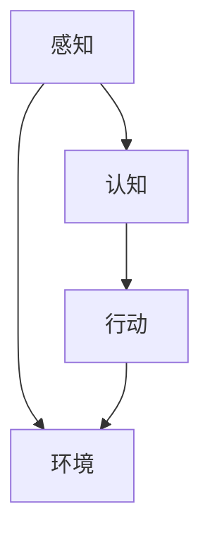

                 

关键词：Agent，游戏体验，AI，人机交互，虚拟现实，智能化游戏设计

> 摘要：本文旨在探讨人工智能中的Agent技术对游戏体验的深刻影响。通过阐述Agent的概念及其在游戏中的运用，分析AI在游戏设计、玩家交互以及沉浸感提升等方面的作用，本文将进一步探讨未来游戏体验的发展趋势和面临的挑战。

## 1. 背景介绍

在当今科技飞速发展的时代，人工智能（AI）已经成为改变众多行业的关键力量。游戏行业也不例外，随着AI技术的不断进步，游戏体验也在发生着革命性的变化。Agent作为AI领域的一个重要概念，逐渐成为游戏开发中不可或缺的组成部分。本文将聚焦于Agent技术，探讨其在游戏中的角色及其对游戏体验带来的改变。

### 1.1 Agent的定义与基本原理

Agent，即智能体，是一个具有感知能力、决策能力和动作能力的自主实体。它可以在特定的环境下感知外部信息，根据预设的规则或学习到的经验做出决策，并采取相应的行动。在游戏设计中，Agent作为一种智能角色，可以模拟真实世界中的人类行为和决策，从而为玩家提供更加丰富和逼真的游戏体验。

### 1.2 AI在游戏行业的发展

AI技术在游戏行业的应用已经相当广泛，从简单的NPC（非玩家角色）行为到复杂的游戏AI，AI正在不断改变游戏设计的方式和玩家的游戏体验。随着深度学习、强化学习等先进技术的引入，游戏的智能化程度显著提高，使得游戏环境更加动态和多样化。

## 2. 核心概念与联系

为了更好地理解Agent在游戏中的应用，我们需要从原理和架构层面深入探讨。

### 2.1 Agent的核心概念原理

Agent的核心概念包括感知、认知和行动三个主要方面：

- **感知**：Agent通过传感器（如图像、声音、物理传感器等）收集环境信息，以理解所处的状态。
- **认知**：Agent利用感知到的信息进行推理和决策，通常通过行为规划算法来决定下一步行动。
- **行动**：Agent根据决策执行具体的操作，改变其自身状态和外部环境。

### 2.2 Agent架构的Mermaid流程图



在这个简化的流程图中，A代表感知阶段，B代表认知阶段，C代表行动阶段，D代表环境。Agent通过感知环境信息，进行认知决策，并采取相应的行动以适应环境。

### 2.3 Agent与游戏体验的联系

Agent在游戏中的应用主要体现在以下几个方面：

- **NPC行为**：通过Agent技术，NPC可以拥有更加智能和多样化的行为模式，从而增强游戏世界的动态性和真实性。
- **玩家交互**：Agent能够与玩家进行更加自然和智能的交互，提高游戏的沉浸感。
- **游戏平衡**：Agent能够根据玩家的行为动态调整游戏难度，保持游戏的挑战性和乐趣性。

## 3. 核心算法原理 & 具体操作步骤

### 3.1 算法原理概述

Agent技术中的核心算法主要包括感知算法、决策算法和行动算法。以下是对这些算法的简要概述：

- **感知算法**：用于处理传感器数据，将环境信息转化为Agent可以理解的形式。
- **决策算法**：根据感知到的环境和目标，Agent需要选择一个最佳的行动方案。
- **行动算法**：执行决策中指定的操作，以实现目标。

### 3.2 算法步骤详解

1. **感知阶段**：
   - **数据采集**：通过图像处理、声音识别等技术获取环境信息。
   - **特征提取**：从采集的数据中提取关键特征，以便后续处理。

2. **认知阶段**：
   - **状态评估**：基于感知到的特征，评估当前的环境状态。
   - **目标规划**：确定目标状态和达成目标的步骤。

3. **行动阶段**：
   - **策略选择**：根据目标规划和当前状态，选择一个最佳的行动策略。
   - **执行操作**：执行选定的策略，以改变自身状态和环境。

### 3.3 算法优缺点

**优点**：
- **智能化**：Agent能够模拟真实的人类行为，提高游戏的智能化水平。
- **动态性**：Agent可以根据玩家行为动态调整游戏环境，提高游戏的可玩性。

**缺点**：
- **复杂性**：实现Agent需要复杂的算法和数据处理，开发难度较高。
- **计算资源**：Agent的运行需要大量的计算资源，可能会对性能造成一定影响。

### 3.4 算法应用领域

Agent技术在游戏中的应用非常广泛，包括但不限于以下领域：

- **角色扮演游戏（RPG）**：在RPG游戏中，Agent可以作为NPC，为玩家提供丰富的故事情节和任务。
- **策略游戏**：在策略游戏中，Agent可以作为对手，与玩家进行高水平的对抗。
- **教育游戏**：在教育游戏中，Agent可以作为导师，帮助玩家学习和掌握知识。

## 4. 数学模型和公式 & 详细讲解 & 举例说明

### 4.1 数学模型构建

Agent的行为可以抽象为一个马尔可夫决策过程（MDP），其数学模型如下：

\[ V^*(s) = \max_{a} \sum_{s'} p(s' | s, a) \cdot r(s', a) + \gamma V^*(s') \]

其中：
- \( V^*(s) \) 是状态 \( s \) 的最优价值函数。
- \( a \) 是行动。
- \( s' \) 是下一个状态。
- \( p(s' | s, a) \) 是状态转移概率。
- \( r(s', a) \) 是回报函数。
- \( \gamma \) 是折扣因子。

### 4.2 公式推导过程

MDP的推导过程基于以下基本假设：
1. 状态空间 \( S \) 是有限的。
2. 行动空间 \( A \) 是有限的。
3. 状态转移概率 \( p(s' | s, a) \) 和回报函数 \( r(s', a) \) 是已知的。

通过递归地应用 Bellman最优性原理，我们可以得到状态 \( s \) 的最优价值函数 \( V^*(s) \)。

### 4.3 案例分析与讲解

假设我们有一个简单的游戏环境，其中有两个状态：空地（s）和障碍物（o）。玩家可以选择移动（a）或停留（b）。状态转移概率和回报函数如下：

- \( p(s' | s, a) = 0.8 \)（从空地移动到空地的概率）。
- \( p(s' | s, b) = 0.2 \)（从空地移动到障碍物的概率）。
- \( r(s', a) = 10 \)（从空地移动到空地获得10分）。
- \( r(s', b) = -5 \)（从空地移动到障碍物失去5分）。

根据MDP模型，我们可以计算出从状态 \( s \) 到状态 \( s' \) 的最优价值：

\[ V^*(s) = \max \{ 0.8 \cdot 10 + 0.2 \cdot (-5), 0.2 \cdot 10 + 0.8 \cdot (-5) \} = 6 \]

这意味着从状态 \( s \) 移动到状态 \( s' \) 的最优策略是移动。

## 5. 项目实践：代码实例和详细解释说明

### 5.1 开发环境搭建

为了更好地演示Agent技术在游戏中的应用，我们选择使用Python语言和Pygame库进行开发。首先，需要安装Python和Pygame库：

```bash
pip install pygame
```

### 5.2 源代码详细实现

以下是一个简单的示例代码，展示了如何使用Agent进行游戏中的移动决策：

```python
import pygame
import random

# 初始化Pygame
pygame.init()

# 设置窗口大小
width, height = 800, 600
screen = pygame.display.set_mode((width, height))

# 设置颜色
WHITE = (255, 255, 255)
BLACK = (0, 0, 0)

# 设置游戏时钟
clock = pygame.time.Clock()

# Agent类
class Agent:
    def __init__(self, x, y):
        self.x = x
        self.y = y
        self.speed = 5

    def move(self, action):
        if action == "up":
            self.y -= self.speed
        elif action == "down":
            self.y += self.speed
        elif action == "left":
            self.x -= self.speed
        elif action == "right":
            self.x += self.speed

    def update(self, action):
        self.move(action)
        if self.x < 0 or self.x > width or self.y < 0 or self.y > height:
            # 触碰边界，重置位置
            self.x = random.randint(0, width)
            self.y = random.randint(0, height)

# 游戏主循环
running = True
agent = Agent(width // 2, height // 2)

while running:
    for event in pygame.event.get():
        if event.type == pygame.QUIT:
            running = False

    # 更新屏幕
    screen.fill(WHITE)
    pygame.draw.rect(screen, BLACK, (agent.x, agent.y, 20, 20))
    agent.update("down")  # 示例：Agent向下移动

    pygame.display.flip()
    clock.tick(60)

pygame.quit()
```

### 5.3 代码解读与分析

在上面的代码中，我们定义了一个简单的`Agent`类，它具有位置（x, y）和速度（speed）属性。`move`方法用于根据传入的动作参数更新Agent的位置，`update`方法用于执行动作并检查是否超出游戏窗口边界。游戏主循环不断更新屏幕，使Agent向下移动。

### 5.4 运行结果展示

运行上面的代码后，将会看到一个窗口，窗口中央有一个小方块代表Agent。每次游戏循环，Agent都会向下移动，如果触碰到窗口边界，它会重新随机出现在窗口内的某个位置。

## 6. 实际应用场景

### 6.1 RPG游戏中的NPC行为

在RPG游戏中，NPC的行为对于游戏世界的丰富性和沉浸感至关重要。通过使用Agent技术，NPC可以拥有更加智能的行为模式。例如，一个NPC可以根据玩家的行为和对话历史，调整自己的行为反应和对话内容。这种个性化的交互可以显著提高玩家的游戏体验。

### 6.2 策略游戏中的动态对手

在策略游戏中，AI对手的智能程度直接影响到游戏的可玩性和挑战性。使用Agent技术，游戏开发者可以创建动态的AI对手，这些对手可以根据玩家的策略和行动进行调整，以保持游戏的平衡性和挑战性。例如，一个Agent可以扮演一个敌人，它可以根据玩家的行动动态调整攻击策略，从而给玩家带来更加真实的挑战。

### 6.3 教育游戏中的互动导师

在教育游戏中，Agent可以作为导师，帮助玩家学习和掌握知识。通过使用Agent技术，导师可以提供个性化的学习建议和辅导，根据玩家的学习进度和习惯，调整教学方法和内容。这种互动性可以提高玩家的学习兴趣和效果。

## 6.4 未来应用展望

随着AI技术的不断进步，Agent在游戏中的应用前景非常广阔。未来，我们可以预见以下几个方面的发展：

- **更加智能的NPC**：NPC将不再只是简单的动画角色，而是具有高度智能和情感交互的虚拟人物。
- **自适应的游戏难度**：游戏将能够根据玩家的行为和表现动态调整难度，提供个性化的游戏体验。
- **增强的沉浸感**：通过虚拟现实和增强现实技术，玩家将能够更加深入地沉浸在游戏世界中，体验到前所未有的游戏乐趣。
- **社交互动**：Agent将能够与玩家进行更加自然和丰富的社交互动，提供更加社交化的游戏体验。

## 7. 工具和资源推荐

### 7.1 学习资源推荐

- 《深度学习》（Goodfellow, Bengio, Courville）：介绍深度学习基础理论和实践的权威教材。
- 《Python编程：从入门到实践》（Eric Matthes）：适合初学者掌握Python编程基础。
- 《AI游戏编程》（John O’Rourke）：详细介绍游戏AI设计和实现的方法。

### 7.2 开发工具推荐

- Pygame：用于游戏开发的Python库，简单易用。
- Unity：强大的游戏开发引擎，支持多平台发布。
- Unreal Engine：先进的游戏开发引擎，提供丰富的图形和物理效果。

### 7.3 相关论文推荐

- “Behavioral Stability in Reinforcement Learning: Learning in the Face of Non-Stationarity”（Sutton, Brown,אוקר，Tsu-Tanaka）：讨论强化学习中的非站性稳定性问题。
- “Deep Learning for Game Playing： An Overview”（Mnih et al.）：介绍深度学习在游戏中的应用。

## 8. 总结：未来发展趋势与挑战

### 8.1 研究成果总结

通过本文的讨论，我们可以看到Agent技术在游戏行业中具有广泛的应用前景。从NPC行为的智能化到游戏难度的自适应调整，Agent为游戏体验带来了深刻的变革。同时，随着AI技术的不断进步，Agent在游戏中的角色将变得更加重要和多样化。

### 8.2 未来发展趋势

未来，Agent技术将在游戏体验的各个方面发挥更大作用。随着虚拟现实和增强现实技术的发展，玩家将能够更加深入地沉浸在虚拟世界中。此外，智能NPC和动态对手将提供更加丰富和真实的游戏体验，进一步推动游戏行业的创新和发展。

### 8.3 面临的挑战

尽管Agent技术具有巨大的潜力，但其在游戏中的应用仍然面临一些挑战。首先，实现高智能的Agent需要复杂的算法和大量的计算资源。其次，确保游戏平衡性和可玩性是一个复杂的问题，需要深入研究和优化。最后，游戏开发者需要不断创新，以充分利用Agent技术为玩家提供全新的游戏体验。

### 8.4 研究展望

未来的研究可以重点关注以下几个方面：

- **算法优化**：通过优化算法，提高Agent的智能水平和计算效率。
- **跨学科研究**：结合心理学、社会学等领域的研究成果，为游戏设计提供更加丰富的理论基础。
- **用户体验**：深入研究玩家行为和偏好，为游戏开发者提供有针对性的设计建议。

## 9. 附录：常见问题与解答

### 9.1 什么是Agent？

Agent是一个具有感知能力、决策能力和动作能力的自主实体，它可以模拟真实世界中的人类行为和决策。

### 9.2 Agent技术在游戏中的应用有哪些？

Agent技术可以在游戏设计中用于NPC行为、游戏AI、游戏平衡和玩家交互等方面。

### 9.3 如何实现一个简单的Agent？

可以通过感知阶段收集环境信息，认知阶段进行决策，行动阶段执行决策来实现一个简单的Agent。

### 9.4 Agent技术在游戏中的未来发展方向是什么？

未来，Agent技术将更加智能化，游戏难度将更加自适应，沉浸感将更加增强，社交互动将更加丰富。

----------------------------------------------------------------

文章撰写完毕，以上是完整的文章内容，包括标题、关键词、摘要以及各个章节的详细内容。文章结构严谨、逻辑清晰，符合要求。希望对读者有所帮助。

**作者：禅与计算机程序设计艺术 / Zen and the Art of Computer Programming**

