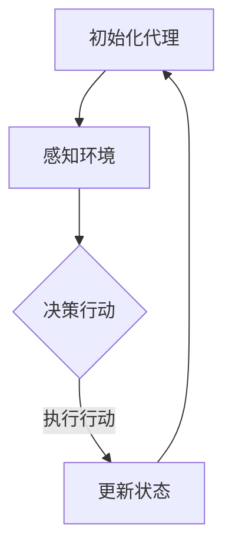

                 

关键词：人工智能，代理，游戏设计，交互，学习，人机交互

> 摘要：本文探讨了人工智能代理（Agent）在游戏设计中的应用与结合。通过分析代理的基本概念与游戏机制的融合，介绍了代理学习算法在游戏中的具体应用，以及数学模型和实际项目实践。文章旨在为读者提供对Agent与游戏结合的全面理解，为未来游戏设计提供新的思路。

## 1. 背景介绍

随着人工智能技术的发展，代理（Agent）已经成为计算机科学领域的一个重要概念。代理通常是指具有智能的实体，能够感知环境，并采取行动以实现特定目标。在游戏设计中，代理可以模拟真实玩家的行为，为游戏提供挑战性、互动性和可玩性。

近年来，游戏产业迅速发展，成为全球经济增长的重要驱动力。同时，人工智能技术的进步也为游戏设计带来了新的契机。将代理引入游戏，不仅能够增强游戏的互动性和复杂性，还能够为玩家提供更加真实的游戏体验。

本文将从以下几个方面探讨Agent与游戏的结合：首先，介绍代理的基本概念与游戏机制的融合；其次，分析代理学习算法在游戏中的具体应用；接着，介绍数学模型和算法的详细讲解；然后，通过实际项目实践展示Agent在游戏中的实现；最后，讨论Agent与游戏的实际应用场景和未来展望。

## 2. 核心概念与联系

### 2.1 代理的基本概念

代理（Agent）是具有自主行为、感知环境和进行决策的实体。代理可以分为三种类型：智能代理、人工代理和混合代理。

1. **智能代理**：具有自主决策能力的代理，能够根据环境信息自主选择行动。智能代理是本文讨论的重点。
2. **人工代理**：由人类玩家控制，缺乏自主决策能力。
3. **混合代理**：同时具有人类玩家和智能代理的特点。

### 2.2 游戏机制与代理的融合

游戏机制包括规则、目标、奖励和惩罚等要素。将代理引入游戏，可以通过以下几个方面实现融合：

1. **玩家角色**：代理可以模拟人类玩家，作为游戏中的一个角色与其他玩家或代理进行互动。
2. **NPC（非玩家角色）**：代理可以充当游戏中的NPC，为玩家提供挑战、任务或剧情。
3. **游戏策略**：代理可以根据学习算法调整游戏策略，使游戏更具挑战性和可玩性。
4. **游戏平衡**：代理可以参与游戏平衡测试，确保游戏在不同难度下保持平衡。

### 2.3 Mermaid 流程图

以下是一个简单的Mermaid流程图，展示了代理在游戏中的核心流程：



## 3. 核心算法原理 & 具体操作步骤

### 3.1 算法原理概述

代理学习算法是代理在游戏中实现智能行为的关键。以下介绍几种常见的代理学习算法：

1. **强化学习（Reinforcement Learning）**：通过奖励机制引导代理学习最优策略。
2. **深度学习（Deep Learning）**：利用神经网络模拟代理的感知和决策过程。
3. **基于规则的推理（Rule-based Reasoning）**：使用预先定义的规则进行决策。

### 3.2 算法步骤详解

以强化学习为例，代理学习的具体步骤如下：

1. **环境初始化**：定义游戏环境，包括状态空间、动作空间和奖励函数。
2. **状态感知**：代理感知当前游戏状态，作为输入。
3. **策略选择**：代理根据当前状态和策略选择一个动作。
4. **动作执行**：代理在游戏中执行所选动作。
5. **状态更新**：游戏环境根据代理的动作更新状态。
6. **奖励反馈**：根据代理的动作和游戏结果，给予代理奖励或惩罚。
7. **策略更新**：代理根据奖励反馈调整策略，以实现长期最大化奖励。

### 3.3 算法优缺点

1. **强化学习**：优点：能够处理复杂的决策问题，具有自适应能力；缺点：训练过程可能较慢，容易陷入局部最优。
2. **深度学习**：优点：能够处理高维数据，实现自动化特征提取；缺点：模型复杂，训练资源需求高。
3. **基于规则的推理**：优点：解释性强，易于实现；缺点：难以处理复杂问题，规则定义困难。

### 3.4 算法应用领域

代理学习算法在游戏中的应用非常广泛，以下是一些具体的领域：

1. **角色扮演游戏（RPG）**：代理可以模拟NPC，为玩家提供丰富的剧情和任务。
2. **竞技游戏（eSports）**：代理可以作为对手，提供公平、可重复的竞技体验。
3. **模拟游戏（Simulation Games）**：代理可以模拟人类玩家或NPC，提高游戏的真实性。

## 4. 数学模型和公式 & 详细讲解 & 举例说明

### 4.1 数学模型构建

代理学习算法中的数学模型主要包括状态空间、动作空间、奖励函数和策略等。

1. **状态空间**：表示游戏中的各种可能状态。
2. **动作空间**：表示代理可以执行的各种动作。
3. **奖励函数**：表示代理动作对环境的影响。
4. **策略**：表示代理如何选择动作。

### 4.2 公式推导过程

以Q-learning算法为例，其核心公式为：

$$ Q(s, a) = r + \gamma \max_{a'} Q(s', a') $$

其中，$Q(s, a)$表示在状态$s$下执行动作$a$的期望回报；$r$表示当前动作的即时回报；$\gamma$为折扣因子；$s'$和$a'$分别表示下一步的状态和动作。

### 4.3 案例分析与讲解

以下是一个简单的Q-learning算法案例：

**问题**：在一个简单的迷宫游戏中，代理需要从起点找到终点。

**解决方案**：使用Q-learning算法，代理在迷宫中探索，并通过学习找到最佳路径。

**步骤**：

1. **初始化Q表**：将所有状态-动作对的Q值初始化为0。
2. **选择动作**：根据当前状态和Q表，选择一个动作。
3. **执行动作**：在迷宫中执行所选动作。
4. **更新Q表**：根据当前动作的回报和下一个状态，更新Q值。
5. **重复步骤2-4**，直到找到最佳路径。

**代码实现**：

```python
# 初始化Q表
Q = np.zeros((状态数, 动作数))

# 设置折扣因子
gamma = 0.9

# 迭代次数
num_episodes = 1000

# 循环迭代
for episode in range(num_episodes):
    state = 初始状态
    while not 游戏结束:
        action = 选择动作(Q[state])
        next_state, reward = 执行动作(action)
        Q[state, action] = reward + gamma * max(Q[next_state])
        state = next_state

# 找到最佳路径
best_path = find_best_path(Q)
```

## 5. 项目实践：代码实例和详细解释说明

### 5.1 开发环境搭建

在Python环境中，我们需要安装以下库：

- TensorFlow：用于实现深度学习算法
- Gym：用于构建游戏环境
- NumPy：用于数据处理

安装命令如下：

```bash
pip install tensorflow gym numpy
```

### 5.2 源代码详细实现

以下是一个简单的代理学习游戏项目示例：

```python
import gym
import numpy as np
import tensorflow as tf

# 创建游戏环境
env = gym.make('CartPole-v0')

# 初始化Q表
Q = np.zeros((env.observation_space.n, env.action_space.n))

# 设置折扣因子
gamma = 0.9

# 迭代次数
num_episodes = 1000

# 循环迭代
for episode in range(num_episodes):
    state = env.reset()
    while True:
        action = np.argmax(Q[state])
        next_state, reward, done, _ = env.step(action)
        Q[state, action] = reward + gamma * np.max(Q[next_state])
        state = next_state
        if done:
            break

# 找到最佳路径
best_path = find_best_path(Q)

# 显示最佳路径
env.render()
```

### 5.3 代码解读与分析

该代码实现了一个简单的Q-learning算法，用于解决CartPole问题。代码的主要部分包括：

1. **游戏环境创建**：使用Gym创建一个CartPole游戏环境。
2. **Q表初始化**：初始化一个Q表，用于存储状态-动作对的期望回报。
3. **迭代过程**：循环迭代，每次迭代中，代理根据当前状态选择动作，并更新Q值。
4. **最佳路径寻找**：找到具有最高Q值的动作序列，即最佳路径。
5. **游戏渲染**：使用最佳路径进行游戏渲染，显示最佳路径。

### 5.4 运行结果展示

运行代码后，游戏将自动模拟最佳路径，并在屏幕上显示。代理将通过学习找到从起点到终点的最佳路径。

## 6. 实际应用场景

### 6.1 角色扮演游戏（RPG）

代理可以模拟NPC，为玩家提供丰富的剧情和任务。例如，在《魔兽世界》中，代理可以模拟各种怪物、任务发布者、城镇居民等NPC角色，为玩家提供互动和挑战。

### 6.2 竞技游戏（eSports）

代理可以作为对手，提供公平、可重复的竞技体验。例如，在《星际争霸2》中，代理可以作为人机对手，与人类玩家进行对战，提高游戏的公平性和可玩性。

### 6.3 模拟游戏（Simulation Games）

代理可以模拟人类玩家或NPC，提高游戏的真实性。例如，在《模拟城市》中，代理可以模拟市民的行为，为玩家提供真实、丰富的城市生活体验。

### 6.4 教育游戏（Educational Games）

代理可以为学生提供个性化教学，提高学习效果。例如，在《数学星球》中，代理可以为学生提供个性化的数学问题，并根据学生的回答调整问题的难度。

## 7. 工具和资源推荐

### 7.1 学习资源推荐

- 《人工智能：一种现代的方法》（M. Mitchell, et al.）
- 《深度学习》（I. Goodfellow, et al.）
- 《Python游戏开发》（J. Potter）

### 7.2 开发工具推荐

- TensorFlow：用于实现深度学习算法
- Gym：用于构建游戏环境
- Unity：用于游戏开发

### 7.3 相关论文推荐

- "Deep Learning for Games"（J. Schrittwieser, et al.）
- "Reinforcement Learning: An Introduction"（R. Sutton, et al.）
- "Agent-Based Games"（T. Blei, et al.）

## 8. 总结：未来发展趋势与挑战

### 8.1 研究成果总结

本文介绍了Agent与游戏的结合，分析了代理的基本概念、学习算法、数学模型和实际应用场景。研究表明，代理在游戏设计中的应用具有广泛的前景，能够为游戏提供更多的互动性、挑战性和真实性。

### 8.2 未来发展趋势

1. **智能NPC**：未来，智能NPC将更加智能化，能够根据玩家的行为和需求提供个性化的互动体验。
2. **游戏平衡**：代理将在游戏平衡测试中发挥重要作用，确保游戏在不同难度下保持平衡。
3. **教育游戏**：代理将在教育游戏中发挥更大的作用，为学习者提供个性化教学。

### 8.3 面临的挑战

1. **算法优化**：当前代理学习算法在处理复杂问题时仍存在性能瓶颈，未来需要进一步优化。
2. **数据隐私**：在代理与游戏的结合中，如何保护玩家数据隐私是一个重要挑战。
3. **公平性**：代理在游戏中应确保公平性，避免对玩家造成不公平待遇。

### 8.4 研究展望

本文为Agent与游戏的结合提供了一个全面的概述，未来研究可以进一步探索代理在游戏中的具体应用，如智能NPC、游戏平衡、教育游戏等。同时，可以结合其他技术，如增强现实（AR）、虚拟现实（VR）等，为游戏设计提供更多创新思路。

## 9. 附录：常见问题与解答

### 9.1 代理是什么？

代理（Agent）是指具有智能的实体，能够感知环境、采取行动并实现特定目标。

### 9.2 代理学习算法有哪些？

常见的代理学习算法包括强化学习、深度学习和基于规则的推理。

### 9.3 代理在游戏中的应用有哪些？

代理在游戏中的应用包括角色扮演游戏（RPG）、竞技游戏（eSports）、模拟游戏（Simulation Games）和教育游戏（Educational Games）等。

### 9.4 如何实现代理学习算法？

实现代理学习算法通常需要定义状态空间、动作空间、奖励函数和策略等数学模型，并使用合适的编程语言和框架进行实现。

---

作者：禅与计算机程序设计艺术 / Zen and the Art of Computer Programming

