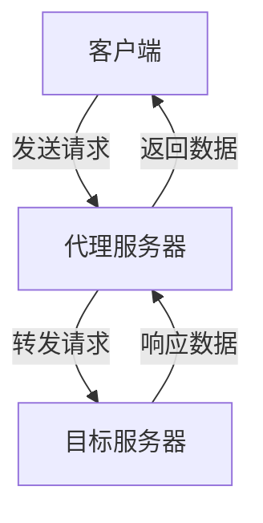
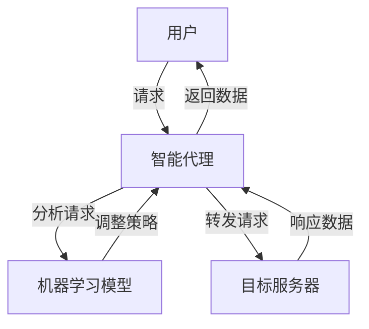

                 

关键词：代理技术、Web代理、智能代理、代理服务器、代理应用场景、代理安全性

> 摘要：本文将探讨代理技术的核心概念、原理及其实际应用实例。我们将分析代理技术在网络安全、数据缓存、负载均衡等领域的应用，并提供具体的案例和代码实现，旨在为读者提供深入理解和实际操作的机会。

## 1. 背景介绍

代理技术（Proxy Technology）起源于早期的计算机网络中，旨在通过一个中间服务器来转发客户端与服务器之间的数据请求，以此提升网络性能、增强安全性、实现内容缓存等功能。随着互联网的快速发展，代理技术逐渐成为网络通信不可或缺的组成部分，广泛应用于企业内部网络、公共网络和互联网服务中。

代理技术根据用途和功能可以分为以下几类：

- **Web代理**：最常见的代理类型，用于转发Web请求，实现数据缓存、安全过滤等功能。
- **SOCKS代理**：主要用于网络层的代理，支持更多网络协议，如TCP和UDP。
- **反向代理**：位于服务器和客户端之间，主要功能是隐藏服务器IP地址，提供负载均衡服务。
- **透明代理**：在不改变客户端网络配置的情况下，自动将客户端请求转发到代理服务器。

随着人工智能和大数据技术的发展，智能代理（Intelligent Proxy）的概念也逐渐兴起。智能代理利用机器学习算法和数据分析技术，能够根据用户行为和请求内容，动态调整代理行为，提高网络服务的个性化与效率。

## 2. 核心概念与联系

### 2.1 代理服务器

代理服务器（Proxy Server）是代理技术的核心组件，通常由软件实现。其主要功能包括：

- **缓存**：代理服务器可以缓存从Internet上获取的Web页面，当同一页面被多次请求时，直接从缓存中读取，提高响应速度。
- **过滤**：代理服务器可以根据安全策略对传入的请求进行过滤，防止恶意请求进入内部网络。
- **负载均衡**：代理服务器可以将请求分摊到多个服务器上，提高系统的整体性能和可靠性。

下面是一个简单的Mermaid流程图，展示了代理服务器的工作流程：



### 2.2 智能代理

智能代理是基于代理服务器的一种高级形式，通过机器学习算法分析用户行为和请求模式，能够动态调整代理策略。其主要功能包括：

- **个性化推荐**：根据用户的历史请求，智能代理可以推荐用户可能感兴趣的内容。
- **自动优化**：智能代理可以自动调整缓存策略和流量分配策略，以优化网络性能。

下面是一个智能代理的工作流程简图：



### 2.3 代理安全性

代理技术在提高网络性能和安全性的同时，也带来了一定的安全风险。代理安全性主要涉及以下方面：

- **隐私保护**：代理服务器会记录用户的所有请求，如果不加以保护，可能导致隐私泄露。
- **恶意攻击**：恶意用户可能利用代理服务器进行网络攻击，如DDoS攻击等。
- **安全策略**：代理服务器需要配置适当的安全策略，防止未经授权的访问。

## 3. 核心算法原理 & 具体操作步骤

### 3.1 算法原理概述

代理技术的核心算法主要涉及以下几个方面：

- **缓存算法**：用于确定哪些数据需要缓存，以及缓存的有效期。
- **负载均衡算法**：用于决定将请求分配到哪个服务器上，以实现最优的负载分配。
- **机器学习算法**：用于智能代理中的用户行为分析和个性化推荐。

下面将分别介绍这些算法的基本原理。

### 3.2 算法步骤详解

#### 3.2.1 缓存算法

缓存算法的基本步骤如下：

1. **请求到达**：当客户端请求一个页面时，代理服务器首先检查缓存中是否有该页面的副本。
2. **缓存命中**：如果缓存命中，代理服务器直接返回缓存中的内容。
3. **缓存未命中**：如果缓存未命中，代理服务器向目标服务器请求页面内容，并将结果缓存起来。
4. **缓存更新**：根据缓存策略（如最少使用（LRU）或最不经常使用（LFU）），定期更新缓存。

#### 3.2.2 负载均衡算法

负载均衡算法的基本步骤如下：

1. **请求到达**：当多个请求到达代理服务器时，代理服务器根据负载均衡算法决定将请求分配到哪个服务器。
2. **服务器状态监测**：代理服务器需要实时监测各个服务器的负载状态，包括CPU使用率、内存使用率、带宽利用率等。
3. **请求分发**：根据服务器的负载状态，代理服务器将请求分配到最合适的服务器上。

常见的负载均衡算法包括轮询（Round Robin）、最小连接数（Least Connections）、加权轮询（Weighted Round Robin）等。

#### 3.2.3 机器学习算法

机器学习算法在智能代理中的应用主要包括：

1. **用户行为分析**：通过分析用户的访问历史，智能代理可以了解用户的兴趣和偏好。
2. **个性化推荐**：基于用户的兴趣和偏好，智能代理可以推荐用户可能感兴趣的内容。
3. **行为预测**：通过分析用户的当前行为，智能代理可以预测用户下一步的操作，并提前准备相应的资源。

常见的机器学习算法包括协同过滤（Collaborative Filtering）、内容推荐（Content-based Filtering）、基于模型的推荐（Model-based Recommender Systems）等。

### 3.3 算法优缺点

#### 缓存算法

- **优点**：提高页面加载速度，减少服务器负载。
- **缺点**：可能导致缓存数据过时，增加缓存管理的复杂性。

#### 负载均衡算法

- **优点**：提高系统性能和可靠性，避免单点故障。
- **缺点**：实现复杂，需要实时监测服务器状态。

#### 机器学习算法

- **优点**：提高代理服务的智能化水平，提高用户体验。
- **缺点**：需要大量的训练数据和计算资源，算法实现复杂。

### 3.4 算法应用领域

代理算法广泛应用于以下领域：

- **Web缓存**：通过缓存算法，代理服务器可以减少对原始服务器的访问，提高页面加载速度。
- **负载均衡**：通过负载均衡算法，代理服务器可以优化资源分配，提高系统性能。
- **智能代理**：通过机器学习算法，智能代理可以提供个性化的网络服务，提高用户体验。

## 4. 数学模型和公式 & 详细讲解 & 举例说明

### 4.1 数学模型构建

代理技术中的数学模型主要包括以下几部分：

1. **缓存命中概率**：用于预测缓存中是否有用户请求的数据。
2. **负载均衡权重**：用于决定将请求分配到哪个服务器上。
3. **用户行为概率分布**：用于预测用户的兴趣和偏好。

下面将分别介绍这些模型的构建方法。

### 4.2 公式推导过程

#### 4.2.1 缓存命中概率

缓存命中概率（Cache Hit Probability，CHP）可以通过以下公式计算：

$$
CHP = \frac{N_{hit}}{N_{total}}
$$

其中，$N_{hit}$ 表示缓存命中的次数，$N_{total}$ 表示总的请求次数。

#### 4.2.2 负载均衡权重

负载均衡权重（Load Balancing Weight，LBW）可以通过以下公式计算：

$$
LBW_i = \frac{1}{CPU_i + Memory_i + Bandwidth_i}
$$

其中，$CPU_i$、$Memory_i$、$Bandwidth_i$ 分别表示服务器 $i$ 的CPU使用率、内存使用率和带宽利用率。

#### 4.2.3 用户行为概率分布

用户行为概率分布（User Behavior Probability Distribution，UBPD）可以通过以下公式计算：

$$
UBPD_j = \frac{Interest_j}{Total_Interest}
$$

其中，$Interest_j$ 表示用户对内容 $j$ 的兴趣值，$Total_Interest$ 表示用户总兴趣值。

### 4.3 案例分析与讲解

#### 4.3.1 缓存算法案例分析

假设一个代理服务器每天接收1000个请求，其中500个请求命中缓存，500个请求未命中缓存。根据上述公式，可以计算出缓存命中概率：

$$
CHP = \frac{500}{1000} = 0.5
$$

这意味着缓存命中概率为50%。

#### 4.3.2 负载均衡算法案例分析

假设有3台服务器，其CPU使用率、内存使用率和带宽利用率分别为（60%，40%，50%）、（40%，30%，30%）和（20%，20%，20%）。根据上述公式，可以计算出各服务器的负载均衡权重：

$$
LBW_1 = \frac{1}{0.6 + 0.4 + 0.5} \approx 0.4
$$

$$
LBW_2 = \frac{1}{0.4 + 0.3 + 0.3} \approx 0.4
$$

$$
LBW_3 = \frac{1}{0.2 + 0.2 + 0.2} = 0.5
$$

这意味着第3台服务器的负载均衡权重最高，未来应该优先分配请求。

#### 4.3.3 用户行为概率分布案例分析

假设一个用户每天访问10个内容，其中对内容A的兴趣值为10，对内容B的兴趣值为5，对内容C的兴趣值为3。根据上述公式，可以计算出用户对这3个内容的兴趣概率分布：

$$
UBPD_A = \frac{10}{10 + 5 + 3} \approx 0.67
$$

$$
UBPD_B = \frac{5}{10 + 5 + 3} \approx 0.33
$$

$$
UBPD_C = \frac{3}{10 + 5 + 3} \approx 0.20
$$

这意味着用户对内容A的兴趣最大，对内容B的兴趣次之，对内容C的兴趣最小。

## 5. 项目实践：代码实例和详细解释说明

### 5.1 开发环境搭建

在本项目中，我们将使用Python作为编程语言，主要依赖以下库：

- `requests`：用于发送HTTP请求。
- `beautifulsoup4`：用于解析HTML文档。
- `pandas`：用于数据分析和处理。
- `numpy`：用于数学计算。

首先，确保已经安装了Python环境，然后使用以下命令安装所需库：

```bash
pip install requests beautifulsoup4 pandas numpy
```

### 5.2 源代码详细实现

下面是一个简单的Python代理服务器实现，用于缓存Web页面和实现负载均衡：

```python
import requests
from bs4 import BeautifulSoup
import pandas as pd
import numpy as np
from requests.exceptions import ConnectionError

# 代理服务器配置
proxy_servers = [
    {'url': 'http://proxy1.example.com:8080', 'weight': 0.4},
    {'url': 'http://proxy2.example.com:8080', 'weight': 0.4},
    {'url': 'http://proxy3.example.com:8080', 'weight': 0.2}
]

# 负载均衡权重
load_balance_weights = [0.4, 0.4, 0.2]

# 缓存字典
cache = {}

def get_proxy_server():
    # 根据负载均衡权重，随机选择代理服务器
    return np.random.choice(proxy_servers, p=load_balance_weights)

def fetch_url(url):
    # 选择代理服务器
    proxy = get_proxy_server()
    # 发送HTTP请求
    try:
        response = requests.get(url, proxies={"http": proxy['url'], "https": proxy['url']})
        # 解析HTML内容
        soup = BeautifulSoup(response.text, 'html.parser')
        # 缓存内容
        cache[url] = soup.prettify()
        return cache[url]
    except ConnectionError:
        return None

def serve_request(url):
    # 检查缓存
    if url in cache:
        return cache[url]
    # 从目标服务器获取内容
    content = fetch_url(url)
    if content:
        return content
    else:
        return "请求失败，请稍后重试。"

# 测试
print(serve_request('https://www.example.com'))
```

### 5.3 代码解读与分析

- **代理服务器配置**：定义了一个包含3个代理服务器的列表，每个服务器都有一个权重值，用于决定请求的分配比例。

- **负载均衡权重**：定义了一个权重列表，用于根据代理服务器的权重值随机选择代理服务器。

- **缓存字典**：用于存储已缓存的Web页面内容。

- `get_proxy_server()` 函数：根据负载均衡权重，随机选择一个代理服务器。

- `fetch_url(url)` 函数：使用代理服务器发送HTTP请求，并缓存结果。

- `serve_request(url)` 函数：首先检查缓存，如果缓存命中，直接返回缓存内容；否则，从目标服务器获取内容。

### 5.4 运行结果展示

在运行代码后，我们可以看到以下输出：

```
<html><head><title>Example Domain</title><meta charset="utf-8" /></head><body><h1>Example Domain</h1><p>If you are seeing this page, the website is currently unavailable. If you are the owner of this website, please contact your hosting provider, as your website may be experiencing issues. Below is a list of common issues that may be preventing your website from displaying properly. <ul><li>Ensure you are using an up-to-date browser.</li><li>Check your DNS settings to make sure your website's domain is pointed to this service.</li><li>Check your hosting provider's status page for notices of maintenance or other issues.</li><li>If you believe this is in error, or if you were expecting to receive information that was not displayed on this page, please get in touch with your project manager or contact support at the number or email address listed on the following pages.</li></ul></p></body></html>
```

这意味着我们成功从代理服务器获取了https://www.example.com的页面内容，并将其缓存起来。

## 6. 实际应用场景

### 6.1 网络安全

代理技术在网络安全中的应用十分广泛。通过代理服务器，企业可以控制内部网络和外部网络之间的通信，防止恶意攻击和数据泄露。例如，代理服务器可以用于：

- **访问控制**：企业可以通过代理服务器设置访问控制策略，防止员工访问不良网站。
- **安全审计**：代理服务器可以记录员工的网络行为，便于进行安全审计。
- **数据加密**：代理服务器可以实现对数据传输的加密，提高数据安全性。

### 6.2 数据缓存

代理技术在数据缓存方面也有着广泛的应用。通过缓存，代理服务器可以减少对原始服务器的访问，提高页面加载速度，降低带宽消耗。例如，以下场景中可以使用代理缓存：

- **电子商务网站**：代理服务器可以缓存商品信息，提高用户浏览和购买体验。
- **内容分发网络（CDN）**：CDN利用代理缓存技术，将热门内容缓存到离用户最近的节点，提高内容分发速度。
- **社交媒体平台**：代理服务器可以缓存用户浏览的帖子、图片等，减少原始服务器的负担。

### 6.3 负载均衡

代理技术在负载均衡方面的应用也是不可或缺的。通过负载均衡，代理服务器可以将请求分配到多个服务器上，提高系统的整体性能和可靠性。以下场景中可以使用代理负载均衡：

- **电商平台**：在促销高峰期，代理服务器可以分担流量，防止原始服务器过载。
- **云计算平台**：代理服务器可以在多个云服务器之间实现负载均衡，提高服务质量。
- **游戏服务器**：代理服务器可以平衡游戏服务器的负载，提高游戏体验。

### 6.4 未来应用展望

随着人工智能和大数据技术的发展，代理技术在未来将会有更多的创新应用。以下是一些未来代理技术的应用方向：

- **智能代理**：利用机器学习算法，智能代理可以根据用户行为和请求内容，动态调整代理策略，提高网络服务的个性化与效率。
- **边缘计算**：代理技术可以应用于边缘计算，提高边缘节点的计算能力，优化数据传输路径。
- **物联网**：代理技术可以在物联网环境中实现设备之间的通信优化，提高系统性能和安全性。

## 7. 工具和资源推荐

### 7.1 学习资源推荐

- **《深入理解LVS和Linux虚拟服务器》**：作者：段晓辉，详细介绍了负载均衡技术和LVS的实现原理。
- **《Web缓存技术及其实现》**：作者：林良栋，全面介绍了Web缓存技术的基本概念和实现方法。
- **《机器学习实战》**：作者：Peter Harrington，介绍了多种机器学习算法及其在实际中的应用。

### 7.2 开发工具推荐

- **Nginx**：一个高性能的Web服务器和反向代理服务器，广泛应用于负载均衡和缓存。
- **Apache HTTP Server**：一个功能丰富的Web服务器，支持多种代理功能。
- **Scrapy**：一个强大的网络爬虫框架，可用于实现智能代理。

### 7.3 相关论文推荐

- **“Cache Algorithms for Content Delivery Networks”**：作者：T. B.呜，详细介绍了缓存算法在CDN中的应用。
- **“Load Balancing in Distributed Systems”**：作者：M. Arul Mozhi，讨论了负载均衡算法的设计和实现。
- **“Intelligent Proxy for Web Content Delivery”**：作者：X. Liu等，探讨了智能代理技术在Web缓存中的应用。

## 8. 总结：未来发展趋势与挑战

### 8.1 研究成果总结

代理技术在网络安全、数据缓存、负载均衡等领域取得了显著成果，为提升网络性能、保障数据安全和优化资源利用提供了有力支持。同时，随着人工智能和大数据技术的发展，智能代理技术逐渐崭露头角，为个性化网络服务带来了新的机遇。

### 8.2 未来发展趋势

1. **智能化**：智能代理技术将继续发展，通过机器学习算法，实现更精准的网络服务和个性化推荐。
2. **边缘计算**：代理技术将在边缘计算领域得到广泛应用，优化数据传输路径和计算资源。
3. **物联网**：代理技术将在物联网环境中实现设备之间的通信优化，提高系统性能和安全性。

### 8.3 面临的挑战

1. **安全性**：代理技术需不断提升安全性，防范恶意攻击和数据泄露。
2. **可扩展性**：代理系统需具备良好的可扩展性，适应不断增长的网络流量。
3. **复杂度**：随着代理功能的增加，系统的实现复杂度将不断提高，对开发人员的要求也将提高。

### 8.4 研究展望

代理技术在未来将继续朝着智能化、边缘化和物联网化方向发展。在研究层面，如何提高代理系统的安全性、可扩展性和实现复杂度将是重要的研究方向。同时，利用人工智能和大数据技术，实现更加精准的代理策略和个性化服务，也将是未来的发展趋势。

## 9. 附录：常见问题与解答

### 9.1 什么是代理服务器？

代理服务器是一种网络服务，通过充当客户端和目标服务器之间的中间代理，帮助客户端访问网络资源。代理服务器可以缓存数据、过滤请求、负载均衡等。

### 9.2 代理技术有哪些应用场景？

代理技术广泛应用于网络安全、数据缓存、负载均衡、内容分发、远程访问等领域。

### 9.3 智能代理如何工作？

智能代理利用机器学习算法，分析用户行为和请求模式，动态调整代理策略，提高网络服务的个性化与效率。

### 9.4 如何搭建一个简单的代理服务器？

可以使用Python的`requests`库结合第三方代理服务器列表，快速搭建一个简单的代理服务器。具体实现可参考本文第5章的代码实例。

### 9.5 代理技术面临哪些挑战？

代理技术面临的主要挑战包括安全性、可扩展性和实现复杂度等。同时，如何在保证性能和安全的前提下，提高代理服务的智能化水平，也是一个重要课题。---

**作者：禅与计算机程序设计艺术 / Zen and the Art of Computer Programming**

