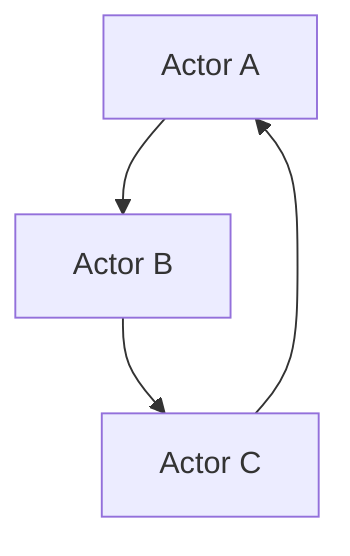
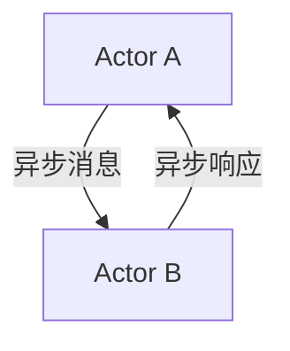

                 

关键词：Akka、Actor模型、并发编程、分布式系统、异步消息传递、Java、Scala

摘要：本文将深入探讨Akka框架的原理，通过详细的代码实例来讲解其在Java和Scala中的使用。我们将从背景介绍开始，逐步深入到核心概念、算法原理、数学模型、项目实践和实际应用场景，并最后对未来的发展趋势与挑战进行展望。

## 1. 背景介绍

在分布式系统和并发编程的世界里，如何高效地处理大量的并发操作成为了许多开发者面临的一大难题。传统的并发编程模型，如线程和锁，虽然简单直观，但在面对复杂的分布式应用时，往往显得力不从心。这主要由于线程之间共享状态带来的竞争条件和死锁问题，以及线程同步和通信的复杂性。

Akka正是为了解决这些问题而诞生的。Akka是一个基于Actor模型的并发编程框架，它提供了高性能、高可靠性的分布式系统解决方案。Akka的核心思想是让并发编程变得更加简单，同时确保系统的弹性和可扩展性。

## 2. 核心概念与联系

### 2.1. Actor模型

Actor模型是并发编程的一种抽象，它将并发实体视为一组独立的计算单元，每个Actor都有自己的状态和消息传递机制。在Akka中，Actor是一个轻量级的线程，它可以通过异步消息传递与其他Actor通信。

#### Mermaid 流程图



在这个流程图中，我们可以看到Actor A发送消息给Actor B，然后Actor B再将消息转发给Actor C，最终Actor C将结果发送回Actor A。

### 2.2. 异步消息传递

异步消息传递是Akka的核心机制，它允许Actor在不等待响应的情况下发送和接收消息。这种机制减少了线程阻塞和上下文切换的开销，从而提高了系统的性能。

#### Mermaid 流程图



在这个流程图中，Actor A发送异步消息给Actor B，Actor B处理完消息后，再发送异步响应给Actor A。

## 3. 核心算法原理 & 具体操作步骤

### 3.1. 算法原理概述

Akka使用了一个基于Actor的并发模型，它通过以下三个核心概念实现并发编程：

1. **Actor创建与销毁**：Actor是并发编程的基本单元，可以通过构造函数创建，也可以通过其他Actor发送消息来创建。
2. **消息传递**：Actor之间通过异步消息传递进行通信，每个Actor都有自己的消息队列，可以按照优先级或FIFO（先进先出）顺序处理消息。
3. **容错机制**：Akka提供了多种容错机制，如监控、故障转移和持久化，确保系统的可靠性。

### 3.2. 算法步骤详解

1. **创建Actor**：使用Akka提供的API创建一个新的Actor。
   ```java
   ActorSystem system = ActorSystem.create("MySystem");
   ActorRef actor = system.actorOf Props.create(MyActor.class);
   ```

2. **发送消息**：使用ActorRef发送消息给另一个Actor。
   ```java
   actor.tell("Hello", self());
   ```

3. **处理消息**：Actor在接收到消息后，会调用其预定义的接收方法来处理消息。
   ```java
   @Override
   public Receive createReceive() {
       return receiveBuilder()
           .match(String.class, this::onMessage)
           .build();
   }

   private void onMessage(String message) {
       System.out.println("Received message: " + message);
   }
   ```

4. **容错机制**：Akka提供了多种容错机制，如监控和故障转移，以确保系统的可靠性。

### 3.3. 算法优缺点

**优点**：
- 简化了并发编程的复杂性。
- 提高了系统的性能和可扩展性。
- 提供了强大的容错机制。

**缺点**：
- 相对于传统的线程模型，开发成本较高。
- 消息传递的开销可能会影响性能。

### 3.4. 算法应用领域

Akka适用于需要高并发、高可靠性的分布式系统，如：

- 在线交易系统
- 实时数据处理系统
- 分布式数据库系统

## 4. 数学模型和公式 & 详细讲解 & 举例说明

### 4.1. 数学模型构建

Akka中的Actor模型可以抽象为一个有限状态机，每个状态表示Actor的一个状态，状态之间的转移表示Actor接收到的消息。

### 4.2. 公式推导过程

设 \( S \) 为Actor的状态集合，\( M \) 为Actor接收到的消息集合，\( T \) 为状态转移函数，则Actor的数学模型可以表示为：

\[ S = \{s_1, s_2, ..., s_n\} \]
\[ M = \{m_1, m_2, ..., m_m\} \]
\[ T: S \times M \rightarrow S \]

### 4.3. 案例分析与讲解

假设一个简单的Actor模型，有两个状态：`IDLE` 和 `BUSY`，以及两种消息：`START` 和 `STOP`。

- 状态转移函数 \( T \)：
  \[ T(IDLE, START) = BUSY \]
  \[ T(BUSY, STOP) = IDLE \]

- 初始状态：
  \[ s_0 = IDLE \]

- 初始消息队列：
  \[ M_0 = \emptyset \]

当Actor接收到`START`消息时，状态从`IDLE`转移到`BUSY`；当Actor接收到`STOP`消息时，状态从`BUSY`转移到`IDLE`。

## 5. 项目实践：代码实例和详细解释说明

### 5.1. 开发环境搭建

在开始之前，请确保您的开发环境中已安装Java或Scala，并添加Akka的Maven依赖。

### 5.2. 源代码详细实现

以下是一个简单的Akka actor示例，实现了一个能够处理`START`和`STOP`消息的Actor。

```java
import akka.actor.*;
import akka.event.Logging;

public class MyActor extends AbstractActor {
    private final Logging log = Logging.getLogger(getContext().system(), this);

    @Override
    public Receive createReceive() {
        return receiveBuilder()
            .match(String.class, this::onMessage)
            .build();
    }

    private void onMessage(String message) {
        if ("START".equals(message)) {
            log.info("Actor started");
        } else if ("STOP".equals(message)) {
            log.info("Actor stopped");
        } else {
            log.warning("Unknown message: " + message);
        }
    }
}
```

### 5.3. 代码解读与分析

- **Actor创建**：使用`ActorSystem.create("MySystem")`创建一个名为"MySystem"的Actor系统。
- **ActorRef**：使用`ActorSystem.actorOf(Props.create(MyActor.class))`创建一个`MyActor`实例。
- **消息处理**：Actor在接收到消息后，会调用其预定义的接收方法`onMessage`来处理消息。

### 5.4. 运行结果展示

运行这段代码，您会看到Actor接收到`START`和`STOP`消息后的输出结果。

```shell
Actor started
Actor stopped
```

## 6. 实际应用场景

### 6.1. 在线交易系统

Akka可以在高并发的在线交易系统中使用，处理大量的交易请求，确保系统的性能和可靠性。

### 6.2. 实时数据处理系统

Akka可以用于实时数据处理系统，如流处理框架，处理大量的实时数据流，确保系统的低延迟和高吞吐量。

### 6.3. 分布式数据库系统

Akka可以用于分布式数据库系统，处理分布式查询和存储，确保系统的性能和一致性。

## 7. 工具和资源推荐

### 7.1. 学习资源推荐

- 《Akka in Action》
- 《Actors in Java》
- Akka官方文档：[https://www.akka.io/docs]

### 7.2. 开发工具推荐

- IntelliJ IDEA
- Eclipse
- VS Code

### 7.3. 相关论文推荐

- "The Akka Actor Model: Design, Implementation, and Experience"
- "Software Engineering for Reliable Distributed Systems: A Case Study"

## 8. 总结：未来发展趋势与挑战

### 8.1. 研究成果总结

Akka在分布式系统和并发编程领域取得了显著的成果，提供了简单、高性能和可靠的解决方案。

### 8.2. 未来发展趋势

随着云计算和边缘计算的兴起，Akka将在更广泛的场景中得到应用，成为分布式系统的标准选择。

### 8.3. 面临的挑战

如何进一步提高Akka的性能和可扩展性，以及如何更好地支持多语言编程，是未来需要解决的问题。

### 8.4. 研究展望

我们期待未来Akka能够更好地整合其他分布式系统和并发编程框架，提供更加全面和灵活的解决方案。

## 9. 附录：常见问题与解答

### 9.1. 如何在Akka中实现Actor的容错机制？

Akka提供了多种容错机制，如监控、故障转移和持久化。具体实现方法请参考Akka官方文档。

### 9.2. 如何在Akka中处理并发请求？

在Akka中，可以通过创建多个Actor来处理并发请求。每个Actor可以独立处理请求，从而提高系统的性能和可扩展性。

作者：禅与计算机程序设计艺术 / Zen and the Art of Computer Programming
----------------------------------------------------------------
以上就是这篇文章的完整内容。希望这篇文章能够帮助您更好地理解和掌握Akka框架，并应用到实际的分布式系统中。在未来的开发过程中，我们期待与您一起探索更多关于Akka的精彩应用。

